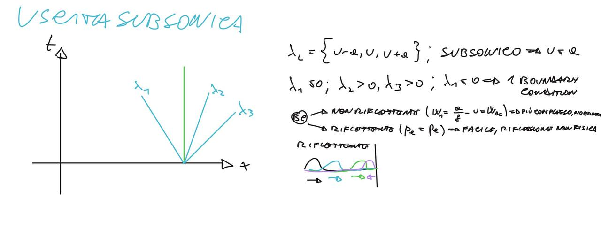

# Domande d'Esame — Fluidodinamica Computazionale dei Sistemi Propulsivi (SP)

> Raccolta di **tutte le domande effettivamente proposte all'esame** (prof. Ferrero) finora
> collezionate. Le **domande tipo generate dall'IA** (solo per esercitarsi) sono state spostate
> nel file separato **[`Domande_AI_generate_SP.md`](./Domande_AI_generate_SP.md)** per tenere
> questo file pulito con le sole domande reali.
> Le risposte sono compilate a partire dai file di `teoria/`, dal **report delle esercitazioni**
> (`Latex/*.tex`) e dai dati delle simulazioni.

---

## Modalità d'esame

- **Orale** di circa **30 minuti**.
- **Tre domande**: le **prime due sulla teoria**, l'**ultima sull'esercitazione** (il report).
- Per questo motivo le domande raccolte sulla **teoria** sono molte di più di quelle
  sull'**esercitazione**: a parità di studenti, di teoria ne sono state fatte di più.
- La domanda di esercitazione dura ~10 minuti: un solo punto ben sviluppato (es. l'estrapolazione
  di Richardson sul bump) copre già il tempo; spesso il docente ferma prima e aggiunge un dettaglio.

## Legenda (distinzione visiva)

| Marcatore | Significato |
|---|---|
| 🟦 **[T]** | Domanda di **teoria** — *realmente proposta* all'esame |
| 🟩 **[E]** | Domanda di **esercitazione / report** — *realmente proposta* (sempre **in fondo**) |
| 🤖 **[AI]** | Domanda **generata dall'IA** — *NON proposta davvero* → spostata in [`Domande_AI_generate_SP.md`](./Domande_AI_generate_SP.md) |

> Formato: blocchi *toggle* `
` (incollabili in Notion), **parole chiave** in grassetto,
> formule in LaTeX (`$...$` inline, `$$...$$` display). Stessa convenzione di `teoria/`.

---

# 🟦 PARTE TEORICA (domande realmente proposte)

<strong>🗓️ Domande raccolte agli APPELLI RECENTI (prof. Ferrero) — riepilogo</strong>

> Raccolte dal gruppo del corso. **Ignorate** le domande di un altro corso (prof. *Ferlauto*, che erano
> finite per errore nello stesso gruppo). Confermano/arricchiscono le sezioni sotto.

**Teoria (Ferrero):**
- Equazioni di Eulero (anche **stazionarie**): cosa se ne può dire, **caratteristiche** e **invarianti di Riemann** → *sez. 1, 2*.
- **Differenza Eulero vs RANS** e le **sorgenti di perdite/dissipazione** (Eulero: urti; RANS: urti + **viscosità turbolenta** che si aggiunge a quella molecolare già presente in NS) → *sez. 1, 4, 6*.
- **Problema di Riemann** e **metodo di Godunov**, poi in generale gli **upwind** e le **varianti** (Osher, Roe) → *sez. 3*.
- **Gradienti su griglie non strutturate**: Green–Gauss e **minimi quadrati (con e senza pesi)**; **gradiente all'interfaccia** (sistemi con termine **diffusivo**) → *sez. 3*.
- **Limitatori di pendenza**: schemi di **2° grado** (come si calcola la pendenza, come si **limita**); su **griglie strutturate** perché si usano e come si **scrivono** (almeno **minmod**, poi superbee); **schemi espliciti vs impliciti** → *sez. 3*.
- **Metodi numerici di ordine superiore al 2°** → *sez. 3*.
- **Condizioni al contorno** per Eulero: **uscita supersonica e subsonica** (e condizioni su paletta/parete) → *sez. 2*.
- **Metodo delle caratteristiche per il pistone con moto accelerato** → *sez. 2*.
- **Calcolo dei flussi turbolenti** (differenze, pregi/difetti) e nello specifico la **LES** → *sez. 4*.

**Relazione / esercitazioni (Ferrero):**
- **Convergenza temporale** = norma (es. $L_2$) dei **residui**; commento del **campo di moto** della paletta e **confronto con dati sperimentali**.
- **Doppia rampa:** commentare il **campo di Mach** identificando **urti e strutture**, e **riconoscerle** anche nel grafico della **pressione a parete**.
- **$M_{is}$ (Mach isentropico) a parete** della turbina, **bordo di fuga**, come si **calcola**; **come si ricava** il Mach isentropico e **perché si chiama isentropico**.
- **Causa di dissipazione e caduta di $p_{tot}$ nelle RANS**.
- **Ottimizzazione:** descrivere il problema, **fronte di Pareto**, risultati finali → *sez. 8*.

*(Nessuna domanda sostanzialmente nuova rispetto alle sezioni esistenti: i dettagli sopra le arricchiscono.)*

<strong>📊 Frequenza delle domande (cosa esce più spesso)</strong>

> Conteggio (**qualitativo**) delle occorrenze sugli appelli raccolti (giu–lug 2026, prof. Ferrero).
> Serve a **dare priorità** allo studio: non è statistica rigorosa, ma il segnale è chiaro.

**🔥 Molto frequenti (≈5+ volte) — da sapere benissimo**

| Argomento | Dove |
|---|---|
| **RANS vs Eulero**, sorgenti di dissipazione/perdite, **viscosità turbolenta**, **LES** | *sez. 4* |
| **Esercitazione paletta (LS59)**: campi di Mach/pressione, **$M_{is}$ isentropico a parete**, bordo di fuga, confronto sperimentale/RANS | *sez. E* |
| **Condizioni al contorno di uscita** (sub/supersonica) e regime del flusso | *sez. 2* |

**⭐ Frequenti (≈3–4 volte)**

| Argomento | Dove |
|---|---|
| **Gradienti** su griglie non strutturate (Green–Gauss, minimi quadrati **con/senza pesi**), gradiente all'**interfaccia** (termine diffusivo) | *sez. 3* |
| **Pistone in moto accelerato** (caratteristiche, invarianti di Riemann, **Rankine–Hugoniot**) | *sez. 2* |
| **Godunov / upwind / problema di Riemann** e varianti (Osher, **Roe**) | *sez. 3* |
| **Limitatori di pendenza** (minmod, superbee) e schemi di **2° ordine** nello spazio | *sez. 3* |
| **Esercitazione rampa / doppia presa**: campo di Mach, urti e strutture, **$p_{wall}$** | *sez. E* |
| **Convergenza** (di griglia con **Richardson**; temporale = norma dei residui) | *sez. E* |
| **BC a parete** per Eulero (impostazione con le **caratteristiche**) | *sez. 2* |

**▫️ Occasionali (1–2 volte)**

| Argomento | Dove |
|---|---|
| **Ottimizzazione** di forma (fronte di **Pareto**) | *sez. 8* |
| **Metodi ODE** espliciti/impliciti (scrivere **Eulero implicito**), stabilità | *sez. 3* |
| Flusso **ellittico vs iperbolico**, teoria dei segnali | *sez. 1–2* |
| **Strato limite** e processo iterativo per $\tau$ | *sez. 4* |
| **Schemi di ordine > 2** (WENO, Discontinuous Galerkin) | *sez. 3* |

**Lettura d'insieme:** l'esame è **2 domande di teoria + 1 di esercitazione**. Le due "teste di serie"
sono **turbolenza (RANS/LES)** e **condizioni al contorno**; sull'esercitazione domina la **paletta LS59**
(Mach, $M_{is}$, confronto con RANS/esperimento). Preparare bene questi tre blocchi copre la maggioranza
degli appelli.

<strong>🗓️ Domande per data (registro degli appelli)</strong>

> Trascrizione fedele delle domande raccolte, **raggruppate per appello/data**. Formato: le prime due
> voci sono teoria, l'ultima esercitazione (quando distinguibile). Sono **ignorate** le domande del corso
> del prof. *Ferlauto* (finite per errore nello stesso gruppo).

**📅 01/07**
- Gradiente di centro cella (**Green–Gauss** e **minimi quadrati pesati**).
- **Condizione al contorno a parete** con **onda d'urto**.
- *Esercitazione:* **estrapolazione di Richardson**; strutture della **pala di turbina**; perché si impone
  la **pressione all'uscita** nonostante il flusso sia supersonico → *il flusso è supersonico ma **non in
  direzione normale** alle celle del bordo d'uscita, lungo cui è **subsonico***.

**📅 23/06 (Ferrero)**
- **Pistone in accelerazione**: tutto — incognite e valori noti; ricorda le **BC a $t=0$** e **lungo la
  traiettoria** del pistone.
- **RANS** in generale, focus sulla **viscosità turbolenta** + **LES**.
- **Rampa supersonica**: descrivere onde ed espansioni; spiegare perché, **pur essendo in Eulero 2D**, si
  ha **variazione di entropia** (attraverso gli **urti**).

**📅 22/06**
- **Condizione al contorno a parete** per Eulero (voleva quella con le **linee caratteristiche**).
- **Strato limite** e **processo iterativo** per trovare $\tau$.
- *Esercitazione* con **Azteco** (solver lineare).
- *(altri studenti stessa finestra)*
  - Flusso **ellittico vs iperbolico**, **teoria dei segnali**; **pistone accelerato** & **Rankine–Hugoniot**;
    **LES**; esercitazione **rampa + paletta** (commentare grafici $M_{is}$ e campi di Mach).
  - **Metodi per flussi turbolenti** (differenze, pregi/difetti) e nello specifico la **LES**; condizioni di
    **uscita** per flusso sub/supersonico; esercitazione **paletta** (campi di Mach e pressione, BC imposte).
  - Calcolo del **gradiente all'interfaccia** con **termine diffusivo**; metodo di **Godunov** e varianti
    (**Osher, Roe**); esercitazione **ottimizzazione** (problema, **fronte di Pareto**, risultati) e **doppia
    rampa** (campo di Mach, strutture, e riconoscerle nel grafico della **pressione a parete**).

**📅 19/06**
- **Limitatori di pendenza** per griglie **strutturate**: perché si usano e come si scrivono (almeno il
  **minmod** con $a,b$; poi **superbee**).
- **Metodi ODE** in generale (pro/contro) e scrivere **Eulero implicito**.
- *Relazione:* commentare i **campi di Mach** (urti, strutture); come si ricava il **Mach isentropico** e
  perché si chiama così; **cause di dissipazione** e **caduta di $p_{tot}$** nelle RANS.
- *(F. Vaccaro)* metodi numerici di **ordine > 2**; **metodo delle caratteristiche** per il pistone
  accelerato. Relazione: **convergenza temporale** (norma dei **residui**), campo di moto della **paletta** e
  confronto con **dati sperimentali** e **RANS**; differenza delle **sorgenti di dissipazione** Eulero vs RANS.
- *(Nico)* equazioni di **Eulero non stazionarie** (caratteristiche, invarianti di **Riemann**); **Godunov** e
  poi gli **upwind** in generale; relazione in generale; **pendenza per griglie non strutturate** (= gradienti
  Green–Gauss e minimi quadrati pesati); condizioni per Eulero **uscita super/subsonica**.

**📋 Domande sparse (appello non annotato)**
- Differenza **Eulero vs RANS**; **problema di Riemann**; **pendenze** per schemi di 2° grado (come si calcola,
  come si limita); **minimi quadrati** con e senza pesi; **BC uscita** sub/supersonica.
- Campo di Mach **doppia rampa**, sorgenti di perdite Eulero vs RANS (Eulero: **urti**; RANS: urti +
  **viscosità turbolenta** aggiunta a quella molecolare, già presente nelle NS); **convergenza di griglia**;
  **$M_{is}$ a parete** della turbina.
- **Limitatori di pendenza**; caratteristiche degli schemi **espliciti e impliciti**; campo di Mach della
  turbina (bordo di fuga, effetto del $M_{is}$ a parete, come si è calcolato).

**💬 Precisazioni dal gruppo**
- Per i modelli di **viscosità turbolenta**: non serve saperli a memoria, ma **riconoscere i termini** se
  mostrati (convettivi, diffusivi, di **produzione**, **distruzione**, **compressibilità**) e sapere le relative
  **condizioni al contorno**.

## 1) Leggi di conservazione e sistema di Eulero — `teoria/bilancio.md`

<strong>🟦 [T] Equazione di Burgers, collegandosi ai casi delle condizioni al contorno</strong>

L'**equazione di Burgers inviscida** è il prototipo di legge di conservazione **scalare non lineare** (in `bilancio.md` è l'archetipo scalare+non lineare, accanto ad advezione, acustica ed Eulero):

$$\frac{\partial u}{\partial t}+u\,\frac{\partial u}{\partial x}=0\;\Longleftrightarrow\;\frac{\partial u}{\partial t}+\frac{\partial}{\partial x}\!\Big(\frac{u^2}{2}\Big)=0,$$

cioè forma **conservativa** con flusso $f=u^2/2$. La **velocità caratteristica** è $f'(u)=u$: **dipende dalla soluzione**, quindi lungo le rette $x=\xi+u_0(\xi)\,t$ la soluzione è costante ($u=\text{cost}$ lungo $dx/dt=u$) ma le rette hanno **pendenze diverse**. Le creste ($u$ alto) corrono più veloci dei ventri → le caratteristiche possono **convergere** (compressione → **urto**) o **divergere** (espansione → **ventaglio di rarefazione**, soluzione autosimile $u=x/t$). Il breaking avviene a $t_b=-1/\min u_0'$ (serve $u_0'<0$). Oltre l'urto la soluzione classica sarebbe multivalore: si sostituisce con una **discontinuità** a velocità data da **Rankine–Hugoniot** $s=[\![f]\!]/[\![u]\!]=(u_A+u_B)/2$, selezionando la soluzione fisica con la **condizione di entropia** (le caratteristiche entrano nell'urto, non ne escono).

**Collegamento alle condizioni al contorno** (`caratteristiche.md`, caso scalare): per conoscere $u$ in $P$ si risale la sua caratteristica. Il **segno** della velocità caratteristica decide dove imporre la BC: se $a>0$ (qui $u>0$) le caratteristiche **entrano** dal bordo sinistro → **BC a sinistra**; se $u<0$ risalgono → **BC a destra**. Regola generale: **# BC su un bordo = # caratteristiche entranti** (info da fuori → si impone; caratteristica uscente → info dall'interno → si estrapola). Burgers è quindi il modello scalare che anticipa la logica di urti/BC delle Eulero.

<strong>🟦 [T] Equazione di Burgers</strong>

L'**equazione di Burgers inviscida** è il modello scalare **non lineare** di riferimento:

$$\frac{\partial u}{\partial t}+u\,\frac{\partial u}{\partial x}=0\;\Longleftrightarrow\;\partial_t u+\partial_x\!\Big(\tfrac{u^2}{2}\Big)=0,$$

**forma conservativa** con flusso $f=u^2/2$. La velocità caratteristica è $f'(u)=u$: **ogni valore viaggia a velocità pari a se stesso**, quindi $u=\text{cost}$ lungo $dx/dt=u$. Poiché le caratteristiche hanno pendenze diverse, possono **convergere** → **urto** (dato $u_0'<0$), o **divergere** → **ventaglio di rarefazione** ($u=x/t$). All'urto vale **Rankine–Hugoniot** $s=[\![f]\!]/[\![u]\!]=(u_A+u_B)/2$, e la **condizione di entropia** seleziona la soluzione fisica (caratteristiche che entrano nell'urto). È l'analogo "giocattolo" di Eulero per studiare la formazione delle discontinuità.

## 2) Linee caratteristiche: pistone, Sod, condizioni al contorno — `teoria/caratteristiche.md`

<strong>🟦 [T] Esempio del pistone in accelerazione</strong>

**Setup** (`caratteristiche.md`, §6): un pistone parte da fermo al **punto morto** (estremità chiusa, tenuta stagna) e **accelera** in un condotto. **A sinistra della faccia non c'è gas** (vuoto → niente mezzo, niente suono); tutto il gas è **a destra** e viene **compresso**. Nel piano $(x,t)$ (con $t$ in ordinata, pendenza $dt/dx=1/\lambda$) la traiettoria del pistone è dapprima verticale ($v=0$) poi si inclina (velocità crescente).

**Quali $\lambda$ dal pistone.** Delle tre famiglie di Eulero $\lambda_1=u-a,\ \lambda_2=u,\ \lambda_3=u+a$, dalla faccia del pistone (velocità $u_p$) entra nel gas **solo** $\lambda_3=u+a$ ($>u_p$, corre in avanti): $\lambda_1$ finirebbe nel vuoto, $\lambda_2$ resta sul pistone (percorso particellare). Accelerando, il pistone emette onde $\lambda_3$ **sempre più veloci** → **caratteristiche convergenti** → **coalescenza in un urto** (stesso meccanismo di Burgers, ma con velocità $u+a$). Sotto la **prima caratteristica** c'è la **zona indisturbata** (stato iniziale uniforme, noto). Caso **speculare**: pistone che si ritira → caratteristiche divergenti → **espansione** (rarefazione).

**Stato in un punto $P$ (invarianti di Riemann).** Nel campo liscio omoentropico si trasportano gli invarianti $J^{\pm}=a/\phi\pm u$ (cost. lungo $\lambda_{3,1}$) e $S$ lungo $\lambda_2$. Con 3 incognite $(a_2,\,u_P,\,a_P)$ e 3 equazioni: $W_1(5)=W_1(2)$ (da punto noto 5 al punto 2 sul pistone, dove $u_2$ = velocità nota del pistone → ricavo $a_2$), $W_3(2)=W_3(P)$ e $W_1(4)=W_1(P)$ (da punto noto 4). Sistema **determinato** → $(a_P,u_P)\to T,p,\rho$.

**Ruolo di Rankine–Hugoniot.** Attraverso l'urto l'**entropia salta** → non si trasportano $J^{\pm}$: si usa **RH** $s=[\![F]\!]/[\![U]\!]$ (massa, q.moto, energia) per il salto; oltre l'urto, nella nuova regione, si riprende con gli **invarianti**.

<strong>🟦 [T] Tubo di Sod</strong>

Il **tubo di Sod** (`caratteristiche.md`, §7) è il **problema di Riemann** canonico per Eulero 1D: una **membrana** separa due stati costanti **a riposo** con densità e pressione diverse. Nel benchmark storico (Sod, 1978): $(\rho_L,p_L,u_L)=(1,1,0)$ e $(\rho_R,p_R,u_R)=(0.125,0.1,0)$ (rapporti $10:1$ e $8:1$, stesso gas $\gamma$). La soluzione è **autosimile** ($x/t$): rimossa la membrana, dall'origine parte **un'onda per famiglia**.

**Struttura a 3 onde / 4 stati** ($L$, $L^\*$, $R^\*$, $R$):
- **Ventaglio di rarefazione** (sinistra, $\lambda_1=u-a$): collega $L$ a $L^\*$, **isentropico** → si usano gli invarianti $J^{+}$; variazione **liscia** e continua.
- **Superficie di contatto** (centro, $\lambda_2=u$): separa $L^\*$ da $R^\*$. Attraverso di essa **pressione e velocità sono continue** ($p^\*,u^\*$ uguali ai due lati), mentre **densità, temperatura ed entropia sono discontinue**. È linearmente degenere: viene solo trasportata a velocità $u$.
- **Onda d'urto** (destra, $\lambda_3=u+a$): collega $R$ a $R^\*$ via **Rankine–Hugoniot**; salta $p,\rho,u,T$.

**Cosa si vede:** i profili di $p$ e $u$ mostrano solo espansione + urto (il contatto è **invisibile** perché $p,u$ continue); i profili di $\rho$ e $T$ mostrano **tutte e tre** le strutture (il contatto si localizza in densità/temperatura). Si risolve imponendo $p^\*,u^\*$ uguali ai due lati del contatto e cercando l'unico $(p^\*,u^\*)$ che soddisfa entrambe le relazioni acustiche (eq. non lineare in $p^\*$).

**Uso:** avendo **soluzione esatta** e struttura sempre uguale, è il **test di validazione** riproducibile per schemi numerici (Roe, Lax–Friedrichs, Godunov), e il "mattone" che i metodi a volumi finiti risolvono a ogni interfaccia.

<strong>🟦 [T] Condizioni al contorno in generale (regime e caratteristiche entranti; outlet subsonico)</strong>

**Principio** (`caratteristiche.md` §8, `report_QA.md` D.12–13): il **numero di condizioni al contorno da imporre su un bordo = numero di caratteristiche entranti** in quel bordo. Una caratteristica **entrante** porta informazione **da fuori** il dominio (dato mancante → va **imposto**, è una BC); una **uscente** porta informazione **dall'interno** (risalendola si rientra nel campo noto → si **estrapola** via compatibilità $W_k=W_k^{\text{interno}}$). Imporre una BC su una uscente **sovra-determina** il problema e genera **riflessioni spurie**.

Le tre famiglie sono $\lambda_1=u-a,\ \lambda_2=u,\ \lambda_3=u+a$; il **regime** (segno di $\lambda_1$, l'unico che cambia: subsonico $u<a\Rightarrow\lambda_1<0$) decide quante entrano:

| Bordo / regime | $\lambda_1$ | # BC | Cosa si impone / estrapola |
|---|---|---|---|
| **Ingresso supersonico** | $+$ (entra) | **3** | tutto lo stato ($p_0,T_0,M$); nulla estrapolato |
| **Ingresso subsonico** | $-$ (esce) | **2** | $p_0,T_0$ (2 termodinamiche); $u$ via $W_1$ estrapolato |
| **Uscita supersonica** | $+$ (esce) | **0** | nulla imposta; tutto estrapolato dall'interno |
| **Uscita subsonica** | $-$ (rientra) | **1** | 1 BC; $W_2,W_3$ estrapolati |

**Uscita subsonica** (il caso chiave): $\lambda_1=u-a<0$ **rientra** dall'esterno → serve **1** condizione. Due scelte:
- **Pressione statica $p$** di valle: semplice e robusta, ma **riflettente** — fissare $p$ impedisce alla pressione di variare e genera un'**onda acustica fittizia** riflessa che falsa il campo;
- **Invariante $W_1=a/\phi-u$** entrante: **non riflettente** (serve però un valore di riferimento).

Rimedi pratici: run di prova con $p$ → media → $W_1$ → seconda run; oppure **strati assorbenti** (tipico in LES). In turbomacchine si impone $p_0,T_0$ totali a monte e $p$ statica a valle: è esattamente il conteggio delle caratteristiche entranti.

**Appunti — uscita subsonica.** Nel piano $(x,t)$ le tre caratteristiche $\lambda=\{u-a,\ u,\ u+a\}$: in
regime **subsonico** $u<a\Rightarrow\lambda_1<0$ (rientra), $\lambda_2,\lambda_3>0$ → **1 sola** condizione
al contorno. Scelta **non riflettente** (invariante $W_1=a/\phi-u=W_{1c}$, più complessa) vs **riflettente**
($p_e=p_e$, più facile ma le onde acustiche si **riflettono** sul bordo, come nello schizzo in basso a destra).

<strong>🟦 [T] Condizione al contorno a parete con onda d'urto (caso particolare)</strong>

Riferimento: `teoria/caratteristiche.md`, `teoria/bilancio.md` (Rankine–Hugoniot); esercitazione
**doppia rampa/presa** (`Latex/doppia_presa.tex`). È un caso che il docente chiede **a sé stante**.

**BC di parete in Eulero = tangenza (impermeabilità).** Su una parete solida non viscosa non si impone una
pressione né una velocità: si impone che il flusso sia **tangente** alla parete, $\mathbf{u}\cdot\mathbf{n}=0$
(la parete è una **linea di corrente**). Numericamente si realizza con **celle fantasma / stato specchiato**:
si riflette la componente **normale** della velocità e si specchiano $p,\rho$ e la componente tangenziale →
la parete si comporta come un **piano di simmetria**. Non si "contano le caratteristiche" come su ingresso/
uscita: la condizione è **geometrica** (tangenza).

**Cosa cambia con l'onda d'urto.** Quando un **urto obliquo** incide sulla parete (rampa/presa supersonica),
la tangenza va **ripristinata a valle**: l'urto incidente devia il flusso verso la parete, e per tornare
parallelo nasce un **urto riflesso** (**riflessione regolare**). Le relazioni sono quelle dell'**urto obliquo**
($\theta$–$\beta$–$M$): dato l'angolo di deflessione $\theta$ (imposto dalla geometria) si ricava l'angolo
d'urto $\beta$ e lo stato a valle. Se la deflessione supera il massimo per la riflessione regolare, si passa
alla **riflessione di Mach** (gambo di Mach + punto triplo). La **pressione a parete** $p_w$ **salta** al piede
di ogni urto → l'andamento "a gradini" di $p_{wall}$ visto nella doppia rampa.

**Perché è un caso interessante / entropia in Eulero 2D.** Attraverso l'urto vale **Rankine–Hugoniot**, che
**non è isentropica**: l'entropia **aumenta** attraverso l'urto anche in **Eulero 2D** (senza viscosità). È il
motivo per cui, pur risolvendo le equazioni non viscose, il campo mostra una **variazione di entropia** (e una
**caduta di pressione totale**) concentrata sugli urti e sulle loro riflessioni a parete.

## 3) Metodi numerici (differenze, volumi, elementi finiti) — `teoria/metodi_numerici.md`

### Proprietà dei metodi, errore, stabilità, integrazione temporale

<strong>🟦 [T] Parlare delle proprietà dei metodi numerici</strong>

Riferimento: `teoria/metodi_numerici.md` §1 (toggle "Proprietà"). Risposta:

Le tre proprietà fondamentali, nell'ordine **logico** consistenza → stabilità → convergenza (non
viceversa), perché la convergenza si **deduce** dalle altre due:
- **Consistenza:** raffinando ($\Delta t\to0$), l'**errore di troncamento** (≈ discretizzazione) → 0; cioè
  l'equazione discretizzata tende a quella esatta.
- **Stabilità:** raffinando, l'**errore di propagazione** → 0; gli errori non si amplificano nel tempo.
- **Convergenza:** raffinando, l'**errore globale** → 0. Ma $E_{\text{globale}}=E_{\text{troncamento}}+E_{\text{propagazione}}$:
  se entrambi → 0, anche la somma → 0.
- **Teorema di equivalenza di Lax** (problema lineare ben posto): **consistenza + stabilità ⟺ convergenza**.

Mappa: (a) consistenza ↔ troncamento · (b) stabilità ↔ propagazione · (c) convergenza ↔ globale.

**Per completezza** (proprietà aggiuntive):
- **Ordine di convergenza:** la potenza $p$ con cui l'errore va a zero, $E\sim O(\Delta x^{p})$ (1°, 2°…).
- **Monotonicità:** lo schema non crea **nuovi massimi/minimi** (niente oscillazioni spurie) — legata al TVD.
- **Conservatività:** il flusso che esce da una cella entra nell'adiacente → la grandezza si **conserva**
  globalmente; essenziale per gli **urti** (velocità d'urto corretta via Rankine–Hugoniot).

<strong>🟦 [T] Dimostrare il senso fisico dell'errore locale di troncamento</strong>

Riferimento: `teoria/metodi_numerici.md` §1 (toggle "Errori"). Risposta:

**Idea:** equazioni diverse hanno soluzioni diverse. La soluzione **esatta** annulla l'equazione
**originale** $u_t+a\,u_x=0$, **ma non** l'equazione **discretizzata**: inserendo $u_{ex}$ nella discreta si
ottiene proprio l'**errore di troncamento** (≠ 0).

**Esempio (upwind esplicito), via Taylor.** Sostituendo $u_{ex}$ e sviluppando in serie:

$$\frac{u_j^{n+1}-u_j^{n}}{\Delta t}+a\,\frac{u_j^{n}-u_{j-1}^{n}}{\Delta x}\bigg|_{u_{ex}}
=\underbrace{(u_t+a\,u_x)}_{=\,0}\;+\;\frac{\Delta t}{2}\,u_{tt}-a\,\frac{\Delta x}{2}\,u_{xx}+\dots
=E_{\text{tronc}}\neq 0.$$

**Senso fisico:** i termini residui (i gradi alti del Taylor, **troncati** nello schema → da cui il nome)
sono l'**equazione modificata** che il metodo risolve *davvero*: contengono **diffusione/dispersione
numerica**. Quindi il calcolo non risolve l'equazione esatta ma **un'equazione diversa**, con dissipazione/
dispersione spurie. Per $\Delta t,\Delta x\to0$ questi termini → 0 ⇒ **consistenza**. L'idea (l'esatta non
annulla l'equazione approssimata) è **generale**, non solo delle differenze finite.

<strong>🟦 [T] Stabilità di uno schema numerico — (a) UPWIND ESPLICITO</strong>

> All'esame "la stabilità di uno schema generico" → **studiali tutti e tre** (upwind esplicito, centrato
> esplicito, centrato implicito): qui sono **tre domande separate** così sei pronto a qualsiasi richiesta.

Riferimento: `teoria/metodi_numerici.md` §1 (toggle "von Neumann — upwind esplicito"). Risposta:

Analisi di **von Neumann**: inserisco un modo d'errore $e_j^n=E^n e^{i\beta x_j}$ nello schema upwind
$u_j^{n+1}=u_j^n-\nu(u_j^n-u_{j-1}^n)$, $\nu=a\Delta t/\Delta x$. Ricavo il **fattore di amplificazione**

$$G=\frac{E^{n+1}}{E^n}=(1-\nu)+\nu\,e^{-i\theta},\qquad \theta=\beta\Delta x,$$

un **cerchio** di centro $(1-\nu,0)$ e raggio $\nu$. Stabilità $\iff |G|\le1\ \forall\theta\iff$ il cerchio
sta nel cerchio unitario $\iff \boxed{\nu\le1}$ (**CFL**). → **condizionatamente stabile**
($\nu<1$ stabile, $\nu=1$ neutro, $\nu>1$ instabile). Vedi figura `teoria/images/vonneumann_upwind.svg`.

<strong>🟦 [T] Stabilità di uno schema numerico — (b) CENTRATO ESPLICITO (FTCS)</strong>

Schema **centrato esplicito (FTCS)** per $u_t+a\,u_x=0$: derivata spaziale centrata, tempo esplicito,
$$u_j^{n+1}=u_j^{n}-\frac{\nu}{2}\big(u_{j+1}^{n}-u_{j-1}^{n}\big),\qquad \nu=\frac{a\,\Delta t}{\Delta x}.$$
Inserisco il modo $e_j^{n}=E^{n}e^{i\beta x_j}$ e divido per $E^{n}e^{i\beta j\Delta x}$:
$$G=1-\frac{\nu}{2}\big(e^{i\theta}-e^{-i\theta}\big)=1-\frac{\nu}{2}\,(2i\sin\theta)=1-i\,\nu\sin\theta,\qquad \theta=\beta\Delta x.$$
Il fattore è **puramente immaginario** nella parte oscillante, quindi
$$|G|^2=1+\nu^2\sin^2\theta\ \ge\ 1,$$
e $|G|>1$ per ogni $\theta$ con $\sin\theta\neq0$: **incondizionatamente instabile** (nessun $\Delta t$ lo salva).
**Perché:** il centrato non ha dissipazione numerica, mentre l'errore di troncamento è **dispersivo** (derivata dispari); serve aggiungere diffusione — è ciò che fanno **Lax–Friedrichs** ($+\tfrac{\lambda_{max}}{2}\Delta U$) o il passaggio all'**implicito**. Riferimento: `teoria/metodi_numerici.md` §1–§2.

<strong>🟦 [T] Stabilità di uno schema numerico — (c) CENTRATO IMPLICITO</strong>

Schema **centrato implicito** per $u_t+a\,u_x=0$: derivata spaziale centrata valutata al livello $n+1$,
$$u_j^{n+1}+\frac{\nu}{2}\big(u_{j+1}^{n+1}-u_{j-1}^{n+1}\big)=u_j^{n},\qquad \nu=\frac{a\,\Delta t}{\Delta x}.$$
Inserisco il modo $e_j^{n}=E^{n}e^{i\beta x_j}$: al primo membro compare $E^{n+1}\big[1+\tfrac{\nu}{2}(e^{i\theta}-e^{-i\theta})\big]$, al secondo $E^{n}$, da cui
$$G=\frac{1}{1+\tfrac{\nu}{2}(e^{i\theta}-e^{-i\theta})}=\frac{1}{1+i\,\nu\sin\theta}.$$
Il denominatore ha modulo $\sqrt{1+\nu^2\sin^2\theta}\ge1$, quindi
$$|G|=\frac{1}{\sqrt{1+\nu^2\sin^2\theta}}\ \le\ 1\quad\text{per ogni }\theta,\ \forall\,\nu,$$
cioè **incondizionatamente stabile** (nessun vincolo CFL): rendere implicito lo stesso schema centrato lo
trasforma da sempre-instabile a sempre-stabile. Il prezzo è la **matrice** (tridiagonale) da risolvere ad
ogni passo. Riferimento: `teoria/metodi_numerici.md` §1.

<strong>🟦 [T] Integrazione temporale con metodi espliciti ed impliciti</strong>

Nel **metodo delle linee** si discretizza prima lo spazio ottenendo un sistema di ODE $\dfrac{dU}{dt}=R(U)$, poi si integra in tempo. La dicotomia riguarda **come si valuta $u^{n+1}$**:

- **Esplicito:** $u^{n+1}$ dipende **solo dal passato** (livelli $n, n-1,\dots$). Aggiornamento con **formula esplicita**, facile, basso costo/memoria per passo e ottima **scalabilità parallela**.
- **Implicito:** $u^{n+1}$ dipende **anche da sé stesso**, quindi ad ogni passo si deve **risolvere un sistema** (lineare o non lineare), con maggior costo e memoria.

**Costo per passo vs stabilità.** Gli espliciti hanno **stabilità condizionata**: regione di assoluta stabilità limitata, da cui il vincolo **CFL** $\;\nu=\dfrac{a\,\Delta t}{\Delta x}\le1$ (per i termini diffusivi ancora più severo, $\Delta t\lesssim\Delta x^2/2\alpha$). Gli impliciti hanno regione molto ampia (spesso **A-stabili**): $\Delta t$ **arbitrario** senza vincoli di stabilità, al prezzo del sistema da risolvere.

**Quando usare l'uno o l'altro.** Espliciti per problemi **instazionari** in cui serve comunque un $\Delta t$ piccolo (es. **DNS**, alte frequenze): il CFL non penalizza. Impliciti per **analisi stazionarie** (si "salta" alla soluzione asintotica con $\Delta t$ grande) e per problemi **stiff** (autovalori con $\mathrm{Re}\,\lambda$ molto negativa): l'implicito evita il passo minuscolo imposto dall'autovalore più piccolo.

<strong>🟦 [T] Scrivere la formula dello schema numerico per il metodo esplicito e implicito</strong>

Per l'ODE $\dfrac{du}{dt}=f(u)$:

- **Eulero esplicito:** $\;u^{n+1}=u^{n}+\Delta t\,f(u^{n})\;$ → calcolo **diretto**.
- **Eulero implicito:** $\;u^{n+1}=u^{n}+\Delta t\,f(u^{n+1})\;$ → serve **risolvere un'equazione**.

Nota: la sola presenza di $t_{k+1}$ non rende implicito il metodo (i nodi sono noti); è la dipendenza da $u^{n+1}$ a renderlo tale.

**Trasporto $u_t+a\,u_x=0$ con upwind ($a>0$).** Derivata spaziale *all'indietro* (da monte):

Forma **esplicita** (spazio al livello $n$):
$$\frac{u_j^{n+1}-u_j^{n}}{\Delta t}+a\,\frac{u_j^{n}-u_{j-1}^{n}}{\Delta x}=0
\;\Rightarrow\; u_j^{n+1}=u_j^{n}-\nu\,(u_j^{n}-u_{j-1}^{n}),\quad \nu=\frac{a\,\Delta t}{\Delta x}.$$

Forma **implicita** (spazio al livello $n+1$):
$$\frac{u_j^{n+1}-u_j^{n}}{\Delta t}+a\,\frac{u_j^{n+1}-u_{j-1}^{n+1}}{\Delta x}=0
\;\Rightarrow\;(1+\nu)\,u_j^{n+1}-\nu\,u_{j-1}^{n+1}=u_j^{n}.$$

**Struttura a matrice nell'implicito.** Raccogliendo le incognite $\mathbf{u}^{n+1}$, l'equazione per tutti i nodi diventa un **sistema lineare** $\;A\,\mathbf{u}^{n+1}=\mathbf{u}^{n}$, con $A$ **bidiagonale** (upwind) — o **tridiagonale** per lo schema centrato implicito. La matrice è **sparsa**; si risolve con metodi diretti (2D) o iterativi con precondizionatore (3D).

<strong>🟦 [T] Stabilità di uno schema numerico generico e poi per il metodo implicito</strong>

**Analisi di von Neumann (caso generale).** La stabilità misura l'errore di **propagazione**: uno schema è stabile se gli errori **non crescono** illimitatamente. Si decompone l'errore in **modi di Fourier** spaziali, $e_j^{n}=E^{n}e^{i\beta x_j}$; la parte spaziale $e^{i\beta x}$ è pura fase ($|e^{i\beta x}|=1$), tutta l'ampiezza sta in $E^{n}$. Sostituendo nello schema e dividendo per $E^{n}e^{i\beta j\Delta x}$ si ricava il **fattore di amplificazione**
$$G=\frac{E^{n+1}}{E^{n}},\qquad \text{stabilità}\iff |G(\beta)|\le1\ \ \forall\,\beta.$$
È la traduzione di Fourier del principio generale (**Lax–Richtmyer**): le potenze dell'operatore di avanzamento restano limitate.

**Esplicito (upwind, $a>0$).** $u_j^{n+1}=u_j^{n}-\nu(u_j^{n}-u_{j-1}^{n})$ dà
$$G=(1-\nu)+\nu e^{-i\theta},\quad \theta=\beta\Delta x,$$
un **cerchio** di centro $(1-\nu,0)$ e raggio $\nu$: sta nel cerchio unitario solo se $\nu\le1$ → stabilità **condizionata** dalla **CFL** $\nu\le1$.

**Implicito (upwind implicito).** Da $(1+\nu)u_j^{n+1}-\nu u_{j-1}^{n+1}=u_j^{n}$:
$$G=\frac{1}{1+\nu\,(1-e^{-i\theta})}.$$
Il denominatore ha parte reale $\ge1$ per **ogni** $\theta$ e ogni $\nu>0$, quindi $|G|\le1$ **SEMPRE**. Lo schema è **incondizionatamente stabile** (come il centrato implicito): $\Delta t$ libero, nessun vincolo CFL. Il prezzo è la risoluzione di un **sistema** ad ogni passo — ecco perché gli impliciti, pur più costosi, si usano: la loro **regione di assoluta stabilità è molto ampia**.

### Volumi finiti: gradienti, ricostruzione, limitatori

<strong>🟦 [T] Calcolo del gradiente nelle celle (Gauss–Green e minimi quadrati pesati) e all'interfaccia per i termini diffusivi</strong>

Nei volumi finiti l'incognita è la **media di cella** $U_j$; per la ricostruzione al 2° ordine e per i flussi **diffusivi** ($\propto\nabla u$) serve stimare il **gradiente**.

**Green–Gauss.** Dal teorema della divergenza sul volume $V_P$: il gradiente medio in cella è la somma dei valori di faccia pesati per le **normali**, diviso il **volume**,
$$\nabla U_P\;\approx\;\frac{1}{V_P}\sum_{f}\,u_f\,\mathbf{n}_f\,A_f,$$
con $u_f$ interpolato sulla faccia, $\mathbf{n}_f$ normale uscente, $A_f$ area. Economico e conservativo, ma perde accuratezza su **mesh distorte**.

**Minimi quadrati pesati.** Si impone la variazione lineare $U_{nb}-U_P\approx\nabla U_P\cdot(\mathbf{x}_{nb}-\mathbf{x}_P)$ sui vicini, con **peso** $w_{nb}\sim1/\|\mathbf{x}_{nb}-\mathbf{x}_P\|$. Più robusto su griglie irregolari.

**Gradiente all'INTERFACCIA.** Per i termini diffusivi serve il gradiente **sulla faccia** tra $P$ e il vicino $N$ ($\propto \nabla u\cdot\mathbf{n}_f A_f$). La componente lungo $PN$ si stima con la differenza compatta
$$\nabla u\cdot\mathbf{n}_f\;\approx\;\frac{U_N-U_P}{\|\mathbf{x}_N-\mathbf{x}_P\|}.$$

**Problema dell'ortogonalità.** Questa formula è esatta solo se $PN$ è **ortogonale** alla faccia. Su mesh **non ortogonali** si introduce una **correzione**: si separa il flusso in parte **ortogonale** (differenza compatta $U_N-U_P$) e parte **tangenziale/di correzione** valutata con i gradienti di cella (Green–Gauss/LSQ) interpolati alla faccia. Senza correzione si perde accuratezza e robustezza.

<strong>🟦 [T] Limitatori di pendenza per griglie strutturate e non strutturate</strong>

**Perché servono (barriera di Godunov).** Il **teorema barriera di Godunov** afferma che uno schema **lineare e monotono** è al più del **1° ordine**. Per avere il **2° ordine senza oscillazioni** (wiggles vicino agli urti) bisogna rendere lo schema **non lineare**: si ricostruisce una pendenza lineare in cella (**MUSCL**) e la si **limita** dove la soluzione è brusca, ottenendo la proprietà **TVD**.

**Strutturate — rapporto di pendenze.** Si definisce il rapporto tra pendenze consecutive $\;r=\dfrac{u_j-u_{j-1}}{u_{j+1}-u_j}\;$ e la pendenza limitata è $\phi(r)\cdot(\text{pendenza})$. Limitatori tipici:
- **minmod:** $\ \mathrm{minmod}(a,b)=\begin{cases}a & |a|<|b|,\ ab>0\\ b & |b|<|a|,\ ab>0\\ 0 & ab\le0\end{cases}$ — il più **dissipativo/robusto** (sceglie la pendenza minore, azzera sugli estremi).
- **superbee:** $\ \phi(r)=\max\big(0,\min(2r,1),\min(r,2)\big)$ — il più **compressivo** (mantiene ripidi i fronti), al limite superiore della regione TVD.

**Non strutturate — limitatori multidimensionali.** Manca la nozione di "cella precedente/successiva" e il rapporto $r$ 1D. Si usano limitatori **multidimensionali** sulla ricostruzione $u_f=U_P+\Phi_P\,\nabla U_P\cdot(\mathbf{x}_f-\mathbf{x}_P)$, con $\Phi_P\in[0,1]$ scelto perché il valore ricostruito su ogni faccia **non superi** il min/max dei vicini (principio del massimo): **Barth–Jespersen** (esatto ma non differenziabile → può bloccare la convergenza) e **Venkatakrishnan** (versione **liscia/differenziabile**, migliore per lo stato stazionario).

<strong>🟦 [T] Limitatori per mesh strutturate e non, spiegando la precisione di macchina in termini di ordine di accuratezza</strong>

**Perché i limitatori (in breve).** Per il **teorema barriera di Godunov** uno schema lineare monotono è al più di 1° ordine; per il **2° ordine senza oscillazioni** si rende lo schema **non lineare** limitando la pendenza (ricostruzione **MUSCL**, proprietà **TVD**).
- **Strutturate:** limitatore $\phi(r)$ sul rapporto $r=\dfrac{u_j-u_{j-1}}{u_{j+1}-u_j}$; es. **minmod** (robusto), **superbee** (compressivo).
- **Non strutturate:** limitatori **multidimensionali** su $u_f=U_P+\Phi_P\,\nabla U_P\cdot(\mathbf{x}_f-\mathbf{x}_P)$ con $\Phi_P\in[0,1]$: **Barth–Jespersen** e **Venkatakrishnan** (liscio).

**Precisione di macchina e ordine di accuratezza.** L'**ordine** $p$ dice quanto velocemente decresce l'**errore di troncamento**, $E_{\text{tronc}}=\mathcal{O}(\Delta x^{p})$. Ma l'errore totale è la somma di **due contributi opposti**:
- **errore di troncamento**, che **diminuisce** raffinando;
- **errore di round-off** (di **precisione di macchina**, $\sim\varepsilon_{mach}\approx10^{-16}$ in doppia precisione), che **non dipende** dall'ordine e tende ad **aumentare** raffinando (più operazioni, differenze tra numeri vicini).

Finché il **troncamento domina**, aumentare l'ordine (o raffinare) fa scendere l'errore lungo la pendenza $p$. Quando il troncamento scende **sotto il round-off**, l'errore totale **satura** al livello della precisione di macchina: la curva log–log si appiattisce e spingere ancora l'ordine **non ha più senso**. In sintesi: **l'ordine di accuratezza è utile solo nel regime in cui il troncamento domina il round-off.**

<strong>🟦 [T] Calcolo dei gradienti: tutti e 3 i metodi (Green–Gauss, minimi quadrati, minimi quadrati pesati) con esempi</strong>

Nei volumi finiti l'incognita è la media di cella $U_P$; per la **ricostruzione** al 2° ordine e per i flussi **diffusivi** serve $\nabla U_P$. Tre metodi:

**1) Green–Gauss.** Dal teorema della divergenza sul volume $V_P$:
$$\nabla U_P\approx\frac{1}{V_P}\sum_{f} u_f\,\mathbf{n}_f\,A_f,$$
con $u_f$ interpolato alle facce. *Logica:* "media dei valori di faccia per le normali, diviso il volume". Economico e conservativo; su griglia cartesiana uniforme recupera la differenza centrata $\tfrac{U_E-U_W}{2\Delta x}$. Sensibile a **distorsione**.

**2) Minimi quadrati (LSQ).** Si impone la variazione lineare sui vicini:
$$U_{nb}-U_P\approx\nabla U_P\cdot(\mathbf{x}_{nb}-\mathbf{x}_P)\quad\forall\,nb,$$
sistema **sovradeterminato** risolto ai minimi quadrati ($\nabla U_P=(A^TA)^{-1}A^T\,\mathbf{b}$). *Esempio:* con 4 vicini in 2D si hanno 4 equazioni per 2 incognite $(\partial_x U,\partial_y U)$.

**3) Minimi quadrati pesati (WLSQ).** Come sopra ma con **peso** $w_{nb}\sim 1/\|\mathbf{x}_{nb}-\mathbf{x}_P\|$: si minimizza $\sum_{nb} w_{nb}\big(U_{nb}-U_P-\nabla U_P\cdot\Delta\mathbf{x}\big)^2$.

**Quando pesare e perché migliora.** Su **mesh distorte/stretchate** (celle molto diverse, es. strato limite) i vicini lontani, se non pesati, "sporcano" la stima. Il peso $\sim 1/d$ dà più importanza ai vicini **vicini**, dove l'ipotesi di linearità è più valida: ricostruzione più **accurata e robusta** rispetto sia al Green–Gauss (che degrada con la distorsione) sia al LSQ non pesato.

<strong>🟦 [T] Gradiente all'interfaccia e metodo dei minimi quadrati pesati</strong>

**Perché il gradiente sulla FACCIA.** I termini **diffusivi/viscosi** delle Navier–Stokes (proporzionali a $\mu,k$) sono flussi $\propto\nabla u\cdot\mathbf{n}_f\,A_f$, valutati **sulle facce** del volume di controllo. Serve quindi il gradiente **all'interfaccia** tra la cella $P$ e il vicino $N$.

**Stima diretta (parte ortogonale).** La componente di $\nabla u$ lungo la congiungente $PN$:
$$\nabla u\cdot\mathbf{n}_f\;\approx\;\frac{U_N-U_P}{\|\mathbf{x}_N-\mathbf{x}_P\|},$$
accurata e stabilizzante (stencil compatto), ma **esatta solo se** $PN\parallel\mathbf{n}_f$ (mesh ortogonale).

**Ruolo dei minimi quadrati pesati.** Per il gradiente **completo** (tutte le componenti) si usano i gradienti di cella calcolati con **WLSQ**: si impone $U_{nb}-U_P\approx\nabla U_P\cdot(\mathbf{x}_{nb}-\mathbf{x}_P)$ su tutti i vicini con peso $w_{nb}\sim 1/\|\mathbf{x}_{nb}-\mathbf{x}_P\|$. Il gradiente sulla faccia si ottiene **interpolando** $\nabla U_P,\nabla U_N$. Il peso $1/d$ rende la stima robusta su mesh **distorte/stretchate** (strati limite).

**Correzione di non-ortogonalità.** Su mesh non ortogonali si **splitta** il flusso diffusivo:
$$\nabla u\cdot\mathbf{n}_f = \underbrace{\frac{U_N-U_P}{\|\mathbf{x}_N-\mathbf{x}_P\|}}_{\text{ortogonale (compatto)}} + \underbrace{\big(\overline{\nabla u}_f\cdot\mathbf{n}_f - \overline{\nabla u}_f\cdot\hat{\mathbf{e}}_{PN}\big)}_{\text{correzione tangenziale}},$$
con $\overline{\nabla u}_f$ dai gradienti WLSQ interpolati. La parte ortogonale garantisce robustezza, la correzione recupera l'**accuratezza** persa dalla distorsione.

<strong>🟦 [T] Schemi di ordine superiore al primo nello spazio (intro generica) e calcolo della pendenza per griglie strutturate</strong>

**Introduzione (alto ordine).** Gli schemi base (upwind, Godunov del 1° ordine) sono molto **diffusivi** e "spalmano" gli urti. Salire al **2° ordine** riduce la dissipazione, ma per il **teorema barriera di Godunov** uno schema lineare monotono è al più del 1° ordine → serve uno schema **non lineare** (limitatori/WENO). L'approccio classico è la **ricostruzione lineare in cella (MUSCL)**: invece di $u$ costante (Godunov), si assume che vari **linearmente**,
$$u(x)=U_j+s_j\,(x-x_j),$$
con $s_j$ **pendenza** in cella. I valori ricostruiti alle interfacce sono $u_{j+1/2}^{L}=U_j+\tfrac{\Delta x}{2}s_j$, $u_{j-1/2}^{R}=U_j-\tfrac{\Delta x}{2}s_j$, in input al solutore di Riemann → **2° ordine** nelle regioni lisce.

**Calcolo della pendenza su griglia strutturata.** Con le **differenze tra celle adiacenti**:
$$s_j^{-}=\frac{U_j-U_{j-1}}{\Delta x}\ (\text{backward}),\qquad s_j^{+}=\frac{U_{j+1}-U_j}{\Delta x}\ (\text{forward}),$$
o la centrata $\tfrac{U_{j+1}-U_{j-1}}{2\Delta x}$.

**Limitazione (rapporto $r$ + limitatore).** La pendenza "cruda" ridà oscillazioni; si definisce il **rapporto** $\;r=\dfrac{U_j-U_{j-1}}{U_{j+1}-U_j}\;$ e si limita $s_j=\phi(r)\cdot s_j^{+}$ con un limitatore **TVD** $\phi(r)\in[0,2]$: **minmod** (robusto, azzera $s_j$ sugli estremi $r\le0$), **van Leer**, **superbee** (compressivo). Così lo schema è **2° ordine** dove la soluzione è liscia e **degrada a 1° ordine** vicino a urti/estremi, evitando i wiggles.

### Schemi per i flussi convettivi: Riemann, Godunov, alta risoluzione

<strong>🟦 [T] Flusso di Roe (simulazione d'esame)</strong>

Riferimento: `teoria/metodi_numerici.md` §3 (toggle "Metodo di Roe"). Risposta:

**Idea di base:** **linearizzare** le equazioni di conservazione iperboliche. Da $\partial_t U+\partial_x F=0$,
introdotta la Jacobiana $A=\partial F/\partial U$, si sostituisce una matrice **costante** $\bar A$
all'interfaccia. $\bar A$ deve soddisfare **tre condizioni**: (1) $\Delta F=\bar A\,\Delta U$ (consistenza
sul salto/conservazione), (2) **diagonalizzabile** con autovalori **reali** (iperbolicità), (3)
$\bar A\to A(U)$ quando $U_j\to U_{j+1}$ (consistenza nel liscio). Si soddisfano con le **medie di Roe**
(pesate con $\sqrt\rho$): $\bar\rho=\sqrt{\rho_j\rho_{j+1}}$, $\bar u$, $\bar h$.

**Variabili:** conservative $U=(\rho,\rho u,\rho E)$ e **caratteristiche** $W=L^{-1}U$ ($\lambda=\{u-a,u,u+a\}$),
con $dU=L\,dW$. **Flux difference splitting:** $\Delta F=\bar A\,\Delta U=L\Lambda\,\Delta W$, separato per
segno con $\tfrac{\lambda_k\pm|\lambda_k|}{2}$. **Flusso numerico:**
$$F_{j+1/2}=\tfrac12\big(F_j+F_{j+1}\big)-\tfrac12\sum_k|\lambda_k|\,\ell_k\,\Delta W_k
=\tfrac12(F_j+F_{j+1})-\tfrac12|\bar A|\,\Delta U.$$

**Entropy fix:** quando un autovalore **cambia segno** ($|\lambda_k|\to0$, rarefazione **transonica**), Roe
genera un'**espansione non fisica** → si addolcisce $|\lambda_k|$ vicino a zero (Harten). Pro: accurato,
economico, nitido sugli urti. Contro: richiede l'entropy fix.

<strong>🟦 [T] Metodo di Godunov</strong>

**Idea centrale.** Godunov assume la soluzione **costante a tratti**: in ogni cella la variabile conservata è la sola **media di cella** $U_j$ (schema del **1° ordine**). Ogni interfaccia $j+\tfrac12$ separa due stati costanti $U_j,\,U_{j+1}$ e definisce un **problema di Riemann locale**.

**Calcolo del flusso.** Si risolve il **problema di Riemann esatto** a ogni interfaccia: la sua soluzione è un ventaglio di onde (**rarefazione, contatto, urto**). Il flusso numerico $F_{j+\frac12}$ si legge lungo $x/t=0$ (l'asse del tempo), da cui l'aggiornamento

$$U_j^{n+1} = U_j^n - \frac{\Delta t}{\Delta x}\left[F_{j+\frac12} - F_{j-\frac12}\right].$$

**Perché è fisicamente interessante.** Il flusso all'interfaccia **non è una media arbitraria**: viene dalla **vera struttura d'onda** delle equazioni iperboliche, cioè dalla fisica reale con cui evolve una discontinuità. Lo schema è costruito sulla **fisica** del problema, non su un'interpolazione: robusto e non oscillatorio.

**CFL.** Ha interpretazione fisica diretta: $\Delta t$ deve essere tanto piccolo da impedire che le onde di due problemi di Riemann **adiacenti si sovrappongano** nel passo, altrimenti il problema locale perde validità: $\;\text{CFL}=\lambda_{max}\,\Delta t/\Delta x\le 1$.

**Contro.** Risolvere il Riemann **esatto** per Eulero è **iterativo e costoso** (a ogni faccia). Per questo in pratica si usano solutori **approssimati** (Roe, HLLC, Rusanov). Resta lo schema **upwind FDS per eccellenza** e il riferimento concettuale di tutti gli altri.

<strong>🟦 [T] Problema di Riemann e tubo d'urto di Sod: applicazione al calcolo dei flussi all'interfaccia tra celle (perché farlo, come si usa nel CFD, ODE risultante), metodi di risoluzione del problema di Riemann e metodo di Godunov</strong>

**Perché è il mattone del FVM.** Nel metodo dei volumi finiti la variabile è la **media di cella** $U_j=\tfrac1{\Delta x}\int u\,dx$, quindi il dato è naturalmente **costante a tratti**. Ogni interfaccia $j+\tfrac12$ separa due stati costanti $U_L,U_R$: è esattamente un **problema di Riemann**, cioè una PDE iperbolica con dato a gradino ($u=u_L$ per $x<0$, $u_R$ per $x>0$). La sua soluzione (onde di **rarefazione, contatto, urto**) fornisce il **flusso all'interfaccia**. L'esempio canonico è il **tubo d'urto di Sod**.

**ODE risultante (semidiscretizzazione).** Integrando la forma conservativa sulla cella e valutando i flussi alle facce si ottiene la forma **semi-discreta**, un sistema di **ODE nel tempo**:

$$\frac{dU_j}{dt} = -\frac{F_{j+\frac12}-F_{j-\frac12}}{\Delta x}.$$

Il problema PDE è ridotto a un'ODE integrabile con Runge–Kutta o Eulero (**metodo delle linee**); i flussi $F_{j\pm\frac12}$ vengono dal Riemann.

**Metodi di risoluzione del Riemann.**
- **Esatto:** vera struttura d'onda, ma **iterativo e costoso** a ogni faccia.
- **Approssimati:** **Roe** (linearizza con $\bar A$ tale che $\bar A\,\Delta U=\Delta F$; serve **entropy fix** sugli urti sonici), **Osher–Engquist–Pandolfi** (rarefazione anziché urto), **HLL/HLLC** (poche onde stimate dalle velocità estreme). Più economici e robusti.

**Godunov.** Applica il **Riemann esatto** a ogni interfaccia e legge $F_{j+\frac12}$ in $x/t=0$: schema del **1° ordine**, robusto, fisicamente fondato, con **CFL** $\lambda_{max}\Delta t/\Delta x\le1$ che impedisce la sovrapposizione delle onde adiacenti.

<strong>🟦 [T] Schemi di Lax(–Friedrichs) e Jameson–Schmidt–Turkel (JST)</strong>

Sono **schemi centrati**: il flusso alla faccia è una **media aritmetica** più un **termine dissipativo** che stabilizza (un centrato puro sarebbe **instabile** sui termini convettivi).

**Lax–Friedrichs / Rusanov.** Alla media si aggiunge una dissipazione **scalare** proporzionale alla massima velocità d'onda:

$$F_{j+\frac12}^{LF} = \frac{1}{2}(F_j + F_{j+1}) - \frac{\lambda_{max}}{2}(U_{j+1} - U_j).$$

Il termine $-\tfrac{\lambda_{max}}{2}\Delta U$ è dissipazione numerica. Nella versione **globale** $\lambda_{max}$ (e i $\Delta x,\Delta t$) sono presi sull'intero dominio → **semplice ma molto diffusivo**. Nella versione **locale / Rusanov** si usa $\lambda_{max}=\max(|\lambda_j|,|\lambda_{j+1}|)$ **locale**: robusto ed economico, meno diffusivo.

**JST (Jameson–Schmidt–Turkel).** Anch'esso centrato, ma con **viscosità artificiale adattiva** combinazione di due termini:
- **2° ordine**, attivato da un **sensore di pressione** (switch) vicino a **discontinuità/urti**, per catturarli senza oscillazioni;
- **4° ordine**, attivo nelle regioni **lisce**, molto meno diffusivo, per non degradare l'accuratezza.

Il sensore "accende" il termine giusto localmente. Risultato: schema **efficiente**, meno diffusivo del Lax–Friedrichs, **largamente usato in industria** (aerodinamica compressibile). **Contro:** richiede la **taratura dei coefficienti** di dissipazione.

<strong>🟦 [T] Equazioni di Eulero 2D, discretizzazione a volumi finiti (arrivare a $\mathrm{d}\mathbf{U}/\mathrm{d}t = \sum \text{flussi}$), panoramica degli schemi per i flussi convettivi e illustrare Jameson</strong>

**Punto di partenza.** Le equazioni di Eulero sono le Navier–Stokes con $\mu=k=0$: resta il solo **flusso convettivo** $\mathbf F^c$, in forma **conservativa** $\;\partial_t \mathbf U + \nabla\cdot\mathbf F^c(\mathbf U)=0$.

**Forma integrale sulla cella.** Integrando sul volume di controllo $\Omega_i$ e applicando il teorema della divergenza, l'integrale di volume del flusso diventa un **integrale sul contorno** (le facce):

$$\frac{d}{dt}\int_{\Omega_i}\mathbf U\,d\Omega = -\oint_{\partial\Omega_i}\mathbf F^c\cdot \mathbf n\,dS.$$

Introducendo la **media di cella** $\mathbf U_i$ e sommando sulle facce si arriva alla forma **semi-discreta**:

$$\frac{d\mathbf U_i}{dt} = -\frac{1}{|\Omega_i|}\sum_{\text{facce}} \mathbf F^c\cdot \mathbf n\,\Delta S.$$

Il cuore del metodo è il calcolo del **flusso su ciascuna faccia**.

**Panoramica degli schemi convettivi.**
- **Upwind:** **FDS** (spezzano la differenza $\Delta F=F_R-F_L$ via Jacobiana: Godunov, Roe, HLLC) e **FVS** (spezzano il vettore $F=F^++F^-$: Steger–Warming, van Leer, AUSM+).
- **Centrati:** media + dissipazione (Lax–Friedrichs, Rusanov, **Jameson**).
- **Alto ordine:** WENO, DG.

**Jameson (JST).** Schema **centrato**: flusso $\tfrac12(\mathbf F_i+\mathbf F_j)$ più una **viscosità artificiale adattiva**. Uno **switch/sensore di pressione** attiva il termine di **2° ordine** vicino agli urti (cattura senza oscillazioni) e lascia agire il termine di **4° ordine** nelle zone lisce (poco diffusivo). È **efficiente e molto usato in industria**, al prezzo della **taratura** dei coefficienti.

<strong>🟦 [T] Metodi WENO e Discontinuous Galerkin (esempio 2D e formulazione variazionale)</strong>

Sono schemi di **ordine elevato nello spazio**, pensati per unire **alta accuratezza** e **cattura degli urti**.

**WENO (Weighted Essentially Non-Oscillatory).** Obiettivo: ricostruire i valori alle facce con **alto ordine** ma **senza oscillazioni spurie** (fenomeno di **Gibbs**: un polinomio di grado alto vicino a una discontinuità oscilla). Invece di un unico polinomio, si usano **più sotto-stencil**, ognuno con una ricostruzione candidata; a ciascuno si assegna un **peso non lineare** $\omega_k$ basato su un **indicatore di regolarità** $\beta_k$. Vicino a una discontinuità il sotto-stencil che la attraversa ha $\beta_k\gg1$, quindi $\omega_k\approx0$: contribuiscono solo i sotto-stencil **dal lato regolare**, impedendo le oscillazioni; nelle zone lisce i pesi tendono ai valori ottimali e si recupera l'ordine massimo.

**DG (Discontinuous Galerkin).** In ogni elemento la soluzione è un **polinomio**: $u_h=\sum_i \hat a_i\phi_i$, con $\phi_i$ funzioni di base e $\hat a_i$ **gradi di libertà**. Con $p=0$ ($\phi=1$) si ricade nella **media di cella** → **FV = DG di grado 0**. La formulazione è **variazionale/debole**: si moltiplica per una funzione test e si integra sull'elemento. DG **ammette discontinuità alle interfacce** e usa **flussi numerici upwind** (solutori di Riemann) per accoppiare gli elementi → adatto agli **shock**, con **conservazione locale** e alta accuratezza nelle regioni lisce.

**Esempio 2D.** Su una mesh di triangoli con $p=1$ ogni elemento ha 3 DOF ($\phi_1=1,\ \phi_2=\xi,\ \phi_3=\eta$); il sistema semi-discreto è $[M]\dot{\hat a}=\{R\}$, con $M$ **matrice di massa** invertibile per elemento.

<strong>🟦 [T] WENO 5 e Galerkin Discontinuo</strong>

**WENO5.** Obiettivo: **ordine 5** senza le oscillazioni (**over/undershoot**, il Gibbs discreto: pressione o densità negative sono catastrofiche). Su una finestra di 5 punti $\{j-2,\dots,j+2\}$, anziché costruire direttamente un **polinomio di grado 4** (che oscilla vicino a uno shock), WENO5 usa **3 sotto-stencil parabolici** (grado 2) sovrapposti, **da 3 punti** ciascuno. Ognuno dà una ricostruzione candidata di ordine 3; a ciascuno si assegna un **peso non lineare** $\omega_k$ basato su un **indicatore di regolarità** $\beta_k$.

- **Zona liscia:** tutti i $\beta_k\approx0$, i pesi tendono a quelli **ottimali** $d_k$; per cancellazione degli errori la combinazione raggiunge **ordine 5**.
- **Vicino a una discontinuità:** il sotto-stencil che la attraversa ha $\beta_k\gg1\Rightarrow\omega_k\approx0$; contribuiscono solo i sotto-stencil **dal lato regolare**, quindi la ricostruzione **non oscilla** (l'ordine degrada localmente: è il trade-off accuratezza/non-oscillatorietà). Ai punti critici ($u'=0$) il WENO5 classico scende a ordine 3; **WENO-Z/WENO-M** correggono i pesi.

**Discontinuous Galerkin.** In ogni elemento la soluzione è un **polinomio** $u_h=\sum_i\hat a_i\phi_i$: i **gradi di libertà** sono i coefficienti (la media di cella del FV è il caso $p=0$). Formulazione **debole**: si moltiplica per una funzione test e si integra, ottenendo $[M]\dot{\hat a}=\{R\}$. DG **ammette discontinuità alle interfacce** e usa **flussi upwind** (Riemann) → **alto ordine + conservazione**, naturalmente adatto agli shock.

## 4) Turbolenza — `teoria/turbolenza.md`

<strong>🟦 [T] RANS</strong>

Nelle **RANS** (*Reynolds-Averaged Navier–Stokes*) si applica la **decomposizione di Reynolds**: ogni grandezza è somma di media e fluttuazione, $u = \bar u + u'$, con $\overline{u'}=0$. Sostituendo nelle Navier–Stokes e mediando, i termini **lineari** restano funzione del solo campo medio; l'unico problematico è il **convettivo non lineare**, perché $\overline{u_i u_j} = \bar u_i\bar u_j + \overline{u_i' u_j'}$.

Compaiono così gli **sforzi di Reynolds** $-\rho\,\overline{u_i' u_j'}$:

$$\rho\frac{\partial\bar u_i}{\partial t} + \rho\,\bar u_j\frac{\partial\bar u_i}{\partial x_j} = -\frac{\partial\bar p}{\partial x_i} + \frac{\partial}{\partial x_j}\big(\bar\tau_{ij} - \rho\,\overline{u_i' u_j'}\big).$$

Fisicamente questo tensore è il **trasporto di quantità di moto operato dai vortici**: le fluttuazioni $u'$ e $v'$ sono **correlate** (un guizzo verso l'alto porta con sé fluido lento), quindi $\overline{u'v'}\neq0$ e frena il campo medio come uno sforzo extra. È una **nuova incognita** non chiudibile con le sole equazioni mediate: nasce il **problema di chiusura**.

La chiusura più comune è l'**ipotesi di Boussinesq**, che modella gli sforzi di Reynolds in analogia con quelli viscosi, introducendo una **viscosità turbolenta** $\mu_T$: $-\rho\,\overline{u_i'u_j'} \approx \mu_T(\partial_j\bar u_i+\partial_i\bar u_j) - \tfrac23\rho k\,\delta_{ij}$. La $\mu_T$ **non è una proprietà del fluido** ma modella l'effetto diffusivo dei vortici. Serve poi un modello che la calcoli: **$k$–$\epsilon$** (robusto nel free-stream), **$k$–$\omega$** (accurato a parete), **$k$–$\omega$ SST** (blending, standard industriale). Costo basso, ideale per flussi **stazionari/industriali** ad alto $Re$; l'errore è tutto nel modello di chiusura.

<strong>🟦 [T] LES e modelli per la eddy viscosity</strong>

Nella **LES** (*Large Eddy Simulation*) l'idea è **risolvere direttamente le grandi scale** e **modellare solo le piccole**. Si applica un **filtraggio spaziale** (larghezza $\Delta$ legata alla griglia): le strutture più grandi di $\Delta$ sono calcolate, quelle più piccole (**sottogriglia**, SGS) sono modellate.

La giustificazione fisica è l'**universalità delle piccole scale** (Kolmogorov): le scale piccole $\eta$ dipendono solo dalla viscosità $\nu$ e dalla dissipazione $\varepsilon$, **indipendentemente da geometria e condizioni al contorno**. Sono quindi statisticamente universali e più facili da modellare in modo generale, mentre le grandi scale — dipendenti dal problema — vanno risolte.

Il **modello di sottogriglia** più classico è quello di **Smagorinsky**, con una **eddy viscosity di sottogriglia**:

$$\nu_{sgs} = (C_s\Delta)^2\,\lvert\bar S\rvert,$$

con $\bar S_{ij}$ tensore velocità di deformazione filtrato e $C_s$ costante di Smagorinsky. Il modello SGS **drena l'energia** dalle scale risolte a quelle non risolte. Esiste la variante **dinamica** (Germano), che calcola $C_s$ localmente.

**Confronto pregi/difetti:**
- **RANS** — modella *tutta* la turbolenza, costo minimo, ma dipende dal modello di chiusura;
- **DNS** — risolve *tutte* le scale senza modelli (esatta), ma costo $\propto Re^3$ (proibitivo);
- **LES** — **compromesso**: costo intermedio, alta fedeltà sulle strutture instazionarie, modella solo la parte universale.

La LES è l'equilibrio giusto quando le grandi strutture instazionarie contano (mescolamento, acustica, distacco di vortici) ma il DNS è troppo costoso.

## 5) Turbomacchine — `teoria/turbomacchine.md`

<strong>🟦 [T] Metodi per valutare l'interazione statore–rotore</strong>

In una turbomacchina statore e rotore hanno in genere **numero di pale diverso** ($Z_1\neq Z_2$) e sono in **moto relativo**: simulare l'intero anello è proibitivo, quindi si raccordano pochi canali con una **condizione di interfaccia**. I metodi si distinguono per **quanta interazione instazionaria** (scie, campi di potenziale) conservano e a **quale costo**.

**Mixing plane.** All'interfaccia si fa una **media circonferenziale** delle grandezze: si passa alla schiera opposta solo il **profilo radiale mediato**, indipendente dal numero di pale (**accetta qualsiasi $Z_1/Z_2$**). È **stazionario** ed economico. In Fourier circonferenziale conserva solo l'armonica $n=0$ e **azzera le superiori**: si perde la **scia** e l'interazione instazionaria; il miscelamento istantaneo genera **perdite di mixing numeriche** (entropia spuria).

**Frozen rotor.** Stazionario, congela statore e rotore in una **posizione relativa fissa** senza mediare: conserva la non-uniformità circonferenziale (la scia si vede), ma solo per *una* posizione arbitraria.

**Sliding mesh.** **Instazionario ad alta fedeltà**: la mesh del rotore **scorre** e all'interfaccia si interpola conservativamente. Conserva **tutta** l'interazione instazionaria, ma è **costoso**; richiede settori di uguale estensione angolare (passi quasi uguali via **MCD** dei conteggi pala, spesso modificando leggermente $Z$).

**Condizioni corocroniche / phase-lag.** Instazionario che sfrutta la **periodicità spazio-temporale**: il bordo di un canale eguaglia quello adiacente valutato a un **istante sfasato** $t+\delta_t$. Simula **un solo canale** memorizzando la storia temporale al bordo: scambia **memoria ⇄ numero di canali**. Alta fedeltà a costo medio.

## 6) Modelli di ordine ridotto — `teoria/modelli_ordine_ridotto.md`

<strong>🟦 [T] Modelli di ordine ridotto: POD</strong>

La **POD** (*Proper Orthogonal Decomposition*) è il motore della fase **offline** di un modello di ordine ridotto (**ROM**): costruisce una **base spaziale** ottima estratta dai dati.

**Snapshot.** Si generano $N_s$ soluzioni full-order (RANS/LES/DNS o esperimenti), ciascuna a un valore fissato dei parametri: $u_J(\bar x)$. Ogni snapshot è un campo completo e corrisponde a **un punto dello spazio dei parametri**.

**Modi POD.** Si cercano i modi $\phi_i(\bar x)$ che **massimizzano la proiezione** degli snapshot, a norma unitaria:

$$\max_{\phi_i}\sum_{k=1}^{N_s}\langle u_k,\phi_i\rangle^2 \quad\text{s.t.}\quad \|\phi_i\|^2=1.$$

La soluzione è un **problema agli autovalori** della matrice di correlazione: gli **autovettori** danno i modi (ortonormali), gli **autovalori** $\lambda_i$ misurano l'**energia** catturata da ciascun modo.

**Energia e troncamento (RIC).** L'energia totale è $E_{tot}=\sum_i\lambda_i$. Si tronca ai primi $n$ modi col **Relative Information Content**:

$$RIC(n)=\frac{\sum_{i=1}^n\lambda_i}{\sum_{i=1}^{N_s}\lambda_i}>0.99,$$

e in genere bastano ~10 modi. La base POD è **ottima**: nessun'altra base lineare cattura più energia a parità di troncamento.

**Modello ridotto.** Si scrive $u(\bar x,\bar\mu)=\sum_{i=1}^n \tilde u_i(\bar\mu)\,\phi_i(\bar x)$: la **proiezione di Galerkin** ($\langle u-u_n,\phi_j\rangle=0$) dà $\tilde u_j=\langle u,\phi_j\rangle$ e riduce il problema a $n$ gradi di libertà. Online i coefficienti si **interpolano** nei parametri (RBF, kriging, reti neurali).

**Vantaggi:** enorme accelerazione (da milioni di celle a ~10 coefficienti), ideale per ottimizzazione e digital twin. **Limiti:** tecnica **lineare** → soffre le **non-linearità forti** (un urto che si sposta col parametro viene "spalmato") e la **scarsa robustezza fuori dal training** (interpola, non estrapola).

## 7) Flussi reagenti — `teoria/reacting_flows.md`

<strong>🟦 [T] Come si affronta il problema dei flussi reagenti — senza scrivere equazioni</strong>

I **flussi reagenti** descrivono fluidi in cui avvengono **reazioni chimiche** che rilasciano/assorbono calore e **modificano la composizione**. Il caso tipico è la combustione, ma compaiono anche nel supersonico/ipersonico (dissociazione dietro urti forti). Rispetto a un flusso inerte si aggiungono il **trasporto delle specie** (una frazione di massa $Y_i$ per specie, $\sum_i Y_i=1$) e un **termine sorgente chimico** fortemente non lineare, mentre massa globale, quantità di moto ed energia restano formalmente inalterate: la reazione è un riarrangiamento di atomi che conserva le grandezze fondamentali e cambia solo l'**identità delle specie**.

L'**accoppiamento con la fluidodinamica** è duplice: la chimica dipende dal campo di moto (che porta e mescola i reagenti) e a sua volta lo altera scaldando il gas (la densità può calare di 5–7 volte) e cambiando le proprietà di trasporto con la temperatura.

Concetto centrale è la **separazione di scale temporali**: il tempo chimico $\tau_c$ confrontato col tempo di mescolamento turbolento $\tau_t$ definisce il **numero di Damköhler** $\mathrm{Da}=\tau_t/\tau_c$. Se $\mathrm{Da}\gg1$ la chimica è quasi istantanea e la combustione è **limitata dal mescolamento** (*mixed-is-burnt*); se $\mathrm{Da}\ll1$ (es. NOₓ) è **limitata dalla chimica**, e serve cinetica dettagliata.

Si distinguono regimi **premiscelato** (reagenti già mescolati, la fiamma è un fronte che avanza, *progress variable* $c$) e **diffusivo/non premiscelato** (combustibile e ossidante separati che bruciano dove si incontrano, **mixture fraction** $Z$).

Le **difficoltà** principali sono la **stiffness** della chimica (scale temporali molto diverse → integratori impliciti, operator splitting) e, in turbolenza, la **chiusura del termine sorgente medio**: la forte non-linearità del rateo rende $\overline{\dot\omega_i}\neq\dot\omega_i(\bar Y,\bar T)$, per cui servono modelli di combustione turbolenta dedicati.

## 8) Ottimizzazione — (esercitazione; nessun capitolo di teoria dedicato)

<strong>🟦 [T] Ottimizzazione di forma</strong>

**Problema.** Ottimizzazione di forma di un **ugello supersonico convergente-divergente** con **modeFRONTIER** (ESTECO). Parametri **fissati**: rapporto aree $A_e/A^*$ (fissa $M_{\rm out}$ isentropico) e geometria della gola. Le **variabili di design** sono l'angolo iniziale del divergente $\boldsymbol{\theta}$ e la lunghezza totale $\boldsymbol{L}$; range esplorati $L\in[10,17]$, $\theta\in[20^\circ,40^\circ]$.

**Funzioni obiettivo (bi-obiettivo).** Si **massimizza la spinta** $T$ (`max_thrust`) e si **minimizza la superficie** $S$ (`min_surface`, proxy di peso/ingombro). Punto chiave: **nessuna CFD**. Le prestazioni sono valutate **analiticamente** (relazioni isentropiche per ugello adattato, senza urti interni), a costo di $\sim$ms per valutazione: da qui le **~300 valutazioni** dell'intera campagna.

**DOE e algoritmo.** Campionamento iniziale **Uniform Latin Hypercube (ULH)** (space-filling, niente cluster né vuoti come nel Monte Carlo). L'algoritmo è **pilOPT** (meta-euristico): prima i design del DOE su griglia regolare, poi valori di $\theta$ non interi (es. $\theta=24.83^\circ$) → **raffinamento locale adattivo** nelle zone promettenti, più efficiente di un DOE puro.

**Fronte di Pareto.** Nello spazio degli obiettivi le soluzioni **non dominate** ($A$ domina $B$ se migliore su un obiettivo e non peggiore sugli altri) formano il fronte, con la tipica **concavità**: il **trade-off** è chiaro — più spinta richiede ugelli più lunghi (più pesanti), ridurre $L$ costa prestazione. Tutti i punti sul fronte sono equivalenti; la scelta finale è **ingegneristica** (requisiti di missione).

---

# 🟩 PARTE DI ESERCITAZIONE (domande realmente proposte — sempre in fondo)

> Nota sullo *splitting*: i punti d'esame raccolti spesso **impacchettano più argomenti
> concettualmente indipendenti** (es. "Richardson sul bump **+** simulazione della paletta **+**
> differenze col RANS"). Qui vengono **separati** in domande singole, così da poterli studiare in
> modo autonomo.

<strong>🟩 [E] Estrapolazione di Richardson nel caso del Bump ✅ (risposta completa)</strong>

### 1. Cos'è l'estrapolazione di Richardson

L'estrapolazione di Richardson è una tecnica che, combinando i risultati di **più griglie a
raffinamento diverso**, permette di **stimare la soluzione "esatta"** (a griglia infinita) e di
**valutare l'ordine di convergenza** dello schema. L'ordine può essere inteso in due modi:

- **ordine teorico**: quello che lo schema *avrebbe* nel regime ideale (per Roe e Lax–Friedrichs di
  base, $p = 1$); è più facile da usare ma quasi mai raggiunto esattamente;
- **ordine effettivo (empirico)**: quello che lo schema raggiunge *concretamente* su quelle griglie,
  ricavato dai dati.

La tua intuizione è corretta: assumere $p = p_{teorico}$ ha senso **solo se si è nella regione
asintotica**, cioè su griglie già abbastanza fini. Altrimenti i termini di ordine superiore non
sono trascurabili e l'ordine osservato si discosta (di norma è **più basso**).

> ⚠️ **Correzione importante (transitorio vs regione asintotica).** Nella tua spiegazione hai legato
> la "regione asintotica" al grafico **residui vs numero di iterazioni**. Attenzione: quel grafico
> riguarda la **convergenza temporale** verso lo stato stazionario (stabilità: i residui calano fino
> ad assestarsi su una singola griglia), ed è una cosa **diversa** dalla **convergenza spaziale di
> griglia**. L'ordine $p$ di Richardson vive sul grafico **errore vs $h$** (log–log), e la "regione
> asintotica" che conta per Richardson è quella per **$h \to 0$** (griglia sempre più fitta), non
> per $\text{iter}\to\infty$. Le due convergenze sono indipendenti (cfr. `Latex/bump.tex`,
> "Distinzione tra Convergenza Spaziale e Temporale"). Quindi: il numero di iterazioni **non
> influisce sull'ordine $p$**, a patto che ogni simulazione sia portata **a convergenza** (stato
> stazionario); ciò che influisce su $p$ è solo **quanto è fitta la griglia**.

### 2. Perché si traccia l'entropia, e perché la norma $L_2$

Il bump è **subsonico** ($M_{in} = 0.3$) e risolto con un solver **inviscido (Eulero)**: niente
viscosità e niente urti. In queste condizioni il flusso è **isentropico**, quindi (a meno della
costante di riferimento) l'entropia dovrebbe essere **identicamente nulla** ovunque. Ne segue il
punto chiave:

> Qualunque variazione di entropia osservata è un **artefatto numerico** (dissipazione dello schema).
> L'entropia diventa quindi una **misura diretta dell'errore numerico**: più è piccola, più la
> soluzione è vicina a quella esatta.

Questo risponde al tuo dubbio: l'entropia non "influisce" sull'ordine di convergenza; è la
**grandezza-osservabile di cui misuriamo l'ordine**. Va distinta da due usi diversi:
- entropia **vs iterazioni** → monitor della **convergenza temporale** (come i residui);
- norma dell'entropia **vs $h$** (a convergenza) → è ciò che fornisce l'**ordine spaziale** $p$.

La scelta della **norma $L_2$** non è la norma euclidea "geometrica", ma una **$L_2$ pesata sul
volume e mediata** (RMS integrale):

$$
\|\bar S\|_2 = \sqrt{\frac{\sum_i \bar S_i^{\,2}\,|\Omega_i|}{\sum_i |\Omega_i|}}
$$

La pesatura con l'area di cella $|\Omega_i|$ la rende un'**approssimazione dell'integrale**
$\int_\Omega \bar S^2\,d\Omega$ (indipendente da come è fatta la mesh), e la normalizzazione la rende
un **RMS** confrontabile **tra griglie diverse** — esattamente ciò che serve per un'analisi di
convergenza. (Dettaglio in `teoria/report_QA.md`, Domanda 21.)

### 3. La legge di potenza dell'errore e le sue incognite

L'errore di discretizzazione (per definizione: **valore numerico − valore esatto**) si modella come

$$
E = u_h - u_{\rm esatto} = k\,h^{p}
$$

dove:
- $h$ = **dimensione caratteristica** della cella. Per un quadrato è il lato ($h=\sqrt{A}$); per
  elementi qualsiasi si usa una dimensione equivalente $h_{\rm eff}\approx\sqrt{A/N}$ — la tua
  intuizione è giusta, "che poi non sia esattamente il lato non importa". (cfr. `teoria.tex`,
  "Lunghezza caratteristica nominale ed effettiva");
- $p$ = **ordine di convergenza** (proprietà del **metodo**);
- $k$ = **costante di proporzionalità** (l'errore è *proporzionale* a $h^p$, quindi serve $k$).

**Incognite e noti**: $u_h$ è **noto** (è il risultato della simulazione); $h$ è **noto** (l'abbiamo
scelto con la mesh); $u_{\rm esatto}$ è in generale **incognito** (altrimenti non simuleremmo);
$p$ può essere noto (se assumiamo il teorico) o incognito; $k$ è incognito. Una sola equazione con
due incognite non basta → servono **più griglie**.

### 4. Derivazione della formula della soluzione esatta (ordine teorico, 2 griglie) — *eq. 3.25*

Si scrivono **due** simulazioni con lo **stesso metodo** (quindi stessi $p$ e $k$) ma **griglie
diverse**: $h_1$ (fine) e $h_2 = r\,h_1$ (con $r$ = rapporto di diradamento). Con $p$ **assunto** pari
al teorico:

$$
\text{(1)}\quad u_{h_1} - u_{\rm esatto} = k\,h_1^{p}
\qquad\qquad
\text{(2)}\quad u_{h_2} - u_{\rm esatto} = k\,(r h_1)^{p} = r^{p}\,k\,h_1^{p}
$$

**Passo 1 — elimino $k$.** Sottraggo la (1) dalla (2):

$$
u_{h_2} - u_{h_1} = (r^{p}-1)\,k\,h_1^{p}
\quad\Longrightarrow\quad
k\,h_1^{p} = \frac{u_{h_2} - u_{h_1}}{r^{p}-1}
$$

**Passo 2 — sostituisco in (1) per isolare $u_{\rm esatto}$.** Dalla (1) $u_{\rm esatto}=u_{h_1}-k h_1^p$:

$$
u_{\rm esatto} = u_{h_1} - \frac{u_{h_2}-u_{h_1}}{r^{p}-1}
= u_{h_1} + \frac{u_{h_1}-u_{h_2}}{r^{p}-1}
$$

**Passo 3 — forma compatta** (denominatore comune):

$$
\boxed{\,u_{\rm esatto} \approx \dfrac{r^{p}\,u_{h_1} - u_{h_2}}{r^{p}-1}\,}
$$

che è la **formula 3.25** del report. Il termine $\dfrac{u_{h_1}-u_{h_2}}{r^{p}-1}$ è la **stima
dell'errore** della griglia fine, che Richardson **somma** a $u_{h_1}$ per "estrapolare" verso
$h\to 0$.

> 🔧 **Nota di coerenza interna al progetto.** In `Latex/teoria.tex` l'equazione equivalente è
> scritta come $u_{\rm esatto}\approx u_h + \frac{u_{2h}-u_h}{2^p-1}$: con la convenzione
> $E=u-u_{\rm esatto}$ il segno corretto è $u_{\rm esatto}\approx u_h - \frac{u_{2h}-u_h}{2^p-1}
> = u_h + \frac{u_h-u_{2h}}{2^p-1}$ (coerente col box qui sopra e con `report_QA.md` Domanda 24).
> È un **refuso di segno** nel report da correggere.

### 5. Derivazione dell'ordine effettivo (3 griglie)

Se **non** si vuole assumere il teorico, $p$ diventa **incognita**: le incognite sono ora $u_{\rm
esatto}$ **e** $p$ (la $k$ continua a non interessarci, viene eliminata), quindi serve una **terza**
griglia. Con tre griglie a **rapporto costante** $r$, comodamente $h,\;2h,\;4h$ (cioè $r=2$):

$$
u_h - u_{\rm esatto} = k\,h^p,\qquad
u_{2h} - u_{\rm esatto} = k\,(2h)^p = 2^p k h^p,\qquad
u_{4h} - u_{\rm esatto} = k\,(4h)^p = 4^p k h^p
$$

Sottraendo a coppie **scompare $u_{\rm esatto}$**:

$$
u_{2h}-u_{h} = k h^p\,(2^{p}-1),\qquad
u_{4h}-u_{2h} = k h^p\,(4^{p}-2^{p}) = k h^p\,2^{p}(2^{p}-1)
$$

Il **rapporto** elimina anche $k h^p$:

$$
\frac{u_{4h}-u_{2h}}{u_{2h}-u_{h}} = \frac{2^{p}(2^{p}-1)}{2^{p}-1} = 2^{p}
$$

da cui, prendendo il logaritmo:

$$
\boxed{\,p = \dfrac{\ln\!\left(\dfrac{u_{4h}-u_{2h}}{u_{2h}-u_{h}}\right)}{\ln 2}\,}
\qquad\text{(in generale } p=\ln(\dots)/\ln r\text{)}
$$

Trovato $p$, lo si reinserisce nella formula di estrapolazione del Passo 3 per ottenere
$u_{\rm esatto}$. È esattamente la sequenza usata nel report.

### 6. Il rapporto di diradamento $r$ — deve essere costante?

$r = h_2/h_1$. Con $r > 1$ la griglia "2" ha celle **più grandi**, quindi è **più rada**; la griglia
"1" (con $h$ più piccolo) è la **più fitta**. "Diradamento" indica proprio che, partendo dalla fine,
si **dirada** moltiplicando per $r>1$. (cfr. `report_QA.md` Domanda 23.)

**Deve essere costante?** Per la formula a 3 griglie nella forma "pulita" sopra **sì**, serve
$h:2h:4h$ con lo **stesso** $r$ tra livelli consecutivi: è ciò che fa comparire un unico $2^p$ e
permette di isolare $p$ in forma chiusa. Con $r$ **non costante** ($h_3/h_2 \ne h_2/h_1$) il sistema
si risolve ancora, ma $p$ va trovato **numericamente** (equazione trascendente), e tipicamente non si
guadagna nulla. Per questo si sceglie un $r$ **costante**, di solito $r=2$, **per pura comodità**: con
una mesh strutturata raddoppiare i nodi per lato realizza $r=2$ in modo esatto. La tua osservazione è
giusta — $r=2$ può essere "grande" se si parte già da una mesh fitta — e infatti **nulla vieta** un
$r$ costante minore (es. 1.5); è solo una scelta operativa. Nel bump del report si è usato
$r=2$ con la quaterna $l_c = 0.02,\,0.01,\,0.005,\,0.0025$.

### 7. La costante $k$ — è davvero costante? serve ricordarla?

$k$ è la **costante dell'errore di testa** ($E\simeq k h^p$). Nelle ipotesi di Richardson la si
considera **la stessa** sulle griglie usate, **perché**: (i) è lo **stesso metodo**, (ii) lo **stesso
problema**, (iii) si è (idealmente) nel **regime asintotico** dove domina il solo termine $k h^p$.
È proprio questa costanza che permette di **eliminarla** sottraendo le equazioni.

Risposta ai tuoi dubbi:
- **non ci interessa il suo valore**: in entrambi gli approcci $k$ viene **cancellata**, non
  calcolata. Nel caso "ordine teorico" l'unica incognita che resta è $u_{\rm esatto}$; nel caso
  "ordine effettivo" sono $u_{\rm esatto}$ e $p$. $k$ non serve mai esplicitamente;
- **è generale?** No: $k$ dipende dal metodo *e* dal problema *e* dal regime. Se esci dalla regione
  asintotica (termini di ordine superiore non trascurabili), l'"effettivo" $k$ apparente **cambia**.
  Quindi **non** ha valore predittivo da riusare altrove: è giusto **non** affezionarsi al suo valore.

### 8. Il caso "soluzione esatta nota" del bump e i dati concreti

C'è una scorciatoia specifica del bump: poiché $u_{\rm esatto} = \|\bar S\|_2^{\,\rm esatto} = 0$ è
**noto** (flusso isentropico), non serve nemmeno estrapolare per stimarlo. L'ordine si legge
**direttamente** dalla **pendenza** della retta in scala **log–log** ($\log E = p\log h + \log k$),
perché $E = u_h - 0 = u_h$. Risultati del report (codice eseguito, $\mathrm{CFL}=0.3$):

| Metodo | $p$ (sol. esatta nota) | Errore su griglia fine | GCI |
|---|---|---|---|
| **Roe** | $\approx 0.96$ | $8.98\times10^{-4}$ | $2.7\times10^{-3}$ |
| **Lax–Friedrichs** | $\approx 0.62$ | $1.22\times10^{-3}$ | $3.7\times10^{-3}$ |

Letture:
- entrambi **sotto** l'ordine teorico $p=1$ ⟹ griglie **non ancora pienamente asintotiche**;
- **Roe** più accurato e più vicino a 1 (minore dissipazione: scompone il salto sulle onde
  caratteristiche, mentre LF usa una dissipazione unica $\propto\lambda_{max}$);
- l'estrapolazione a **ordine effettivo** sul bump risulta **non affidabile** ($p_{\rm eff}\approx
  0.5$–$0.8$, fuori regime asintotico): per questo, *avendo* la soluzione esatta, si preferisce la
  stima "sol. esatta nota". È la conferma quantitativa del punto §1.

### 9. Risposte sintetiche ai tuoi dubbi puntuali

- **L'entropia influisce sull'ordine?** No: è l'**osservabile** di cui *si misura* l'ordine, non un
  parametro che lo cambia. (vs iterazioni = convergenza temporale; vs $h$ = ordine spaziale).
- **Perché la norma 2 (pesata)?** Per renderla l'approssimazione di un integrale, indipendente da
  mesh e dominio, quindi **confrontabile tra griglie**.
- **Errore = numerico − esatto?** Sì, è la definizione usata.
- **$h_2$ più o meno fitta di $h_1$ con $r>1$?** $h_2$ è **più rada** (celle più grandi).
- **$r$ costante?** Conveniente e quasi sempre adottato ($r=2$), non obbligatorio.
- **$k$ costante / da ricordare?** Costante nelle ipotesi di Richardson, **eliminata** nei conti,
  **non** riutilizzabile altrove: non serve ricordarla.

<strong>🟩 [E] Estrapolazione di Richardson — approfondimenti e FAQ (Q1–Q8) ✅</strong>

> Chiarimenti puntuali emersi sul punto precedente. Gli stessi contenuti sono stati integrati anche
> nella **parte teorica del report** (`Latex/teoria.tex`, sezione Richardson, e `Latex/bump.tex`).

#### Q1 — Perché si dice che **stima** la soluzione esatta e non la **calcola**? Da dove viene il $\approx$?

Perché la legge $E = k\,h^p$ è solo il **termine dominante** di uno sviluppo asintotico:

$$
E = u_h - u_{\rm esatto} = k_p\,h^p + k_{p+1}\,h^{p+1} + k_{p+2}\,h^{p+2} + \dots
$$

Richardson **tronca al primo termine**, trascurando i contributi $O(h^{p+1})$. Il risultato è un
valore **migliorato** (di un ordine più accurato di $u_h$) ma **non esatto**: l'errore residuo è
quello dei termini buttati via. Le altre approssimazioni che giustificano il $\approx$: $k$ assunta
**uguale** sulle due griglie, $p$ assunto **pari** a quello vero, più la contaminazione da
**round-off** e da convergenza iterativa imperfetta. Da qui "**stima** (estrapolazione)", non
"calcolo".

#### Q2 — Grafico: come varia l'ordine di convergenza, regione asintotica vs transitorio iniziale

In scala **log–log** ($\log E = \log k + p\log h$) la **pendenza** è l'ordine $p$. Su **griglie rade**
($h$ grande, **regione pre-asintotica**, in arancione) i termini di ordine superiore non sono
trascurabili e la pendenza osservata è **diversa** (qui più bassa: $p\approx0.19$) da quella teorica.
**Raffinando** ($h\to0$, **regione asintotica**, in verde) la curva si dispone **parallela** alla
retta ideale di pendenza $p=1$ ($p$ locale che sale a $0.76$, $0.90$, …).

> ⚠️ Il "**transitorio iniziale**" qui è quello sulle **griglie rade** (convergenza **spaziale** di
> griglia, $E$ vs $h$): **non** confonderlo col transitorio dei **residui vs iterazioni**, che è la
> convergenza **temporale** verso lo stazionario. Sono due cose diverse.

#### Q3 — Perché proprio il **root mean square** dell'entropia? E quel $|\Omega_i|$ è un valore assoluto?

Sì, $\bar S$ è l'**entropia adimensionale** ($\bar S = \gamma\ln\bar T - (\gamma-1)\ln\bar P$),
riferita a zero, quindi coincide con l'errore locale. Si usa l'**RMS** (valore quadratico medio) per
ridurre il *campo* d'errore a **un solo scalare** confrontabile tra griglie:
- il **quadrato** impedisce che errori locali di segno opposto si **cancellino** (come farebbe una
  media semplice) e pesa di più gli scostamenti grandi;
- la **radice** riporta tutto alle unità di $\bar S$;
- la **media** (divisione per l'area totale) lo rende un valore *tipico per cella*, indipendente dal
  **numero** di celle.

$|\Omega_i|$ **non è un valore assoluto** (modulo di un numero con segno): è la **misura della cella**
$\Omega_i$ — la sua **area** (2D) o **volume** (3D), per definizione positiva. Pesare $\bar S_i^2$ con
$|\Omega_i|$ rende la somma una **quadratura** dell'integrale $\int_\Omega \bar S^2\,d\Omega$:
senza il peso, le tante celle piccole di una zona raffinata sarebbero sovra-rappresentate. In breve è
la versione **discreta, pesata sul volume e mediata** della norma $L_2$ continua.

#### Q4 — Nella dimostrazione (ordine teorico), perché sembra che $u_{h_1}$ venga "trascurato"?

Non viene trascurato — anzi è il **termine principale**. Riscrivendo la formula:

$$
u_{\rm esatto} \approx \underbrace{u_{h_1}}_{\text{valore fine}} + \underbrace{\frac{u_{h_1}-u_{h_2}}{r^p-1}}_{\text{stima dell'errore } E_1}
$$

l'estrapolazione **parte** dalla soluzione sulla griglia **più fine** $u_{h_1}$ (la migliore che
abbiamo) e le **somma** la stima dell'errore residuo per "proiettare" verso $h\to0$. Nella forma
compatta $u_{\rm esatto}\approx (r^p u_{h_1}-u_{h_2})/(r^p-1)$: per $r^p\gg1$ il peso di $u_{h_1}$
**domina** e $u_{\rm esatto}\to u_{h_1}$; $u_{h_2}$ (griglia rada) entra **solo nella correzione**.
"Estrapolare verso $h\to0$" = correggere il valore fine, non scartarlo.

#### Q5 — Perché si va sempre verso una mesh **più rada**? Non sarebbe più comodo un rapporto di **infittimento**?

Hai ragione sul piano progettuale: **in pratica si infittisce** (si parte rada e si raffina:
$l_c=0.02\to0.01\to\dots$, cioè $h$ **diminuisce**). Il punto è che **l'ordine in cui esegui le
simulazioni è irrilevante**: per Richardson le **riordini a posteriori** rispetto ad $h$ e le
etichetti nel modo più comodo. La convenzione fissa come **riferimento la griglia più fine** $h_1$ e
scrive le altre come multipli $h_2 = r\,h_1$ con **$r>1$** (quindi $h_2$ più rada). Perché questo
ordine è "comodo"? Perché **l'estrapolazione è una correzione applicata alla soluzione migliore**:
si parte da $u_{h_1}$ (la più accurata) e si guarda di quanto cambia andando verso la rada.

- Definire un **rapporto di infittimento** $r'=h_1/h_2<1$ sarebbe **del tutto equivalente** (basta
  mettere $1/r$ nelle formule): pura convenzione, la matematica non cambia.
- Il tuo esempio $0.02\to0.01$ è infatti un **infittimento** ($h$ dimezzato); per Richardson lo leggi
  ponendo $h_1=0.01$ (fine), $h_2=0.02$ (rada), $r=h_2/h_1=2>1$.

In una riga: **infittisci per ottenere le griglie, ma descrivi il salto col rapporto di diradamento
$r>1$ riferito alla più fine**.

#### Q6 — Cosa vuol dire che $k$ dipende dal **problema**? Set diversi di mesh danno $k$ diversi?

$k$ **non è universale**. Dall'analisi dell'errore di troncamento (Taylor), $k$ è proporzionale alle
**derivate di ordine elevato della soluzione esatta** (per uno schema del 1° ordine, le derivate
seconde del campo) per coefficienti propri dello schema. Quindi $k$ dipende da:
- **schema** (Roe e LF, stesso $p=1$, hanno $k$ diversi → errori diversi a parità di $h$);
- **problema = geometria + condizioni al contorno + regime**: sono questi a fissare la soluzione e
  quindi le sue derivate. Geometria con curvature/gradienti più forti → derivate maggiori → $k$
  maggiore. "Dipende dal problema" significa **questo, non la singola mesh**;
- **non** da $h$ (è fattorizzato in $h^p$), purché si sia nel regime asintotico.

**Set diversi di 2 mesh → $k$ diverse?**
- **In regime asintotico** (raffinamento self-simile): *circa la stessa* $k$ (è proprietà di
  schema + problema).
- **Fuori dal regime asintotico** (mesh rade, come il bump): **sì, $k$ apparente cambia** da coppia a
  coppia, perché il fit a **un solo termine** $k h^p$ deve **assorbire** i termini di ordine superiore
  trascurati, che pesano diversamente a $h$ diversi. Per questo $k$ non si riusa altrove e non
  interessa calcolarla: in entrambe le modalità viene **eliminata**.

*(Discusso anche nel report: `Latex/teoria.tex` §"Da che cosa dipende la costante $k$" e
`Latex/bump.tex` §"Perché l'ordine effettivo è basso e perché $k$ cambia".)*

#### Q7 — Perché l'inaffidabilità dell'ordine effettivo "permette" di usare il teorico? Causa dell'ordine basso? È un problema?

Non è che "l'effettivo inaccurato **autorizza** il teorico": è una questione di **affidabilità della
stima**. L'ordine effettivo è una **misura** dai dati; se i dati sono **pre-asintotici** la misura è
**rumorosa** e l'estrapolazione che ne segue è inaffidabile. Allora ci si appoggia a un'informazione
**a priori** più solida:
- se **conosci la soluzione esatta** (bump, $\bar S_{\rm esatto}=0$): la usi **direttamente** (ordine
  dalla pendenza log–log, niente estrapolazione);
- altrimenti **assumi l'ordine teorico** come stima ingegneristica (sai che lo schema è formalmente
  del 1° ordine e che $p\to1$ raffinando) → lo usi come **prior** al posto di una misura troppo
  rumorosa.

**Perché l'ordine pratico è basso?** Griglie non abbastanza fini (regione pre-asintotica, causa
principale), **mesh non uniforme** (stretching/Bump/progressione), **effetti di bordo**, dissipazione
non lineare/limitatori.

**È un problema? Si risolve?** Non è un bug (codice validato) e non impedisce la convergenza
(monotòna, errori piccoli, GCI ~0.3%). Vuol dire solo che la stima **rigorosa** dell'ordine su quelle
griglie è incerta. Rimedi: **raffinare ancora** (costoso), raffinamento **self-simile/uniforme**,
oppure **schema di ordine più alto**. In sintesi: l'effettivo è preferibile *quando è affidabile*;
quando non lo è, ci si affida al teorico o alla soluzione esatta.

*(Discusso anche nel report: `Latex/teoria.tex` §"Ordine effettivo più basso del teorico" e
`Latex/bump.tex`.)*

#### Q8 — Cosa vuol dire "**sottraendo a coppie**" nella dimostrazione dell'ordine effettivo?

Significa sottrarre le tre relazioni d'errore **a due a due**, per griglie **consecutive**. Partendo da

$$
u_h - u_{\rm esatto}=k h^p,\quad
u_{2h}-u_{\rm esatto}=2^p k h^p,\quad
u_{4h}-u_{\rm esatto}=4^p k h^p
$$

faccio (seconda − prima) e (terza − seconda): in ogni differenza **sparisce $u_{\rm esatto}$** (è in
tutte e tre con lo stesso segno):

$$
u_{2h}-u_h = k h^p(2^p-1),\qquad u_{4h}-u_{2h}=k h^p\,2^p(2^p-1)
$$

Il **rapporto** di queste due differenze elimina anche $k h^p$ e lascia solo $2^p$:

$$
\frac{u_{4h}-u_{2h}}{u_{2h}-u_h}=2^p \;\;\Longrightarrow\;\; p=\frac{\ln\!\big(\frac{u_{4h}-u_{2h}}{u_{2h}-u_h}\big)}{\ln 2}
$$

"A coppie" = abbinamenti consecutivi; serve proprio a **cancellare $u_{\rm esatto}$** prima, e
**$k h^p$** poi.

<strong>🟩 [E] Discutere la simulazione della paletta (LS59)</strong>

**Cos'è.** Cascata (schiera) di turbina con profilo **LS59**, transonico, tipico degli stadi HP. Dominio = **intercella periodica** (una sola pala in schiera infinita).

**BC.** Ingresso: $T^\circ=P^\circ=1$, $M_{\rm in}=0.5$ (subsonico), $\alpha=30^\circ$. Uscita: pressione statica imposta $p_{\rm out}=0.4124$. Regime globale **transonico**, $M_{\rm out}\approx 1.2$ di progetto.

**Mesh.** Non strutturata a prevalenza di quadrilateri, $l_c=0.01$, infittita attorno al profilo. L'analisi di convergenza **non** viene ripetuta (fatta solo sulla presa): si usa una griglia già convergente. Schema di **Roe**.

**Campi.** Pressione: $P_{\max}=1.003$ (ristagno, $\approx P^\circ$), $P_{\min}=0.178$; a monte $\approx0.843$, a valle $\approx0.41$. Mach: $M_{\max}=1.487$, con **cuscinetto supersonico sul dorso** nella parte posteriore. Temperatura speculare al Mach ($T_{\max}=1.040$, $T_{\min}=0.678$). La coerenza incrociata isentropica $M$-$P$-$T$ è la prima **validazione** del solutore.

**$M_{is}$ a parete e confronto sperimentale.** Si estrae $P_w/P^\circ$ nelle celle di bordo (tag parete), separando intradosso/estradosso via coordinata $y$, e si confronta con **dati sperimentali**, Euler-Roe, Euler-Fluent e **RANS (Spalart–Allmaras)**. I modelli inviscidi concordano bene con l'esperimento **sull'intradosso** (flusso attaccato); le **discrepanze sono sull'estradosso vicino al bordo di uscita**, dove pesano gli effetti viscosi non modellati da Eulero.

**Bordo di fuga.** In calcolo inviscido è un **punto singolare** (Kutta non imposta): spike numerici di Mach/temperatura ($T>T^\circ$ è overshoot). È la principale sorgente di entropia numerica e di discrepanza col dato sperimentale.

<strong>🟩 [E] Differenze con il caso RANS (Eulero vs RANS, p.es. sulla paletta)</strong>

**Cosa cattura Eulero.** Il campo non viscoso **principale**: distribuzione di pressione, accelerazione sul dorso, cuscinetto supersonico ($M_{\max}\approx1.49$), eventuale **debole urto transonico**. In Eulero l'**unica entropia** è quella (fisica + numerica) concentrata negli **urti** e al **bordo di fuga**.

**Cosa NON cattura.** Essendo non viscoso: **niente strato limite, niente separazione, niente scia viscosa, niente perdite viscose** né la relativa **caduta di pressione totale**. La "scia" che si vede è solo una **ricompressione inviscida**, non una separazione turbolenta (che comparirebbe in RANS con Spalart–Allmaras).

**Dove divergono su $M_{is}$ e nella scia.** Sul confronto $P_w/P^\circ$ (equivalente al $M_{is}$ a parete) i due coincidono **sull'intradosso** (flusso attaccato) ma **divergono sull'estradosso presso il bordo di uscita**: lì il RANS risolve strato limite/separazione e si avvicina all'esperimento, mentre Eulero se ne discosta. Nella **scia**, Eulero produce uno spike puntuale al trailing edge ($T_{\max}=1.040>T^\circ$, overshoot di Roe); il RANS produce invece una scia **diffusa e regolare**.

**Sorgenti di dissipazione.** In **Eulero**: solo dissipazione **numerica** dello schema (attiva soprattutto negli urti). In **RANS**: alla dissipazione numerica si sommano la **viscosità molecolare** e soprattutto la **viscosità turbolenta** del modello, che producono le perdite fisiche e la corretta caduta di $p^\circ$. In sintesi: Eulero è ottimo per il campo e il carico, ma le **perdite** richiedono il RANS.

<strong>🟩 [E] Estrapolazione di Richardson, metodi diretti, $p_{wall}$ per la presa a doppia rampa e campo di moto generico per la LS59</strong>

**Richardson (già impostata sul bump) applicata alla presa.** A differenza del bump (subsonico, senza urti, soluzione esatta $\bar S=0$ nota), nella **presa a doppia rampa** gli urti obliqui producono **entropia fisica non nulla**: non c'è soluzione esatta, quindi si usa la sola **estrapolazione di Richardson** sulla **norma $L_2$ dell'entropia**, con schema di Roe su 3 griglie self-simili ($l_c=1,\,0.5,\,0.25$; $r=2$). Valori: $u_h=1.443\cdot10^{-2}$, $u_{2h}=1.651\cdot10^{-2}$, $u_{4h}=1.973\cdot10^{-2}$ (decrescita monotòna). Estrapolazione: $u_{\rm esatto}\approx1.1$–$1.2\cdot10^{-2}$ (entropia fisica degli urti), **ordine effettivo $p_{\rm eff}\approx0.64<1$** (gli urti degradano l'ordine: presso una discontinuità lo schema cade al prim'ordine), **GCI $\sim1\%$** sulla griglia fine → sostanzialmente grid-independent (per i campi si usa la griglia intermedia, già convergente).

**$p_{\rm wall}$ della doppia presa.** Si estrae $P_w/P^\circ$ sulla parete inferiore. La pressione parte da $\approx0.027$ ($M_\infty=3$), **cresce a gradini** attraverso i due urti obliqui (1ª rampa $\approx10^\circ$, 2ª rampa $\approx21.4^\circ$) fino al **picco $\approx0.29$** dove gli urti **si focalizzano al labbro**. Inviscido e RANS **concordano fino a $x\approx0.5$**; a valle divergono dall'esperimento per l'**interazione urto–strato limite (SBLI)** non catturata da Eulero.

**Campo della LS59.** Coerente con le isentropiche fuori dagli urti: monte uniforme, ristagno al BA, forte accelerazione sul dorso fino a $M>1$, uscita supersonica, spike numerici ai bordi. La verifica $P_\infty\approx0.843$ (per $M=0.5$) è il **check standard** delle BC.

<strong>🟩 [E] Eulero stima bene il lift ma non la drag della paletta — perché?</strong>

**Tesi.** Eulero stima bene la **portanza (lift)** ma male la **resistenza (drag)**, perché dipendono da meccanismi fisici diversi.

**Perché il lift è buono.** Il lift è dominato dalla **distribuzione di pressione**, che Eulero riproduce fedelmente: il carico è l'**integrale della differenza di pressione tra intradosso ed estradosso**. Nella LS59 la depressione sul dorso nasce da **geometria e deflessione** (il lato convesso accelera e la pressione cala), fenomeno puramente non viscoso. Infatti il confronto $P_w/P^\circ$ Euler vs esperimento concorda bene sull'intradosso: il campo di pressione — e quindi il lift — è catturato **anche senza viscosità**.

**Perché la drag è sbagliata.** La resistenza reale ha componenti che Eulero **non modella**:
- **resistenza d'attrito** (skin friction), intrinsecamente viscosa;
- **resistenza di pressione da separazione/perdite di scia**, legata allo strato limite.

Vale il **paradosso di d'Alembert**: in un flusso inviscido, stazionario e senza urti la resistenza è **nulla**. L'unica resistenza che Eulero può dare è la **resistenza d'onda** (perdita di $p^\circ$ attraverso gli urti). Nella LS59 c'è solo un **debole urto transonico** ($M_n\approx1.1$, perdita $\propto(M_n^2-1)^3$, frazioni di percento), perciò la drag da Eulero è **fortemente sottostimata**: mancano attrito e perdite viscose. Per la drag corretta serve un modello **RANS**; per il lift Eulero è già adeguato.

<strong>🟩 [E] Descrizione di ciò che si è eseguito e macro-differenze fra bump (dosso), paletta e presa</strong>

**Cosa si è eseguito.** Tre casi con lo stesso **solutore Euler 2D a volumi finiti** (schemi Lax–Friedrichs e Roe), più confronti Fluent (Euler/RANS) e ottimizzazione.

**1) Bump (dosso).** Condotto convergente-divergente, **subsonico** $M_{\rm in}=0.3$, mesh strutturata. Campo **liscio e privo di urti**: $M$ accelera simmetricamente sull'apice ($M\approx0.46$) e recupera, monte-valle **speculari** (isentropico). Obiettivo: **verifica di convergenza** perché la **soluzione esatta è nota** ($\bar S=0$): l'entropia numerica misura direttamente l'errore. Si impara: ordine di convergenza, **Roe vs Lax–Friedrichs**, stabilità al variare della CFL.

**2) Paletta LS59.** Cascata di turbina, **transonico** ($M_{\rm in}=0.5$, uscita $M_{\rm out}\approx1.2$). Niente studio di griglia (già convergente). Obiettivo: campi di Mach/pressione, **$M_{is}$ a parete** e **confronto con sperimentale e RANS**. Si impara: cosa cattura Eulero (carico, cuscinetto supersonico) e cosa no (scia viscosa, perdite).

**3) Presa a doppia rampa.** **Supersonico** $M_{\rm in}=3$. Due urti obliqui ($\approx10^\circ$ e $\approx21.4^\circ$) che focalizzano al labbro; $M$ scende $3\to\approx1.35$ restando supersonico (geometria semplificata per mantenere il dominio iperbolico ed estrapolare all'outlet). Obiettivo: **urti supersonici**, **$p_{\rm wall}$** e convergenza con Richardson (entropia fisica non nulla).

**Macro-differenze.** Regime (sub/trans/super), presenza di urti (no/debole/forti obliqui), disponibilità della soluzione esatta (solo bump), tipo di validazione (autoconsistenza vs sperimentale) e natura matematica (ellittica/iperbolica).

<strong>🟩 [E] Confronto Eulero vs RANS per la pala: cosa ci aspettavamo, riscontro dalla simulazione, confronti sull'analisi di convergenza (idem per la presa, meno dettagliato)</strong>

**Cosa ci aspettavamo.** Che **Eulero** riproducesse il **campo principale** (pressione, carico, accelerazione transonica con cuscinetto supersonico ed eventuale debole urto) e che il **RANS** aggiungesse **strato limite, scia viscosa, separazione e perdite** ($p^\circ$) che Eulero non può contenere.

**Riscontro.** Confermato. Il campo Euler-Roe è coerente con le isentropiche ($M_{\max}=1.49$, $P_{\max}=1.003$, $T_{\min}=0.678$). Sul confronto $P_w/P^\circ$: Euler-Roe, Euler-Fluent e RANS-Spalart–Allmaras **coincidono sull'intradosso** (flusso attaccato), mentre **divergono sull'estradosso presso il bordo di uscita**, dove solo il RANS si avvicina all'esperimento. Gli **spike numerici** al trailing edge ($T_{\max}=1.040>T^\circ$) diventano nel RANS una **scia diffusa e regolare**.

**Analisi di convergenza.** Sulla **pala** l'analisi di griglia **non è ripetuta** (mesh già convergente): per Eulero la validazione è la coerenza isentropica; per il RANS servirebbe in più il controllo del **$y^+$** a parete (risoluzione dello strato limite). Sulla **presa** (meno dettagliato) si usa **Richardson** sulla norma $L_2$ dell'entropia: $p_{\rm eff}\approx0.64$ per gli urti, GCI $\sim1\%$. Differenza chiave: in Eulero l'entropia converge alla sola parte **fisica d'urto**, mentre un RANS deve risolvere anche i gradienti viscosi di parete, con requisiti di mesh più stringenti.

<strong>🟩 [E] Bump: commento sui campi di moto e confronto Lax–Friedrichs vs Roe sull'errore</strong>

**Campo di moto.** Condotto con dosso, **subsonico** $M_{\rm in}=0.3$: il flusso accelera simmetricamente sull'apice fino a $M\approx0.46$ e decelera a valle, **senza mai raggiungere condizioni soniche** — campo ovunque subsonico e **privo di urti**. La pressione è il negativo del Mach ($P/P^\circ\approx0.86$ sull'apice) e la **simmetria monte-valle** conferma il comportamento **isentropico** atteso. Il campo di entropia, teoricamente nullo, misura la **sola dissipazione numerica**.

**LF vs Roe sull'errore.** Sullo stesso campo liscio le soluzioni sono **quasi identiche** (Roe leggermente più nitido), ma sull'errore in norma $L_2$ dell'entropia emerge la differenza:

| $h$ | LF | Roe |
|---|---|---|
| 0.020 | $2.88\cdot10^{-3}$ | $3.35\cdot10^{-3}$ |
| 0.010 | $1.91\cdot10^{-3}$ | $1.79\cdot10^{-3}$ |
| 0.005 | $1.22\cdot10^{-3}$ | $0.90\cdot10^{-3}$ |

Sulle griglie **fini Roe è meno diffusivo** e dà errore più basso; sulla griglia più rada l'ordine si inverte. L'**ordine** (soluzione esatta nota, $\bar S=0$) è $p\approx0.96$ per Roe e $p\approx0.62$ per LF, entrambi $<1$ perché le griglie non sono ancora nel regime asintotico, ma Roe è **più vicino al teorico**. Motivo: LF aggiunge dissipazione $\propto\lambda_{\max}(u^R-u^L)$ uguale per tutte le onde; Roe **decompone il salto sugli autovettori** e smorza ogni onda correttamente → interfaccia più netta, meno smearing.

<strong>🟩 [E] LS59 (campo di moto e risultati)</strong>

**Ingresso.** Uniforme a $M_\infty\approx0.5$; verifica BC: $P_\infty=(1.05)^{-3.5}\approx0.843$, coincidente col letto a monte (check di consistenza superato).

**Ristagno al BA.** $M\to0$; $P_{\max}=1.003\approx P^\circ$ e $T\to T^\circ$: tutta l'energia cinetica torna pressione (isentropico, no urti a monte). Il piccolo $+0.3\%$ è overshoot di Roe.

**Espansione nel canale palare.** Sul **dorso** (convesso) la corrente accelera per deflettere il flusso: la pressione cala fino a $P_{\min}=0.178$ e il Mach cresce fino a $M_{\max}=1.487$, formando un **cuscinetto supersonico** nella parte posteriore. È la differenza dorso/ventre a generare il **carico** della pala.

**Bordo di fuga.** Punto singolare inviscido (Kutta non imposta): **debole urto/onde** di chiusura sul dorso transonico e **spike numerici** di Mach e temperatura ($T_{\max}=1.040>T^\circ$, overshoot). "Scia" inviscida = ricongiungimento dorso/ventre, non separazione (viscosa, solo in RANS).

**$M_{is}$ a parete e confronto.** $P_w/P^\circ$ estratto sulle celle di parete: Euler-Roe/Euler-Fluent/RANS concordano con l'esperimento **sull'intradosso**; **discrepanze sull'estradosso al bordo di uscita** (effetti viscosi non modellati).

**Risultati principali.** Coerenza isentropica $M$-$P$-$T$ (validazione), regime transonico confermato (ingresso subsonico, uscita supersonica $M_{\rm out}\approx1.2$), perdite d'urto **modeste** perché l'urto è debole; l'entropia numerica si concentra al bordo di fuga, principale sorgente di scarto con l'esperimento.

