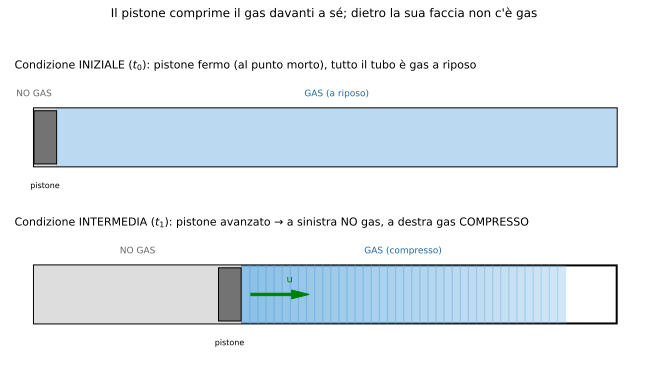
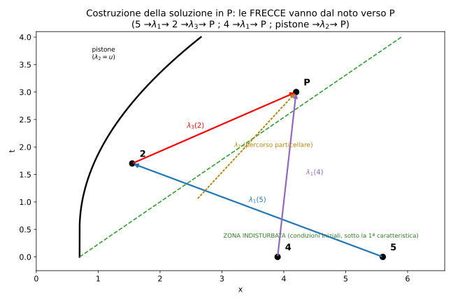
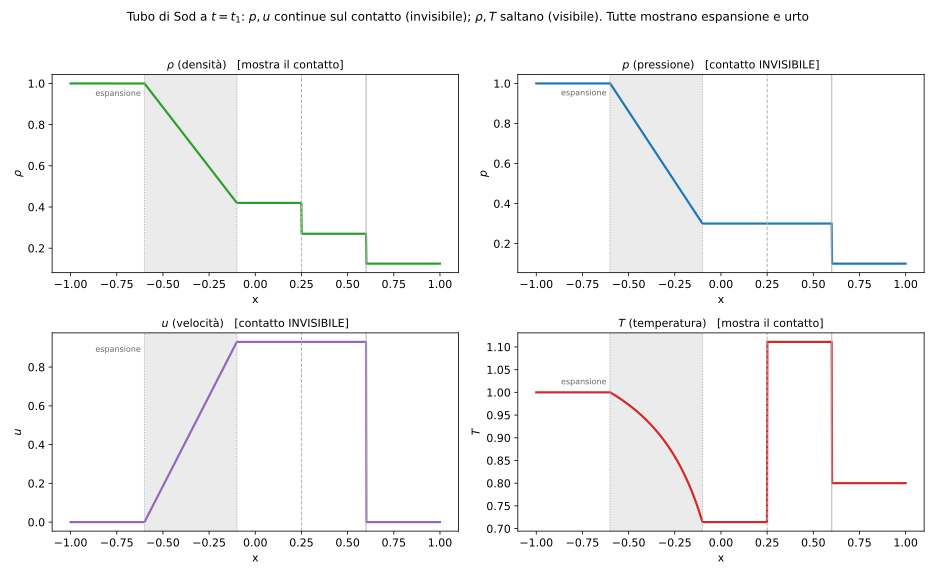
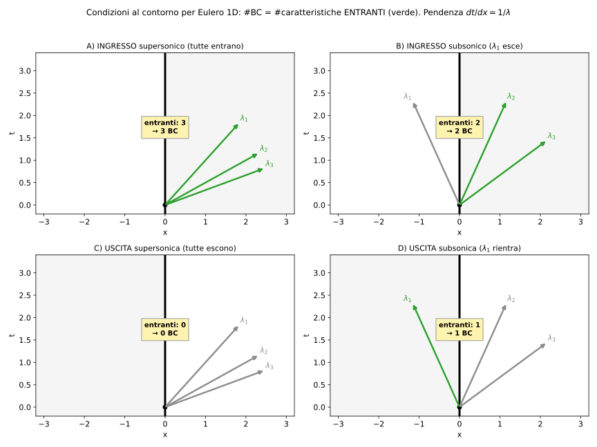
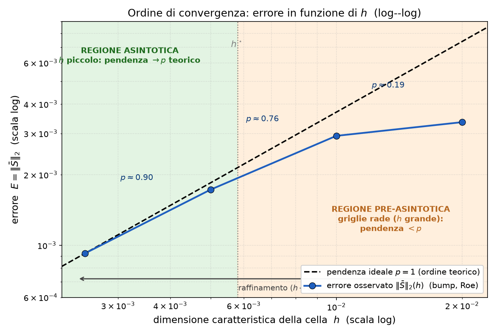

# Domande d'Esame — Fluidodinamica Computazionale dei Sistemi Propulsivi (SP)

> Raccolta di **tutte le domande effettivamente proposte all'esame** (prof. Ferrero) finora
> collezionate, più una sezione finale di **domande tipo generate dall'IA** per esercitarsi.
> Le risposte vengono compilate **man mano**: dove non c'è ancora una risposta, il toggle contiene
> un rimando al materiale di `teoria/` e un segnaposto.

---

## Modalità d'esame

- **Orale** di circa **30 minuti**.
- **Tre domande**: le **prime due sulla teoria**, l'**ultima sull'esercitazione** (il report).
- Per questo motivo le domande raccolte sulla **teoria** sono molte di più di quelle
  sull'**esercitazione**: a parità di studenti, di teoria ne sono state fatte di più.
- La domanda di esercitazione dura ~10 minuti: un solo punto ben sviluppato (es. l'estrapolazione
  di Richardson sul bump) copre già il tempo; spesso il docente ferma prima e aggiunge un dettaglio.

## Legenda (distinzione visiva)

| Marcatore | Significato |
|---|---|
| 🟦 **[T]** | Domanda di **teoria** — *realmente proposta* all'esame |
| 🟩 **[E]** | Domanda di **esercitazione / report** — *realmente proposta* (sempre **in fondo**) |
| 🤖 **[AI]** | Domanda **generata dall'IA** — *NON proposta davvero*, solo per esercitarsi |

> Formato: blocchi *toggle* `
` (incollabili in Notion), **parole chiave** in grassetto,
> formule in LaTeX (`$...$` inline, `$$...$$` display). Stessa convenzione di `teoria/`.

---

# 🟦 PARTE TEORICA (domande realmente proposte)

<strong>🗓️ Domande raccolte agli APPELLI RECENTI (prof. Ferrero) — riepilogo</strong>

> Raccolte dal gruppo del corso. **Ignorate** le domande di un altro corso (prof. *Ferlauto*, che erano
> finite per errore nello stesso gruppo). Confermano/arricchiscono le sezioni sotto.

**Teoria (Ferrero):**
- Equazioni di Eulero (anche **stazionarie**): cosa se ne può dire, **caratteristiche** e **invarianti di Riemann** → *sez. 1, 2*.
- **Differenza Eulero vs RANS** e le **sorgenti di perdite/dissipazione** (Eulero: urti; RANS: urti + **viscosità turbolenta** che si aggiunge a quella molecolare già presente in NS) → *sez. 1, 4, 6*.
- **Problema di Riemann** e **metodo di Godunov**, poi in generale gli **upwind** e le **varianti** (Osher, Roe) → *sez. 3*.
- **Gradienti su griglie non strutturate**: Green–Gauss e **minimi quadrati (con e senza pesi)**; **gradiente all'interfaccia** (sistemi con termine **diffusivo**) → *sez. 3*.
- **Limitatori di pendenza**: schemi di **2° grado** (come si calcola la pendenza, come si **limita**); su **griglie strutturate** perché si usano e come si **scrivono** (almeno **minmod**, poi superbee); **schemi espliciti vs impliciti** → *sez. 3*.
- **Metodi numerici di ordine superiore al 2°** → *sez. 3*.
- **Condizioni al contorno** per Eulero: **uscita supersonica e subsonica** (e condizioni su paletta/parete) → *sez. 2*.
- **Metodo delle caratteristiche per il pistone con moto accelerato** → *sez. 2*.
- **Calcolo dei flussi turbolenti** (differenze, pregi/difetti) e nello specifico la **LES** → *sez. 4*.

**Relazione / esercitazioni (Ferrero):**
- **Convergenza temporale** = norma (es. $L_2$) dei **residui**; commento del **campo di moto** della paletta e **confronto con dati sperimentali**.
- **Doppia rampa:** commentare il **campo di Mach** identificando **urti e strutture**, e **riconoscerle** anche nel grafico della **pressione a parete**.
- **$M_{is}$ (Mach isentropico) a parete** della turbina, **bordo di fuga**, come si **calcola**; **come si ricava** il Mach isentropico e **perché si chiama isentropico**.
- **Causa di dissipazione e caduta di $p_{tot}$ nelle RANS**.
- **Ottimizzazione:** descrivere il problema, **fronte di Pareto**, risultati finali → *sez. 8*.

*(Nessuna domanda sostanzialmente nuova rispetto alle sezioni esistenti: i dettagli sopra le arricchiscono.)*

## 1) Leggi di conservazione e sistema di Eulero — `teoria/bilancio.md`

<strong>🟦 [T] Equazione di Burgers, collegandosi ai casi delle condizioni al contorno</strong>

> 📌 *Risposta da compilare.* Riferimento: `teoria/bilancio.md` (modello di Burgers),
> `teoria/caratteristiche.md` (condizioni al contorno via caratteristiche), `teoria/metodi_numerici.md`.
> Attesi: Burgers come **modello scalare non lineare** (formazione di urti, onde di rarefazione,
> condizione di entropia), e come si traducono le **condizioni al contorno** a seconda del segno
> delle caratteristiche.

<strong>🟦 [T] Equazione di Burgers</strong>

> 📌 *Risposta da compilare.* Variante "secca" della precedente. Riferimento: `teoria/bilancio.md`.

## 2) Linee caratteristiche: pistone, Sod, condizioni al contorno — `teoria/caratteristiche.md`

<strong>🟦 [T] Esempio del pistone in accelerazione</strong>

> 📌 *Risposta da compilare.* Riferimento: `teoria/caratteristiche.md` §6 (toggle "simulazione d'esame").
> Attesi: pistone che accelera in un condotto → **compressione progressiva** → coalescenza delle
> onde di compressione in un **urto** (caratteristiche che convergono); caso speculare di espansione
> con pistone che retrocede.
>
> **Considerazioni dalla simulazione d'esame:**
> - **Zone:** a sinistra della faccia del pistone **no gas**, a destra **gas compresso**; la zona
>   **indisturbata** è quella **sotto la prima caratteristica** (dall'origine).
> - **Dal pistone** ha senso solo $\lambda_3=u+a$ (più veloce di $u_p$): $\lambda_1$ andrebbe nel vuoto,
>   $\lambda_2$ resta sul pistone. (Vale solo per le caratteristiche che originano sul pistone.)
> - **Pendenza** $dt/dx=1/\lambda$ (l'inverso della velocità); accelerando, le $\lambda_3$ diventano più
>   veloci → meno inclinate → **convergono** → urto (poi **Rankine–Hugoniot**).
> - **Procedura (invarianti di Riemann):** $W_1(5)=W_1(2)$ con $u_2$ = velocità del pistone (nota) → ricavo
>   $a_2$; poi $W_3(2)=W_3(P)$ e $W_1(4)=W_1(P)$ → stato in $P$. **3 incognite ($a_2,u_P,a_P$), 3 equazioni
>   → determinato.** La velocità del pistone è nota ovunque (legge di moto), ma $a_2$ **no** (il pistone
>   impone solo la cinematica). $S$ ("$\delta$") costante (omoentropico) chiude la termodinamica.

<strong>🟦 [T] Tubo di Sod</strong>

> 📌 *Risposta da compilare.* Riferimento: `teoria/metodi_numerici.md`, `teoria/caratteristiche.md`.
> Attesi: problema di Riemann "canonico" (membrana che separa due stati), soluzione con
> espansione + contatto + urto, uso come **test di validazione** degli schemi.

<strong>🟦 [T] Outlet subsonico (e in generale le condizioni al contorno in base al regime)</strong>

> 📌 *Risposta da compilare.* Riferimento: `teoria/caratteristiche.md`, `teoria/report_QA.md`
> (Domande 12–13). Attesi: numero di **caratteristiche entranti** = numero di condizioni da imporre.
>
> **Le 4 casistiche** (vedi figura `teoria/images/lc_bc_quattro_casi.svg`):
>
> | Caso | Bordo | Segni $\lambda_1,\lambda_2,\lambda_3$ | Entranti | **# BC** | Cosa si impone |
> |---|---|---|---|---|---|
> | **A** Ingresso supersonico | sx | $+,+,+$ | 3 | **3** | $p_0,T_0,M$ (o $u,S$+1 termo) |
> | **B** Ingresso subsonico | sx | $-,+,+$ | 2 | **2** | $p_0,T_0$; $\lambda_1$ esce → si estrapola |
> | **C** Uscita supersonica | dx | $+,+,+$ | 0 | **0** | nulla (tutto estrapolato) |
> | **D** Uscita subsonica | dx | $-,+,+$ | 1 | **1** | $p$ statica (rifl.) o invariante $W_1$ (non rifl.) |
>
> Logica: le **entranti** portano info da fuori → si **impongono**; le **uscenti** portano info dall'interno → si **estrapolano** (risalendo la caratteristica). Dettaglio in `teoria/caratteristiche.md` §8.

## 3) Metodi numerici (differenze, volumi, elementi finiti) — `teoria/metodi_numerici.md`

### Volumi finiti: gradienti, ricostruzione, limitatori

<strong>🟦 [T] Calcolo del gradiente nelle celle (Gauss–Green e minimi quadrati pesati) e all'interfaccia per i termini diffusivi</strong>

> 📌 *Risposta da compilare — verrà fornita la spiegazione dell'utente, da rifinire.*
> Riferimento: `teoria/metodi_numerici.md` (ricostruzione e gradienti) e `teoria/meshing.md`.
> Punti chiave attesi: gradiente di cella con il **teorema di Gauss–Green** (integrale di superficie
> dei valori di faccia), **minimi quadrati pesati** (sistema sui vicini, peso $\propto 1/d$), e
> il gradiente **all'interfaccia** necessario per i **flussi diffusivi** (media + correzione
> di non-ortogonalità).

<strong>🟦 [T] Limitatori di pendenza per griglie strutturate e non strutturate</strong>

> 📌 *Risposta da compilare.* Riferimento: `teoria/metodi_numerici.md`.
> Attesi: motivazione (monotonicità / TVD, evitare oscillazioni spurie a cavallo delle
> discontinuità), limitatori classici (minmod, Van Leer, Barth–Jespersen / Venkatakrishnan per
> mesh non strutturate), differenza nello **stencil** tra strutturato e non strutturato.

<strong>🟦 [T] Limitatori per mesh strutturate e non, spiegando la precisione di macchina in termini di ordine di accuratezza</strong>

> 📌 *Risposta da compilare.* Variante della precedente. Aggancio extra: come la **precisione di
> macchina** (round-off) pone un **limite inferiore** all'errore raggiungibile e interagisce con
> l'**ordine di accuratezza** (oltre un certo raffinamento l'errore di troncamento scende sotto il
> round-off e non si guadagna più). Riferimento: `teoria/metodi_numerici.md`.

<strong>🟦 [T] Calcolo dei gradienti: tutti e 3 i metodi (Green–Gauss, minimi quadrati, minimi quadrati pesati) con esempi</strong>

> 📌 *Risposta da compilare.* Riferimento: `teoria/metodi_numerici.md`.
> Attesi: i **tre** approcci, vantaggi/limiti (Green–Gauss sensibile alla qualità mesh; minimi
> quadrati più robusto su mesh distorte; pesatura per dare più importanza ai vicini vicini),
> con esempio numerico/geometrico.

<strong>🟦 [T] Gradiente all'interfaccia e metodo dei minimi quadrati pesati</strong>

> 📌 *Risposta da compilare.* Sottocaso delle precedenti, focalizzato su **interfaccia** (flussi
> diffusivi) + **WLSQ**. Riferimento: `teoria/metodi_numerici.md`.

<strong>🟦 [T] Schemi di ordine superiore al primo nello spazio (intro generica) e calcolo della pendenza per griglie strutturate</strong>

> 📌 *Risposta da compilare.* Riferimento: `teoria/metodi_numerici.md`.
> Attesi: dal **primo ordine** (Godunov) alla **ricostruzione MUSCL** (pendenza/slope), upwind vs
> centrati, ruolo del limitatore; calcolo della **pendenza** su griglia strutturata (differenze su
> stencil regolare).

### Schemi per i flussi convettivi: Riemann, Godunov, alta risoluzione

<strong>🟦 [T] Metodo di Godunov</strong>

> 📌 *Risposta da compilare.* Riferimento: `teoria/metodi_numerici.md`
> (Godunov/Riemann, flux splitting, Roe). Attesi: ricostruzione costante a tratti → **problema di
> Riemann** a ogni interfaccia → flusso esatto/approssimato; primo ordine; legame con l'upwind.

<strong>🟦 [T] Problema di Riemann e tubo d'urto di Sod: applicazione al calcolo dei flussi all'interfaccia tra celle (perché farlo, come si usa nel CFD, ODE risultante), metodi di risoluzione del problema di Riemann e metodo di Godunov</strong>

> 📌 *Risposta da compilare.* Riferimento: `teoria/metodi_numerici.md`,
> `teoria/caratteristiche.md`. Attesi: struttura a **3 onde** (urto, contatto, espansione), perché
> all'interfaccia tra celle nasce un problema di Riemann locale, risolutori **esatti vs approssimati**
> (Roe, HLL/HLLC), e il metodo di **Godunov**.

<strong>🟦 [T] Schemi di Lax(–Friedrichs) e Jameson–Schmidt–Turkel (JST)</strong>

> 📌 *Risposta da compilare.* Riferimento: `teoria/metodi_numerici.md`.
> Attesi: **Lax–Friedrichs** (centrato + dissipazione $\propto \lambda_{max}$), **JST** (centrato con
> dissipazione artificiale del 2°/4° ordine commutata da sensore di pressione), pro/contro.

<strong>🟦 [T] Equazioni di Eulero 2D, discretizzazione a volumi finiti (arrivare a $\mathrm{d}\mathbf{U}/\mathrm{d}t = \sum \text{flussi}$), panoramica degli schemi per i flussi convettivi e illustrare Jameson</strong>

> 📌 *Risposta da compilare.* Riferimento: `teoria/bilancio.md` (sistema di Eulero),
> `teoria/metodi_numerici.md`. Attesi: forma conservativa, integrazione sul volume di controllo,
> teorema della divergenza → bilancio dei flussi sulle facce, semidiscretizzazione, poi rassegna
> schemi e dettaglio **Jameson**.

<strong>🟦 [T] Metodi WENO e Discontinuous Galerkin (esempio 2D e formulazione variazionale)</strong>

> 📌 *Risposta da compilare.* Riferimento: `teoria/metodi_numerici.md` (approfondimenti
> WENO/DG). Attesi: **WENO** (combinazione pesata di stencil, pesi non lineari per evitare gli
> stencil che attraversano la discontinuità), **DG** (incognite = coefficienti modali per cella,
> **formulazione debole/variazionale**, flussi numerici tra elementi), esempio 2D.

<strong>🟦 [T] WENO 5 e Galerkin Discontinuo</strong>

> 📌 *Risposta da compilare.* Variante della precedente, focus su **WENO di ordine 5** (3 sottostencil)
> e DG. Riferimento: `teoria/metodi_numerici.md`, immagine `weno5_stencil_sottogruppi.jpg`.

### Proprietà dei metodi, errore, stabilità, integrazione temporale

<strong>🟦 [T] Parlare delle proprietà dei metodi numerici</strong>

Riferimento: `teoria/metodi_numerici.md` §1 (toggle "Proprietà"). Risposta:

Le tre proprietà fondamentali, nell'ordine **logico** consistenza → stabilità → convergenza (non
viceversa), perché la convergenza si **deduce** dalle altre due:
- **Consistenza:** raffinando ($\Delta t\to0$), l'**errore di troncamento** (≈ discretizzazione) → 0; cioè
  l'equazione discretizzata tende a quella esatta.
- **Stabilità:** raffinando, l'**errore di propagazione** → 0; gli errori non si amplificano nel tempo.
- **Convergenza:** raffinando, l'**errore globale** → 0. Ma $E_{\text{globale}}=E_{\text{troncamento}}+E_{\text{propagazione}}$:
  se entrambi → 0, anche la somma → 0.
- **Teorema di equivalenza di Lax** (problema lineare ben posto): **consistenza + stabilità ⟺ convergenza**.

Mappa: (a) consistenza ↔ troncamento · (b) stabilità ↔ propagazione · (c) convergenza ↔ globale.

**Per completezza** (proprietà aggiuntive):
- **Ordine di convergenza:** la potenza $p$ con cui l'errore va a zero, $E\sim O(\Delta x^{p})$ (1°, 2°…).
- **Monotonicità:** lo schema non crea **nuovi massimi/minimi** (niente oscillazioni spurie) — legata al TVD.
- **Conservatività:** il flusso che esce da una cella entra nell'adiacente → la grandezza si **conserva**
  globalmente; essenziale per gli **urti** (velocità d'urto corretta via Rankine–Hugoniot).

<strong>🟦 [T] Dimostrare il senso fisico dell'errore locale di troncamento</strong>

Riferimento: `teoria/metodi_numerici.md` §1 (toggle "Errori"). Risposta:

**Idea:** equazioni diverse hanno soluzioni diverse. La soluzione **esatta** annulla l'equazione
**originale** $u_t+a\,u_x=0$, **ma non** l'equazione **discretizzata**: inserendo $u_{ex}$ nella discreta si
ottiene proprio l'**errore di troncamento** (≠ 0).

**Esempio (upwind esplicito), via Taylor.** Sostituendo $u_{ex}$ e sviluppando in serie:

$$\frac{u_j^{n+1}-u_j^{n}}{\Delta t}+a\,\frac{u_j^{n}-u_{j-1}^{n}}{\Delta x}\bigg|_{u_{ex}}
=\underbrace{(u_t+a\,u_x)}_{=\,0}\;+\;\frac{\Delta t}{2}\,u_{tt}-a\,\frac{\Delta x}{2}\,u_{xx}+\dots
=E_{\text{tronc}}\neq 0.$$

**Senso fisico:** i termini residui (i gradi alti del Taylor, **troncati** nello schema → da cui il nome)
sono l'**equazione modificata** che il metodo risolve *davvero*: contengono **diffusione/dispersione
numerica**. Quindi il calcolo non risolve l'equazione esatta ma **un'equazione diversa**, con dissipazione/
dispersione spurie. Per $\Delta t,\Delta x\to0$ questi termini → 0 ⇒ **consistenza**. L'idea (l'esatta non
annulla l'equazione approssimata) è **generale**, non solo delle differenze finite.

<strong>🟦 [T] Stabilità (di uno schema numerico generico)</strong>

> 📌 *Risposta da compilare.* Riferimento: `teoria/metodi_numerici.md`.
> Attesi: analisi di **von Neumann**, **regione di assoluta stabilità**, CFL, stabilità
> condizionata (espliciti) vs incondizionata (impliciti). Immagine
> `regione_assoluta_stabilita_eulero_exp_imp.jpg`.

<strong>🟦 [T] Integrazione temporale con metodi espliciti ed impliciti</strong>

> 📌 *Risposta da compilare.* Riferimento: `teoria/metodi_numerici.md`.
> Attesi: Eulero esplicito vs implicito, Runge–Kutta, costo per passo vs ampiezza del $\Delta t$,
> **stiffness**, A-stabilità.

<strong>🟦 [T] Scrivere la formula dello schema numerico per il metodo esplicito e implicito</strong>

> 📌 *Risposta da compilare.* Riferimento: `teoria/metodi_numerici.md`.
> Attesi: $\mathbf{U}^{n+1} = \mathbf{U}^n + \Delta t\,\mathbf{R}(\mathbf{U}^n)$ (esplicito) vs
> $\mathbf{U}^{n+1} = \mathbf{U}^n + \Delta t\,\mathbf{R}(\mathbf{U}^{n+1})$ (implicito), con la
> linearizzazione/Jacobiano per l'implicito.

<strong>🟦 [T] Stabilità di uno schema numerico generico e poi per il metodo implicito</strong>

> 📌 *Risposta da compilare.* Variante combinata: parte generale + **stabilità del metodo implicito**
> (A-stabilità, incondizionata). Riferimento: `teoria/metodi_numerici.md`.

## 4) Turbolenza — `teoria/turbolenza.md`

<strong>🟦 [T] RANS</strong>

> 📌 *Risposta da compilare.* Riferimento: `teoria/turbolenza.md`.
> Attesi: media di Reynolds, **tensore degli sforzi di Reynolds**, problema di chiusura, modelli
> (Spalart–Allmaras, $k$–$\varepsilon$, $k$–$\omega$ SST), ipotesi di Boussinesq.

<strong>🟦 [T] LES e modelli per la eddy viscosity</strong>

> 📌 *Risposta da compilare.* Riferimento: `teoria/turbolenza.md`.
> Attesi: **filtraggio** spaziale, scale risolte vs **sottogriglia (SGS)**, modello di
> **Smagorinsky** e Smagorinsky **dinamico** (Germano), DES/DDES. Immagini
> `les_filtri_top_hat_vs_gaussian.jpg`, `smagorinsky_dinamico_filtri_test_germano.jpg`.

## 5) Turbomacchine — `teoria/turbomacchine.md`

<strong>🟦 [T] Metodi per valutare l'interazione statore–rotore</strong>

> 📌 *Risposta da compilare.* Riferimento: `teoria/turbomacchine.md`.
> Attesi: **mixing plane** (media circonferenziale all'interfaccia, stazionario), **sliding mesh**
> (non stazionario), metodi **corocronici**, **tempo inclinato**. Immagini `mixing_plane.jpg`,
> `sliding_mesh_ripartizione_flussi.jpg`.

## 6) Modelli di ordine ridotto — `teoria/modelli_ordine_ridotto.md`

<strong>🟦 [T] Modelli di ordine ridotto: POD</strong>

> 📌 *Risposta da compilare.* Riferimento: `teoria/modelli_ordine_ridotto.md`.
> Attesi: **snapshot**, decomposizione in **modi** (energia, RIC), training **offline/online**,
> proiezione di Galerkin.

## 7) Flussi reagenti — `teoria/reacting_flows.md`

<strong>🟦 [T] Come si affronta il problema dei flussi reagenti — senza scrivere equazioni</strong>

> 📌 *Risposta da compilare.* Riferimento: `teoria/reacting_flows.md`.
> Attesi (qualitativo): specie chimiche aggiuntive, **mixing**, fiamme **premiscelate vs diffusive**,
> scale temporali della chimica (stiffness), metodo di **proiezione**. Immagine
> `fiamme_premiscelata_vs_diffusiva.svg`.

## 8) Ottimizzazione — (esercitazione; nessun capitolo di teoria dedicato)

<strong>🟦 [T] Ottimizzazione di forma</strong>

> 📌 *Risposta da compilare.* Riferimento: `Latex/ottimizzazione.tex`, cartella `Ottimizzazione/`.
> Attesi: parametrizzazione della geometria, **funzione obiettivo** e vincoli, algoritmi
> (gradiente/aggiunto vs evolutivi), workflow con **modeFRONTIER**.

---

# 🟩 PARTE DI ESERCITAZIONE (domande realmente proposte — sempre in fondo)

> Nota sullo *splitting*: i punti d'esame raccolti spesso **impacchettano più argomenti
> concettualmente indipendenti** (es. "Richardson sul bump **+** simulazione della paletta **+**
> differenze col RANS"). Qui vengono **separati** in domande singole, così da poterli studiare in
> modo autonomo.

<strong>🟩 [E] Estrapolazione di Richardson nel caso del Bump ✅ (risposta completa)</strong>

### 1. Cos'è l'estrapolazione di Richardson

L'estrapolazione di Richardson è una tecnica che, combinando i risultati di **più griglie a
raffinamento diverso**, permette di **stimare la soluzione "esatta"** (a griglia infinita) e di
**valutare l'ordine di convergenza** dello schema. L'ordine può essere inteso in due modi:

- **ordine teorico**: quello che lo schema *avrebbe* nel regime ideale (per Roe e Lax–Friedrichs di
  base, $p = 1$); è più facile da usare ma quasi mai raggiunto esattamente;
- **ordine effettivo (empirico)**: quello che lo schema raggiunge *concretamente* su quelle griglie,
  ricavato dai dati.

La tua intuizione è corretta: assumere $p = p_{teorico}$ ha senso **solo se si è nella regione
asintotica**, cioè su griglie già abbastanza fini. Altrimenti i termini di ordine superiore non
sono trascurabili e l'ordine osservato si discosta (di norma è **più basso**).

> ⚠️ **Correzione importante (transitorio vs regione asintotica).** Nella tua spiegazione hai legato
> la "regione asintotica" al grafico **residui vs numero di iterazioni**. Attenzione: quel grafico
> riguarda la **convergenza temporale** verso lo stato stazionario (stabilità: i residui calano fino
> ad assestarsi su una singola griglia), ed è una cosa **diversa** dalla **convergenza spaziale di
> griglia**. L'ordine $p$ di Richardson vive sul grafico **errore vs $h$** (log–log), e la "regione
> asintotica" che conta per Richardson è quella per **$h \to 0$** (griglia sempre più fitta), non
> per $\text{iter}\to\infty$. Le due convergenze sono indipendenti (cfr. `Latex/bump.tex`,
> "Distinzione tra Convergenza Spaziale e Temporale"). Quindi: il numero di iterazioni **non
> influisce sull'ordine $p$**, a patto che ogni simulazione sia portata **a convergenza** (stato
> stazionario); ciò che influisce su $p$ è solo **quanto è fitta la griglia**.

### 2. Perché si traccia l'entropia, e perché la norma $L_2$

Il bump è **subsonico** ($M_{in} = 0.3$) e risolto con un solver **inviscido (Eulero)**: niente
viscosità e niente urti. In queste condizioni il flusso è **isentropico**, quindi (a meno della
costante di riferimento) l'entropia dovrebbe essere **identicamente nulla** ovunque. Ne segue il
punto chiave:

> Qualunque variazione di entropia osservata è un **artefatto numerico** (dissipazione dello schema).
> L'entropia diventa quindi una **misura diretta dell'errore numerico**: più è piccola, più la
> soluzione è vicina a quella esatta.

Questo risponde al tuo dubbio: l'entropia non "influisce" sull'ordine di convergenza; è la
**grandezza-osservabile di cui misuriamo l'ordine**. Va distinta da due usi diversi:
- entropia **vs iterazioni** → monitor della **convergenza temporale** (come i residui);
- norma dell'entropia **vs $h$** (a convergenza) → è ciò che fornisce l'**ordine spaziale** $p$.

La scelta della **norma $L_2$** non è la norma euclidea "geometrica", ma una **$L_2$ pesata sul
volume e mediata** (RMS integrale):

$$
\|\bar S\|_2 = \sqrt{\frac{\sum_i \bar S_i^{\,2}\,|\Omega_i|}{\sum_i |\Omega_i|}}
$$

La pesatura con l'area di cella $|\Omega_i|$ la rende un'**approssimazione dell'integrale**
$\int_\Omega \bar S^2\,d\Omega$ (indipendente da come è fatta la mesh), e la normalizzazione la rende
un **RMS** confrontabile **tra griglie diverse** — esattamente ciò che serve per un'analisi di
convergenza. (Dettaglio in `teoria/report_QA.md`, Domanda 21.)

### 3. La legge di potenza dell'errore e le sue incognite

L'errore di discretizzazione (per definizione: **valore numerico − valore esatto**) si modella come

$$
E = u_h - u_{\rm esatto} = k\,h^{p}
$$

dove:
- $h$ = **dimensione caratteristica** della cella. Per un quadrato è il lato ($h=\sqrt{A}$); per
  elementi qualsiasi si usa una dimensione equivalente $h_{\rm eff}\approx\sqrt{A/N}$ — la tua
  intuizione è giusta, "che poi non sia esattamente il lato non importa". (cfr. `teoria.tex`,
  "Lunghezza caratteristica nominale ed effettiva");
- $p$ = **ordine di convergenza** (proprietà del **metodo**);
- $k$ = **costante di proporzionalità** (l'errore è *proporzionale* a $h^p$, quindi serve $k$).

**Incognite e noti**: $u_h$ è **noto** (è il risultato della simulazione); $h$ è **noto** (l'abbiamo
scelto con la mesh); $u_{\rm esatto}$ è in generale **incognito** (altrimenti non simuleremmo);
$p$ può essere noto (se assumiamo il teorico) o incognito; $k$ è incognito. Una sola equazione con
due incognite non basta → servono **più griglie**.

### 4. Derivazione della formula della soluzione esatta (ordine teorico, 2 griglie) — *eq. 3.25*

Si scrivono **due** simulazioni con lo **stesso metodo** (quindi stessi $p$ e $k$) ma **griglie
diverse**: $h_1$ (fine) e $h_2 = r\,h_1$ (con $r$ = rapporto di diradamento). Con $p$ **assunto** pari
al teorico:

$$
\text{(1)}\quad u_{h_1} - u_{\rm esatto} = k\,h_1^{p}
\qquad\qquad
\text{(2)}\quad u_{h_2} - u_{\rm esatto} = k\,(r h_1)^{p} = r^{p}\,k\,h_1^{p}
$$

**Passo 1 — elimino $k$.** Sottraggo la (1) dalla (2):

$$
u_{h_2} - u_{h_1} = (r^{p}-1)\,k\,h_1^{p}
\quad\Longrightarrow\quad
k\,h_1^{p} = \frac{u_{h_2} - u_{h_1}}{r^{p}-1}
$$

**Passo 2 — sostituisco in (1) per isolare $u_{\rm esatto}$.** Dalla (1) $u_{\rm esatto}=u_{h_1}-k h_1^p$:

$$
u_{\rm esatto} = u_{h_1} - \frac{u_{h_2}-u_{h_1}}{r^{p}-1}
= u_{h_1} + \frac{u_{h_1}-u_{h_2}}{r^{p}-1}
$$

**Passo 3 — forma compatta** (denominatore comune):

$$
\boxed{\,u_{\rm esatto} \approx \dfrac{r^{p}\,u_{h_1} - u_{h_2}}{r^{p}-1}\,}
$$

che è la **formula 3.25** del report. Il termine $\dfrac{u_{h_1}-u_{h_2}}{r^{p}-1}$ è la **stima
dell'errore** della griglia fine, che Richardson **somma** a $u_{h_1}$ per "estrapolare" verso
$h\to 0$.

> 🔧 **Nota di coerenza interna al progetto.** In `Latex/teoria.tex` l'equazione equivalente è
> scritta come $u_{\rm esatto}\approx u_h + \frac{u_{2h}-u_h}{2^p-1}$: con la convenzione
> $E=u-u_{\rm esatto}$ il segno corretto è $u_{\rm esatto}\approx u_h - \frac{u_{2h}-u_h}{2^p-1}
> = u_h + \frac{u_h-u_{2h}}{2^p-1}$ (coerente col box qui sopra e con `report_QA.md` Domanda 24).
> È un **refuso di segno** nel report da correggere.

### 5. Derivazione dell'ordine effettivo (3 griglie)

Se **non** si vuole assumere il teorico, $p$ diventa **incognita**: le incognite sono ora $u_{\rm
esatto}$ **e** $p$ (la $k$ continua a non interessarci, viene eliminata), quindi serve una **terza**
griglia. Con tre griglie a **rapporto costante** $r$, comodamente $h,\;2h,\;4h$ (cioè $r=2$):

$$
u_h - u_{\rm esatto} = k\,h^p,\qquad
u_{2h} - u_{\rm esatto} = k\,(2h)^p = 2^p k h^p,\qquad
u_{4h} - u_{\rm esatto} = k\,(4h)^p = 4^p k h^p
$$

Sottraendo a coppie **scompare $u_{\rm esatto}$**:

$$
u_{2h}-u_{h} = k h^p\,(2^{p}-1),\qquad
u_{4h}-u_{2h} = k h^p\,(4^{p}-2^{p}) = k h^p\,2^{p}(2^{p}-1)
$$

Il **rapporto** elimina anche $k h^p$:

$$
\frac{u_{4h}-u_{2h}}{u_{2h}-u_{h}} = \frac{2^{p}(2^{p}-1)}{2^{p}-1} = 2^{p}
$$

da cui, prendendo il logaritmo:

$$
\boxed{\,p = \dfrac{\ln\!\left(\dfrac{u_{4h}-u_{2h}}{u_{2h}-u_{h}}\right)}{\ln 2}\,}
\qquad\text{(in generale } p=\ln(\dots)/\ln r\text{)}
$$

Trovato $p$, lo si reinserisce nella formula di estrapolazione del Passo 3 per ottenere
$u_{\rm esatto}$. È esattamente la sequenza usata nel report.

### 6. Il rapporto di diradamento $r$ — deve essere costante?

$r = h_2/h_1$. Con $r > 1$ la griglia "2" ha celle **più grandi**, quindi è **più rada**; la griglia
"1" (con $h$ più piccolo) è la **più fitta**. "Diradamento" indica proprio che, partendo dalla fine,
si **dirada** moltiplicando per $r>1$. (cfr. `report_QA.md` Domanda 23.)

**Deve essere costante?** Per la formula a 3 griglie nella forma "pulita" sopra **sì**, serve
$h:2h:4h$ con lo **stesso** $r$ tra livelli consecutivi: è ciò che fa comparire un unico $2^p$ e
permette di isolare $p$ in forma chiusa. Con $r$ **non costante** ($h_3/h_2 \ne h_2/h_1$) il sistema
si risolve ancora, ma $p$ va trovato **numericamente** (equazione trascendente), e tipicamente non si
guadagna nulla. Per questo si sceglie un $r$ **costante**, di solito $r=2$, **per pura comodità**: con
una mesh strutturata raddoppiare i nodi per lato realizza $r=2$ in modo esatto. La tua osservazione è
giusta — $r=2$ può essere "grande" se si parte già da una mesh fitta — e infatti **nulla vieta** un
$r$ costante minore (es. 1.5); è solo una scelta operativa. Nel bump del report si è usato
$r=2$ con la quaterna $l_c = 0.02,\,0.01,\,0.005,\,0.0025$.

### 7. La costante $k$ — è davvero costante? serve ricordarla?

$k$ è la **costante dell'errore di testa** ($E\simeq k h^p$). Nelle ipotesi di Richardson la si
considera **la stessa** sulle griglie usate, **perché**: (i) è lo **stesso metodo**, (ii) lo **stesso
problema**, (iii) si è (idealmente) nel **regime asintotico** dove domina il solo termine $k h^p$.
È proprio questa costanza che permette di **eliminarla** sottraendo le equazioni.

Risposta ai tuoi dubbi:
- **non ci interessa il suo valore**: in entrambi gli approcci $k$ viene **cancellata**, non
  calcolata. Nel caso "ordine teorico" l'unica incognita che resta è $u_{\rm esatto}$; nel caso
  "ordine effettivo" sono $u_{\rm esatto}$ e $p$. $k$ non serve mai esplicitamente;
- **è generale?** No: $k$ dipende dal metodo *e* dal problema *e* dal regime. Se esci dalla regione
  asintotica (termini di ordine superiore non trascurabili), l'"effettivo" $k$ apparente **cambia**.
  Quindi **non** ha valore predittivo da riusare altrove: è giusto **non** affezionarsi al suo valore.

### 8. Il caso "soluzione esatta nota" del bump e i dati concreti

C'è una scorciatoia specifica del bump: poiché $u_{\rm esatto} = \|\bar S\|_2^{\,\rm esatto} = 0$ è
**noto** (flusso isentropico), non serve nemmeno estrapolare per stimarlo. L'ordine si legge
**direttamente** dalla **pendenza** della retta in scala **log–log** ($\log E = p\log h + \log k$),
perché $E = u_h - 0 = u_h$. Risultati del report (codice eseguito, $\mathrm{CFL}=0.3$):

| Metodo | $p$ (sol. esatta nota) | Errore su griglia fine | GCI |
|---|---|---|---|
| **Roe** | $\approx 0.96$ | $8.98\times10^{-4}$ | $2.7\times10^{-3}$ |
| **Lax–Friedrichs** | $\approx 0.62$ | $1.22\times10^{-3}$ | $3.7\times10^{-3}$ |

Letture:
- entrambi **sotto** l'ordine teorico $p=1$ ⟹ griglie **non ancora pienamente asintotiche**;
- **Roe** più accurato e più vicino a 1 (minore dissipazione: scompone il salto sulle onde
  caratteristiche, mentre LF usa una dissipazione unica $\propto\lambda_{max}$);
- l'estrapolazione a **ordine effettivo** sul bump risulta **non affidabile** ($p_{\rm eff}\approx
  0.5$–$0.8$, fuori regime asintotico): per questo, *avendo* la soluzione esatta, si preferisce la
  stima "sol. esatta nota". È la conferma quantitativa del punto §1.

### 9. Risposte sintetiche ai tuoi dubbi puntuali

- **L'entropia influisce sull'ordine?** No: è l'**osservabile** di cui *si misura* l'ordine, non un
  parametro che lo cambia. (vs iterazioni = convergenza temporale; vs $h$ = ordine spaziale).
- **Perché la norma 2 (pesata)?** Per renderla l'approssimazione di un integrale, indipendente da
  mesh e dominio, quindi **confrontabile tra griglie**.
- **Errore = numerico − esatto?** Sì, è la definizione usata.
- **$h_2$ più o meno fitta di $h_1$ con $r>1$?** $h_2$ è **più rada** (celle più grandi).
- **$r$ costante?** Conveniente e quasi sempre adottato ($r=2$), non obbligatorio.
- **$k$ costante / da ricordare?** Costante nelle ipotesi di Richardson, **eliminata** nei conti,
  **non** riutilizzabile altrove: non serve ricordarla.

<strong>🟩 [E] Estrapolazione di Richardson — approfondimenti e FAQ (Q1–Q8) ✅</strong>

> Chiarimenti puntuali emersi sul punto precedente. Gli stessi contenuti sono stati integrati anche
> nella **parte teorica del report** (`Latex/teoria.tex`, sezione Richardson, e `Latex/bump.tex`).

#### Q1 — Perché si dice che **stima** la soluzione esatta e non la **calcola**? Da dove viene il $\approx$?

Perché la legge $E = k\,h^p$ è solo il **termine dominante** di uno sviluppo asintotico:

$$
E = u_h - u_{\rm esatto} = k_p\,h^p + k_{p+1}\,h^{p+1} + k_{p+2}\,h^{p+2} + \dots
$$

Richardson **tronca al primo termine**, trascurando i contributi $O(h^{p+1})$. Il risultato è un
valore **migliorato** (di un ordine più accurato di $u_h$) ma **non esatto**: l'errore residuo è
quello dei termini buttati via. Le altre approssimazioni che giustificano il $\approx$: $k$ assunta
**uguale** sulle due griglie, $p$ assunto **pari** a quello vero, più la contaminazione da
**round-off** e da convergenza iterativa imperfetta. Da qui "**stima** (estrapolazione)", non
"calcolo".

#### Q2 — Grafico: come varia l'ordine di convergenza, regione asintotica vs transitorio iniziale

In scala **log–log** ($\log E = \log k + p\log h$) la **pendenza** è l'ordine $p$. Su **griglie rade**
($h$ grande, **regione pre-asintotica**, in arancione) i termini di ordine superiore non sono
trascurabili e la pendenza osservata è **diversa** (qui più bassa: $p\approx0.19$) da quella teorica.
**Raffinando** ($h\to0$, **regione asintotica**, in verde) la curva si dispone **parallela** alla
retta ideale di pendenza $p=1$ ($p$ locale che sale a $0.76$, $0.90$, …).

> ⚠️ Il "**transitorio iniziale**" qui è quello sulle **griglie rade** (convergenza **spaziale** di
> griglia, $E$ vs $h$): **non** confonderlo col transitorio dei **residui vs iterazioni**, che è la
> convergenza **temporale** verso lo stazionario. Sono due cose diverse.

#### Q3 — Perché proprio il **root mean square** dell'entropia? E quel $|\Omega_i|$ è un valore assoluto?

Sì, $\bar S$ è l'**entropia adimensionale** ($\bar S = \gamma\ln\bar T - (\gamma-1)\ln\bar P$),
riferita a zero, quindi coincide con l'errore locale. Si usa l'**RMS** (valore quadratico medio) per
ridurre il *campo* d'errore a **un solo scalare** confrontabile tra griglie:
- il **quadrato** impedisce che errori locali di segno opposto si **cancellino** (come farebbe una
  media semplice) e pesa di più gli scostamenti grandi;
- la **radice** riporta tutto alle unità di $\bar S$;
- la **media** (divisione per l'area totale) lo rende un valore *tipico per cella*, indipendente dal
  **numero** di celle.

$|\Omega_i|$ **non è un valore assoluto** (modulo di un numero con segno): è la **misura della cella**
$\Omega_i$ — la sua **area** (2D) o **volume** (3D), per definizione positiva. Pesare $\bar S_i^2$ con
$|\Omega_i|$ rende la somma una **quadratura** dell'integrale $\int_\Omega \bar S^2\,d\Omega$:
senza il peso, le tante celle piccole di una zona raffinata sarebbero sovra-rappresentate. In breve è
la versione **discreta, pesata sul volume e mediata** della norma $L_2$ continua.

#### Q4 — Nella dimostrazione (ordine teorico), perché sembra che $u_{h_1}$ venga "trascurato"?

Non viene trascurato — anzi è il **termine principale**. Riscrivendo la formula:

$$
u_{\rm esatto} \approx \underbrace{u_{h_1}}_{\text{valore fine}} + \underbrace{\frac{u_{h_1}-u_{h_2}}{r^p-1}}_{\text{stima dell'errore } E_1}
$$

l'estrapolazione **parte** dalla soluzione sulla griglia **più fine** $u_{h_1}$ (la migliore che
abbiamo) e le **somma** la stima dell'errore residuo per "proiettare" verso $h\to0$. Nella forma
compatta $u_{\rm esatto}\approx (r^p u_{h_1}-u_{h_2})/(r^p-1)$: per $r^p\gg1$ il peso di $u_{h_1}$
**domina** e $u_{\rm esatto}\to u_{h_1}$; $u_{h_2}$ (griglia rada) entra **solo nella correzione**.
"Estrapolare verso $h\to0$" = correggere il valore fine, non scartarlo.

#### Q5 — Perché si va sempre verso una mesh **più rada**? Non sarebbe più comodo un rapporto di **infittimento**?

Hai ragione sul piano progettuale: **in pratica si infittisce** (si parte rada e si raffina:
$l_c=0.02\to0.01\to\dots$, cioè $h$ **diminuisce**). Il punto è che **l'ordine in cui esegui le
simulazioni è irrilevante**: per Richardson le **riordini a posteriori** rispetto ad $h$ e le
etichetti nel modo più comodo. La convenzione fissa come **riferimento la griglia più fine** $h_1$ e
scrive le altre come multipli $h_2 = r\,h_1$ con **$r>1$** (quindi $h_2$ più rada). Perché questo
ordine è "comodo"? Perché **l'estrapolazione è una correzione applicata alla soluzione migliore**:
si parte da $u_{h_1}$ (la più accurata) e si guarda di quanto cambia andando verso la rada.

- Definire un **rapporto di infittimento** $r'=h_1/h_2<1$ sarebbe **del tutto equivalente** (basta
  mettere $1/r$ nelle formule): pura convenzione, la matematica non cambia.
- Il tuo esempio $0.02\to0.01$ è infatti un **infittimento** ($h$ dimezzato); per Richardson lo leggi
  ponendo $h_1=0.01$ (fine), $h_2=0.02$ (rada), $r=h_2/h_1=2>1$.

In una riga: **infittisci per ottenere le griglie, ma descrivi il salto col rapporto di diradamento
$r>1$ riferito alla più fine**.

#### Q6 — Cosa vuol dire che $k$ dipende dal **problema**? Set diversi di mesh danno $k$ diversi?

$k$ **non è universale**. Dall'analisi dell'errore di troncamento (Taylor), $k$ è proporzionale alle
**derivate di ordine elevato della soluzione esatta** (per uno schema del 1° ordine, le derivate
seconde del campo) per coefficienti propri dello schema. Quindi $k$ dipende da:
- **schema** (Roe e LF, stesso $p=1$, hanno $k$ diversi → errori diversi a parità di $h$);
- **problema = geometria + condizioni al contorno + regime**: sono questi a fissare la soluzione e
  quindi le sue derivate. Geometria con curvature/gradienti più forti → derivate maggiori → $k$
  maggiore. "Dipende dal problema" significa **questo, non la singola mesh**;
- **non** da $h$ (è fattorizzato in $h^p$), purché si sia nel regime asintotico.

**Set diversi di 2 mesh → $k$ diverse?**
- **In regime asintotico** (raffinamento self-simile): *circa la stessa* $k$ (è proprietà di
  schema + problema).
- **Fuori dal regime asintotico** (mesh rade, come il bump): **sì, $k$ apparente cambia** da coppia a
  coppia, perché il fit a **un solo termine** $k h^p$ deve **assorbire** i termini di ordine superiore
  trascurati, che pesano diversamente a $h$ diversi. Per questo $k$ non si riusa altrove e non
  interessa calcolarla: in entrambe le modalità viene **eliminata**.

*(Discusso anche nel report: `Latex/teoria.tex` §"Da che cosa dipende la costante $k$" e
`Latex/bump.tex` §"Perché l'ordine effettivo è basso e perché $k$ cambia".)*

#### Q7 — Perché l'inaffidabilità dell'ordine effettivo "permette" di usare il teorico? Causa dell'ordine basso? È un problema?

Non è che "l'effettivo inaccurato **autorizza** il teorico": è una questione di **affidabilità della
stima**. L'ordine effettivo è una **misura** dai dati; se i dati sono **pre-asintotici** la misura è
**rumorosa** e l'estrapolazione che ne segue è inaffidabile. Allora ci si appoggia a un'informazione
**a priori** più solida:
- se **conosci la soluzione esatta** (bump, $\bar S_{\rm esatto}=0$): la usi **direttamente** (ordine
  dalla pendenza log–log, niente estrapolazione);
- altrimenti **assumi l'ordine teorico** come stima ingegneristica (sai che lo schema è formalmente
  del 1° ordine e che $p\to1$ raffinando) → lo usi come **prior** al posto di una misura troppo
  rumorosa.

**Perché l'ordine pratico è basso?** Griglie non abbastanza fini (regione pre-asintotica, causa
principale), **mesh non uniforme** (stretching/Bump/progressione), **effetti di bordo**, dissipazione
non lineare/limitatori.

**È un problema? Si risolve?** Non è un bug (codice validato) e non impedisce la convergenza
(monotòna, errori piccoli, GCI ~0.3%). Vuol dire solo che la stima **rigorosa** dell'ordine su quelle
griglie è incerta. Rimedi: **raffinare ancora** (costoso), raffinamento **self-simile/uniforme**,
oppure **schema di ordine più alto**. In sintesi: l'effettivo è preferibile *quando è affidabile*;
quando non lo è, ci si affida al teorico o alla soluzione esatta.

*(Discusso anche nel report: `Latex/teoria.tex` §"Ordine effettivo più basso del teorico" e
`Latex/bump.tex`.)*

#### Q8 — Cosa vuol dire "**sottraendo a coppie**" nella dimostrazione dell'ordine effettivo?

Significa sottrarre le tre relazioni d'errore **a due a due**, per griglie **consecutive**. Partendo da

$$
u_h - u_{\rm esatto}=k h^p,\quad
u_{2h}-u_{\rm esatto}=2^p k h^p,\quad
u_{4h}-u_{\rm esatto}=4^p k h^p
$$

faccio (seconda − prima) e (terza − seconda): in ogni differenza **sparisce $u_{\rm esatto}$** (è in
tutte e tre con lo stesso segno):

$$
u_{2h}-u_h = k h^p(2^p-1),\qquad u_{4h}-u_{2h}=k h^p\,2^p(2^p-1)
$$

Il **rapporto** di queste due differenze elimina anche $k h^p$ e lascia solo $2^p$:

$$
\frac{u_{4h}-u_{2h}}{u_{2h}-u_h}=2^p \;\;\Longrightarrow\;\; p=\frac{\ln\!\big(\frac{u_{4h}-u_{2h}}{u_{2h}-u_h}\big)}{\ln 2}
$$

"A coppie" = abbinamenti consecutivi; serve proprio a **cancellare $u_{\rm esatto}$** prima, e
**$k h^p$** poi.

<strong>🟩 [E] Discutere la simulazione della paletta (LS59)</strong>

> 📌 *Risposta da compilare* (parte del punto d'esame originale, separata). Riferimento:
> `Latex/paletta.tex`, `teoria/report_QA.md` (Domande 1–4), cartelle `Paletta/`, `Fluent/`.
> Da trattare: cascata di turbina LS59 transonica, campi di Mach/pressione, scia al bordo di fuga,
> $y^+$, setup della simulazione.

<strong>🟩 [E] Differenze con il caso RANS (Eulero vs RANS, p.es. sulla paletta)</strong>

> 📌 *Risposta da compilare* (parte del punto d'esame originale, separata).
> ❓ *Da chiarire a cosa si riferisce esattamente "il caso RANS"* (paletta? presa?): plausibilmente
> il confronto **Eulero vs RANS** sulla paletta. Riferimento: `teoria/report_QA.md` (Domande 17, 19),
> `Latex/fluent.tex`, `Latex/paletta.tex`. Da trattare: cosa coglie il RANS che Eulero ignora
> (strato limite, separazione, scia viscosa, SBLI), e perché.

<strong>🟩 [E] Estrapolazione di Richardson, metodi diretti, $p_{wall}$ per la presa a doppia rampa e campo di moto generico per la LS59</strong>

> 📌 *Risposta da compilare.* Riferimento: `Latex/doppia_presa.tex`, `Latex/paletta.tex`,
> `Rampa/conv/`, `teoria/report_QA.md` (Domande 5–12, 16–19). Da trattare: convergenza sulla presa,
> "metodi diretti" (soluzione esatta nota vs estrapolazione), pressione a parete $p_w/p^\circ$ con
> i salti d'urto, e campo di moto della LS59.

<strong>🟩 [E] Eulero stima bene il lift ma non la drag della paletta — perché?</strong>

> 📌 *Risposta da compilare.* Riferimento: `Latex/paletta.tex`, `teoria/report_QA.md`.
> Idea attesa: il **lift** è dominato dalla **distribuzione di pressione** (ben colta anche da un
> modello inviscido), mentre la **drag** ha una forte componente **viscosa/d'attrito** e di scia che
> **Eulero non riproduce** (drag inviscida ≈ solo onda/pressione, manca lo skin friction).

<strong>🟩 [E] Descrizione di ciò che si è eseguito e macro-differenze fra bump (dosso), paletta e presa</strong>

> 📌 *Risposta da compilare.* Riferimento: `README.md` (tabella casi di studio), `Latex/bump.tex`,
> `Latex/paletta.tex`, `Latex/doppia_presa.tex`. Da trattare: i **tre regimi** (subsonico $M=0.3$,
> transonico $M=0.5$, supersonico $M=3$), urti/assenza di urti, mesh, scopo di ciascun caso.

<strong>🟩 [E] Confronto Eulero vs RANS per la pala: cosa ci aspettavamo, riscontro dalla simulazione, confronti sull'analisi di convergenza (idem per la presa, meno dettagliato)</strong>

> 📌 *Risposta da compilare.* Riferimento: `Latex/paletta.tex`, `Latex/fluent.tex`,
> `teoria/report_QA.md`. Da trattare: aspettative teoriche, accordo/disaccordo riscontrato,
> confronto delle analisi di convergenza pala vs presa.

<strong>🟩 [E] Bump: commento sui campi di moto e confronto Lax–Friedrichs vs Roe sull'errore</strong>

> 📌 *Risposta da compilare.* Riferimento: `Latex/bump.tex` (campi Mach/pressione Roe vs LF,
> tabelle norma entropia), `Bump/conv/`. Aggancio diretto col toggle Richardson qui sopra (Roe più
> accurato di LF sulle griglie fini).

<strong>🟩 [E] LS59 (campo di moto e risultati)</strong>

> 📌 *Risposta da compilare.* Riferimento: `Latex/paletta.tex`, `Fluent/`, `teoria/report_QA.md`
> (Domande 1–4).

---

# 🤖 DOMANDE TIPO — GENERATE DALL'IA (NON realmente proposte)

> ⚠️ **Attenzione**: le domande seguenti **non sono state effettivamente fatte all'esame**. Sono
> **generate dall'IA** a partire dalla teoria e dal report, come **esercizio** per anticipare possibili
> richieste. Usale per allenarti, ma non confonderle con quelle reali sopra.

## 🤖 Teoria (AI)

<strong>🤖 [AI] Perché lo schema di Roe è più accurato di Lax–Friedrichs a parità di griglia? Lo è anche su un campo liscio come il bump?</strong>

Roe **decompone il salto** $\mathbf{U}^R-\mathbf{U}^L$ nelle **onde caratteristiche** (autovettori
della matrice Jacobiana) e applica a ciascuna la **giusta** dissipazione $\propto|\lambda_k|$;
Lax–Friedrichs usa un'unica dissipazione $\propto\lambda_{max}$ per **tutte** le onde, quindi
sovradissipa quelle lente. Su **discontinuità** il vantaggio è netto (urti più nitidi). Su un campo
**liscio** come il bump il guadagno è **modesto** (i due campi sono quasi sovrapponibili), ma si vede
ancora nell'**errore** (norma entropia più bassa per Roe sulle griglie fini, $p$ più vicino a 1).

<strong>🤖 [AI] Cos'è il Grid Convergence Index (GCI) e perché si introduce un fattore di sicurezza?</strong>

Il GCI trasforma la stima d'errore di Richardson in una **banda d'incertezza conservativa**:
$\text{GCI} = F_s\,\dfrac{|u_h-u_{2h}|}{r^p-1}$, con $F_s=3$ (2 griglie) o $1.25$ (3 griglie in regime
asintotico). Non misura la convergenza iterativa, ma quanto la soluzione è ancora lontana dal valore
**grid-independent**. Il fattore $F_s$ rende la stima **prudente** (barra d'errore affidabile, non
ottimistica). Valori indicativi: $\lesssim 1\%$ ottimo, $1$–$5\%$ accettabile, $>5$–$10\%$ mesh
troppo rada. (cfr. `report_QA.md` Domanda 25.)

<strong>🤖 [AI] Perché un solver esplicito "esplode" oltre il limite CFL, mentre un implicito no? Perché nel corso si è usato l'esplicito?</strong>

Gli espliciti hanno **regione di assoluta stabilità limitata** (condizionatamente stabili): oltre
$\text{CFL}_{max}$ l'errore viene amplificato a ogni passo → crescita esponenziale. Gli impliciti
sono spesso **A-stabili** (incondizionatamente stabili), ammettono $\text{CFL}\gg 1$ al prezzo di
**risolvere un sistema** (Jacobiano) a ogni passo. Nel corso si è scelto l'esplicito per **semplicità
implementativa** e perché mostrare la **stabilità condizionata** (ruolo del CFL) è un **obiettivo
didattico**. Nel report si usa $\text{CFL}=0.3$, con margine di sicurezza rispetto al limite teorico.

<strong>🤖 [AI] Perché il bump converge più lentamente (in iterazioni) della doppia rampa?</strong>

Le velocità caratteristiche sono $u\pm a$ e $u$. Nel **supersonico** (rampa, $M=3$) tutte le onde
viaggiano **a valle** e i transitori attraversano il dominio **in una sola passata** → convergenza
rapida. Nel **subsonico** (bump, $M=0.3$) l'onda $u-a$ va **controcorrente**: le informazioni
**rimbalzano** tra inlet e outlet più volte prima di assestarsi → servono **più iterazioni**.
(cfr. `report_QA.md` Domanda 14.)

<strong>🤖 [AI] Senso fisico dell'errore di troncamento e concetto di "equazione modificata"</strong>

Sviluppando in **Taylor** lo schema discreto attorno alla soluzione esatta, i termini di troncamento
si raccolgono come **termini differenziali aggiuntivi**: lo schema risolve, di fatto, un'**equazione
modificata** che contiene **diffusione numerica** (termini pari, $\partial^2$, dissipano) e
**dispersione numerica** (termini dispari, $\partial^3$, sfasano le onde). Senso fisico: la
"viscosità numerica" che smussa gli urti è proprio il primo termine d'errore.

## 🤖 Turbolenza (AI)

> Domande vaste da orale ricavate dalle vecchie sezioni *Domande / Quiz / Domande aperte* di
> `teoria/turbolenza.md`. Sono **generate dall'IA**, non realmente proposte. Il dettaglio completo è
> nei toggle del file di teoria.

<strong>🤖 [AI] Descrivi la cascata energetica di Kolmogorov e spiega la legge $E(k)\propto k^{-5/3}$.</strong>

L'energia è **iniettata alle grandi scale** (produzione), **trasferita** attraverso la regione
inerziale verso scale via via più piccole, e infine **dissipata** alla scala di Kolmogorov. Nella
regione inerziale non c'è né produzione né dissipazione: l'energia transita a tasso costante
$\varepsilon$. Per argomenti dimensionali (Kolmogorov 1941) $E(k)\propto\varepsilon^{2/3}k^{-5/3}$:
la pendenza **−5/3** in scala log-log è la firma universale della cascata.

<strong>🤖 [AI] Perché $\overline{u'v'}$ non è in generale nullo, anche se $\overline{u'}=\overline{v'}=0$?</strong>

Perché $u'$ e $v'$ sono **statisticamente correlate**: i vortici trasportano in modo coerente
fluido veloce verso zone lente (es. $v'>0$ porta $u'<0$ vicino a parete). Anche se ogni fluttuazione
ha media nulla, la loro **covarianza** $\overline{u'v'}$ no, e misura il **trasporto turbolento di
quantità di moto** (lo sforzo di Reynolds). Due variabili a media nulla possono essere correlate.

<strong>🤖 [AI] Qual è il problema di chiusura delle RANS e quali strategie esistono?</strong>

Mediando le NS compare il tensore di Reynolds $-\rho\overline{u_i'u_j'}$ (**6** incognite nuove) non
esprimibile con le sole grandezze medie: il sistema è **aperto** (10 incognite, 4 equazioni → 6
mancanti). Strategie: **modelli a viscosità turbolenta** (Boussinesq → $\mu_T$ via modelli algebrici,
1 eq. Spalart-Allmaras, 2 eq. $k$-$\varepsilon$/$k$-$\omega$/SST) oppure **Reynolds Stress Models**
(7 equazioni, trasporto diretto delle componenti, nessuna ipotesi di isotropia).

<strong>🤖 [AI] Universalità delle piccole scale: da cosa dipendono e perché?</strong>

Le scale di Kolmogorov $\eta=(\nu^3/\varepsilon)^{1/4}$ dipendono **solo** da $\nu$ e $\varepsilon$:
geometria e condizioni al contorno fissano solo le **grandi** scale, che attraverso la cascata
impongono $\varepsilon$; le piccole si **auto-organizzano** per dissiparlo. Per questo la loro
struttura è universale (indipendente da forma del corpo e $Re$).

<strong>🤖 [AI] Perché il costo della DNS scala come $Re^3$?</strong>

$L/\eta\propto Re^{3/4}$ → in 3D $N_{celle}\propto Re^{9/4}$; il passo temporale aggiunge
$\propto Re^{3/4}$ → costo totale $\propto Re^{9/4}\cdot Re^{3/4}=Re^3$. Per $Re\sim10^6$ è proibitivo.

<strong>🤖 [AI] RANS vs URANS: differenza concettuale.</strong>

**RANS:** media temporale $T\to\infty$, tutta l'informazione temporale persa, per flussi stazionari
in media. **URANS:** media su finestra intermedia $T_{avg}$ con $\tau_{turb}\ll T_{avg}\ll\tau_{slow}$:
filtra le fluttuazioni turbolente rapide ma **mantiene l'evoluzione lenta** (es. vortex shedding).

<strong>🤖 [AI] Cos'è la shielding function nel DDES e quale problema risolve?</strong>

Nel DES lo switch RANS→LES avviene per $C_{DES}\Delta<d$; con mesh fini parallele alla parete scatta
**dentro** il boundary layer, dove non c'è contenuto turbolento risolto → **Modelled Stress
Depletion** (separazione precoce artificiale). Il DDES introduce $f_d$ che, basata su $r_d$ (alto nel
BL), **forza la RANS in tutto il boundary layer** a prescindere dalla mesh, attivando la LES solo
nella regione separata.

<strong>🤖 [AI] Perché le turbine di bassa pressione sono un banco di prova critico per le RANS?</strong>

Operano a **basso Reynolds**: lo strato limite resta laminare per gran parte della pala e la
**transizione indotta da separazione** (bolla laminare) governa le perdite. Le RANS a turbolenza
piena assumono il BL già turbolento e sbagliano molto; i modelli di transizione ($\gamma$-$Re_\theta$)
migliorano ma faticano su riattacco e perdite → spesso serve LES/DNS.

<strong>🤖 [AI] Differenza tra short bubble e long bubble di separazione laminare.</strong>

Il flusso laminare separa sul profilo; se transisce e **si riattacca rapidamente** la bolla resta
**corta** (short, riattacco turbolento), se la transizione è lontana o assente la bolla si **allunga**
e resta prevalentemente laminare (long). Rilevante per droni e turbine LP a basso $Re$.

## 🤖 Fluidodinamica ed equazioni di Eulero (AI)

<strong>🤖 [AI] Classificazione delle PDE (ellittico/parabolico/iperbolico) e legame con il discriminante: perché conta in CFD?</strong>

Per una PDE del 2° ordine il segno del **discriminante** $\Delta=B^2-4AC$ distingue **iperbolico** ($\Delta>0$, onde, dominio di dipendenza finito → flussi comprimibili/supersonici), **parabolico** ($\Delta=0$, diffusione/transitori) ed **ellittico** ($\Delta<0$, equilibrio, influenza in tutto il dominio → subsonico/incomprimibile). Conta perché determina **come si propaga l'informazione** e quindi schema numerico e **condizioni al contorno** ammissibili.

<strong>🤖 [AI] Sistema di Eulero in forma quasi-lineare: Jacobiana, autovalori e loro significato.</strong>

Scritto $\partial_t U+A\,\partial_x U=0$ con $A=\partial F/\partial U$ (Jacobiana del flusso), il sistema è **iperbolico** perché $A$ è diagonalizzabile con autovalori **reali** $\{u,\,u+c,\,u-c\}$: sono le **velocità delle caratteristiche** (onde di entropia/contatto e onde acustiche). Spiegano perché in supersonico ($u>c$) tutte le onde vanno a valle (niente influenza da monte).

<strong>🤖 [AI] Cosa cambia numericamente tra flusso subsonico (ellittico) e supersonico (iperbolico)?</strong>

Nel supersonico (iperbolico) l'informazione viaggia lungo caratteristiche a velocità finita → si usano schemi **upwind** che rispettano il verso di propagazione e le condizioni al contorno si impongono in base al **segno degli autovalori** (numero di condizioni = numero di caratteristiche entranti). Nel subsonico/ellittico l'informazione è globale → serve risolvere un problema accoppiato su tutto il dominio.

## 🤖 Meshing (AI)

<strong>🤖 [AI] Metriche di qualità della mesh (skewness, aspect ratio, ortogonalità): perché contano?</strong>

Misurano quanto le celle si discostano dalla forma ideale: **skewness** $\approx0$ (deviazione angolare), **aspect ratio** $\approx1$ (allungamento; $>1000$ mal condiziona), **ortogonalità** $\approx1$ (allineamento facce-congiungenti). Celle scadenti aumentano l'**errore di discretizzazione** (specie nei gradienti/termini diffusivi) e peggiorano la **convergenza**; $\det(J)\le0$ significa volume negativo (cella ribaltata) → calcolo non valido.

<strong>🤖 [AI] Approccio ALE: differenza euleriano/lagrangiano e quando serve la velocità di griglia.</strong>

Nella forma ALE il flusso convettivo usa la **velocità relativa** $(\mathbf v-\mathbf v_g)$, con $\mathbf v_g$ velocità della griglia: $\mathbf v_g=0$ → **euleriano** (griglia fissa), $\mathbf v_g=\mathbf v$ → **lagrangiano** (griglia segue il fluido). Serve quando il dominio si **deforma/muove** (palette mobili, superfici libere, FSI) mantenendo la conservazione (Reynolds transport).

## 🤖 Flussi rarefatti (AI)

<strong>🤖 [AI] Numero di Knudsen: definizione, regimi e perché Navier-Stokes falliscono.</strong>

$Kn=\lambda/L$ (libero cammino medio / scala caratteristica). Regimi: continuo ($Kn<0.01$, NS validi), **slip** ($0.01$–$0.1$, NS con condizioni di scorrimento), **transizionale** ($0.1$–$10$) e **molecolare libero** ($Kn>10$). NS falliscono quando $Kn$ cresce perché vengono meno l'ipotesi del continuo e la **vicinanza all'equilibrio** (distribuzione di Maxwell-Boltzmann) su cui si fondano le relazioni costitutive (viscosità, Fourier).

<strong>🤖 [AI] DSMC: idea di base, perché Monte Carlo e quali vincoli numerici.</strong>

Il **Direct Simulation Monte Carlo** segue **particelle rappresentative** (ognuna vale $F_{num}$ molecole reali) alternando **free-flight** deterministico e **collisioni stocastiche** campionate per cella. È statistico perché risolvere l'equazione di Boltzmann direttamente è proibitivo. Vincoli: cella $\Delta x\lesssim\lambda$, passo $\Delta t\lesssim\tau_c$ (tempo di collisione) e abbastanza particelle per cella ($N\sim$ decine) per ridurre il rumore statistico.

## 🤖 Turbomacchine (AI)

<strong>🤖 [AI] Mixing plane vs sliding mesh: fedeltà, costo, cosa si conserva e cosa si perde.</strong>

Il **mixing plane** media in direzione circonferenziale all'interfaccia statore-rotore: **stazionario** ed economico, ma **perde** le interazioni instazionarie (scie, potenziale) e introduce un *mixing* numerico. Lo **sliding mesh** fa scorrere realmente la griglia del rotore: **instazionario**, costoso, ma cattura le interazioni; richiede interfaccia non-conforme con connettività che cambia nel tempo.

<strong>🤖 [AI] Condizioni corocroniche / phase-lag: idea, perché passi diversi danno risultati diversi, time-lag.</strong>

Sfruttano la **periodicità spazio-temporale**: il canale adiacente vede la stessa fisica **sfasata nel tempo** di un *time-lag* legato al rapporto dei passi e alla velocità di rotazione, così si simula **un solo canale** invece di tutta la corona. Passi diversi (numero pale statore≠rotore) cambiano lo sfasamento e quindi il contenuto in frequenza dell'interazione; il costo è in **memoria** (storia temporale da salvare).

## 🤖 Modelli di ordine ridotto (AI)

<strong>🤖 [AI] POD: cosa sono snapshot, modi ed energia catturata (RIC)?</strong>

Si raccolgono **snapshot** (soluzioni a istanti/parametri diversi), se ne estrae una base ottima di **modi** (autovettori della matrice di correlazione) ordinati per **energia** (autovalori). Il **RIC** (Relative Information Content) $\sum_{i\le r}\lambda_i/\sum\lambda_i$ dice quanta energia cattura una base troncata a $r$ modi; tipicamente bastano pochi modi per il 99%.

<strong>🤖 [AI] Come si costruisce il modello ridotto (proiezione di Galerkin) e quali sono i limiti?</strong>

Si **proietta** il sistema completo sulla base POD (Galerkin), ottenendo poche ODE per i coefficienti modali → soluzione **online** rapidissima. Limiti: i ROM lineari faticano con **forti non linearità**, perdono accuratezza per **parametri fuori dal training**, e possono essere instabili; servono iperriduzione (DEIM) o ROM non lineari.

## 🤖 Flussi reagenti (AI)

<strong>🤖 [AI] Mixing fraction: cos'è e perché si usa? Premiscelato vs diffusivo.</strong>

La **mixing fraction** $Z$ misura la frazione di massa proveniente dal combustibile: è uno scalare **conservato** (senza termine sorgente) che disaccoppia mescolamento e chimica. Nelle fiamme **diffusive** (non premiscelate) combustibile e ossidante arrivano separati e bruciano dove si incontrano ($Z$ stechiometrico); nelle **premiscelate** sono già mescolati e il fronte di fiamma si propaga.

<strong>🤖 [AI] Numero di Damköhler: definizione e regimi.</strong>

$Da=\tau_{flow}/\tau_{chem}$ (scala dei tempi fluidodinamica / chimica). $Da\gg1$: chimica **veloce** rispetto al mescolamento → fronte sottile, regime *mixed-is-burnt* (flamelet); $Da\ll1$: chimica **lenta** → reattore ben mescolato. Governa quale modello di combustione usare.

## 🤖 Report / esercitazione (AI)

<strong>🤖 [AI] Sul bump l'entropia "esatta" è nota: che vantaggio dà rispetto alle altre esercitazioni?</strong>

Sul bump (subsonico, inviscido, no urti) il flusso è **isentropico**, quindi
$\|\bar S\|_2^{\,\rm esatto}=0$ è **noto a priori**. Questo permette di valutare l'**errore in modo
diretto** ($E=u_h-0=u_h$) e di leggere l'ordine dalla **pendenza log–log** senza estrapolare, e di
**validare** il codice contro i dati di riferimento del docente. Su paletta e presa, invece, la
soluzione esatta **non** è nota e serve l'estrapolazione di Richardson vera e propria.

<strong>🤖 [AI] Perché sulla doppia rampa si mostra il campo di entropia e non la temperatura?</strong>

In un flusso di Eulero $p,\rho,T,S$ sono legati da relazioni algebriche, quindi mostrare $p+M$ è già
sufficiente. Dove ci sono **urti** (doppia rampa) l'**entropia** è la grandezza **più informativa**:
"fotografa" dove e quanto si producono **perdite** (salto di $S$ attraverso gli urti), cosa che la
temperatura mostrerebbe meno chiaramente. Sul bump, isentropico, $\bar S\approx 0$ ovunque e mostrarla
serve solo come **misura d'errore**. (cfr. `report_QA.md` Domanda 20.)

<strong>🤖 [AI] Come distingui, nei campi della presa, un'onda fisica da un artefatto numerico/di mesh?</strong>

Criterio operativo: se la struttura (linea isomach sottile, gradino) **si sposta o sparisce
raffinando la mesh** o sistemando una discontinuità di griglia → è **numerica** (smearing,
riflessione spuria). Se **resta ancorata a uno spigolo geometrico** (labbro, ginocchio rampe) e scala
con la fisica → è **reale** (onda di Mach/compressione, urto riflesso). (cfr. `report_QA.md`
Domande 8–9, 11.)

<strong>🤖 [AI] Eulero vs RANS sulla paletta: quali quantità integrali ti aspetti accurate e quali no?</strong>

**Accurata con Eulero**: la **portanza/lift** e la distribuzione di **pressione** (dominati
dall'effetto inviscido). **Non accurata con Eulero**: la **resistenza/drag** (componente d'attrito e
di scia viscosa assente), lo **strato limite**, la **scia** e ogni effetto di **separazione**. Il
RANS recupera questi ultimi modellando la turbolenza, al prezzo dell'errore di modello (es. SA in
forte SBLI).

