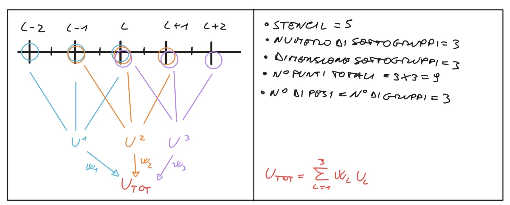
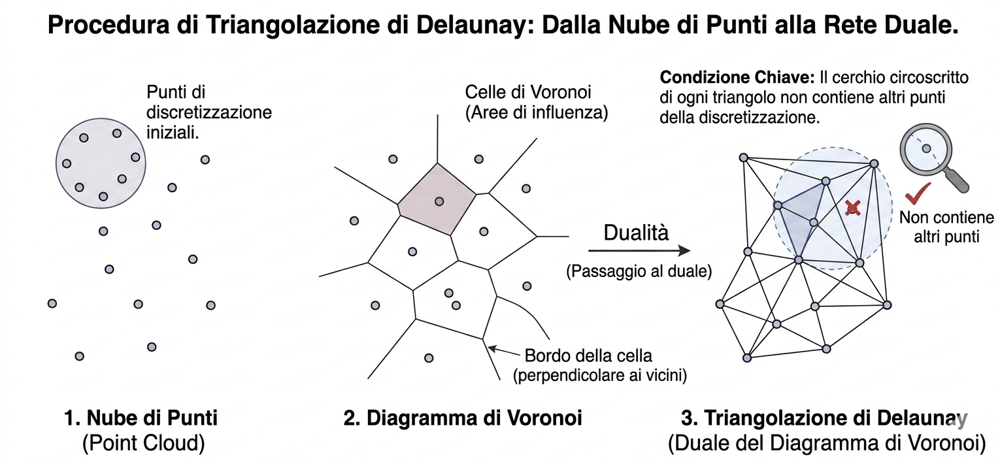
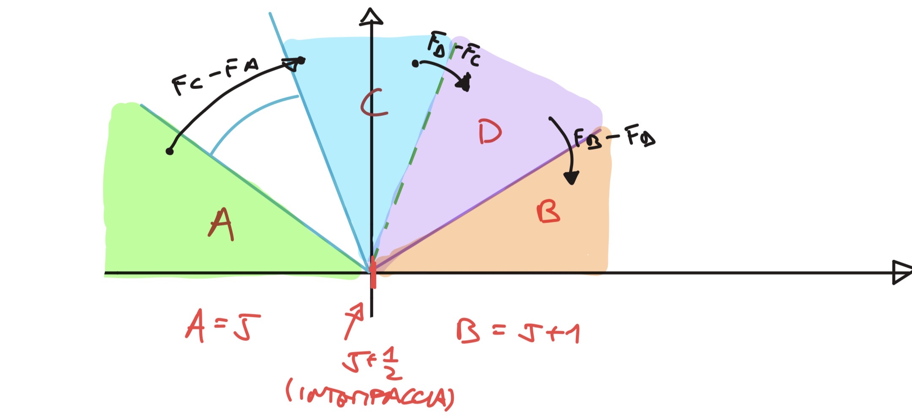

# Finite Volumes Schemes

## 1. Metodo dei Volumi Finiti in 1D

### Equazione conservativa

Si parte dalla forma differenziale conservativa:

$$\frac{\partial u}{\partial t} + \frac{\partial f}{\partial x} = 0, \qquad f = f(u)$$

Si integra su ogni cella $[x_{j-\frac{1}{2}}, x_{j+\frac{1}{2}}]$, ottenendo la forma integrale:

$$\frac{\partial}{\partial t}\int_{x_{j-\frac12}}^{x_{j+\frac12}} u,dx = -\left(f_{j+\frac12} - f_{j-\frac12}\right)$$

### Variabile conservata media di cella

$$\boxed{U_j = \frac{1}{\Delta x}\int_{x_{j-\frac12}}^{x_{j+\frac12}} u,dx}$$

> **Definizione:** $U_j$ è il valore *medio* di $u$ sull’intera cella $j$, non il valore puntuale al centro. Il FVM lavora con medie, le differenze finite con valori puntuali.
> 

### Schema centrato esplicito

Con flussi alle facce come medie aritmetiche:

$$f_{j+\frac12} = \frac{1}{2}(f_j + f_{j+1}), \qquad f_{j-\frac12} = \frac{1}{2}(f_{j-1}+f_j)$$

$$\frac{U_j^{n+1}-U_j^n}{\Delta t} + \frac{f_{j+\frac12}^n - f_{j-\frac12}^n}{\Delta x} = 0$$

**Risultato chiave — Equivalenza FD ↔ FVM in 1D:** In 1D con schema centrato le equazioni sono identiche. La differenza è nell’*interpretazione*: FD assume $U_j \approx u(x_j,t)$ (valore puntuale), FVM assume $U_j$ = media di cella. La distinzione diventa rilevante in 2D/3D su mesh non strutturate.

---

## 2. Mesh Strutturate: Generazione

In una mesh strutturata ogni cella è identificata da indici $(i,j)$. I vicini fisici sono vicini in memoria — grande vantaggio computazionale (~20 contatori per cella, vs ~100 per non strutturata).

| Metodo | Equazioni usate | Vantaggi | Svantaggi |
| --- | --- | --- | --- |
| **Algebrico** | Nessuna PDE — mapping esplicito: $x = x_1 + \xi(x_2-x_1)$ | Velocissimo, banale | No controllo ortogonalità; rischio distorsione; errori di discretizzazione occulti |
| **Ellittico** | Laplace/Poisson: $\nabla^2\xi = 0$ | Griglia liscia, ortogonale con BC Neumann | Costoso (sistema globale iterativo) |
| **Iperbolico** | PDE iperboliche, marcia dalla parete | $\perp$ alla parete automaticamente, ottimo per BL | Problemi su geometrie concave (sovrapposizione) |

> **Note:** Il tipo di PDE usata per generare la griglia riflette come l’informazione si propaga nel dominio di calcolo. Ellittico = si sente tutto il dominio. Iperbolico = marcia in un’unica direzione.
> 

⚠ **Rischio metodo algebrico:** Non si controlla la direzione delle pareti → le linee di griglia non sono perpendicolari alla superficie → errori di discretizzazione nascosti legati allo skewness.

---

## 3. Mesh Non Strutturate

La connettività deve essere memorizzata esplicitamente (maggiore memoria, massima flessibilità geometrica).

### Triangolazione di Delaunay

> **Criterio:** La circonferenza circoscritta a ogni triangolo non deve contenere altri punti della discretizzazione.
> 
- In 2D → triangoli; in 3D → tetraedri
- Duale del diagramma di Voronoi
- Algoritmo globale — buona robustezza, ma difficoltà su geometrie concave

### Metodo Frontale (Advancing Front)

- Si parte dal contorno (il “fronte”) e si aggiungono celle avanzando verso l’interno
- Costruzione locale → maggiore flessibilità su geometrie cave/concave
- Possibile conflitto quando due fronti si incontrano da direzioni “sbagliate”

| Caratteristica | Delaunay | Frontale |
| --- | --- | --- |
| Principio | Criterio globale sulla circonscritta | Crescita locale dal contorno |
| Gestione concavità | Delicata | Buona |
| Qualità vicino parete | Media | Buona |
| Robustezza | Alta | Media |

---

## 4. Celle Centrate vs Nodi Centrati

|  | Celle Centrate (Fluent) | Nodi Centrati (CFX) |
| --- | --- | --- |
| Volume di controllo | La cella direttamente | Griglia duale costruita attorno al nodo |
| BC | Più semplici | Più articolate (il volume di controllo taglia il bordo) |
| Griglia duale | Non serve | Costruita una volta in preprocessing — costo trascurabile |
| Gradi di libertà | Pari al numero di celle | Pari al numero di nodi (più numerosi) |

> La griglia duale ha un overhead trascurabile: si costruisce una volta sola. I nodi centrati offrono più gdl per la stessa mesh, spesso maggiore accuratezza, ma BC più complesse.
> 

---

## 5. Metodo di Godunov & Problema di Riemann

### Idea centrale

Godunov assume soluzione **costante a tratti** (primo ordine). Ogni interfaccia $j+\frac12$ separa due stati costanti → problema di Riemann locale.

> **Problema di Riemann:** PDE iperbolica con dato iniziale a gradino $u(x,0) = u_L$ se $x<0$, $u_R$ se $x>0$. La soluzione consiste di onde (rarefazione, contatto, urto). Esempio classico: **tubo di Sod**.
> 

### Schema di Godunov

Si risolve il Riemann per ogni interfaccia, si ottiene $F_{j+\frac12}$, poi si avanza:

$$U_j^{n+1} = U_j^n - \frac{\Delta t}{\Delta x}\left[F_{j+\frac12} - F_{j-\frac12}\right]$$

### CFL nel metodo di Godunov

La CFL ha interpretazione fisica diretta: $\Delta t$ deve essere abbastanza piccolo da garantire che le onde di due Riemann adiacenti **non si sovrappongano** durante il time step. Se si sovrappongono, il problema locale non è più valido.

$$\text{CFL} = \frac{\lambda_{max},\Delta t}{\Delta x} \leq 1$$

⚠ Risolvere il Riemann esatto per le equazioni di Eulero è iterativo e costoso → nella pratica si usano **solutori approssimati**: Lax-Friedrichs, Rusanov, Roe, HLLC.

---

## 6. Flussi Numerici e Flux Splitting

### Tassonomia

| Categoria | Metodi | Cosa si spezza |
| --- | --- | --- |
| **Flux Difference Splitting (FDS)** | Godunov, Roe, HLLC | La *differenza* $\Delta F = F_R - F_L$ tramite Jacobiana |
| **Flux Vector Splitting (FVS)** | Steger-Warming, van Leer, AUSM+ | Il *vettore flusso* $F = F^+ + F^-$ |
| **Centrati** | Lax-Friedrichs, Rusanov, Jameson | Media + dissipazione artificiale scalare |

### Lax-Friedrichs / Rusanov

$$F_{j+\frac12}^{LF} = \frac{1}{2}(F_j + F_{j+1}) - \frac{\lambda_{max}}{2}(U_{j+1} - U_j)$$

Il termine $-\frac{\lambda_{max}}{2}\Delta U$ è dissipazione numerica scalare. Rusanov usa $\lambda_{max} = \max(|\lambda_j|,|\lambda_{j+1}|)$ — robusto ma molto diffusivo.

### Jameson

Dissipazione adattiva: 2° ordine vicino a discontinuità (cattura urti), 4° ordine altrove (meno diffusivo). Metodo centrato con dissipazione adattata localmente.

---

## 7. Schema di Roe

Solutore di Riemann approssimato. Linearizza il problema all’interfaccia usando la **media di Roe** $\bar{U}$.

### Proprietà richieste

1. **Consistenza:** $\bar{A}(U_R - U_L) = F(U_R) - F(U_L)$
2. **Diagonalizzabilità con autovalori reali** (sistema iperbolico)
3. **Conservatività**

### Media di Roe per le equazioni di Eulero

$$\bar{u} = \frac{\sqrt{\rho_L},u_L + \sqrt{\rho_R},u_R}{\sqrt{\rho_L}+\sqrt{\rho_R}}, \qquad \bar{H} = \frac{\sqrt{\rho_L},H_L + \sqrt{\rho_R},H_R}{\sqrt{\rho_L}+\sqrt{\rho_R}}$$

### Flusso di Roe

$$\overrightarrow{\delta F}_j = \frac{\bar{\lambda}_1 - |\bar{\lambda}_1|}{2},e^1,\delta w_j^1 + \frac{\bar{\lambda}_2 - |\bar{\lambda}_2|}{2},e^2,\delta w_j^2 + \frac{\bar{\lambda}_3 - |\bar{\lambda}_3|}{2},e^3,\delta w_j^3$$

con autovalori $\lambda(\bar{A}) = {\bar{u}-\bar{a},; \bar{u},; \bar{u}+\bar{a}} \in \mathbb{R}$.

⚠ **Entropy Fix:** Roe può produrre violazioni del 2° principio su urti sonici → si corregge con $|\lambda| \to \max(|\lambda|, \epsilon)$.

---

## Domande & Risposte dalla Lezione

**D: Perché considerare solo il flusso convettivo equivale alle equazioni di Eulero?**
Le equazioni di Navier-Stokes hanno flusso convettivo + diffusivo. Il flusso diffusivo è proporzionale a $\mu$ (viscosità) e $k$ (conducibilità termica). Eulero = Navier-Stokes con $\mu = k = 0$ → solo flusso convettivo $\mathbf{F}^c$ → $\partial_t \mathbf{U} + \nabla\cdot\mathbf{F}^c = 0$.

**D: FVS vs FDS — da cosa prende il nome?**
FVS (“Vector”): si spezza il vettore $\mathbf{F} = \mathbf{F}^+ + \mathbf{F}^-$. FDS (“Difference”): si spezza la differenza $\Delta F = F_R - F_L$ tramite la Jacobiana.

**D: Quale griglia si usa a livello commerciale?**
Mesh ibride non strutturate (ICEM, Pointwise, ANSA, Gmsh): strati prismatici strutturati vicino alla parete (BL) + tetraedri non strutturati nel campo lontano. Mesh strutturate multi-blocco per turbomachinario (TurboGrid). Nodi centrati (CFX) spesso preferiti per geometrie complesse; celle centrate (Fluent) per casi più semplici.

---

## Key Takeaways

- $U_j$ nel FVM è una **media di cella**, non un valore puntuale — in 1D centrato coincide con le differenze finite, ma l’interpretazione è diversa.
- Le mesh strutturate si generano con PDE il cui tipo (ellittico/iperbolico) riflette la propagazione dell’informazione geometrica nel dominio.
- Godunov è il FVM upwind per eccellenza: ogni interfaccia è un **problema di Riemann locale**, la CFL garantisce che le onde non si sovrappongano.
- FDS spezza la differenza di flusso (Roe); FVS spezza il vettore flusso stesso (AUSM+).
- Lo schema di Roe richiede che $\bar{A}\Delta U = \Delta F$ — questa condizione di consistenza garantisce la cattura esatta degli urti.


- Metodi di ordine elevati nello spazio
    1. Weighted Essentially Non Oscillatory 5
        
        <aside>
        💡
        
        Un metodo che ha come obiettivo di ridurre oscillazioni spurie della soluzione e conservarne la fedeltà. 
        Per farlo si calcolano diverse soluzioni e tramite una matrice di pesi si ponderano maggiormente le più regolari, ignorando le oscillazioni.
        Nella versione con stencil pari a 5 anziché creare direttamente un polinomio di grado 4 (che produrrebbe overshoot e undershoot) si decide di creare tre gruppi di 3 punti (tre parabole) e di sommarle. 
        
        </aside>
        
        
        
    2. Discontinuous Galerkin 
- Time integration
    1. 
- Delaunay
    
    Questo metodo trasforma un insieme sparso di punti in una rete di triangoli connessi. La sua caratteristica principale è che massimizza gli angoli minimi dei triangoli, evitando triangoli troppo "sottili" o deformati, (evitando i problemi di skewness della mesh) il che è ideale per molte simulazioni e rappresentazioni grafiche.
    
    
    
    ## 1. Nube di Punti (Point Cloud)
    
    - **Che cos'è:** È il punto di partenza. Un insieme di punti discreti (spesso chiamati nodi) distribuiti in uno spazio bidimensionale (o tridimensionale). Questi punti non hanno una connessione predefinita. Nelle nostre applicazioni tali nodi potrebbero essere i nodi della mesh (se ragioniamo a facce centrate altrimenti sarebbero i centri a nodi centrati)
    - **Ruolo:** Rappresenta la discretizzazione del dominio che si vuole studiare o modellare. È l'equivalente di avere una serie di "misurazioni" o "campioni" in posizioni casuali.
    
    ## 2. Diagramma di Voronoi
    
    - **Che cos'è:** È una tassellatura dello spazio basata sulla nube di punti. Per ogni punto (chiamato "sito" o "generatore"), viene creata una cella poligonale.
    - **Proprietà:** Tutti i punti all'interno di una specifica cella di Voronoi sono più vicini al punto generatore di quella cella rispetto a qualsiasi altro punto della nube. I confini della cella sono le bisettrici perpendicolari tra i punti vicini.
    - **Significato:** Definisce l'"area di influenza" di ogni singolo punto. È un modo per dividere il dominio in regioni di prossimità. Anche nella raffinazione della mesh molti software offrono la possibilità di definire e modificare delle aree di influenza.
    
    ## 3. Triangolazione di Delaunay (il "Duale")
    
    - **Che cos'è:** È la rete di triangoli costruita collegando i punti i cui diagrammi di Voronoi condividono un bordo.
    - **La Dualità:** È definita come il *duale* del diagramma di Voronoi. Questo significa che ogni bordo della triangolazione di Delaunay corrisponde a un bordo nel diagramma di Voronoi che separa le celle dei due punti connessi.
    - **La Proprietà Chiave è che non deve contenere altri punti della discretizzazione.**
        
        Più formalmente, si dice che il **cerchio circoscritto (circumcircle)** di ogni triangolo Delaunay non contiene altri punti della nube al suo interno (la cosiddetta "condizione di non-conterere altri punti"). È proprio questa proprietà a garantire triangoli "ben formati". Se un cerchio circoscritto contenesse un altro punto, la triangolazione verrebbe "aggiustata" per soddisfare la condizione.
        
- FVS e FDS
    
    <aside>
    💡
    
    **Flux Vector Splitting (FVS):** Il nome viene dal fatto che si spezza il *vettore flusso* $\mathbf{F}(U)$ in due parti: 
    
    </aside>
    
    $$
    \mathbf{F} = \mathbf{F}^+(U) + \mathbf{F}^-(U)
    $$
    
    dove $\mathbf{F}^+$ trasporta informazione verso destra (autovalori $\lambda \geq 0$) e $\mathbf{F}^-$ verso sinistra (autovalori $\lambda \leq 0$).
    
     Esempio: Steger-Warming, van Leer, AUSM+.
    
    <aside>
    💡
    
    **Flux Difference Splitting (FDS):** Il nome viene dallo splitting della *differenza di flusso* 
    
    </aside>
    
    $$
    \Delta F = F(U_R) - F(U_L)
    $$
    
    usando la diagonalizzazione della Jacobiana $A = \partial F/\partial U$. Si smonta $\Delta F$ nelle sue componenti caratteristiche: 
    
    $$
    \Delta F = A^+ \Delta U + A^- \Delta U.
    $$
    
    Esempio: Roe, Godunov esatto, HLLC.
    
    In breve: FVS spezza il flusso stesso; FDS spezza la differenza tra flussi.
    
- Tipologie di schemi
    
    Once the control volume is identified, the next task is to compute the fluxes across each face, which can be composed by a convective term (Euler equations) or by the sum of convective and diffusive terms (compressible Navier-Stokes equations). In any case, a **convective flux term** is present and different methods to evaluate it will be discussed in this section.
    
    Convective flux evaluation methods fall into two principal families: **upwind schemes** and **central schemes**.
    
    ```mermaid
    graph TD
        %% Metodi Principali
        Root(Convective Flux Evaluation Methods)
        
        Root --> Upwind[Upwind Schemes]
        Root --> Central[Central Schemes]
        
        %% Sotto-categorie Upwind
        Upwind --> FDS[Flux Difference Splitting]
        Upwind --> FVS[Flux Vector Splitting]
        
        %% Metodi FDS
        FDS --> Godunov[Godunov]
        FDS --> Osher[Osher-Pandolfi]
        FDS --> Roe[Roe]
        
        %% Metodi FVS
        FVS --> SW[Steger and Warming]
        FVS --> VL[van Leer]
        FVS --> AUSM[AUSM+]
        
        %% Metodi Central
        Central --> LFR[Lax-Friedrichs or Rusanov]
        Central --> JST[Jameson-Schmidt-Turkel]
    
        %% Styling per chiarezza
        style Root fill:#f9f,stroke:#333,stroke-width:2px
        style Upwind fill:#bbf,stroke:#333,stroke-width:2px
        style Central fill:#bbf,stroke:#333,stroke-width:2px
    
    ```
    
    | Famiglia | Metodo Specifico | Logica Principale | Pro | Contro | Casi d'Uso Ideali |
    | --- | --- | --- | --- | --- | --- |
    | **Upwind (FDS)** | **Roe / Osher** | Risolvono (esattamente o approssimativamente) il problema di Riemann all'interfaccia. | Altissima precisione nelle zone di contatto e strati limite. | Molto costosi computazionalmente; algoritmi complessi. | Aerodinamica esterna, flussi viscosi, analisi di precisione. |
    | **Upwind (FVS)** | **van Leer / Steger-Warming** | Scompongono il vettore flusso in componenti positive e negative basate sugli autovalori. | Molto robusti; eccellenti per catturare urti forti senza "esplodere". | Eccessivamente diffusivi negli strati limite (perdono precisione vicino alle pareti). | Flussi ipersonici, flussi con urti molto violenti. |
    | **Upwind (Ibrido)** | **AUSM+** | Separa la velocità (convezione) dalla pressione (onde sonore). | Unisce la precisione di Roe alla robustezza di van Leer. | Implementazione non banale. | Motori a combustione, flussi chimicamente reagenti, alte velocità. |
    | **Central** | **JST (Jameson-Schmidt-Turkel)** | Media matematica tra le celle con aggiunta di "dissipazione artificiale" controllata (operatori di 2° e 4° ordine). | Estremamente veloci; facili da programmare; ottimi per griglie strutturate. | Richiedono un "tuning" manuale dei coefficienti di dissipazione. | Design di velivoli commerciali, simulazioni industriali standard. |
    | **Central** | **Lax-Friedrichs / Rusanov** | Media semplice con un termine di diffusione molto forte per mantenere la stabilità. | Impossibile da far divergere (estremamente stabile). | Troppo impreciso (spalma eccessivamente i gradienti e gli urti). | Test iniziali di codici, casi dove la stabilità conta più della precisione. |
- Evoluzione storica
    
    **Perché non esiste "lo schema perfetto"?**
    
    La scelta di uno schema piuttosto che un altro è figlia di un'evoluzione storica e tecnologica guidata da un compromesso tra **accuratezza** e **costo computazionale**.
    
    1.	**L'epoca dei Central:** All'inizio della CFD, la potenza di calcolo era minima. Gli schemi centrati erano i preferiti perché richiedevano poche operazioni matematiche. Tuttavia, avevano un difetto fatale: in presenza di urti (shocks), generavano oscillazioni numeriche (instabilità) che distruggevano la soluzione. Per "curarli", gli scienziati dovettero inventare la **dissipazione artificiale** (come nel metodo JST), ovvero aggiungere volutamente un po' di "errore controllato" per stabilizzare il calcolo.
    
    2.	**La rivoluzione di Godunov (Upwind):** Godunov capì che per risolvere correttamente i flussi supersonici bisognava rispettare la fisica: l'informazione viaggia in una direzione specifica (da monte a valle). Questo portò agli schemi **Upwind**. Sono matematicamente "più intelligenti" perché sanno da dove viene il fluido, ma questa intelligenza costa cara in termini di tempo di calcolo.
    
    3.	**Il dilemma moderno:** * Se stai progettando un jet supersonico dove l'onda d'urto è fondamentale, userai un **Roe** o un **AUSM+** perché non puoi permetterti errori sulla posizione dell'urto.
    
    - Se stai facendo un'analisi preliminare di un'ala di un aereo di linea a velocità moderata, un metodo **Central (JST)** è ancora oggi una scelta imbattibile per velocità e affidabilità.
    
    In breve: si è passati dal "far girare il codice senza farlo crashare" (Central + Dissipazione) al "catturare la fisica esatta" (Upwind/FDS), cercando oggi di trovare il punto di equilibrio con metodi ibridi.
    
- Logica e causalità upwind e centrati
    
    **Perché l'Upwind è "più fisico"?**
    
    Il concetto è molto intuitivo se pensi al **principio di causalità**. In fisica, l'informazione non appare dal nulla: si muove a una certa velocità in una certa direzione.
    
    **1. L'analogia del fiume**
    
    Immagina di essere seduto su una barca in un fiume che scorre velocissimo (flusso supersonico). Se vuoi sapere se tra un minuto andrai a sbattere contro un masso, devi guardare **davanti a te** (a monte, ovvero upwind). Guardare dietro di te (downwind) non ti serve a nulla: quello che è già passato non può più influenzare la tua posizione attuale.
    
    - **Metodo Upwind:** Guarda solo nella direzione da cui proviene l'informazione. Se il vento soffia da destra, "ascolta" solo quello che succede a destra.
    - **Metodo Central:** Fa una media tra destra e sinistra. In un flusso supersonico, questo è un errore fisico: stai dicendo che quello che succede a valle può influenzare quello che succede a monte, il che viola la realtà dei fatti.
    
    **2. Le "Caratteristiche" e gli Autovalori**
    
    Tecnicamente, nelle equazioni di Eulero o Navier-Stokes, l'informazione viaggia lungo delle linee chiamate **caratteristiche**. La velocità di queste informazioni è legata agli autovalori della matrice Jacobiana del flusso:
    
    - u: la velocità del fluido (trasporto di massa).
    - u + c: un'onda sonora che viaggia nel verso del fluido.
    - u - c: un'onda sonora che viaggia controcorrente.
    
    In un flusso **supersonico** (u > c), tutti questi valori sono positivi. Significa che tutta l'informazione viaggia in una sola direzione. Lo schema Upwind lo sa e usa solo i dati che provengono da quella direzione. Lo schema Central, invece, cerca di usare dati da entrambe le parti, creando "confusione" numerica che si traduce in oscillazioni assurde o instabilità vicino agli urti.
    
    **In sintesi:**
    
    Gli schemi Upwind rispettano la **direzionalità della propagazione dei segnali**. È come se il software dicesse: "Ehi, so che il fluido si muove verso destra a Mach 2, quindi ignoro completamente quello che succede a sinistra perché non può influenzare questo punto". I metodi Central sono più "democratici" (ascoltano tutti), ma in fluidodinamica la democrazia spesso porta al caos numerico!
    
- Godunov
    
    1 — L’immagine del ventaglio: caso fortunato o generico?
    È il caso generico, non sfortunato. Ogni interfaccia  nel metodo di Godunov è per definizione un problema di Riemann locale — indipendentemente da cosa ci sia nel flusso fisico. La struttura delle caratteristiche che si vedono nel diagramma - non è “a cavallo di un urto reale”: è la struttura della soluzione matematica del problema di Riemann che il metodo costruisce artificialmente a ogni interfaccia a ogni passo temporale.
    La soluzione del problema di Riemann per le equazioni di Eulero 1D produce sempre 3 onde (perché ci sono 3 autovalori , , ):
    
    
    
    Se i due stati sono quasi uguali (interfaccia “normale” lontana da fenomeni forti), le 3 onde sono debolissime (onde acustiche quasi nulle) — ma esistono. Se l’interfaccia è in corrispondenza di un urto fisico, una delle onde diventa forte. Le caratteristiche si propagano da ogni interfaccia, sempre, con questa struttura a ventaglio. L’onda sinistra può essere un’onda di rarefazione (ventaglio di caratteristiche) oppure un urto (singola linea), e lo stesso per l’onda destra — il solver di Riemann determina quale caso si applica in base ai due stati  e .
    
    ## 1 — Cosa sono i $\sigma_k$?
    
    $\sigma_k = \text{sign}(\lambda_k)$ è il **segno dell'autovalore** $k$-esimo. Per le equazioni di Eulero 1D i tre autovalori sono:
    
    $$
    \lambda_1 = u - a, \quad \lambda_2 = u, \quad \lambda_3 = u + a \\
    \sigma_k = \text{sign}(\lambda_k)
    $$
    
    Quindi $\sigma_k \in \{-1, +1\}$ e descrive la **direzione di propagazione** dell'onda $k$:
    
    | Regime | Condizione | Segni $(\sigma_1, \sigma_2, \sigma_3)$ |
    | --- | --- | --- |
    | **Subsonico** | $u< a$ | $(-1,+1,+1)$ |
    | **Supersonico (destra)** | $u > a$ | $(+1, +1, +1)$ |
    | **Supersonico (sinistra)** | $u < -a$ | $(-1, -1, -1)$ |
    
    I $\sigma_k$ entrano nelle formule dello splitting tramite i proiettori:
    
    $$
    \frac{1 + \sigma_k}{2} = \begin{cases} 1 & \text{se } \sigma_k = +1 \\ 0 & \text{se } \sigma_k = -1 \end{cases}
    $$
    
    $$
    \frac{1 - \sigma_k}{2} = \begin{cases} 0 & \text{se } \sigma_k = +1 \\ 1 & \text{se } \sigma_k = -1 \end{cases}
    $$
    
    ---
    
    ## 2 — Interpretazione CFL nel metodo di Godunov
    
    In un diagramma $x-t$, si consideri una cella centrata in $j$ $[x_{j-1/2}, x_{j+1/2}]$. L'interpretazione fisica della **CFL** è: **le caratteristiche generate dall'interfaccia $j+1/2$ e quelle generate dall'interfaccia $j-1/2$ non devono sovrapporsi all'interno della cella durante il time step $\Delta t$.**
    
    La condizione quantitativa è:
    
    $$
    
    \text{CFL} = \frac{\lambda_{max} \Delta t}{\Delta x} \leq 1, \quad \lambda_{max} = \max_j \max_k |\lambda_k^j|
    $$
    
    $\Delta t$ deve essere tale da tenere tutte le caratteristiche dentro la cella di partenza per garantire che la soluzione locale del problema di Riemann rimanga valida.
    
    ---
    
    ## 3 — Lo splitting dei flussi: segni e contributi
    
    ### Notazione all'interfaccia $j+1/2$
    
    - **Stato A** $= U_j$ (sinistra) prima di tutto
    - **Stato B** $= U_{j+1}$ (destra) dopo anche l’urto
    - **Stato C** $=$ stato intermedio dopo l'onda 1 (ventaglio di espansione)
    - **Stato D** $=$ stato intermedio dopo il contatto (onda 2) ovvero slip Line
    
    Il **salto totale dei flussi** $F_B - F_A$ si scompone in tre contributi:
    
    
    
    $$
    
    F_B - F_A = \underbrace{(F_C - F_A)}_{\text{onda 1}} + \underbrace{(F_D - F_C)}_{\text{onda 2}} + \underbrace{(F_B - F_D)}_{\text{onda 3}}
    $$
    
    > Questa operazione è matematicamente corretta poiché si aggiunge e toglie $F_C$ ed $F_D$.
    > 
    
    Dal punto di vista logico l’idea è esprimere la variazione del flusso totale tra la l’interfaccia tra le celle A=j e B=j+1 con le singole variazioni dei flussi a cavallo delle onde tipiche del problema di Riemann (espansione, slip line e urto).
    
    Dal punto di vista fisico il flusso è diverso poiché il campo di moto è stato modificato
    
    ### Definizione di $\overrightarrow{DF}$ e $\overleftarrow{DF}$
    
    Separiamo i contributi che vanno a destra ($\rightarrow$) da quelli che vanno a sinistra ($\leftarrow$):
    
    $$
    
    \overrightarrow{DF}_j = \frac{1 + \sigma_1}{2}(F_C - F_A) + \frac{1 + \sigma_2}{2}(F_D - F_C) + \frac{1 + \sigma_3}{2}(F_B - F_D)\\
    \overleftarrow{DF}_j = \frac{1 - \sigma_1}{2}(F_C - F_A) + \frac{1 - \sigma_2}{2}(F_D - F_C) + \frac{1 - \sigma_3}{2}(F_B - F_D)
    $$
    
    ### Aggiornamento della cella $j$
    
    Il flusso numerico di Godunov è 
    Sostituendo nell'equazione di bilancio, otteniamo il risultato centrale (natura **upwind**):
    
    $$
    F_{j+1/2} = F_j + \overleftarrow{DF}j = F{j+1} - \overrightarrow{DF}_j
    $$
    
    $$
    U_j^{n+1} = U_j^n - \frac{\Delta t}{\Delta x} \left[ \overleftarrow{DF}j + \overrightarrow{DF}{j-1} \right]
    $$
    
    La cella $j$ riceve solo informazioni fisicamente entranti: onde destre dall'interfaccia sinistra e onde sinistre dall'interfaccia destra.
    
    ---
    
    ## 4 — Approssimazione dell'onda di espansione e Schema di Roe
    
    Lo schema di **Roe** linearizza il problema di Riemann usando una matrice Jacobiana media $\bar{A}$.
    
    - **Perché si fa?** Risolvere il problema non lineare esatto richiederebbe un loop iterativo (Newton) a ogni interfaccia, con costi computazionali enormi. Roe è estremamente economico.
    - **Il problema (Expansion Shocks):** Essendo basato su un sistema linearizzato, Roe non distingue tra urti compressivi e urti espansivi. Può produrre soluzioni che violano il secondo principio della termodinamica (urti espansivi non fisici), specialmente in regime transonico ($u \approx a$).
    
    ### Correzioni (Entropy Fix)
    
    Per ovviare a questo problema senza tornare al costo di Godunov esatto, si usano:
    
    - **Entropy fix di Harten-Hyman:** aggiunge viscosità numerica artificiale solo dove $|\lambda_k| < \epsilon$ (punti sonici).
    - **Solver HLLC:** un approccio approssimato alternativo che soddisfa nativamente la condizione di entropia.
- Roe