# Turbolence

- Covarianza tra le fluttuazioni e interpretazione fisica
    
    **1. Media delle fluttuazioni (**\overline{u'}**)**
    
    - **Matematicamente:** È sempre **zero** per costruzione (\overline{u'} = 0). Se prendi tutti gli scarti rispetto alla media e li sommi, i "più" e i "meno" si cancellano esattamente.
    - **Fisicamente:** Rappresenta il "rumore" puramente casuale che non sposta il valore medio nel lungo periodo. È come oscillare avanti e indietro sulla stessa sedia: ti muovi, ma la tua posizione media non cambia.
    
    **2. Prodotto delle medie (**\bar{u}_i \bar{u}_j**)**
    
    - **Matematicamente:** È il prodotto dei valori costanti (o mediati nel tempo).
    - **Fisicamente:** Rappresenta il **trasporto di quantità di moto del campo medio**. È il movimento "organizzato" del fluido, quello che vedresti in un flusso perfettamente laminare e liscio.
    
    **3. Media del prodotto (**\overline{u_i u_j}**)**
    
    - **Matematicamente:** È la media del segnale totale "sporco".
    - **Fisicamente:** È il **trasporto totale effettivo** di quantità di moto. Include sia il movimento ordinato che quello caotico dovuto ai vortici.
    
    **4. La Covarianza (**\overline{u_i' u_j'}**)**
    
    Matematicamente definita come \overline{u_i u_j} - \bar{u}_i \bar{u}_j, in fisica della turbolenza è il cuore del **Tensore di Reynolds**.
    
    | Scenario | Significato Matematico | Significato Fisico |
    | --- | --- | --- |
    | **Variabili Scorrelate** | La covarianza è **zero**. La media del prodotto è uguale al prodotto delle medie ($\overline{u_i u_j} = \bar{u}_i \bar{u}_j$). | Le fluttuazioni in una direzione non influenzano l'altra. Il fluido è caotico ma "disorganizzato", non c'è un trasporto netto di quantità di moto extra dovuto ai vortici. |
    | **Variabili Correlate** | La covarianza è **diversa da zero**. Il prodotto delle fluttuazioni "sopravvive" alla media ($\overline{u_i' u_j'} \neq 0$). | **C'è turbolenza attiva.** I vortici spostano masse di fluido in modo coerente. Ad esempio, un guizzo verso l'alto ($v' > 0$) trasporta con sé fluido più lento ($u' < 0$). Questo crea uno "sforzo" che frena il campo medio. |
    
    **Cos'è la Covarianza (in generale)**
    
    In statistica, la **covarianza** è una misura di quanto due variabili casuali varino insieme. Se hai due variabili X e Y, la covarianza indica se al crescere di una, l'altra tende a crescere (covarianza positiva), a decrescere (covarianza negativa) o se non c'è alcuna relazione lineare (covarianza zero).
    
    Matematicamente è definita come il valore atteso (o media) del prodotto degli scarti:
    
    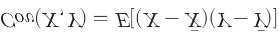
    
    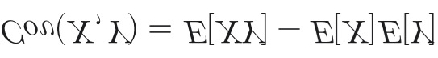
    
    (In fluidodinamica, l'operatore media \overline{(\cdot)} sostituisce il valore atteso E[\cdot]).
    
    **Perché nella turbolenza non è nulla e i termini non coincidono?**
    
    Dire che la covarianza non è nulla significa dire che **i due termini** \overline{u_i u_j} **e** \bar{u}_i \bar{u}_j **non coincidono**. Ecco il motivo fisico e matematico:
    
    **1. Il motivo matematico: Le fluttuazioni non sono indipendenti**
    
    Se le fluttuazioni u_i' e u_j' fossero indipendenti (come il risultato del lancio di due dadi diversi), la loro media del prodotto sarebbe zero. Ma nella turbolenza, le fluttuazioni sono **correlate**.
    
    Immagina un fluido che scorre vicino a una parete: se una particella riceve una spinta verso l'alto (v' > 0), essa proviene da una zona vicina al muro dove il fluido è più lento. Di conseguenza, quella particella avrà probabilmente una velocità orizzontale inferiore alla media della zona in cui arriva (u' < 0).
    
    Poiché u' e v' tendono a presentarsi "a coppie" con segni legati, il loro prodotto u' \cdot v' non sarà mediamente zero.
    
    **2. Il motivo fisico: Il trasporto turbolento**
    
    Se \overline{u_i u_j} e \bar{u}_i \bar{u}_j coincidessero, vorrebbe dire che la turbolenza non ha alcun effetto sul movimento globale del fluido.
    
    Invece, la differenza tra i due termini è proprio il **Tensore degli Sforzi di Reynolds**:
    
    **In sintesi:** Non coincidono perché la turbolenza è un fenomeno "organizzato" in vortici; i vortici creano una struttura nelle fluttuazioni tale per cui queste non si annullano a vicenda quando vengono moltiplicate tra loro.
    
- Calcolo viscosità turbolenta
    
    
    | Modello | Descrizione | Pro | Contro | Casi Applicativi |
    | --- | --- | --- | --- | --- |
    | **Algebrici** (es. Baldwin-Lomax) | Modelli a "zero equazioni". Calcolano $\mu_T$ basandosi su profili di velocità e lunghezze di rimescolamento locali senza equazioni differenziali aggiuntive[span_1](notion://www.notion.so/start_span)[span_1](notion://www.notion.so/end_span). | Estremamente veloci, robusti e con costo computazionale quasi nullo[span_2](notion://www.notion.so/start_span)[span_2](notion://www.notion.so/end_span). | Non tengono conto del trasporto della turbolenza (storia del flusso); falliscono in presenza di separazione[span_3](notion://www.notion.so/start_span)[span_3](notion://www.notion.so/end_span). | Flussi semplici, strati limite attaccati, profili alari in condizioni di crociera lineare[span_4](notion://www.notion.so/start_span)[span_4](notion://www.notion.so/end_span). |
    | **1 Eq. Trasporto** (es. Spalart-Allmaras) | Risolve una singola equazione differenziale di trasporto per una variabile direttamente legata alla viscosità turbolenta[span_5](notion://www.notion.so/start_span)[span_5](notion://www.notion.so/end_span). | Ottimo compromesso tra velocità e precisione; molto più accurato degli algebrici per l'aerodinamica[span_6](notion://www.notion.so/start_span)[span_6](notion://www.notion.so/end_span). | Non è un modello universale; limitato in flussi con geometrie interne molto complesse[span_7](notion://www.notion.so/start_span)[span_7](notion://www.notion.so/end_span). | Standard nel settore aerospaziale per lo studio di ali ad alto numero di Reynolds[span_8](notion://www.notion.so/start_span)[span_8](notion://www.notion.so/end_span). |
    | **2 Eq. ($k$-$\epsilon$)** | Risolve due equazioni: una per l'energia cinetica turbolenta ($k$) e una per il tasso di dissipazione ($\epsilon$)[span_9](notion://www.notion.so/start_span)[span_9](notion://www.notion.so/end_span). | Molto robusto e affidabile per simulazioni in zone di fluido indisturbato (free-stream)[span_10](notion://www.notion.so/start_span)[span_10](notion://www.notion.so/end_span). | Poco accurato vicino alle pareti e in presenza di forti gradienti di pressione negativi[span_11](notion://www.notion.so/start_span)[span_11](notion://www.notion.so/end_span). | Flussi industriali generici, scambiatori di calore, flussi in condotti lontani dalle pareti[span_12](notion://www.notion.so/start_span)[span_12](notion://www.notion.so/end_span). |
    | **2 Eq. ($k$-$\omega$)** | Risolve due equazioni per $k$ e la frequenza specifica di dissipazione ($\omega$)[span_13](notion://www.notion.so/start_span)[span_13](notion://www.notion.so/end_span). | Eccellente accuratezza nella regione del sotto-strato viscoso vicino alle pareti[span_14](notion://www.notion.so/start_span)[span_14](notion://www.notion.so/end_span). | Estremamente sensibile ai valori impostati per il fluido esterno (condizioni al contorno)[span_15](notion://www.notion.so/start_span)[span_15](notion://www.notion.so/end_span). | Flussi interni, strati limite dove la fisica a parete è l'aspetto critico del calcolo[span_16](notion://www.notion.so/start_span)[span_16](notion://www.notion.so/end_span). |
    | **2 Eq. (SST Menter)** | Modello "Shear Stress Transport". Usa funzioni di *blending* per usare $k$-$\omega$ a parete e $k$-$\epsilon$ lontano da essa[span_17](notion://www.notion.so/start_span)[span_17](notion://www.notion.so/end_span). | Combina i punti di forza di entrambi i modelli, eliminando le rispettive debolezze[span_18](notion://www.notion.so/start_span)[span_18](notion://www.notion.so/end_span). | Leggermente più oneroso e complesso da calibrare rispetto ai modelli standard a 2 eq[span_19](notion://www.notion.so/start_span)[span_19](notion://www.notion.so/end_span). | Attuale standard industriale per flussi con separazione, stalli e gradienti di pressione avversi[span_20](notion://www.notion.so/start_span)[span_20](notion://www.notion.so/end_span). |
    | **RSM** (Reynolds Stress Models) | Abbandona l'ipotesi di Boussinesq e risolve 7 equazioni differenziali (una per ogni componente del tensore di Reynolds)[span_21](notion://www.notion.so/start_span)[span_21](notion://www.notion.so/end_span). | Gestisce l'anisotropia della turbolenza; ottimo per flussi con forti curvature o rotazioni[span_22](notion://www.notion.so/start_span)[span_22](notion://www.notion.so/end_span). | Molto costoso computazionalmente; difficile da far convergere numericamente[span_23](notion://www.notion.so/start_span)[span_23](notion://www.notion.so/end_span). | Cicloni, flussi rotanti, curve strette in condotti, motori a combustione interna[span_24](notion://www.notion.so/start_span)[span_24](notion://www.notion.so/end_span). |
- Confronto DNS / LES / RANS
    
    Le tre famiglie di approcci alla simulazione CFD di flussi turbolenti differiscono per il trattamento delle scale di turbolenza: quale parte dello spettro viene risolta direttamente e quale viene modellata.
    
    ### DNS
    
    **Direct Numerical Simulation**
    
    - Risolve *tutte* le scale
    - Griglia: \(N \propto Re^{3/4}\) per dim.
    - Costo: \(\propto Re^3\)
    - Nessuna modellazione
    - Solo ricerca / Re bassi
    
    ### LES
    
    **Large Eddy Simulation**
    
    - Risolve scale grandi
    - Modella scale piccole (SGS)
    - Costo intermedio
    - Filtraggio spaziale
    - Buon compromesso
    
    ### RANS
    
    **Reynolds-Averaged NS**
    
    - Risolve solo il campo medio
    - Modella *tutta* la turbolenza
    - Costo minimo
    - Chiusura necessaria
    - Uso industriale
    
    ⚠ Costo computazionale DNS
    
    Il numero di punti griglia per dimensione scala come \(N \propto Re^{3/4}\), quindi in 3D il numero totale di celle è \(N_{tot} \propto Re^{9/4}\). Tenendo conto del passo temporale (anch'esso proporzionale alla scala di Kolmogorov), il costo complessivo scala come
    
    **\(\text{Costo} \propto Re^3\)**
    
    . Per \(Re = 10^6\) (flusso esterno aeronautico tipico), il costo è proibitivo.
    
    💡 Universalità delle piccole scale
    
    Kolmogorov (1941) ipotizzò che le piccole scale di turbolenza — dette scale di Kolmogorov \(\eta, \tau_\eta, u_\eta\) — siano
    
    **universali**
    
    : dipendono solo dalla viscosità cinematica \(\nu\) e dalla dissipazione \(\varepsilon\), indipendentemente dalla geometria e dalle condizioni al contorno. È la risposta alla domanda 1 del professore.
    
- Tipi di Media e Operatore di Media
    
    ### Media Temporale
    
    Usata per flussi statisticamente stazionari. Si calcola come limite dell'integrale temporale su un intervallo \(T \to \infty\):
    
    $$\bar{u}_i(\mathbf{x}) = \lim_{T \to \infty} \frac{1}{T} \int_t^{t+T} u_i(\mathbf{x}, t')\, dt'$$
    
    ### Media Spaziale (d'insieme)
    
    Usata per flussi con turbolenza omogenea (invariante per traslazione spaziale):
    
    $$\bar{u}(t) = \lim_{\Omega \to \infty} \frac{1}{\Omega} \int_\Omega u(\mathbf{x}, t)\, d\Omega$$
    
    ### Media di Favre (Compressibile)
    
    Per flussi compressibili, la media standard di Reynolds crea accoppiamenti tra l'equazione di continuità e quella di quantità di moto. La **media di Favre** è una media pesata sulla densità:
    
    $$\tilde{u}_i(\mathbf{x}) = \frac{\overline{\rho\, u_i}}{\bar{\rho}} = \frac{1}{\bar{\rho}} \lim_{T\to\infty} \frac{1}{T}\int_t^{t+T} \rho(\mathbf{x},t')\, u_i(\mathbf{x},t')\, dt'$$
    
    ⚠ Risposta alla Domanda 6 — Perché la pressione non è mediata con Favre?
    
    Nella media di Favre, si usa la ponderazione per densità per
    
    *semplificare*
    
    l'equazione di continuità e di quantità di moto compressibile. La pressione
    
    **non**
    
    viene mediata con Favre ma con la media di Reynolds ordinaria (\(\bar{p}\)) perché la pressione è già un termine scalare che compare linearmente: ponderarla per \(\rho\) introdurrebbe correlazioni aggiuntive senza vantaggio. In pratica, si sceglie quale variabile mediare con Favre in base a dove la semplificazione algebrica è massima.
    
- Decomposizione di Reynolds
    
    Qualunque variabile \(q\) si decompone in media + fluttuazione:
    $$u_i(\mathbf{x},t) = \bar{u}_i(\mathbf{x}) + u_i'(\mathbf{x},t)$$
    Per definizione: \(\overline{u_i'} = 0\) (la media della fluttuazione è nulla).
    
    ⚠ Risposta alla Domanda 3 — La media delle fluttuazioni è sempre nulla?
    
    La proprietà \(\overline{u'} = 0\) vale
    
    **per costruzione**
    
    , indipendentemente dalla stazionarietà statistica, purché la media sia definita coerentemente. Tuttavia, per la media temporale, il limite \(T\to\infty\) deve essere ben definito, e ciò richiede che il processo sia
    
    *ergodico*
    
    (la media temporale su un singolo campione = media d'insieme). Questo è garantito dalla stazionarietà statistica, ma non è strettamente necessario se si usa la media d'insieme.
    
    u(t) — segnale totaleūū(x) — media (costante nel tempo)u'
    
    Decomposizione di Reynolds: segnale turbolento (viola) = media temporale costante (azzurro) + fluttuazione (verde)
    
- Proprietà dell'Operatore di Media
    
    📘 Proprietà fondamentali (media di Reynolds)
    
    | Proprietà | Espressione | Nota |
    | --- | --- | --- |
    | Idempotenza | \(\bar{\bar{u}} = \bar{u}\) | La media di una media è la media |
    | Media della fluttuazione | \(\overline{u'} = 0\) | Per costruzione |
    | Linearità | \(\overline{au+bv} = a\bar{u}+b\bar{v}\) | Sempre valida |
    | Commutazione con \(\partial\) | \(\overline{\partial u/\partial x_i} = \partial\bar{u}/\partial x_i\) | Condizione da verificare |
    | Media del prodotto | \(\overline{uv} = \bar{u}\bar{v} + \overline{u'v'}\) | Non lineare! |
    
    ⚠ Risposta alla Domanda 5 — Quando commutano media e derivate?
    
    Matematicamente, la commutazione \(\overline{\partial u/\partial x_i} = \partial\bar{u}/\partial x_i\) è valida se:
    
    - La media è un'operazione lineare con limiti di integrazione *costanti* (non dipendenti dalla variabile di derivazione)
    - Per la media temporale: i limiti di integrazione \([t, t+T]\) non dipendono da \(\mathbf{x}\) → commuta con \(\partial/\partial x_i\)
    - Per la media spaziale su dominio fisso: commuta con \(\partial/\partial t\)
    - **Non commuta** con \(\partial/\partial t\) se si usa la media temporale e il campo è non stazionario (caso URANS)
    
    Fisicamente: la commutazione è valida quando l'operazione di media non "vede" variazioni nella direzione di derivazione — cioè quando la separazione di scale tra le fluttuazioni e il campo medio è netta.
    
    ### Prodotto di due fluttuazioni sinusoidali
    
    Il professore ha enfatizzato questo punto cruciale: il prodotto di due fluttuazioni **non ha media nulla**.
    
    $$u' = A\sin(\omega t) \quad \Rightarrow \quad \overline{(u')^2} = \overline{A^2\sin^2(\omega t)} = \frac{A^2}{2} \neq 0$$
    
    ✅ Teorema chiave
    
    \(\overline{u'} = 0\) ma \(\overline{u'^2} \neq 0\) in generale. È proprio questo termine che genera il tensore di Reynolds nelle equazioni mediate.
    
- Derivazione RANS Incompressibili
    
    ### Punto di partenza: equazioni NS incompressibili
    
    $$\frac{\partial u_i}{\partial x_i} = 0 \qquad (\text{continuità})$$
    $$\rho\frac{\partial u_i}{\partial t} + \rho u_j \frac{\partial u_i}{\partial x_j} = -\frac{\partial p}{\partial x_i} + \frac{\partial \tau_{ij}}{\partial x_j}$$
    
    ### Applicazione della decomposizione di Reynolds
    
    Si sostituisce \(u_i = \bar{u}_i + u_i'\) e \(p = \bar{p} + p'\) e si applica l'operatore di media:
    
    - Passaggi dettagliati della derivazione
        
        **Step 1 — Continuità:**
        
        $$\frac{\partial(\bar{u}_i + u_i')}{\partial x_i} = 0 \quad\Rightarrow\quad \frac{\partial\bar{u}_i}{\partial x_i} + \underbrace{\frac{\partial u_i'}{\partial x_i}}_{=\,0} = 0$$
        
        **Step 2 — Termine non lineare \(\rho u_j \partial u_i/\partial x_j\):**
        
        Il termine convettivo si espande e si media. Usando la linearità e le proprietà \(A, B, C, D\) del professore:
        
        $$\overline{u_j \frac{\partial u_i}{\partial x_j}} = \underbrace{\bar{u}_j \frac{\partial\bar{u}_i}{\partial x_j}}_{A} + \underbrace{\overline{u_j'\frac{\partial u_i'}{\partial x_j}}}_{B\neq 0}$$
        
        Il termine B si riscrive usando la divergenza di fluttuazione nulla:
        
        $$\overline{u_j'\frac{\partial u_i'}{\partial x_j}} = \frac{\partial}{\partial x_j}\overline{u_i' u_j'}$$
        
        **Step 3 — Equazione RANS risultante:**
        
        $$\rho\frac{\partial\bar{u}_i}{\partial t} + \rho\bar{u}_j\frac{\partial\bar{u}_i}{\partial x_j} = -\frac{\partial\bar{p}}{\partial x_i} + \frac{\partial}{\partial x_j}\left(\bar{\tau}_{ij} - \rho\overline{u_i'u_j'}\right)$$
        
    
    ✅ Equazione RANS — forma finale
    
    $$\rho\frac{\partial\bar{u}_i}{\partial t} + \rho\bar{u}_j\frac{\partial\bar{u}_i}{\partial x_j} = -\frac{\partial\bar{p}}{\partial x_i} + \frac{\partial}{\partial x_j}\underbrace{\left(\bar{\tau}_{ij} - \rho\overline{u_i'u_j'}\right)}_{\text{sforzo viscoso + sforzo di Reynolds}}$$
    Il termine \(-\rho\overline{u_i'u_j'}\) è il tensore di Reynolds: le fluttuazioni si comportano come uno sforzo aggiuntivo.
    
    ### RANS vs URANS
    
    📘 Risposta alla Domanda 4 — URANS
    
    | Metodo | Media usata | Informazione temporale | Uso tipico |
    | --- | --- | --- | --- |
    | **RANS** | Temporale \(T\to\infty\) | Persa completamente | Flussi stazionari in media |
    | **URANS** | Media su \(T_{avg}\) piccolo rispetto alla fluttuazione lenta ma grande rispetto alla turbolenza | Conservata per le variazioni lente | Flussi con instazionarietà coerente (es. vortex shedding) |
    
    Le URANS usano una media su un intervallo \(T_{avg}\) tale che: **\(\tau_{turb} \ll T_{avg} \ll \tau_{slow}\)**. In questo modo si filtrano le fluttuazioni turbolente ma si mantiene la variazione lenta del campo medio nel tempo.
    
- Tensore di Reynolds e Energia Cinetica Turbolenta
    
    ### Tensore di Reynolds
    
    $$\mathbf{R} = -\rho\overline{u_i'u_j'} = -\rho\begin{pmatrix} \overline{u_1'^2} & \overline{u_1'u_2'} & \overline{u_1'u_3'} \\ \overline{u_2'u_1'} & \overline{u_2'^2} & \overline{u_2'u_3'} \\ \overline{u_3'u_1'} & \overline{u_3'u_2'} & \overline{u_3'^2} \end{pmatrix}$$
    
    💡 Struttura del tensore
    
    Il tensore è simmetrico (\(\overline{u_i'u_j'} = \overline{u_j'u_i'}\)), quindi ha solo
    
    **6 componenti indipendenti**
    
    . Queste 6 incognite non possono essere ricavate dalle sole equazioni RANS (il sistema è aperto): servono modelli di chiusura.
    
    ### Energia Cinetica Turbolenta \(k\)
    
    📘 Definizione
    
    $$k = \frac{1}{2}\overline{u_i'u_i'} = \frac{1}{2}\left(\overline{u'^2} + \overline{v'^2} + \overline{w'^2}\right)$$
    È la traccia del tensore di Reynolds (a meno di un segno e del fattore \(\rho/2\)): \(\,k = -\frac{1}{2\rho}\,\text{tr}(\mathbf{R})\).
    
    ### Scale di Kolmogorov
    
    $$\eta = \left(\frac{\nu^3}{\varepsilon}\right)^{1/4} \qquad \tau_\eta = \left(\frac{\nu}{\varepsilon}\right)^{1/2} \qquad u_\eta = (\nu\varepsilon)^{1/4}$$
    
    💡 Risposta alla Domanda 1 — Universalità delle piccole scale
    
    Le scale di Kolmogorov \(\eta, \tau_\eta, u_\eta\) dipendono solo da \(\nu\) (proprietà del fluido) e \(\varepsilon\) (tasso di dissipazione). La
    
    *dissipazione*
    
    è determinata dalle grandi scale (che impongono la quantità di energia da smaltire), ma le
    
    *piccole scale*
    
    si adattano per dissipare quella energia. Per questo la loro struttura è
    
    **universale**
    
    : non dipende dalla geometria, dalle condizioni al contorno o dal numero di Reynolds. Dipendono solo dall'ambiente (il fluido, \(\nu\)) e dalla domanda di energia (la cascata, \(\varepsilon\)).
    
- Modelli di Chiusura e Ipotesi di Boussinesq
    
    ### Ipotesi di Boussinesq (viscosità turbolenta)
    
    📘 Definizione
    
    Il tensore di Reynolds viene modellato analogamente allo sforzo viscoso laminare:
    $$\tau_{ij}^R = -\rho\overline{u_i'u_j'} = 2\mu_T S_{ij} - \frac{2}{3}\rho k\,\delta_{ij}$$
    dove \(S_{ij} = \frac{1}{2}\left(\frac{\partial\bar{u}_i}{\partial x_j} + \frac{\partial\bar{u}_j}{\partial x_i}\right)\) è il tensore della velocità di deformazione del campo medio e \(\mu_T\) è la viscosità turbolenta (o eddy viscosity).
    
    ⚠ Limite dell'ipotesi di Boussinesq
    
    Boussinesq assume che il tensore di Reynolds sia
    
    *allineato*
    
    con il tensore di deformazione del campo medio (come in un fluido Newtoniano). Questo è un'approssimazione: in realtà il tensore di Reynolds ha la propria dinamica (equazioni di trasporto). Il modello fallisce in flussi con forti curvature delle linee di flusso, separazione, e rotazione.
    
    ### Tabella dei modelli di chiusura
    
    | Modello | Tipo | Equazioni aggiuntive | Pro | Contro |
    | --- | --- | --- | --- | --- |
    | **Mixing Length** (Prandtl) | Algebrico | 0 (Baldwin-Lomax) | Semplice, robusto | Non trasportabile, fallisce con separazione |
    | **\(k\)-\(\varepsilon\)** | 2 equazioni diff. | Trasporto \(k\) e \(\varepsilon\) | Buono nel free-stream | Fallisce con gradienti di pressione avversi |
    | **\(k\)-\(\omega\)** | 2 equazioni diff. | Trasporto \(k\) e \(\omega\) | Ottimo vicino a parete | Sensibile alle condizioni al contorno esterne |
    | **\(k\)-\(\omega\) SST** (Menter) | 2 equazioni diff. | Blending \(k\)-\(\varepsilon\) e \(k\)-\(\omega\) | Unisce i vantaggi di entrambi | Più complesso da calibrare |
    | **RSM** | 7 equazioni diff. | Trasporto per ogni \(\overline{u_i'u_j'}\) | Nessuna ipotesi di isotropia | Costoso, difficile convergenza |
    - 📐 Risposta alla Domanda 2 — Perché costo DNS ∝ Re³?
        
        **Separazione di scale.** La scala più grande è \(L\) (scala integrale), quella più piccola è \(\eta\) (scala di Kolmogorov). Il rapporto tra le due scala come:
        
        $$\frac{L}{\eta} \propto Re_L^{3/4}$$
        
        Per risolvere entrambe in 3D, il numero totale di celle è:
        
        $$N_{celle} \propto \left(\frac{L}{\eta}\right)^3 \propto Re_L^{9/4}$$
        
        Il passo temporale deve risolvere il tempo di vita dei vortici di Kolmogorov \(\tau_\eta \propto Re^{-1/2}\) rispetto al tempo convettivo \(T_{conv}\):
        
        $$N_{timestep} \propto \frac{T_{conv}}{\tau_\eta} \propto Re_L^{1/2}$$
        
        Il costo totale quindi scala come:
        
        $$\text{Costo} \propto N_{celle} \times N_{timestep} \propto Re^{9/4} \cdot Re^{3/4} = Re^3$$
        
        Nota: in letteratura si trovano esponenti leggermente diversi (es. \(Re^{11/4}\)) a seconda delle assunzioni, ma la stima \(Re^3\) è quella comunemente usata a lezione.
        

- **Benchmark/Limiti delle RANS**
    1. Motivazioni 
        
        <aside>
        💡
        
        Se i modelli RANS funzionassero bene ovunque non sarebbero stati inventati altri modelli.
        
        Ora riportiamo una lista di casistiche non esaustive dove le RANS non funzionano così da dare un idea concreta all’ingegnere di quando conviene optare per qualcosa di più sofisticato (LES,DNS).
        
        Di solito in casi di **separazione, basso Reynolds, heat transfer e transizione** non funzionano.
        
        </aside>
        
    2. Separazione in ugelli razzo (Stark & Hagemann)
        
        <aside>
        💡
        
        Nei flussi sovraespansi, le RANS faticano a prevedere il **punto** esatto di **distacco** dello **strato limite**. L'interazione urto-strato limite (SWBLI) viene spesso sovrastimata o sottostimata dai modelli classici di turbolenza, portando a **errori** nel calcolo dei **carichi laterali** (side loads) e della **pressione a parete**.
        
        </aside>
        
    3. Flusso a basso Re su profilo: laminar separation bubble
        
        <aside>
        💡
        
        A bassi numeri di Reynolds, il flusso lamina prima si separa, poi transisce a turbolento e si riattacca (formando la bolla). Le RANS standard non riescono a prevedere accuratamente questo meccanismo di transizione e riattacco senza modelli specifici calibrati ad hoc (come i modelli di transizione $\gamma - Re_\theta$), portando a stime errate di drag e lift.
        
        </aside>
        
        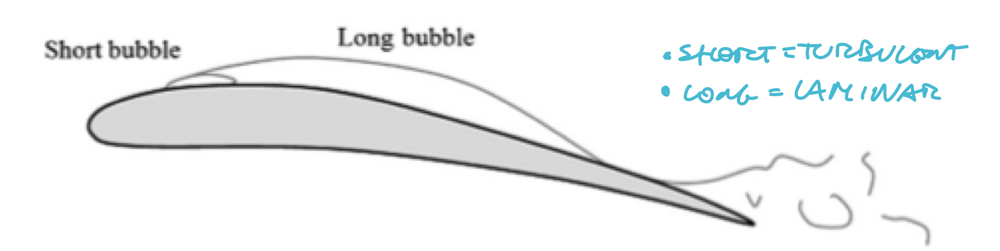
        
    4. Heat transfer turbina HP — vane LS89 (Cação Ferreira et al.)
        
        <aside>
        💡
        
        Sulle pale di alta pressione, la stima del flusso termico (Nusselt) è critica. Le RANS falliscono spesso vicino al punto di ristagno (anomalia della produzione di energia cinetica turbolenta) e sul lato in aspirazione (suction side) dove avviene la transizione, sovrastimando lo scambio termico.
        
        </aside>
        
        
        
        > Sovrastimare lo scambio termico non è detto sia conservativo: se è il flusso caldo che va dissipato e lo sovrastimo nel peggiore dei casi ho sovradimensionato la struttura ma se sovrastimo le capacità di un flusso refrigerante va a finire che mi si squaglia il componente
        > 
    5. Turbina LP T106C: transizione separation-induced, LES/DNS
        
        <aside>
        💡
        
        Nelle turbine di bassa pressione, i gradienti di pressione avversi causano separazione che induce la transizione. Le RANS non catturano lo shedding instazionario e il breakdown dei vortici in turbolenza. Solo la risoluzione delle scale (LES o DNS) permette di catturare l'effettiva dinamica della scia e le perdite di profilo.
        
        </aside>
        
        
        
- Fondamenti della LES
    1. **Idea di base**
        
        <aside>
        💡
        
        La turbolenza è composta da vortici di diverse dimensioni. I grandi vortici (large eddies) contengono la maggior parte dell'energia e dipendono fortemente dalla geometria del problema; i piccoli vortici tendono ad essere isotropi e universali. La LES risolve direttamente i grandi e modella solo i piccoli.
        
        </aside>
        
        > Parlare di piccolo e grande è una descrizione qualitativa, con le definizioni successive introdurremo la parte quantitativa
        > 
    2. **Filtraggio spaziale vs. media temporale (RANS)**
        
        **RANS:** Applica un operatore di media temporale (o di ensemble), eliminando tutte le fluttuazioni transitorie.
        
        **LES:** Applica un filtro spaziale (passa-basso). Le scale più grandi della dimensione del filtro vengono risolte nello spazio e nel tempo, mentre quelle inferiori (sottogriglia) vengono modellate.
        
    3. **Operatore filtro G(x, r, Δ) — ampiezza e forma**
        
        Una variabile filtrata $\bar{f}(x)$ è ottenuta per convoluzione con la funzione filtro G.
        
        $$
        \bar u (x,t) = \int _{\Omega} u (x,t) \ G(x,r,\Delta)dr
        $$
        
        > x è il punto dove si vuole la soluzione filtrata — è la variabile di output, il punto del dominio dove stai calcolando . r è la variabile di integrazione — scorre su tutto il dominio e raccoglie il contributo di tutti i punti vicini. \delta è l’ampiezza del filtro — determina quanto grande è il “vicinato” che influenza .
        In pratica: il filtro dice “la velocità filtrata nel punto è una media pesata dei valori di in un intorno di di raggio ”. non è un parametro del filtro, è semplicemente la coordinata spaziale della variabile filtrata. Nelle simulazioni reali spesso coincide con la dimensione della cella della mesh: $\Delta = (\Delta x \Delta y \Delta z)^{1/3}.$
        > 
        
        <aside>
        💡
        
        Se il filtro G è un Box Filter (una finestra quadrata di altezza 1/\Delta e larghezza \Delta), la convoluzione non fa altro che calcolare la media aritmetica dei valori di \phi all'interno di quella finestra. 
        
        L'effetto finale della convoluzione è quello di un **filtro passa-basso**: elimina (smussa) le variazioni repentine e le fluttuazioni ad alta frequenza spaziale (i piccoli vortici), lasciando intatta solo la macro-struttura del segnale (i grandi vortici risolti).
        
        </aside>
        
    4. **Forme tipiche:** 
        
        <aside>
        💡
        
        Box filter (Top-hat, volume finito), Gaussian, Sharp spectral cut-off.
        
        </aside>
        
        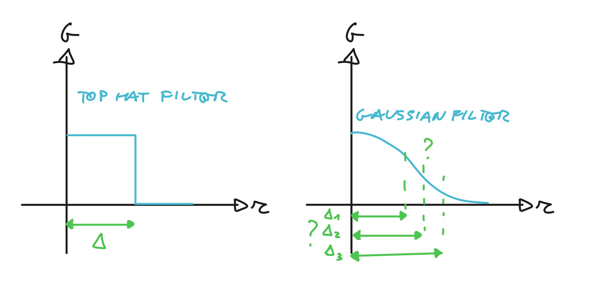
        
        > Nel caso di filtri non sharp (tipo quello Gaussiano) apparentemente non è chiaro come scegliere l’ampiezza $\Delta$ .
        > 
    5. **Richiami sulla convoluzione**
        
        <aside>
        💡
        
        La **convoluzione** è un'operazione matematica tra due funzioni, f e g, che genera una terza funzione. Questa terza funzione descrive come la forma di una viene modificata (o "sfocata") dall'altra. In termini pratici, può essere vista come una **media mobile pesata continuamente**.
        
        </aside>
        
        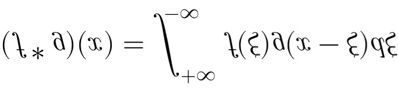
        
    6. **Equazioni NS filtrate e tensore sottogriglIa** $τ_{ij}^s$
        
        Filtrando le equazioni di Navier-Stokes emerge un termine non chiuso derivante dal termine convettivo non lineare: il **tensore degli sforzi di sottogriglia** (SGS stress tensor).
        
        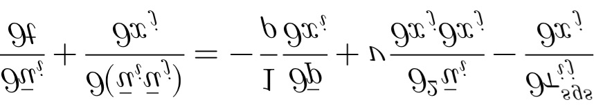
        
        > L’equazione LES è formalmente identica alle RANS solo che cambia il significato del termine aggiuntivo
        > 
        
        $$
        \tau_{ij}^{sgs} = \rho(\overline{u_i u_j} - \bar{u}_i \bar{u}_j)= \underbrace{\frac{1}{3} \delta_{ij} \tau_{kk}^s}_{\text{Parte Isotropa}} + \underbrace{\left( \tau_{ij}^s - \frac{1}{3} \delta_{ij} \tau_{kk}^s \right)}_{\text{Parte Anisotropa}}
        $$
        
        > Questo termine rappresenta l'effetto delle scale non risolte su quelle risolte e deve essere modellato. Viene definito tensore di sotto griglia ma di fatto è un tensore degli sforzi che dipende dalla scelta della griglia
        > 
    - **Modello eddy viscosity**
        
        Sfrutta l'ipotesi di Boussinesq: l'effetto dei piccoli vortici è puramente dissipativo.
        
        Il tensore SGS viene modellato usando una viscosità turbolenta di sottogriglia $\nu_{sgs}$. La parte isotropa viene solitamente inglobata nella pressione filtrata modificata, mentre la parte anisotropa è proporzionale al tensore degli sforzi risolto $\bar{S}_{ij}$.
        
        L'ipotesi di Boussinesq modella il tensore di sottogriglia assumendo che si comporti esattamente come gli sforzi viscosi molecolari: si allinea ai gradienti di velocità e ha l'unico scopo di "succhiare" energia cinetica dalle scale grandi (risolte) e dissiparla verso le scale piccole (non risolte). Questo processo si chiama **forward scatter** (cascata di energia in avanti).
        
        **L'alternativa (la realtà fisica):**
        
        Nella turbolenza reale, specialmente vicino ai muri o in flussi molto complessi, il processo non è a senso unico. Esiste il fenomeno del **Backscatter** (ritorno di energia): piccoli vortici possono unirsi o cedere energia per alimentare vortici più grandi. L'ipotesi di Boussinesq, basandosi su una "viscosità" (\nu_{sgs}) che per definizione è sempre positiva, non può matematicamente restituire energia (non può avere dissipazione negativa).
        
        **Quali sono i modelli alternativi a Boussinesq in ambito LES?**
        
        Se si vuole abbandonare l'ipotesi di Boussinesq, si usano:
        
        1 **Modelli di Similitudine di Scala (es. Modello di Bardina):** Non calcolano una viscosità turbolenta (\nu_{sgs}). Invece, applicano un secondo filtro ai campi risolti per estrapolare direttamente l'intero tensore degli sforzi di sottogriglia \tau_{ij}^{sgs}. Questo permette al tensore di non essere allineato con la deformazione e autorizza esplicitamente il backscatter.
        
        2 **Modelli Ibridi/Misti:** Sommano una parte dissipativa di Smagorinsky (per garantire stabilità numerica) a una parte di Similitudine di Scala (per catturare l'anisotropia e il backscatter).
        
    - **Modello di Smagorinsky statico**
        
        È il modello base (uno dei più semplici e anche dei più usati). Calcola la viscosità di sottogriglia come
        
        $$
         \nu_{sgs} = (C_s \Delta)^2 |\bar{S}|.
        $$
        
        > $\Delta$ è l’ampiezza del filtro che dipende dalla mesh scelta, $|\bar S |$ è il modulo d3l tensore delle velocità di deformazione e $C_s$ è la costante di smagorinski
        > 
        
        Il coefficiente $C_s$ è **costante**. Questo non permette di tenere in considerazione il fatto che la turbolenza vari nello spazio (non è detto ad esempio che tutto lo strato limite sia turbolento ma magari c’è un regione laminare che poi transisce al turbolento) e nel tempo (se il flusso è in stazionario la velocità varia e quindi il Reynolds è quindi lo stato di turbolenza)
        
        È **troppo dissipativo vicino ai muri**, vicino a una parete solida, a causa della condizione di aderenza (no-slip condition), il gradiente della velocità media lungo la normale $(\partial \bar{u} / \partial y)$ è elevatissimo. Poiché il termine $|\bar{S}|$ è calcolato a partire dai gradienti di velocità, vicino al muro il suo valore "esplode", assumendo numeri enormi. Di conseguenza, la formula di Smagorinsky restituisce un valore di $\nu_{sgs}$ molto alto.Tuttavia la realtà fisica è ben diversa poiché a parete, le fluttuazioni turbolente (u', v', w') sono schiacciate e smorzate dalla viscosità cinematica molecolare \nu, quindi la turbolenza di sottogriglia dovrebbe tendere a zero (\nu_{sgs} \rightarrow 0). Il modello immette una viscosità artificiale enorme dove invece non dovrebbe esserci. Questo "soffoca" le reali strutture vorticose vicine alla parete (come gli streaks), portando a stime errate dell'attrito (skin friction).  Per correggere questo difetto nel modello statico, si usano funzioni di smorzamento empiriche, come la funzione di Van Driest, che forzano \nu_{sgs} a zero man mano che ci si avvicina al muro).
        
        In un flusso **puramente laminare** all'interno di uno strato limite, non c'è turbolenza, ma c'è comunque un **profilo di velocità** (l'aria è ferma al muro e accelera salendo). Se c'è un profilo di velocità, c'è un gradiente $(\partial \bar{u} / \partial y \neq 0)$. Se c'è un gradiente, $|\bar{S}|$  è maggiore di zero. Se $|\bar{S}| > 0$, il modello di Smagorinsky statico calcola immediatamente una viscosità turbolenta $\nu_{sgs} > 0$. Quindi il modello introduce una viscosità turbolenta in un flusso che nella realtà non è ancora turbolento. Questa viscosità extra "gela" il flusso, smorzando e uccidendo sul nascere quelle piccole instabilità naturali necessarie per far avvenire la transizione. Il flusso o rimane laminare per sempre in modo artificiale, o viene forzato ad essere "turbolento" fin dall'inizio, bypassando la transizione reale.
        
        **Non permette** il **backscatter** (flusso di energia dalle scale piccole alle grandi) che richiederebbe un valore di eddy viscosity negativa che tuttavia è impossibile essendo tutti i termini positivi (uno è il quadrato di un numero reale e l’altro è un modulo).
        
    - **Modello dinamico (identità di Germano, doppio filtraggio)**
        1. Procedura
            
            Risolve i problemi di Smagorinsky calcolando C_s dinamicamente nello spazio e nel tempo.
            
            Si applica un **test filter** (di dimensione tipicamente \widehat{\Delta} = 2\Delta). Utilizzando l'Identità di Germano, si sfrutta la banda di turbolenza risolta compresa tra i due filtri per calcolare il coefficiente corretto locale. Consente a C_s di azzerarsi vicino ai muri e nei flussi laminari, permettendo anche il backscatter (se il modello non è limitato artificialmente).
            
        2. L'Identità di Germano
            
            L'identità di Germano è la base del modello dinamico e mette in relazione gli sforzi di sottogriglia a due diversi livelli di filtraggio spaziale: il filtro della griglia ($\Delta$, indicato con la barra orizzontale $\bar{\cdot}$) e il filtro di test ($\widehat{\Delta}$, indicato con il cappelletto $\widehat{\cdot}$).
            
            L'identità principale si esprime come:
            
            $$
            L_{ij} = T_{ij} - \widehat{\tau}_{ij}
            $$
            
            Se espandiamo i singoli termini per vedere come sono definiti matematicamente:
            
        3. **Tensore di Leonard ($L_{ij}$):**
        Rappresenta la turbolenza contenuta nella banda compresa tra i due filtri. Può essere calcolato esplicitamente perché dipende solo dalle grandezze già risolte dalla griglia:
            
            $$
            
            L_{ij} = \widehat{\bar{u}_i \bar{u}_j} - \widehat{\bar{u}}_i \widehat{\bar{u}}_j
            $$
            
        4. **Tensore degli sforzi di sottogriglia al livello della mesh ($\tau_{ij}$ filtrato):**
        Questo è il tensore originale (modellato) che viene filtrato al livello del test filter:
            
            $$
            
            \tau_{ij} = \overline{u_i u_j} - \bar{u}_i \bar{u}j \implies \widehat{\tau}{ij} = \widehat{\overline{u_i u_j}} - \widehat{\bar{u}_i \bar{u}_j}
            $$
            
        5. **Tensore degli sforzi di sottogriglia al livello del filtro di test ($T_{ij}$):**
        Rappresenta lo stress di sottogriglia modellato direttamente alla scala più grande 
            
            $$
            \widehat{\Delta}:
            T_{ij} = \widehat{\overline{u_i u_j}} - \widehat{\bar{u}}_i \widehat{\bar{u}}_j
            $$
            
        6. Perché due filtri e non uno solo?
            
            Nel modello di Smagorinsky statico, la costante C_s è fissa per tutto il dominio. Ma la fisica della turbolenza cambia: vicino a una parete o in un flusso laminare, la turbolenza scompare e C_s dovrebbe idealmente annullarsi.
            
            Non potendo calcolare cosa succede sotto la griglia (perché non abbiamo informazioni fisiche sotto la dimensione \Delta), l'unica soluzione è **guardare cosa succede subito sopra la griglia**.
            
            Introducendo un secondo filtro più grande, chiamato **Test Filter** (\widehat{\Delta}), isoliamo una "banda" di vortici che sono **sia risolti dalla griglia, sia più piccoli del test filter**. Analizzando come l'energia fluisce in questa banda nota, possiamo estrapolare matematicamente il comportamento di C_s.
            
        7. Il problema della griglia diversa: a cosa serve e come ci ricolleghiamo?
            
            Hai ragione: l'identità di Germano calcola un tensore (chiamato Tensore di Leonard, L_{ij}) che rappresenta lo stress turbolento dovuto esclusivamente ai vortici compresi tra la griglia \Delta e il test filter \widehat{\Delta}.
            
            
            
            Qui entra in gioco l'**ipotesi di similitudine di scala (scale-similarity)** di Germano: si assume che i vortici appena sopra la griglia (tra \Delta e \widehat{\Delta}) si comportino esattamente come i vortici appena sotto la griglia (più piccoli di \Delta).
            
            Pertanto, assumiamo che la costante C_s sia **la stessa** per entrambi i livelli di filtraggio.
            
            Attraverso un approccio matematico (di solito l'approssimazione dei minimi quadrati di Lilly), usiamo l'informazione estratta dalla dimensione \widehat{\Delta} per ricavare la C_s da applicare alla nostra griglia reale \Delta.
            
        8. Come ci si ricollega alla Eddy Viscosity (\nu_{sgs})?
            
            Una volta che l'identità di Germano ha sputato fuori il valore locale di C_s^2, questo viene preso e inserito direttamente nella formula classica di Smagorinsky per la viscosità di sottogriglia della griglia di calcolo:
            
            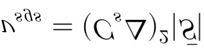
            
            L'obiettivo finale è chiuso: abbiamo trovato una \nu_{sgs} che ora dipende da un coefficiente non più fisso, ma calcolato punto per punto.
            
        9. Perché si dice che C_s è variabile nello spazio e nel tempo?
            
            Perché il flusso turbolento è intrinsecamente instazionario e disomogeneo. Poiché i tensori usati per calcolare C_s si basano sulle velocità risolte istantanee del fluido (\bar{u}_i), se in un determinato punto del dominio e in un determinato millisecondo il flusso si stabilizza (diventa laminare) o incontra una parete, le fluttuazioni si azzerano. Di conseguenza, la matematica del modello dinamico impone automaticamente C_s \rightarrow 0 in quel punto e in quell'istante.
            
        10. Come si legano i due filtri? Perché il secondo è doppio (2\Delta) e non più piccolo?
            
            1 Perché non più piccolo? Il secondo filtro non può essere più piccolo di \Delta. La griglia \Delta rappresenta il limite fisico del nostro potere risolutivo. Sotto \Delta non abbiamo dati numerici. Il test filter deve operare su frequenze che la mesh è in grado di descrivere, quindi deve essere per forza più grande (\widehat{\Delta} > \Delta).
            
            2 **Perché proprio il doppio (**2\Delta**)?** È una scelta convenzionale ma ottimale. Se fosse troppo vicino a \Delta (es. 1.1\Delta), la banda di energia intercettata sarebbe troppo stretta e i calcoli numerici sarebbero dominati dall'errore di troncamento della mesh. Se fosse troppo grande (es. 5\Delta), perderemmo l'ipotesi di similitudine: i vortici a scala 5\Delta seguono una fisica macroscopica troppo diversa da quelli a scala sottogriglia. Il valore \widehat{\Delta}/\Delta = 2 è il perfetto compromesso.
            
        11. Cosa è $|\bar S|$
            
            Prima di tutto si definisce il **Tensore della velocità di deformazione risolto** $(\bar{S}_{ij})$, che misura come la velocità del fluido varia nello spazio (gradienti):
            
            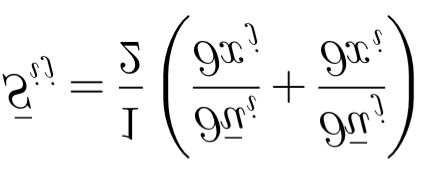
            
            Il termine |\bar{S}| (notazione contratta) rappresenta la **norma (o modulo)** di questo tensore, definita come:
            
            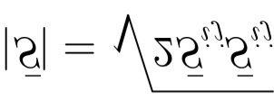
            
    - **Raffinamento mesh: RANS, LES → DNS**
        
        La differenza fondamentale tra RANS e LES sta nel fatto che **nella RANS la griglia è solo uno strumento numerico, mentre nella LES la griglia fa parte della fisica del modello**.
        
        Nei modelli RANS:
        
        Indipendenza dalla griglia (Grid Independence): Nelle RANS, il modello di turbolenza (es. k-\omega o k-\epsilon) decide a priori come modellare tutta la turbolenza, indipendentemente dalla mesh.
        
        **Ruolo della mesh:** Infittire la griglia serve esclusivamente a **ridurre l'errore numerico di discretizzazione**. Una volta che la mesh è sufficientemente fine, i risultati smettono di cambiare (si raggiunge l'indipendenza dalla griglia). Raffinare ulteriormente non aggiunge nuova fisica, fa solo convergere la soluzione verso l'esatta soluzione matematica delle equazioni RANS.
        
        Eccezione a parete: L'unico caso in cui la griglia cambia il comportamento RANS è vicino al muro (valore di y^+): se la mesh è grossolana si usano le funzioni di parete (wall functions), se è finissima il modello risolve lo strato limite fino al sottostrato viscoso.
        
        **Nei modelli LES:**
        
        **La griglia è il filtro:** Nella LES standard (Implicit LES), la dimensione della cella \Delta è letteralmente la larghezza del filtro spaziale.
        
        **Più affini, più fisica risolvi:** Se infittisci la griglia, riduci \Delta. Questo significa che il "taglio" tra i vortici risolti e quelli modellati si sposta verso scale più piccole. Fisicamente, **stai dicendo al software di modellare meno turbolenza e calcolarne di più in modo diretto**.
        
        **Mancanza di una vera indipendenza dalla griglia:** A differenza delle RANS, se continui a raffinare la mesh in una LES, la soluzione continua a cambiare, perché stai aggiungendo sempre più dettagli fisici transitori. La "convergenza" nella LES si ha solo quando la griglia diventa così fine da eguagliare la scala di Kolmogorov (\eta); a quel punto la viscosità di sottogriglia si azzera (\nu_{sgs} \to 0) e la simulazione **diventa spontaneamente una DNS** (Direct Numerical Simulation).
        
        Se la tua griglia ha una dimensione \Delta > \eta, significa che ci sono ancora vortici reali (più piccoli della cella ma più grandi di \eta) che trasportano e dissipano energia, e che la mesh non può vedere. Di conseguenza, hai bisogno di un modello matematico artificiale (\nu_{sgs}) per simulare quella dissipazione mancante.
        
        Se invece raffini la mesh fino a quando \Delta \approx \eta, stai risolvendo numericamente la cella alla stessa dimensione in cui interviene la fisica molecolare a dissipare il flusso. Non esiste più alcuna "turbolenza nascosta" sotto la griglia. La viscosità molecolare reale del fluido \nu è ora perfettamente in grado di dissipare l'energia in modo autonomo. Di conseguenza, il modello di sottogriglia si spegne (\nu_{sgs} \to 0) e la simulazione diventa intrinsecamente una DNS.
        
- Classificazione modelli ibridi RANS-LES
    1. **Modelli zonali e bridging** 
        
        I modelli ibridi nascono per superare il costo computazionale proibitivo della LES a parete ad alti numeri di Reynolds (dove i vortici sono piccolissimi e richiedono celle minuscole).
        
        **Bridging (Seamless):** La transizione tra RANS (usata a parete) e LES (usata lontano dalla parete o nelle zone di scia) avviene in modo continuo all'interno delle stesse equazioni, comandata da una scala di lunghezza che dipende dalla mesh e dalla distanza dalla parete. Esempio: DES (Detached Eddy Simulation).
        
        **Zonali:** Il dominio è diviso esplicitamente a priori in zone governate dalle equazioni RANS e zone governate dalla LES. Richiede un'interfaccia ben definita. Passando da RANS a LES bisogna fornire condizioni al contorno instazionarie (spesso tramite Synthetic Turbulence Generators) per convertire il campo medio della RANS in un campo fluttuante risolto necessario alla LES (es. Embedded LES).
        
    2. **Overview modelli**
        
        
        | Categoria | Approccio | Logica di Funzionamento | Vantaggi | Svantaggi / Sfide | Esempi Tipici |
        | --- | --- | --- | --- | --- | --- |
        | **Seamless (Non-Zonali)** | **DES** *(Detached Eddy Simulation)* | Usa RANS vicino a parete e commuta in LES nelle zone di distacco della scia basandosi sulla cella massima della mesh. | Semplice da implementare; non richiede interfacce geometriche rigide definite dall'utente. | Soffre di *Grid-Induced Separation* (GIS): se la mesh è densa vicino al muro, passa a LES troppo presto senza avere la risoluzione adatta. | DES classica (Spalart-Allmaras) |
        | **Seamless (Non-Zonali)** | **DDES / IDDES** *(Delayed / Improved DES)* | Evoluzione della DES. Introduce funzioni di shielding che forzano la RANS dentro tutto lo strato limite, a prescindere dalla mesh. | Risolve il problema del GIS; l'IDDES permette anche il wall-modeled LES (WMLES) se la mesh è finissima. | Taratura empirica delle funzioni di shielding complessa. | DDES, IDDES |
        | **Zonali** | **Embedded LES (ELES)** | Il dominio è diviso geometricamente a priori dall'utente in zone puramente RANS e zone puramente LES. | Massimo controllo fisico; si spende computazionalmente solo dove serve davvero. | Richiede la generazione di turbolenza sintetica fluttuante all'interfaccia RANS $\rightarrow$ LES. | ELES (in Fluent), HTLES |
    3. Modelli zonali
    4.1 DES (Spalart 1997): criterio di switching su lunghezza scala
    4.2 Problema MSD (Modelled Stress Depletion) in BL spessi
    4.3 DDES: shielding function
    4.4 IDDES: mismatch log-layer interno/esterno
    4. Modelli non-zonali
    5.1 VLES: funzione F_R e rapporto Δ/η_K
    5.2 PANS: parametri f_k, f_ε
    5.3 PITM: parametro η_c

- Domande
    - Universalità delle piccole scale di turbolenza
        
        Le piccole scale dipendono *solo* da \(\nu\) (viscosità cinematica) e \(\varepsilon\) (dissipazione). La geometria e le condizioni al contorno influenzano solo le grandi scale (scala integrale). Attraverso la cascata energetica, le grandi scale impongono il valore di \(\varepsilon\) alle piccole scale, le quali si "auto-organizzano" in modo universale. Le scale di Kolmogorov \(\eta = (\nu^3/\varepsilon)^{1/4}\) dipendono quindi solo da proprietà fluide e dalla potenza dissipata — non dalla forma del corpo.
        
    - Costo computazionale DNS ∝ Re³
        
        Il rapporto tra scala integrale e scala di Kolmogorov è \(L/\eta \propto Re^{3/4}\). In 3D, il numero di celle scala come \(Re^{9/4}\) e il numero di passi temporali come \(Re^{3/4}\). Il costo totale è quindi \(\propto Re^3\).
        
    - Media delle fluttuazioni: vale solo per flussi stazionari?
        
        No. \(\overline{u'} = 0\) vale per *costruzione* della decomposizione. La stazionarietà statistica garantisce che la media temporale sia ben definita e coincida con la media d'insieme (ergodicità), ma la proprietà \(\overline{u'} = 0\) è intrinseca alla definizione di fluttuazione rispetto alla propria media.
        
    - RANS vs URANS — le due definizioni
        
        **RANS:** media temporale con \(T\to\infty\); tutta l'informazione temporale è persa; adatta a flussi stazionari in media.
        
        **URANS:** media su un intervallo \(T_{avg}\) tale che \(\tau_{turb} \ll T_{avg} \ll \tau_{slow}\). Si filtrano le fluttuazioni turbolente rapide ma si mantiene l'evoluzione temporale lenta (es. vortex shedding, cicli di separazione/riattacco). È un ottimo compromesso.
        
    - Commutazione media–derivate: quando è valida?
        
        La commutazione \(\overline{\partial u/\partial x_i} = \partial\bar{u}/\partial x_i\) è valida quando i limiti dell'integrale di media non dipendono dalla variabile di derivazione. Per la media temporale commuta con le derivate spaziali (limiti di integrazione \([t,t+T]\) non dipendono da \(\mathbf{x}\)). Per la media spaziale su dominio fisso commuta con \(\partial/\partial t\). Fisicamente: è valida quando c'è una netta separazione di scale e la media "non vede" le variazioni nella direzione di derivazione.
        
    - Perché la pressione non è mediata con Favre?
        
        La media di Favre \(\tilde{q} = \overline{\rho q}/\bar{\rho}\) viene applicata alle variabili cinematiche (\(u_i, h, T\)) per eliminare le correlazioni \(\overline{\rho u_i'}\) dall'equazione di continuità compressibile. La pressione appare linearmente nelle equazioni di moto e il suo trattamento con Favre non semplifica le equazioni — al contrario, introdurrebbe correlazioni aggiuntive \(\overline{\rho' p'}\) difficili da modellare. Si usa quindi la media di Reynolds ordinaria per \(p\).
        
    - La long bubble è per flusso laminare o turbolento?
        
        Hai ragione: la long bubble è laminare. Nelle slide e nei tuoi appunti è scritto esplicitamente — short bubble (turbolento), long bubble (laminare). La distinzione fisica è questa: il flusso laminar separa sulla superficie del profilo; se riesce a riattaccarsi rapidamente dopo la transizione il bubble rimane corto (turbolento post-riattacco); se la transizione avviene lontana o non avviene affatto il bubble si allunga e rimane in regime prevalentemente laminare. È il caso rilevante per droni e turbine LP con .
        
    - Come distinguo le parti isotrope e anisotrope del tensore di griglia
        
        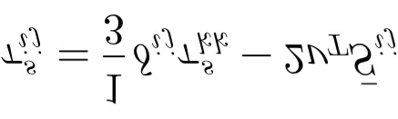
        
        Parte isotropa:  — è proporzionale al delta di Kronecker, agisce ugualmente in tutte le direzioni. Viene assorbita nel termine di pressione modificata e quindi non compare esplicitamente nelle equazioni del momento.
        Parte anisotropa (deviatorica):  — dipende dal tensore del tasso di deformazione filtrato , che non è isotropo perché dipende dal flusso locale. È questa la parte che devi modellare.
        Regola pratica: se un tensore ha la forma  è isotropo; tutto il resto è anisotropo.
        
    - La versione dinamica dell’eddy viscosity si può fare per ogni metodo LES?
        
        
        In linea di principio sì: l’identità di Germano è un meccanismo generale. Si applica a qualsiasi modello di eddy viscosity della forma . Si eseguono due filtrature — con  (griglia) e con  (test) — e si ricava  variabile nello spazio e nel tempo invece di usare una costante globale.
        In pratica la procedura dinamica è usata principalmente con Smagorinsky, ma esiste anche per il modello WALE, il modello  e altri. Il vantaggio è che  automaticamente in regioni laminari e vicino alla parete, cosa che il Smagorinsky statico non fa.
        
    - Perché abbiamo considerato le turbine di bassa pressione?
        
        
        Le turbine LP operano a Reynolds più bassi (–) rispetto alle HP. A questi regimi il numero di Reynolds è abbastanza basso da rendere lo strato limite laminare per gran parte della pala — il flusso esterno è turbolento ma non abbastanza da forzare subito la transizione (come evidenziato nelle slide sulla turbina LS89: “uno strato limite può essere laminare anche se il flusso esterno è turbolento”).
        Le conseguenze pratiche sono:
        •	la separation-induced transition (bolla di separazione laminare) governa le perdite
        •	i modelli RANS a turbolenza piena sbagliano di molto, perché assumono lo strato limite già turbolento
        •	i modelli di transizione (-, --) migliorano, ma faticano nella predizione della posizione di riattacco e nelle perdite post-bolla
        Le turbine LP sono quindi un banco di prova critico per capire quando RANS non basta e LES/DNS è necessario.
        
    - Come si definisce se il filtro non è on-off?
        
        
        Il filtro LES in spazio fisico non è mai veramente sharp — anche il filtro “a gradino” (top-hat) ha un’ampiezza finita. La convenzione standard è di legare alla dimensione della cella della mesh:
        
        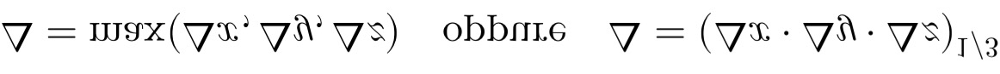
        
        Il significato fisico è: tutto ciò che ha scale spaziali  non è risolto dalla mesh e viene modellato. Non c’è una soglia di intensità convenzionale come per i filtri elettronici — la mesh stessa è il filtro. In spettrale,  corrisponde a un numero d’onda di cutoff : le scale con  vengono modellate.
        
    - Altri modelli di eddy viscosity per LES — differenze con RANS
        
        
        Modelli alternativi a Smagorinsky:
        •	WALE (Wall-Adapting Local Eddy-viscosity) — , si annulla naturalmente in regioni di puro taglio e a parete
        •	Modello — basato sui valori singolari del gradiente di velocità filtrato, proprietà di annullamento migliori
        •	Modello dinamico di Germano — applicabile a qualsiasi base
        •	Vreman — efficiente computazionalmente, buone proprietà a parete
        Perché non usare direttamente i modelli RANS?
        La differenza non è solo formale ma concettuale:
        
        Ecco la tabella unica in formato Markdown che unisce i contenuti e le intestazioni delle immagini 2 e 3:
        
        | Aspetto | RANS | LES SGS |
        | --- | --- | --- |
        | **Cosa modella** | **Tutto** lo stress di Reynolds | Solo le scale **sotto** |
        | **Dipendenza da** | Nessuna | Esplicita — |
        | **Comportamento al raffinamento** | \rightarrow costante finita | , LES \rightarrow DNS |
        | **Backscatter** | Non previsto | Possibile (con modelli dinamici) |
        
        Anche usando un’espressione identica (es. Smagorinsky  mixing length), il significato è diverso: in RANS modella tutto il trasporto turbolento; in LES modella solo l’effetto delle scale non risolte. Concettualmente le due famiglie rimangono distinte anche a parità di forma matematica.
        
    - Cos’è la shielding function?
        
        
        La shielding function è introdotta nel DDES per proteggere il boundary layer dall’essere erroneamente trattato in modalità LES.
        Nel DES originale la lunghezza di scala modificata è:
        
        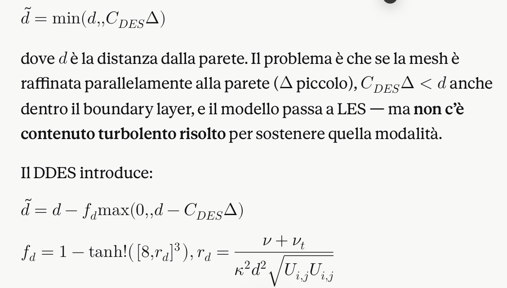
        
        Come funziona:
        •	Dentro il BL,  o : , quindi  → rimane in RANS
        •	Nella regione separata lontana dalla parete, :  →  ridotto → si attiva LES
        La shielding function è quindi un sensore di boundary layer: riconosce automaticamente se ci si trova dentro il BL (alto , flusso fortemente shear-driven) e blocca l’attivazione prematura del ramo LES.
        
    - Perché il DES originale ha problemi nei BL spessi — collegamento con DDES
        
        
        Il problema: nel DES originale lo switch RANS→LES avviene quando . Se raffini la mesh parallelamente alla parete (riduci  mantenendo  piccolo),  si riduce e il criterio si attiva dentro il boundary layer, dove però non esiste contenuto turbolento risolto.
        Il risultato è il Modelled Stress Depletion (MSD):
        1.	Il modello passa a LES →  cala bruscamente
        2.	Gli sforzi di Reynolds modellati calano
        3.	Ma le strutture turbolente risolte non si sono ancora sviluppate (il campo iniziale era RANS, liscio)
        4.	Il momentum nel BL non è sostenuto → separazione artificiale e precoce
        Nelle slide si vede chiaramente: con mesh più fini (33k, 45k, 56k celle) il vortice intrappolato cambia topologia — non è convergenza fisica, è MSD.
        Come lo risolve il DDES: la shielding function , basata su  (che è alto dentro il BL per via di  elevato), forza  in tutto il BL indipendentemente dalla finezza della mesh parallela. Solo nella regione separata, dove  è basso e il flusso è governato da strutture coerenti,  e si attiva correttamente la modalità LES.
        
    - L’ampiezza del filtro (\Delta) è scelta dall'ingegnere? E in base a cosa?
        
        Sì e no, dipende dall'approccio, ma **nella quasi totalità delle applicazioni ingegneristiche (es. su software commerciali come Ansys Fluent) la scelta è implicita e dettata dalla mesh**.
        
        **Approccio Esplicito (Raro nell'industria):** L'ingegnere applica matematicamente un filtro alle equazioni di ampiezza \Delta definita a priori, indipendente dalla griglia, a patto che \Delta > \Delta x_{mesh}.
        
        **Approccio Implicito (Implicit LES / ILES - Lo standard):** Il filtro spaziale non è un'equazione separata, ma è **la dimensione della cella della mesh stessa** a fungere da filtro passa-basso. La formula standard è \Delta = (\Delta x \Delta y \Delta z)^{1/3} (il volume della cella).
        
        **In base a cosa la sceglie l'ingegnere?**
        
        L'ingegnere sceglie \Delta costruendo la mesh. Per essere una "vera" LES, la mesh (e quindi \Delta) deve essere sufficientemente fine da catturare almeno l'**80% dell'energia cinetica turbolenta** (criterio di Pope). Se la cella è troppo grande, la maggior parte dell'energia cade nella zona di sottogriglia, il modello SGS fa tutto il lavoro e la simulazione degrada a una pessima RANS.
        
    - Parte isotropa e anisotropa del tensore di griglia
        
        **Parte Isotropa:** \delta_{ij} è la delta di Kronecker (vale 1 se i=j, vale 0 se i \neq j). Il termine \tau_{kk}^s è la **traccia** del tensore (la somma dei tre elementi sulla diagonale principale: \tau_{11}^s + \tau_{22}^s + \tau_{33}^s). Moltiplicare la traccia media per \delta_{ij} significa creare un tensore che ha valori identici sulla diagonale e zero ovunque sballi.
        
        **Parte Anisotropa:** Se prendi il tensore di partenza e gli sottrai questa parte isotropa, ottieni un nuovo tensore (il deviatorico, che nel modello equivale a - 2 \nu_T \bar{S}_{ij}) la cui traccia è rigorosamente **nulla** (assumendo fluido incomprimibile, dove \bar{S}_{ii} = 0). Contiene solo gli sforzi di taglio tangenziali e gli squilibri netti di quelli normali.
        
        A livello concettuale
        
        **Isotropo** significa "uguale in tutte le direzioni". Questa componente rappresenta una pressione uniforme esercitata dai piccoli vortici non risolti. Comprime o dilata il cubetto di fluido nello stesso modo lungo x, y e z.
        
        **Anisotropo** significa "che cambia a seconda della direzione". Questa componente descrive la vera natura distorsiva della turbolenza. Rappresenta come i piccoli vortici stirano, strappano e creano scorrimento asimmetrico tra i filetti fluidi.
        
        A livello intuitivo (Perché lo facciamo nel CFD?)
        
        Immagina un cubetto di fluido immerso nella turbolenza di sottogriglia.
        
        I piccoli vortici generano due tipi di azioni su di esso:
        
        1 Lo schiacciano da tutti i lati con la stessa intensità (effetto analogo alla pressione idrostatica). Questa è la **parte isotropa**. Poiché agisce esattamente come una pressione, dal punto di vista del moto non genera deformazioni angolari o scorrimenti. Nei codici CFD non si perde tempo a modellarla con la viscosità; semplicemente la si "prende" e la si scarica all'interno del termine di pressione delle equazioni di Navier-Stokes, definendo una pressione modificata \bar{p}_{mod} = \bar{p} + \frac{1}{3}\rho\tau_{kk}^s.
        
        2 Lo distorcono, facendolo scivolare e rompendone la simmetria. Questa è la **parte anisotropa**. Questa componente è l'unica responsabile del trasporto netto di quantità di moto e della dissipazione della turbolenza. È questa la componente "cattiva" che l'ipotesi di Boussinesq deve modellare forzatamente, legandola ai gradienti di deformazione macroscopici \bar{S}_{ij} attraverso la viscosità turbolenta \nu_T.
        
- Quiz
    
    ### — Vero / Falso
    
    V/F Le piccole scale di turbolenza dipendono dalla geometria del corpo attorno al quale scorre il fluido.
    
    Vero Falso ✓
    
    Le piccole scale di Kolmogorov dipendono solo da \(\nu\) e \(\varepsilon\) — sono universali indipendentemente dalla geometria.
    
    V/F Il costo computazionale della DNS scala come \(Re^2\).
    
    Vero Falso ✓
    
    Il costo scala come \(Re^3\): \(Re^{9/4}\) per le celle in 3D \(\times Re^{3/4}\) per i passi temporali.
    
    V/F Nella decomposizione di Reynolds si ha sempre \(\overline{u'} = 0\), anche per flussi non stazionari in media.
    
    Vero ✓ Falso
    
    \(\overline{u'} = 0\) è vero per costruzione: la fluttuazione è definita come la differenza tra il segnale e la sua media, quindi la media della fluttuazione è zero per definizione.
    
    V/F Il tensore di Reynolds ha 9 componenti indipendenti.
    
    Vero Falso ✓
    
    Il tensore di Reynolds è simmetrico (\(\overline{u_i'u_j'} = \overline{u_j'u_i'}\)), quindi ha solo 6 componenti indipendenti.
    
    V/F La LES risolve solo le scale piccole e modella le scale grandi.
    
    Vero Falso ✓
    
    È il contrario: la LES risolve *direttamente* le scale grandi (quelle sopra il filtro) e usa modelli SGS (Sub-Grid Scale) per le scale piccole.
    
    ### — Scelta Multipla
    
    MC In un flusso turbolento incompressibile, il termine aggiuntivo che compare nelle equazioni RANS rispetto alle NS ordinarie è:
    
    La viscosità dinamica aumentata
    
    Il divergente del tensore di Reynolds \(\partial_j(-\rho\overline{u_i'u_j'})\)
    
    Un termine sorgente proporzionale al gradiente di temperatura
    
    Il gradiente della pressione fluttuante \(\nabla p'\)
    
    Le RANS aggiungono il termine \(\partial/\partial x_j(-\rho\overline{u_i'u_j'})\) = divergente del tensore di Reynolds, che quantifica il trasporto di quantità di moto dovuto alle fluttuazioni turbolente.
    
    MC L'energia cinetica turbolenta \(k\) è legata al tensore di Reynolds come:
    
    \(k = \overline{u_1'u_2'}\)
    
    \(k = \tfrac{1}{2}\,\overline{u_i'u_i'}\) (metà traccia del tensore)
    
    \(k = \overline{u'^2}\) (solo componente assiale)
    
    \(k = \overline{p'u_i'}/\rho\)
    
    \(k = \tfrac{1}{2}(\overline{u'^2}+\overline{v'^2}+\overline{w'^2}) = \tfrac{1}{2}\overline{u_i'u_i'}\). È metà della traccia del tensore di Reynolds diviso \(\rho\).
    
    MC Il modello \(k\)-\(\omega\) SST (Menter) è particolarmente vantaggioso perché:
    
    Risolve tutte le scale di turbolenza senza modellazione
    
    Richiede una sola equazione di trasporto aggiuntiva
    
    Combina i vantaggi di \(k\)-\(\varepsilon\) (free-stream) e \(k\)-\(\omega\) (regione di parete)
    
    Non fa uso dell'ipotesi di Boussinesq
    
    SST usa una funzione di blending per passare dal \(k\)-\(\omega\) vicino a parete (dove è preciso) al \(k\)-\(\varepsilon\) nel free-stream (dove \(k\)-\(\omega\) è sensibile alle condizioni esterne).
    
    MC Nelle URANS, l'intervallo di media \(T_{avg}\) deve essere scelto tale che:
    
    \(T_{avg} \gg \tau_{slow}\)
    
    \(\tau_{turb} \ll T_{avg} \ll \tau_{slow}\)
    
    \(T_{avg} = \tau_{turb}\)
    
    \(T_{avg}\) deve essere uguale al periodo di vortex shedding
    
    L'intervallo \(T_{avg}\) deve essere abbastanza grande da mediare le fluttuazioni turbolente rapide ma abbastanza piccolo da non cancellare le variazioni lente del campo medio (es. oscillazioni coerenti).
    
    MC La media di Favre \(\tilde{u} = \overline{\rho u}/\bar{\rho}\) viene usata nei flussi compressibili principalmente per:
    
    Aumentare la precisione del calcolo di \(\bar{p}\)
    
    Eliminare le correlazioni densità-velocità dall'equazione di continuità mediata
    
    Ridurre il costo computazionale delle equazioni RANS
    
    Mediare anche la pressione in modo coerente
    
    La media di Favre elimina i termini \(\overline{\rho' u_i'}\) dall'equazione di continuità compressibile, semplificando notevolmente la forma delle equazioni RANS compressibili.
    
- Domande Aperte
    
    Aperta Spiega intuitivamente perché il prodotto \(\overline{u'v'}\) non è in generale nullo, anche se \(\overline{u'} = 0\) e \(\overline{v'} = 0\).
    
    Mostra risposta
    
    Le fluttuazioni \(u'\) e \(v'\) possono essere *correlate statisticamente*: i vortici turbolenti trasportano contemporaneamente fluido veloce (alto \(u'\)) verso zone a bassa velocità (alto \(v'\) verso il basso). Anche se ciascuna fluttuazione ha media nulla, la loro co-varianza \(\overline{u'v'}\) è non nulla e misura l'intensità del trasporto di quantità di moto turbolento. È come dire che due variabili casuali possono essere correlate pur avendo entrambe media zero.
    
    Aperta Descrivi la cascata energetica di Kolmogorov e spiega perché le scale inerziali mostrano una legge di potenza \(E(k) \propto k^{-5/3}\).
    
    Mostra risposta
    
    Energia viene iniettata alle grandi scale (produzione), trasferita attraverso la cascata inerziale verso scale sempre più piccole, e infine dissipata a scala di Kolmogorov. Nella regione inerziale (A) non c'è né produzione né dissipazione: l'energia transita a tasso costante \(\varepsilon\). Per argomenti dimensionali (Kolmogorov 1941): \(E(k) \propto \varepsilon^{2/3} k^{-5/3}\). La pendenza −5/3 in scala log-log è la firma universale della cascata inerziale.
    
    Aperta Qual è il problema di chiusura delle RANS e quali strategie esistono per risolverlo?
    
    Mostra risposta
    
    L'applicazione dell'operatore di media alle equazioni NS introduce il tensore di Reynolds \(\overline{u_i'u_j'}\): 6 nuove incognite per 3 equazioni di quantità di moto → sistema aperto (problema di chiusura). Le strategie sono: (1) modelli algebrici (mixing length, Baldwin-Lomax); (2) modelli a 1 equazione (trasporto di \(k\)); (3) modelli a 2 equazioni (\(k\)-\(\varepsilon\), \(k\)-\(\omega\), SST); (4) modelli alle tensioni di Reynolds (RSM, 7 equazioni). Tutti si basano su ipotesi aggiuntive per esprimere \(\overline{u_i'u_j'}\) in funzione delle variabili medie.