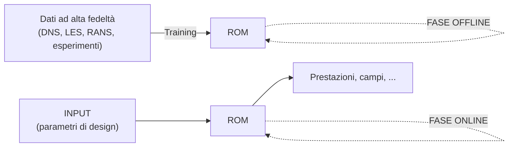

# Modelli di Ordine Ridotto (ROM) e POD

> Teoria + simulazione d'esame sul **macroargomento 2** della lezione 06-04: i **Reduced Order
> Models** e in particolare la **Proper Orthogonal Decomposition (POD)**. Formato toggle Notion;
> **parole chiave** in grassetto; formule LaTeX (`$...$`, `$$...$$`).
> Risponde alle domande **6–7** del file di dubbi e ai **chiarimenti aggiuntivi del 06-04**
> (punti 2–9: definizione di energia, modi calcolati vs imposti, vincolo di norma, spazio/parametri).

---

## Parte I — Teoria

### 1. Cos'è un ROM e a cosa serve

Un **Reduced Order Model** sostituisce un modello CFD ad alto costo (*full order model*) con un
**surrogato** molto più rapido, capace di **prevedere campi e prestazioni** al variare dei
**parametri di design** in tempi quasi istantanei. È lo strumento dell'**ottimizzazione**, dei
**digital twin** e dell'esplorazione rapida dello spazio di progetto.

Si lavora in **due fasi**:



- **Fase OFFLINE (costosa, una sola volta):** si raccolgono i **dati ad alta fedeltà** e si
  **addestra** il ROM. È costosa perché richiede molte simulazioni full-order o dati sperimentali.
- **Fase ONLINE (economica, ripetuta):** dato un nuovo set di **parametri**, il ROM restituisce
  **subito** la previsione.

Il **dato ad alta fedeltà** è un concetto **relativo alla fase di progettazione**: in **avanprogetto**
una **RANS** è già considerata affidabile (è "alta fedeltà" in quel contesto); in fasi successive (es.
progetto di dettaglio) la RANS **non basta** e serve una **LES** o una **DNS**. Molte aziende hanno
un'**eredità storica** di dati ad alta fedeltà che permette di **alleggerire la fase offline** (i dati
sono già disponibili).

---

### 2. La POD come motore del training

La **POD (Proper Orthogonal Decomposition)** è la tecnica più usata per costruire la **base** del ROM.
È l'analogo dei **modi propri di vibrazione** nelle strutture: si decompone la soluzione in **modi
spaziali elementari** ordinati per **contenuto energetico**.

**Esempio (quello usato a lezione): problema RANS stazionario.** Si sceglie lo stazionario perché è il
**caso più semplice** in cui ogni soluzione è **un solo campo** (un vettore), così la costruzione del
database e dei modi è immediata; nulla vieta di usare altri casi (instazionari → si campiona anche nel
tempo), ma complicherebbero l'esposizione.

**Passo 1 — Database di snapshot.** Si generano $N_s$ soluzioni full-order al variare di $n$ parametri
$\mu_i$ ($1\le i\le n$):
$$u_J(\bar{x}),\qquad 1\le J\le N_s \quad(\text{snapshot }J).$$

**Passo 2 — Ipotesi di decomposizione modale.** Si assume che la soluzione si scriva come
**combinazione lineare di $N$ modi** (con $N\le N_s$):
$$u(\bar{x},\bar{\mu}) = \sum_{i=1}^{N} \tilde{a}_i(\bar{\mu})\,\phi_i(\bar{x}).$$

- $\phi_i(\bar{x})$ → **modi** (dipendono **solo dallo spazio** $\bar x$): sono le **funzioni di
  forma**, l'analogo della base del **metodo agli elementi finiti**.
- $\tilde{a}_i(\bar{\mu})$ → **coefficienti modali** (dipendono **solo dai parametri** $\bar\mu$):
  pesano quanto ciascun modo contribuisce per un dato design.

La separazione **spazio (modi) × parametri (coefficienti)** è il cuore del metodo: i modi si calcolano
**una volta** (offline), i coefficienti si **interpolano** per ogni nuovo $\bar\mu$ (online).

**Passo 3 — I modi come combinazione lineare degli snapshot.** Si propone di costruire i modi come
combinazione lineare degli snapshot del database (metodo degli *snapshot* di Sirovich). Per definire
"il modo migliore" serve un **prodotto scalare** e una **norma associata**:
$$\langle g(\bar{x}),u(\bar{x})\rangle = \int_{\Omega} g(\bar{x})\,u(\bar{x})\,d\Omega \;\simeq\; \sum_{\ell=1}^{N_{cell}} g(\bar{x}_\ell)\,u(\bar{x}_\ell)\,V_\ell,$$
dove $V_\ell$ è il **volume della cella** $\ell$ (la discretizzazione FV trasforma l'integrale in
una somma pesata sui volumi). Serve perché "il modo più rappresentativo" e "ortogonale" hanno senso
**solo rispetto a un prodotto scalare**.

**Passo 4 — Problema di ottimizzazione vincolato.** I modi POD sono quelli che **massimizzano la
proiezione** degli snapshot sul modo, a parità di norma unitaria:
$$\max_{\phi_i}\;\sum_{k=1}^{N_s}\langle u_k(\bar{x}),\phi_i(\bar{x})\rangle^2 \quad\text{con}\quad \|\phi_i(\bar{x})\|_{\Omega}^2 = 1.$$
Cerco cioè i **modi più rappresentativi**, quelli che catturano la **maggior parte dell'energia** del
database. Il vincolo $\|\phi_i\|=1$ evita la soluzione banale (modo infinitamente grande).

**Passo 5 — Problema agli autovalori.** La soluzione del problema vincolato è un **problema agli
autovalori** (sulla matrice di correlazione degli snapshot):
- gli **autovettori** → i coefficienti che combinano gli snapshot → i **modi** $\phi_i$;
- gli **autovalori** $\lambda_i$ → la **importanza energetica** di ciascun modo.

> **Cosa si intende per "energia" (definizione).** L'energia è definita **rispetto al prodotto
> scalare scelto**: è la somma dei quadrati delle norme degli snapshot,
> $$E_{tot} = \sum_{k=1}^{N_s}\|u_k\|_\Omega^2 = \mathrm{tr}(C) = \sum_{i=1}^{N_s}\lambda_i,$$
> cioè la **traccia della matrice di correlazione** $C$. Ogni **autovalore** $\lambda_i$ è
> **esattamente l'energia catturata dal modo** $i$-esimo, e il **RIC** è la **frazione cumulata** di
> questa energia. Per un campo di velocità $\|u\|^2=\int_\Omega u^2\,d\Omega$ è proporzionale
> all'**energia cinetica** (da cui il nome); in generale è la **varianza / contenuto $L^2$** del
> database. Quindi **"energia", autovalori $\lambda_i$ e RIC sono la stessa quantità** vista da
> angolazioni diverse: non è una parola "campata in aria" ma il valore del prodotto scalare $L^2$ sui
> dati. Massimizzare $\sum_k\langle u_k,\phi_i\rangle^2$ significa letteralmente **catturare più
> energia possibile** con quel modo.

**Passo 6 — Troncamento con il RIC.** I modi sono potenzialmente **infiniti** (fino a $N_s$), ma ne
bastano **pochi** (≈10) per rappresentare quasi tutta l'energia. Si tronca con il **Relative
Information Content**:
$$RIC(n) = \frac{\sum_{i=1}^{n}\lambda_i}{\sum_{i=1}^{N_s}\lambda_i},\qquad \text{si sceglie } n : RIC(n) > 0.99.$$

**Passo 7 — Predizione online.** La soluzione ridotta è
$$u(\bar{x},\bar{\mu}) = \sum_{i=1}^{n} \tilde{u}_i(\bar{\mu})\,\phi_i(\bar{x}),$$
con i **modi** $\phi_i$ presi dal database e i **coefficienti modali** $\tilde u_i$ **interpolati** in
funzione dei parametri di design (interpolazione **polinomiale**, **RBF**, **reti neurali NN**). Per
ogni punto del database posso ricavare $\tilde u_i$ **proiettando** la soluzione sui modi.

---

### 3. Lo spazio dei parametri e i suoi limiti

I parametri $\mu_1,\mu_2,\dots$ definiscono uno **spazio di progetto discreto**: gli snapshot sono
calcolati solo in **alcuni punti** (la "griglia" di campionamento). Per un design **nuovo** (un punto
non calcolato) si **interpola** la mappa $\bar\mu \to \tilde u_i$.

> **Perché lo spazio dei parametri è discreto (chiarimento).** Lo è perché possiamo permetterci solo
> un **numero finito di simulazioni full-order**: si **campiona** lo spazio dei parametri in $N_s$
> punti e quelli sono gli unici design "noti". È una **scelta pratica** (non potremmo calcolare la
> soluzione per un *continuo* di parametri), non una proprietà intrinseca del problema. Di conseguenza
> **non abbiamo la soluzione ovunque** nello spazio $\bar\mu$: per un punto non campionato si è
> **costretti a interpolare**. ⚠️ Attenzione a non confonderlo con l'altra discretizzazione, di
> **natura spaziale**, che compare nel prodotto scalare ($\int_\Omega\!\to\!\sum_\ell V_\ell$): quella
> è la **quadratura sui volumi di cella** (volumi finiti) e riguarda lo spazio fisico $\bar x$, non lo
> spazio dei parametri. Sono **due discretizzazioni diverse**: una sui **parametri** (campionamento
> degli snapshot), una sullo **spazio fisico** (mesh FV).

```
   μ2 ↑
      │  o     o     o
      │     o   ×←(punto nuovo: interpolo)
      │  o     o     o
      └───────────────→ μ1
       o = snapshot calcolato
```

- **La POD è una tecnica lineare.** È uno **spline funzionale sullo spazio dei parametri**: ottimo per
  fenomeni regolari, **problematico per non-linearità forti** come l'**onda d'urto**, la cui
  **posizione** varia col parametro. Combinare linearmente modi con urti in posizioni diverse produce
  artefatti (urto "spalmato"). Si può **mitigare** con un **campionamento più fitto** vicino alla
  non-linearità, ma non si elimina il limite intrinseco della linearità.
- **Alternative all'interpolazione classica:** per la mappa parametri→coefficienti si possono usare
  metodi di **machine learning** — **random forest**, **reti neurali**, **Gaussian Process /
  kriging** — più adatti a relazioni non lineari rispetto a polinomi e spline.

---

## Parte II — Simulazione d'esame

<details>
<summary><strong>Domanda 6 — Schema logico dei ROM: cos'è il dato "ad alta fedeltà" (e perché è relativo alla fase di progetto), fasi offline/online, principali metodi di training (tabella, pro/contro), come si valuta l'affidabilità e come si usa concretamente.</strong></summary>

**Schema logico.**
```
   [Dati alta fedeltà: DNS/LES/RANS/exp] --training--> [ROM]      (OFFLINE, costosa, 1 volta)
   [Input: parametri di design] --> [ROM] --> [prestazioni, campi] (ONLINE, economica, ripetuta)
```

**"Alta fedeltà" è relativo alla fase di progetto.** In **avanprogetto** una **RANS** è già
considerata affidabile (è il dato ad alta fedeltà di quel momento). Nelle fasi successive (progetto di
dettaglio) la RANS **non basta** e serve una **LES** o una **DNS**. Le aziende con un'**eredità
storica** di dati ad alta fedeltà partono avvantaggiate: la **fase offline è più leggera** perché parte
dei dati esiste già.

**Offline vs online.** *Offline* = raccolta dati + **addestramento** del ROM (costosa, una sola volta).
*Online* = data una nuova combinazione di parametri, **previsione immediata**.

**Principali metodi di training (mappa parametri→coefficienti):**

| Metodo | Descrizione | Pro | Contro |
|---|---|---|---|
| **Interpolazione polinomiale** | Polinomio sui coefficienti modali | Semplice, economico | Oscilla, male su non-linearità |
| **RBF (radial basis functions)** | Spline a base radiale tra i punti | Liscia, multidimensionale | Sensibile alla scelta del kernel |
| **Reti neurali (NN)** | Rete addestrata su (parametri→coeff.) | Cattura non-linearità | Serve molto dato, rischio overfit |
| **Random forest / Gaussian Process** | Ensemble / processo gaussiano | Robusti, stima incertezza (GP) | Costo o tuning |

**Affidabilità.** Si valuta con il **RIC** (energia catturata dai modi tenuti, target > 0.99) e con la
**validazione**: si confronta la previsione del ROM con simulazioni full-order **non usate** nel
training (cross-validation, *leave-one-out*); l'errore su questi punti misura l'affidabilità.

**Uso concreto nello sviluppo.** Costruito offline, il ROM si usa **online** dentro un **loop di
ottimizzazione** o per **what-if** rapidi: l'ottimizzatore chiede al ROM le prestazioni di migliaia di
configurazioni in tempi brevissimi, riservando le costose simulazioni full-order solo a **verifica
finale** dei candidati migliori.

</details>

<details>
<summary><strong>Domanda 7 — POD: da dove viene, come si lega ai ROM, è un modello di training? Cosa significa "Proper", perché l'esempio RANS stazionario, nomenclatura, tutte le formule, ruolo di modi e coefficienti, perché il prodotto scalare e la norma, il problema di ottimizzazione vincolato, autovalori/autovettori, perché la linearità è un problema (urti), come si interpola fuori dai punti calcolati, cos'è lo spazio μ1–μ2, alternative all'interpolazione.</strong></summary>

**Da dove viene e legame coi ROM.** La POD nasce per **decomporre un campo in modi elementari**
ordinati per energia (come i **modi di vibrazione** nelle strutture). Nei ROM è il **motore della fase
offline**: costruisce la **base** $\{\phi_i\}$ su cui si proietta la soluzione. È quindi parte del
**training**, ma non è "il" modello: fornisce la base; la mappa parametri→coefficienti è poi
interpolata con un altro metodo (vedi Domanda 6).

**Cosa significa "Proper".** In *Proper Orthogonal Decomposition*, **"orthogonal"** indica che i modi
sono **ortogonali** (rispetto al prodotto scalare scelto); **"proper"** indica che la base è quella
**ottima/propria** del problema — quella che massimizza l'energia catturata a parità di numero di modi
(non è "P = proper" nel senso di una sigla, ma l'aggettivo "appropriata/ottimale"). È la base che
**nessun'altra** decomposizione lineare batte a parità di troncamento.

**Perché l'esempio RANS stazionario.** Perché è il **caso più semplice**: ogni soluzione è **un solo
campo** (un vettore), quindi il database di snapshot e i modi si costruiscono senza dover campionare
anche il tempo. Si **potrebbe** usare un altro esempio (instazionario), ma complicherebbe inutilmente
la spiegazione. Serve per **fissare le idee**, non perché la POD sia limitata al caso stazionario.

**Soluzione come combinazione lineare di modi (base della POD):**
$$u(\bar{x},\bar{\mu}) = \sum_{i=1}^{N} \tilde{a}_i(\bar{\mu})\,\phi_i(\bar{x}),\qquad N\le N_s.$$
Si **potrebbe** usare un'altra base (es. **Fourier** o polinomi): la differenza è che lì la base è
**fissata a priori**, mentre la POD **estrae la base dai dati**, ottenendo modi su misura del problema.
La dipendenza da $\bar{x}$ dice che i modi sono **funzioni dello spazio**.

**Nomenclatura.**

| Simbolo | Significato | Dipende da |
|---|---|---|
| $u(\bar{x},\bar{\mu})$ | soluzione (campo) | spazio + parametri |
| $\bar{x}$ | coordinata spaziale | — |
| $\bar{\mu}=(\mu_1,\dots,\mu_n)$ | parametri di design | — |
| $u_J(\bar{x})$ | snapshot $J$-esimo | spazio |
| $N_s$ | numero di snapshot | — |
| $\phi_i(\bar{x})$ | **modo** ($i$-esimo) = funzione di forma | spazio |
| $\tilde{a}_i,\;\tilde{u}_i(\bar{\mu})$ | **coefficiente modale** | parametri |
| $\lambda_i$ | autovalore = energia del modo | — |
| $V_\ell$ | volume della cella $\ell$ | — |
| $\langle\cdot,\cdot\rangle$ | prodotto scalare $L^2(\Omega)$ | — |

**Ruolo di modi e coefficienti.** I **modi** $\phi_i$ sono le **funzioni di forma** (analoghe alla base
FEM): fissano *come* può essere fatta la soluzione nello spazio. I **coefficienti** $\tilde u_i(\bar\mu)$
fissano *quanto* pesa ogni modo per un dato design. La separazione **spazio × parametri** è ciò che
rende il ROM economico online.

**Perché un prodotto scalare e una norma.** "Ortogonale", "rappresentativo" ed "energia" hanno senso
**solo** rispetto a un prodotto scalare. Si introduce quindi
$$\langle g,u\rangle = \int_\Omega g\,u\,d\Omega \simeq \sum_{\ell=1}^{N_{cell}} g(\bar{x}_\ell)\,u(\bar{x}_\ell)\,V_\ell,$$
discretizzato come **somma pesata sui volumi di cella** $V_\ell$ (coerente coi volumi finiti), con
norma associata $\|\phi\|^2=\langle\phi,\phi\rangle$.

**Problema di ottimizzazione vincolato.** I modi POD massimizzano la proiezione degli snapshot:
$$\max_{\phi_i}\sum_{k=1}^{N_s}\langle u_k,\phi_i\rangle^2 \quad\text{s.t.}\quad \|\phi_i\|_\Omega^2=1.$$
"Cerco i modi più rappresentativi" significa proprio questo: i $\phi_i$ che **catturano più energia**
del database. Il **vincolo** $\|\phi_i\|=1$ è necessario perché senza di esso si potrebbe far crescere
$\phi_i$ all'infinito (massimo non limitato): normalizzando, si confrontano i modi a parità di taglia.

**Autovalori/autovettori.** Il problema vincolato si riduce a un **problema agli autovalori** della
matrice di correlazione degli snapshot:
- **autovettori** → combinano gli snapshot → danno i **modi** $\phi_i$;
- **autovalori** $\lambda_i$ → **importanza energetica** del modo.

Si usano gli autovalori per **ordinare** i modi e poi troncare con il **RIC**:
$$RIC(n)=\frac{\sum_{i=1}^n\lambda_i}{\sum_{i=1}^{N_s}\lambda_i}>0.99.$$
Bastano in genere ~10 modi per superare la soglia.

**Perché la linearità è un problema (urti).** La POD è una **tecnica lineare**: la soluzione è una
**combinazione lineare** di modi a posizione spaziale **fissa**. Se la **posizione dell'onda d'urto**
cambia col parametro, combinare linearmente modi con urti in posizioni diverse **non ricostruisce un
urto netto** ma uno "spalmato"/oscillante. È un limite **strutturale** della linearità; si può
**ridurre** (non eliminare) con un **campionamento più fitto** vicino alle condizioni d'urto.

**Predizione fuori dai punti calcolati.** Nello **spazio dei parametri** $\mu_1$–$\mu_2$ gli snapshot
vivono solo in **alcuni punti** (spazio **discreto**). Per un punto nuovo si **interpola** la mappa
$\bar\mu\to\tilde u_i$: in ogni punto del database $\tilde u_i$ si ricava **proiettando** la soluzione
sui modi, e tra i punti si interpola.

**Alternative all'interpolazione classica.** Oltre a polinomi/RBF si usano metodi di **machine
learning** — **random forest**, **reti neurali**, **Gaussian Process/kriging** — più adatti a mappe
parametri→coefficienti fortemente non lineari (e il GP fornisce anche una **stima di incertezza**).

</details>

<details>
<summary><strong>Domanda di sintesi (livello esame) — Hai un database di $N_s=200$ snapshot RANS; il RIC raggiunge 0.99 con 8 modi. Quanti gradi di libertà ha il ROM online? Cosa succederebbe se il campo contenesse un urto mobile?</strong></summary>

**Gradi di libertà online.** Il ROM lavora con **8 coefficienti modali** $\tilde u_i(\bar\mu)$ (non
con i milioni di celle del full-order): online si valuta solo la **mappa parametri → 8 coefficienti**
e si ricostruisce $u=\sum_{i=1}^{8}\tilde u_i(\bar\mu)\phi_i(\bar x)$. La compressione è enorme
(da $N_{cell}$ incognite a 8).

**Urto mobile.** Essendo la POD **lineare**, un urto la cui **posizione dipende da $\bar\mu$** non si
ricostruisce con pochi modi: servirebbero **molti** modi per "spostare" l'urto, il RIC salirebbe
lentamente e la ricostruzione mostrerebbe **oscillazioni/urto spalmato**. Rimedi: **campionamento più
fitto** vicino all'urto, oppure tecniche **non lineari** (registrazione/allineamento dell'urto,
autoencoder, manifold learning) al posto della POD pura.

</details>

<details>
<summary><strong>Chiarimenti aggiuntivi (06-04) — modi "calcolati" vs imposti, cosa si ottimizza, vincolo di norma, "spazio vs parametri", tempo vs parametri.</strong></summary>

**Perché i modi si *calcolano* (e non si *impongono* a priori con senso fisico).** Si potrebbe in
linea di principio fissare una base a priori (Fourier, polinomi, modi "fisici"), ma si perderebbe il
vantaggio della POD: la base POD è quella **ottima per quel database**, perché è **estratta dai dati**
risolvendo un **problema di ottimo** (massima energia catturata a parità di numero di modi). Una base
imposta a priori sarebbe ottimale **solo** se avessimo **conoscenza assoluta** del problema (cosa che
non abbiamo). Il **senso fisico non si perde**: emerge **a posteriori** — i primi modi POD coincidono
spesso con strutture coerenti riconoscibili (campo medio, strutture dominanti). Quindi "calcolati"
non vuol dire "arbitrari/numerici" ma **i migliori possibili rispetto ai dati**.

**Cosa si ottimizza: i modi, non le soluzioni.** ✅ Confermato (correzione rispetto agli appunti di
lezione). Le $u_k$ (gli **snapshot**) sono **dati noti e immutabili**: non ha senso "ottimizzarle".
L'incognita del problema di ottimo sono i **modi** $\phi_i$ — un'estrazione **matematica** che possiamo
scegliere — proprio quelli che **rappresentano al meglio** le soluzioni catturando più **energia** del
database (vedi definizione di energia in §2, Passo 5). Gli appunti di Claude (questo file) sono
corretti su questo punto.

**Il vincolo di norma $\|\phi_i\|=1$.** La tua intuizione è giusta nello spirito, ma il motivo preciso
è di **buona posizione** del problema: senza vincolo l'obiettivo $\max\sum_k\langle u_k,\phi_i\rangle^2$
è **illimitato** (scalando $\phi_i$ di un fattore $c$ l'obiettivo scala di $c^2$), quindi **non esiste
un massimo**. Normalizzando si confrontano i modi **a parità di taglia** e la "magnitudine" finisce
tutta nel **coefficiente** $\tilde u_i$. Non è tanto un "imbroglio sull'energia" quanto il fatto che,
senza normalizzazione, il problema **degenererebbe** (massimo all'infinito).

**"La soluzione dipende solo dallo spazio, la soluzione ridotta da spazio e parametri": non è un
errore.** È una distinzione corretta, purché si chiarisca **chi è cosa**. Un singolo **snapshot
full-order** $u_J(\bar x)$ è calcolato a **un valore fissato** dei parametri $\bar\mu_J$: come dato, è
quindi una funzione del **solo spazio** ($\bar\mu$ è un'etichetta fissa). Il **modello ridotto**
$u(\bar x,\bar\mu)=\sum_i \tilde u_i(\bar\mu)\phi_i(\bar x)$ è invece un **surrogato parametrico**:
dipende **esplicitamente da spazio e parametri** perché deve poter essere valutato a **qualunque**
$\bar\mu$. Le due affermazioni sono coerenti: il **campo "vero"** dipende sì da entrambi, ma ogni
**snapshot** ne è una "fetta" a $\bar\mu$ fissato (spazio), mentre il **ROM** ricostruisce la
dipendenza continua dai parametri. Quindi: snapshot → spazio; ROM → spazio + parametri.

**Tempo vs parametri (per non confondersi).** Nell'esempio **RANS stazionario** il **tempo non
compare**: la dipendenza "extra" della soluzione è solo dai **parametri di design** $\bar\mu$
(geometria, valori al contorno…), non dal tempo. La confusione nasce dal fatto che si cita la RANS
(che *media* il tempo) e i fenomeni instazionari: ma nello schema POD presentato, le due "dimensioni"
sono **spazio** $\bar x$ (catturato dai **modi**) e **parametri** $\bar\mu$ (catturati dai
**coefficienti**). Il **tempo** entrerebbe **solo** in una POD instazionaria, come ulteriore variabile
di campionamento (collezione di campi a istanti diversi), separata dai parametri di design.

</details>
