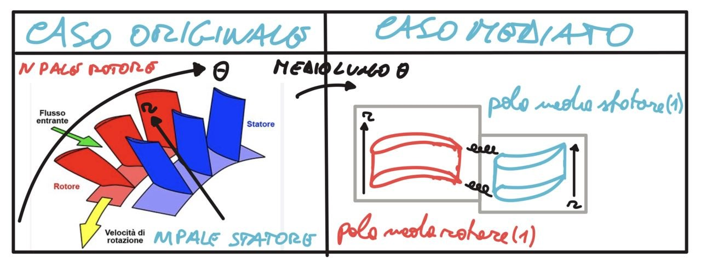
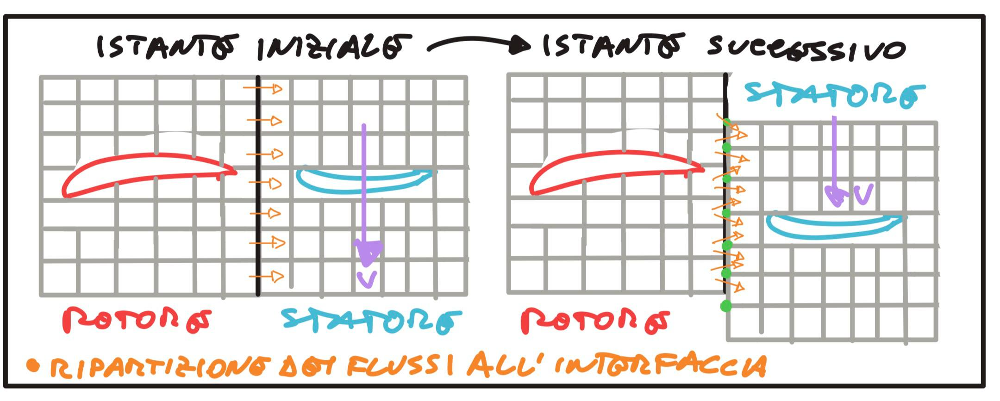

## Parte I — Teoria

### 1. Il problema di base

In una turbomacchina reale **statore e rotore hanno un numero di pale diverso** ($Z_1 \neq Z_2$) e
sono in **moto relativo**. Una simulazione CFD non può quasi mai contenere l'**intero anello (full
annulus)**: sarebbe corretta ma proibitiva. Si cerca allora di simulare **un solo canale (o pochi
canali) per schiera** e di raccordare le due zone con una **condizione di interfaccia**. Il modo in
cui si tratta quell'interfaccia definisce la **fedeltà** della simulazione e il suo **costo**.

> **La domanda centrale di tutta la lezione è una sola: come catturare — o quanto si è disposti a
> perdere de — l'*interazione instazionaria* tra statore e rotore.** Le scie e i campi di potenziale
> delle pale di una schiera investono **periodicamente** la schiera opposta in moto relativo: tutti i
> metodi che seguono si distinguono proprio per **quanta** di questa interazione conservano e a
> **quale costo**.

I metodi principali sono:

| Metodo | Stazionario/Instazionario | Fedeltà | Costo | Gestione del passo diverso |
|---|---|---|---|---|
| **Mixing plane** | Stazionario | Bassa–media | Basso | Media circonferenziale (passi qualsiasi) |
| **Frozen rotor** | Stazionario | Media | Basso | Posizione relativa congelata |
| **Sliding mesh** | Instazionario | Alta | Alto | Servono passi (quasi) uguali |
| **Phase-lag / corocroniche** | Instazionario periodico | Alta | Medio | Sfasamento temporale fra i canali |
| **Tempo inclinato** | Instazionario (riformulato) | Alta | Medio | Inclinazione dello spazio-tempo |

Il campo che si guarda tipicamente per giudicare questi metodi è la **vorticità** (o l'entropia):
mette in evidenza le **scie** che lasciano le pale e il loro **attraversamento dell'interfaccia**,
cioè proprio l'**interazione instazionaria statore–rotore** che alcuni metodi conservano e altri
distruggono.

---

### 2. Mixing plane (piano di miscelamento)

È il metodo a **bassa/media fedeltà** ma **stazionario** ed economico, usato in fase di
**pre-progetto**. L'idea: all'interfaccia si fa una **media in direzione circonferenziale** delle
grandezze di flusso e si passa al rotore solo il **profilo radiale mediato**.



- **Perché si media in direzione circonferenziale (θ):** è la direzione lungo cui statore e rotore
  hanno **periodicità diversa** (passi diversi). Mediando in θ si ottiene un profilo che dipende
  **solo dal raggio**, quindi **indipendente dal numero di pale**: si può raccordare un singolo
  canale dello statore a un singolo canale del rotore qualunque sia il rapporto $Z_1/Z_2$.
- **Cosa si intende per "mediare":** si calcola una **media (mass-/area-averaged)** delle grandezze
  conservate sul tratto circonferenziale dell'interfaccia, ottenendo un valore **uniforme in θ**.
- **Cosa si perde:** sparisce la **non-uniformità circonferenziale**, cioè la **scia** della schiera
  a monte. Sparisce di conseguenza l'**interazione instazionaria rotore–statore** (la pala a valle
  non "vede" più passare le scie a monte). Questo introduce le cosiddette **perdite di mixing
  numeriche**: la media equivale a un **miscelamento istantaneo** della scia, che è un processo
  **irreversibile** e quindi genera **entropia** non fisica all'interfaccia.
- **Esisterebbero metodi più economici che non mediano?** No: rinunciare alla media *senza* passare
  all'instazionario significherebbe imporre un profilo non uniforme a un dominio con periodicità
  diversa, che è incoerente. Il **mixing plane è già il metodo economico**; l'alternativa "senza
  media" è proprio l'instazionario (sliding mesh / phase-lag), che costa **molto di più**.
- **Influenza del passo diverso:** poiché si media, il passo diverso **non crea problemi geometrici**
  (anzi è il motivo per cui si media); influenza però la **fisica**, perché la perdita della scia è
  tanto più grave quanto più l'interazione di passo è importante.
- **Zona di interfaccia (mesh):** le due mesh (statore e rotore) restano **separate**; l'interfaccia
  è un **piano di scambio** dove si calcolano i flussi mediati e si impongono come condizioni al
  contorno reciproche. Non serve corrispondenza tra le celle delle due zone.

**Il vantaggio cruciale: qualunque passo va bene.** Proprio perché si media in θ, il mixing plane
**accetta un rapporto di pale qualsiasi** ($Z_1/Z_2$ arbitrario, anche irrazionale). È questo —
oltre al basso costo dello stazionario — il vantaggio decisivo del metodo: non serve alcun divisore
comune tra i numeri di pala (a differenza dello sliding mesh, §3).

**Ma allora i dati dell'interfaccia non combaciante "si perdono"?** No, non nel senso di celle
inutilizzate: nella media circonferenziale **tutti i valori contribuiscono** all'integrale (media
mass-/area-weighted). Nessun dato resta "scartato"; ciò che si perde è l'**informazione sulla
distribuzione** in θ (la forma della scia), non singole celle. Anche se le due mesh non combaciano
faccia-a-faccia, ogni faccia entra nella media con il suo peso: il mixing plane **non perde dati,
perde struttura circonferenziale**.

**Cosa resta dopo la media: una sola "pala media".** Prima del mixing plane statore e rotore hanno
in generale un **numero di pale diverso**; ma dopo aver mediato lungo θ il risultato dipende **solo
dal raggio** $r$. È come se restasse **una sola pala media** (un profilo radiale), e il problema "quante
pale?" **scompare**: ne rimane una sola, quella mediata. Di fatto si osserva come variano le grandezze
(es. la vorticità) **lungo $r$**, cioè muovendosi dal **tip all'hub** (o viceversa), e non più lungo θ.

**Cosa significa "troncamento della scia" (livello matematico).** Sviluppiamo la grandezza
all'interfaccia in **serie di Fourier circonferenziale**:
$$U(r,\theta) = \sum_{n=-\infty}^{+\infty} \hat{U}_n(r)\,e^{\,i n \theta}.$$
La media circonferenziale **conserva solo l'armonica $n=0$** (il valor medio) e **azzera tutte le
armoniche $n\neq 0$**:
$$\bar{U}(r) = \frac{1}{\Delta\theta}\int_{\theta_1}^{\theta_2} U(r,\theta)\,d\theta = \hat{U}_0(r),
\qquad \hat{U}_n(r)\xrightarrow{\;\text{mixing plane}\;} 0 \;\; (n\neq 0).$$
"Troncamento" significa proprio questo: si **tronca la serie di Fourier al solo modo $n=0$**. I valori
troncati sono le **armoniche superiori** $\hat U_n$ ($n\neq 0$), che sono esattamente quelle che
descrivono la **scia** e le **non-uniformità circonferenziali**. Buttarle via equivale a un
miscelamento istantaneo e genera le **perdite di mixing numeriche**.

---

### Frozen rotor (cenno)

Citato nella tabella ma assente dagli appunti, per completezza: il **frozen rotor** è un metodo
**stazionario** in cui statore e rotore vengono "**congelati**" in una **posizione relativa fissa** e
risolti insieme **senza mediare** in θ. A differenza del mixing plane **conserva la non-uniformità
circonferenziale** (la scia *si vede*), ma solo per **una** posizione relativa arbitraria: l'interazione
**non è quella reale instazionaria**, è una "fotografia" a posizione bloccata. Va quindi inteso come un
compromesso tra mixing plane (media, niente scia) e sliding mesh (instazionario completo): **più
informazione del mixing plane, ma risultato dipendente dalla posizione scelta** e quindi non
fisicamente rigoroso.

---

### 3. Sliding mesh (mesh scorrevole)

È il metodo **instazionario ad alta fedeltà**: la mesh del rotore **scorre** rispetto a quella dello
statore e all'interfaccia si **interpola** il flusso ad ogni passo temporale. Conserva la scia e
tutta l'**interazione instazionaria**.


- **La matrice di connettività varia nel tempo:** ci si riferisce alla **zona di interfaccia**, non
  alle mesh di statore e rotore (che restano rigide). Mentre il rotore scorre, **ogni faccia
  d'interfaccia del rotore si affaccia ad ogni passo a celle diverse dello statore**: l'elenco di
  "chi confina con chi" (la connectivity) **cambia istante per istante**.
- **Euleriano, non lagrangiano (attenzione a non confondere).** Le mesh sono **euleriane**: definiscono
  una **regione di spazio fissa** su cui si scrivono le equazioni, e **non seguono le particelle di
  fluido**. Il fatto che la griglia del rotore **si muova in blocco** (moto rigido imposto,
  *moving/sliding mesh*) **non la rende lagrangiana**: un approccio **lagrangiano** significherebbe
  **seguire le particelle** lungo le loro traiettorie, cosa che qui **non si fa**. Stiamo sempre
  analizzando un **volume di controllo** (la mesh); che poi quel volume trasli rigidamente è un
  discorso a parte e si gestisce con la **velocità di griglia** nei flussi (formulazione ALE,
  *Arbitrary Lagrangian–Eulerian*, che resta sostanzialmente euleriana). In sintesi: **griglia in moto
  ≠ approccio lagrangiano**.
- **"In alcuni casi non c'è nemmeno corrispondenza 1-a-1 tra le celle":** le facce affacciate possono
  avere dimensioni/posizioni diverse, quindi una faccia del rotore si sovrappone **parzialmente a più
  celle** dello statore. Non serve (e non si pretende) una relazione **1-a-1**: si calcolano i flussi
  con **pesi proporzionali alle aree di sovrapposizione** (interpolazione conservativa).
- **Ripartizione dei flussi (conferma).** Sì: se la cella 1 dello statore è affacciata **in parti
  uguali** a due celle del rotore, il flusso all'interfaccia viene **diviso a metà** (50%–50%) tra le
  due. In generale ogni flusso si **ripartisce in proporzione all'area di sovrapposizione**: con tre
  celle sovrapposte al 30/50/20% il flusso si divide 0.30/0.50/0.20. È questa ripartizione pesata che
  garantisce la **conservatività** dell'interfaccia.
- **Perché i passi dovrebbero essere (quasi) uguali → serve il Massimo Comun Divisore.** Per simulare
  solo un sottoinsieme di canali, i settori di statore e rotore devono coprire **lo stesso angolo**.
  Non basta *un* divisore comune: si cerca il **Massimo Comun Divisore (MCD)** dei numeri di pala, così
  da ottenere il **settore periodico più piccolo possibile** (costo computazionale minimo). Vale:
  $$\text{settore} = \frac{360°}{\mathrm{MCD}(Z_1,Z_2)}, \qquad
    \text{canali per settore} = \frac{Z_1}{\mathrm{MCD}},\;\frac{Z_2}{\mathrm{MCD}}.$$
  *Calcoletto:* a $360°$ con **60 pale** ogni canale occupa $360/60 = 6°$; con **30 pale** ogni canale
  occupa $360/30 = 12°$ (il doppio). Con $\mathrm{MCD}(60,30)=30$ il settore minimo è
  $360/30 = 12°$, contenente **2 canali** del rotore a 60 pale e **1 canale** della schiera a 30 pale:
  i due settori hanno **estensione angolare identica** ($12°$). È proprio questo che evita che parte
  del flusso di una schiera **si perda** e non arrivi all'altra — cosa tollerabile nel mixing plane
  (che media), **non** nello sliding mesh (che vuole far combaciare le interfacce).
- **Se l'MCD è troppo piccolo (es. 1):** servirebbe il **full annulus** (tutte le pale), molto costoso.
  In pratica si **modifica leggermente il numero di pale** per ottenere un MCD favorevole: es. da
  **50 e 61** pale si passa a **50 e 60** (fingendo 60, $\mathrm{MCD}=10$, settore $36°$ con 5 canali :
  6 canali), introducendo un piccolo errore geometrico ma rendendo la simulazione **drasticamente più
  economica**.

```
        REALE (50 e 61)                  SIMULATO (50 e 60)
   ┌───────────────────┐            ┌───────────────────┐
   │  passi  non        │            │  passi resi        │
   │  commensurabili    │   ===>     │  commensurabili    │
   │  → full annulus    │            │  → 5 canali : 6    │
   └───────────────────┘            └───────────────────┘
```

---

### 4. Condizioni corocroniche (Phase-Lagged Boundary Conditions)

Quando i passi sono diversi non si può usare una **semplice periodicità spaziale** su un solo canale,
perché due canali adiacenti **non sono nella stessa fase** rispetto alla schiera opposta. La soluzione
è una **periodicità sfasata nel tempo**: il bordo di un canale è uguale al bordo del canale adiacente,
ma **valutato a un istante diverso**.

> **Attenzione a cosa "sfasa" il metodo.** "Sfasamento temporale tra i canali" **non** significa
> aspettare che un canale **combaci geometricamente** con l'altro: canali di passo diverso hanno
> dimensioni diverse e **non combaceranno mai**. Ciò che si sfasa è il **tempo a cui si legge il
> campo**: il bordo del canale che sto simulando, a un certo istante $t$, è **identico** a quello del
> canale adiacente **a un altro istante** $t+\delta_t$. Si sfrutta cioè la **periodicità nel tempo** del
> fenomeno (le scie passano a intervalli regolari), non un'impossibile coincidenza geometrica dei
> canali.

- **Periodicità spaziale (passi uguali):**
$$U(x,r,\theta,t) = U\!\left(x,r,\theta - \tfrac{2\pi}{Z_2},\, t\right)$$
- **Periodicità sfasata / corocronica (passi diversi):**
$$U(x,r,\theta,t) = U\!\left(x,r,\theta - \tfrac{2\pi}{Z_2},\, t + \delta_t\right)$$

con il **time-lag** (sfasamento)
$$\delta_t = \frac{\left|\dfrac{2\pi}{Z_1} - \dfrac{2\pi}{Z_2}\right|}{\left|\Omega_1 - \Omega_2\right|}.$$

- **Significato fisico:** $\delta_t$ è il **tempo necessario** perché la schiera opposta percorra la
  **differenza di passo** $\left|\tfrac{2\pi}{Z_1}-\tfrac{2\pi}{Z_2}\right|$ alla **velocità relativa**
  $|\Omega_1-\Omega_2|$. Quando $Z_1 = Z_2$ la differenza di passo è **nulla** e $\delta_t = 0$: si
  ricade nella periodicità spaziale semplice. Il segno (turbina vs compressore) dipende dal verso
  relativo del moto.
- **Una delle due velocità è sempre nulla.** Sia in un **compressore** sia in una **turbina** la
  configurazione è **statore–rotore** (o rotore–statore): **una delle due schiere è ferma**, quindi ha
  velocità **zero**. Di conseguenza la velocità relativa si riduce alla sola velocità del rotore:
  $|\Omega_1-\Omega_2| = \Omega_{\text{rotore}}$ (con $\Omega_{\text{statore}}=0$). La formula del lag
  si semplifica perciò in $\delta_t = \left|\tfrac{2\pi}{Z_1}-\tfrac{2\pi}{Z_2}\right| / \Omega_{\text{rotore}}$.
- **Perché tanti nomi diversi (phase-lag, corocroniche, chorochronic):** descrivono la **stessa
  idea** da angolazioni diverse. *Phase-lag* sottolinea lo **sfasamento di fase** (= rotazione di un
  passo) tra canali adiacenti; *corocroniche/chorochronic* sottolinea che la **periodicità è
  spazio-temporale** (greco *choros* = spazio, *chronos* = tempo): ciò che è periodico è la
  combinazione **(spazio θ) + (tempo t)**, non lo spazio da solo.
- **Full annulus vs phase-lag — memoria al posto dei canali.** Il **full annulus** richiederebbe di
  simulare **tutti i canali** contemporaneamente (costo in **numero di celle/domini**). Il phase-lag
  evita questo simulando **un solo canale**, ma in cambio deve **memorizzare la storia temporale** al
  bordo (es. del rotore): così, **in base all'istante di tempo**, sa **quale condizione al contorno**
  imporre alla schiera opposta (lo statore). Lo scambio è quindi **memoria temporale ⇄ numero di
  canali**.
- **Implica un metodo instazionario.** Proprio perché la BC dipende dall'**istante** $t$ (tramite
  $\delta_t$) e richiede la storia temporale, il phase-lag è **necessariamente instazionario** (periodico
  nel tempo): non avrebbe senso in un calcolo stazionario, dove non esiste una "storia" da memorizzare.

```
   Canale 1 al tempo t          ==  Canale 2 al tempo  t + δt
   ┌─────────────┐                   ┌─────────────┐
   │   ✈ scia    │   (stesso campo,  │   ✈ scia    │
   │             │    sfasato nel    │             │
   └─────────────┘    tempo di δt)   └─────────────┘
```

---

### 5. Metodo del tempo inclinato (Time-Inclining / Time-Tilting)

È una **riformulazione** del problema instazionario periodico: invece di sfasare *a posteriori* le
condizioni al contorno (come nel phase-lag), si **inclina l'asse temporale** lungo la direzione
circonferenziale, così che la **periodicità sfasata diventi una periodicità ordinaria** nel nuovo
sistema di coordinate.

```
        t↑                              t↑
   n+1 ·······                     n+1      · · · · ·
       (stesso istante)                    ·  (istanti
    n  ━━━━━━━●━━━ →θ              n   ━━●  diversi lungo θ)
                                          ↗
     CFD classico                    CFD a tempo inclinato
```

- **Relazione con il phase-lag:** è una **via alternativa allo stesso obiettivo** (simulare un solo
  canale con passi diversi). Il phase-lag agisce sulle **BC** salvando la storia temporale; il tempo
  inclinato agisce sulla **formulazione delle equazioni**, deformando il piano spazio-tempo in modo
  che la periodicità sfasata sia automaticamente soddisfatta.
- **Cosa cambia concettualmente:** in un CFD classico i livelli $n$ e $n+1$ sono **istanti di tempo**
  riferiti a tutto il dominio. Nel tempo inclinato i punti salvati a $n$ e $n+1$ **non sono più allo
  stesso istante fisico**: spostandosi circonferenzialmente si è a tempi diversi. Quindi $n \to n+1$
  **non è più un'evoluzione temporale ma un'evoluzione di vettori** lungo l'asse inclinato. Anche un
  semplice *plot a tempo fissato* diventa problematico, perché punti diversi del piano si riferiscono
  a tempi fisici diversi.
- **Niente delay esplicito sulle condizioni al contorno.** A differenza del **phase-lag** — che impone
  la BC al tempo $t+\delta_t$ andando a **recuperare la storia temporale** salvata — nel tempo
  inclinato **non occorre applicare alcun ritardo esplicito** all'interfaccia statore–rotore. Per come
  è costruito il **vettore dei dati** (i punti salvati allo stesso livello $n$ sono **già a istanti
  fisici diversi** lungo θ), lo **sfasamento temporale è già incorporato nella griglia spazio-tempo
  inclinata**: i dati che si impongono al contorno sono quindi **già sfasati per costruzione**, e la
  periodicità corocronica si riduce a una **periodicità ordinaria** che non richiede di "ricordare" e
  ri-applicare $\delta_t$. È esattamente il **vantaggio di memoria** del metodo rispetto al phase-lag.
- **Pro:** evita di conservare la lunga storia temporale del phase-lag → **meno memoria** per certi
  casi; periodicità imposta in modo "esatto".
- **Contro:** **complessità di implementazione** elevata, **post-processing** non intuitivo (i campi
  non sono iso-temporali), validità limitata a configurazioni con **rapporto di passo** ben definito.
  Resta una tecnica **prevalentemente teorica/accademica**, con **scarsa applicazione industriale**
  rispetto a mixing plane e sliding mesh.

---

## Parte II — Simulazione d'esame

<details>
<summary><strong>Domanda 1 — Che tipo di analisi è stata condotta nell'immagine in alto (LES/RANS/DNS)? Che campo è rappresentato e perché si è scelto proprio quello?</strong></summary>

L'immagine mostra il **campo di vorticità** all'interfaccia statore–rotore. Il campo è
**instazionario e risolto nelle scie** (si vedono i filamenti vorticosi delle pale che attraversano
l'interfaccia): questo è coerente con un'analisi **scale-resolving** — **URANS, LES o DNS** — e
**non** con una RANS stazionaria, che mediando nel tempo non potrebbe mostrare le scie istantanee.
Il testo non specifica quale delle tre, perché il punto non è il modello di turbolenza ma la
**capacità di catturare l'interazione instazionaria**.

Si è scelta la **vorticità** (e non Mach, pressione o temperatura) perché è la grandezza che
**evidenzia meglio le scie e i vortici** rilasciati dalle pale e il loro **trasporto attraverso
l'interfaccia**: è esattamente il fenomeno che distingue un metodo che conserva l'interazione
(sliding mesh, phase-lag) da uno che la distrugge (mixing plane). È una questione **generale delle
turbomacchine**, non legata a un singolo caso.

</details>

<details>
<summary><strong>Domanda 2 — Approfondisci il mixing plane: fedeltà, perché si media in direzione circonferenziale, cosa significa mediare, perdite di informazione e di mixing, influenza della differenza di passo, gestione della zona di interfaccia.</strong></summary>

**Collocazione tra i metodi.** Il mixing plane è il metodo a **bassa/media fedeltà** ma
**stazionario** ed economico (l'immagine a bassa fedeltà): si sceglie quando serve un risultato
rapido, tipicamente in **pre-progetto**.

**Perché si media in direzione circonferenziale.** È la direzione lungo cui statore e rotore hanno
**periodicità diversa** (passi diversi). Mediando in θ il profilo dipende **solo dal raggio** ed è
quindi **indipendente dal numero di pale**: così si può raccordare un singolo canale di statore a un
singolo canale di rotore qualunque sia $Z_1/Z_2$.

**Cosa si intende per "mediare".** Si calcola una **media (mass- o area-averaged)** delle grandezze
conservate sul tratto circonferenziale dell'interfaccia, ottenendo un valore **uniforme in θ** che
viene imposto come condizione al contorno alla schiera a valle.

**Cosa si perde / esistono metodi più economici che non mediano?** Si perde la **non-uniformità
circonferenziale**, cioè la **scia**, e con essa l'**interazione instazionaria rotore–statore** (la
pala a valle non vede più passare le scie a monte). **Non esiste** un metodo *più economico* che
eviti la media restando stazionario: il mixing plane **è** il metodo economico; l'unica alternativa
che non media è l'**instazionario**, che costa molto di più.

**Perché nascono le perdite di mixing numeriche.** La media equivale a un **miscelamento istantaneo
e completo** della scia all'interfaccia. Il miscelamento è un processo **irreversibile** → genera
**entropia**: parte di questa entropia è **numerica/spuria** (legata al troncamento della scia nel
piano), non fisica. È il fenomeno di interazione che in **stazionario rotore–statore** non viene
catturato e che il mixing plane "spalma" come perdita.

**Influenza della differenza di passo.** Geometricamente la differenza di passo **non crea problemi**
(è proprio ciò che giustifica la media). Fisicamente, però, è il parametro che misura **quanto è
importante l'interazione persa**: più le scie e i passi sono disuniformi, più grave è l'errore di
mediare.

**Zona di interfaccia (mesh).** Le mesh di statore e rotore restano **separate**: l'interfaccia è un
**piano di scambio** su cui si calcolano i profili radiali mediati e li si impone reciprocamente. Non
serve corrispondenza cella-a-cella tra le due zone.


</details>

<details>
<summary><strong>Domanda 3 — Sliding mesh: perché la matrice di connettività varia nel tempo e a quale mesh si riferisce? È euleriano o lagrangiano? La relazione cella-cella deve essere 1-a-1? Perché si modifica il numero di pale?</strong></summary>

**A quale mesh si riferisce la connectivity variabile.** Alla **zona di interfaccia**, non alle mesh
di statore e rotore: queste restano **rigide**, mentre la griglia del rotore **scorre in blocco**. Ad
ogni passo temporale ogni faccia d'interfaccia del rotore si affaccia a **celle diverse** dello
statore, quindi l'elenco "chi confina con chi" **cambia istante per istante**.

**Euleriano o lagrangiano.** Le mesh sono **euleriane** (rigide, non seguono il fluido). Ciò che si
muove è la **griglia** del rotore con **moto rigido imposto** (*sliding/moving mesh*), non le
particelle: quindi è un **accoppiamento euleriano con interpolazione geometrica** all'interfaccia,
non un metodo lagrangiano.

**Deve essere 1-a-1?** No, e in generale **non lo è**. Le facce affacciate hanno dimensioni e
posizioni diverse, perciò una faccia del rotore si sovrappone **parzialmente a più celle** dello
statore. I flussi si calcolano con **pesi proporzionali alle aree di sovrapposizione**
(interpolazione **conservativa**): è il modo corretto di gestire l'assenza di corrispondenza 1-a-1.

**Perché modificare il numero di pale.** Per simulare solo un sottoinsieme di canali servono settori
di statore e rotore che coprano lo **stesso angolo**, cioè un **divisore comune** tra $Z_1$ e $Z_2$.
Se non esiste, servirebbe il **full annulus** (tutte le pale), costosissimo. Allora si **modifica
leggermente il conteggio**: es. da **50 e 61** si passa a **50 e 60** (5 canali di statore : 6 di
rotore), accettando un piccolo errore geometrico per un risparmio **drastico**.

**Confronto reale vs simulato:**
```
   REALE  (50 e 61, incommensurabili)  →  serve full annulus
   SIMUL. (50 e 60, rapporto 5:6)      →  bastano 5 canali statore + 6 rotore
```

</details>

<details>
<summary><strong>Domanda 4 — Condizioni corocroniche / phase-lag: perché tanti nomi, cosa significano, qual è l'idea di base, perché passi diversi danno risultato diverso, formula del lag e suo significato, costo in memoria.</strong></summary>

**Perché tanti nomi (phase-lag, corocroniche, chorochronic).** Descrivono la **stessa idea** da
prospettive diverse: *phase-lag* enfatizza lo **sfasamento di fase** (rotazione di un passo) tra
canali adiacenti; *corocronico/chorochronic* enfatizza che la **periodicità è spazio-temporale**
(*choros* = spazio, *chronos* = tempo). Periodica è la **combinazione (θ, t)**, non lo spazio da solo.

**Idea di base.** Con passi diversi, due canali adiacenti **non sono nella stessa fase** rispetto alla
schiera opposta, quindi non vale la periodicità spaziale semplice. Si impone allora che il bordo di un
canale eguagli quello del canale adiacente **valutato a un istante diverso**:
$$U(x,r,\theta,t) = U\!\left(x,r,\theta-\tfrac{2\pi}{Z_2},\,t\right) \;\to\; U\!\left(x,r,\theta-\tfrac{2\pi}{Z_2},\,t+\delta_t\right).$$

**Perché passi diversi → risultato diverso.** Se $Z_1=Z_2$ (stesso passo) lo sfasamento è nullo e si
ricade nella periodicità spaziale. Appena i passi differiscono compare un **lag temporale** non nullo:
ignorarlo darebbe BC sbagliate.

**Formula del lag e significato.**
$$\delta_t=\frac{\left|\tfrac{2\pi}{Z_1}-\tfrac{2\pi}{Z_2}\right|}{\left|\Omega_1-\Omega_2\right|}.$$
È il **tempo** che impiega la schiera opposta a percorrere la **differenza di passo** alla **velocità
relativa** $|\Omega_1-\Omega_2|$. Quando $Z_1=Z_2$, $\delta_t=0$. Il segno (verso del lag) dipende dal
fatto che si tratti di **turbina o compressore**.

**Costo in memoria.** Per imporre la BC al tempo $t+\delta_t$ serve **conservare la storia temporale**
della soluzione al bordo su un intero periodo: si paga **più memoria** in cambio di simulare **un solo
canale** invece dell'intero anello.

</details>

<details>
<summary><strong>Domanda 5 — Il tempo inclinato è un'alternativa o una variante del phase-lag? Che relazione c'è tra i due? Pro e contro? Si usa nell'industria? Perché "n e n+1 non è più questione temporale ma evoluzione di vettori"?</strong></summary>

**Alternativa o variante?** È una **via alternativa allo stesso obiettivo** del phase-lag: simulare un
**solo canale** con passi diversi. Non è la stessa cosa: il phase-lag agisce sulle **condizioni al
contorno** (salvando la storia temporale), il tempo inclinato agisce sulla **formulazione delle
equazioni**, **inclinando l'asse temporale** lungo θ in modo che la periodicità sfasata diventi una
periodicità **ordinaria** nel nuovo sistema di coordinate.

**Pro.** Evita di conservare la lunga storia temporale del phase-lag (**meno memoria** in certi casi);
impone la periodicità in modo "esatto" per costruzione.

**Contro.** **Implementazione complessa**, **post-processing non intuitivo** (i campi non sono
iso-temporali), applicabilità legata a un **rapporto di passo** ben definito. È rimasta una tecnica
**prevalentemente teorica/accademica**, con **scarsa diffusione industriale** rispetto a mixing plane
e sliding mesh.

**Perché "evoluzione di vettori e non temporale".** In un CFD classico i livelli $n$ e $n+1$ sono
**istanti fisici** comuni a tutto il dominio. Nel tempo inclinato, spostandosi circonferenzialmente si
è a **tempi fisici diversi**: i valori salvati a $n$ e $n+1$ **non condividono lo stesso istante**.
Quindi $n\to n+1$ non rappresenta più un avanzamento nel tempo fisico ma il passaggio da un **vettore
di stato a un altro** lungo l'asse spazio-temporale inclinato. Ne segue che persino un **plot a "tempo
fissato"** diventa ambiguo, perché punti diversi del piano sono a tempi fisici differenti.

**Non serve un delay esplicito sulle BC.** Proprio perché il vettore dei dati è costruito su una
griglia spazio-tempo inclinata, i punti che si impongono al contorno statore–rotore sono **già
sfasati nel tempo per costruzione**: non occorre — a differenza del phase-lag — andare a leggere la
storia temporale e applicare il ritardo $\delta_t$. Lo sfasamento è **assorbito nella geometria del
vettore di dati** e la periodicità corocronica diventa una **periodicità ordinaria**. È questo che
rende il tempo inclinato **parsimonioso in memoria** rispetto al phase-lag.

</details>

<details>
<summary><strong>Domanda di sintesi (livello esame) — Una stessa girante va simulata: (a) in pre-progetto, (b) per uno studio aeroacustico di interazione rotore–statore. Quale metodo di interfaccia scegli nei due casi e perché?</strong></summary>

**(a) Pre-progetto → Mixing plane.** Serve un risultato **rapido ed economico** per molte
configurazioni: lo stazionario col mixing plane è sufficiente per stimare prestazioni medie
(rapporto di compressione, rendimento), accettando la perdita dell'interazione instazionaria e le
relative **perdite di mixing numeriche**.

**(b) Aeroacustica / interazione → Sliding mesh (o phase-lag se i passi lo permettono).** L'obiettivo
è proprio l'**interazione instazionaria** (passaggio delle scie, tono di pala): serve un metodo che
**conservi la non-uniformità circonferenziale e la storia temporale**. Lo **sliding mesh** è il
riferimento ad alta fedeltà; se si vuole limitare il costo a un solo canale e i passi sono trattabili,
si usano le **condizioni corocroniche** salvando la storia temporale.

*Discriminante chiave:* **mediare la scia (mixing plane) vs conservarla (sliding/phase-lag)** —
ovvero scegliere tra **costo basso/stazionario** e **fedeltà alta/instazionario**.

</details>
