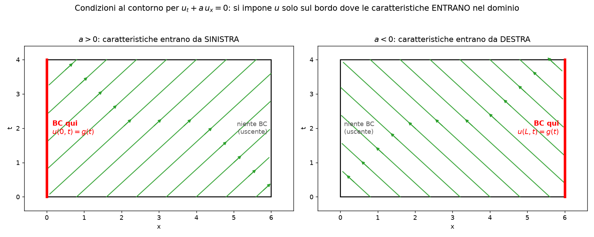
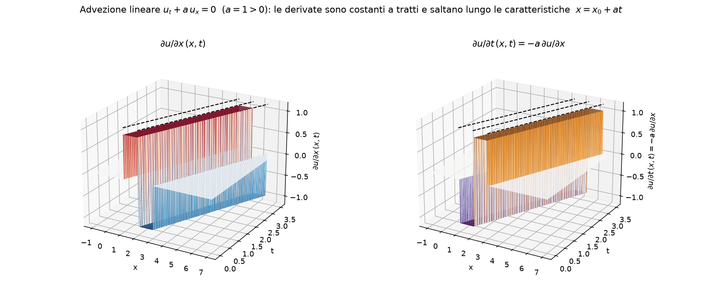
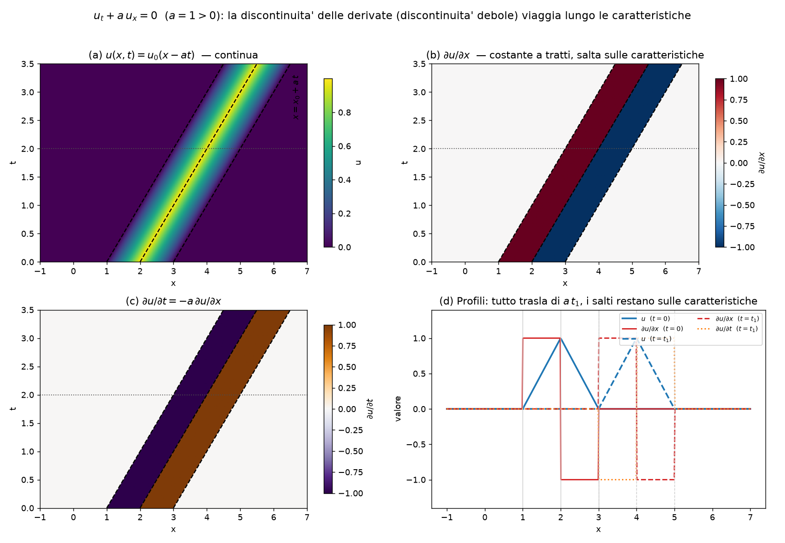

# Metodo delle caratteristiche

> Regime tipicamente **supersonico/iperbolico**: l'informazione viaggia lungo le
> **linee caratteristiche** (cono di Mach), non ovunque. È il complemento del file
> [`bilancio.md`](bilancio.md) (leggi di conservazione e sistema di Eulero), da cui
> si eredita la forma quasi-lineare $\partial_t U + A(U)\,\partial_x U = 0$ con
> $A = L\Lambda L^{-1}$.

## Nomenclatura essenziale

<strong>📖 Simboli e nomenclatura usati nel capitolo</strong>

| Simbolo | Nome | Note |
|---|---|---|
| $\lambda_k,\ \Lambda$ | **autovalori** / matrice diagonale | velocità di propagazione delle onde |
| $L,\ L^{-1}$ | matrici di **autovettori** | $A=L\Lambda L^{-1}$ |
| $dx/dt=\lambda_k$ | **linea caratteristica** $k$-esima | curva nello spazio-tempo |
| $W_k$ | **variabile caratteristica** | $dW_k/dt=0$ lungo la caratteristica |
| $J^{\pm}=u\pm 2c/(\gamma-1)$ | **invarianti di Riemann** | costanti lungo $dx/dt=u\pm c$ |
| $c$ | **velocità del suono** | $c^2=\gamma p/\rho$ |
| $s$ | velocità dell'**urto** mobile | $s[\![U]\!]=[\![F]\!]$ |
| $[\![\cdot]\!]$ | **salto** monte ↔ valle | $[\![q]\!]=q_R-q_L$ |
| Rankine–Hugoniot | relazioni di **salto** attraverso l'urto | monte ↔ valle |

> **Idea chiave:** premoltiplicando il sistema iperbolico per $L^{-1}$ lo si
> **disaccoppia** in equazioni scalari; lungo ogni caratteristica $dx/dt=\lambda_k$
> una PDE diventa una **ODE** ($dW_k/dt=0$). Le discontinuità (urti) si trattano con
> le relazioni di salto di **Rankine–Hugoniot**.

---

## Equazioni di Eulero e metodo delle caratteristiche

<strong>Equazioni di Eulero 1D (instazionario)</strong>

Sistema iperbolico ereditato da [`bilancio.md`](bilancio.md), in forma divergente:

$$\frac{\partial U}{\partial t} + \frac{\partial F(U)}{\partial x} = 0,\qquad
U=\begin{pmatrix}\rho\\ \rho u\\ \rho E\end{pmatrix},\quad
F=\begin{pmatrix}\rho u\\ \rho u^2+p\\ (\rho E+p)u\end{pmatrix}$$

e in forma **quasi-lineare** (chain rule, $A=\partial F/\partial U$):

$$\frac{\partial U}{\partial t} + A(U)\,\frac{\partial U}{\partial x} = 0,\qquad
A=L\,\Lambda\,L^{-1},\quad \lambda=\{u,\ u+c,\ u-c\}.$$

È questa forma il punto di partenza del metodo delle caratteristiche: i tre
autovalori reali sono le tre velocità di propagazione delle onde.

<strong>Rappresentazione nello schema spazio-tempo</strong>

Si lavora nel **piano $(x,t)$** (tempo in verticale). Una caratteristica è la
curva $x(t)$ definita da $\dfrac{dx}{dt}=\lambda_k$; la sua **pendenza**
$\dfrac{dt}{dx}=1/\lambda_k$ è tanto più ripida quanto più lenta è l'onda.

- Da ogni punto partono tante caratteristiche quanti sono gli autovalori
  (3 per Eulero 1D): le loro inclinazioni formano il **cono di Mach** locale.
- Il **dominio di dipendenza** di un punto $P$ è il segmento sull'asse $x$
  (dato iniziale) racchiuso dalle caratteristiche che arrivano in $P$; il
  **dominio di influenza** è la regione raggiunta dalle caratteristiche che
  partono da $P$. È la traduzione geometrica della causalità iperbolica
  (l'informazione viaggia a velocità finita, lungo le caratteristiche).

<strong>Equazioni di compatibilità</strong>

Premoltiplicando la forma quasi-lineare per $L^{-1}$ e definendo le
**variabili caratteristiche** $W=L^{-1}U$ (per $A$ costante, $dW=L^{-1}dU$):

$$L^{-1}U_t + \Lambda\,L^{-1}U_x = 0 \;\Longrightarrow\;
\frac{\partial W_k}{\partial t} + \lambda_k\,\frac{\partial W_k}{\partial x}=0.$$

Ogni componente è una **advezione scalare disaccoppiata**: lungo la caratteristica
$dx/dt=\lambda_k$ vale l'**equazione di compatibilità**

$$\frac{dW_k}{dt}=0 \quad\text{(}W_k\text{ costante lungo la }k\text{-esima caratteristica).}$$

Per Eulero 1D le $W_k$ sono gli **invarianti di Riemann** $J^{\pm}=u\pm\frac{2c}{\gamma-1}$
(più l'entropia lungo $dx/dt=u$). La PDE è così ridotta a un insieme di **ODE**.

<strong>Equazioni iperboliche</strong>

Un sistema $U_t+A\,U_x=0$ è **iperbolico** se $A$ è **diagonalizzabile con autovalori
reali**: solo allora esistono $n$ famiglie di caratteristiche reali e la
decomposizione in onde $A=L\Lambda L^{-1}$ ha senso.

| Natura | Discriminante / autovalori | Caratteristiche | Regime |
|---|---|---|---|
| Iperbolica | $\lambda_k\in\mathbb{R}$ distinti | $n$ reali → MoC applicabile | supersonico |
| Parabolica | autovalori reali coincidenti / degenere | degeneri | — |
| Ellittica | $\lambda$ complessi ($\Delta<0$) | nessuna reale → no MoC | subsonico |

(La classificazione tramite $\Delta=B^2-4AC$ è in [`bilancio.md`](bilancio.md).)

<strong>Linee caratteristiche: derivazione</strong>

**Idea.** Cerco una curva $x(t)$ nel piano $(x,t)$ lungo la quale la PDE si riduca
a una **ODE**. La derivata totale di $u$ lungo una generica curva $x(t)$ è

$$\frac{du}{dt}\bigg|_{x(t)} = \frac{\partial u}{\partial t} + \frac{dx}{dt}\,\frac{\partial u}{\partial x}.$$

**Caso scalare lineare** $u_t + a\,u_x = 0$. Confrontando i due membri, se **scelgo**
la curva tale che

$$\boxed{\ \frac{dx}{dt}=a\ }\qquad\Longrightarrow\qquad \frac{du}{dt}=u_t+a\,u_x=0.$$

Quindi lungo la retta $x=x_0+a t$ la soluzione è **costante**: questa è la *linea
caratteristica*. Integrando: $u(x,t)=u_0(x-at)$ — il profilo iniziale traslato
rigidamente a velocità $a$.

**Caso scalare non lineare** $u_t+f(u)_x=0 \Rightarrow u_t+f'(u)u_x=0$: stessa
costruzione con $\dfrac{dx}{dt}=f'(u)$ → le caratteristiche sono ancora rette ma con
pendenza che dipende dal valore trasportato (possono **convergere** → urto).

**Caso sistema 1D** $U_t+A\,U_x=0$, $A=L\Lambda L^{-1}$: proiettando sulle variabili
caratteristiche $W=L^{-1}U$ si ottengono $n$ equazioni scalari, una per ogni
famiglia $\dfrac{dx}{dt}=\lambda_k$. Si recupera il caso scalare, per componente.

<strong>Differenza con il caso a più dimensioni / sistemi (non scalare)</strong>

Il metodo "una curva → una ODE" funziona **pulito solo in 1D**:

- **Scalare 1D:** una sola famiglia di caratteristiche, $u$ costante lungo di esse.
- **Sistema 1D** (es. Eulero): $n$ famiglie $dx/dt=\lambda_k$; si riduce a ODE solo
  dopo aver **diagonalizzato** ($W=L^{-1}U$). Per sistemi $2\times2$ esistono gli
  **invarianti di Riemann**; già per $3\times3$ (Eulero) gli invarianti non sono
  globali e si usano lungo le singole caratteristiche.
- **Multidimensionale** $U_t+\sum_d A_d\,\partial_{x_d}U=0$: si cercano **superfici**
  caratteristiche $\phi(x,t)=\text{cost}$ tramite la condizione

  $$\det\!\Big(\phi_t\,I + \textstyle\sum_d A_d\,\phi_{x_d}\Big)=0,$$

  che **non** definisce curve isolate ma un **cono caratteristico** (il *cono di Mach*)
  e le sue **bicaratteristiche**. Non c'è più una riduzione esatta a ODE: il metodo
  delle caratteristiche resta uno strumento di analisi (direzioni di propagazione,
  well-posedness, condizioni al contorno) ma non un solutore diretto come in 1D.

<strong>Definizione fisica</strong>

Le caratteristiche sono i **percorsi nello spazio-tempo lungo cui si propaga
l'informazione** (i segnali/onde). Fisicamente: la traiettoria lungo cui un'onda
trasporta il proprio invariante senza che lo "veda" cambiare. Spiegano perché in
regime iperbolico una perturbazione si sente solo dentro il cono di Mach (causalità
a velocità finita) e perché servono schemi **upwind** (si guarda "da monte", da dove
arriva il segnale).

<strong>Definizione matematica</strong>

Le caratteristiche sono le curve lungo cui il **problema di Cauchy non è ben posto**:
assegnando $u$ su una caratteristica, la PDE **non determina** la derivata trasversale
alla curva. Equivalentemente, sono le curve su cui si annulla il **determinante
caratteristico** $\det(\phi_t I+\sum_d A_d\phi_{x_d})=0$, ovvero le curve attraverso le
quali le **derivate di ordine massimo possono essere discontinue** pur soddisfacendo
la PDE (vedi figure sotto). Le due definizioni — fisica e matematica — individuano le
stesse curve $dx/dt=\lambda_k$.

<strong>Propagazione discontinuità con Rankine-Hugoniot</strong>

Due tipi di discontinuità, entrambe legate alle caratteristiche:

- **Discontinuità debole** (salto nelle *derivate*, $u$ continua): viaggia
  **esattamente lungo una caratteristica** $dx/dt=\lambda_k$. È il caso illustrato
  nelle figure della sezione *Discontinuità delle derivate*.
- **Discontinuità forte / urto** (salto in $u$ stessa): nel caso **lineare** viaggia
  ancora lungo la caratteristica $dx/dt=a$; nel caso **non lineare** le caratteristiche
  convergono e si forma un urto che si muove a velocità $s$ data da **Rankine–Hugoniot**

  $$s\,[\![U]\!]=[\![F]\!]\quad\Longrightarrow\quad s=\frac{[\![F]\!]}{[\![U]\!]},$$

  in generale **diversa** dalla velocità caratteristica locale $f'(u)$ (è la media
  $s=(u_L+u_R)/2$ per Burgers). Dettagli e dimostrazione in [`bilancio.md`](bilancio.md)
  e nella lista *Dimostrazioni*.

---

## Condizioni al contorno (caratteristiche entranti)

A un dato istante $t_1$, alcune regioni del piano $(x,t)$ **non sono raggiunte** da
caratteristiche che risalgono al dato iniziale: lì la soluzione dipende dalle
**condizioni al contorno**.

- **$a>0$:** le caratteristiche **entrano da sinistra** → si impone
  $u(x_0,t)=g(t)$ sul bordo sinistro. Sul bordo destro **nessuna** condizione: le
  caratteristiche trasportano informazione **dall'interno verso l'esterno** (bordo
  uscente).
- **$a<0$:** situazione speculare → condizione sul bordo **destro**, nulla a sinistra.

> **Regola generale (sistemi):** il numero di condizioni da imporre su un bordo =
> numero di **caratteristiche entranti** in quel bordo. Per Eulero questo spiega
> inlet/outlet sub- vs supersonici (es. *outlet subsonico*: una caratteristica
> rientra → si impone la **pressione statica** e si estrapola il resto). Vedi
> `report_QA.md` (Domande 12–13) e la sezione D dell'esame.

## Discontinuità delle derivate lungo le caratteristiche

Per l'advezione lineare $u_t+a\,u_x=0$ con dato iniziale a **tenda** (triangolo),
la soluzione $u(x,t)=u_0(x-at)$ resta **continua**, ma le derivate parziali
$\partial_x u$ e $\partial_t u$ sono **costanti a tratti** e presentano un **salto**
attraverso le linee caratteristiche $x=x_0+at$ (è una *discontinuità debole*).
Ovunque vale la relazione di compatibilità $\partial_t u=-a\,\partial_x u$.

In 3D le derivate appaiono come **plateau** a quote diverse, separati da "pareti"
quasi verticali: ogni parete giace **esattamente** su una caratteristica. Le due
superfici sono una il negativo dell'altra (a meno del fattore $a$), come impone
$\partial_t u=-a\,\partial_x u$.

Pannello riassuntivo: (a) $u$ continua che trasla; (b)–(c) $\partial_x u$ e
$\partial_t u$ a strisce di valore costante, delimitate dalle caratteristiche
(linee tratteggiate); (d) i profili a $t=0$ e $t=t_1$ mostrano che **tutto trasla di
$a\,t_1$** e i salti restano ancorati alle caratteristiche. Questo è il senso
geometrico dell'affermazione "le caratteristiche sono le curve attraverso cui le
derivate possono essere discontinue".

> 🛠️ Figure generate da [`images/caratteristiche_plots.py`](images/caratteristiche_plots.py)
> (`python3 teoria/images/caratteristiche_plots.py`).

---

## Formule da ricordare (memo)

<strong>🧠 Tutte le formule chiave del capitolo, con hint per ricordarle</strong>

> Specchietto: formule da tenere a memoria, con un gancio mnemonico e i collegamenti tra loro.

### Caratteristiche e compatibilità

| Formula | Hint / collegamento |
| --- | --- |
| $\dfrac{\partial U}{\partial t} + A(U)\dfrac{\partial U}{\partial x} = 0$ | **Forma quasi-lineare** ereditata da `bilancio.md`: il punto di partenza per diagonalizzare. |
| $A = L\,\Lambda\,L^{-1}$ | **Diagonalizzazione**: autovalori reali → sistema iperbolico → esistono le caratteristiche. |
| $\dfrac{dx}{dt}=\lambda_k$ | **Linea caratteristica**: curva lungo cui viaggia l'onda $k$-esima (per Eulero $\lambda=\{u,\ u+c,\ u-c\}$). |
| $\dfrac{dW_k}{dt}=0$ lungo $\dfrac{dx}{dt}=\lambda_k$ | **Equazione di compatibilità**: la PDE disaccoppiata diventa una ODE → $W_k$ è una *variabile caratteristica* trasportata. |

### Invarianti di Riemann (Eulero 1D isentropico)

| Formula | Hint / collegamento |
| --- | --- |
| $du\pm\dfrac{dp}{\rho c}=0$ lungo $\dfrac{dx}{dt}=u\pm c$ | Forma differenziale lungo le caratteristiche acustiche. |
| $J^{\pm}=u\pm\dfrac{2c}{\gamma-1}$ | **Invarianti di Riemann**: costanti lungo $dx/dt=u\pm c$ (isentropico, $c^2=\gamma p/\rho$). |

### Salto attraverso l'urto

| Formula | Hint / collegamento |
| --- | --- |
| $s\,[\![U]\!]=[\![F]\!]$ | **Rankine–Hugoniot**: condizione di salto coerente con la forma conservativa $\partial_t U+\partial_x F=0$. $s$ = velocità dell'urto, $[\![\cdot]\!]$ = salto monte↔valle. |

---

## Dimostrazioni (lista)

<strong>📐 Dimostrazioni da saper fare</strong>

| Dimostrazione | Punto di partenza → arrivo |
| --- | --- |
| Definizione della linea caratteristica (scalare → sistema → multi-D) | Da $\frac{du}{dt}=u_t+\frac{dx}{dt}u_x$ lungo $x(t)$, confrontata con $u_t+a u_x=0$ → scelgo $\frac{dx}{dt}=a$ ⇒ $\frac{du}{dt}=0$ ($u$ costante, $u=u_0(x-at)$); non lineare $\frac{dx}{dt}=f'(u)$; sistema $\frac{dx}{dt}=\lambda_k$ via $W=L^{-1}U$; multi-D → cono caratteristico $\det(\phi_t I+\sum_d A_d\phi_{x_d})=0$. |
| Equazioni caratteristiche e di compatibilità | Da $U_t+A U_x=0$ con $A=L\Lambda L^{-1}$ → premoltiplico per $L^{-1}$ → lungo $dx/dt=\lambda_k$ la PDE diventa la ODE $dW_k/dt=0$ (invariante). |
| Invarianti di Riemann (Eulero 1D) | Da $du\pm dp/(\rho c)=0$ lungo $dx/dt=u\pm c$ (isentropica, $c^2=\gamma p/\rho$) → $J^{\pm}=u\pm 2c/(\gamma-1)$ costanti. |
| Rankine-Hugoniot dal bilancio integrale | Da $\frac{d}{dt}\int U\,dx+[F]=0$ con urto mobile a velocità $s$ → regola di Leibniz e limite sull'intervallo → $s[\![U]\!]=[\![F]\!]$. |

