# Metodo delle caratteristiche

<details>
<summary><strong>Come leggere questa pagina (legenda) — apri qui</strong></summary>

L'intera pagina è organizzata in **toggle** (menù a tendina). Ogni toggle è
etichettato in modo esplicito (niente emoji da decifrare):

- **Inquadramento —** il "minimo indispensabile" della sezione (equazioni, idea).
- **Concetto —** chiarimento/risposta a un dubbio teorico.
- **Approfondimento —** dettaglio extra (utile ma non essenziale alla prima lettura).
- **Dimostrazione —** passaggi da saper rifare.
- **Figura —** grafico con commento.
- **Formule —** specchietto delle formule chiave.
- **Nomenclatura —** simboli.
- **Codice/Esercitazioni —** collegamento al solutore `Euler2D` / writeup.

Ogni toggle ha un titolo **descrittivo**: apri quelli che ti interessano.

</details>

<details>
<summary><strong>Inquadramento — di cosa parla il capitolo</strong></summary>

Regime tipicamente **iperbolico** (supersonico per Eulero): l'informazione viaggia
lungo le **linee caratteristiche**, non ovunque. È il complemento di
[`bilancio.md`](bilancio.md) (leggi di conservazione e sistema di Eulero), da cui si
eredita la forma quasi-lineare $\partial_t U + A\,\partial_x U = 0$, $A=L\Lambda L^{-1}$.

Contenuti basati sul **Cap. 2 "Linee caratteristiche"** (appunti CFD, P. Pantò) +
[`bilancio.md`](bilancio.md). Le figure a mano del capitolo sono state **ridisegnate
in Python/SVG**(script [`images/caratteristiche_plots.py`](images/caratteristiche_plots.py));
quelle di pistone/Sod/BC di Eulero/parete sono estratte dal PDF.

</details>

<details>
<summary><strong>Nomenclatura — simboli usati</strong></summary>

| Simbolo | Nome | Note |
|---|---|---|
| $a$ | velocità di propagazione (scalare lineare) | $a=\partial f/\partial u$; per $f=au$ è costante |
| $u$ | grandezza **trasportata** | non necessariamente una velocità |
| $U=(u,v,\dots)$ | **incognite**= componenti della **grandezza conservativa** | una legge di conservazione per componente |
| $A$ | **matrice dei coefficienti** / Jacobiana del flusso | $U_t+A\,U_x=0$, $A=\partial F/\partial U$ |
| $A'$ | matrice dei coefficienti in **variabili primitive** | Eulero con $V=(\rho,u,p)$ o $(a,u,S)$: $V_t+A'V_x=0$ (stessa fisica di $A$) |
| $\lambda_k$ | **autovalori** di $A$ (velocità d'onda) | reali ⟺ iperbolico; Eulero $\{u-a,\ u,\ u+a\}$ |
| $\boldsymbol{\ell}_k$ *(grassetto)* | **autovettori sinistri** | $\boldsymbol{\ell}_k^{T}A=\lambda_k\boldsymbol{\ell}_k^{T}$; sono le **righe** di $L^{-1}$ |
| $\Lambda$ | **matrice diagonale** degli autovalori | $\Lambda=L^{-1}A\,L=\mathrm{diag}(\lambda_k)$ |
| $L^{-1},\ L$ | matrice degli **autovettori sinistri** / sua inversa | $W=L^{-1}U$ |
| $\varepsilon,\ \alpha^2$ | **segno** $(\pm1)$ e **coefficiente** $(>0)$ del sistema 2×2 | $\lambda=\pm\alpha\sqrt{\varepsilon}$ |
| $W=L^{-1}U$ | **variabili caratteristiche** | $dW_k=0$ lungo $dx/dt=\lambda_k$ |
| $\phi=\tfrac{\gamma-1}{2}$ | costante del gas politropico | $a/\phi=2a/(\gamma-1)$ |
| $J^{\pm}=\tfrac{a}{\phi}\pm u$ | **invarianti di Riemann** (omoentropico) | cost. lungo $u\pm a$ |
| $D/Dt$ | **derivata sostanziale/materiale** | $\partial_t+a\,\partial_x$ (1D) |
| $c,\ s=[\![f]\!]/[\![u]\!]$ | velocità dell'**urto** (Rankine–Hugoniot) | salto flusso / salto grandezza |
| $[\![\cdot]\!]$ | **salto** monte ↔ valle | $[\![q]\!]=q_B-q_A$ |
| $M=u/a$ | numero di **Mach** | $<1$ subsonico, $>1$ supersonico |

</details>

<details>
<summary><strong>Convenzione dei grafici $(x,t)$ — leggere SEMPRE così (importante)</strong></summary>

In tutti i diagrammi spazio–tempo del capitolo **$t$ è in ordinata** (verticale) e **$x$ in ascissa**
(orizzontale). Una caratteristica $x=x_0+\lambda\,t$ ha quindi **pendenza**

$$\frac{dt}{dx}=\frac{1}{\lambda}\quad(\text{l'INVERSO della velocità, non }\lambda).$$

Conseguenze da tenere a mente sempre:
- **più una linea è verticale → più è lenta** ($\lambda$ piccolo); più è **inclinata verso l'orizzontale
  → più è veloce**($\lambda$ grande). La velocità è $\lambda=1/\text{pendenza}$.
- **Ordine delle 3 caratteristiche di Eulero** (con $a>0$): $\lambda_1=u-a<\lambda_2=u<\lambda_3=u+a$.
  Quindi $\lambda_3=u+a$ è la **più veloce** → la **meno ripida** (più inclinata verso $x$); $\lambda_1=u-a$
  è la più lenta → la più vicina alla verticale (e se $u<a$ "pende" verso sinistra, $\lambda_1<0$).

</details>

## 1. Equazione scalare lineare

<details>
<summary><strong>Inquadramento — l'equazione scalare lineare</strong></summary>

Singola equazione di trasporto (non un sistema), coefficienti che **non dipendono** dalla soluzione:

$$\frac{\partial u}{\partial t} + a\,\frac{\partial u}{\partial x} = 0,\qquad a=\text{cost}.$$

In forma di divergenza $\partial_t u+\partial_x f=0$; con la chain rule $\partial_x f=\frac{\partial f}{\partial u}\partial_x u$,
si riconosce $a=\partial f/\partial u$ (per $f=au$, $a$ costante → lineare). **$u$ non è necessariamente
una velocità**: è la grandezza trasportata; $a$ è la velocità di propagazione del segnale.

</details>

<details>
<summary><strong>Dimostrazione — la linea caratteristica (scalare → sistema → multi-D)</strong></summary>

Cerco una curva $x(t)$ lungo cui la PDE diventi una **ODE**. La derivata totale di $u$ lungo una curva è

$$\frac{du}{dt}=\frac{\partial u}{\partial t}+\frac{dx}{dt}\,\frac{\partial u}{\partial x}.$$

Confronto con $u_t+a\,u_x=0$: **scelgo** $\dfrac{dx}{dt}=a\Rightarrow\dfrac{du}{dt}=0$. Lungo la retta
$x=x_0+at$ la soluzione è **costante** → $u(x,t)=u_0(x-at)$. Estensioni:
- scalare non lineare $\dfrac{dx}{dt}=f'(u)$; sistema $\dfrac{dx}{dt}=\lambda_k$;
- multi-D: superfici caratteristiche da $\det(\phi_t I+\sum_d A_d\phi_{x_d})=0$ → **cono di Mach**; la
  riduzione esatta a ODE vale pulita solo in 1D.

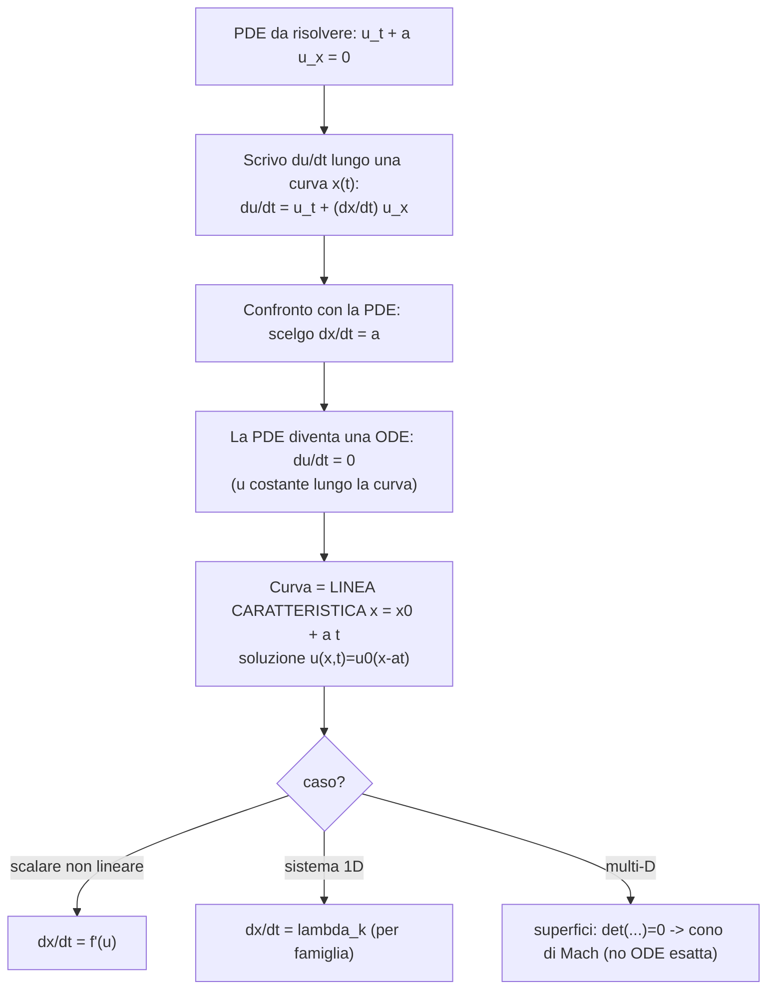
```mermaid
graph TD
    A["PDE da risolvere: u_t + a u_x = 0"] --> B["Scrivo du/dt lungo una curva x(t):<br/>du/dt = u_t + (dx/dt) u_x"]
    B --> C["Confronto con la PDE: scelgo dx/dt = a"]
    C --> D["La PDE diventa una ODE: du/dt = 0<br/>(u costante lungo la curva)"]
    D --> E["Curva = LINEA CARATTERISTICA x = x0 + a t<br/>soluzione u(x,t)=u0(x-at)"]
    E --> F{"caso?"}
    F -->|"scalare non lineare"| G["dx/dt = f'(u)"]
    F -->|"sistema 1D"| H["dx/dt = lambda_k (per famiglia)"]
    F -->|"multi-D"| I["superfici: det(...)=0 -> cono di Mach (no ODE esatta)"]
```

</details>

<details>
<summary><strong>Concetto — cosa significa "derivata materiale con velocità $a$"</strong></summary>

La derivata **materiale** non prende $a$ "come input": è la derivata temporale **vista da un osservatore
che si muove col flusso**. In 1D, $\dfrac{Du}{Dt}=\partial_t u+a\,\partial_x u$. L'equazione scalare
lineare è $\dfrac{Du}{Dt}=0$: seguendo un punto a velocità $a$, la grandezza trasportata non cambia.
$a$ non è arbitrario: è **la** velocità di propagazione che compare nell'equazione.

</details>

<details>
<summary><strong>Concetto — riferimento solidale al segnale (serve un termine $-a\,u_x$?)</strong></summary>

Cambio di variabili **galileiano**: $\xi=x-at,\ \tau=t$. Allora
$\partial_t|_x=\partial_\tau-a\,\partial_\xi$, $\partial_x=\partial_\xi$. Sostituendo:
$(u_\tau-a u_\xi)+a u_\xi=u_\tau=0$. Il termine $-a u_\xi$ **non lo aggiungi a mano**: esce dal cambio di
coordinate e **cancella** il convettivo → nel riferimento mobile il segnale è **fermo** ($u_\tau=0$).
Il riferimento a velocità **costante** $a$ è **ancora inerziale** (nessuna forza apparente: è solo
trasporto, non la 2ª legge di Newton). Fisicamente non cambia nulla: cambia il punto di vista.

</details>

<details>
<summary><strong>Figura — piano spazio–tempo </strong></summary>

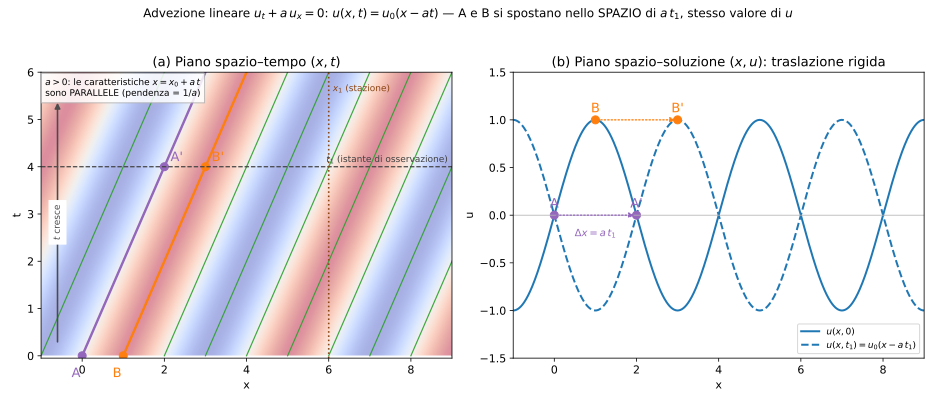

- **** Per $a$ costante le caratteristiche hanno la **stessa pendenza** $1/a$ → sono **parallele**.
- **** Le linee disegnate hanno lunghezza finita solo per comodità: a rigore sono **infinite**.
- **** La **freccia** verticale indica $t$ crescente: si legge dal basso (dato iniziale) verso l'alto.
- **** $t_1,x_1$ **non** sono i limiti del dominio: $t_1$ è un **istante di osservazione** (taglio
  orizzontale), $x_1$ una **stazione**. I limiti veri sono i lati del rettangolo.
- **** A e B sull'asse $t=0$ diventano A′,B′ a $t_1$; nel piano $(x,u)$ hanno lo **stesso valore di
  $u$**, **spostato nello spazio** di $\Delta x=a t_1$. I punti non cambiano valore: si traslano.

</details>

<details>
<summary><strong>Concetto — interpretazione matematica e equazioni di compatibilità</strong></summary>

**Definizione matematica:** *una caratteristica è una curva lungo cui le derivate, pur potendo essere
discontinue, restano "ben definite".* Vediamo **da dove esce la matrice** e cosa rappresenta.

Considero le **due** informazioni che ho su $u$ in un punto, viste come **due equazioni nelle incognite**
$u_t$ e $u_x$ (le derivate parziali):

1. l'**equazione di governo** (la PDE): $\quad 1\cdot u_t + a\cdot u_x = 0$;
2. il **differenziale totale** di $u$ lungo un piccolo spostamento $(dx,dt)$, con variazione $du$:
   $\quad dt\cdot u_t + dx\cdot u_x = du$.

Le metto a sistema; la **matrice dei coefficienti** raccoglie i coefficienti di $u_t$ e $u_x$ nelle due
righe (1ª riga = PDE, 2ª riga = differenziale):

$$
\underbrace{\begin{pmatrix} 1 & a \\ dt & dx \end{pmatrix}}_{\text{coeff. di }(u_t,\,u_x)}
\begin{pmatrix} u_t \\ u_x \end{pmatrix}
=
\begin{pmatrix} 0 \\ du \end{pmatrix}.
$$

**Cosa rappresenta:** "dati la PDE e uno spostamento $(dx,dt)$ con la sua variazione $du$, riesco a
**ricavare entrambe** le derivate $u_t,u_x$?". Con **Cramer** la risposta è **sì e in modo unico**, a meno
che il **determinante** si annulli:

$$\det = 1\cdot dx - a\cdot dt = 0 \;\Longleftrightarrow\; \frac{dx}{dt}=a.$$

Cioè: **solo** quando lo spostamento è **lungo la caratteristica** ($dx/dt=a$) il sistema diventa
**singolare** e le derivate **non** sono più determinate univocamente → **lì possono "saltare"** (essere
discontinue). Questa è la definizione matematica di caratteristica.

**E la compatibilità?** Quando il sistema è singolare, perché abbia comunque soluzione il termine noto deve
essere "compatibile" → lungo la caratteristica si ottiene $du=0$. **$du=0$ NON significa** $u_t=u_x=0$
singolarmente: significa che la **derivata direzionale** di $u$ **lungo** la caratteristica è nulla, cioè
$u$ è **costante** lungo di essa (per i sistemi: $dW_k=0$).

</details>

<details>
<summary><strong>Figura — campi di $\partial u/\partial x$ e $\partial u/\partial t$ (onda periodica)</strong></summary>

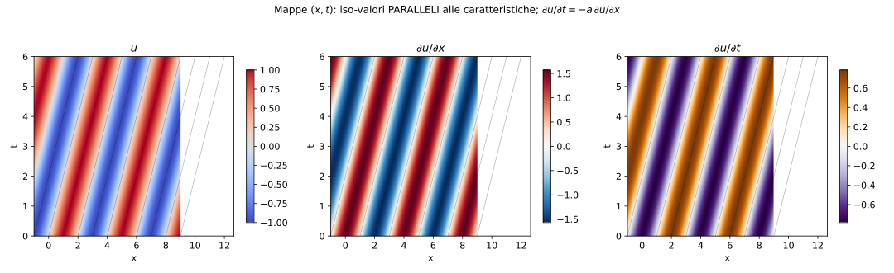

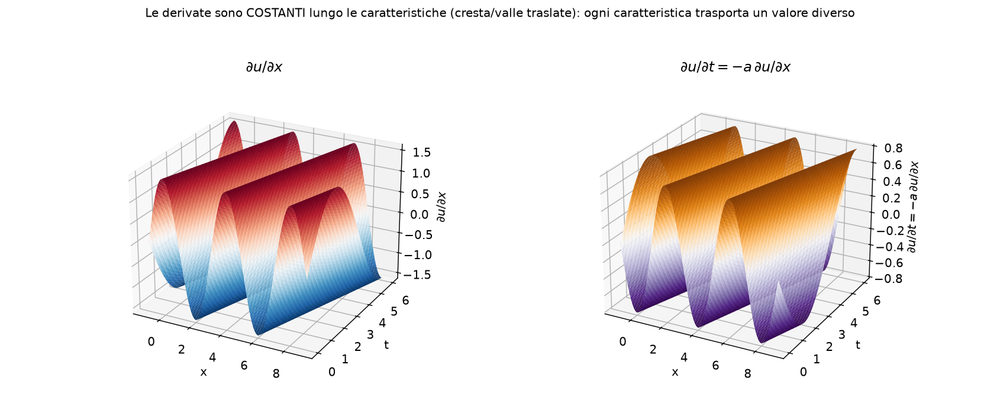

Gli **iso-valori** sono **paralleli alle caratteristiche**: ogni caratteristica porta un valore (costante
lungo di essa, diverso da una all'altra). Vale $\partial_t u=-a\,\partial_x u$. Nel caso **lineare** le
derivate restano finite; la **discontinuità vera** appare quando le caratteristiche **convergono**
(Burgers/urto, §2).

</details>

<details>
<summary><strong>Concetto — condizioni al contorno (caso scalare)</strong></summary>

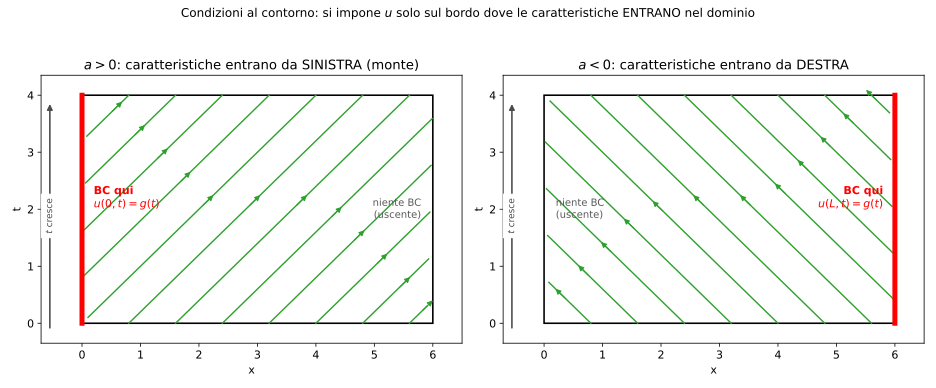

Per conoscere $u$ in un punto $P$ **risalgo** la sua caratteristica all'indietro:
- se torno a $t=0$ **dentro** $[0,L]$ → valore dato dal **dato iniziale** (nessuna BC). In pratica significa
  finire sull'**asse orizzontale** $t=0$: è lì che vive il **dato iniziale**, e quell'asse **non** richiede
  condizioni al contorno (le BC stanno sui **bordi verticali** $x=0$ e $x=L$);
- se esco dal **bordo sinistro** ($x<0$) → valore fissato da quel bordo → **serve BC a sinistra**
  $u(0,t)=g(t)$.

Il bordo **destro** non dà problemi: lì le caratteristiche **escono** (info dall'interno verso l'esterno),
$u$ si ottiene incrociando la caratteristica → **nessuna BC**.
- **** $a>0$ → caratteristiche da sinistra a destra → BC a **sinistra**. $a<0$ → risalgono → BC a
  **destra**. Entrambi i segni hanno senso fisico ($a$ = direzione di propagazione).
- **** Regola generale: *# BC su un bordo = # caratteristiche **entranti***. Per Eulero decide quali
  grandezze (p/u/T) imporre nei vari regimi → §8 e `report_QA.md` (Domande 12–13).

</details>

<details>
<summary><strong>Concetto — perché si chiamano "iperboliche"? (e fuori dal caso iperbolico?)</strong></summary>

La classificazione dipende dal numero di **caratteristiche reali**:

| Tipo | Caratteristiche reali | Propagazione |
|---|---|---|
| **Iperbolica** | due famiglie reali | ondosa, velocità finita |
| Parabolica | una (degenere) | diffusiva |
| Ellittica | nessuna (complesse) | nessuna direzione privilegiata |

Per i sistemi 1° ordine: iperbolico ⟺ $A$ **diagonalizzabile con autovalori reali** ⟺ esistono $n$
famiglie di caratteristiche reali. Le caratteristiche reali **sono** la definizione di iperbolicità. Nel
caso **ellittico** gli autovalori sono complessi → niente caratteristiche reali (dominio di dipendenza
esteso). Quindi non puoi avere caratteristiche reali propagative in un problema genuinamente ellittico.

**Le equazioni paraboliche (in due parole).** Sono il caso **limite/intermedio** ($\Delta=0$): **una sola**
famiglia di caratteristiche reali (degenere). Descrivono i fenomeni **diffusivi**, il cui prototipo è
l'**equazione del calore** $u_t=\nu\,u_{xx}$. Significato fisico: l'informazione si **diffonde** e si
**liscia** (i gradienti si attenuano), con velocità di propagazione *formalmente infinita* (una
perturbazione locale si "sente" subito ovunque, anche se in modo sempre più debole). In CFD la parte
**viscosa/termica** di Navier–Stokes è di tipo parabolico, mentre la parte convettiva (Eulero) è
iperbolica: per questo si trattano con tecniche diverse (e spesso separate).

</details>

## 2. Equazione scalare non lineare (Burgers inviscida)

<details>
<summary><strong>Inquadramento — Burgers</strong></summary>

Si sostituisce $a$ con la **soluzione stessa** $u$ → velocità di propagazione **non costante**:

$$\frac{\partial u}{\partial t}+u\,\frac{\partial u}{\partial x}=0\;\Longleftrightarrow\;
\frac{\partial u}{\partial t}+\frac{\partial}{\partial x}\!\Big(\frac{u^2}{2}\Big)=0.$$

</details>

<details>
<summary><strong>Concetto — perché ora urti ed espansioni? Quali altri fenomeni?</strong></summary>

Velocità d'onda $f'(u)=u$ **dipende dalla soluzione** → caratteristiche con inclinazioni diverse, che
possono **convergere** (urto) o **divergere** (espansione). Altri fenomeni da modello scalare non lineare:
**traffico** (LWR: ingorghi = urti), **shallow water** (bore/risalto idraulico), gasdinamica (compressione
→ urto), trasporto di sedimenti, cromatografia, dinamica delle folle.

</details>

<details>
<summary><strong>Figura — compressione → urto: correlazione $x$–$t$ ↔ $x$–$u$</strong></summary>

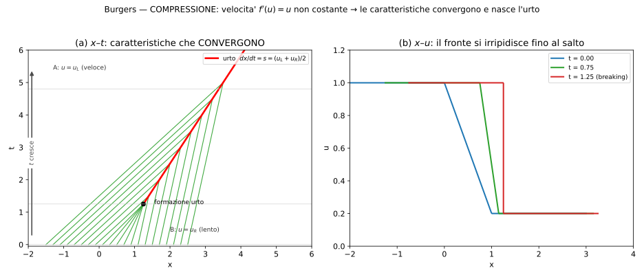

Regione $u=u_A$ (alto) più veloce → caratteristiche più inclinate (verso l'orizzontale); $u=u_B$ (basso)
più lente; le veloci raggiungono le lente → **convergenza**. Nei profili $(x,u)$ il fronte si
**irripidisce** fino al **salto**.

> **Nota (avevi ragione):** nel grafico le caratteristiche **terminano sull'urto** (la linea rossa),
> **non lo attraversano**. L'urto **non** è una caratteristica e **non** trasporta informazione lungo di
> sé come le caratteristiche: è una **discontinuità** governata da **Rankine–Hugoniot**. Le caratteristiche
> ci "entrano" (vengono **assorbite**: portano i due stati monte/valle che si fondono), ma di là dell'urto
> non proseguono — oltre c'è un **unico** stato. (La figura è stata corretta in questo senso.)

**Matematica:** caratteristiche $x=\xi+u_0(\xi)t$; si incrociano a $t_b=-1/\min u_0'>0$ (serve
$u_0'<0$). Oltre $t_b$ la soluzione classica sarebbe **multivalore** → si sostituisce con una
**discontinuità** (urto) a velocità $s$ data da Rankine–Hugoniot + condizione di entropia.
**Fisica:** fino al breaking ogni caratteristica porta la **propria** informazione; quando convergono, le
informazioni **si fondono** in una sola (oltre l'urto un solo stato). Analogo: onde di compressione in gas
caldo che si accumulano in urto; auto che frenano e formano una coda.

</details>

<details>
<summary><strong>Concetto — Rankine–Hugoniot: logica, monte/valle, ruolo, media</strong></summary>

**Logica fisica:** bilancio **integrale** su un volumetto attorno alla discontinuità mobile (velocità
$s$): variazione del conservato = flusso netto → condizione di salto

$$s\,[\![u]\!]=[\![f]\!]\;\Rightarrow\; s=\frac{[\![f]\!]}{[\![u]\!]}=\frac{f(u_B)-f(u_A)}{u_B-u_A}.$$

La velocità del fronte è il **rapporto tra salto di flusso e salto del conservato**. Universale.

**Monte/valle:** rispetto al verso del fronte, lo stato da cui il fronte "avanza ricevendo" è
**monte**, l'altro **valle**. Per caratteristiche convergenti, due famiglie portano $u_A,u_B$: il lato da
cui arriva l'informazione che alimenta il fronte è il monte.

**Che modello è:** RH è del caso scalare **non lineare** (Burgers) ma, essendo proprietà delle leggi
di conservazione, **si estende ai sistemi** (Eulero): non è esclusiva del vettoriale.

**Differenza tra equazioni:** sul lineare $f=au$ darebbe $s=a$ (nessun urto). Su **Burgers**
($f=u^2/2$): $s=\frac{u_B^2/2-u_A^2/2}{u_B-u_A}=\frac{u_A+u_B}{2}$. Applicarla allo scalare lineare è
teoricamente interessante ma non spiega gli urti, quindi non lo trattiamo (servirebbe un altro modello non
visto). RH–Burgers è una **dimostrazione da saper fare** (lista in fondo).

**Attenzione:** $s=(u_A+u_B)/2$ (media) vale **solo per Burgers**; in generale $s$ è un valore
**intermedio**, non la media.

</details>

<details>
<summary><strong>Figura — espansione (rarefazione) in Burgers</strong></summary>

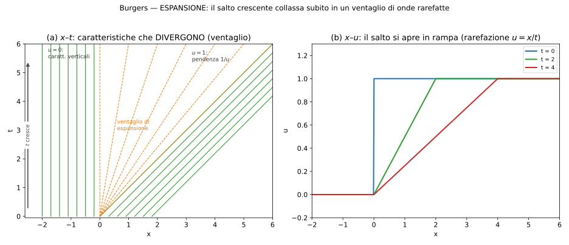

Dato iniziale **crescente** → caratteristiche **divergono**: a sinistra ($u=0$) verticali, a destra
($u=1$) pendenza $1/u$, in mezzo un **ventaglio**. Il salto **collassa subito** in onde rarefatte
(soluzione autosimile $u=x/t$). Nei profili il salto si **apre** (opposto dell'urto). Idem nelle Eulero.

</details>

## 3. Sistema di due equazioni (equazione d'onda)

<details>
<summary><strong>Inquadramento — sistema 1° ordine, iperbolico vs ellittico</strong></summary>

Due equazioni del 1° ordine (eq. delle onde come sistema), notazione $\varepsilon\,\alpha^2$:

$$\begin{cases}\partial_t u-\varepsilon\,\alpha^2\,\partial_x v=0\\[2pt] \partial_t v-\partial_x u=0\end{cases}
\Longrightarrow \partial_t U+A\,\partial_x U=0,\quad U=\begin{pmatrix}u\\ v\end{pmatrix},\
A=\begin{pmatrix}0 & -\varepsilon\alpha^2\\ -1 & 0\end{pmatrix}.$$

$\det(A-\lambda I)=\lambda^2-\varepsilon\alpha^2=0\Rightarrow\lambda=\pm\alpha\sqrt{\varepsilon}$:
$\varepsilon=+1$ reali → **iperbolico**; $\varepsilon=-1$ immaginari → **ellittico**.

</details>

<details>
<summary><strong>Concetto — $u,v$ sono "incognite" ma anche le grandezze conservative</strong></summary>

$u,v$ si chiamano **incognite** (da determinare, $U=(u,v)$) e **sono** le **componenti** del vettore
conservato $U$: ogni riga è una legge di conservazione $\partial_t U_i+\partial_x F_i=0$. Stesso oggetto,
due nomi: *incognita* perché va risolta, *conservativa* perché obbedisce a un bilancio. (Eulero:
$\rho,\rho u,\rho E$.)

</details>

<details>
<summary><strong>Concetto — il coefficiente $\varepsilon\,\alpha^2$ e le soluzioni complesse</strong></summary>

- **Perché due variabili.** Si separa il **segno** $\varepsilon$ (che decide la natura della PDE) dal
  **modulo** $\alpha^2$ (la scala della velocità). $\alpha^2>0$ **sempre** perché è un quadrato (velocità²);
  il segno lo porta $\varepsilon$. Così $\lambda=\pm\alpha\sqrt\varepsilon$ ha $\alpha$ = velocità.
- **Perché $\varepsilon=\pm1$ (non la funzione segno).** È un **parametro di selezione del caso**, non
  una grandezza continua: un generico $\varepsilon>0$ sarebbe riassorbibile in $\alpha$ → conta solo il
  segno. La funzione segno non serve perché $\varepsilon$ non è il segno di una variabile, è una costante
  fissata a priori. Serve **a distinguere iperbolico da ellittico**, e $\pm1$ fa uscire $\lambda=\pm\alpha$.
- **Soluzioni.** $\varepsilon=+1$ → due autovalori reali $\pm\alpha$ = le **due velocità** (due onde,
  destra/sinistra). $\varepsilon=-1$ → $\pm i\alpha$ **complessi** → nessuna velocità reale, nessuna
  caratteristica reale → **ellittico** (info ovunque). Autovalori complessi ⟺ $A$ non diagonalizzabile su
  $\mathbb{R}$.

</details>

<details>
<summary><strong>Concetto — "sistema accoppiato": significato e implicazioni</strong></summary>

- **Logico:** $A$ ha termini **fuori diagonale** non nulli → l'equazione per $u$ contiene $v$ e viceversa:
  vanno trattate **insieme** (più complesso).
- **Conseguenza:** serve la **diagonalizzazione** (§4) per disaccoppiarle.
- **Fisica:** $u,v$ descrivono **un unico fenomeno ondoso**; l'onda scambia tra le due componenti.
  Disaccoppiando, lo stesso fenomeno = **due onde indipendenti** a $\pm\alpha$.

</details>

## 4. Variabili caratteristiche e diagonalizzazione

<details>
<summary><strong>Inquadramento — disaccoppiamento via $L^{-1}$</strong></summary>

Autovettori **sinistri** $\boldsymbol{\ell}_k$ ($\boldsymbol{\ell}_k^{T}A=\lambda_k\boldsymbol{\ell}_k^{T}$),
messi **per righe** in $L^{-1}$; si premoltiplica il sistema per $L^{-1}$ inserendo $I=L\,L^{-1}$:

$$L^{-1}U_t+L^{-1}A(L L^{-1})U_x=0\Rightarrow L^{-1}U_t+\Lambda L^{-1}U_x=0
\xrightarrow{W=L^{-1}U}\frac{\partial W_k}{\partial t}+\lambda_k\frac{\partial W_k}{\partial x}=0.$$

Equazioni di trasporto **indipendenti**; lungo $dx/dt=\lambda_k$ vale $dW_k=0$ (compatibilità).

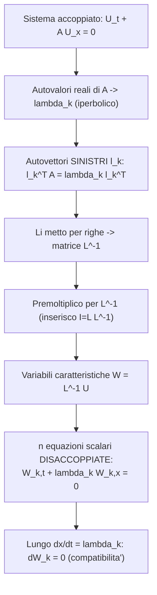
```mermaid
graph TD
    A["Sistema accoppiato: U_t + A U_x = 0"] --> B["Autovalori reali di A -> lambda_k (iperbolico)"]
    B --> C["Autovettori SINISTRI l_k: l_k^T A = lambda_k l_k^T"]
    C --> D["Li metto per righe -> matrice L^-1"]
    D --> E["Premoltiplico per L^-1 (inserisco I=L L^-1)"]
    E --> F["Variabili caratteristiche W = L^-1 U"]
    F --> G["n equazioni scalari DISACCOPPIATE:<br/>W_k,t + lambda_k W_k,x = 0"]
    G --> H["Lungo dx/dt = lambda_k: dW_k = 0 (compatibilita')"]
```

</details>

<details>
<summary><strong>Concetto — com'è fatta $L^{-1}$</strong></summary>

$L^{-1}$ ha per **righe** gli autovettori sinistri:
$L^{-1}=\begin{pmatrix}\boldsymbol{\ell}_1^{T}\\ \boldsymbol{\ell}_2^{T}\end{pmatrix}$. Ogni
$\boldsymbol{\ell}_k=(\ell_{k,1},\ell_{k,2},\dots)$ è **a sua volta un vettore** (riga); impilandoli si
ottiene **per l'appunto una matrice** ($2\times2$, o $3\times3$ per Eulero). Per costruzione $L^{-1}A L=\Lambda$.

</details>

<details>
<summary><strong>Concetto — perché autovettori SINISTRI e non destri</strong></summary>

In $U_t+A\,U_x=0$ la $A$ moltiplica **da sinistra**. Gli autovettori **sinistri** soddisfano
$\boldsymbol{\ell}_k^{T}A=\lambda_k\boldsymbol{\ell}_k^{T}$: premoltiplicando per $\boldsymbol{\ell}_k^{T}$,
$\partial_t(\boldsymbol{\ell}_k^{T}U)+\lambda_k\partial_x(\boldsymbol{\ell}_k^{T}U)=0$ → scalare in
$W_k=\boldsymbol{\ell}_k^{T}U$. Gli autovettori **destri** ($A r_k=\lambda_k r_k$) servono invece a
**ricostruire** $U=\sum_k W_k r_k$. È legato alla **direzione in cui agisce $A$**; ogni
$\boldsymbol{\ell}_k$ è poi associato a $\lambda_k$ (e alla sua direzione di propagazione).

</details>

<details>
<summary><strong>Concetto — far comparire $I=LL^{-1}$ ("come moltiplicare per 1")</strong></summary>

$A=A\cdot I=A\,(LL^{-1})$: inserire $I$ **non cambia nulla**, come moltiplicare per $1$ nello scalare. Ma
il prodotto matriciale **non è commutativo** → conta **dove** lo metti; lo si mette nel punto comodo:
$L^{-1}A\,U_x=\underbrace{(L^{-1}AL)}_{\Lambda}\underbrace{(L^{-1}U_x)}_{\partial_x W}$.

</details>

<details>
<summary><strong>Concetto — perché $\Lambda$ è diagonale</strong></summary>

$\Lambda=L^{-1}AL$ è diagonale **per costruzione**: mettendo gli autovettori (destri) per colonne in $L$,
l'operazione $L^{-1}AL$ porta $A$ **nella base dei suoi autovettori**, dove agisce come **riscalamento**
lungo ogni asse → sulla diagonale gli autovalori, zero altrove. È la definizione di **diagonalizzabile**.

</details>

<details>
<summary><strong>Concetto — perché si possono introdurre le variabili caratteristiche, e a che serve</strong></summary>

Si può portare $L^{-1}$ dentro/fuori dalle derivate **solo perché $L^{-1},A$ non dipendono da $x,t$**
(coefficienti **costanti**). Se $A=A(U)$ (non lineare) o $A(x,t)$ comparirebbero termini extra. **Vantaggio:**
da sistema accoppiato a $n$ scalari **indipendenti** $\partial_t W_k+\lambda_k\partial_x W_k=0$, ognuno
risolubile col metodo delle caratteristiche. In breve: **problema vettoriale difficile → tanti scalari facili**.

</details>

<details>
<summary><strong>Concetto — "equazioni indipendenti": significato fisico</strong></summary>

Indipendenza **matematica** ⟺ indipendenza **fisica** dei segnali: ogni $W_k$ è un'**onda che viaggia per
conto suo** a velocità $\lambda_k$, senza scambiare informazione con le altre (disaccoppiate). La procedura
**serviva proprio a questo**, ma centra anche: (1) dimostrare l'**iperbolicità**; (2) ottenere le
**compatibilità** $dW_k=0$; (3) produrre gli **invarianti di Riemann** (Eulero) costanti lungo le
caratteristiche, utili per problemi e BC.

</details>

## 5. Equazioni di Eulero 1D non stazionarie

<details>
<summary><strong>Inquadramento — il sistema di Eulero</strong></summary>

Forma differenziale conservativa (vedi `bilancio.md`):

$$\frac{\partial}{\partial t}\begin{pmatrix}\rho\\ \rho u\\ \rho E\end{pmatrix}
+\frac{\partial}{\partial x}\begin{pmatrix}\rho u\\ p+\rho u^2\\ u(p+\rho E)\end{pmatrix}=0.$$

Centrali perché la parte **convettiva** dei problemi 3D compressibili si riconduce a Eulero, e molte
tecniche riducono il problema a 1D nella direzione **normale** all'interfaccia.

</details>

<details>
<summary><strong>Concetto — variabili primitive vs conservative (teoria + codice)</strong></summary>

Stesso sistema, due **scelte di incognite**:
- **Conservative** $U=(\rho,\rho u,\rho E)$: forma di **divergenza** $\partial_t U+\partial_x F=0$. È la
  forma "robusta": garantisce le **velocità d'urto corrette** (Rankine–Hugoniot), perché il salto è
  consistente col bilancio integrale.
- **Primitive** $V=(\rho,u,p)$ (o $(a,u,S)$): forma quasi-lineare $\partial_t V+A'\partial_x V=0$. Più
  **intuitive** e comode per diagonalizzare/leggere lo stato e imporre le BC, **ma** in forma non
  conservativa darebbero urti a velocità sbagliata.

La fisica (autovalori $u,u\pm a$) è identica: cambia solo la base. **Regola:** il *bilancio* si scrive in
conservative; le primitive servono per analisi/BC.

**Codice/Esercitazioni:** in `Euler2D` lo stato **evoluto** è conservative (`ucons` = $\rho E,\rho,\rho
u,\rho v$); le primitive ($u,v,a,P,T,S$) sono **ricavate localmente** per flussi e BC. È la scelta giusta
per un solutore a volumi finiti con urti. (Commento aggiunto in `strutture.f90` e in `Latex/Codice_CFD.tex`.)

</details>

<details>
<summary><strong>Approfondimento — come si ricava $A'$ (variabili primitive). DIMOSTRAZIONE</strong></summary>

*(Approfondimento, utile per capire come funziona la diagonalizzazione.)* Partendo dalla forma
conservativa e passando alle primitive $V=(\rho,u,p)$ con la chain rule:

- **massa:** $\rho_t+(\rho u)_x=0\Rightarrow \rho_t+u\rho_x+\rho u_x=0$;
- **q. di moto:** $(\rho u)_t+(\rho u^2+p)_x=0$, usando la massa $\Rightarrow u_t+u u_x+\tfrac1\rho p_x=0$;
- **energia → pressione** (gas ideale, $a^2=\gamma p/\rho$): $p_t+u p_x+\rho a^2 u_x=0$.

In forma matriciale $\partial_t V+A'\partial_x V=0$ con

$$A'=\begin{pmatrix} u & \rho & 0\\[2pt] 0 & u & 1/\rho\\[2pt] 0 & \rho a^2 & u \end{pmatrix},\qquad
\det(A'-\lambda I)=(u-\lambda)\big[(u-\lambda)^2-a^2\big]=0\Rightarrow \lambda=u,\ u\pm a.$$

(Il capitolo usa la base $(a,u,S)$: stessi autovalori, ma le variabili caratteristiche risultano
**direttamente** gli invarianti di Riemann $a/\phi\pm u$ e l'entropia — comodo per il pistone/BC.)

</details>

<details>
<summary><strong>Concetto — $A'$ non è simmetrica: ha un significato?</strong></summary>

Sì, ma non è un problema. $A'$ **non è simmetrica** (es. $A'_{12}=\rho\neq A'_{21}=0$) perché è scritta in
variabili **non conservative/non "entropiche"**. Conseguenze:
- gli **autovettori destri e sinistri sono diversi** (non l'uno il trasposto dell'altro) → servono
  entrambi (sinistri per proiettare in $W$, destri per ricostruire $U$);
- gli autovettori **non sono ortogonali**.

Per l'**iperbolicità** la simmetria **non serve**: bastano autovalori **reali**+ insieme **completo** di
autovettori (qui garantito da autovalori reali distinti). Esiste comunque una scelta di variabili
(variabili di **entropia** /Roe) che **simmetrizza** Eulero: comoda in teoria (stime di energia), ma non
necessaria. Quindi la non-simmetria è una proprietà della **base scelta**, non un ostacolo fisico.

</details>

<details>
<summary><strong>Concetto — "reali e distinti ⇒ iperbolico": basta? E il significato fisico</strong></summary>

**Matematica:** per la **classificazione** non servono i *valori*, basta che gli autovalori siano **reali**
e che ci sia un **insieme completo di autovettori**. Autovalori **reali e distinti** garantiscono
automaticamente la diagonalizzabilità → **iperbolicità stretta**. Quindi per dire "è iperbolico" basta
real+distinti; i *valori* in sé non servono alla classificazione.

**Ma i valori contano per la fisica:** sono le **velocità d'onda**, e i loro **segni** decidono BC e regime
(sub/supersonico). **Autovalori diversi = velocità di propagazione diverse**: tre onde distinte (due
acustiche $u\pm a$, una entropica/di contatto $u$) che **si separano** nel tempo → è il ventaglio del
problema di Riemann.

</details>

<details>
<summary><strong>Concetto — e se gli autovalori coincidessero?</strong></summary>

Dipende dagli **autovettori**:
- se l'autovalore ripetuto ha ancora **abbastanza autovettori indipendenti** (matrice diagonalizzabile) →
  il sistema è ancora iperbolico, ma **non strettamente** (iperbolicità "non stretta");
- se è **difettivo** (blocco di Jordan, autovettori insufficienti) → solo **debolmente iperbolico**: il
  problema ai valori iniziali può essere **mal posto**.

**Fisica:** autovalori coincidenti = due onde alla **stessa velocità** (degenerazione).
**È possibile?** In Eulero **1D** le tre velocità $u,u\pm a$ coincidono solo se $a\to0$ (gas senza
pressione/suono: caso degenere, *pressureless Euler*, con "delta-shock"). In **2D/3D** invece l'autovalore
$u$ ha **molteplicità** $>1$ (onde di entropia e di vorticità viaggiano entrambe a $u$): caso reale e ben
posto perché resta diagonalizzabile (non strettamente iperbolico).

</details>

<details>
<summary><strong>Concetto — perché è iperbolico ANCHE in subsonico (non solo supersonico)</strong></summary>

Il punto chiave è **stazionario vs non stazionario**.
- Le equazioni di Eulero **stazionarie** (o l'eq. del potenziale) sono di **tipo misto** rispetto allo
  **spazio**: ellittiche in subsonico, iperboliche in supersonico (è da lì che nasce l'aspettativa
  "iperbolico solo supersonico"). Vedi `bilancio.md` (discriminante).
- Le equazioni **non stazionarie** in $(x,t)$ sono **sempre iperboliche**, perché gli autovalori
  $u,u\pm a$ sono **reali per qualunque Mach** ($a>0$ sempre). Il tempo è la direzione "timelike".

Quindi nel subsonico cambia **solo il segno** di $\lambda_1=u-a$ (la caratteristica risale invece di
scendere), non il fatto che sia reale. Il regime sub/supersonico determina **quante** caratteristiche
entrano (→ BC), **non** la natura iperbolica. Il tuo ragionamento confondeva il caso **stazionario** (misto)
con quello **non stazionario** (sempre iperbolico).

</details>

<details>
<summary><strong>Figura — dominio di dipendenza/influenza (sub/super) e la "linea che va indietro nel tempo"</strong></summary>

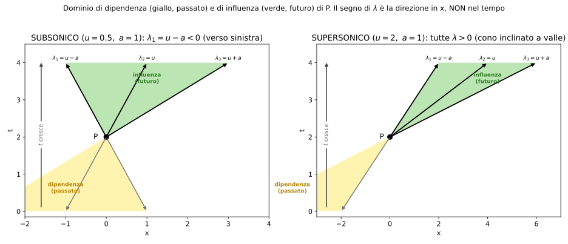

Da $P$ passano **tre** caratteristiche. Il **dominio di dipendenza** (giallo, verso il **passato**) è
delimitato dalle due caratteristiche estreme tracciate **all'indietro**; il **dominio di influenza**
(verde, **futuro**) da quelle in avanti. Subsonico: $\lambda_1=u-a<0$ pende a sinistra. Supersonico:
tutte $\lambda>0$ → il cono si **inclina a valle**.

**"Va indietro nel tempo"?** No: **nessuna caratteristica torna indietro nel tempo**. Ogni
caratteristica è una **retta intera** che passa per $P$ sia nel futuro sia nel passato; per il dominio di
**dipendenza** la si percorre **all'indietro** ($t<t_P$) fino a dove il dato è noto. Il segno di
$\lambda_1<0$ indica solo la **direzione spaziale** (verso sinistra, in $x$), **non** una direzione
temporale. "Influenza il passato" è una lettura sbagliata: il tempo va sempre avanti; $P$ **dipende** dal
passato lungo $\lambda_1$, non lo **influenza**. (L'annotazione "PASSATO/FUTURO" si riferisce a quale metà
della caratteristica — passata o futura — entra nel rispettivo cono.)

</details>

<details>
<summary><strong>Approfondimento — urto curvo staccato: zone sub+supersoniche insieme</strong></summary>

Davanti a un corpo tozzo c'è un **urto curvo staccato**: dietro di esso una **tasca subsonica**, altrove
**supersonico**. Nel problema **stazionario** servirebbero metodi **ellittici** (tasca subsonica) e
**iperbolici** (zone supersoniche) **insieme** → scomodo.

**Cosa si fa:** si passa al problema **non stazionario** e si **marcia nel tempo** fino allo stato
stazionario (*time-marching*). Come visto in ****, le Eulero **non stazionarie in $(x,t)$ sono
iperboliche ovunque**(autovalori $u,u\pm a$ reali per qualunque Mach). Quindi:
1. aggiungo $\partial_t U$ → il sistema diventa **globalmente iperbolico**;
2. uso **un solo** schema esplicito (time-marching) su tutto il dominio, sub e supersonico;
3. a convergenza ($\partial_t U\to0$) recupero la soluzione stazionaria mista.

Non è un'incongruenza logica: il tipo (ellittico/iperbolico) dipende dall'**operatore** e dalle **variabili
indipendenti**; cambiando da $(x)$ stazionario a $(x,t)$ non stazionario, l'operatore cambia e diventa
iperbolico. Si "scioglie" il problema misto in uno **interamente trattabile** con metodi iperbolici.

> Nota: se i tuoi appunti dicono "totalmente **ellittico** ", è probabilmente un lapsus o si riferisce alla
> **tasca subsonica stazionaria**; la riformulazione **non stazionaria** in $(x,t)$ è **iperbolica**
> ovunque — ed è proprio questo che risolve il problema. Se la lezione intendeva un'altra cosa, mandami la
> frase esatta e riallineo.

</details>

<details>
<summary><strong>Approfondimento — logica del calcolo degli autovettori (e perché ora sì)</strong></summary>

**Cosa stiamo facendo:** calcoliamo gli **autovettori sinistri** di $A'$ per costruire $L^{-1}$ e quindi le
**variabili caratteristiche** $W=L^{-1}V$, cioè le combinazioni di $da,du,dS$ **conservate lungo ciascuna
caratteristica**(le equazioni di compatibilità).

**Con che obiettivo:** non solo provare l'iperbolicità (quella basta da real+distinti), ma ottenere le
**relazioni concrete** — gli **invarianti di Riemann** $a/\phi\pm u$ e l'entropia — che servono a
**risolvere** problemi reali (pistone, condizioni al contorno).

**Perché non prima:** nei casi scalari (§1–2) c'è **una sola** equazione, niente da disaccoppiare; nel
sistema 2×2 (§3) bastava mostrare la **diagonalizzabilità** (esistenza degli autovalori reali). Per
**Eulero** invece servono le combinazioni **esplicite** trasportate lungo $u,u\pm a$ → si devono calcolare
gli autovettori.

> Nota d'esame: la **derivazione completa** per diagonalizzare Eulero (autovettori sinistri,
> variabili caratteristiche, invarianti) **non risulta mai chiesta** tra le domande d'esame realmente
> proposte (vedi `Exam/Domande_Esame_SP.md` §2: si chiedono Burgers, pistone, Sod, condizioni al
> contorno — non la diagonalizzazione). Quindi questo passaggio è **skippabile** in fase di ripasso.

</details>

<details>
<summary><strong>Concetto — autovalori $u-a,\ u,\ u+a$: significato fisico</strong></summary>

In variabili $(a,u,S)$, $\det(A'-\lambda I)=0\Rightarrow(\lambda-u)(\lambda-u-a)(\lambda-u+a)=0$. Fisica:
- $\lambda_2=u$: **trasporto delle particelle** (entropia/contatto);
- $\lambda_{1,3}=u\mp a$: onde **acustiche** indietro/avanti. Se $u=0$ → $\pm a$ (acustica in mezzo statico);
  se il fluido si muove, le onde combinano $u$ e $a$.

</details>

<details>
<summary><strong>Concetto/Dimostrazione — variabili caratteristiche di Eulero e omoentropico</strong></summary>

Risolvendo $\boldsymbol{\ell}^i A'=\lambda_i\boldsymbol{\ell}^i$ si ottengono i differenziali delle
variabili caratteristiche $dW=L^{-1}dV$:

$$dW_1=\frac{da}{\phi}-du-\frac{a}{\gamma R}\,dS,\quad dW_2=dS,\quad dW_3=\frac{da}{\phi}+du-\frac{a}{\gamma R}\,dS,
\qquad \phi=\frac{\gamma-1}{2}.$$

Le **compatibilità** sono $dW_i=0$ lungo $\lambda_i$. La seconda ($dS=0$ lungo $\lambda_2=u$) è il
**trasporto dell'entropia** $DS/Dt=0$. Nel caso **omoentropico** ($S$ uniforme) la prima/terza danno gli
**invarianti di Riemann**

$$J^{\pm}=\frac{a}{\phi}\pm u=u\pm\frac{2a}{\gamma-1}=\text{cost lungo }\lambda_{3,1}=u\pm a.$$

</details>

<details>
<summary><strong>Concetto — che tipi di onde sono, e quanti tipi esistono</strong></summary>

Le tre famiglie di Eulero **non sono tre copie della stessa onda**, sono **fenomeni diversi**:
- $\lambda_{1,3}=u\mp a$ → **onde acustiche** (pressione/suono): campi *genuinamente non lineari* → possono
  diventare **urti** o **ventagli di rarefazione**;
- $\lambda_2=u$ → **onda di entropia / contatto**: campo *linearmente degenere* → trasporta un salto di
  densità/entropia a **pressione e velocità costanti** (non si irripidisce).

**Autovalori coincidenti ≠ due onde identiche.** Possono essere onde **fisicamente diverse** che
viaggiano alla **stessa** velocità: in 2D/3D, ad esempio, l'autovalore $u$ ha molteplicità perché vi
"convivono" l'onda di **entropia** e quella di **vorticità/taglio**, distinte ma entrambe trasportate a
$u$. La tua intuizione è corretta solo per onde **dello stesso tipo**: due onde identiche alla stessa
velocità si **sovrappongono** (somma lineare) in una sola più intensa; la degenerazione nei *sistemi* è
invece l'esistenza di **autodirezioni distinte** con lo stesso autovalore (modi diversi, stessa velocità).

**Tipi di onde (in generale, per i fluidi):** acustiche (compressione/espansione, $u\pm a$), entropiche
(contatto, $u$), vorticità/taglio ($u$, in 2D/3D). In magnetofluidodinamica se ne aggiungono altre
(Alfvén, magnetosoniche). Per Eulero 1D le famiglie sono **3**.

</details>

<details>
<summary><strong>Concetto — tabella iperbolico/ellittico e caratteristiche entranti (sub vs super)</strong></summary>

| Regime | Eq. **stazionarie** (vs $x$) | Eq. **non stazionarie** $(x,t)$ | Segni di $\lambda$ | Caratt. che **entrano** a un ingresso |
|---|---|---|---|---|
| **Subsonico** $M<1$ | **ellittico** (tipo misto) | **iperbolico** | $\lambda_1=u-a<0;\ \lambda_2=u>0;\ \lambda_3=u+a>0$ | **2** entrano ($\lambda_2,\lambda_3$), 1 risale dall'interno ($\lambda_1$) → **2 BC** |
| **Supersonico** $M>1$ | **iperbolico** | **iperbolico** | tutti $>0$ | **3** entrano → **3 BC** |

Nel **non stazionario** è **sempre iperbolico**: il regime cambia solo i **segni** (quindi quante
caratteristiche entrano), non la natura. La "natura mista" (ellittico in subsonico) appartiene al problema
**stazionario**. In subsonico $\lambda_1=u-a<0$ **non esce dal tempo**: rientra dall'**interno** del
dominio (è l'informazione che risale la corrente).

</details>

<details>
<summary><strong>Concetto — come leggere i coni: avanti nel tempo, "indietro" nello spazio</strong></summary>

Nelle figure i coni ora hanno **frecce**: nere = direzione di lettura verso il **futuro** (alto), grigie =
verso il **passato** (basso). Il punto chiave: **il tempo va sempre avanti**. $\lambda_1=u-a<0$ significa
che quella **onda si propaga indietro nello spazio** (verso $x$ minori = **monte**), pur avanzando nel
tempo. Quindi $P$ **dipende da** ciò che sta a monte/valle lungo le sue caratteristiche e **influenza**
monte tramite $\lambda_1$: in subsonico un'onda acustica **risale la corrente** (per questo serve una BC al
contorno di valle). Non c'è nessun viaggio nel passato: solo propagazione **spaziale** verso sinistra.

</details>

<details>
<summary><strong>Approfondimento — perché passare al non stazionario conviene (e quanto costa)</strong></summary>

Sì: anche se un problema **stazionario** è in genere più economico, davanti a un campo **misto**
(sub+supersonico, es. urto staccato) conviene rendere tutto **non stazionario** e **marciare nel tempo**.
Vantaggio: si evita di **dividere il dominio** e accoppiare un solutore ellittico (zone subsoniche) con uno
iperbolico (zone supersoniche) — operazione complessa e fragile. Con il time-marching si usa **un solo**
schema iperbolico ovunque.

**Costo:** sì, c'è un sovrapprezzo: si aggiunge la **dimensione tempo** e si **itera** (in tempo fisico o
*pseudo-tempo*) fino a $\partial_t U\to0$ → molte iterazioni per arrivare alla soluzione stazionaria. Si
paga **robustezza e semplicità** con più iterazioni. È il motivo per cui in CFD compressibile il
time-marching / *pseudo-transient continuation* è lo standard.

</details>

<details>
<summary><strong>Concetto — tabella: variabili conservative vs primitive vs caratteristiche</strong></summary>

| Tipo | Variabili (Eulero 1D) | Forma | Pro / a cosa servono |
|---|---|---|---|
| **Conservative** | $U=(\rho,\ \rho u,\ \rho E)$ | divergenza $\partial_t U+\partial_x F=0$ | **urti corretti** (Rankine–Hugoniot); è ciò che si **evolve** numericamente |
| **Primitive** | $V=(\rho,u,p)$ o $(a,u,S)$ | quasi-lineare $\partial_t V+A'\partial_x V=0$ | **intuitive**; comode per leggere lo stato, **imporre le BC**, diagonalizzare |
| **Caratteristiche** | $W=L^{-1}V$ | disaccoppiata $\partial_t W_k+\lambda_k\partial_x W_k=0$ | ogni $W_k$ **costante lungo $\lambda_k$**; **invarianti di Riemann**, BC non riflettenti, analisi delle onde |

Stessa fisica, tre "lenti": si **evolve** in conservative, si **analizza/impone** in primitive, si
**capisce la propagazione** in caratteristiche.

</details>

<details>
<summary><strong>Concetto — perché le compatibilità chiedono che $W_k$ non vari</strong></summary>

Non è un'ipotesi aggiuntiva: è **ciò che dice l'equazione** una volta diagonalizzata. Lungo la
caratteristica $dx/dt=\lambda_k$ la PDE $\partial_t W_k+\lambda_k\partial_x W_k=0$ diventa la **ODE**
$\dfrac{dW_k}{dt}=0$. Quindi $W_k$ è proprio la combinazione **compatibile** con la propagazione lungo
quella curva: l'equazione **permette** che sopravviva solo se resta **costante**. "Equazione di
compatibilità" = la relazione che deve valere **lungo** la caratteristica perché la soluzione sia coerente.

</details>

<details>
<summary><strong>Concetto — tabella dei 3 invarianti</strong></summary>

| Famiglia | $\lambda$ | Variabile/invariante | Significato |
|---|---|---|---|
| 1 | $u-a$ | $J^{-}=u-\dfrac{2a}{\gamma-1}$ (omoentropico) | onda **acustica all'indietro** |
| 2 | $u$ | $S$ (entropia) | **trasporto** entropia / superficie di **contatto** |
| 3 | $u+a$ | $J^{+}=u+\dfrac{2a}{\gamma-1}$ (omoentropico) | onda **acustica in avanti** |

Tre invarianti ($J^{+},\,J^{-},\,S$), uno per famiglia: noti due acustici da lati opposti si ricavano $u$ e
$a$ in un punto; $S$ chiude la termodinamica.

</details>

<details>
<summary><strong>Concetto — gli invarianti di Riemann valgono solo nell'omoentropico?</strong></summary>

Le **equazioni di compatibilità** $dW_i=0$ lungo $\lambda_i$ valgono **sempre**. Ma diventano gli
**invarianti di Riemann semplici** $J^{\pm}=u\pm 2a/(\gamma-1)$ solo se l'**entropia è uniforme**
(omoentropico): allora le relazioni acustiche si **disaccoppiano** dall'entropia e sono integrabili in una
funzione costante lungo la caratteristica. Nel caso **non omoentropico** le relazioni acustiche contengono
anche $dS$ (compaiono i *Generalized Riemann Invariants*): restano valide in forma **differenziale** ma
**non** sono più i semplici $J^{\pm}$. In pratica: attraverso un **urto** l'entropia salta → di là si
ridefiniscono $J^{\pm}$ con la nuova entropia.

</details>

## 6. Metodo delle caratteristiche: il pistone

<details>
<summary><strong>Figura — pistone accelerato e invarianti di Riemann</strong></summary>

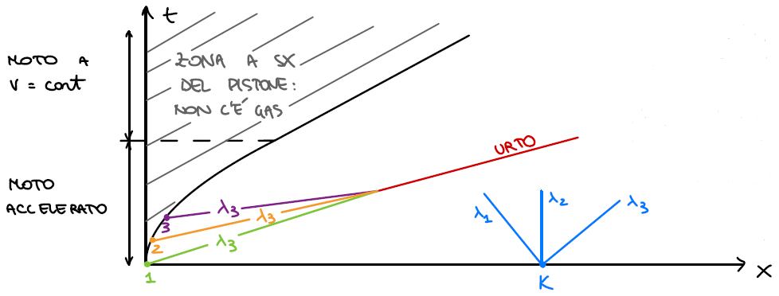
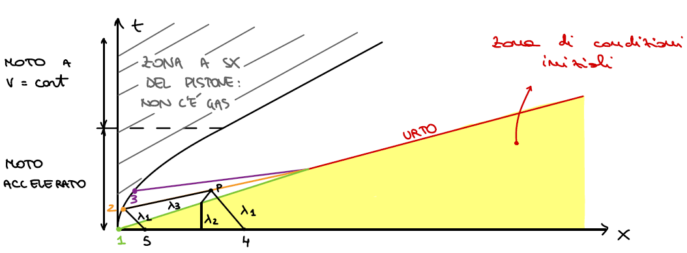

Pistone fermo che accelera: traiettoria $(x,t)$ inizialmente verticale ($u=0$) poi inclinata. Genera
perturbazioni lungo $\lambda_3=u+a$; accelerando, onde successive **più veloci** comprimono il gas (verso
un urto). Per lo stato in $P$ servono **3** grandezze (2 termodinamiche + 1 cinematica) → 3 compatibilità.
Nel caso omoentropico, con $W_1$ (lungo $\lambda_1$, collega $P$ a un punto del dato iniziale) e $W_3$
(lungo $\lambda_3$, collega $P$ al pistone), più $S$ lungo $\lambda_2$, si chiude il sistema:
$W_1(P)=W_1(B)$, $W_3(P)=W_3(A)$.

</details>

<details>
<summary><strong>Concetto — Rankine–Hugoniot per Eulero: perché il flusso $\rho u$? E le altre</strong></summary>

**Si parte SEMPRE dalla formula generale** (vale per qualunque legge di conservazione): la velocità
dell'urto è il **rapporto tra il salto del flusso e il salto della grandezza conservata**

$$s=\frac{[\![F]\!]}{[\![U]\!]}.$$

Poi si **specializza** scegliendo *quale* equazione di Eulero (massa, q. di moto, energia): ognuna ha la
sua coppia $(U,F)$, quindi la stessa formula generale **si dirama**:

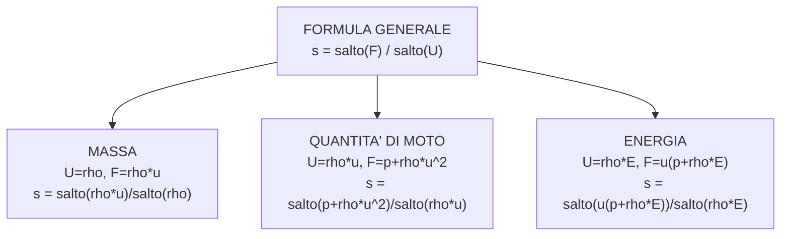
```mermaid
graph TD
    G["FORMULA GENERALE<br/>s = salto(F) / salto(U)"] --> M["MASSA<br/>U=rho, F=rho*u<br/>s = salto(rho*u)/salto(rho)"]
    G --> Q["QUANTITA' DI MOTO<br/>U=rho*u, F=p+rho*u^2<br/>s = salto(p+rho*u^2)/salto(rho*u)"]
    G --> E["ENERGIA<br/>U=rho*E, F=u(p+rho*E)<br/>s = salto(u(p+rho*E))/salto(rho*E)"]
```

| Equazione | Conservato $U$ | Flusso $F$ | Salto RH |
|---|---|---|---|
| Massa | $\rho$ | $\rho u$ | $s\,[\![\rho]\!]=[\![\rho u]\!]$ |
| Q. di moto | $\rho u$ | $p+\rho u^2$ | $s\,[\![\rho u]\!]=[\![p+\rho u^2]\!]$ |
| Energia | $\rho E$ | $u(p+\rho E)$ | $s\,[\![\rho E]\!]=[\![u(p+\rho E)]\!]$ |

**Perché negli appunti compare $\rho u$?** Perché l'esempio parte dalla **massa** (la più semplice): lì il
conservato è $\rho$ e il flusso è $\rho u$. **Non** è speciale. Le tre condizioni **insieme** legano gli
stati monte/valle (relazioni di Hugoniot): $s$ è **unico** (lo stesso urto), quindi i tre rapporti
**devono coincidere** — è proprio questo che chiude lo stato dietro l'urto.

</details>

<details>
<summary><strong>Concetto — le due figure del pistone danno informazioni diverse</strong></summary>

Sì, sono complementari:
- **1ª figura** (setup generale): traiettoria del pistone, onde $\lambda_3$ **emesse nel gas**, formazione
  dell'**urto** (rosso) dove convergono, e un **punto generico $K$** (a destra) con le sue **tre** famiglie
  $\lambda_1,\lambda_2,\lambda_3$ → mostra che *ogni* punto del gas ha 3 caratteristiche.
- **2ª figura** (costruzione operativa): **come si calcola** lo stato in un punto $P$ vicino al pistone,
  collegandolo con $\lambda_1,\lambda_3$ a punti **noti** (4, 5) e alla **zona gialla** delle condizioni
  iniziali.

Una è "qualitativa" (cosa succede), l'altra "quantitativa" (come si risolve).

</details>

<details>
<summary><strong>Concetto — la legge di moto del pistone (linea nera) e perché questa</strong></summary>

La **linea nera continua** è la **traiettoria del pistone** nel piano $(x,t)$. Attenzione alla
convenzione: qui **$t$ è in ordinata e $x$ in ascissa**, quindi la **pendenza** della linea è
$\dfrac{dt}{dx}=\dfrac{1}{v}$, cioè l'**inverso** della velocità (non la velocità!). Di conseguenza:
- tratto **verticale** in basso → pendenza infinita → pistone **fermo** ($v=0$);
- tratto **curvo** → la linea si **inclina** progressivamente verso l'asse $x$ (pendenza che **diminuisce**)
  → **velocità crescente**= **moto accelerato**;
- tratto **rettilineo inclinato** → pendenza costante → **velocità costante**.

Regola da tenere a mente in **tutto** il capitolo: **più una caratteristica è verticale, più è lenta**;
più è inclinata verso l'orizzontale, più è veloce ($v=1/\text{pendenza}$).

**Perché questa legge?** Soprattutto per **semplicità** didattica, ma è anche **fisicamente
rappresentativa**: un pistone che parte da fermo, accelera e poi va a regime. La **fase accelerata** è
ciò che genera onde di compressione via via più veloci → **urto**. **Applicazioni:** tubi d'urto
(*shock tube*), fase di compressione nei motori, transitori di valvole, avviamento di prese d'aria.

</details>

<details>
<summary><strong>Concetto — pistone al punto morto e a tenuta stagna</strong></summary>

Si immagina il pistone che parte dal **punto morto** (estremità chiusa del tubo): solo così ha senso dire
che **a sinistra del pistone non c'è gas** (vuoto). Inoltre si assume **tenuta stagna**: nessuna
infiltrazione d'aria oltre il pistone. Il gas è tutto **a destra** e viene **compresso** man mano che il
pistone avanza.

</details>

<details>
<summary><strong>Concetto — moto accelerato ⇒ pendenze diverse ⇒ urto (come Burgers)</strong></summary>

Nella fase **accelerata** il pistone emette onde $\lambda_3=u+a$ a velocità **crescente** (il gas dietro è
sempre più veloce e caldo). Caratteristiche con **inclinazioni diverse** → **convergono** → **urto**. È lo
stesso meccanismo di **Burgers** (caratteristiche non parallele che collidono), solo che qui la velocità
caratteristica è $u+a$ (acustica) invece di $u$.

</details>

<details>
<summary><strong>Concetto — logica fondamentale: invarianti dove è liscio, RH attraverso l'urto, poi di nuovo invarianti</strong></summary>

È **la** logica chiave del metodo delle caratteristiche con urti:

- **dove il campo è liscio** (regolare, isentropico) → si usano gli **invarianti di Riemann** $J^{\pm}$ per
  trasportare lo stato lungo le caratteristiche;
- **attraverso l'urto** l'**entropia salta** (l'urto **genera** entropia) → di là il gas non è più
  omoentropico con monte: **non** si possono trasportare $J^{\pm}$ attraverso l'urto. Si usa
  **Rankine–Hugoniot** per fare il **salto**;
- **dopo l'urto**, nella nuova regione (con la sua entropia), si riprende con gli **invarianti** $J^{\pm}$.

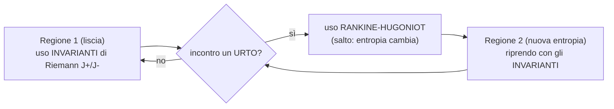
```mermaid
graph LR
    R1["Regione 1 (liscia)<br/>uso INVARIANTI di Riemann J+/J-"] --> SH{"incontro un URTO?"}
    SH -->|"sì"| RH["uso RANKINE-HUGONIOT<br/>(salto: entropia cambia)"]
    SH -->|"no"| R1
    RH --> R2["Regione 2 (nuova entropia)<br/>riprendo con gli INVARIANTI"]
    R2 --> SH
```

Schema visivo semplificato (chi si usa e dove):

```
x ──────────────────────────────────────────►
  [ liscio: J+ , J- ]  ‖URTO‖  [ liscio: J+ , J- ]
                         ▲
                   qui: Rankine–Hugoniot
```

(Stessa logica nel **problema di Riemann/Sod**: invarianti nel ventaglio di espansione, RH attraverso
l'urto, e il **contatto** separa due regioni lisce con entropie diverse.)

</details>

<details>
<summary><strong>Concetto — perché un punto $K$ "arbitrario"</strong></summary>

È una scelta **fisica di generalità**, non solo grafica: si prende un punto **qualunque** del gas per far
vedere che **in ogni** punto passano **tre** caratteristiche. La posizione (a destra, dove le linee non si
sovrappongono) è scelta per **leggibilità**, ma il messaggio vale per tutti i punti.

</details>

<details>
<summary><strong>Concetto — perché dal pistone partono solo $\lambda_3$ (e il "vuoto" non propaga suono)</strong></summary>

Dalla **faccia del pistone** le onde che entrano **nel gas** sono quelle **acustiche in avanti**
$\lambda_3=u+a$: il pistone spinge → manda una compressione che corre **in avanti** nel gas. Per questo le
linee dal pistone sono $\lambda_3$.
- **A sinistra del pistone non c'è gas** (vuoto): **niente mezzo → niente suono**, quindi lì non esistono
  onde. La faccia del pistone è il **bordo sinistro** del gas; le onde vivono **solo nel gas** (a destra).
- $\lambda_1$ ($u-a$) e $\lambda_2$ ($u$) esistono **dentro** il gas (info che risale / percorso
  particellare), ma non sono "emesse" dal pistone come la $\lambda_3$; seguiamo le $\lambda_3$ perché sono
  le onde che il pistone **genera** e che formano l'urto.
- Nel punto $K$, che è **interno al gas**, passano **tutte e 3** perché il mezzo supporta tutte le famiglie
  (informazione che arriva da più direzioni).

</details>

<details>
<summary><strong>Concetto — perché la zona delle condizioni iniziali è quella gialla</strong></summary>

La **zona gialla** è il **gas indisturbato** davanti, **non ancora raggiunto** dalle perturbazioni del
pistone (sta "sotto" le prime onde/l'urto). Conserva quindi lo **stato iniziale noto** (uniforme): da lì
si leggono i **dati noti** per propagarli lungo le caratteristiche e chiudere i conti negli altri punti.

</details>

<details>
<summary><strong>Concetto — le altre linee nella seconda figura del pistone</strong></summary>

Sono la **costruzione caratteristica** per trovare lo stato in $P$: la $\lambda_1$ da $P$ scende a un punto
**noto** (4) nella zona iniziale; la $\lambda_3$ collega $P$ al **pistone**; la $\lambda_2$ è il percorso
**particellare**; i punti **4, 5** sono riferimenti nella zona iniziale usati per propagare gli invarianti
($W_1(P)=W_1(4)$, ecc.). Le **tratteggiate** in alto a sinistra marcano solo la zona **senza gas**.

</details>

<details>
<summary><strong>Concetto — perché in $P$ la $\lambda_2$ "devia" e la $\lambda_1$ va dritta</strong></summary>

Regola: **una caratteristica è una retta dove il campo che attraversa è uniforme; si incurva dove il campo
varia.**
- La **$\lambda_2$** è il **percorso della particella** ($dx/dt=u$): la particella entra nella regione
  **compressa** dal pistone, dove la velocità $u$ **cresce** → la sua pendenza $1/u$ cambia → la linea si
  **incurva** (la particella viene accelerata: "interagisce" con le onde di compressione).
- La **$\lambda_1$** ($u-a$) in quel tratto risale verso la zona **indisturbata** (uniforme) del gas: lì
  $u-a$ è (localmente) **costante** → la linea resta **dritta**.

In generale, in una **onda semplice** (come la compressione del pistone) **una** famiglia porta la
variazione e le caratteristiche dell'**altra** famiglia risultano **rette**; la particella (e l'acustica
che attraversa la zona non uniforme) si incurva. Quindi non è un'incongruenza: la forma della linea
**racconta** se il campo attraversato è uniforme o no.

</details>

<details>
<summary><strong>Figura — il pistone nei due stati (dove c'è gas e dove no)</strong></summary>


- **Condizione iniziale ($t_0$):** pistone fermo al **punto morto**; tutto il tubo è **gas a riposo**.
- **Condizione intermedia ($t_1$):** il pistone è avanzato → **a sinistra** della sua faccia **non c'è gas**
  (vuoto/corpo del pistone), **a destra** il gas è **compresso** (più denso vicino al pistone). È la stessa
  informazione che nel piano $(x,t)$ diventa "zona vuota" (sopra-sinistra) e "zona di gas compresso".

</details>

<details>
<summary><strong>Figura + Concetto — dal pistone solo $\lambda_3$ entra nel gas (e perché)</strong></summary>

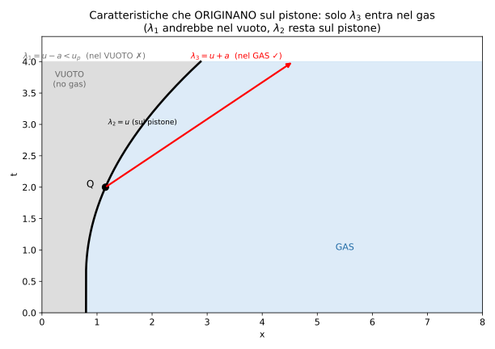

Per le caratteristiche che **originano sulla faccia del pistone** (velocità $u_p$):
- $\lambda_1=u-a < u_p$ → è **più lenta del pistone** → andrebbe **dietro** la faccia, cioè nel **vuoto**
  (no gas) → **non** la consideriamo;
- $\lambda_2=u = u_p$ → **resta sul pistone** (la faccia del pistone *è* un percorso particellare);
- $\lambda_3=u+a > u_p$ → è **più veloce** → entra **in avanti nel gas** → è l'**unica utile** (e quelle
  che, accelerando il pistone, **convergono** in un urto).

> Attenzione: questo vale **solo** per le caratteristiche che **nascono sul pistone**. Da un **punto
> generico del gas** passano regolarmente **tutte e tre** le famiglie (vedi il punto $K$).

</details>

<details>
<summary><strong>Concetto — la zona indisturbata è sotto la prima caratteristica</strong></summary>

La **zona delle condizioni iniziali** (gas **indisturbato**, stato noto) è la regione **sotto la prima
caratteristica**, cioè quella che **parte dall'origine** $(x_0,t_0)$. Sotto di essa nessuna perturbazione
del pistone è ancora arrivata → lo stato è quello **iniziale uniforme**. È da qui che si prendono i **punti
noti** (es. 4, 5) per propagare gli invarianti.

</details>

<details>
<summary><strong>Concetto — il percorso particellare $\lambda_2$ (perché è una "spezzata")</strong></summary>

La $\lambda_2$ ($dx/dt=u$) è la **traiettoria di una particella** di fluido. Perché appare **spezzata/curva**?
Perché la particella, partendo ferma ($u=0$ → tratto **verticale**), viene **accelerata** ogni volta che la
attraversa un'onda di compressione: a ogni passaggio la sua velocità $u$ **aumenta** → la pendenza $1/u$
**diminuisce** → la traiettoria **piega** (nei reticoli discreti appare a tratti, da cui "spezzata").
**Significato:** non trasporta un'onda, è il **cammino materiale** lungo cui si conserva l'**entropia**
($DS/Dt=0$); collega lo stato di una particella nel tempo.

</details>

<details>
<summary><strong>Procedura + Figura — risolvere lo stato in $P$ con le caratteristiche</strong></summary>


Le **frecce** indicano il **verso di percorrenza**: si parte sempre da uno **stato noto** e si "cammina"
lungo una caratteristica fino al punto da determinare.

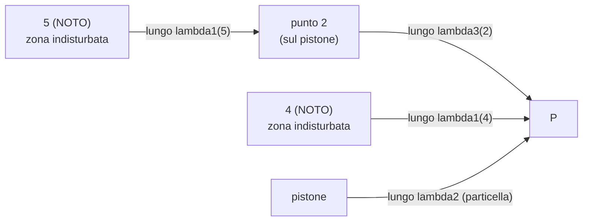
```mermaid
graph LR
    N5["5 (NOTO)<br/>zona indisturbata"] -->|"lungo lambda1(5)"| P2["punto 2<br/>(sul pistone)"]
    P2 -->|"lungo lambda3(2)"| PP["P"]
    N4["4 (NOTO)<br/>zona indisturbata"] -->|"lungo lambda1(4)"| PP
    PIS["pistone"] -->|"lungo lambda2 (particella)"| PP
```

**Spiegazione passo-passo:**
1. Conosco lo stato in **5** (zona indisturbata). Lungo la sua $\lambda_1$ trasporto l'invariante fino al
   **punto 2** (che sta sul pistone) → ricavo lo stato in 2.
2. Dal **punto 2**, lungo la sua $\lambda_3$, arrivo a **P**.
3. In parallelo, da **4** (noto) lungo $\lambda_1$ arrivo direttamente a **P**, e il **percorso
   particellare** $\lambda_2$ porta a P l'entropia.
4. Mettendo insieme le relazioni (sotto) si chiude lo stato in P.

**"Ma come conosco l'inclinazione di $\lambda_1$ se ho supposto subsonico?"** Il regime **subsonico** mi dà
il **segno** ($\lambda_1=u-a<0$ → la $\lambda_1$ "pende" verso monte/sinistra); la pendenza **esatta**
$1/|\lambda_1|$ dipende dallo stato locale e **non serve saperla** in anticipo: non integro la traiettoria
punto-per-punto, **uso l'invariante** $W_1$ che è **costante lungo $\lambda_1$** e collega i due stati in
modo **algebrico**. La geometria precisa esce *dopo*, una volta noto lo stato.

</details>

<details>
<summary><strong>Flowchart — chiudere il problema con gli invarianti di Riemann</strong></summary>

Si **uguagliano gli invarianti** sullo **stesso** segmento di caratteristica (l'invariante non cambia):

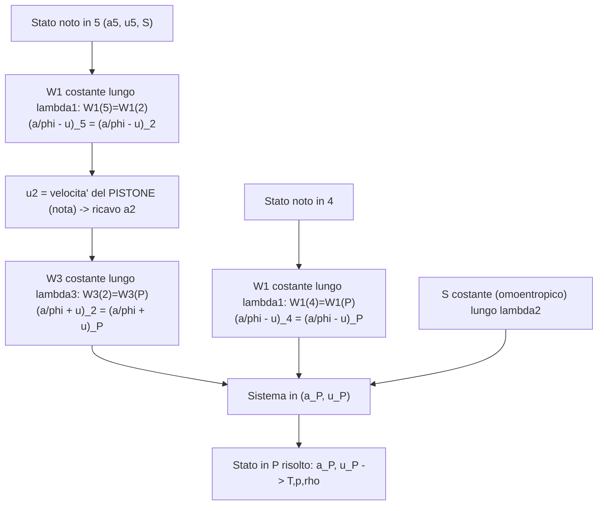
```mermaid
graph TD
    A["Stato noto in 5 (a5, u5, S)"] --> B["W1 costante lungo lambda1: W1(5)=W1(2)<br/>(a/phi - u)_5 = (a/phi - u)_2"]
    B --> C["u2 = velocita' del PISTONE (nota) -> ricavo a2"]
    C --> D["W3 costante lungo lambda3: W3(2)=W3(P)<br/>(a/phi + u)_2 = (a/phi + u)_P"]
    A2["Stato noto in 4"] --> E["W1 costante lungo lambda1: W1(4)=W1(P)<br/>(a/phi - u)_4 = (a/phi - u)_P"]
    D --> F["Sistema in (a_P, u_P)"]
    E --> F
    S["S costante (omoentropico) lungo lambda2"] --> F
    F --> G["Stato in P risolto: a_P, u_P -> T,p,rho"]
```

</details>

<details>
<summary><strong>Tabella — noti vs incogniti: il sistema è determinato</strong></summary>

| Grandezza | Stato | Nota / incognita | Da dove |
|---|---|---|---|
| $S$ (entropia, "$\delta$") | tutto il campo | **NOTA** | omoentropico: costante (no urti) |
| $a_4,\ u_4$ | punto 4 | **NOTI** | zona indisturbata (dato iniziale) |
| $a_5,\ u_5$ | punto 5 | **NOTI** | zona indisturbata |
| $u_2$ | punto 2 (pistone) | **NOTA** | è la **velocità del pistone** (legge di moto $x_p(t)$) |
| $a_2$ | punto 2 | **INCOGNITA** | da $W_1(5)=W_1(2)$ |
| $u_P,\ a_P$ (o $\theta_P$) | punto $P$ | **INCOGNITE** | da $W_3(2)=W_3(P)$ e $W_1(4)=W_1(P)$ |

**Conteggio:** 3 incognite ($a_2,\ u_P,\ a_P$) e **3 equazioni** ($W_1(5)=W_1(2)$, $W_3(2)=W_3(P)$,
$W_1(4)=W_1(P)$) → **sistema determinato**. (P è un **punto generico** del gas, non il pistone.)

</details>

<details>
<summary><strong>Concetto — perché $\delta$ (entropia) è costante, e cosa indica negli invarianti</strong></summary>

"$\delta$" sulla lavagna è l'**entropia $S$**. È **costante** perché la compressione (prima dell'urto) è
**omoentropica**: l'entropia è uniforme all'inizio e si **conserva** lungo i percorsi particellari
($DS/Dt=0$), e **senza urti** non viene generata → $S$ è la stessa ovunque. Negli **invarianti di Riemann**
è il **terzo** invariante ($W_2=S$ lungo $\lambda_2$): conoscerlo **chiude la termodinamica** (con $S$ noto,
basta **una** grandezza termodinamica come $a$ per avere tutte le altre). È per questo che restano da
trovare solo le coppie $(a,u)$ e bastano le **due** relazioni acustiche $W_1,W_3$.

</details>

<details>
<summary><strong>Concetto — la velocità del pistone è nota ovunque, ma non $a_2$</strong></summary>

Sottolineiamo una sottigliezza importante: la **velocità del pistone è nota lungo tutta la sua
traiettoria**, perché basta leggere la sua **legge di moto** dal grafico $(x,t)$ (la pendenza della curva
del pistone = velocità). Quindi $u_2$ (velocità nel punto 2, che sta sul pistone) è un **dato**.
**Ma la velocità del suono $a_2$ in quel punto NON è nota a priori:** il pistone impone solo la
**cinematica** ($u$, condizione meccanica di impermeabilità/contatto), **non** lo stato termodinamico. Per
questo $a_2$ va **ricavata** propagando l'invariante $W_1$ dal punto noto 5. (In altri testi il punto 2 si
chiama $A$: cambia la notazione, non la sostanza.)

</details>

## 7. Problema di Riemann e tubo d'urto di Sod

<details>
<summary><strong>Figura — Sod: dato iniziale, struttura $x$–$t$ e profili</strong></summary>

Problema di Riemann = sistema iperbolico con dato iniziale **discontinuo** tra due stati costanti. Sod:
$(\rho_A,p_A,u_A)=(1,1,0)$ e $(\rho_B,p_B,u_B)=(0.125,0.1,0)$.

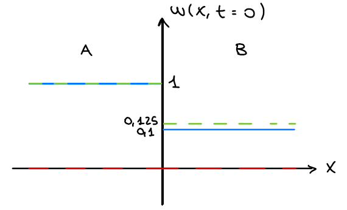

Rimossa la membrana: **fascio di espansione** (sinistra), **superficie di contatto** (centro), **onda
d'urto**(destra).

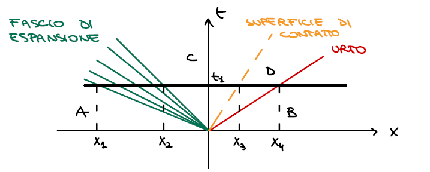

(I profili di pressione/densità — e anche velocità e temperatura — sono nella figura Python
**commentata** poco sotto, "profili di $\rho,p,u,T$".)

</details>

<details>
<summary><strong>Approfondimento — invarianti di Riemann, struttura di Sod, casistiche</strong></summary>

**Invarianti di Riemann (omoentropico).** $J^{\pm}=u\pm 2a/(\gamma-1)$ costanti lungo $u\pm a$; l'entropia
$S$ costante lungo $u$. Servono a "trasportare" lo stato lungo le caratteristiche e chiudere i problemi
(pistone, BC): conoscendo $J^{+}$ da un lato e $J^{-}$ dall'altro si ricavano $u$ e $a$ nel punto.

**Struttura del problema di Sod (3 onde, 4 stati).** Stati $A$ (sx) e $B$ (dx) iniziali; in mezzo nascono
due stati "star" $A^\*$ e $B^\*$ separati dalla **superficie di contatto**:
- a sinistra: **ventaglio di espansione** (collega $A$ ad $A^\*$, isentropico → uso $J^{+}$);
- al centro: **superficie di contatto** ($A^\*\!\mid\!B^\*$): **pressione e velocità continue**
  ($p_{A^\*}=p_{B^\*}$, $u_{A^\*}=u_{B^\*}$), **densità/temperatura/entropia discontinue**; viaggia a $u$
  (2ª famiglia);
- a destra: **onda d'urto** (collega $B$ a $B^\*$, RH).

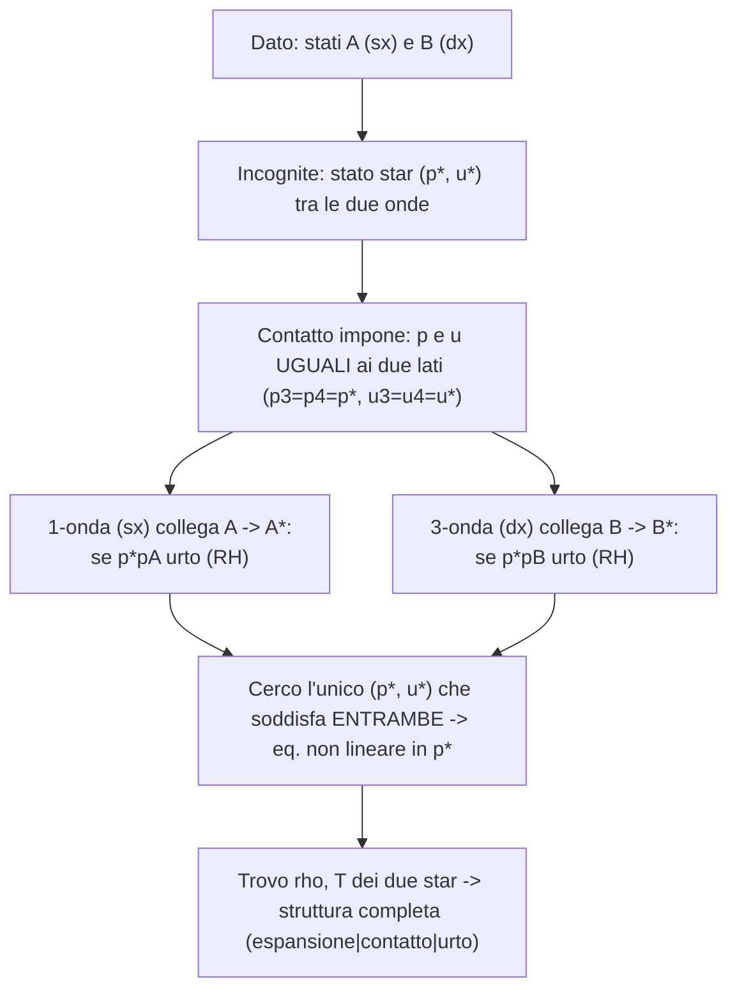
```mermaid
graph TD
    A["Dato: stati A (sx) e B (dx)"] --> B["Incognite: stato star (p*, u*) tra le due onde"]
    B --> C["Contatto impone: p e u UGUALI ai due lati (p3=p4=p*, u3=u4=u*)"]
    C --> D["1-onda (sx) collega A -> A*:<br/>se p*<pA espansione (J+ invariante), se p*>pA urto (RH)"]
    C --> E["3-onda (dx) collega B -> B*:<br/>se p*<pB espansione, se p*>pB urto (RH)"]
    D --> F["Cerco l'unico (p*, u*) che soddisfa ENTRAMBE -> eq. non lineare in p*"]
    E --> F
    F --> G["Trovo rho, T dei due star -> struttura completa (espansione|contatto|urto)"]
```

**Perché la pressione "non vede" il contatto.** La pressione è **continua** attraverso il contatto →
nel profilo $p(x,t_1)$ compaiono **solo** espansione e urto; il contatto è **invisibile**. La **densità**
(o temperatura) invece **salta** sul contatto → il profilo $\rho(x,t_1)$ mostra **tutte e tre** le
strutture. Per questo, sperimentalmente, il contatto si vede in densità/temperatura ma non in pressione.

**Casistiche** (dipendono dal segno/intensità del salto iniziale): si possono avere espansione+contatto+
urto (Sod classico), oppure due urti, o due espansioni, a seconda degli stati $A,B$. La velocità del fluido
all'interfaccia è positiva (il gas va da alta a bassa pressione).

</details>

<details>
<summary><strong>Concetto — il problema di Riemann in generale, e cosa aggiunge Sod</strong></summary>

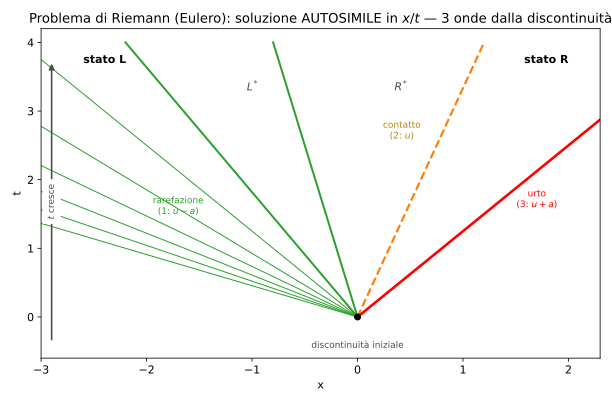

**Problema di Riemann (generale):** un sistema **iperbolico** con dato iniziale fatto di **due stati
costanti** $U_L,U_R$ separati da **una sola discontinuità** in $x=0$. La soluzione è **autosimile**
(dipende solo da $x/t$) ed è composta da **un'onda per ogni famiglia** che parte dall'origine. Per Eulero
(3 famiglie): una **1-onda** (acustica indietro: urto *o* rarefazione), una **2-onda** (contatto), una
**3-onda** (acustica avanti: urto *o* rarefazione); fra di esse le regioni "star" $L^\*,R^\*$.

> Nota: qui le onde **partono dall'origine** solo perché l'**unica discontinuità** del dato sta in $x=0$.
> In un campo **regolare** le 3 caratteristiche partono invece da **ogni** punto (vedi il toggle
> "le caratteristiche partono da OGNI punto"); il problema di Riemann è il "mattone" locale che i metodi
> numerici risolvono a ogni interfaccia.

**Tubo di Sod = un Riemann problem *specifico*.** Tabella comparativa delle **ipotesi**:

| Ipotesi | Riemann **generale** | Tubo di **Sod** |
|---|---|---|
| Tipo di dato iniziale | 2 stati costanti $U_L,U_R$ + 1 discontinuità | **idem** (è un Riemann problem) |
| Gas | anche **diversi** sui due lati ($\gamma_L\neq\gamma_R$) | **stesso** gas ideale ($\gamma$ unico) |
| Velocità iniziali | $u_L,u_R$ **qualsiasi** | **fermo**: $u_L=u_R=0$ |
| Valori $\rho,p$ | **qualsiasi** | **scelti**: $(1,1)$ e $(0.125,0.1)$, $p_L>p_R$ |
| Viscosità / forze | (di solito) non viscoso | non viscoso, senza forze di volume, 1D |
| Soluzione risultante | **qualsiasi** combinazione (2 urti, 2 rarefazioni, urto+contatto+rarefazione, **vuoto**…) | **esattamente** espansione (sx) + contatto + **urto** (dx) |

Quindi Sod è il caso particolare "didattico" del Riemann problem: stesse equazioni e struttura, ma con
**ipotesi fissate** che producono **sempre** la stessa configurazione a 3 onde — utile come **test di
validazione** riproducibile.

</details>

<details>
<summary><strong>Concetto — quei valori di $p,\rho$ sono del problema di Riemann o solo di Sod? E perché proprio quelli?</strong></summary>

- **Sono una scelta di Sod**, non del problema di Riemann generale. Il Riemann problem funziona con **due
  stati qualsiasi**; il "tubo di Sod" **fissa** $(\rho_L,p_L)=(1,1)$ e $(\rho_R,p_R)=(0.125,0.1)$.
- **Perché proprio quelli?** È il **benchmark storico** (Sod, 1978): rapporti moderati (pressione $10:1$,
  densità $8:1$) che producono una struttura a **3 onde ben separate e tutte visibili** (espansione +
  contatto + urto), né troppo deboli né troppo forti → **caso di prova ideale** per confrontare gli schemi
  numerici. Non c'è nulla di fisicamente speciale: è una **convenzione** condivisa che rende i risultati
  **riproducibili e confrontabili** tra codici diversi.
- **Perché in forma "assoluta" e non relativa?** In realtà sono già **normalizzati**: si pone
  $\rho_L=1,\ p_L=1$ come **riferimento** e si danno gli altri rispetto a quello. Le equazioni di Eulero
  non viscose **non hanno una scala** intrinseca → la soluzione dipende **solo dai rapporti**
  ($p_L/p_R$, $\rho_L/\rho_R$, $\gamma$). Fissare $\rho_L=p_L=1$ **è** quindi un modo di lavorare in
  relativo: i numeri "assoluti" con riferimento unitario equivalgono a dare i rapporti.

</details>

<details>
<summary><strong>Concetto — il "background matematico" che produce espansione+contatto+urto</strong></summary>

Partiamo da una domanda semplice: **perché lo stesso sistema produce onde di tipo diverso?** Le equazioni
sono **le stesse** (Eulero 1D, 3 famiglie $u-a,\ u,\ u+a$); il dato è **un solo salto**. Da quel salto
**ogni famiglia genera un'onda**. Il **tipo** di onda dipende da **come la velocità di quella famiglia
cambia attraverso l'onda**:

1. **Famiglie acustiche** ($u\pm a$): la loro velocità **dipende dalla soluzione** (come in Burgers, dove
   $f'(u)=u$). Quindi un salto in queste famiglie si comporta come Burgers:
   - se le caratteristiche **convergono** (compressione) → **urto**;
   - se **divergono** (espansione) → **ventaglio di rarefazione**.
   ("Genuinamente non lineare" significa proprio: la velocità **varia davvero** lungo l'onda.)
2. **Famiglia dell'entropia** ($u$): la sua velocità **non cambia** attraverso l'onda (i due lati hanno la
   **stessa** $u$). Allora il salto non si irripidisce né si apre: viene **solo trasportato** → **contatto**.
   ("Linearmente degenere" = velocità **degenere/costante** attraverso quell'onda.)

Quindi: **stesse equazioni + un salto + soluzione autosimile ($x/t$)** → **3 onde**, e il loro tipo è
deciso da "la velocità varia (acustica → urto/ventaglio) oppure no (entropia → contatto)" e dal **segno
del salto** (compressione vs espansione).

**Come si "risolve" concretamente** (Sod): la $\lambda_2$ (contatto) impone $p$ e $u$ **uguali** ai suoi
due lati ($p^\*,u^\*$). Si scrivono allora le due relazioni acustiche — la **1-onda** che collega lo stato
$L$ allo star $L^\*$ e la **3-onda** che collega $R$ a $R^\*$ — e si trova l'unico $(p^\*,u^\*)$ che le
soddisfa entrambe. Da lì densità/temperature dei due star, e la struttura è completa.

</details>

<details>
<summary><strong>Figura — profili di $\rho,\ p,\ u,\ T$ a $t=t_1$ (commentati)</strong></summary>


Lettura (sx → dx: stato L, ventaglio, $L^\*$, contatto, $R^\*$, urto, stato R):
- **Pressione $p$** e **velocità $u$**: **continue** attraverso il **contatto** (quindi lì **invisibile**);
  variano dolcemente nel **ventaglio** e saltano solo all'**urto**. Mostrano **espansione + urto**.
- **Densità $\rho$** e **temperatura $T$**: **saltano** sul **contatto** (visibile) **e** sull'urto, oltre
  a variare nel ventaglio. Mostrano **tutte e tre** le strutture.
- Perché $T$ "vede" il contatto: $T=p/(\rho R)$; sul contatto $p$ è continua ma $\rho$ salta → $T$ salta.

**Pratica:** per **localizzare il contatto** si guarda la **densità/temperatura** (es. tecniche ottiche
sulla densità), **non** la pressione.

</details>

<details>
<summary><strong>Concetto — gasdinamica "spaziale" vs grafico spazio–tempo: come cambia l'interpretazione</strong></summary>

In gasdinamica si disegnano spesso i profili $p(x),\rho(x),u(x)$ a un **istante fisso** (grafici **puramente
spaziali**): lì urto, contatto ed espansione appaiono come **caratteristiche a posizioni fisse** $x_1,\dots,x_4$.
Nel piano **spazio–tempo** $(x,t)$ gli stessi fenomeni diventano **linee/regioni**:

| Fenomeno | Nel profilo **spaziale** ($t$ fisso) | Nel piano **spazio–tempo** $(x,t)$ |
|---|---|---|
| **Urto** | un **salto** in un punto $x_4$ | una **linea** $x_4(t)$ (pendenza $1/s$) |
| **Contatto** | un salto (in $\rho,T$) in $x_3$ | una **linea** $x_3(t)=u\,t$ |
| **Espansione** | una **rampa** liscia tra $x_1$ e $x_2$ | un **ventaglio** (regione) tra due linee |
| Stati costanti | tratti **piatti** | **regioni** (settori) |

**Chiave (come da lavagna):** nel grafico spazio–tempo **tutti i punti si muovono**, cioè
$x_1(t),x_2(t),x_3(t),x_4(t)$ sono **funzioni del tempo**; il profilo spaziale è una **"fotografia"**
(taglio orizzontale $t=t_1$) di quel diagramma. Quindi: il piano $(x,t)$ mostra la **storia completa** (e la
**velocità** di ogni struttura = $1/$pendenza); il profilo $x$ a $t_1$ è dove quelle linee **intersecano**
la retta $t=t_1$. Un urto = "punto" nel profilo ⟺ "linea" in $(x,t)$; il ventaglio = "rampa" nel profilo ⟺
"regione" in $(x,t)$.

</details>

<details>
<summary><strong>Approfondimento — le caratteristiche partono da OGNI punto: come si gestisce</strong></summary>

*(Approfondimento, molto utile.)* Finora un solo punto e una sola fenomenologia; in realtà il "ventaglio"
di 3 caratteristiche parte da **ogni** punto → il piano $(x,t)$ è **coperto da tre famiglie** di
caratteristiche (una rete):

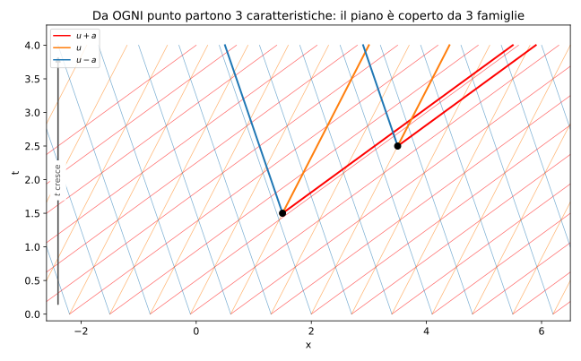

Ogni punto è l'**intersezione** di una curva per famiglia; la soluzione si costruisce propagando gli
invarianti lungo **tutte**. Analiticamente è **intrattabile** in generale (le curve si incurvano,
interagiscono, formano urti). **In pratica si discretizza:** i metodi a **volumi finiti / Godunov**
risolvono un **problema di Riemann locale a ogni interfaccia** tra celle, a ogni passo temporale — cioè
"tengono conto di tutte e 3 le caratteristiche in ogni punto" **numericamente**. È così che il metodo
delle caratteristiche **motiva** gli schemi **upwind/Godunov** (vedi `schemi_volumi_finiti.md`).

</details>

## 8. Condizioni al contorno per Eulero 1D non stazionario

<details>
<summary><strong>Inquadramento — la regola delle caratteristiche entranti </strong></summary>

**# condizioni da imporre su un bordo = # caratteristiche entranti** in quel bordo. In 1D le famiglie sono
3 ($u-a,\ u,\ u+a$); il loro **segno** (regime sub/supersonico) decide quante entrano. È la logica delle
**esercitazioni** quando si impongono pressione/velocità/temperatura ai contorni nei vari regimi.

**Perché proprio le *entranti*.** Una caratteristica **entrante** porta informazione **da fuori** il
dominio: quel dato il calcolo non ce l'ha, quindi va **imposto** (è una BC). Una caratteristica **uscente**
porta informazione **dall'interno** verso il bordo: quel valore lo **conosco già** risalendo la
caratteristica fino alla prima cella interna → **non si impone, si estrapola** (compatibilità
$W_k=W_k^{\text{interno}}$). Imporre una BC su una caratteristica uscente sarebbe **sovra-determinare** il
problema (dato fisicamente incoerente, possibili riflessioni spurie).

</details>

<details>
<summary><strong>Concetto — perché su una caratteristica USCENTE non si impone nulla (importante)</strong></summary>

Mettiamo a posto la logica, perché è facile invertirla. Per conoscere il valore al **bordo** "risalgo" la
caratteristica all'indietro nel tempo e guardo **da dove viene** l'informazione:

- **Caratteristica USCENTE** (porta info **dall'interno verso il bordo**): risalendola **rientro nel
  dominio**, dove la soluzione **la conosco** (l'ho appena calcolata). Quindi il valore al bordo è **già
  determinato** dall'interno → lo **calcolo/estrapolo**, non c'è nulla da imporre. (L'invariante di Riemann
  su quella linea è **calcolabile** proprio perché il campo a monte è noto.)
- **Caratteristica ENTRANTE** (porta info **da fuori verso il dominio**): risalendola **esco dal dominio**,
  dove **non so nulla** del campo (e che non ci interessa). Quell'informazione **manca** → la devo
  **fornire** io: è la **BC**.

Quindi la tua intuizione va **ribaltata**: è la **uscente** che si può ripercorrere all'indietro (verso
l'interno noto), non l'entrante.

**E se imponessi comunque una BC su una caratteristica uscente?** Sarebbe **sbagliato**, non solo inutile:
- **sovra-determini** il problema → due valori in conflitto nello stesso punto (quello che produce
  l'interno e quello che imponi tu) → problema **mal posto**;
- fisicamente l'uscente deve essere **libera** di portare fuori ciò che il campo interno detta; "bloccarla"
  con un valore fisso **riflette** l'informazione all'indietro → è esattamente il meccanismo delle **onde
  acustiche spurie** (vedi il toggle sulla riflessione). Risultato: campo falsato, possibili instabilità.

In sintesi: **entrante → manca l'info → impongo**; **uscente → l'info c'è (dall'interno) → estrapolo, e
imporre sarebbe un errore.**

</details>

<details>
<summary><strong>Figura — le quattro casistiche a confronto (ingresso/uscita, sub/super)</strong></summary>


Stessa logica nei quattro casi (le caratteristiche **verdi entrano** → richiedono BC; le **grigie escono**
→ si estrapolano). Il caso $\lambda_1=u-a$ è il "discriminante": in **subsonico** $u<a\Rightarrow\lambda_1<0$.

| | Bordo | $\lambda_1=u-a$ | $\lambda_2=u$ | $\lambda_3=u+a$ | Entranti | **# BC** |
|---|---|---|---|---|---|---|
| **A** Ingresso supersonico | sx | $+$ (entra) | $+$ | $+$ | 3 | **3** |
| **B** Ingresso subsonico | sx | $-$ (**esce**) | $+$ | $+$ | 2 | **2** |
| **C** Uscita supersonica | dx | $+$ (esce) | $+$ | $+$ | 0 | **0** |
| **D** Uscita subsonica | dx | $-$ (**rientra**) | $+$ | $+$ | 1 | **1** |

**Ingresso subsonico (B):** non si impone la $\lambda_1$ perché è **uscente** (a un ingresso a sinistra,
$\lambda_1<0$ punta **fuori** dal dominio): la si **estrapola** risalendola dall'interno (porta $W_1$ dal
campo verso il bordo). Si impongono invece le 2 entranti ($\lambda_2,\lambda_3$ → es. $p_0,T_0$).
**Uscita subsonica (D):** specularmente, $\lambda_1<0$ **rientra** nel dominio dall'esterno → va **imposta**
1 BC (es. pressione statica), le altre 2 si estrapolano.

</details>

<details>
<summary><strong>Approfondimento — le condizioni al contorno in dettaglio (ricetta + tabella)</strong></summary>

**Ricetta generale (vale per qualsiasi bordo e regime):**
1. Sul bordo traccia le 3 caratteristiche e guarda i **segni** di $\lambda_1=u-a,\ \lambda_2=u,\ \lambda_3=u+a$ (dipendono dal regime e dal verso del flusso).
2. Conta quante **entrano** nel dominio (portano informazione da **fuori**): tante quante sono = **numero di BC da imporre**.
3. Le caratteristiche **uscenti** portano informazione **dall'interno** → le grandezze corrispondenti si **estrapolano** dall'interno (compatibilità $W_k=W_k^{\text{interno}}$), **non** si impongono.
4. BC imposte + compatibilità uscenti = sistema completo → si ricava lo **stato al bordo**.

**Tabella riassuntiva** (flusso entrante con $u>0$):

| Bordo / regime | $\lambda$ entranti | # BC | Cosa si **impone** (tipico) | Cosa si **estrapola** dall'interno |
|---|---|---|---|---|
| Ingresso **supersonico** | 3 (tutte) | **3** | $p_0,\ T_0,\ M$ (o $u,S$ + 1 termodinamica) | nulla |
| Ingresso **subsonico** | 2 ($\lambda_2,\lambda_3$) | **2** | $p_0,\ T_0$ (o $S$ e $h_0$) | $W_1=\tfrac{a}{\phi}-u$ |
| Uscita **supersonica** | 0 | **0** | nulla | tutto ($W_1,W_2,W_3$) |
| Uscita **subsonica** | 1 ($\lambda_1$) | **1** | $p$ statica (riflettente) **o** $W_1$ (non riflettente) | $W_2,W_3$ |
| **Parete** solida | — | $u_n=0$ | velocità normale nulla | resto via Riemann/RH |

**Note pratiche:**
- Le **due grandezze termodinamiche** imposte devono essere **indipendenti** (non $T$ e $a$ insieme: sono legate da $a^2=\gamma R T$).
- **Riflettente vs non riflettente:** imporre la **pressione statica** a un'uscita subsonica è *riflettente* (le onde acustiche incidenti rimbalzano → disturbi artificiali); imporre l'**invariante entrante** $W_1$ è *non riflettente*. In LES si usano **strati assorbenti** per evitare riflessioni.
- **Collegamento esercitazioni:** in pratica (es. turbomacchine) si impone **pressione/temperatura totali a monte** e **pressione statica a valle** (subsonico) — è esattamente il conteggio delle caratteristiche entranti.
- **Numerica:** al bordo l'informazione "interna" arriva dalla **prima cella**; si risolve un piccolo problema di **Riemann/compatibilità** al contorno.

</details>

<details>
<summary><strong>Concetto — cosa si impone in ciascuno dei 4 casi e perché</strong></summary>

Conosci il **numero** di BC; ecco **quali** e **perché** (figura sopra):

- **A. Ingresso supersonico (3 BC):** tutto entra → fisso lo **stato completo**: 2 grandezze termodinamiche
  **indipendenti** + 1 cinematica (es. $p_0,T_0,M$, oppure $u,S$ + una termodinamica). Perché: nessuna
  informazione arriva dall'interno, quindi devo dare *tutto* io.
- **B. Ingresso subsonico (2 BC):** impongo **2 termodinamiche** (tipicamente $p_0,T_0$ → grandezze
  ingegneristiche di monte); la cinematica $u$ **non** la impongo perché la "porta" la caratteristica
  $\lambda_1$ che **risale** dall'interno (invariante $W_1$). Perché 2 termodinamiche: il sistema
  termodinamico ha 2 gradi di libertà, e $u$ è già determinato da $W_1$.
- **C. Uscita supersonica (0 BC):** tutto esce → lo stato di uscita è **determinato dall'interno**: non
  impongo nulla (imporre falserebbe il campo).
- **D. Uscita subsonica (1 BC):** $\lambda_1$ rientra → impongo **1** grandezza, di solito la **pressione
  statica** $p$ (di valle); le altre 2 ($u,S$/entropia) le porta l'interno. Perché la pressione: è il
  "segnale" che a valle si propaga a monte (acustica) e che fisicamente controlla lo scarico.

</details>

<details>
<summary><strong>Concetto — se le BC sono poche, scelgo una termodinamica o la cinematica?</strong></summary>

La scelta **non è arbitraria**: la decide **quale caratteristica entra**.
- Ogni caratteristica entrante porta **un** pezzo di informazione mancante. Le famiglie acustiche
  ($\lambda_{1,3}=u\pm a$) sono legate a grandezze **termodinamiche+acustiche** (pressione/entalpia
  totale); la famiglia $\lambda_2=u$ è legata all'**entropia/contatto** (termodinamica "di trasporto").
- In **ingresso subsonico** entrano $\lambda_2,\lambda_3$ → si impongono **2 termodinamiche** ($T_0,p_0$):
  $\lambda_3$ "vuole" un'informazione totale/acustica, $\lambda_2$ l'entropia. La **cinematica $u$** è
  l'unica che **esce** (via $\lambda_1$) → non la si impone.
- In generale: **impongo le grandezze associate alle caratteristiche entranti**; conto i gradi di libertà
  (2 termodinamici + 1 cinematico) e tolgo quelli "coperti" dalle uscenti. Cambiare scelta (es. imporre $u$
  invece di $p_0$) **sovra/sotto-determina** il problema o introduce **riflessioni**.

</details>

<details>
<summary><strong>Concetto — uscita subsonica: la riflessione delle onde acustiche</strong></summary>

All'uscita subsonica rientra $\lambda_1$ → serve **1** BC. La scelta tra **pressione statica** e
**invariante** decide se la simulazione è *riflettente* o no.

**Analogia della corda fissata al muro:** così come la corda **non si può muovere** perché vincolata al
muro, anche la **pressione**, se la **fisso** come BC al bordo, **non può variare**. Ma questo vincolo
genera un'**onda acustica fittizia** (riflessa, uguale e opposta a quella incidente) che **falsa** la
simulazione — modifica i livelli di pressione/rumore **sia all'interno sia al bordo**. Due rimedi:

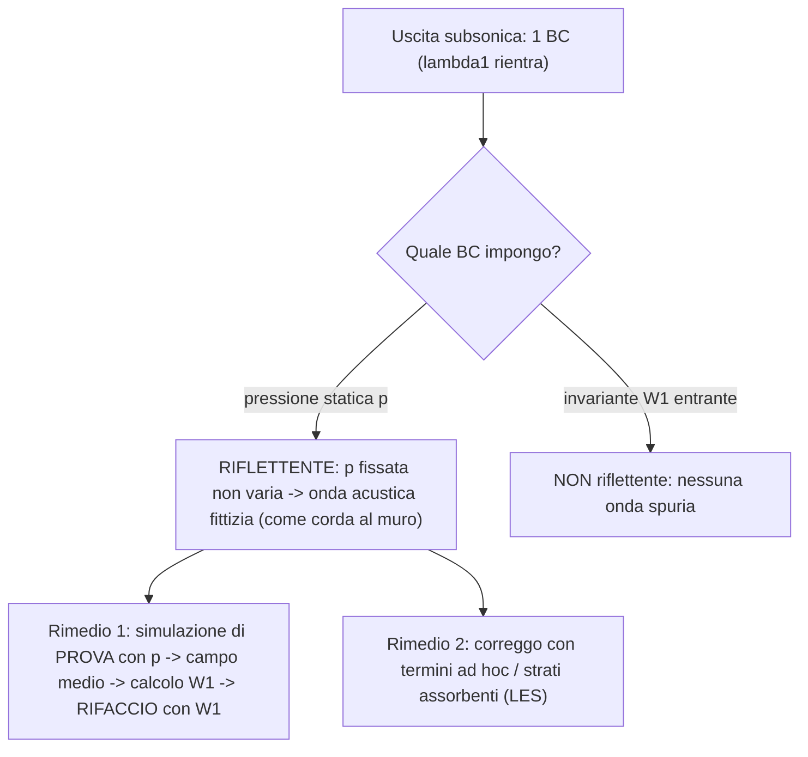
```mermaid
graph TD
    P["Uscita subsonica: 1 BC (lambda1 rientra)"] --> Q{"Quale BC impongo?"}
    Q -->|"pressione statica p"| R["RIFLETTENTE: p fissata non varia -> onda acustica fittizia (come corda al muro)"]
    Q -->|"invariante W1 entrante"| N["NON riflettente: nessuna onda spuria"]
    R --> A1["Rimedio 1: simulazione di PROVA con p -> campo medio -> calcolo W1 -> RIFACCIO con W1"]
    R --> A2["Rimedio 2: correggo con termini ad hoc / strati assorbenti (LES)"]
```

| Approccio | Come | Pro | Contro |
|---|---|---|---|
| **Pressione statica** | fisso $p$ di valle | semplice, robusto, valore fisico noto | **riflettente** → onde acustiche spurie |
| **Invariante $W_1$** | impongo $W_1=a/\phi-u$ entrante | **non riflettente** | serve un valore di riferimento di $W_1$ |
| **Prova + $W_1$** | 1ª run con $p$ → media → $W_1$ → 2ª run | non riflettente, parte da dato fisico | **doppia** simulazione |
| **Strati assorbenti** | zona dissipativa al bordo | non riflettente, robusto in LES | costo extra, taratura |

</details>

<details>
<summary><strong>Dimostrazione — ingresso subsonico: cosa si calcola e procedura (con derivazione)</strong></summary>

**Cosa si vuole calcolare e perché:** all'ingresso subsonico **mancano** $u$ e una termodinamica perché
$\lambda_1$ **risale** dall'interno; voglio ricavare lo **stato completo** al bordo $(u,a,T,p,\rho)$ usando
le **2 BC** imposte ($T_0,p_0$ → entalpia totale $h_0$ ed entropia $S_i$) **più** l'invariante $W_1$ noto
dall'interno. Procedura:

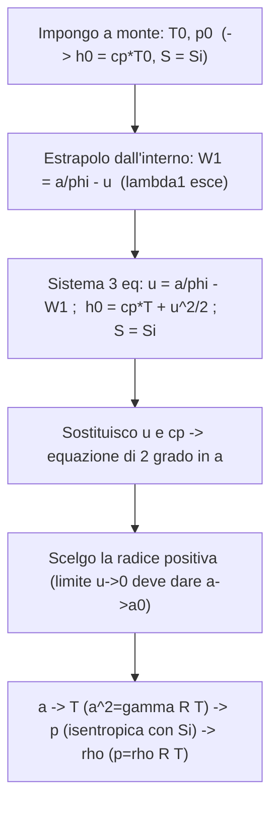
```mermaid
graph TD
    A["Impongo a monte: T0, p0  (-> h0 = cp*T0, S = Si)"] --> B["Estrapolo dall'interno: W1 = a/phi - u  (lambda1 esce)"]
    B --> C["Sistema 3 eq: u = a/phi - W1 ;  h0 = cp*T + u^2/2 ;  S = Si"]
    C --> D["Sostituisco u e cp -> equazione di 2 grado in a"]
    D --> E["Scelgo la radice positiva (limite u->0 deve dare a->a0)"]
    E --> F["a -> T (a^2=gamma R T) -> p (isentropica con Si) -> rho (p=rho R T)"]
```

Derivazione (gas perfetto, $\phi=\tfrac{\gamma-1}{2}$, $c_p=\tfrac{\gamma R}{\gamma-1}$):

$$u=\frac{a}{\phi}-W_1,\qquad h_0=c_pT+\tfrac12 u^2,\qquad a^2=\gamma R T\ \Rightarrow\ c_pT=\frac{a^2}{\gamma-1}.$$

Sostituendo $u$ e $c_pT$ in $h_0$:

$$\frac{a^2}{\gamma-1}+\frac12\left(\frac{a}{\phi}-W_1\right)^2=h_0
\;\Longrightarrow\;\Big(\underbrace{\tfrac{1}{\gamma-1}+\tfrac{1}{2\phi^2}}_{\text{coeff. }a^2}\Big)a^2
-\frac{W_1}{\phi}\,a+\Big(\tfrac12 W_1^2-h_0\Big)=0,$$

equazione **di 2° grado in $a$**: si prende la **radice positiva** (l'unica fisica: per $u\to0$ deve dare
$a\to a_0=\sqrt{(\gamma-1)h_0}$). Trovato $a$: $T=a^2/(\gamma R)$, poi $p$ dalla **isentropica**
$p/p_0=(T/T_0)^{\gamma/(\gamma-1)}$ (entropia imposta), infine $\rho=p/(RT)$. Stato completo → flussi.

</details>

<details>
<summary><strong>Approfondimento — parete solida (caso a sé stante)</strong></summary>

**È un caso a sé** (non un sotto-caso di ingresso/uscita): la parete **non è un bordo di flusso** ma un
**vincolo geometrico** ($u_n=0$, impermeabilità). Però si **risolve come un pistone fermo** / un mezzo
problema di Riemann contro un muro.

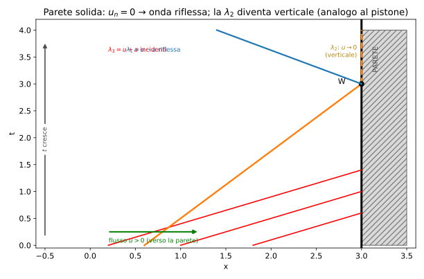

Lettura della figura:
- **Direzione del flusso:** $u>0$ verso la parete (freccia verde).
- **Caratteristiche:** $\lambda_3=u+a$ (rosse) **incidono** sulla parete; la $\lambda_2=u$ (arancio) porta
  la particella verso il muro e, dovendo essere $u=0$ alla parete, **diventa verticale**; nasce una
  $\lambda_1=u-a$ **riflessa** (blu) che rientra nel dominio. Quindi **3 famiglie**, ma una (la riflessa) è
  *generata* dal vincolo.
- **Isentropica o no:** se il fluido va **verso** la parete si forma un **urto** (entropia **cresce**, non
  isentropico → Rankine–Hugoniot); se si **allontana**, un'**espansione** (isentropica, invarianti di
  Riemann). Nel limite di urto **debole** (Mach relativo → 1) la generazione di entropia → 0 e si torna
  isentropici.
- **Legame col problema di Riemann:** è il Riemann problem "a specchio" (lo stato a destra è l'immagine
  riflessa di quello a sinistra con $u\to-u$): la parete equivale a un piano di simmetria.

Come si ricavano le grandezze (caso isentropico, urto debole):

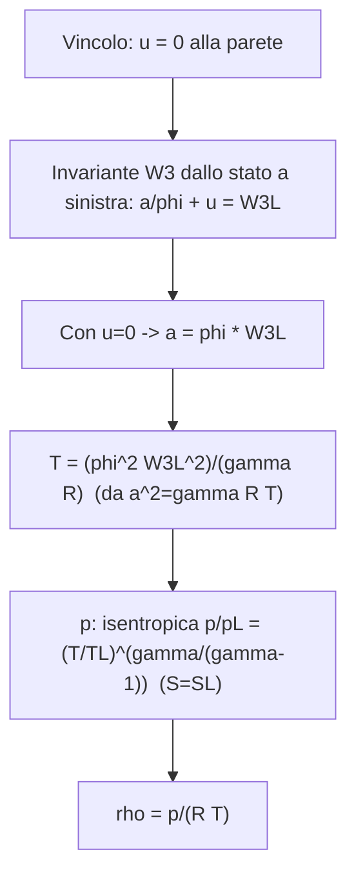
```mermaid
graph TD
    A["Vincolo: u = 0 alla parete"] --> B["Invariante W3 dallo stato a sinistra: a/phi + u = W3L"]
    B --> C["Con u=0 -> a = phi * W3L"]
    C --> D["T = (phi^2 W3L^2)/(gamma R)  (da a^2=gamma R T)"]
    D --> E["p: isentropica p/pL = (T/TL)^(gamma/(gamma-1))  (S=SL)"]
    E --> F["rho = p/(R T)"]
```

| Caso | Onda generata | Isentropico? | Metodo | Grandezze |
|---|---|---|---|---|
| Fluido **verso** la parete | **urto** | no (entropia ↑) | **Rankine–Hugoniot** con $u=0$ | $p,\rho$ post-urto |
| Fluido **lontano** dalla parete | **espansione** | sì | **invarianti di Riemann** ($W_3$) | $a\to T\to p\to\rho$ |

</details>

<details>
<summary><strong>Approfondimento — perché tutto questo serve anche per Navier–Stokes</strong></summary>

L'approccio caratteristico **non è solo un caso particolare** (Eulero non viscoso): è la **prima fase**
anche nei problemi più complessi. Le equazioni di **Navier–Stokes** si trattano con **operator splitting**:

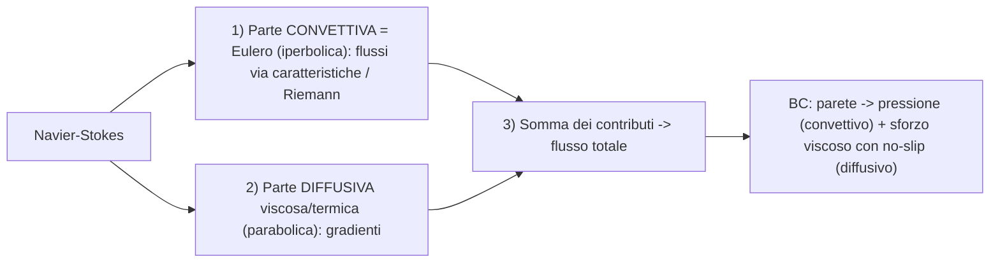
```mermaid
graph LR
    NS["Navier-Stokes"] --> C1["1) Parte CONVETTIVA = Eulero (iperbolica): flussi via caratteristiche / Riemann"]
    NS --> C2["2) Parte DIFFUSIVA viscosa/termica (parabolica): gradienti"]
    C1 --> S["3) Somma dei contributi -> flusso totale"]
    C2 --> S
    S --> BC["BC: parete -> pressione (convettivo) + sforzo viscoso con no-slip (diffusivo)"]
```

La parte convettiva è **identica** a quella vista (autovalori $u,u\pm a$, caratteristiche, BC per regime).
La novità in Navier–Stokes è la BC di **parete**: oltre alla pressione (parte convettiva) si impone
l'**aderenza** (no-slip, $u=0$) per lo sforzo viscoso. Quindi capire bene Eulero 1D è il **mattone** su cui
si costruisce il caso generale.

</details>

## 9. Modelli a confronto e ruolo delle Rankine–Hugoniot

<details>
<summary><strong>Figura — mappa dei modelli (mermaid)</strong></summary>


```mermaid
graph TD
    PDE["Legge di conservazione<br/>dU/dt + dF/dx = 0"] --> SCAL["SCALARE<br/>(1 equazione)"]
    PDE --> VETT["VETTORIALE<br/>(sistema)"]
    SCAL --> SL["Scalare LINEARE<br/>advezione: f = a*u<br/>vel. d'onda a = cost<br/>caratteristiche parallele"]
    SCAL --> SNL["Scalare NON lineare<br/>Burgers: f = u^2/2<br/>vel. d'onda f'(u) = u<br/>urti / espansioni"]
    VETT --> VL["Vettoriale LINEARE<br/>eq. d'onda / acustica<br/>A costante, lambda = +/- alpha*sqrt(epsilon)"]
    VETT --> VNL["Vettoriale NON lineare<br/>Eulero: lambda = u, u+a, u-a<br/>urto + contatto + espansione"]
    SL -. "niente urti<br/>(non si irripidisce)" .-> NORH["RH dà s = a (banale)"]
    SNL --> RH["RANKINE-HUGONIOT<br/>s = salto(f) / salto(U)<br/>salto flusso / salto cons."]
    VNL --> RH
    RH --> BUR["Burgers: s = (uA+uB)/2<br/>(media SOLO qui)"]
    RH --> EUL["Eulero: salti di<br/>massa, q.moto, energia"]
    style RH fill:#ffe0b2,stroke:#e65100,stroke-width:2px
    style SNL fill:#e8f5e9
    style VNL fill:#e8f5e9
```

Le **Rankine–Hugoniot** non sono un modello a sé: sono la **condizione di salto** che attraversa tutti i
modelli **con discontinuità** (scalare non lineare *e* sistemi). Sul lineare degenerano in $s=a$.

</details>

## Formule e dimostrazioni

<details>
<summary><strong>Formule — specchietto del capitolo</strong></summary>

**Scalare lineare**

| Formula | Hint |
| --- | --- |
| $u_t+a u_x=0,\ u=u_0(x-at)$ | profilo traslato a velocità $a$ |
| $a=\partial f/\partial u$ | velocità d'onda = derivata del flusso |
| $\frac{Du}{Dt}=u_t+a u_x=0$ | derivata materiale nulla lungo $dx/dt=a$ |
| $du=0$ lungo la caratteristica | compatibilità (derivata direzionale) |

**Burgers e Rankine–Hugoniot**

| Formula | Hint |
| --- | --- |
| $u_t+u u_x=0,\ f=u^2/2$ | vel. d'onda $f'(u)=u$ → urti/espansioni |
| $t_b=-1/\min u_0'$ | tempo di breaking |
| $s=[\![f]\!]/[\![u]\!]$ | RH (universale) |
| $s=(u_A+u_B)/2$ | **solo** Burgers |
| $u=x/t$ | rarefazione autosimile |

**Sistemi ed Eulero**

| Formula | Hint |
| --- | --- |
| $\partial_t W_k+\lambda_k\partial_x W_k=0$ | $W=L^{-1}U$, scalari disaccoppiati |
| $\lambda=\{u-a,u,u+a\}$ | autovalori Eulero |
| $A'=\left(\begin{smallmatrix}u&\rho&0\\0&u&1/\rho\\0&\rho a^2&u\end{smallmatrix}\right)$ | matrice primitiva $(\rho,u,p)$ |
| $\lambda=\pm\alpha\sqrt\varepsilon$ | sistema 2×2: $\varepsilon=\pm1$ iperb./ellitt. |
| $J^{\pm}=u\pm\frac{2a}{\gamma-1}$ | invarianti di Riemann ($\phi=\frac{\gamma-1}{2}$) |
| $s[\![\rho]\!]=[\![\rho u]\!]$, … | RH per Eulero (massa, q.moto, energia) |

</details>

<details>
<summary><strong>Dimostrazione — lista da saper fare</strong></summary>

| Dimostrazione | Da → a |
| --- | --- |
| Linea caratteristica (scalare → sistema → multi-D) | $\frac{du}{dt}=u_t+\frac{dx}{dt}u_x$ vs $u_t+au_x=0$ → $\frac{dx}{dt}=a$; $f'(u)$; $\lambda_k$; cono multi-D |
| Linea caratteristica via differenziale + Cramer | $\det=dx-a\,dt=0\Rightarrow dx/dt=a$ |
| **Rankine–Hugoniot per Burgers** | $f=u^2/2\Rightarrow s=(u_A+u_B)/2$ |
| Rankine–Hugoniot dal bilancio integrale | $\frac{d}{dt}\int U+[\![F]\!]=0\Rightarrow s[\![U]\!]=[\![F]\!]$ |
| Compatibilità (sistema) | $L^{-1}(U_t+AU_x)=0\Rightarrow dW_k/dt=0$ lungo $\lambda_k$ |
| **Matrice $A'$ di Eulero (primitive)** | da massa/q.moto/energia → $A'(\rho,u,p)$; $\det(A'-\lambda I)=0\Rightarrow\lambda=u,u\pm a$ |
| Autovalori di Eulero 1D | $(\lambda-u)(\lambda-u-a)(\lambda-u+a)=0$ |
| Invarianti di Riemann (omoentropico) | $dW_{1,3}=\frac{da}{\phi}\mp du=0\Rightarrow J^{\pm}=u\pm\frac{2a}{\gamma-1}$ |

</details>


## Archivio — figure originali (a mano)

<details>
<summary><strong>Archivio — figure a mano sostituite da versioni Python (conservate per riferimento)</strong></summary>

Queste sono le figure **originali disegnate a mano** (dagli appunti) che nel testo principale sono state
**sostituite** da versioni Python più pulite. Le tengo qui nel caso servano in futuro.

**Condizioni al contorno (ora in `lc_bc_quattro_casi.svg`):**

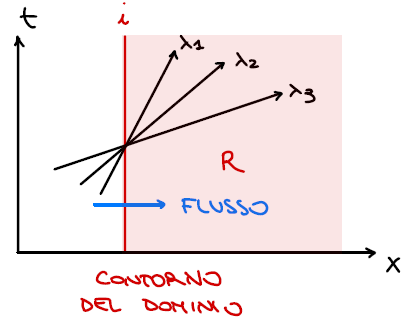
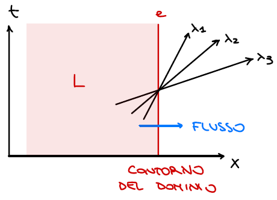
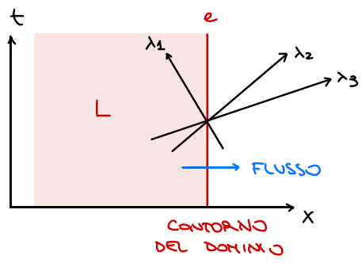
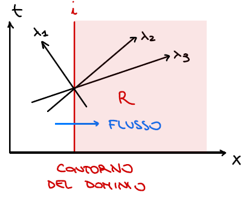

**Parete solida (ora in `lc_parete_solida_py.svg`):**

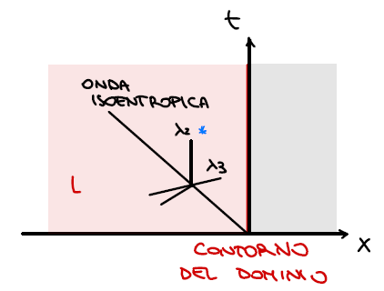
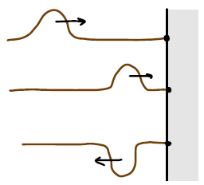

**Profili di Sod (ora in `lc_sod_profili.svg`, con anche $u$ e $T$):**

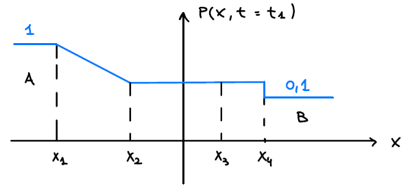
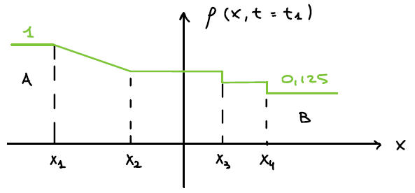

</details>
