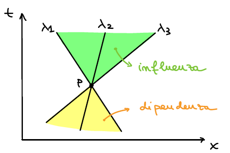
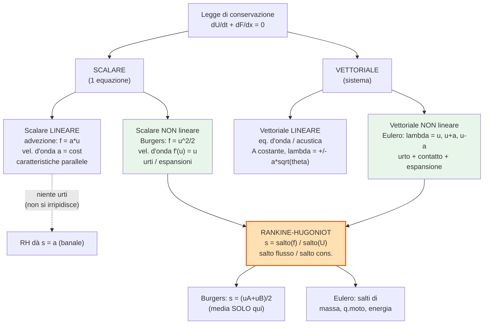

# Metodo delle caratteristiche

> Regime tipicamente **iperbolico** (supersonico per Eulero): l'informazione viaggia
> lungo le **linee caratteristiche**, non ovunque. Complemento di
> [`bilancio.md`](bilancio.md) (leggi di conservazione e sistema di Eulero), da cui si
> eredita la forma quasi-lineare $\partial_t U + A(U)\,\partial_x U = 0$, $A=L\Lambda L^{-1}$.
>
> 📚 Contenuti basati sul **Cap. 2 "Linee caratteristiche"** (appunti CFD, P. Pantò) +
> [`bilancio.md`](bilancio.md). Le figure a mano del capitolo sono state **ridisegnate
> in Python/SVG** (script: [`images/caratteristiche_plots.py`](images/caratteristiche_plots.py));
> le figure di pistone/Sod/condizioni al contorno di Eulero/parete sono estratte dal PDF.

## Nomenclatura essenziale

<strong>📖 Simboli e nomenclatura usati nel capitolo</strong>

| Simbolo | Nome | Note |
|---|---|---|
| $a$ | velocità di propagazione (scalare lineare) | $a=\partial f/\partial u$; per $f=au$ è costante |
| $u$ | grandezza **trasportata** | non necessariamente una velocità |
| $\lambda_k,\ \Lambda$ | autovalori / matrice diagonale | velocità d'onda; Eulero: $\{u-a,\ u,\ u+a\}$ |
| $L^{-1},\ L$ | autovettori **sinistri** / inversa | $L^{-1}A L=\Lambda$ |
| $W=L^{-1}U$ | **variabili caratteristiche** | $dW_k=0$ lungo $dx/dt=\lambda_k$ |
| $dx/dt=\lambda_k$ | **linea caratteristica** $k$-esima | curva nel piano $(x,t)$ |
| $J^{\pm}=\frac{a}{\phi}\pm u$ | **invarianti di Riemann** (omoentropico) | $\phi=\gamma-1$ ... $W_1,W_3$ |
| $D/Dt$ | **derivata sostanziale/materiale** | $\partial_t+a\,\partial_x$ (1D) |
| $c=[\![f]\!]/[\![u]\!]$ | velocità dell'**urto** (Rankine–Hugoniot) | salto flusso / salto grandezza |
| $[\![\cdot]\!]$ | **salto** monte ↔ valle | $[\![q]\!]=q_B-q_A$ |
| $M=u/a$ | numero di **Mach** | $<1$ subsonico, $>1$ supersonico |

---

## 1. Equazione scalare lineare

L'equazione scalare lineare è una **singola** equazione di trasporto (non un sistema), con
coefficienti che **non dipendono** dalla soluzione:

$$\frac{\partial u}{\partial t} + a\,\frac{\partial u}{\partial x} = 0,\qquad a=\text{cost}.$$

È la forma differenziale **non conservativa** dell'Eulero 1D ridotto a una variabile. In forma
di divergenza $\partial_t u+\partial_x f=0$; con la chain rule $\partial_x f=\frac{\partial f}{\partial u}\partial_x u$,
da cui si riconosce $a=\dfrac{\partial f}{\partial u}$. Per $f=au$ si ha $\partial f/\partial u=a$ (lineare).
**$u$ non è necessariamente una velocità**: è la grandezza trasportata; $a$ è la velocità di propagazione del segnale.

<strong>🧩 [16] Derivazione della linea caratteristica (scalare → sistema → multi-D)</strong>

Cerco una curva $x(t)$ lungo cui la PDE diventi una **ODE**. La derivata totale di $u$ lungo una
curva generica è

$$\frac{du}{dt}\Big.=\frac{\partial u}{\partial t}+\frac{dx}{dt}\,\frac{\partial u}{\partial x}.$$

Confronto con $u_t+a\,u_x=0$: se **scelgo** la curva tale che

$$\boxed{\ \frac{dx}{dt}=a\ }\quad\Longrightarrow\quad \frac{du}{dt}=u_t+a\,u_x=0.$$

Quindi lungo la retta $x=x_0+at$ la soluzione è **costante** → $u(x,t)=u_0(x-at)$ (profilo
traslato). Casi successivi:
- **scalare non lineare** $u_t+f(u)_x=0\Rightarrow \dfrac{dx}{dt}=f'(u)$ (rette con pendenza variabile);
- **sistema 1D** $U_t+AU_x=0$, $A=L\Lambda L^{-1}$ → $\dfrac{dx}{dt}=\lambda_k$ per ogni famiglia;
- **multidimensionale**: non più curve isolate ma **superfici** caratteristiche da
  $\det\!\big(\phi_t I+\sum_d A_d\phi_{x_d}\big)=0$ → **cono di Mach** e bicaratteristiche; la
  riduzione esatta a ODE vale pulita **solo in 1D** (scalare, o sistemi 1D via diagonalizzazione).

<strong>🧩 [2] Cosa significa "derivata materiale con velocità $a$"?</strong>

La derivata **sostanziale/materiale** non prende $a$ "come parametro in input": è la derivata
temporale **vista da un osservatore che si muove con il flusso**. In generale
$\dfrac{D}{Dt}=\dfrac{\partial}{\partial t}+\mathbf q\cdot\nabla$; in 1D con velocità di trasporto $a$:

$$\frac{D u}{Dt}=\frac{\partial u}{\partial t}+a\,\frac{\partial u}{\partial x}.$$

L'equazione scalare lineare è **esattamente** $\dfrac{Du}{Dt}=0$: cioè *seguendo un punto che viaggia
a velocità $a$, la grandezza trasportata non cambia*. Quindi "derivata materiale con velocità $a$"
= tasso di variazione lungo la traiettoria $dx/dt=a$ (la linea caratteristica). Non è un input
arbitrario: $a$ è **la** velocità di propagazione che compare nell'equazione.

<strong>🧩 [3] Sistema di riferimento solidale al segnale: serve un termine $-a\,u_x$?</strong>

La relazione $u_t+a u_x=0$ è scritta nel riferimento **inerziale di laboratorio**. Mettersi "a
cavallo" del segnale è un **cambio di variabili galileiano**: $\xi=x-at,\ \tau=t$. Allora

$$\frac{\partial}{\partial t}\Big|_x=\frac{\partial}{\partial \tau}-a\frac{\partial}{\partial \xi},\qquad
\frac{\partial}{\partial x}=\frac{\partial}{\partial \xi}.$$

Sostituendo: $\big(u_\tau-a\,u_\xi\big)+a\,u_\xi=u_\tau=0$. Il termine $-a\,u_\xi$ **non lo aggiungi a mano**:
esce dal cambio di coordinate e **cancella** il termine convettivo. Nel nuovo riferimento il
segnale appare **fermo** ($u_\tau=0$).

Punti chiave:
- Il riferimento mobile a velocità **costante** $a$ è **ancora inerziale** (nessuna forza apparente:
  qui non c'è la 2ª legge di Newton, è solo un'equazione di trasporto). Cambia solo la **velocità relativa**.
- **Fisica**: non cambia nulla di sostanziale; cambia solo il punto di vista. Nel laboratorio vedi
  l'onda traslare a velocità $a$; nel riferimento solidale la vedi immobile. È la stessa idea per cui,
  viaggiando affianco a un'onda, la "congeli".

<strong>🖼️ Rappresentazione nel piano spazio–tempo + [5][6][10][11][13]</strong>

- **[6] Pendenza = velocità.** Per $a$ costante tutte le caratteristiche hanno la **stessa pendenza**
  $\dfrac{dt}{dx}=1/a$ → sono **parallele**. (Nei disegni a mano non lo sono esattamente, ma a rigore
  lo sono.) La pendenza *è* l'inverso della velocità di propagazione.
- **[5] Lunghezza irrilevante.** Le linee disegnate hanno lunghezza finita solo per comodità grafica:
  a rigore sono **infinite** (o si estendono fino ai bordi del dominio). La loro lunghezza nel grafico
  non ha significato.
- **[10] Direzione del tempo.** La freccia verticale indica $t$ crescente: si "legge" il diagramma dal
  basso (dato iniziale) verso l'alto.
- **[11] Significato di $t_1$, $x_1$.** **Non** sono necessariamente i limiti del dominio. $t_1$ è un
  **istante di osservazione** generico (taglio orizzontale: per leggere la soluzione a quel tempo si
  traccia la retta $t=t_1$ e si guarda l'andamento); $x_1$ è una **stazione/posizione** generica (o un
  bordo). I limiti veri del dominio sono i lati del rettangolo $(x,t)$.
- **[13] Punti A e B su $x$–$t$ vs $x$–$u$.** Pannello (a): A e B sull'asse $t=0$ e le loro caratteristiche;
  al tempo $t_1$ diventano A′ e B′. Pannello (b): nel piano **spazio–soluzione** $(x,u)$ A e B hanno lo
  **stesso valore di $u$** di A′ e B′, ma sono **spostati nello spazio** di $\Delta x=a\,t_1$. Cioè: i punti
  **non cambiano** il loro valore (si muovono lungo la caratteristica), **si traslano nello spazio** col
  tempo. È la lettura grafica di $u(x,t)=u_0(x-at)$.

<strong>🧩 [4] Interpretazione matematica: linee come discontinuità delle derivate + equazioni di compatibilità</strong>

Definizione matematica: *una linea caratteristica è una curva nello spazio-tempo lungo la quale le
derivate, pur potendo essere discontinue, restano ben definite*. Si costruisce mettendo a sistema il
**differenziale** di $u$ e l'equazione di governo:

$$\begin{cases} u_t+a\,u_x=0\\[2pt] u_t\,dt+u_x\,dx=du \end{cases}\Longrightarrow
\begin{pmatrix}1 & a\\ dt & dx\end{pmatrix}\begin{pmatrix}u_t\\ u_x\end{pmatrix}=\begin{pmatrix}0\\ du\end{pmatrix}.$$

Con **Cramer**, $u_t$ e $u_x$ sono determinate **a meno che** il determinante si annulli,
$\det=dx-a\,dt=0$, cioè lungo $\dfrac{dx}{dt}=a$: su quella curva il sistema **non determina** le
derivate (possono "saltare"). Questa è la stessa curva trovata fisicamente.

**[4] Cosa vuol dire $du=0$ (compatibilità)?** *Non* significa che $\partial u/\partial t$ e
$\partial u/\partial x$ siano singolarmente nulle. Significa che il **differenziale lungo la
caratteristica** è nullo: $du=u_t\,dt+u_x\,dx=0$ con $dx=a\,dt$, ovvero la **derivata direzionale**
di $u$ lungo la caratteristica è zero → $u$ è **costante** lungo di essa. L'equazione di
compatibilità è dunque una **ODE** ($du=0$, o $dW_k=0$ per i sistemi) valida **lungo** la
$k$-esima caratteristica.

<strong>🖼️ [15] Campi di $\partial u/\partial x$ e $\partial u/\partial t$ (onda periodica)</strong>

Per l'advezione lineare di un'onda **periodica**, $u$ e le sue derivate sono **trasportate**: ogni
caratteristica porta un valore (costante lungo di essa, diverso da caratteristica a caratteristica).

- Gli **iso-valori** di $u$, $\partial_x u$, $\partial_t u$ sono **paralleli alle caratteristiche**
  (creste/valli traslate): è la rappresentazione del "valore diverso su ogni caratteristica".
- Vale ovunque $\partial_t u=-a\,\partial_x u$ (le due mappe sono una il negativo dell'altra, a meno di $a$).
- Nel caso **lineare** le derivate restano finite; la **discontinuità vera** (salto) compare quando le
  caratteristiche **convergono** (Burgers/urto, sotto): lì $\partial_x u\to\infty$ e la definizione
  matematica "curva su cui le derivate possono essere discontinue" si realizza concretamente.

<strong>🖼️ [7][8][12][18] Condizioni al contorno (caso scalare)</strong>

A un certo istante $t_1$, **alcune regioni del piano $(x,t)$ non sono raggiunte** da caratteristiche
che risalgono al dato iniziale: lì la soluzione dipende dalle **condizioni al contorno**.

**[18][8] La logica (caso $a>0$).** Per conoscere $u$ in un punto $P$ del dominio, **risalgo** la sua
caratteristica all'indietro nel tempo:
- se torno fino a $t=0$ **dentro** $[0,L]$ → il valore è dato dal **dato iniziale** (nessuna BC);
- se invece, risalendo, **esco dal bordo sinistro** ($x<0$, cioè la caratteristica proviene da fuori a
  sinistra) → il valore in $P$ è fissato da ciò che entra da quel bordo → **serve una BC a sinistra**
  $u(0,t)=g(t)$.

Il bordo **destro** non dà problemi: lì le caratteristiche **escono** (l'informazione va dall'interno
verso l'esterno), quindi $u$ al bordo destro si ottiene semplicemente **incrociando** la caratteristica
che arriva dall'interno → **nessuna BC**. (Il vincolo "$t<0$ non ha senso fisico" serve solo a ricordare
che si risale verso il **passato**, $t=0$; il caso che conta è se si esce da $x<0$ o no.)

- **[7] $a>0$:** caratteristiche da **sinistra a destra** (da monte a valle) → BC a **sinistra**.
- **[7] $a<0$:** caratteristiche inclinate al contrario (**risalgono** il dominio, da destra a sinistra)
  → BC a **destra**, niente a sinistra. Entrambi i segni hanno senso fisico: $a$ è solo la **direzione**
  di propagazione. Praticamente: $a>0$ trasporta informazione **a valle** (es. convezione con flusso
  positivo); $a<0$ **a monte** (es. onda acustica che risale la corrente, come $u-a<0$ in subsonico).
- **[12] Collegamento con le esercitazioni / Eulero:** la regola generale è *numero di BC su un bordo =
  numero di caratteristiche **entranti** in quel bordo*. Per Eulero questo determina quante e quali
  grandezze (pressione/velocità/temperatura) imporre nei vari regimi → vedi §8 e `report_QA.md`
  (Domande 12–13).

<strong>🧩 [1] Perché si chiamano "iperboliche"? Si possono avere caratteristiche fuori dal caso iperbolico?</strong>

La **classificazione** (vedi `bilancio.md`) di una PDE del 2° ordine $A u_{xx}+Bu_{xy}+Cu_{yy}+\dots=0$
dipende da $\Delta=B^2-4AC$ tramite il numero di **caratteristiche reali**:

| Tipo | $\Delta$ | Caratteristiche reali | Propagazione |
|---|---|---|---|
| **Iperbolica** | $>0$ | **due** famiglie reali | ondosa, a velocità finita |
| Parabolica | $=0$ | una (degenere) | diffusiva |
| Ellittica | $<0$ | **nessuna** (complesse) | nessuna direzione privilegiata |

Per i **sistemi del 1° ordine** $U_t+AU_x=0$: iperbolico $\iff$ $A$ **diagonalizzabile con autovalori
reali** $\iff$ esistono $n$ famiglie di caratteristiche reali.

Quindi: le caratteristiche reali **sono** la proprietà che definisce l'iperbolicità — è una definizione,
non una coincidenza. Nel caso **ellittico** gli autovalori sono complessi (es. il sistema $\lambda=\pm ia$
con $\theta=-1$ della §3): **non** esistono linee caratteristiche reali, ogni punto influenza tutti gli
altri (dominio di dipendenza esteso). Nel caso **parabolico** c'è una sola famiglia (degenere). Dunque
*non* puoi avere una "linea caratteristica reale propagativa" in un problema genuinamente ellittico: la
loro esistenza è esattamente ciò che chiamiamo iperbolicità.

---

## 2. Equazione scalare non lineare (Burgers inviscida)

Si sostituisce la velocità costante $a$ con la **soluzione stessa** $u$: stessa struttura, ma velocità
di propagazione **non costante** → non-linearità:

$$\frac{\partial u}{\partial t}+u\,\frac{\partial u}{\partial x}=0\quad\Longleftrightarrow\quad
\frac{\partial u}{\partial t}+\frac{\partial}{\partial x}\!\Big(\frac{u^2}{2}\Big)=0.$$

<strong>🧩 [20] Perché ora compaiono urti ed espansioni? Quali altri fenomeni?</strong>

Nel caso lineare le caratteristiche erano **tutte parallele** (velocità $a$ unica). Ora la velocità
d'onda è $f'(u)=u$ → **dipende dalla soluzione**, quindi le caratteristiche hanno **inclinazioni
diverse** e possono:
- **convergere** → collidono e formano un'**onda d'urto** (discontinuità);
- **divergere** → si apre un **ventaglio di espansione** (rarefazione).

**Altri fenomeni riconducibili a un modello scalare non lineare** $u_t+f(u)_x=0$:
- **traffico veicolare** (modello LWR, $f$=flusso di auto): ingorghi = urti, code che si dissolvono = rarefazioni;
- **shallow water / onde fluviali**: formazione di **bore** (risalto idraulico);
- **gasdinamica** (onde di compressione che coalescono in urto — analogia sotto);
- trasporto di sedimenti, cromatografia, dinamica delle folle, ecc.

<strong>🖼️ [21][22] Compressione → urto: correlazione $x$–$t$ ↔ $x$–$u$</strong>

- Regione con $u=u_A$ (alto) → velocità maggiore → caratteristiche **più inclinate** (verso destra);
  regione con $u=u_B$ (basso) → più lente. Le veloci **raggiungono** le lente → **convergenza**.
- **[21] Correlazione coi profili:** prendendo snapshot a $t$ crescenti nel piano $(x,u)$, il fronte
  da **graduale** diventa **sempre più ripido**, fino a un **salto** netto: è il momento ($t_b$) in cui le
  caratteristiche si incrociano e nasce l'urto. (Discorso **opposto** per l'espansione: il salto si apre.)

**[22] Cosa succede matematicamente e fisicamente nella convergenza.**
- *Matematica:* le caratteristiche sono $x=\xi+u_0(\xi)\,t$; due si incrociano quando
  $1+u_0'(\xi)\,t=0$, cioè al **tempo di breaking** $t_b=-1/\min u_0'(\xi)>0$ (richiede $u_0'<0$,
  compressione). Da lì la soluzione "classica" sarebbe **multivalore** (tre valori di $u$ nello stesso
  $x$): non fisico → si sostituisce con una **discontinuità** (urto) che si muove a velocità $s$ data da
  Rankine–Hugoniot, scelta dalla **condizione di entropia**.
- *Fisica:* fino al breaking ogni caratteristica trasporta la **propria** informazione (valori diversi);
  quando convergono, le diverse informazioni **collidono e si fondono** in un'unica informazione: oltre
  l'urto si propaga **un solo stato** (il salto). È l'analogo delle **onde di compressione** in
  gasdinamica che, viaggiando in un mezzo via via più caldo (e quindi più veloce, $c=\sqrt{\gamma R T}$),
  si accumulano in un **urto** macroscopico; o delle auto che rallentano e formano una **coda**.

<strong>🧩 [24][25][26][28] Rankine–Hugoniot: logica, monte/valle, ruolo, e perché non è "la media" in generale</strong>

**[26] Logica fisica.** Da un bilancio **integrale** di conservazione su un volumetto che contiene la
discontinuità mobile (velocità $s$): la variazione della grandezza conservata = flusso netto entrante.
Passando al limite si ottiene la **condizione di salto**

$$s\,[\![u]\!]=[\![f]\!]\quad\Longrightarrow\quad s=\frac{[\![f]\!]}{[\![u]\!]}=\frac{f(u_B)-f(u_A)}{u_B-u_A}.$$

Sì: la velocità di propagazione del fronte è proprio il **rapporto tra salto di flusso e salto della
grandezza conservativa**. È **universale**: vale per **qualunque** legge di conservazione in forma di
divergenza.

**[26] Chi è monte e chi è valle.** Si definiscono rispetto al **verso di propagazione del fronte**: lo
stato da cui il fronte "avanza ricevendo" è **monte** (a monte/upstream), quello verso cui avanza è
**valle** (a valle/downstream). Nel caso di caratteristiche convergenti, **due** famiglie portano i due
stati $u_A$ e $u_B$ che collidono sull'urto: quello dal lato da cui arriva l'informazione che alimenta il
fronte è il **monte**, l'altro la **valle**. (Per Burgers con $u_A>u_B$ e urto verso destra, lo stato
sinistro veloce è monte, il destro lento è valle.)

**[24] Che modello è?** La trattazione RH è del **caso scalare _non lineare_** (qui Burgers) ma, essendo
una proprietà delle leggi di conservazione, **si estende ai sistemi** (Eulero): non è esclusiva del caso
vettoriale né del caso scalare. È il "ponte" che attraversa **tutti** i modelli con discontinuità (vedi
mappa §9).

**[25] Applicazione e differenza tra equazioni.** Applicarla all'equazione **scalare lineare** $f=au$
darebbe $s=[\![au]\!]/[\![u]\!]=a$: solo la velocità caratteristica, **nessun urto** (il lineare non può
irripidirsi). Quindi RH è significativa **solo nel non lineare**. Per **Burgers** ($f=u^2/2$):

$$s=\frac{u_B^2/2-u_A^2/2}{u_B-u_A}=\frac{(u_B-u_A)(u_B+u_A)}{2(u_B-u_A)}=\frac{u_A+u_B}{2}.$$

> 📝 *Domanda teoricamente interessante:* applicare RH allo scalare lineare non spiega gli urti; servirebbe
> un altro modello non lineare (non visto a lezione), quindi **non lo trattiamo** per non appesantire. La
> derivazione di RH per **Burgers** è marcata come **dimostrazione da saper fare** (vedi lista in fondo).

**[28] Attenzione:** $s=(u_A+u_B)/2$ (media aritmetica) vale **solo per Burgers**, per la forma quadratica
del flusso. In generale $s=[\![f]\!]/[\![u]\!]$ è un valore **intermedio** tra le due velocità
caratteristiche, **ma non necessariamente la media**.

<strong>🖼️ [29] Espansione (rarefazione) in Burgers</strong>

Con dato iniziale **crescente** (es. $u=0$ a sinistra, $u>0$ a destra) le caratteristiche **divergono**:
- a sinistra ($u=0$) sono **verticali** ($dx/dt=0$);
- a destra ($u=1$) hanno pendenza $1/u$;
- tra le due si apre un **ventaglio di espansione**.

Una discontinuità di espansione **collassa immediatamente** in un ventaglio di onde rarefatte
(soluzione autosimile $u=x/t$ nel ventaglio). Nei profili $(x,u)$: il salto iniziale si **apre** in una
rampa sempre più larga (opposto dell'urto). Lo stesso avviene nelle equazioni di Eulero (fascio di
espansione del problema di Riemann, §7).

---

## 3. Sistema di due equazioni (equazione d'onda)

<strong>Sistema del 1° ordine, iperbolico vs ellittico</strong>

$$\begin{cases}\partial_t u-\theta a^2\,\partial_x v=0\\ \partial_t v-\partial_x u=0\end{cases}
\Longrightarrow \partial_t U+A\,\partial_x U=0,\quad
U=\begin{pmatrix}u\\ v\end{pmatrix},\ A=\begin{pmatrix}0 & -\theta a^2\\ -1 & 0\end{pmatrix}.$$

Il sistema è **accoppiato**. L'iperbolicità ⟺ $A$ diagonalizzabile con autovalori reali. Equazione
caratteristica: $\det(A-\lambda I)=\lambda^2-\theta a^2=0\Rightarrow \lambda=\pm a\sqrt{\theta}$.
- $\theta=1$: $\lambda=\pm a$ reali → **iperbolico**, due onde che viaggiano a $+a$ e $-a$.
- $\theta=-1$: $\lambda=\pm i a$ immaginari → **ellittico**: niente propagazione a velocità finita, ogni
  punto influenza tutti gli altri.

## 4. Variabili caratteristiche e diagonalizzazione

<strong>Autovettori sinistri, $W=L^{-1}U$, disaccoppiamento</strong>

Si definiscono gli **autovettori sinistri** $\ell$: $\ell^T A=\lambda\,\ell^T$. Mettendoli per righe si
costruisce $L^{-1}$. Premoltiplicando il sistema per $L^{-1}$ e usando $A=L\Lambda L^{-1}$:

$$L^{-1}U_t+\Lambda\,L^{-1}U_x=0\ \xrightarrow{\ W=L^{-1}U\ }\ \frac{\partial W_k}{\partial t}+\lambda_k\frac{\partial W_k}{\partial x}=0.$$

Si ottengono **equazioni di trasporto indipendenti**: l'iperbolicità è proprio la possibilità di
scrivere il sistema come insieme di scalari disaccoppiati. Lungo $dx/dt=\lambda_k$ vale $dW_k=0$
(compatibilità).

---

## 5. Equazioni di Eulero 1D non stazionarie

In forma differenziale conservativa (vedi `bilancio.md`):

$$\frac{\partial}{\partial t}\begin{pmatrix}\rho\\ \rho u\\ \rho E\end{pmatrix}
+\frac{\partial}{\partial x}\begin{pmatrix}\rho u\\ p+\rho u^2\\ u(p+\rho E)\end{pmatrix}=0.$$

Sono centrali: la parte **convettiva** dei problemi 3D compressibili si riconduce a Eulero, e molte
tecniche riducono il problema a 1D nella direzione **normale** all'interfaccia (tra celle o sui bordi).

<strong>Autovalori $u-a,\ u,\ u+a$ e loro significato fisico</strong>

Con variabili primitive $V=(a,u,S)$ il sistema diventa $V_t+A'V_x=0$. Da $\det(A'-\lambda I)=0$:

$$(\lambda-u)(\lambda-u-a)(\lambda-u+a)=0\Rightarrow \lambda_1=u-a,\ \lambda_2=u,\ \lambda_3=u+a.$$

Reali e distinti → **iperbolico**. Fisica: $\lambda_2=u$ trasporto delle particelle (entropia);
$\lambda_{1,3}=u\mp a$ onde **acustiche** all'indietro/in avanti. Se $u=0$ → onde a $\pm a$ (acustica in
mezzo statico); se il fluido si muove, le onde combinano $u$ e $a$.

<strong>🖼️ Dominio di dipendenza e di influenza (caso subsonico)</strong>

Da un punto $P$ passano **tre** caratteristiche ($\lambda_1,\lambda_2,\lambda_3$). Lo stato di $P$ dipende
solo dai punti del passato **compresi tra** le caratteristiche estreme che arrivano in $P$ → **dominio di
dipendenza** (giallo); $P$ può influenzare solo la regione racchiusa dalle caratteristiche che partono da
$P$ → **dominio di influenza** (verde). Nell'iperbolico **sono finiti** (causalità a velocità finita); nel
caso ellittico sarebbero estesi a tutto il dominio. Nel supersonico cambiano le pendenze ma il concetto
resta.

<strong>Variabili caratteristiche di Eulero e caso omoentropico</strong>

Risolvendo $\ell^i A'=\lambda_i\ell^i$ si ottengono gli autovettori sinistri e i **differenziali** delle
variabili caratteristiche $dW=L^{-1}dV$:

$$dW_1=\frac{da}{\phi}-du-\frac{a}{\gamma R}dS,\qquad dW_2=dS,\qquad dW_3=\frac{da}{\phi}+du-\frac{a}{\gamma R}dS,$$

con $\phi=\gamma-1$ (notazione del capitolo). Le **equazioni di compatibilità** sono $dW_i=0$ lungo
$\lambda_i$. La seconda, $dS=0$ lungo $\lambda_2=u$, è il **trasporto dell'entropia** $DS/Dt=0$. Nel caso
**omoentropico** (entropia uniforme) la prima/terza danno gli **invarianti di Riemann**

$$J^{\mp}=\frac{a}{\phi}\mp u=W_{1,3}=\text{cost lungo }\lambda_{1,3}.$$

---

## 6. Metodo delle caratteristiche: il pistone

<strong>🖼️ Pistone accelerato e uso degli invarianti di Riemann</strong>

Un pistone inizialmente fermo accelera in un tubo. Nel piano $(x,t)$ la sua traiettoria parte verticale
(velocità nulla) e si incurva. Genera perturbazioni che si propagano lungo $\lambda_3=u+a$; accelerando,
onde successive **più veloci** comprimono ulteriormente il gas (verso un urto).

Per determinare lo stato in un punto $P$ servono **3** grandezze (2 termodinamiche + 1 cinematica) → 3
equazioni di **compatibilità** lungo le caratteristiche che arrivano in $P$. Nel caso omoentropico, con
gli invarianti di Riemann $W_1$ (lungo $\lambda_1$, collega $P$ a un punto $B$ del dato iniziale) e $W_3$
(lungo $\lambda_3$, collega $P$ ad $A$ sul pistone), si chiude il sistema:
$W_1(P)=W_1(B)$, $W_3(P)=W_3(A)$, più $S$ trasportata lungo $\lambda_2$.

<strong>🧩 [27] Rankine–Hugoniot per Eulero: perché il flusso $\rho u$? E le altre equazioni</strong>

Le RH per Eulero (calcolo dello stato dietro l'urto):

$$c=\frac{[\![f]\!]}{[\![u]\!]}=\frac{\rho_2 u_2-\rho_1 u_1}{\rho_2-\rho_1}\quad\text{(massa)}\qquad
c=\frac{(p_2+\rho_2u_2^2)-(p_1+\rho_1u_1^2)}{\rho_2 u_2-\rho_1 u_1}\quad\text{(q.di moto)}.$$

**Perché si usa $\rho u$?** Perché negli esempi si parte dalla **conservazione della massa**, la più
semplice: lì la grandezza conservata è $u\!\equiv\!\rho$ e il flusso è $f\!=\!\rho u$. **Non** è speciale:
è solo l'esempio più immediato/rappresentativo. Le RH valgono **componente per componente** su tutte le
equazioni di Eulero (ognuna con la sua grandezza conservata e il suo flusso):

| Equazione | Grandezza conservata $U$ | Flusso $F$ | Salto RH ($s=$ vel. urto) |
|---|---|---|---|
| Massa | $\rho$ | $\rho u$ | $s[\![\rho]\!]=[\![\rho u]\!]$ |
| Quantità di moto | $\rho u$ | $p+\rho u^2$ | $s[\![\rho u]\!]=[\![p+\rho u^2]\!]$ |
| Energia | $\rho E$ | $u(p+\rho E)$ | $s[\![\rho E]\!]=[\![u(p+\rho E)]\!]$ |

Le tre condizioni **insieme** legano gli stati monte/valle (relazioni di Hugoniot). Riportare solo la
massa è un esempio; il sistema completo richiede tutte e tre.

---

## 7. Problema di Riemann e tubo d'urto di Sod

<strong>🖼️ Sod: dato iniziale, struttura $x$–$t$ e diagrammi pressione/densità</strong>

Problema di Riemann = sistema iperbolico con dato iniziale **discontinuo** tra due stati costanti.
Tubo di Sod: membrana che separa $(\rho_A,p_A,u_A)=(1,1,0)$ e $(\rho_B,p_B,u_B)=(0.125,0.1,0)$.

Rimossa la membrana si generano **tre strutture**: un **fascio di espansione** (a sinistra), una
**superficie di contatto** (al centro) e un'**onda d'urto** (a destra):

- La **superficie di contatto** (2ª famiglia, $\lambda_2=u$): pressione e velocità **continue**
  attraverso di essa; densità, temperatura, entropia **discontinue**.
- **[21] Correlazione $x$–$t$ ↔ profili.** Tracciando $t=t_1$ e leggendo i profili:

  La **pressione** mostra **solo** espansione e urto (è continua sul contatto → il contatto è
  *invisibile*); la **densità** (o la temperatura) mostra **anche** il salto della superficie di contatto.

---

## 8. Condizioni al contorno per Eulero 1D non stazionario

> Regola unica: **# condizioni da imporre su un bordo = # caratteristiche entranti** in quel bordo. In 1D
> le famiglie sono 3 ($u-a,\ u,\ u+a$); il loro segno (regime sub/supersonico) decide quante entrano.
> **[12]** È esattamente la logica usata nelle esercitazioni quando si impongono pressione/velocità/
> temperatura ai contorni nei vari regimi.

<strong>🖼️ Ingresso e uscita supersonici</strong>

- **Ingresso supersonico** ($M>1$, $u>a$): tutte e tre $\lambda$ **positive** → entrano → servono **3
  condizioni** (2 termodinamiche indipendenti + 1 cinematica, es. $p_0,T_0,M$ oppure $u,S,$ + una
  termodinamica).
- **Uscita supersonica:** le tre $\lambda$ sono ancora tutte uscenti → **nessuna BC** (anzi, imporne
  darebbe risultati non fisici). Eccezione: un'onda d'urto che **risale** può rientrare.

<strong>🖼️ Uscita subsonica e riflessioni acustiche</strong>

In subsonico ($u<a$) $\lambda_1=u-a<0$ → **una** caratteristica rientra → serve **1** BC. Opzioni:
- **non riflettente:** si impone l'invariante $W_1=a/\phi-u=W_{1,BC}$ (evita riflessioni acustiche);
- **pressione statica:** comoda ma **riflettente** (le onde acustiche incidenti vengono riflesse).

Analogia: onda su una corda fissata al muro → onda riflessa uguale e opposta. Imporre la pressione statica
genera riflessioni artificiali; per evitarle si usano **strati assorbenti** (utile in LES).

<strong>🖼️ Ingresso subsonico (caso più complesso)</strong>

$\lambda_3=u+a>0$ e $\lambda_2=u>0$ entrano; $\lambda_1=u-a<0$ **risale** dall'interno → servono **2** BC.
Tipicamente **temperatura totale** e **pressione totale** (o entropia + entalpia totale), con
l'invariante $W_1=a/\phi-u=W_{1R}$ noto dall'interno. Si ricava poi $a$ (eq. di 2° grado, radice
positiva), quindi $u,T,p,\rho$ chiudendo con isentropica e gas perfetto.

<strong>🖼️ Parete solida</strong>

Parete impermeabile → velocità normale nulla. Analogo a un pistone: la $\lambda_2$ che va verso la parete
deve diventare **verticale** ($u=0$). Si genera un'**onda d'urto** (fluido verso la parete) o di
**espansione** (fluido che si allontana). Nel limite isentropico (urto debole) si usa l'invariante di
Riemann: $\{u=0,\ a/\phi+u=W_{3L},\ S=S_L\}$ → si ricava $a$, poi $T,p,\rho$. Collega Eulero a
**Navier–Stokes** (aderenza/no-slip: pressione a parete + sforzo viscoso).

---

## 9. Modelli a confronto e ruolo delle Rankine–Hugoniot  [24]

> Le **Rankine–Hugoniot** non sono un modello a sé: sono la **condizione di salto** che attraversa tutti i
> modelli **con discontinuità** (scalare non lineare *e* sistemi). Sul lineare degenerano in $s=a$.

---

## Formule da ricordare (memo)

<strong>🧠 Tutte le formule chiave del capitolo, con hint</strong>

### Scalare lineare e caratteristiche

| Formula | Hint / collegamento |
| --- | --- |
| $u_t+a\,u_x=0,\ \ u(x,t)=u_0(x-at)$ | Advezione: profilo **traslato** a velocità $a$. |
| $a=\partial f/\partial u$ | Velocità d'onda = derivata del flusso ($f=au\Rightarrow a$). |
| $\frac{Du}{Dt}=u_t+a\,u_x=0$ | **Derivata materiale** nulla: $u$ costante lungo $dx/dt=a$. |
| $\frac{dx}{dt}=a$ | **Linea caratteristica** (det. del sistema con $du$ = 0). |
| $du=u_t\,dt+u_x\,dx=0$ lungo la caratteristica | **Compatibilità**: derivata direzionale nulla (non i singoli $\partial$). |

### Scalare non lineare (Burgers) e Rankine–Hugoniot

| Formula | Hint / collegamento |
| --- | --- |
| $u_t+u\,u_x=0,\ f=u^2/2$ | Velocità d'onda $f'(u)=u$ → urti/espansioni. |
| $t_b=-1/\min u_0'$ | **Tempo di breaking** (formazione urto, serve $u_0'<0$). |
| $s=\dfrac{[\![f]\!]}{[\![u]\!]}=\dfrac{f(u_B)-f(u_A)}{u_B-u_A}$ | **Rankine–Hugoniot**: universale per leggi di conservazione. |
| $s=\dfrac{u_A+u_B}{2}$ | **Solo Burgers** (flusso quadratico); in generale solo *intermedio*. |
| $u=x/t$ (ventaglio) | **Rarefazione** autosimile (espansione). |

### Sistemi ed Eulero 1D

| Formula | Hint / collegamento |
| --- | --- |
| $\partial_t W_k+\lambda_k\partial_x W_k=0,\ W=L^{-1}U$ | Diagonalizzazione: scalari **disaccoppiati**. |
| $\lambda=\{u-a,\ u,\ u+a\}$ | Autovalori di Eulero 1D (acustiche + entropia). |
| $\lambda=\pm a\sqrt\theta$ | Sistema 2×2: $\theta=1$ iperbolico, $\theta=-1$ ellittico. |
| $J^{\mp}=\frac{a}{\phi}\mp u$ ($\phi=\gamma-1$) | **Invarianti di Riemann** (omoentropico), cost. lungo $u\mp a$. |
| $s\,[\![\rho]\!]=[\![\rho u]\!]$, … (massa, q.moto, energia) | RH **componente per componente** per Eulero. |

---

## Dimostrazioni (lista)

<strong>📐 Dimostrazioni da saper fare</strong>

| Dimostrazione | Punto di partenza → arrivo |
| --- | --- |
| Definizione della linea caratteristica (scalare → sistema → multi-D) | Da $\frac{du}{dt}=u_t+\frac{dx}{dt}u_x$ confrontata con $u_t+a u_x=0$ → $\frac{dx}{dt}=a\Rightarrow\frac{du}{dt}=0$; non lineare $f'(u)$; sistema $\lambda_k$; multi-D cono $\det(\phi_t I+\sum A_d\phi_{x_d})=0$. |
| Linea caratteristica via differenziale + Cramer | Sistema $\{u_t+au_x=0;\ u_t dt+u_x dx=du\}$ → $\det=dx-a\,dt=0$ → $dx/dt=a$ (curva su cui le derivate possono saltare). |
| **[25] Rankine–Hugoniot per Burgers** | Da $u_t+(u^2/2)_x=0$ → $s=\frac{u_B^2/2-u_A^2/2}{u_B-u_A}=\frac{u_A+u_B}{2}$ (prodotto notevole). |
| Rankine–Hugoniot dal bilancio integrale | $\frac{d}{dt}\int U\,dx+[\![F]\!]=0$ con urto a velocità $s$ → Leibniz/limite → $s[\![U]\!]=[\![F]\!]$. |
| Equazioni di compatibilità (sistema) | $U_t+AU_x=0$, $A=L\Lambda L^{-1}$ → premoltiplico $L^{-1}$ → $dW_k/dt=0$ lungo $dx/dt=\lambda_k$. |
| Autovalori di Eulero 1D | $\det(A'-\lambda I)=0\Rightarrow(\lambda-u)(\lambda-u-a)(\lambda-u+a)=0$ → $\{u,u\pm a\}$. |
| Invarianti di Riemann (omoentropico) | $dW_{1,3}=\frac{da}{\phi}\mp du=0$ lungo $u\mp a$ → $J^{\mp}=\frac{a}{\phi}\mp u$ costanti. |

---

<strong>✅ Mappa istruzioni → sezioni (tracciabilità)</strong>

1 → §1 "Perché iperboliche" · 2 → §1 "derivata materiale" · 3 → §1 "riferimento solidale" ·
4 → §1 "interpretazione matematica" · 5,6,10,11,13 → §1 "rappresentazione $(x,t)$" ·
7,8,12,18 → §1 "condizioni al contorno" + §8 · 9,23 → figure SVG + script Python ·
15 → §1 "campi delle derivate" · 16 → §1 "derivazione linea caratteristica" ·
14,19 → tutto il file (dato **periodico**, fonte PDF) · 20 → §2 "perché urti" ·
21 → §2 (urto) + §7 (Sod) · 22 → §2 "convergenza in urto" · 24 → §9 mermaid ·
25,26,28 → §2 "Rankine–Hugoniot" · 27 → §6 "RH per Eulero" · 29 → §2 "espansione" ·
30 → flashcard incrementali (vedi `Anki/`).

