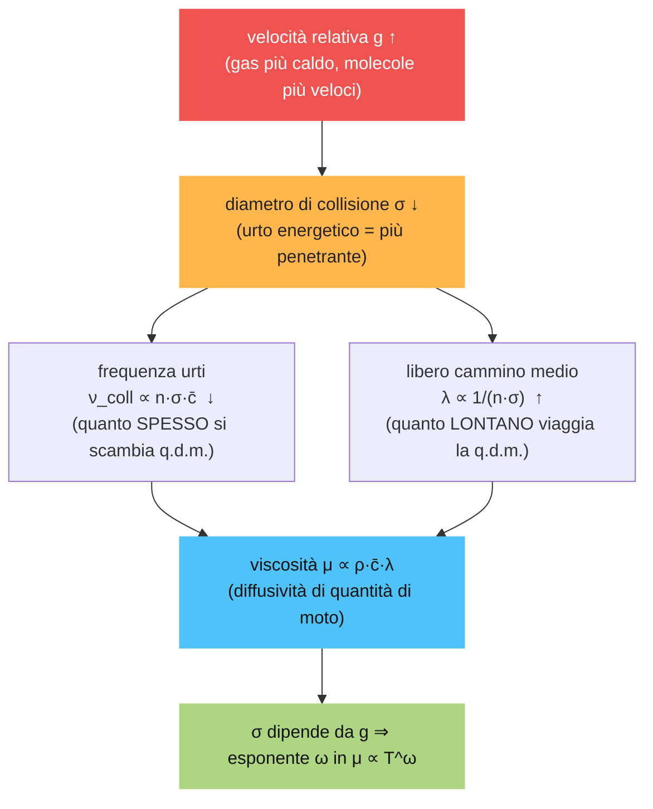

# Flussi Rarefatti e metodo DSMC (Direct Simulation Monte Carlo)

> Teoria + simulazione d'esame sul **macroargomento 3** della lezione 06-04: i **flussi rarefatti**
> (plume di ugello nel vuoto), il **numero di Knudsen** e il metodo **Monte Carlo / DSMC**. Formato
> toggle Notion; **parole chiave** in grassetto; formule LaTeX (`$...$`, `$$...$$`).
> I **chiarimenti** ($Kn$ come campo e $\lambda$ variabile, VHS e meccanismo della viscosità,
> $\Delta t<\tau_c$, $\Delta x\le\lambda$, vincolo CFL, rumore statistico) sono **integrati direttamente
> nella teoria** come note `>`. La **Parte II** raccoglie le sole domande di **simulazione d'esame**.

---

## Nomenclatura essenziale

<details>
<summary><strong>📖 Simboli e nomenclatura usati nel capitolo</strong></summary>

| Simbolo | Nome | Note |
|---|---|---|
| $Kn=\dfrac{\lambda}{L}$ | **numero di Knudsen** | è un **campo** (varia localmente) |
| $\lambda$ | **libero cammino medio** | distanza media tra due collisioni; variabile |
| $L$ | lunghezza caratteristica | scala del problema |
| $Kn<10^{-2}$ / $10^{-2}\!-\!1$ / $>1$ | regimi | **continuo** / **slip-transizionale** / **molecolare libero** |
| $\bar c$ | velocità media molecolare | da teoria cinetica |
| $\tau_c=\lambda/\bar c$ | **tempo medio tra collisioni** | scala temporale della collisione |
| $\mu(T)\propto\sqrt T$ | viscosità del gas | legata a $\lambda$; modello **VHS** |
| $\sigma\propto g^{-2\nu},\ \omega\approx0.74$ | sezione d'urto / esponente | $g$ = velocità relativa, VHS |
| $\Delta x\le\lambda$ | vincolo di **cella** (DSMC) | cella più piccola del cammino libero |
| $\Delta t\le\tau_c$ | vincolo di **passo** (DSMC) | passo più piccolo del tempo di collisione |
| $F_{num}$ | **peso** numerico | molecole reali per particella simulata |
| $\nu_{max}$ | frequenza di collisione max | schema **NTC** (No Time Counter) |
| DSMC | *Direct Simulation Monte Carlo* | particelle statistiche, non un continuo |

</details>

---

## Parte I — Teoria

<details>
<summary><strong>1. Il problema fisico: il plume di un ugello nel vuoto</strong></summary>

Un propulsore che scarica nel **vuoto** (spazio) produce un **getto (plume)** che si espande
enormemente. Vicino all'ugello il gas è **denso** e vale il **continuo** (Navier–Stokes / CFD); man
mano che si espande la densità crolla, le collisioni diventano rare e si passa al regime di
**flusso molecolare libero**, descritto dalla **teoria cinetica** (DSMC).

```
 propellant     ┌───────┐        isentropic core        streamlines
 supply  ───────┤ P0,T0 ├────────────────────────────────────────→ jet axis (x)
                └───────┘  boundary layer    ╲  Transition (freezing)
                            ╲  CONTINUUM      ╲     ╲  Free molecule flow (DSMC)
                  backflow ↖ (Navier–Stokes)  ╲      ╲
                  region                       expansion of isentropic core
```

Zone caratteristiche: **stagnation chamber** ($P_0,T_0$) → **isentropic core** + **boundary layer**
→ **continuum** (CFD) → **transition / freezing region** → **free molecule flow** (DSMC). Il problema
pratico è doppio: la **backflow region** (gas che torna indietro) provoca **contaminazione delle
superfici ottiche** del satellite e **problemi di spinta**.

</details>

<details>
<summary><strong>2. Il numero di Knudsen e i regimi</strong></summary>

Il parametro che misura la **rarefazione** è il **numero di Knudsen**, rapporto tra il **libero
cammino medio** $\lambda$ (distanza media tra due collisioni) e una **lunghezza caratteristica** $L$:

$$Kn = \frac{\lambda}{L}.$$

| $Kn$ | Regime | Modello |
|---|---|---|
| $Kn < 10^{-2}$ | **Continuo** | Navier–Stokes / CFD |
| $10^{-2} < Kn < 1$ | **Transizione** | DSMC (o cinetico) |
| $Kn > 1$ | **Molecolare libero** | Boltzmann / DSMC |

**Problema della lunghezza caratteristica.** Quale $L$? Il **diametro dell'ugello**? La **dimensione
del target**? Non è univoco. Si preferisce allora una **definizione locale basata sui gradienti**:
$$Kn = \frac{\lambda}{\,Q/|\nabla Q|\,},$$
dove $Q/|\nabla Q|$ è la **scala su cui la grandezza $Q$ varia apprezzabilmente**. Conviene usare il
**gradiente di temperatura** ($L \sim T/|\nabla T|$) perché è una grandezza **scalare, sempre definita
e regolare**, mentre il gradiente di velocità è **vettoriale/tensoriale** e si annulla in punti dove il
flusso è uniforme pur essendo rarefatto. La definizione locale rende $Kn$ un **campo**, non un numero
unico, identificando *dove* il continuo cessa di valere.

> **Cosa fa variare il campo di $Kn$ (chiarimento).** Variano **entrambi** i termini del rapporto, non
> solo il denominatore. (i) La **lunghezza locale** $L=Q/|\nabla Q|$ cambia con i **gradienti** delle
> grandezze (come sopra). (ii) **Anche il libero cammino medio $\lambda$ è un campo**: vale
> $$\lambda = \frac{1}{\sqrt{2}\,n\,\sigma},$$
> con $n$ **densità numerica** e $\sigma$ **sezione d'urto**. In un plume che si espande nel vuoto la
> **densità $n$ crolla di ordini di grandezza** procedendo a valle ⟹ $\lambda$ **cresce enormemente**;
> inoltre $\sigma$ dipende (debolmente) dalla **temperatura** nei modelli VHS/VSS. È **proprio questo
> aumento di $\lambda$** (dovuto al collasso di densità) il motore principale che fa salire $Kn$ dal
> regime continuo a quello molecolare libero lungo il getto. Quindi $Kn$ varia sia perché **$\lambda$
> aumenta** (densità che cala) sia perché **$L$ cambia** (gradienti): nel plume domina il primo.

</details>

<details>
<summary><strong>3. Il metodo Monte Carlo / DSMC</strong></summary>

In regime rarefatto **non si simulano tutte le molecole reali** (troppe): si definisce una
**particella numerica** che **rappresenta un gran numero di molecole reali** con caratteristiche
simili (stessa velocità/specie). Si introduce poi un **modello collisionale** in cui **solo le
particelle numeriche nella stessa cella** possono collidere.

**Idea di base (disaccoppiamento moto/collisioni).** Ad ogni passo $\Delta t$ si separano due fasi:

1. **Moto (free flight):** le particelle si spostano **senza interagire**:
$$x^{n+1} = x^{n} + v^{n}\,\Delta t.$$
2. **Collisioni:** **dentro ciascuna cella** si selezionano stocasticamente (Monte Carlo) coppie di
   particelle che collidono, e se ne aggiornano le velocità.
3. **Campionamento statistico:** si **mediano** le grandezze macroscopiche (densità, velocità,
   temperatura) sulle particelle di ogni cella.

```
   griglia di celle                cella di collisione (verde)
   ┌───┬───┬───┐                   ┌───────────┐
   │ · │ ↗ │ · │   le particelle    │  ·   ↗    │  solo le particelle
   ├───┼───┼───┤   si muovono,      │    ·   ·  │  DENTRO la cella
   │ ↘ │ · │ ↑ │   poi collidono    │  ·   ·    │  possono collidere
   └───┴───┴───┘   nella cella      └───────────┘
```

**Modelli collisionali** (definiscono la sezione d'urto e quindi la probabilità di collisione):

| Modello | Descrizione | Pro | Contro |
|---|---|---|---|
| **Hard Sphere (HS)** | Sfere rigide di diametro $D$ fisso (legato alla sezione d'urto); probabilità di interazione $\propto$ velocità relativa | Semplice, economico | Viscosità $\propto\sqrt{T}$ irrealistica |
| **Variable Hard Sphere (VHS)** | Diametro **effettivo** che dipende dalla velocità relativa | Riproduce bene la **viscosità reale** $\mu(T)$ | Scattering ancora isotropo |
| **Variable Soft Sphere (VSS)** | Come VHS ma con legge di **scattering** variabile | Riproduce meglio la **deflessione angolare** dopo l'urto | Più parametri da tarare |

**Viscosità equivalente.** Il fluido simulato **non è quello reale** ma quello **composto dalle
particelle numeriche**: ha una propria **viscosità equivalente** che emerge dalle collisioni. I
modelli collisionali sono tarati proprio per **correlare questa viscosità a quella del fluido reale**
$\mu(T)$ (è il criterio di scelta tra HS/VHS/VSS). Nel rarefatto la **fenomenologia è diversa** dal
continuo: la viscosità non è una proprietà imposta dal modello (come in Navier–Stokes) ma una
**conseguenza statistica** del trasporto di quantità di moto tra collisioni discrete.

> **Perché il VHS riproduce meglio la viscosità (chiarimento sui "diametri diversi").** Attenzione a
> un equivoco: il diametro variabile del VHS **non** significa avere **specie diverse** o sfere di
> taglie diverse mescolate. È che il **diametro efficace di una collisione dipende dalla velocità
> relativa $g$ della coppia che collide**: $\sigma \propto g^{-2\nu}$. Fisicamente le molecole **non**
> sono sfere rigide ma si respingono con un **potenziale "morbido"** (inverse-power-law): in una
> collisione **veloce/energetica** le molecole **si compenetrano di più** prima di respingersi, quindi
> "vedono" un **diametro efficace minore**. È **lo stesso gas** (es. aria): cambia solo il modo in cui
> ogni urto viene pesato in funzione dell'energia.
>
> **Legame con la viscosità.** In teoria cinetica la viscosità è $\mu \propto \rho\,\bar c\,\lambda
> \propto \sqrt{m k T}/\sigma$, e la sua **dipendenza dalla temperatura** $\mu \propto T^{\omega}$ è
> governata **da come $\sigma$ dipende dall'energia di collisione**. L'**Hard Sphere** ha $\sigma$
> **costante** ⟹ dà $\mu\propto\sqrt T$ ($\omega=1/2$), troppo ripida/sbagliata per i gas reali (aria
> $\omega\approx0.74$). Il **VHS**, legando $\sigma$ a $g$, **aggiusta l'esponente $\omega$** al valore
> reale ⟹ riproduce la $\mu(T)$ corretta. **E la viscosità in un gas puro?** Non servono più specie:
> la viscosità è **diffusione di quantità di moto**: molecole **dello stesso gas** trasportano, urto
> dopo urto, quantità di moto dagli strati veloci a quelli lenti. Le **due fenomenologie** (collisioni
> microscopiche ↔ viscosità macroscopica) sono **la stessa cosa** vista a due scale: la viscosità *è*
> l'effetto medio di quelle collisioni, e il modello collisionale (HS/VHS/VSS) decide **quanto bene**
> quel trasporto riproduce la $\mu(T)$ del gas reale.
>
> **Ma com'è che un urto "più forte/più debole" diventa viscosità?** È il dubbio giusto da farsi. La
> viscosità è trasferimento di quantità di moto, e in **ogni** collisione i due partner se la scambiano
> a prescindere dall'"intensità": ciò che conta non è il singolo urto, ma **due effetti** che la
> sezione d'urto $\sigma$ (cioè il diametro di collisione) controlla insieme:
> - la **frequenza di collisione** $\nu_{coll}\propto n\,\sigma\,\bar c$ → **quanto spesso** si scambia
>   quantità di moto;
> - il **libero cammino medio** $\lambda\propto 1/(n\sigma)$ → **quanto lontano** una molecola
>   **trasporta** la propria quantità di moto prima di "consegnarla" in un urto.
>
> La viscosità è la **diffusività di quantità di moto** $\mu\propto\rho\,\bar c\,\lambda$: molecole che
> attraversano uno strato e collidono **più in là** trasportano momento dagli strati veloci a quelli
> lenti. Da qui il ruolo del **diametro variabile**: un diametro di collisione **minore** (urto più
> "molle"/penetrante, tipico delle collisioni **energetiche**) ⟹ $\sigma$ minore ⟹ $\lambda$
> **maggiore** ⟹ la quantità di moto viaggia **più lontano** ⟹ **più viscosità** a parità d'altro.
> Poiché le molecole **più calde sono più veloci** (urti più energetici, $\sigma$ più piccola), **come**
> $\sigma$ dipende dalla velocità relativa **decide come $\mu$ cresce con $T$** (l'esponente $\omega$).
> Quindi non è "l'urto più forte" a dare viscosità: è che la **dimensione di collisione fissa frequenza
> e distanza** del trasporto di quantità di moto, e la sua variazione con l'energia produce la **giusta
> $\mu(T)$**.
>
**Schema della catena causale.**


> Lettura: la velocità (quindi la temperatura) cambia $\sigma$; $\sigma$ governa insieme **frequenza**
> e **distanza** del trasporto di quantità di moto; il loro bilancio *è* la viscosità, e il **modo** in
> cui $\sigma$ varia con $g$ fissa la dipendenza $\mu(T)$.

</details>

<details>
<summary><strong>4. Requisiti numerici del DSMC</strong></summary>

Perché la simulazione sia fisicamente corretta servono vincoli su **cella**, **passo temporale** e
**numero di particelle**:

- **Dimensione di cella ≤ libero cammino medio:** $\Delta x \le \lambda$. Altrimenti dentro la cella
  ci sarebbero molte collisioni "saltate": la cella deve risolvere la scala del libero cammino medio.

  > **Perché (e perché non troppo piccola).** Se la cella fosse **molto più grande** di $\lambda$, per
  > come è imposto il modello (collidono solo particelle **della stessa cella**, trattate come
  > "co-locate") delle particelle sarebbero costrette a **interagire con compagne fisicamente troppo
  > lontane** (oltre un $\lambda$) — **privo di senso fisico**, perché le collisioni reali sono
  > **locali** sulla scala $\lambda$. Meglio quindi $\Delta x\le\lambda$, che garantisce compagni di
  > collisione **genuinamente vicini**. Il limite opposto — celle **troppo piccole** — fa salire il
  > **costo** e, soprattutto, il **rumore statistico** (vedi sotto).

- **Passo temporale ≤ tempo di collisione:** $\Delta t \le \tau_c$, con $\tau_c = \lambda/\bar{c}$ e
  $\bar{c}$ velocità molecolare media. Garantisce che il moto e le collisioni siano **disaccoppiati
  correttamente** (una particella non "salta" più collisioni in un passo).

  > **$\Delta t\le\tau_c$ non *azzera* le collisioni.** Il vincolo dice che, **in media**, una
  > particella fa **al più ~una** collisione per passo — non che ne faccia esattamente una né zero. Le
  > collisioni **non** sono decise particella-per-particella in modo deterministico: **dentro ogni
  > cella** l'algoritmo (es. **NTC, No-Time-Counter**) calcola il **numero atteso di coppie collidenti**
  > nel passo $\Delta t$ da densità, sezione d'urto e velocità relative, e ne **estrae stocasticamente**
  > quel numero. Quindi su una cella con $N$ particelle avvengono comunque **diverse** collisioni a ogni
  > passo, anche se la singola particella ne fa in media meno di una. La **frequenza di collisione**
  > esce corretta **per costruzione** ($\#\text{coppie}=$ tasso $\times N\times\Delta t$): non si
  > "perdono" collisioni, le si **risolve finemente nel tempo**.

- **Vincolo tipo CFL:** $\Delta t \le \Delta x/|v_{max}|$. Una particella **non deve attraversare più
  di una cella** per passo, così collide solo con i vicini immediati prima di proseguire.

  > **Perché.** Se "saltasse" una o più celle, **non campionerebbe l'ambiente collisionale** delle
  > celle intermedie — celle in cui avrebbe dovuto avere la possibilità di collidere — e finirebbe per
  > **interagire in una cella lontana** bypassando quelle in mezzo. Questo **viola la località delle
  > collisioni** (interagiscono solo particelle co-localizzate nella stessa cella) e **falsa il
  > trasporto** di quantità di moto ed energia. La particella va quindi fatta **avanzare cella per
  > cella**, raccogliendo a ogni tappa le collisioni locali: è un vincolo di **coerenza fisica del
  > trasporto**, non (come nel continuo) di pura stabilità numerica.

- **Statistica:** $N \approx 10\text{–}50$ particelle numeriche **per cella**, per avere medie
  statistiche significative.

  > **Di che "rumore statistico" si parla (chiarimento importante).** Attenzione a un equivoco: una
  > **particella numerica non è una media di molecole reali** e **non ha una distribuzione interna da
  > mediare** — porta **un solo** stato (una posizione, una velocità, una specie) e *rappresenta* molte
  > molecole reali tramite un **peso** $F_{num}$, nient'altro. Le grandezze macroscopiche (densità,
  > velocità, temperatura) si ottengono **mediando sulle particelle numeriche *dentro la cella***:
  > **la numerosità campionaria è il numero di particelle numeriche per cella**. Perciò se la cella ne
  > contiene **poche**, la media di cella ha **varianza alta** = **rumore**. Ecco il legame col punto
  > precedente: una **cella più piccola** (a parità di densità) contiene **meno particelle numeriche**
  > ⟹ **media più rumorosa** (e anche **meno coppie candidate** per il campionamento delle collisioni,
  > quindi statistiche collisionali più rumorose). Il rumore riguarda dunque **sia i valori medi di
  > cella sia il campionamento delle collisioni**, e in entrambi i casi nasce dallo **stesso** motivo:
  > **troppe poche particelle numeriche per cella**. Per questo si chiede $\ge$30–50 particelle/cella.

  > **La particella numerica è una media delle particelle reali? No — è un *campione rappresentativo*.**
  > Questo è il punto che chiarisce tutto: una particella numerica **non** si ottiene mediando le
  > grandezze di molte molecole reali. È piuttosto **una sola molecola "campione"** a cui si assegna
  > **uno** stato — posizione $\bar x$, velocità $\bar v$, specie, energia interna — **estratto dalla
  > distribuzione locale** (es. una Maxwelliana), e che vale per **$F_{num}$ molecole reali assunte
  > nello stesso stato** (stessa velocità). Quindi:
  > - **come valuti le grandezze della particella numerica?** Non le "calcoli" come medie: la particella
  >   **porta i propri valori singoli** (esattamente come una molecola reale ne avrebbe di propri).
  >   All'inizializzazione si **campionano** dalla distribuzione di equilibrio; durante la simulazione si
  >   **aggiornano** col free-flight ($\bar x \mathrel{+}= \bar v\,\Delta t$) e con le **collisioni**
  >   (che cambiano $\bar v$). Il peso $F_{num}$ dice solo *quante* molecole reali rappresenta, non entra
  >   nei suoi valori di stato.
  > - **dov'è allora la media?** **Solo** a livello di **cella**, sulle particelle numeriche presenti:
  >   $\rho \propto F_{num}\,N_{cella}/V$, $\bar u_{macro} = \frac{1}{N}\sum_p \bar v_p$,
  >   $T \propto \frac{1}{N}\sum_p |\bar v_p - \bar u_{macro}|^2$, ecc.
  >
  > Quindi le "scale" sono tre e **non** vanno confuse: **molecole reali** (non seguite una a una) →
  > **particella numerica** (un campione con stato singolo, pesa $F_{num}$ molecole) → **media di cella**
  > (l'unica vera media, sulle particelle numeriche). La media *sulle molecole reali dentro una
  > particella* **non esiste**: la particella *è già* il campione.

</details>

---

## Parte II — Simulazione d'esame

<details>
<summary><strong>Domanda 9 — Nei flussi continui in espansione, l'angolo limite è dettato da Rankine–Hugoniot? Che equazioni governano e fino a che angolo si arriva? E nei rarefatti (backflow)?</strong></summary>

**Precisazione.** L'angolo limite di un'**espansione** non è dato da **Rankine–Hugoniot** (che governa
i salti attraverso un **urto**, cioè una compressione), ma dalla **espansione di Prandtl–Meyer**.
Nel **continuo** l'espansione di un getto supersonico nel vuoto è governata dalle equazioni di
**Eulero/Navier–Stokes** in regime supersonico (natura **iperbolica**), e l'angolo di deviazione
massimo è quello di **Prandtl–Meyer per $M\to\infty$**: un valore **finito** $\nu_{max}$ (≈ 130° per
aria, $\gamma=1.4$). Oltre quell'angolo il **continuo non può espandere**.

**Nel rarefatto (backflow).** Il gas che si ritrova **oltre l'angolo limite** del continuo — fino a
tornare **indietro** (backflow, angoli > 90°) — **non è spiegabile col continuo**: è dominato dalla
**dinamica molecolare** (collisioni rare, traiettorie quasi balistiche) e va trattato col **DSMC**.
Quindi il continuo arriva fino a $\nu_{max}$; la **backflow region** richiede il modello cinetico.

</details>

<details>
<summary><strong>Domanda 10 — Lunghezza caratteristica del Knudsen: diametro dell'ugello? del target? Perché si usa la definizione coi gradienti, e perché conviene il gradiente di temperatura?</strong></summary>

La scelta di $L$ è **ambigua**: ugello e target danno valori diversi di $Kn$ e non c'è un candidato
"giusto". Per questo si usa la **definizione locale basata sui gradienti**:
$$Kn = \frac{\lambda}{Q/|\nabla Q|},$$
dove $Q/|\nabla Q|$ è la **scala spaziale su cui $Q$ varia apprezzabilmente**: è una lunghezza
**fisica e locale**, non una dimensione geometrica arbitraria. Rende $Kn$ un **campo** che dice
**punto per punto** dove il continuo cessa di valere.

**Perché il gradiente di temperatura.** La **temperatura** è **scalare, sempre definita e regolare**;
il **gradiente di velocità** è invece **tensoriale** e si **annulla** dove il flusso è localmente
uniforme (dando $L\to\infty$, $Kn\to0$ anche in zone rarefatte). Il gradiente di temperatura fornisce
una scala robusta in tutto il plume, anche dove la velocità è quasi uniforme ma la densità sta
crollando.

</details>

<details>
<summary><strong>Domanda 11 — Numero di Knudsen: definizione, definizione operativa e range di variazione (tabelle markdown).</strong></summary>

**Definizione.** Rapporto tra **libero cammino medio** $\lambda$ e **lunghezza caratteristica** $L$:
$$Kn = \frac{\lambda}{L}.$$

**Definizione operativa (locale, coi gradienti):**
$$Kn = \frac{\lambda}{Q/|\nabla Q|},\qquad \text{tipicamente } Q=T \Rightarrow L\sim \frac{T}{|\nabla T|}.$$

**Range di variazione:**

| $Kn$ | Regime | Descrizione | Modello |
|---|---|---|---|
| $Kn < 10^{-2}$ | **Continuo** | collisioni frequentissime, equilibrio locale | Navier–Stokes |
| $10^{-2} < Kn < 1$ | **Transizione** | né continuo né molecolare puro | DSMC / cinetico |
| $Kn > 1$ | **Molecolare libero** | collisioni rare, moto quasi balistico | Boltzmann / DSMC |

</details>

<details>
<summary><strong>Domanda 12 — Particella numerica rappresentativa e modello collisionale (solo stessa cella). Modelli collisionali a confronto (tabella, nome, descrizione, pro/contro).</strong></summary>

**Particella numerica.** Non si simulano tutte le molecole reali: si definisce una **particella
numerica** che **rappresenta un gran numero di molecole reali** con caratteristiche simili. Si abbatte
così di ordini di grandezza il numero di entità da seguire.

**Modello collisionale (stessa cella).** Per evitare il calcolo $N^2$ di tutte le coppie, si ammette
che **solo le particelle numeriche dentro la stessa cella** possano collidere, scelte
**stocasticamente** (Monte Carlo). È fisicamente sensato se la cella è $\le \lambda$.

**Modelli a confronto:**

| Modello | Descrizione | Pro | Contro |
|---|---|---|---|
| **Hard Sphere (HS)** | Sfere rigide, diametro $D$ **fisso**; prob. interazione $\propto$ velocità relativa | Semplicissimo | Dipendenza viscosità–temperatura irrealistica |
| **Variable Hard Sphere (VHS)** | Diametro **effettivo** funzione della velocità relativa | Riproduce la **viscosità reale** $\mu(T)$ | Scattering isotropo (non realistico) |
| **Variable Soft Sphere (VSS)** | VHS + legge di **scattering** variabile | Riproduce meglio la **deflessione** post-urto e la diffusione | Più parametri, taratura |

</details>

<details>
<summary><strong>Domanda 13 — Idea alla base del Monte Carlo: come funziona, come si raggruppano le particelle e caratteristiche correlate.</strong></summary>

**Idea base.** Si risolve l'equazione di **Boltzmann** in modo **stocastico**, **disaccoppiando** ad
ogni $\Delta t$ il **moto** dalle **collisioni**:

1. **Moto libero:** ogni particella avanza senza interagire, $x^{n+1}=x^n+v^n\Delta t$.
2. **Collisioni stocastiche:** **dentro ogni cella** si estraggono casualmente coppie collidenti (con
   probabilità legata alla velocità relativa e al modello HS/VHS/VSS) e si aggiornano le velocità.
3. **Campionamento:** si **mediano** sulle particelle di cella le grandezze macroscopiche.

**Raggruppamento.** Le particelle si raggruppano **per cella** (è l'unità di collisione e di media) e
ciascuna particella numerica **raggruppa molte molecole reali** simili. Le caratteristiche correlate
sono **posizione, velocità, specie chimica** ed eventuale **energia interna** (rotazionale/vibrazionale)
nei modelli più completi.

</details>

<details>
<summary><strong>Domanda 14 — Viscosità equivalente: il fluido simulato non è quello reale ma quello delle particelle numeriche. Correlazioni con la viscosità reale; fenomenologia diversa dal continuo.</strong></summary>

**Concetto.** Il fluido che il DSMC "studia" è **quello composto dalle particelle numeriche**, non il
fluido reale. Da esse emerge, per via statistica, una **viscosità equivalente** dovuta al **trasporto
di quantità di moto** tra collisioni discrete.

**Correlazione con la viscosità reale.** I parametri dei modelli collisionali (diametro/esponente di
HS, VHS, VSS) si **tarano** in modo che la viscosità equivalente **riproduca la viscosità reale**
$\mu(T)$ del gas. È proprio il criterio per cui si preferisce **VHS/VSS** all'HS: l'HS dà
$\mu\propto\sqrt T$, lontano dal reale; VHS aggancia la dipendenza corretta.

**Fenomenologia diversa dal continuo.** In Navier–Stokes la viscosità è una **proprietà imposta** nel
modello (un coefficiente nel tensore degli sforzi); nel rarefatto è una **conseguenza statistica** del
moto molecolare. Inoltre emergono effetti **non-continui** (slittamento alle pareti, salto di
temperatura, non-equilibrio termico) assenti nel continuo.

</details>

<details>
<summary><strong>Domanda 15 — Perché i metodi per flussi rarefatti non "esplodono" come quelli continui (che usano gradienti)? Quali metodi oltre al Monte Carlo (tabella, pro/contro, focus stabilità)?</strong></summary>

**Perché non "esplodono".** I metodi continui calcolano **flussi tramite gradienti** (derivate
spaziali): dove i gradienti diventano grandi/discontinui (urti, espansioni violente) gli schemi
possono **oscillare o divergere**. Il DSMC **non usa gradienti**: integra la **seconda legge della
dinamica** sulle singole particelle ($x^{n+1}=x^n+v^n\Delta t$) e tratta le collisioni in modo
**statistico/probabilistico**. Non c'è nessuna derivata spaziale da far esplodere: il metodo è
**intrinsecamente robusto** anche in forti non-equilibri (il "prezzo" è il **rumore statistico**,
non l'instabilità).

**Metodi per flussi rarefatti:**

| Metodo | Descrizione | Pro | Contro / stabilità |
|---|---|---|---|
| **DSMC (Monte Carlo)** | Particelle + collisioni stocastiche | Robusto, fisico in non-equilibrio | **Rumore statistico**, costo a basso $Kn$ |
| **Soluzione diretta di Boltzmann** | Discretizza l'eq. di Boltzmann nello spazio delle velocità | Niente rumore statistico | Costo enorme (dim. velocità), collisione complessa |
| **Modelli BGK / cinetici semplificati** | Operatore di collisione approssimato (rilassamento) | Più economici, deterministici | Approssimano la collisione; meno accurati |
| **Metodi ibridi CFD–DSMC** | Continuo dove $Kn$ basso, DSMC dove alto | Efficienti su domini misti (plume) | Accoppiamento all'interfaccia delicato |

**Focus stabilità.** DSMC e Boltzmann diretto sono **stabili per costruzione** (nessun gradiente
amplificato); il limite del DSMC è la **convergenza statistica** (serve mediare su molte particelle),
non la stabilità numerica.

</details>

<details>
<summary><strong>Domanda 16 — I requisiti sono specifici del DSMC o generalizzabili? Significato del minimo di particelle (30–50) e di "statistico". Il vincolo CFL ($\Delta t<\Delta x/v_{max}$), il tempo termico, e $\Delta x\le\lambda$: spiega ciascuno e i legami con la CFL del continuo.</strong></summary>

**Di chi sono i requisiti.** Sono **specifici del DSMC** (e dei metodi a particelle): nascono dal
**disaccoppiamento moto/collisioni** e dalla **natura statistica**. Alcuni si **generalizzano** ai
metodi cinetici (il vincolo cella–libero cammino medio vale per ogni metodo che voglia risolvere la
scala collisionale), ma il vincolo sul **numero di particelle** è proprio dei metodi **a particelle**.

**Minimo di particelle (≈30–50 per cella) e "statistico".** Le grandezze macroscopiche sono **medie**
sulle particelle di cella; con poche particelle la media ha **varianza alta** (rumore). "Statistico"
significa che ogni grandezza è una **media campionaria**: serve un campione abbastanza grande
(legge dei grandi numeri) perché sia **indicativa**. Le singole particelle **non sono indicative** —
e in effetti **non corrispondono a particelle reali** ma ne **rappresentano molte**: solo la **media
di cella** ha significato fisico. È quindi una **questione di significatività statistica**, non una
proprietà del singolo "punto".

**$\Delta t \le \Delta x/v_{max}$ (tipo CFL).** Una particella **non deve attraversare più di una
cella per passo**, così collide con i **vicini immediati** prima di proseguire. Se "saltasse" celle,
mancherebbe collisioni e il trasporto sarebbe sbagliato. Quando una particella raggiunge il **bordo**
della cella la si lascia **passare alla cella adiacente** (e lì collide al passo dopo).
*Somiglianza con la CFL del continuo:* entrambe impongono che l'informazione non viaggi più di una
cella per passo. *Differenza:* nel continuo la CFL è un **vincolo di stabilità dello schema**; nel
DSMC è un **vincolo di coerenza fisica** del trasporto a particelle (lo schema non diverge comunque).

**$\Delta t \le \tau_c$ (tempo caratteristico termico/collisionale).** È legato al **tempo medio tra
due collisioni** $\tau_c=\lambda/\bar c$ ($\bar c$ velocità molecolare media, di natura **termica**):
risolvere $\tau_c$ garantisce che il disaccoppiamento moto→collisione sia valido (non si "accumulano"
più collisioni in un passo).

**$\Delta x \le \lambda$.** Se la cella fosse più grande del **libero cammino medio**, le particelle
numeriche **non interagirebbero coi vicini corretti**: il libero cammino medio è la scala su cui
avvengono le collisioni, quindi è la scala che la cella deve risolvere. Poiché tutto è **mediato** e
le particelle numeriche rappresentano molte molecole, **serve comunque il modello collisionale** per
descrivere le interazioni dentro la cella. **Vogliamo** che celle/particelle vicine interagiscano
perché è così che si trasportano **quantità di moto ed energia** (cioè emergono viscosità e
conducibilità equivalenti): senza interazione di prossimità non ci sarebbe **trasporto**.

</details>

<details>
<summary><strong>Domanda di sintesi (livello esame) — Un plume nel vuoto ha $Kn=5\cdot10^{-3}$ in gola e $Kn=8$ a valle. Quale modello usi nelle due zone e come le raccordi? Perché in gola il DSMC sarebbe inefficiente?</strong></summary>

**In gola ($Kn=5\cdot10^{-3}<10^{-2}$):** regime **continuo** → **Navier–Stokes/CFD**.
**A valle ($Kn=8>1$):** regime **molecolare libero** → **DSMC**.
**Raccordo:** approccio **ibrido CFD–DSMC**, con interfaccia posta dove $Kn$ attraversa la soglia
(≈ transizione, $10^{-2}$–$1$); sull'interfaccia il CFD fornisce le distribuzioni di ingresso alle
particelle DSMC.

**Perché il DSMC è inefficiente in gola.** A basso $Kn$ il libero cammino medio $\lambda$ è
**piccolissimo**, quindi servirebbero celle $\Delta x\le\lambda$ molto fini, $\Delta t\le\tau_c$ molto
piccoli e **moltissime particelle** (≥30–50 per cella su tantissime celle): il costo esplode. Lì il
**continuo** è sia valido sia molto più economico.

</details>

---

## Formule da ricordare (memo)

<details>
<summary><strong>🧠 Tutte le formule chiave del capitolo, con hint per ricordarle</strong></summary>

### Rarefazione e Knudsen

| Formula | Hint / collegamento |
|---|---|
| $Kn = \dfrac{\lambda}{L}$ | "Quanto è grande il **vuoto tra urti** rispetto al problema": $\lambda$ grande ⟹ rarefatto. Soglie $10^{-2}$ (continuo) e $1$ (molecolare libero). |
| $Kn = \dfrac{\lambda}{Q/|\nabla Q|}$ | Versione **locale**: $L$ diventa la scala su cui $Q$ varia ($Q/|\nabla Q|$). Rende $Kn$ un **campo**. Usa $Q=T$ (scalare, sempre definito) ⟹ $L\sim T/|\nabla T|$. |
| $\lambda = \dfrac{1}{\sqrt{2}\,n\,\sigma}$ | $\lambda$ è un **campo**: nel plume $n$ crolla ⟹ $\lambda$ esplode ⟹ $Kn$ sale. Il $\sqrt2$ viene dal moto relativo del bersaglio. |

### Tempi, collisioni e modello VHS

| Formula | Hint / collegamento |
|---|---|
| $\tau_c = \dfrac{\lambda}{\bar c}$ | Tempo medio tra urti = distanza tra urti / velocità termica. Fissa il **passo DSMC** ($\Delta t\le\tau_c$). |
| $\nu_{coll} \propto n\,\sigma\,\bar c$ | **Quanto spesso** si scambia quantità di moto. Frequenza ∝ densità × bersaglio × velocità. |
| $\sigma \propto g^{-2\nu}$ | **VHS**: urto più **veloce/energetico** ($g$ grande) ⟹ diametro efficace **minore** (più penetrante). È lo stesso gas, cambia solo il peso dell'urto. |
| $\mu \propto \rho\,\bar c\,\lambda \propto \dfrac{\sqrt{mkT}}{\sigma}$ | Viscosità = **diffusività di quantità di moto**: $\sigma$ minore ⟹ $\lambda$ maggiore ⟹ q.d.m. trasportata **più lontano** ⟹ più $\mu$. |
| $\mu \propto T^{\omega}$ | HS: $\sigma$ costante ⟹ $\omega=1/2$ ($\mu\propto\sqrt T$, sbagliato). VHS aggancia $\sigma(g)$ ⟹ $\omega\approx0.74$ (aria) reale. |

### Algoritmo DSMC e vincoli numerici

| Formula | Hint / collegamento |
|---|---|
| $x^{n+1} = x^{n} + v^{n}\,\Delta t$ | **Free flight**: moto e collisioni **disaccoppiati**. Niente gradienti ⟹ metodo robusto (non "esplode"). |
| $\Delta x \le \lambda$ | La **cella** deve risolvere la scala degli urti: compagni di collisione **genuinamente vicini**. Troppo piccola ⟹ poche particelle ⟹ rumore. |
| $\Delta t \le \tau_c$ | Il **passo** risolve il tempo tra urti: in media ≤ ~1 collisione/particella/passo (non zero: NTC estrae il n° di coppie). |
| $\Delta t \le \dfrac{\Delta x}{|v_{max}|}$ | Vincolo **tipo CFL**: la particella non salta più di una cella/passo. Nel continuo è stabilità, nel DSMC è **coerenza fisica** del trasporto. |
| $N \approx 10\text{–}50$ /cella | Significatività **statistica**: poche particelle ⟹ varianza alta ⟹ **rumore**. La media di cella è l'unica vera media. |

### Medie di cella e peso numerico

| Formula | Hint / collegamento |
|---|---|
| $\rho \propto \dfrac{F_{num}\,N_{cella}}{V}$ | $F_{num}$ = **molecole reali per particella numerica**. La particella porta uno stato singolo, pesa $F_{num}$. |
| $\bar u_{macro} = \dfrac{1}{N}\sum_p \bar v_p$ | Velocità macroscopica = media delle velocità delle particelle **nella cella**. |
| $T \propto \dfrac{1}{N}\sum_p \lvert \bar v_p - \bar u_{macro}\rvert^2$ | Temperatura = **varianza** delle velocità attorno alla media (agitazione termica). |

### Continuo vs rarefatto (limite di espansione)

| Formula | Hint / collegamento |
|---|---|
| $\nu_{max}\approx130^\circ$ ($M\to\infty$, $\gamma=1.4$) | Angolo limite di **Prandtl–Meyer** (espansione, NON Rankine–Hugoniot). Oltre ⟹ **backflow** ⟹ serve DSMC. |

</details>

---

## Dimostrazioni (lista)

<details>
<summary><strong>📐 Dimostrazioni da saper fare</strong></summary>

| Dimostrazione | Punto di partenza → arrivo |
|---|---|
| Derivazione dei limiti di validità del continuo da $Kn$ | $Kn=\lambda/L$ con $\lambda=1/(\sqrt2\,n\sigma)$ → soglie $10^{-2}$ e $1$ (continuo / transizione / molecolare libero) |
| Perché nel plume $Kn$ cresce a valle ($\lambda$ come campo) | $\lambda\propto 1/n$ e crollo di densità nel vuoto → $\lambda$ esplode → $Kn$ sale al regime molecolare libero |
| Scaling della viscosità del modello VHS | $\mu\propto\rho\,\bar c\,\lambda$ e $\sigma\propto g^{-2\nu}$ → $\mu\propto T^{\omega}$ con $\omega=\nu+\tfrac12$ (HS: $\tfrac12$; VHS aria: $\approx0.74$) |
| Vincolo di cella DSMC | località delle collisioni sulla scala $\lambda$ → $\Delta x\le\lambda$ |
| Vincolo di passo DSMC | disaccoppiamento moto/collisioni e $\tau_c=\lambda/\bar c$ → $\Delta t\le\tau_c$ (NTC, $\le\!\sim\!1$ collisione/particella/passo) |
| Vincolo tipo CFL del DSMC | avanzamento cella per cella per non saltare l'ambiente collisionale → $\Delta t\le\Delta x/|v_{max}|$ |

</details>
