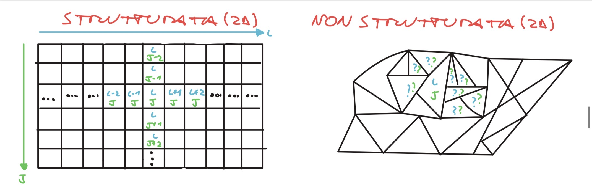
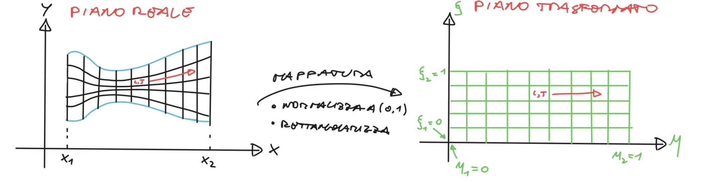
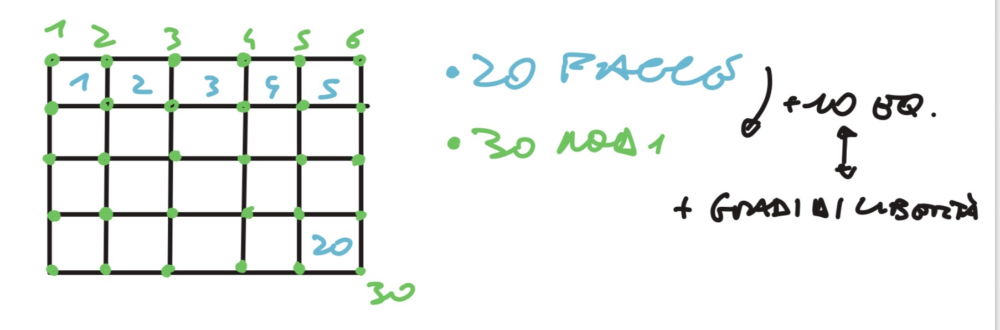
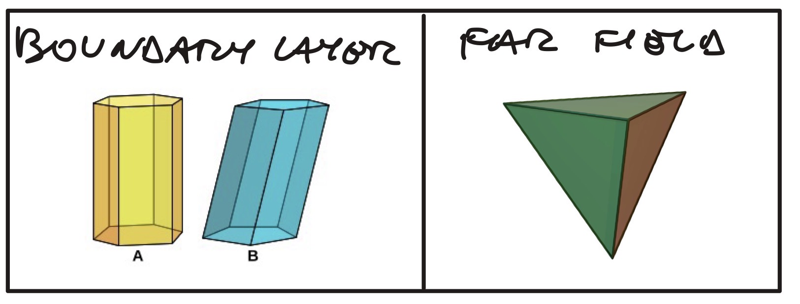

# Meshing

## Nomenclatura essenziale

<strong>📖 Simboli e nomenclatura usati nel capitolo</strong>

| Simbolo / termine | Nome | Note |
|---|---|---|
| $U_j=\frac1V\int_V u\,dV$ | **valor medio di cella** | incognita dei volumi finiti |
| $V,\ S$ | volume di controllo / sua superficie | $V\,\partial_t U_j=-\int_S\vec F\cdot\vec n\,dS$ |
| $\vec F,\ \vec n$ | flusso / **normale uscente** | bilancio di bordo |
| $\eta,\ \xi$ | **coordinate computazionali** | mapping algebrico al piano trasformato |
| $\vec v_g$ | **velocità della mesh** (ALE) | $\vec v_g=0$ Euleriano, $\vec v_g=\vec v$ Lagrangiano |
| $\vec v_{rel}=\vec v-\vec v_g$ | velocità **relativa** fluido–griglia | termine convettivo ALE |
| ALE / GCL | *Arbitrary Lagrangian–Eulerian* / *Geometric Conservation Law* | mesh mobili; GCL evita "massa fantasma" |
| Aspect Ratio | lato lungo / lato corto | alto → mal condizionamento |
| Skewness | deformazione vs forma regolare | $\approx0$ ideale |
| Orthogonality | allineamento centro-celle vs normale faccia | $\approx1$ ideale |
| Expansion (Smoothness) Ratio | salto di dimensione tra celle vicine | salti bruschi → riflessioni |
| Jacobiano (det) | distorsione della trasformazione | $\det\le0$ → **volume negativo** (overlap) |

---

## Tipologie di mesh

<strong>Tipologie</strong>

1. Strutturate e non 
    
    
    
2. Algebrica 
    
    
    
    $$
    x = x_1 + \eta(x_2 - x_1) \Rightarrow \eta = \frac{x - x_1}{x_2 - x_1} \longrightarrow \begin{cases} \text{Se } x = x_1 \Rightarrow \eta = 0 \text{ (estremo sinistro)} \\ \text{Se } x = x_2 \Rightarrow \eta = 1 \text{ (estremo destro)} \end{cases}
    $$
    
    $$
    y = y_1 + \xi(y_2 - y_1) \Rightarrow \xi = \frac{y - y_1}{y_2 - y_1} \longrightarrow \begin{cases} \text{Se } y = y_1 \Rightarrow \xi= 0 \text{ (estremo sinistro)} \\ \text{Se } y = y_2 \Rightarrow \xi = 1 \text{ (estremo destro)} \end{cases}
    $$
    
3. Ellittica 
    
    Risolvono equazioni di Laplace-Poisson (Laplaciano=0)
    
4. Iperbolica
5. Delaunay (metodo globale)
    
    Si basa sulla **proprietà del cerchio vuoto**: per ogni faccia di un triangolo, il cerchio circoscritto non deve contenere altri nodi della mesh.
    
    - **Come funziona:** Si crea una nuvola di punti e si connettono seguendo criteri geometrici globali.
    - **Pro:** Garantisce matematicamente che i triangoli siano i "meno deformati" possibili per quei nodi.
    - **Contro:** Fa fatica a rispettare i bordi complessi (serve il "Constrained Delaunay").
6. Advancing Front (metodo locale)
    
    I metodi **Advancing Front** partono dalle pareti e "iniettano" elementi nel dominio. A differenza dei metodi basati su Delaunay, non devono riempire tutto lo spazio basandosi su una nuvola di punti pre-esistente. Questo permette di gestire meglio geometrie con vuoti interni o "cavità", perché l'algoritmo costruisce la maglia "strato dopo strato" adattandosi alla forma del vuoto man mano che lo incontra.
    
    - **Come funziona:** Parte dai bordi (frontiere) e "stende" nuovi elementi verso l'interno, uno alla volta, come se stesse costruendo un muro di mattoni.
    - **Pro:** Eccellente nel seguire le geometrie e nel gestire le densità variabili.
    - **Contro:** Può "incartarsi" al centro del dominio dove i fronti che arrivano da direzioni diverse si scontrano, creando elementi di pessima qualità.
7. Tabella riassuntiva
    
    
    | Regolarità  | Nome | Pro | Contro |
    | --- | --- | --- | --- |
    | Strutturata | Algebrica  | Velocissime | Poco controllo sull'ortogonalità e sulla curvatura vicino ai bordi; rischio di "overlap" degli elementi. |
    | Strutturata | Ellittica  | Estremamente lisce (proprietà di "smoothing" delle ellittiche), ottime per domini chiusi. | Costose computazionalmente (serve un solutore iterativo) |
    | Strutturata  | Iperbolica | Ortogonalità eccellente vicino alla superficie, ottime per flussi esterni (es. profili alari). | Possono generare "shock" nella griglia (elementi che si incrociano) se il bordo ha curvature brusche. |
    | Non strutturata | Delaunay |  |  |
    | Non strutturata | Frontale |  |  |

## Discretizzazione ai volumi finiti

<strong>Facce e Nodi centrati</strong>

Introdotta la discretizzazione spaziale, si definisce il **valor medio di cella**
$U_j = \frac{1}{V}\int_V u\,dV$, e la legge di conservazione in forma integrale diventa:

$$\frac{\partial}{\partial t}\int_V u\,dV = -\int_S \vec{F}\cdot\vec{n}\,dS
\;\;\Rightarrow\;\; V\,\frac{\partial U_j}{\partial t} = -\int_S \vec{F}\cdot\vec{n}\,dS$$

(questa forma presuppone **volumi di controllo fissi nel tempo**; se il dominio si deforma —
flutter aeroelastico, vibrazione di pale — si passa ai metodi **ALE**, vedi sotto).

In una griglia **Cell-Centered**, le variabili sono al centro della cella. In una **Vertex-Centered**, sono ai nodi.

- **Perché la griglia duale?** Per creare volumi di controllo attorno ai nodi (nodi centrati).
- **Vantaggio:** In geometrie complesse o mesh strutturate "adattive", la griglia duale permette una gestione più rigorosa della **conservazione della massa** e una stima dei gradienti più fluida tra elementi adiacenti.
- **Costo:** Devi memorizzare due strutture dati (la mesh originale e quella duale), aumentando il consumo di RAM.

> Noi ci focalizzeremo principalmente su quelli a facce centrate
> 

<strong>Arbitrary Lagrangian-Eulerian ALE (approfondimento)</strong>

**1. Il Dilemma: Eulerian vs. Lagrangian**

Prima dell'ALE, avevamo due modi principali per descrivere il movimento:

- **Approccio Euleriano (Il "Casello Autostradale"):** Il volume di controllo (la cella del tuo screenshot) è **fisso** nello spazio. Il fluido ci passa attraverso. È perfetto per i fluidi, ma se il confine del dominio si muove (pensa a una valvola che si chiude), è un incubo descrivere cosa succede esattamente sulla superficie.
- **Approccio Lagrangiano (Il "GPS in auto"):** La cella si muove **insieme** alle particelle di fluido. È ottimo per i solidi o per seguire interfacce precise, ma se il fluido inizia a ruotare o a creare vortici (grandi deformazioni), la tua maglia (mesh) si distorce così tanto da diventare matematicamente inutilizzabile.

**2. La Logica ALE: "Libertà di Movimento"**

L'approccio ALE introduce una terza via: la velocità della mesh (\vec{v}_g) non deve essere né zero (Euleriano), né uguale alla velocità del fluido \vec{v} (Lagrangiano). **Può essere arbitraria.**

Ecco come funziona la logica: si introduce una **velocità relativa** tra fluido e griglia,

$$\vec{v}_{rel} = \vec{v} - \vec{v}_g$$

dove $\vec v_g$ è la velocità della mesh ($\vec v_g=0$ → Euleriano, $\vec v_g=\vec v$ → Lagrangiano).

**3. Modifica delle Equazioni (Rispetto al tuo screenshot)**

Nel tuo screenshot, l'equazione (3.1) assume volumi fissi. In un contesto ALE, l'equazione del trasporto deve essere corretta per tenere conto del fatto che i confini S si muovono.

Utilizzando il **Teorema del Trasporto di Reynolds**, la variazione di una grandezza $u$ in un volume $V(t)$ che cambia nel tempo diventa:

$$\frac{d}{dt}\int_{V(t)} u\,dV + \int_{S(t)} \vec{F}(u)\cdot\vec{n}\,dS = 0$$

Dove il flusso $\vec{F}(u)$ deve ora considerare che la superficie "scappa" o "viene incontro" al fluido. Se consideriamo un termine convettivo semplice $u\vec{v}$, in ALE diventa:

$$\int_{S(t)} u\,(\vec{v} - \vec{v}_g)\cdot\vec{n}\,dS$$

**4. Perché è fondamentale? (Applicazioni pratiche)**

Senza ALE, non potremmo simulare con precisione fenomeni complessi come:

- **Aeroelasticità (Flutter):** Come citato nel testo, quando l'ala di un aereo vibra a causa del vento. La mesh deve seguire la deformazione dell'ala senza "annodarsi" su se stessa.
- **Interazione Fluido-Struttura (FSI):** Il sangue che scorre in un'arteria elastica che si espande e contrae.
- **Combustione nei motori:** Il pistone che sale e scende comprime letteralmente le celle della mesh.

**Il "Prezzo" da pagare: La Legge di Conservazione Geometrica (GCL)**

C'è un piccolo inghippo: se muovi la mesh in modo arbitrario, devi assicurarti che il movimento stesso non generi "massa fantasma" o "energia dal nulla". Gli algoritmi ALE devono soddisfare la **GCL**, che garantisce che se il fluido fosse a riposo e la mesh si muovesse, la soluzione rimarrebbe costante.

È un po' come cercare di filmare un corridore correndo accanto a lui: se non tieni la telecamera ferma rispetto al soggetto, l'immagine risulterà mossa o distorta!

<strong>Definizioni</strong>

Gli elementi sono delle geometrie bidimensionali o tridimensionali che descrivono la mesh

I nodi sono i punti in cui si calcolerà il risultato

## Qualità della mesh

<strong>Problemi</strong>

- **Ortogonalità:** L'angolo tra il vettore che unisce i centri di due celle e il vettore normale alla faccia comune. Se non sono paralleli (non-ortogonalità), il calcolo dei gradienti introduce errori di approssimazione pesanti.
- **Curvatura:** Se la mesh non segue bene la curvatura della geometria, si creano "scalini" fittizi che generano turbolenza numerica artificiale.
- **Expansion Ratio (Rapporto di Espansione):** La variazione di dimensione tra una cella e la sua vicina. Salti bruschi (es. una cella 10 volte più grande della precedente) riflettono le onde numeriche e causano instabilità.
- **Aspect Ratio (Rapporto d'Aspetto):** Rapporto tra lato lungo e lato corto. In zone di alto gradiente (strato limite), vogliamo elementi molto schiacciati, ma un valore eccessivo (>1000) rende il sistema lineare "mal condizionato".
- **Skewness (Sbilanciamento):** Quanto l'elemento è deformato rispetto a una forma ideale (es. un triangolo equilatero). Più è alta, più l'interpolazione è imprecisa.
- Il **rischio di overlap** (sovrapposizione) si verifica quando gli elementi si incrociano o hanno un **volume negativo** (il determinante dello Jacobiano della trasformazione è \le 0).

<strong>Mesh Metrics</strong>

<aside>
💡 Le metriche servono a valutare la qualità della mesh così da fare dei test e correggerla se necessario

</aside>

| Metrica Mesh | Descrizione | Formula | Range |
| --- | --- | --- | --- |
| **Element Size** | Dimensione degli elementi nella mesh | Variabile in base al tipo di mesh, ad esempio lunghezza del lato di un elemento triangolare | Dipende dalla geometria e dalle specifiche del problema |
| **Aspect Ratio** | Rapporto tra la lunghezza più lunga e quella più corta di un elemento | \( \text{{Aspect Ratio}} = \frac{{\text{{Lunghezza maggiore}}}}{{\text{{Lunghezza minore}}}} \) | Valori vicini a 1 per elementi "ben formattati" |
| **Skewness** | Misura della deformazione degli elementi rispetto a una forma geometricamente regolare | \( \text{{Skewness}} = \text{{Somma degli angoli interni di un elemento - Somma degli angoli interni di un elemento regolare}} \) | Idealmente vicino a 0 per un'ottima forma |
| **Orthogonality** | Misura l'ortogonalità degli elementi rispetto ai loro confini | Orthogonality = 1 - (minimi quadrati della differenza tra il vettore normale del lato e il vettore tangente del confine) | Idealmente vicino a 1 per mesh ortogonali |
| **Conformity** | Misura la conformità degli elementi alla geometria circostante | \( \text{{Conformity}} = \frac{{\text{{Area sovrapposta tra gli elementi e la geometria circostante}}}}{{\text{{Area totale degli elementi}}}} \) | Valori vicini a 1 per mesh conformi |
| **Jacobiano** | Valuta la distorsione geometrica di un elemento rispetto all'originale | \( \text{{Jacobiano}} = \text{{Determinante della matrice Jacobiana di trasformazione}} \) | Positivo per elementi non deformi |
| **Density** | Numero di elementi per unità di area o volume | \( \text{{Density}} = \frac{{\text{{Numero totale di elementi}}}}{{\text{{Area o Volume}}}} \) | Dipende dalla complessità della geometria e dalla risoluzione richiesta |

## Scelte ed elementi commerciali

<strong>Scelte commerciali</strong>

| Forma | Discretizzazione Prevalente | Uso Commerciale | Pro / Contro |
| --- | --- | --- | --- |
| **Esaedrica** | FVM / FEM | Strati limite, canali, ali. | **+** Alta precisione, meno celle. **-** Difficile da automatizzare. |
| **Tetraedrica** | FEM / FVM | Geometrie complesse (motori, valvole). | **+** Automatica al 100%. **-** Molta diffusione numerica. |
| **Poliedrica** | FVM (Volumi Finiti) | Standard moderno (Fluent, Star-CCM+). | **+** Molte facce = gradienti migliori. **-** Pesante in memoria. |

## Generazione e raffinamento della mesh

<strong>Mesh Generation Techniques</strong>

- **Automatic Mesh Generation**
    - Overview of automatically generating meshes.
- **Manual Mesh Generation**
    - Understanding the process of manually creating meshes.
- **Hybrid Meshing**
    - Combining automatic and manual meshing techniques.

<strong>Mesh Refinement Techniques</strong>

- **Adaptive Mesh Refinement**
    - Explanation of adaptive mesh refinement strategies.
- **Local Refinement**
    - Understanding how local refinement enhances mesh quality.
- **Global Refinement**
    - Overview of globally refining the mesh.

<strong>Meshing Options</strong>

<strong>Match control and pinching</strong>

se due elementi di una mesh hanno una faccia a contatto tra di loro (cosa frequente nel caso di accoppiamenti) si utilizza la funzione match Control. Se due elementi presentano una porzione di superficie in comune (ma non tutta) allora si utilizza il pinching per evitare problemi di tipo numerico

<strong>Refinement</strong>

questo strumento permette di aumentare la densità della mesh in alcuni punti di interesse

<strong>Inflation</strong>

permette di aumentare il numero di oggetti in prossimità dei bordi per valutare meglio le condizioni al contorno

<strong>Weld</strong>

permette di saldare insieme meche differenti evitando problemi di continuità

## Strategie, software e parametri

<strong>Meshing Strategies</strong>

- **Meshing for Fluid Flow**
    - Strategies for meshing focused on fluid flow simulations.
- **Meshing for Structural Analysis**
    - Techniques for meshing structures in simulations.
- **Meshing for Heat Transfer**
    - Considerations in meshing for heat transfer simulations.

<strong>Meshing Software and Tools</strong>

- **ANSYS**
    - Introduction to ANSYS as a meshing software.
- **OpenFOAM**
    - Overview of meshing capabilities in OpenFOAM.
    
- **Gmsh**
    - Understanding the meshing capabilities of Gmsh.
- **MeshLab**
    - Ove

<strong>Parameters</strong>

Structured=(Facile da generare, poco precisa per strutture complesse) /Non structured 
Soft/Hard (distingue quelli automatizzati dal pc da quelli definiti in modo rigoroso)

| **Meshing Type** | **Description** | **Use Case** |
| --- | --- | --- |
| Element Size | Directly specifying the size of mesh elements to control local refinement or coarsening. | Fine-tuning mesh resolution in specific regions with varying requirements. |
| Number of Elements | Defining the number of elements in a particular region, allowing control over overall mesh density. | Achieving a desired level of detail or managing computational resources. |
| Sphere of Influence | Assigning influence zones where the mesh adapts based on surrounding geometry or solution characteristics. | Adapting mesh near complex features or regions critical to the solution. |
| Factor of Global Size | Adjusting mesh elements based on a global scaling factor, influencing the entire mesh uniformly. | Quickly modifying overall mesh density without specifying local details. |

<strong>Bias</strong>

<aside>
💡 Mesh bias, in the context of computational meshing, refers to the intentional distortion or refinement of mesh elements in specific regions of a simulation domain. This is done to enhance the accuracy or efficiency of a simulation by placing more mesh elements in areas of interest. Mesh biasing is a strategic approach to allocate computational resources where they are most needed, focusing on critical regions while using coarser mesh elsewhere.

</aside>

| **Bias Name** | **Description** | **Use Case** |
| --- | --- | --- |
| Refinement Bias | Increasing mesh density in regions with high gradients or rapid changes in the solution. | Near boundaries, sharp geometrical features, or regions with complex flow patterns. |
| Grading Bias | Gradually changing mesh size in a specific direction to capture boundary layer effects. | Boundary layer where fluid velocity changes from zero at the wall to a maximum in the free stream. |
| Clustering Bias | Concentrating mesh elements in a particular region to achieve higher resolution. | Vicinity of shocks, wakes, or regions with intricate fluid dynamics. |
| Spacing Bias | Controlling the spacing between mesh elements based on desired accuracy or efficiency criteria. | Balancing computational cost and solution accuracy. |
| Transition Bias | Gradual transition from fine to coarse mesh to avoid sudden changes and minimize numerical errors. | Regions where abrupt changes in mesh size might lead to instability or inaccuracies. |

---

## Formule da ricordare (memo)

<strong>🧠 Le poche formule/metriche del capitolo (in meshing si misura, non si deriva)</strong>

> Nota: il meshing è soprattutto geometria e criteri di qualità. Quasi tutte le "formule" qui sono **definizioni di metriche**: utili come check, non come derivazioni.

| Formula | Hint / collegamento |
|---|---|
| $V\,\dfrac{\partial U_j}{\partial t} = -\int_S \vec F\cdot\vec n\,dS$ | Bilancio FVM su volume **fisso**: la cella cambia solo per i flussi sul bordo. Base dei volumi finiti. |
| $U_j=\dfrac1V\int_V u\,dV$ | Incognita = **media di cella**, non valore puntuale. "Una cella, un numero". |
| $\dfrac{d}{dt}\int_{V(t)} u\,dV + \int_{S(t)} u\,(\vec v-\vec v_g)\cdot\vec n\,dS = 0$ | Versione **ALE** (mesh mobile): conta la velocità **relativa** $\vec v_{rel}=\vec v-\vec v_g$. Reynolds transport theorem. |
| $\vec v_g=0$ → Euleriano,  $\vec v_g=\vec v$ → Lagrangiano | I due estremi dell'ALE: cella ferma (casello) vs cella che insegue il fluido (GPS). |
| $\eta=\dfrac{x-x_1}{x_2-x_1},\ \ \xi=\dfrac{y-y_1}{y_2-y_1}$ | Mapping **algebrico** al piano $(\eta,\xi)\in[0,1]$: estremi → 0 e 1. Mesh strutturata. |
| Aspect Ratio $=\dfrac{\text{lato maggiore}}{\text{lato minore}}$ | Ideale $\approx1$; $>1000$ → sistema **mal condizionato**. Alto solo nello strato limite. |
| Skewness $=\sum\text{angoli interni}-\sum\text{angoli forma regolare}$ | Ideale $\approx0$: lontano dalla forma regolare → interpolazione imprecisa. |
| Orthogonality $=1-(\text{scarto normale faccia vs allineamento centri})$ | Ideale $\approx1$: se centri e normale non sono allineati → errori sui gradienti. |
| Expansion (Smoothness) Ratio = salto di dimensione tra celle vicine | Salti bruschi (es. $\times10$) → **riflessioni** numeriche / instabilità. Tienilo dolce. |
| $\det(J)\le 0$ → **volume negativo** | Jacobiano della trasformazione: $\le0$ = elemento che si rovescia / **overlap**. Sempre $>0$. |

