# Metodi Numerici (differenze finite, volumi finiti, elementi finiti)


## Introduzione e proprietà generali

<details>
<summary><strong>Come leggere questo capitolo (legenda)</strong></summary>


Questo file **unifica** tutti i metodi numerici: prima le **proprietà/considerazioni generali** (valgono per
tutti i metodi), poi le **discretizzazioni** (differenze finite, volumi finiti, elementi finiti) e gli
schemi specifici. È il risultato della fusione dei vecchi `metodi_numerici`, `metodi_numerici_ode` e
`schemi_volumi_finiti`.


</details>

<details>
<summary><strong>Nomenclatura e glossario (tutti i simboli del capitolo)</strong></summary>

| Simbolo | Nome | Note |
|---|---|---|
| $y(t_k)$ / $y_k$ | soluzione **esatta** / **numerica** al tempo $t_k$ | $y_k\approx y(t_k)$ |
| $h=\dfrac{t-a}{N}$ | **passo** temporale | $N$ = numero di passi, $t\in[a,b]$ |
| $e_k$ | **errore globale** | convergenza: $e_N\to0$ per $N\to\infty$ |
| $\tau(h)$ | errore di **troncamento locale** | residuo del singolo passo |
| $d(h)=\dfrac{\tau(h)}{h}=\mathcal O(h^p)$ | errore di **consistenza** | $\lim_{h\to0}d(h)=0$ |
| $p$ | **ordine** del metodo | pendenza nel grafico log–log |
| $\lambda,\ \lambda_i$ | autovalori dell'eq. test $y'=\lambda y$ | stabilità per $\lambda<0$ |
| $F(h\lambda)$ | **fattore di amplificazione** | stabile se $\lvert F(h\lambda)\rvert<1$ |
| $\bar h,\ K$ | passo limite / costante di Lipschitz | $\exists K>0,\ \bar h$ |
| $\{i-1,i,i+1\}$ | **stencil** | n. di nodi coinvolti |


> Teorema di **Lax**: *consistenza* + *zero-stabilità* ⇒ **convergenza**. Espliciti →
> stabilità **condizionata** (regione limitata); impliciti → spesso **A-stabili**.

---

> Questa pagina è **organizzativa** (dove collocare ciascun metodo): di seguito un glossario
> dei termini ricorrenti.

| Termine | Significato | Asse |
|---|---|---|
| **Esplicito / Implicito** | $u^{n+1}$ dipende solo dal passato / anche da sé stesso | tempo |
| **Regione di assoluta stabilità / CFL** | vincolo di stabilità degli espliciti | tempo |
| **WENO** | ricostruzione spaziale ad alto ordine non oscillatoria | spazio |
| **Discontinuous Galerkin (DG)** | alto ordine, polinomi a tratti **discontinui** per cella | spazio |
| **Teorema barriera di Godunov** | uno schema **lineare e monotono** è al più del **1° ordine** | spazio |
| **Limitatori di pendenza** (minmod, van Leer, superbee) | rendono **non lineare** lo schema → alto ordine senza oscillazioni (**TVD**) | spazio |
| **MUSCL** | ricostruzione lineare in cella (2° ordine) | spazio |
| **Upwind / Centrato** | adatto a **iperbolico** / **ellittico** | spazio |
| **Cella-centrata / Nodo-centrata** | dove sono collocate le incognite | spazio |

La regola: **tempo → Numerical Methods (ODE)**, **spazio → Finite Volumes Schemes**.


---

| Simbolo | Nome | Note |
|---|---|---|
| $U_j$ | **valor medio di cella** | incognita dei volumi finiti |
| $j\pm 1/2$ | **interfacce** della cella $j$ | dove si valuta il flusso numerico |
| $\mathbf F(U)$ | flusso fisico | $\partial_t U+\partial_x F=0$ |
| $\mathbf F^+,\ \mathbf F^-$ | flussi **splittati** (FVS) | parte a monte / a valle |
| $\mathbf F^c$ | flusso convettivo | — |
| $u_L,\ u_R$ | stati **sinistro / destro** | problema di **Riemann** all'interfaccia |
| $a$ | velocità del suono | regimi $u\lessgtr a$ (sub/supersonico) |
| $\lambda_k$ | autovalori (velocità d'onda) | Eulero: $u,\ u\pm a$ |
| $\sigma_k\in\{-1,+1\}$ | **segno** dell'autovalore | direzione upwind |
| $\lvert\lambda_k\rvert<\epsilon$ | **entropy fix** (Harten) | soglia sui punti sonici |
| $\Delta t$ | passo temporale | vincolo **CFL** |
| $\mu=k=0$ | limite di **Eulero** | niente viscosità/conduzione |
| $\overrightarrow{DF},\ \overleftarrow{DF}$ | differenze finite (forward/backward) | ricostruzione gradiente |


> Schemi chiave: **Godunov** (problema di Riemann), **Roe** (upwind linearizzato),
> **Lax–Friedrichs** (centrato), **flux vector/difference splitting**.

---

</details>


<details>
<summary><strong>Concetto — con quali parametri si classificano i metodi (per orientarsi nel "marasma")</strong></summary>

I metodi non vivono su un'unica lista: si classificano lungo **assi indipendenti**. Sapere "su quale asse"
sta una scelta toglie la confusione.

| # | Asse di classificazione | Valori tipici |
|---|---|---|
| 1 | **Discretizzazione spaziale** | Differenze finite (FD), Volumi finiti (FV), Elementi finiti (FE), Lattice Boltzmann, SPH |
| 2 | **Forma dell'equazione usata** | differenziale (FD, FE-continuo) vs **integrale/conservativa** (FV) |
| 3 | **Natura dell'equazione target** | iperbolica → *upwind*; ellittica → *centrati*; parabolica → impliciti |
| 4 | **Ordine di accuratezza** (spazio e tempo) | 1°, 2°, alto ordine (MUSCL, WENO, DG) |
| 5 | **Integrazione temporale** | esplicita vs implicita; n. di passi/stadi (Runge–Kutta, multistep) |
| 6 | **Direzionalità / stencil** | upwind, downwind, centrato |
| 7 | **Trattamento discontinuità** | con limitatori (TVD), alta risoluzione (WENO), o nessuno |
| 8 | **Calcolo del flusso / dissipazione numerica** *(a parità di ordine!)* | come si valuta il flusso d'interfaccia (Godunov, flux splitting, Lax–Friedrichs…) → diversa **dissipazione/dispersione** |

> ✅ La tua osservazione è **corretta** e merita un asse a sé (riga 8): **due metodi dello stesso ordine
> spaziale** non sono equivalenti — differiscono per **come calcolano il flusso** e quindi per la
> **dissipazione/dispersione numerica** (la *costante* dell'errore, non l'ordine). È il motivo per cui, a
> pari "ordine 1", uno schema può "spalmare" molto di più una discontinuità di un altro.

Una "ricetta" reale combina **una scelta per asse** (es. *volumi finiti + forma conservativa + upwind +
2° ordine con limitatore + Runge–Kutta esplicito*).

</details>

<details>
<summary><strong>Concetto — Volumi finiti vs Elementi finiti (che differenza c'è)</strong></summary>

- **Volumi finiti (FV):** lavorano sulla **forma integrale/conservativa** $\frac{d}{dt}\int_\Omega U + \oint F\cdot n = 0$,
  **bilanciando i flussi** attraverso le **facce** delle celle. **Conservano per costruzione** (ciò che esce
  da una cella entra nell'adiacente) → ideali per flussi comprimibili e **urti** (Rankine–Hugoniot corretta).
- **Elementi finiti (FE):** lavorano sulla **forma debole/variazionale**, approssimando la soluzione con
  **funzioni di base** sugli elementi. Flessibili su geometrie complesse e ad **alto ordine**; nati per
  problemi **ellittici/strutturali**. Non conservano automaticamente (a meno del DG, sotto).

In breve: **FV = bilancio di flussi (conservazione)**, **FE = proiezione su funzioni di base (forma debole)**.

</details>

<details>
<summary><strong>Concetto — Elementi finiti continui (CG) vs discontinui (DG)</strong></summary>

- **Continui (CG):** la soluzione è **continua** attraverso le facce degli elementi (nodi condivisi). Tipico
  dei problemi ellittici.
- **Discontinui (DG, *Discontinuous Galerkin*):** la soluzione può essere **discontinua** tra elementi; gli
  elementi sono accoppiati da un **flusso numerico** (un **problema di Riemann** alla faccia, come nei FV).
  Il DG **unisce** l'**alto ordine** dei FE con la **conservazione e l'upwinding** dei FV → ottimo per i
  problemi **iperbolici/CFD** (e gestisce bene le discontinuità).

</details>

<details>
<summary><strong>Concetto — Lattice Boltzmann e SPH sono approcci simili?</strong></summary>

**No, sono diversi** (anche se entrambi "non convenzionali"):
- **Lattice Boltzmann (LB):** risolve una **Boltzmann discretizzata** su un **reticolo fisso**, evolvendo
  le **funzioni di distribuzione** delle particelle con due fasi (*streaming* + *collision*); macroscopicamente
  recupera Navier–Stokes. È **mesoscopico** e **basato su griglia**.
- **SPH (*Smoothed Particle Hydrodynamics*):** è **meshless** e **Lagrangiano** — il fluido è un insieme di
  **particelle mobili** che portano le proprietà, interpolate con **kernel di smoothing**. Ottimo per
  superfici libere e grandi deformazioni.

Quindi: entrambi "particellari" ma LB è **reticolare/cinetico**, SPH è **meshless/Lagrangiano** → idee diverse.

</details>

<details>
<summary><strong>Concetto — "integrazione temporale semi-discreta": è un metodo o una categoria?</strong></summary>

È una **strategia/categoria**, non un metodo: il **metodo delle linee** (*method of lines*). Si discretizza
**prima lo spazio** (FD/FV/FE) ottenendo un **sistema di ODE** $\dfrac{dU}{dt}=R(U)$ (residuo = somma dei
flussi), **poi** si integra in **tempo** con un risolutore di ODE (Eulero esplicito/implicito, Runge–Kutta…).
Quindi "semi-discreto" è il **ponte** tra discretizzazione spaziale e temporale; il **metodo** vero e proprio
è quello temporale scelto (RK, ecc.).

</details>

<details>
<summary><strong>Concetto — se dico "2° ordine nello spazio", gli altri sono di 1° ordine? E cosa cambia tra schemi di 1° ordine?</strong></summary>

Specificare "alto ordine nello spazio" sottolinea che gli schemi **base** (upwind del 1° ordine, Godunov del
1° ordine) sono **1° ordine** in spazio. **Cosa cambia tra schemi di pari ordine (1°)?** **Non** l'ordine, ma:
- **come calcolano il flusso all'interfaccia** (Godunov via Riemann, flux splitting, Lax–Friedrichs via
  media + dissipazione…);
- la **dissipazione/dispersione numerica** (la *costante* dell'errore): a parità di ordine, uno schema può
  essere molto più diffusivo di un altro → "spalma" di più le discontinuità.

Salire al **2° ordine** (ricostruzione MUSCL) **riduce la dissipazione** ma richiede **limitatori** per non
generare oscillazioni vicino agli urti. Quindi: stesso ordine ⇒ differiscono per *flusso* e *dissipazione*;
ordine più alto ⇒ meno errore ma serve controllo delle oscillazioni.

</details>

<details>
<summary><strong>Concetto — upwind/downwind/centrato: sono differenze finite o volumi finiti?</strong></summary>

Sono **principi di direzionalità** che esistono in **entrambi**:
- In **differenze finite**: *upwind* = differenza **sbilanciata** verso monte (da dove arriva
  l'informazione); *downwind* = sbilanciata verso valle (**instabile** per $a>0$); *centrato* = simmetrico.
- In **volumi finiti**: *upwind* = scegliere il **flusso di interfaccia** dalla cella **di monte** (Godunov /
  flux splitting); è l'analogo **conservativo**.

**Come si correlano:** sono la **stessa idea** (rispettare la direzione di propagazione / le caratteristiche)
realizzata in due forme; su griglia uniforme per l'advezione lineare il **flusso upwind FV coincide** con lo
schema **upwind FD**. Il *downwind* è instabile (l'analisi di von Neumann dà fattore di amplificazione $>1$).

**E negli elementi finiti / altri metodi?** Il principio dell'upwinding **esiste anche lì**, perché è un
principio **fisico** (rispettare la direzione di propagazione), non legato a una particolare discretizzazione:
- **Elementi finiti continui (CG):** il Galerkin "puro" è **centrato** (e quindi instabile/oscillante per i
  problemi convettivi dominanti); per stabilizzarlo si introduce l'upwinding con tecniche come
  **SUPG** (*Streamline-Upwind Petrov–Galerkin*) o *artificial diffusion*.
- **Discontinuous Galerkin (DG):** l'upwinding è **incorporato** nel **flusso numerico** alle facce (lo
  stesso flusso upwind dei volumi finiti / problema di Riemann).
- **Lattice Boltzmann:** non c'è un "upwind" esplicito, ma lo *streaming* propaga le distribuzioni lungo
  direzioni discrete fissate → la direzionalità è già nella struttura del reticolo.

In sintesi: **upwind/downwind/centrato** sono **trasversali** a tutti i metodi che discretizzano un termine
convettivo; cambia solo *come* si realizza la direzionalità (stencil sbilanciato, flusso di interfaccia,
termine di stabilizzazione).

</details>

<details>
<summary><strong>Concetto — le proprietà (convergenza, stabilità…) valgono per tutti i metodi?</strong></summary>

**Sì, sono generali** → per questo stanno **a monte** (qui nell'introduzione), prima delle differenze finite. Convergenza,
consistenza e stabilità sono concetti di **analisi numerica** validi per FD, FV, FE…; il legame è il
**teorema di equivalenza di Lax** (per problemi lineari ben posti: *consistenza + stabilità ⟺ convergenza*).
Anche **analisi di von Neumann, CFL, fattore di amplificazione, stabilità dei termini diffusivi e
significato degli errori** sono considerazioni **generali** (la von Neumann è una *tecnica* comoda sui casi
lineari a coefficienti costanti, ma i concetti valgono ovunque). Le specializzazioni (limitatori TVD per FV,
stime di energia per FE…) sono declinazioni dello stesso quadro.

</details>

<details>
<summary><strong>Tabella + mappa — pro/contro dei vari metodi</strong></summary>

| Metodo | Forma | Conserva? | Discontinuità | Pro | Contro |
|---|---|---|---|---|---|
| **Differenze finite (FD)** | differenziale | no (in generale) | male senza accorgimenti | semplice, ordine alto facile su griglie regolari | rigido su geometrie complesse; non conservativo |
| **Volumi finiti (FV)** | integrale/conservativa | **sì** | bene (Godunov/upwind, RH) | conservazione, urti corretti, geometrie generali | ordine alto più laborioso |
| **Elementi finiti CONTINUI (CG)** | debole/variazionale | no | male per iperbolici | geometrie complesse, alto ordine, ellittici | non conservativo; oscillazioni su urti |
| **Elementi finiti DISCONTINUI (DG)** | debole + flusso di Riemann | **sì** | bene | alto ordine **+** conservazione + upwind | costoso, implementazione complessa |
| **Lattice Boltzmann** | cinetica su reticolo | sì (mesoscopico) | limiti a Mach alti | parallelizzabile, BC complesse facili | reticolo fisso, regime limitato |
| **SPH** | particellare meshless | sì | superfici libere | grandi deformazioni, free-surface | costoso, accuratezza/BC delicate |

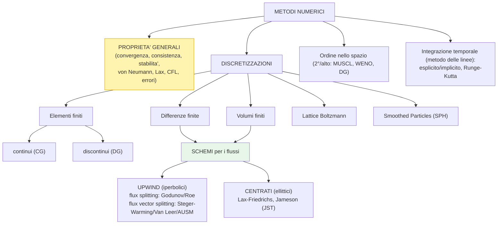

</details>


### Quadro d'insieme: soluzioni, errori, proprietà

> Tre toggle riassuntivi (sotto, le sezioni di dettaglio). L'ordine logico delle proprietà è
> **consistenza → stabilità → convergenza** (vedi il toggle "Proprietà").

<details>
<summary><strong>Soluzioni — quali "soluzioni" sono in gioco</strong></summary>

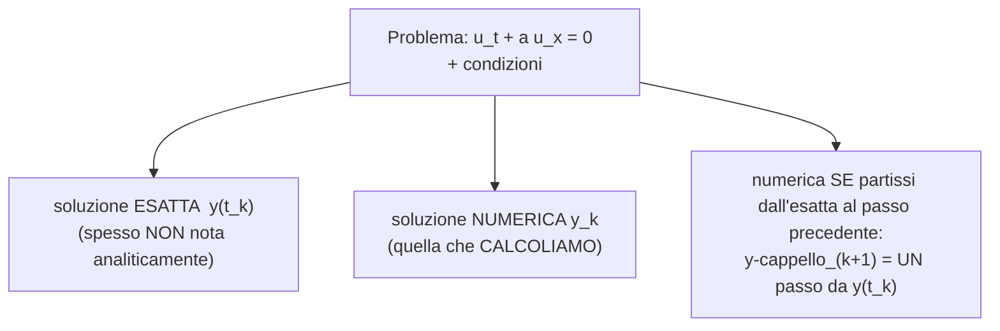

- **Condizione iniziale o "finale"?** Dipende da **come si imposta** il problema: si può **marciare in
  avanti** dalla condizione iniziale, oppure **all'indietro** dalla condizione finale. Più in generale si
  parla di **condizione al contorno**.
- **Sulla condizione al contorno non ha senso chiedersi "qual è la soluzione numerica":** lì **non la
  calcoliamo**, la **fissiamo noi** → per noi quel valore **è** la soluzione **esatta**.
- **C'è un punto in cui le due numeriche coincidono:** la **prima iterazione**. Si parte dall'unica cosa
  nota — le **condizioni al contorno**, che (per il punto precedente) **sono** la soluzione esatta — quindi
  lì la numerica è **priva di errore di propagazione**: è esattamente "la numerica se fossimo partiti
  dall'esatta".

</details>

<details>
<summary><strong>Errori — troncamento (locale), propagazione, globale</strong></summary>

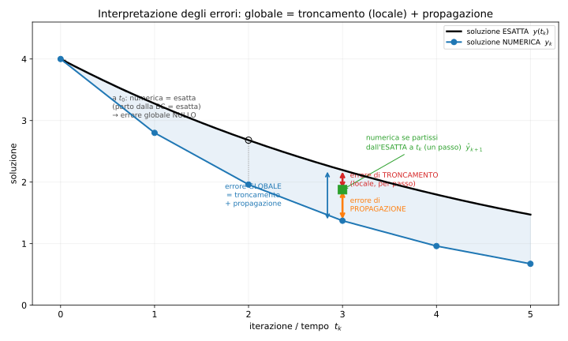

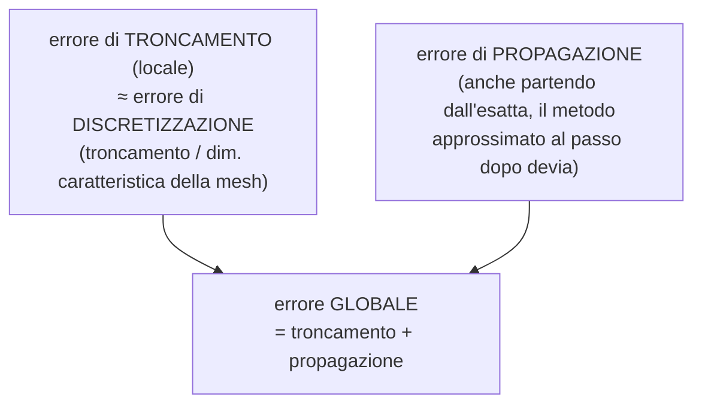

- **Tre errori.** **Troncamento** (≈ **discretizzazione**: è il troncamento diviso una **dimensione
  caratteristica** della mesh) · **propagazione** · **globale** (= **somma** dei due).
- **Propagazione:** anche se al passo $k$ **partissi dalla soluzione esatta**, dato che il metodo è
  **approssimato**, al passo $k+1$ otterresti comunque una soluzione **diversa** dall'esatta.
- **Perché "errore *locale* di troncamento"?** Nei metodi alle **differenze finite** lo sviluppo di **Taylor**
  ha termini di grado più alto che vengono **troncati** (eliminati): l'**equazione discretizzata** è quindi
  **diversa** da quella originale → è un **errore intrinseco del modello** (l'equazione che risolviamo non è
  quella esatta). L'idea è **generale** (estendibile agli altri metodi), ma qui si vede subito.
- **[punto chiave] Inserendo la soluzione ESATTA nell'equazione DISCRETIZZATA non ottengo zero.** L'esatta
  annulla **solo** l'equazione **originale**, non altre (come la discretizzata). Per l'upwind esplicito,
  sostituendo $u_{ex}$ e sviluppando con Taylor:

$$\frac{u_j^{n+1}-u_j^{n}}{\Delta t}+a\,\frac{u_j^{n}-u_{j-1}^{n}}{\Delta x}\bigg|_{u_{ex}}
=\underbrace{(u_t+a\,u_x)}_{=0}\;+\;\frac{\Delta t}{2}\,u_{tt}-a\,\frac{\Delta x}{2}\,u_{xx}+\dots
=E_{\text{tronc}}\neq 0.$$

  I termini extra sono l'**equazione modificata** che il metodo risolve **davvero** (diffusione/dispersione
  numerica): **senso fisico** → il numero risolve **un'equazione diversa**. Per $\Delta t,\Delta x\to0$,
  $E_{\text{tronc}}\to0$ (→ **consistenza**, vedi sotto).
- **Norma per misurare l'errore (esercitazioni):** nelle **esercitazioni** si valuta l'errore delle
  simulazioni **principalmente con la norma $L_2$**.

</details>

<details>
<summary><strong>Significato FISICO dell'errore locale di troncamento (diffusione numerica)</strong></summary>

Il **significato numerico** (l'esatta non annulla l'equazione discretizzata) lo abbiamo visto sopra. Il
**significato FISICO** è ancora più interessante: l'errore di troncamento è dominato da una **derivata
spaziale di 2° ordine** (un **laplaciano**), cioè un **termine puramente diffusivo**. I termini diffusivi
**smussano le oscillazioni** della soluzione → **migliorano la stabilità** (ma "spalmano" la soluzione).

**Upwind esplicito.** Lo sviluppo dava $E_{\text{tronc}}=\tfrac{\Delta t}{2}u_{tt}-a\tfrac{\Delta x}{2}u_{xx}$.
Usando l'equazione ($u_t=-a\,u_x\Rightarrow u_{tt}=a^2 u_{xx}$) per esprimere il tempo in funzione dello spazio:

$$E_{\text{tronc}}=\frac{a^2\Delta t}{2}u_{xx}-\frac{a\,\Delta x}{2}u_{xx}
=-\frac{a\,\Delta x}{2}\,(1-\nu)\,u_{xx},\qquad \nu=\frac{a\,\Delta t}{\Delta x}.$$

Quindi lo schema risolve in realtà l'**equazione modificata**
$$u_t+a\,u_x=\underbrace{\frac{a\,\Delta x}{2}(1-\nu)}_{\text{viscosità numerica }\varepsilon}\,u_{xx},$$
una **equazione di diffusione** con **viscosità numerica** $\varepsilon$:
- $\nu<1$ (CFL ok) → $\varepsilon>0$: **diffusione vera** → smussa, **stabilizza**;
- $\nu>1$ → $\varepsilon<0$: **anti-diffusione** → amplifica le oscillazioni → **instabilità**.

È il legame **bello** tra troncamento (diffusione), **CFL** e stabilità. Inoltre $\varepsilon\propto\Delta x$:
**infittendo la griglia la diffusione numerica diminuisce** (la soluzione è meno "spalmata").

</details>

<details>
<summary><strong>Proprietà — consistenza → stabilità → convergenza (ordine "intuitivo")</strong></summary>

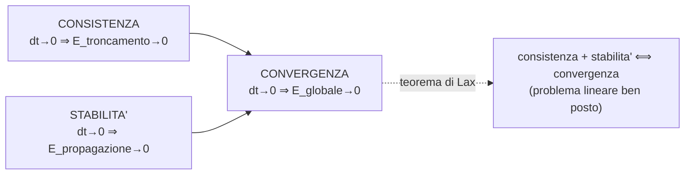

**Perché questo ordine (e non convergenza per prima)?** La convergenza è la proprietà per cui, raffinando
($\Delta t\to0$), l'**errore globale** tende a **zero**. Ma l'errore globale **si scompone** in
troncamento + propagazione:
- la **consistenza** garantisce $E_{\text{troncamento}}\to0$;
- la **stabilità** garantisce $E_{\text{propagazione}}\to0$;
- se **entrambi** vanno a zero, la loro **somma** (= errore globale) va a zero → **convergenza**.

Quindi è più intuitivo costruire prima i due "mattoni" (consistenza, stabilità) e poi dedurne la
convergenza — esattamente il **teorema di equivalenza di Lax**: *consistenza + stabilità ⟺ convergenza*
(per problemi lineari ben posti). Mappa: **(a)** consistenza ↔ troncamento/discretizzazione; **(b)**
stabilità ↔ propagazione; **(c)** convergenza ↔ globale.

**Altre proprietà (per completezza):**
- **Ordine di convergenza:** la **potenza** $p$ con cui l'errore va a zero, $E\sim O(\Delta x^{p})$ (es. 1°,
  2° ordine). Dice *quanto in fretta* converge.
- **Monotonicità:** lo schema **non crea nuovi massimi/minimi** (niente oscillazioni spurie vicino alle
  discontinuità) — legata alla proprietà **TVD**.
- **Conservatività:** il **flusso** che esce da una cella **entra** nell'adiacente → la grandezza si
  **conserva** globalmente (massa, q. di moto, energia). Essenziale per gli **urti** (velocità d'urto
  corretta, Rankine–Hugoniot).

> *(Monotonicità e conservatività potrebbero non essere state trattate a lezione, ma vale la pena
> conoscerle: completano il quadro delle proprietà.)*

</details>


### Tipologie di errore

<details>
<summary><strong>Nomenclatura</strong></summary>

- $y_k$ — soluzione **numerica** nel nodo $t_k$, $\forall k$;
- $y(t_k)$ — soluzione **esatta** nel nodo $t_k$, $\forall k$;
- $\tilde y_{k+1}$ — soluzione numerica in $t_{k+1}$ **partendo dal dato esatto** $y(t_k)$:

$$\tilde y_{k+1} = y(t_k) + h\,f(t_k, y(t_k))$$

</details>

<details>
<summary><strong>Errore di troncamento</strong></summary>

<aside>
💡

Si tratta della distanza tra la soluzione numerica e la soluzione esatta in un certo nodo

</aside>

**Errore locale di troncamento** $\tau(h)$ — l'errore commesso in **un passo**, partendo dalla soluzione esatta:

$$\tau(h) = y(t_{k+1}) - \tilde y_{k+1} = y(t_{k+1}) - y(t_k) - h\,f(t_k, y(t_k))$$

> Credo si chiami così perché alcuni metodi sono ottenuti dalle differenze finite con il troncamento di termini di grado più alto (che sono poi quelli che producono questo tipo di errore)
> 

</details>

<details>
<summary><strong>Errore di discretizzazione</strong></summary>

**Errore locale di discretizzazione** $d(h)$ — l'errore introdotto in un passo nella discretizzazione della derivata:

$$d(h) = \frac{\tau(h)}{h}$$

> Credo lo chiamino di discretizzazione poiché dipende da come ho discretizzazione l’intervallo
> 

</details>

<details>
<summary><strong>Errore globale</strong></summary>

**Errore globale** $e_{k+1}$ — l'errore complessivo commesso in $k$ passi di integrazione, scomponibile in troncamento (ultimo passo) + propagazione (passi precedenti):

$$e_{k+1} = y(t_{k+1}) - y_{k+1} = \underbrace{\big(y(t_{k+1}) - \tilde y_{k+1}\big)}_{\text{err. troncamento}} + \underbrace{\big(\tilde y_{k+1} - y_{k+1}\big)}_{\text{propagazione}}$$

</details>

<details>
<summary><strong>Interpretazione grafica degli errori</strong></summary>


*(Figura Python aggiornata; vedi anche il toggle "Errori" nel quadro d'insieme. La vecchia immagine a mano
`errori_interpretazione_grafica.jpg` resta in `images/` come archivio.)*

</details>


### Consistenza, 0-stabilità, assoluta stabilità e convergenza

<details>
<summary><strong>Consistenza e ordine di consistenza</strong></summary>

<aside>
💡

Se sul singolo nodo l’errore di discretizzazione, cioè la distanza tra risultato del metodo numerico e valore esatto, è molto piccolo si dice che il metodo è consistente

</aside>

**Consistenza:** un metodo è consistente se $\lim_{h\to 0} d(h) = 0$.

**Ordine (di consistenza):** un metodo è di ordine $p$ se $d(h) = \mathcal{O}(h^p)$ (es. Eulero $= \mathcal O(h)\Rightarrow p=1$).

> La sola consistenza non `e sufficiente per la convergenza, a causa del termine di propagazione degli errori. Affinch`e un metodo numerico sia convergente occorre che sia consistente e che garantisca la non propagazione degli errori.
> 

</details>

<details>
<summary><strong>0-stabilità</strong></summary>

<aside>
💡

Il metodo si dice zero stabile se il termine di propagazione dell’errore è piccolo, cioè se le operazioni non amplificano l’errore di discretizzazione

</aside>

**0-stabilità:** un metodo è 0-stabile se $\exists\,K>0,\ \bar h$ tali che, dati due valori iniziali $y_0,\hat y_0$, le soluzioni soddisfano (per $h\le\bar h$):

$$|y_k - \hat y_k| \le K\,|y_0 - \hat y_0| \qquad \forall k \le \frac{b-a}{h}$$

> Descritto in maniera differente K è molto simile all’essere un numero di condizionamento ed infatti il significato è sempre quello di verificare che il metodo sia stabile e non propaghi l’errore
> 

</details>

<details>
<summary><strong>Assoluta stabilità</strong></summary>

<aside>
💡

Un metodo numerico si definisce assolutamente stabile se la successione dei valori della soluzione numerica tende a zero (e chiaramente anche la soluzione esatta tende a zero altrimenti non avrebbe alcun senso)

</aside>

$$
\lim \limits _{k\to \infin } y_k=0
$$

> Si noti che ha senso valutare l’assoluta stabilità soltanto se la funzione analitica è asintoticamente stabile, cioè se tenderebbe comunque a zero (ad esempio un esponenziale decrescente). Ma se la funzione analitica non tende a zero allora non ha proprio senso porsi il problema
> 

</details>

<details>
<summary><strong>Regione di assoluta stabilità</strong></summary>

$$
y_{k+1} = \mathcal{F}(h\lambda) y_k \to y_{k+1}\mathcal{F}(h\lambda) ^{k+1}y_0
$$

<aside>
💡

In generale, è possibile riscrivere qualsiasi metodo numerico in una forma del tipo $y_{k+1} = \mathcal{F}(h\lambda) y_k$ dove $\mathcal{F}(h\lambda)$ dipende da metodo a metodo. A questo punto, imporre la condizione di assoluta stabilità, significa sostanzialmente assicurarsi che il modulo di  $\mathcal{F}(h\lambda) <1$. La porzione di piano complesso, dove questo accade si definisce regioni di assoluta stabilità. Questo spiega anche perché vengono utilizzati i metodi numerici impliciti che pur essendo con computazionalmente più esosi, presentano una regione di assoluta stabilità molto ampia.

</aside>

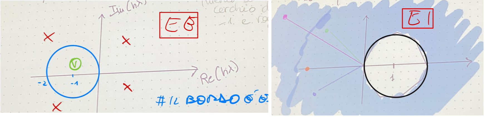

*Regione di Assoluta Stabilità  (PDF allegato Notion, non incluso nell'export)*

$$
R_a = {hλ ∈ ℂ : |\mathcal{F}(h\lambda) | < 1}
$$

> La presenza di eventuali termini sorgente che non rendono l’equazione omogenea non hanno alcun effetto sulla stabilità quindi si possono tranquillamente ignorare
> 

</details>

<details>
<summary><strong>Assoluta stabilità per i sistemi</strong></summary>

<aside>
💡

Se ho un sistema di equazioni differenziali posso riscrivere il problema in modo compatto e fare dei ragionamenti del tutto analoghi . Qui non occorre garantire la condizione $\lambda<0$ non solo per l’unico coefficiente della singola equazione ma per tutti gli autovalori della matrice 

</aside>

$$
[equazione] \to y'(t) = \lambda y(t)\to  Re(\lambda) <0 \\ [sistema] \to  y'(t) = Ay(t)\to Re(\lambda_i)<0
\\ 
$$

Se $A$ è diagonalizzabile, con autovalori $\lambda_i$ e autovettori $v_i$ ($i=1,\dots,m$):

$$y(t) = c_1 e^{\lambda_1 (t-t_0)} v_1 + \dots + c_m e^{\lambda_m (t-t_0)} v_m$$

Se $\mathrm{Re}\,\lambda_i < 0\ \forall i$ il problema è **asintoticamente stabile**.

</details>

<details>
<summary><strong>Convergenza (Lax-Richtmeyer)</strong></summary>

<aside>
💡

Se un metodo numerico è consistente e 0-stabile allora sarà convergente.

</aside>

**Convergenza:** dato $t\in[a,b]$ e una suddivisione di $[a,t]$ in $N$ intervalli di ampiezza $h=\frac{t-a}{N}$, il metodo è convergente se

$$\lim_{N\to\infty} y_N = y(t)$$

ovvero se l'errore globale $e_N\to 0$. Il metodo è convergente in $[a,b]$ se lo è $\forall t\in[a,b]$.

</details>


### Analisi di stabilità di von Neumann

> La **stabilità** valuta l'errore di **propagazione**: uno schema è stabile se gli errori **non
> crescono** illimitatamente passo dopo passo. L'analisi di von Neumann lo verifica decomponendo l'errore
> in **modi di Fourier** e misurando il **fattore di amplificazione** $G$.

<details>
<summary><strong>Dimostrazione — von Neumann per l'upwind esplicito (con figura)</strong></summary>

**Procedura:** ① scelgo il metodo, ② scrivo l'equazione discretizzata, ③ inserisco un modo d'errore e
ricavo $G$.

Upwind esplicito ($a>0$), con $\nu=\dfrac{a\,\Delta t}{\Delta x}$ (numero di Courant):
$$u_j^{n+1}=u_j^{n}-\nu\,(u_j^{n}-u_{j-1}^{n}).$$

Inserisco un **modo di Fourier dell'errore** $\,e_j^{n}=E^{n}\,e^{\,i\beta x_j}$ ($x_j=j\,\Delta x$): la
parte **spaziale** è $e^{i\beta x}$, quella **temporale** è l'ampiezza $E^{n}$. Sostituendo e dividendo per
$E^{n}e^{i\beta j\Delta x}$:

$$G=\frac{E^{n+1}}{E^{n}}=1-\nu\big(1-e^{-i\beta\Delta x}\big)=(1-\nu)+\nu\,e^{-i\theta},\qquad \theta=\beta\Delta x.$$

Nel piano complesso $G(\theta)$ descrive un **cerchio** di **centro** $(1-\nu,\,0)$ e **raggio** $\nu$.
La **stabilità** richiede $|G|\le1$ per **ogni** modo $\theta$ ⟺ il cerchio sta dentro il **cerchio unitario**:

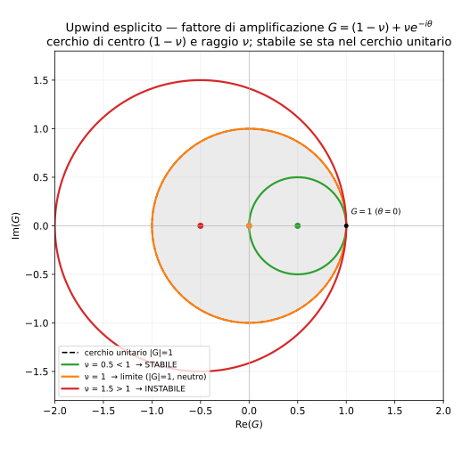

- $\nu<1$: cerchio **interno** → **stabile**;
- $\nu=1$: cerchio = cerchio unitario → $|G|=1$, **neutro** (limite);
- $\nu>1$: cerchio **esce** → $|G|>1$ per qualche $\theta$ → **instabile**.

**Conclusione:** l'upwind esplicito è **condizionatamente stabile** sotto la condizione **CFL**
$\;\nu=\dfrac{a\,\Delta t}{\Delta x}\le1$.

</details>

<details>
<summary><strong>Concetto [1] — perché solo l'esponenziale SPAZIALE (e non anche temporale)?</strong></summary>

È una **separazione di variabili**. L'errore si decompone in **modi di Fourier nello spazio**
($e^{i\beta x}$) perché la griglia è uniforme e qualunque errore è **sovrapposizione** di modi spaziali.
La dipendenza dal **tempo** **non** si impone: è proprio ciò che vogliamo **trovare**. Si scrive

$$e_j^{n}=E^{n}\,e^{i\beta x_j}=G^{\,n}\,e^{i\beta x_j},$$

cioè a ogni passo lo **stesso** modo spaziale viene moltiplicato per il **fattore di amplificazione** $G$
(l'incognita). Mettere un $e^{i\omega t}$ significherebbe **presupporre** il comportamento temporale; invece
si lascia che sia lo **schema** a dirci $G$. In breve: **spazio = base di Fourier nota** (decomposizione),
**tempo = ampiezza $E^{n}=G^{n}E^0$** (la crescita $G$ è ciò che si calcola).

</details>

<details>
<summary><strong>Concetto [2] — perché si chiama analisi "lineare"?</strong></summary>

Sì, è un'analisi **lineare**, per due motivi legati:
- si applica a **schemi lineari** (PDE lineare a **coefficienti costanti**, tipo $u_t+a u_x=0$);
- si fonda sulla **sovrapposizione** dei modi di Fourier — valida **solo** se i modi evolvono in modo
  **indipendente** (l'uno non influenza l'altro), cioè se il problema è **lineare**. Ogni modo è amplificato
  per conto suo da $G(\beta)$; lo schema è stabile se **nessun** modo cresce.

Per problemi **non lineari** la von Neumann si usa come **linearizzazione locale** (si "congelano" i
coefficienti). Quindi "lineare" = sfrutta **linearità/sovrapposizione**.

</details>

<details>
<summary><strong>Concetto [4] — perché $|e^{i\beta x}|=1$ (la ragione matematica)</strong></summary>

Sì, è esattamente la forma **polare** di un numero complesso: $z=r\,e^{i\varphi}$, dove $r$ è il **modulo**
(l'ampiezza) e $e^{i\varphi}$ è la **fase**, che ha **modulo unitario** ($|e^{i\varphi}|=\sqrt{\cos^2+\sin^2}=1$).
Nel modo $E^{n}e^{i\beta x}$ il fattore spaziale $e^{i\beta x}$ è una **pura fase/oscillazione**: $|\cdot|=1$,
**non** cambia l'ampiezza → **tutta** l'ampiezza (e la sua crescita) sta in $E^{n}$. Per questo, dividendo per
il modo, resta $G=E^{n+1}/E^{n}$ e la stabilità si legge sul **modulo** $|G|\le1$: conta l'**ampiezza** di
$G$, non la sua fase.

</details>

<details>
<summary><strong>Concetto [5] — $|G|\le1$: solo von Neumann o proprietà generale della stabilità?</strong></summary>

Il vincolo $|G|\le1$ è la **forma** (in von Neumann) di un principio **generale**: *un metodo stabile non
amplifica gli errori* nel marciare. Il principio generale (**Lax–Richtmyer**) è che le **potenze**
dell'operatore di avanzamento sono **uniformemente limitate**, $\lVert C^{\,n}\rVert\le K$. Le sue
incarnazioni:

| Forma dell'analisi | Condizione di stabilità |
|---|---|
| **von Neumann (Fourier)** | $|G(\beta)|\le1$ per **ogni** modo (o $\le 1+O(\Delta t)$ se l'esatta cresce) |
| **Matriciale** | raggio spettrale $\rho(A)\le1$ ($+O(\Delta t)$) |
| **Energia / Lax–Richtmyer** | $\lVert C^{\,n}\rVert\le K$ (crescita limitata) |

Quindi: **stabilità (generale) = crescita limitata degli errori** ⟺ in von Neumann **$|G|\le1$ su tutti i
modi**. Non è un'invenzione della sola von Neumann: è la sua **traduzione di Fourier**.

</details>

<details>
<summary><strong>Concetto [7] — il Taylor non è sull'errore globale: è sul troncamento (consistenza)</strong></summary>

Hai ragione a sentire una stonatura: lo **sviluppo di Taylor** **non** riguarda la **stabilità** né
l'**errore globale**. Sono **tre analisi distinte** per **tre errori distinti**:

| Proprietà | Errore | Strumento |
|---|---|---|
| **Consistenza** | troncamento (locale) | **TAYLOR** (inserisco l'esatta nello schema) |
| **Stabilità** | **propagazione** | **FOURIER / von Neumann** (inserisco un modo d'errore) |
| **Convergenza** | **globale** | **Lax** (consistenza + stabilità) |

Quindi il Taylor produce l'**errore di troncamento** (lato **consistenza** / equazione modificata), **non**
l'errore globale e **non** la stabilità. L'errore **globale** non si "sviluppa con Taylor": è la **somma**
troncamento + propagazione, e va a zero per il **teorema di Lax**. Probabilmente negli appunti i due
sviluppi (Taylor per il troncamento, Fourier per la propagazione) erano vicini e si sono confusi.

</details>

<details>
<summary><strong>Mappa [3] — quali analisi di stabilità esistono</strong></summary>

La von Neumann è **una delle principali** (la più usata sui casi lineari a coefficienti costanti su griglia
uniforme), **non** l'unica:

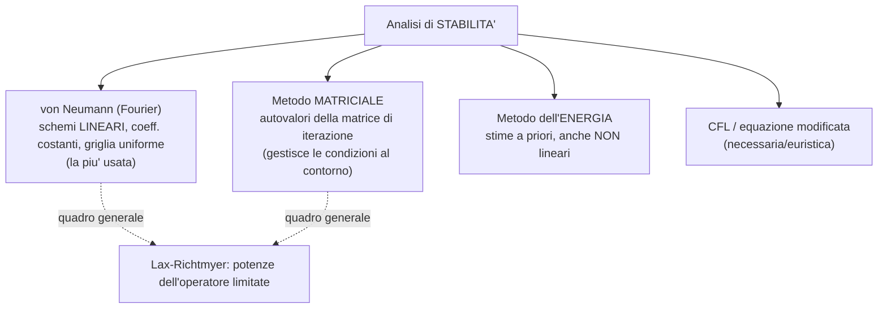

</details>

<details>
<summary><strong>Mappa [6] — schemi analizzati e risultati di stabilità</strong></summary>

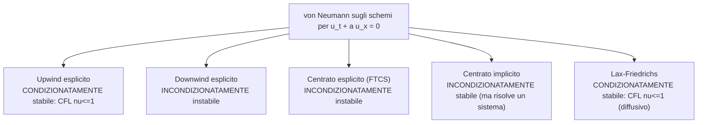

> Le **dimostrazioni** dei singoli schemi (centrato esplicito/implicito) le caricherai tu: appena arrivano
> le converto in LaTeX/markdown e le inserisco qui sotto (o, se troppo onerose, le linko come PDF).

</details>


### Condizione CFL, termini diffusivi ed esempi

<details>
<summary><strong>Concetto — la condizione CFL (dominio di dipendenza)</strong></summary>

> **Definizione (da ricordare):** *il dominio di influenza fisico deve essere contenuto nel dominio di
> influenza numerico.* (Forma classica equivalente: il **dominio di dipendenza fisico** del punto deve
> essere **contenuto** in quello **numerico** — lo stencil.)

In formula (scalare): $\;\mathrm{CFL}=\dfrac{a\,\Delta t}{\Delta x}\le1$.

**[interpretazione] Cosa va storto se CFL > 1.** In un passo $\Delta t$ il segnale fisico percorre
$a\,\Delta t$. Se $a\,\Delta t>\Delta x$ (CFL > 1), il segnale percorre **più di una cella**: il **dominio di
dipendenza fisico** del nuovo punto si estende **oltre lo stencil numerico** → lo schema **non contiene
tutta l'informazione fisica** che dovrebbe influenzare quel punto. Va letto **al contrario** del "non può
pescarla": è la **cella** a **non avere** dentro l'informazione necessaria → il metodo non può riprodurre
la fisica → **instabilità**.

**[perché su $\Delta t$ e non su $\Delta x$]** La velocità $a$ è **fisica** (non modificabile) e $\Delta x$
lo fissi per l'**accuratezza**: l'unico "pomello" libero per soddisfare la CFL è il **passo temporale**.
Quindi: *il $\Delta t$ deve essere abbastanza piccolo da non far "uscire" il fenomeno fisico dalla cella
numerica in un passo* ($a\,\Delta t\le\Delta x$). (La tua interpretazione è corretta.)

**[denominatore = $\lambda_{\max}$]** Per i **sistemi** (Eulero) la velocità che conta è la **massima**
velocità d'onda, $\lambda_{\max}=|u|+a$ (la caratteristica più veloce): $\;\dfrac{(|u|+a)\,\Delta t}{\Delta x}\le1$.
È **esattamente** ciò che si fa nelle **esercitazioni**: in `Euler2D/compute_dt.f90` il $\Delta t$ di ogni
cella è calcolato da $\lambda_{\max}$ locale (poi si prende il minimo). **Importante**: questo ragionamento
vale per Eulero proprio perché lì $\lambda_{\max}=|u|+a$.

**[necessaria, non sufficiente]** La CFL è un criterio che **avverte** di possibili violazioni del principio
di dipendenza fisica, **ma non garantisce di per sé la stabilità**: è **necessaria**, non **sufficiente**
(es. il centrato esplicito rispetta un limite tipo-CFL ma è comunque instabile).

</details>

<details>
<summary><strong>Concetto [punto importante] — il teorema di Lax richiede metodi LINEARI?</strong></summary>

**Sì, la linearità è un'ipotesi del teorema.** Un metodo è **lineare** quando la regola di aggiornamento è
**fissa**, **indipendente** dai valori della soluzione (nessun `if`/limitatore che cambia lo schema in base
all'evoluzione); se invece include condizioni che modificano la discretizzazione (es. limitatori,
shock-capturing con `if`), il metodo è **non lineare**.

Il **teorema di equivalenza di Lax** (*consistenza + stabilità ⟺ convergenza*) si dimostra usando la
**limitatezza delle potenze** dell'**operatore lineare** di avanzamento (sovrapposizione): vale per
**problemi lineari ben posti** con **schemi lineari**. Per i metodi **non lineari** non si applica
direttamente → servono altri strumenti (**TVD**, condizioni di **entropia**). Ecco perché la precisazione
"metodo lineare" accompagna sempre l'enunciato di Lax.

</details>

<details>
<summary><strong>Concetto [punto 2] — "consistente raffinando la griglia": e il $\Delta t$?</strong></summary>

La consistenza si valuta per $\Delta t,\Delta x\to0$. "Raffinare la **griglia**" sembra solo $\Delta x\to0$,
ma negli schemi **espliciti** $\Delta t$ è **legato** a $\Delta x$ dalla **CFL** (es. $\nu=a\Delta t/\Delta x$
**fisso**): allora $\Delta t=\nu\,\Delta x/a\to0$ **insieme** a $\Delta x$. Quindi raffinando a **CFL fissa**
le due cose sono **correlate** e $\Delta t\to0$ "gratis". (La tua intuizione è giusta: è la CFL a legarle.)

</details>

<details>
<summary><strong>Concetto [punto 7] — stabilità: termine convettivo vs diffusivo</strong></summary>

I due termini portano vincoli di stabilità **diversi** (dalla tua schema):

| | Termine **CONVETTIVO** | Termine **DIFFUSIVO** |
|---|---|---|
| Equazione | $a\,\dfrac{\partial u}{\partial x}=a\,\nabla u$ (gradiente) | $\alpha\,\dfrac{\partial^2 u}{\partial x^2}=\alpha\,\nabla^2 u$ (laplaciano) |
| Numero di stabilità | $\mathrm{CFL}=\dfrac{a\,\Delta t}{\Delta x}$ | $d=\dfrac{\alpha\,\Delta t}{\Delta x^2}$ |
| Vincolo (esplicito) | $\dfrac{a\,\Delta t}{\Delta x}\le1$ | $\dfrac{\alpha\,\Delta t}{\Delta x^2}\le\dfrac12$ |
| Vincolo su $\Delta t$ | $\Delta t\lesssim \dfrac{\Delta x}{a}$ (**lineare** in $\Delta x$) | $\Delta t\lesssim \dfrac{\Delta x^2}{2\alpha}$ (**quadratico** in $\Delta x$) |

**Differenza chiave:** il vincolo **diffusivo** scala con $\Delta x^2$ → **molto più restrittivo** man mano
che si raffina ($\Delta x\to0$): dimezzare $\Delta x$ **quadruplica** il numero di passi richiesti (contro
il **raddoppio** del convettivo). Per questo i termini **diffusivi** si trattano spesso in **implicito**
(per liberarsi del vincolo $\Delta t\sim\Delta x^2$).

</details>

<details>
<summary><strong>ESEMPI — tutti gli esempi pratici, uno per uno</strong></summary>

Dopo i toggle di teoria, ecco la **mappa di tutti gli esempi** svolti (e dove sono trattati nel file):

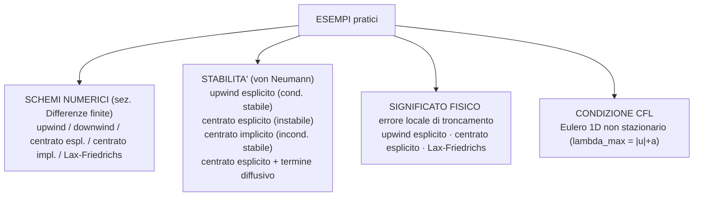

- **Schemi numerici** → sez. *Differenze finite*, toggle *"Esempi — gli schemi a confronto"* (stencil + equazioni + classificazione).
- **Stabilità (von Neumann)** → sopra, toggle *"Dimostrazione — von Neumann per l'upwind esplicito"* e
  *"Mappa — schemi analizzati e risultati"*; centrato esplicito/implicito: vedi le domande d'esame divise
  in tre (dimostrazioni in arrivo); il **centrato esplicito + diffusivo** rientra nel toggle
  *"convettivo vs diffusivo"* qui sopra.
- **Significato fisico dell'errore di troncamento** → toggle *"Errori"* (equazione modificata via Taylor):
  l'**upwind** dà un troncamento **diffusivo** (dissipazione), il **centrato/Lax-Friedrichs** un mix
  diffusione/dispersione.
- **CFL** → toggle *"Condizione CFL"* qui sopra, applicata a **Eulero 1D non stazionario** con
  $\lambda_{\max}=|u|+a$ (come nell'esercitazione `Euler2D`).

</details>


### Passi, espliciti-impliciti, stadi e stencil

<details>
<summary><strong>Metodi one-step e multi-step</strong></summary>

<aside>
💡

I metodi ad un passo sono quelli in cui l’iterata dipende soltanto dal valore dell’iterata precedente. I metodi multistep invece presentano un iterata che può dipendere anche da numerosi passi precedenti.

</aside>

<aside>

Tutti i metodi one-step sono stabili 

</aside>

> Quelli che studiamo noi sono tutti metodi one-step (quindi stabili) e anche consistenti (quindi per Lax-Rictmer) anche convergenti
> 

</details>

<details>
<summary><strong>Metodi espliciti e impliciti</strong></summary>

<aside>
💡

Nei metodi espliciti, il calcolo dell’ iterata è fatto tramite un’espressione scritta in forma esplicita che è più facile da risolvere, ma che potenzialmente può portare a errori di propagazione più alta che anche il motivo per cui poi esistono metodi impliciti

</aside>

|  | Espliciti | Impliciti |
| --- | --- | --- |
| Pro | 1)Richiedono meno memoria RAM (devono memorizzare solo la soluzione corrente)
2)Facili da scalare sul calcolo parallelo poiché le regioni del dominio sono indipendenti e le operazioni dipendono solo dalle soluzioni agli istanti temporali precedenti
3)Facili da implementare poiché richiedono espressioni esplicite più intuitive | Posso scegliere il passo temporale in modo arbitrario senza preoccuparmi della stabilità (poiché lo sono intrinseamente) |
| Contro |  | 1)Dovendo risolvere un sistema lineare (anche molto grande) ad ogni passo richiedono maggiore potenza di calcolo rispetto agli espliciti a parità di numero di iterazioni.
2)Dovendo memorizzare oltre alla soluzione precedente anche le matrici dei coefficienti e il vettore delle soluzioni del sistema lineare si occupa molta più memoria (in alcuni casi anche x35) 
3)La scalabilità sul calcolo parallelo è complessa e bisogna tenere in conto la banda passante a disposizione |
| Casi d’uso | 1)Analisi al variare del tempo di problemi **instazionari**. Se comunque devo scegliere un passo temporale piccolo per studiare fenomeni ad alta frequenza allora la limitazione sul passo degli espliciti non mi preoccupa e il vantaggio degli impliciti si perde. Questo è tipico delle DNS sulla turbolenza | 1)Analisi **stazionarie**. Se ciò che succede nel singolo istante di tempo non mi interessa ma voglio solo valutare la soluzione asintotica allora conviene prendere un passo temporale molto grande e “saltare direttamente alla soluzione”. Questo però si può fare solo nei metodi impliciti dove il passo è arbitrario mentre in quelli espliciti è limitato dalla stabilità.
2)Se il problema è **stiff** con un metodo implicito posso evitare passi temporali molto piccoli limitati dall’autovalore più piccolo legato al fenomeno di bassa scala che avrei in uno schema esplicito e avere una soluzione più facilmente. |

> Durante la risoluzione delle equazioni implicite necessarie alla valutazione dell’interata successiva può accadere che le soluzioni siano multiple (e in tal caso bisogna sceglierne una, ad esempio la più vicina all’interata precedente) o che non esistano (e in tal caso il metodo di blocca)
> 

> Si noti inoltre che la presenza di $t_{k+1}$ non rende il metodo implicito poiché i punti della griglia sono tutti noti e sin dal primo istante. Gli unici termini che possono rendere il metodo implicito sono $y_{k+1}$ cioè la funzione stessa
> 

</details>

<details>
<summary><strong>Stadi di un metodo</strong></summary>

<aside>
💡

Il numero di stadi di metodo è il numero di valutazione univoche di funzione necessaria al calcolo operata. È chiaro che un numero di stadi maggiore implica un maggior costo computazionale per singola iterazione, ma solitamente garantiscono anche una migliore precisione e una maggiore velocità di convergenza.

</aside>

</details>

<details>
<summary><strong>Stencil</strong></summary>

<aside>
💡

Lo **stencil** è l'insieme di punti (nodi o celle) vicini che entrano nel calcolo per determinare il valore in un punto specifico. Ad esempio, in una derivata centrale al secondo ordine, lo stencil è $\{i-1, i, i+1\}\to 3$. Più è largo lo stencil, più il metodo è (potenzialmente) **accurato**, ma più è **costoso** e **difficile** da gestire ai **bordi**.

</aside>

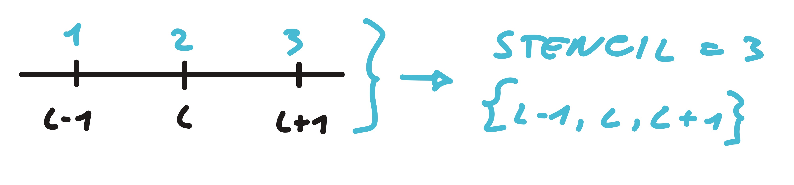

</details>

<details>
<summary><strong>Soluzione dei metodi impliciti</strong></summary>

Per applicare un metodo implicito serve risolvere un sistema lineare. Lo si può fare con un metodo diretto o iterativo.

|  | Diretto | Iterativo |
| --- | --- | --- |
| Pro | 1)minore costo computazionale | 1)non aumenta la memoria ram occupata poiché conserva lo sparsity pattern
2)con l’uso di precondizionatori diventa anche più efficienti |
| Contro | 1)non conserva lo sparsity pattern e ratio.  | 1)maggiore costo computazionale  |
| Caso d’uso | Analisi **2D**. Il numero di celle non è così elevato quindi anche se la matrice perde la sua sparsità si riesce a memorizzarla in RAM e ci si guadagna in costo computazionale. | Analisi **3D**. Anche se più lento non c’è altra soluzione dato che non si disporrebbe della memoria per memorizzare la matrice dei coefficienti del sistema lineare. |

</details>


### Metodi di discretizzazione spaziale

<details>
<summary><strong>Modelli</strong></summary>

---

I metodi utilizzati per trasformare le equazioni differenziali in sistemi algebrici risolvibili dal calcolatore.

| Metodo | Descrizione | Pro | Contro |
| --- | --- | --- | --- |
| **Differenze Finite (FDM)** | Approssima le derivate usando i valori della funzione su nodi di una griglia. | Semplice da implementare; facile ottenere ordini di accuratezza elevati. | Limitato a griglie strutturate e geometrie semplici. |
| **Volumi Finiti (FVM)** | Integra le equazioni su volumi di controllo; calcola i flussi alle facce. | **Conservativo**; flessibile per geometrie complesse; standard industriale. | Difficile andare oltre il 2° ordine di accuratezza. |
| **Elementi Finiti (FEM)** | Usa funzioni di forma su elementi (triangoli/tetraedri) per approssimare la soluzione. | Massima flessibilità geometrica; solida base matematica. | Più costoso in termini di memoria e tempo per problemi fluidodinamici. |
| **Lattice Boltzmann (LBM)** | Approccio statistico basato sulla funzione di distribuzione di particelle su un reticolo. | Parallelizzazione nativa (GPU); ottimo per flussi in mezzi porosi. | Difficile da applicare a flussi ad alto numero di Mach (comprimibili). |
| **Smoothed Particles (SPH)** | Metodo "meshless" basato su particelle interagenti che rappresentano il fluido. | Ideale per superfici libere, onde e grandi deformazioni (no mesh). | Computazionalmente oneroso e meno accurato vicino alle pareti. |

---

</details>

<details>
<summary><strong>Tipologie</strong></summary>

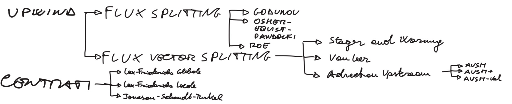

</details>


### Metodi di Runge-Kutta

<details>
<summary><strong>Descrizione</strong></summary>

<aside>
💡

I metodi di Runge-Kutta sono una famiglia molto ampia di metodi numerici utilizzati per la risoluzione di equazioni differenziali. In base al valore dei coefficienti si sceglie il metodo nello specifico. Possono avere un numero di stadi arbitrario.

</aside>

$$
s=1 \to y_{k+1} = y_k + h a_1 f(t_k + b_1 h, y_k)\\s=2 \to y_{k+1} = y_k + h(a_1 f(t_k + b_1 h, y_k) + a_2 f(t_k + b_2 h, y_k + h c_{21} k_1))\\s=generico \to y_{k+1} = y_k + h \sum_{i=1}^{s} a_i f(t_k + b_i h, y_k + h \sum_{j=1}^{i-1} c_{ij} k_j)
$$

> Si noti che è proprio il fatto che la sommatoria si fermi a i-1 a rendere il metodo esplicito. Se si fosse fermata a i sarebbe diventato un metodo implicito
> 

| Metodo | Formula | Step | Ordine di Convergenza | Exp-Imp | Stadi | Coefficienti  | $F(h\lambda)$ |
| --- | --- | --- | --- | --- | --- | --- | --- |
| Eulero esplicito | $y_{k+1} = y_k + h f(t_k, y_k)$  | 1 | 1 | Esplicito | 1 | a1=1,b1=0 | 1 + hλ |
| Eulero implicito | $y_{k+1} = y_k + h f(t_{k+1}, y_{k+1})$  | 1 | 1 | Implicito | 1 |  | 1/(1-hλ) |
| Trapezi | $y_{k+1} = y_k + \frac{h}{2} \left[ f(t_k, y_k) + f(t_{k+1}, y_{k+1}) \right]$  | 1 | 2 | Implicito | 2 |  |  |
| Heun |  $y_{k+1} = y_k + \frac{h}{2} \left[ f(t_k, y_k) + f(t_{k+1}, y_k + h f(t_k, y_k)) \right]$  | 1 | 2 | Esplicito | 2 |  | 1 + hλ + (hλ)^2/2 |
| Eulero modificato |  $y_{k+1} = y_k + h f\left( t_k + \frac{h}{2}, y_k + \frac{h}{2} f(t_k, y_k) \right)$  | 1 |  | Esplicito | 2 |  |  |

> Specifica numero di valutazioni univoche, perché è chiaro che se mi compare due volte la stessa funzione da valutare non è che la ricalcolo e spreco potenza computazionale, ma utilizzo il valore precedente che ho memorizzato
> 

</details>

<details>
<summary><strong>Tableau di Butcher</strong></summary>

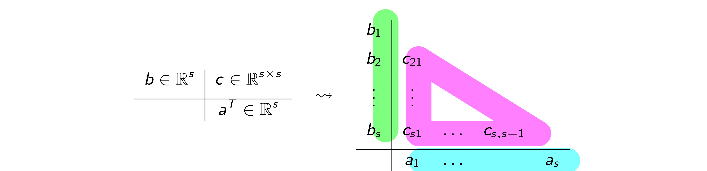

<aside>
💡

Il tableau di Butcher è un metodo grafico e ordinato per rappresentare tutti i coefficienti necessari a determinare in maniera univoca il metodo appartenente alla famiglia di Runge-Kutta.

</aside>

Condizioni di consistenza sui coefficienti del tableau:

$$\sum_{i=1}^{s} a_i = 1, \qquad b_i = \sum_{j=1}^{s} c_{ij}\quad \forall\, i=1,\dots,s$$

</details>

<details>
<summary><strong>Ordine</strong></summary>

</details>


### Problemi numerici

<details>
<summary><strong>Stiffness</strong></summary>

<aside>
💡

I problemi stiff sono dei casi particolari di equazioni differenziali che sono difficili da integrare e richiedono dei metodi appositi (tipo ode15s anziché la classica ode45). La difficoltà nasce dalla presenza di autovalori con la parte reale molto negativa che induce la necessità di avere un passo di integrazione molto piccolo (sebbene poi il termine della soluzione con l’autovalore molto negativo abbia un contributo estremamente piccolo dopo pochi passi) che unito ad un intervallo grande significa fare un’enormità di iterazioni . Si può definire il grado di stiffness

</aside>

$$
condizione \space 1 \to Re(\lambda_i) L \space piccolo\\condizione \space 2 \to Re(\lambda_i) L << -1 \\ stiffness \space grade \to max_i |Re(\lambda_i)|L << -1\\soluzione \to y(t) = c_1 e^{\lambda_1 (t-t_0)} v_1 + ... + c_m e^{\lambda_m (t-t_0)} v_m
$$

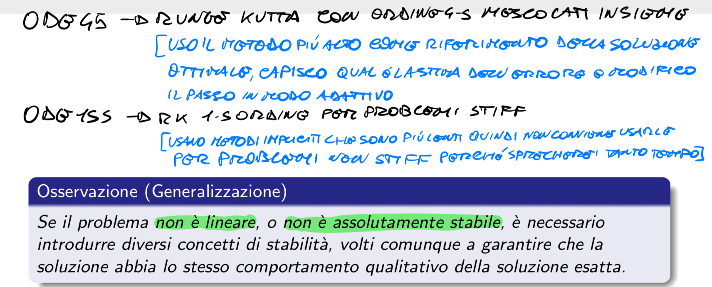

</details>

<details>
<summary><strong>Diffusione numerica</strong></summary>

</details>

<details>
<summary><strong>Dispersione numerica</strong></summary>

Prendiamo l'equazione del trasporto u_t + c u_x = 0. Se usiamo uno schema numerico, la "vera" equazione che il computer risolve (Equazione Modificata) è:

$$

$$

- **Punto di vista Fisico:** La derivata terza causa **dispersione**. Significa che onde di frequenza diversa viaggiano a velocità diverse. Vicino a un gradiente forte (urto), le frequenze "si separano" creando le oscillazioni (wiggles).
- **Punto di vista Matematico:** Le derivate pari (2ª, 4ª) agiscono come filtri passa-basso (smussano), mentre le derivate dispari (3ª, 5ª) introducono errori di fase. Immagina di voler rappresentare un gradino: se le onde che lo compongono non viaggiano insieme, il gradino "si rompe" in una serie di onde.

</details>

<details>
<summary><strong>Urti di espansione e entropia</strong></summary>

</details>

<details>
<summary><strong>Carbuncolo</strong></summary>

</details>


---

## Differenze finite

### Formulazione, dominio e discretizzazione

<details>
<summary><strong>Inquadramento — l'equazione di riferimento</strong></summary>

Si usa l'**equazione scalare lineare** (advezione), il "modello-giocattolo" su cui si studiano tutti gli schemi:

$$\frac{\partial u}{\partial t}+a\,\frac{\partial u}{\partial x}=0,\qquad
u=\text{grandezza conservata generica},\quad a=\text{velocità del segnale}.$$

Per risolverla **univocamente** servono delle **condizioni** (vedi sotto).

</details>

<details>
<summary><strong>Figura + Concetto — dominio, dato iniziale e condizioni al contorno (DOVE stanno)</strong></summary>

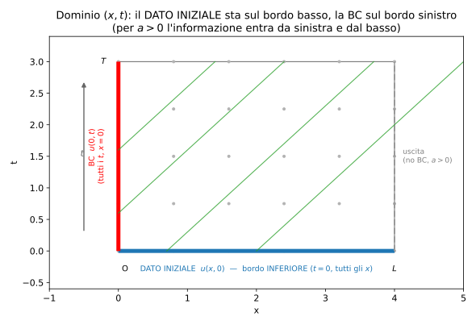

Il dubbio "la BC si impone su tutto il tratto $x=0$ a $t$ variabile, o solo a $t=0$?" si scioglie guardando
il **dominio** $[0,L]\times[0,T]$:
- **Dato INIZIALE** $u(x,0)$ -> su **tutto il bordo inferiore** ($t=0$, **tutti gli $x$**).
- **Condizione al CONTORNO** $u(0,t)$ -> su **tutto il bordo sinistro** ($x=0$, **tutti i $t$**), **non** solo
  a $t=0$. (Per $a>0$ l'informazione **entra da sinistra**; il bordo destro $x=L$ e' **uscente** -> niente BC,
  vedi `caratteristiche.md` §1.)

Quindi sono **due** insiemi di dati su **due bordi diversi**: l'asse orizzontale (passato, $t=0$) e il bordo
verticale sinistro (ingresso, $x=0$).

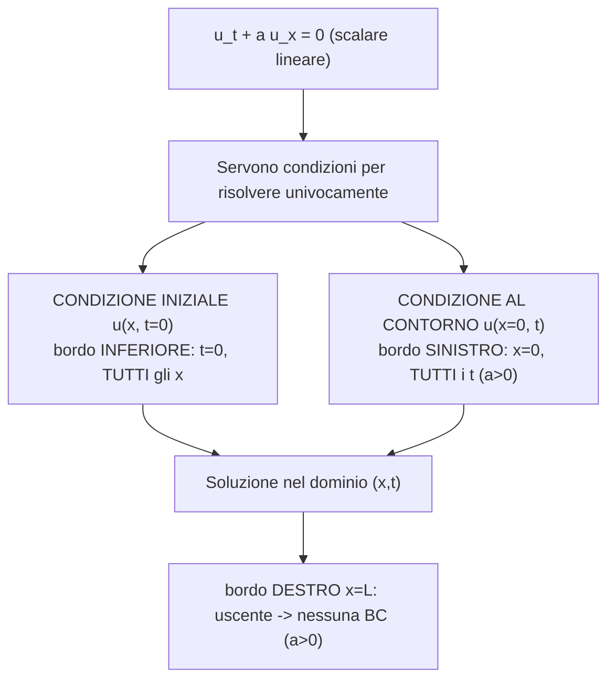

</details>

<details>
<summary><strong>Figura + Concetto — discretizzazione spaziale e temporale ($\Delta x,\Delta t$ costanti)</strong></summary>

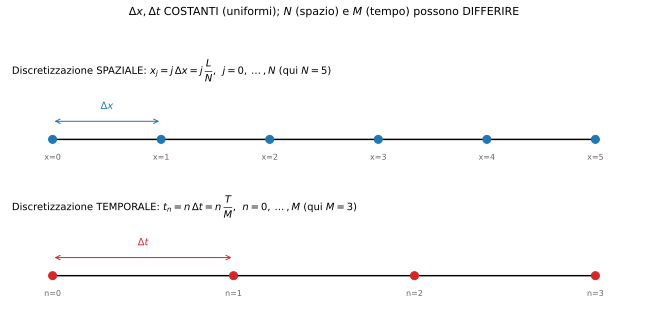

$$\text{spazio: } x_j=j\,\Delta x=j\,\frac{L}{N}\ (j=0,\dots,N);\qquad
\text{tempo: } t_n=n\,\Delta t=n\,\frac{T}{M}\ (n=0,\dots,M).$$

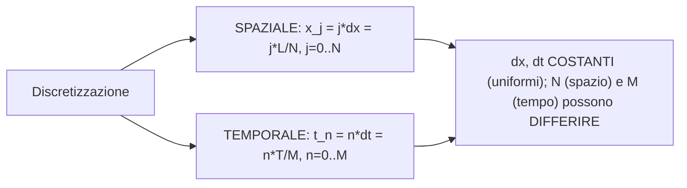

- **Perche' $\Delta x,\Delta t$ costanti?** Per **semplicita'** e per rendere immediate l'analisi di
  consistenza (sviluppi di Taylor) e di stabilita' (von Neumann), che si scrivono pulite su **griglia
  uniforme**. **Alternative** (se servono): griglie **non uniformi/stretchate** (per risolvere strati limite
  o zone con forti gradienti) e passo temporale **adattivo** $\Delta t=\Delta t(t)$ (per seguire transitori);
  costano in complessita' (gli sviluppi e la CFL vanno riscritti localmente).
- **Perche' $N$ (spazio) e $M$ (tempo) possono/devono differire?** Sono **due discretizzazioni indipendenti**:
  $\Delta x$ lo fissa l'**accuratezza spaziale** desiderata, mentre $\Delta t$ e' **vincolato dalla stabilita'**
  (condizione **CFL** $\mathrm{CFL}=a\,\Delta t/\Delta x\le 1$ per l'esplicito). Quindi tipicamente, scelto
  $\Delta x$, il $\Delta t$ e' **imposto** dalla CFL -> in generale $M\neq N$. E' **bene** che siano slegati:
  cosi' si raffina lo spazio per l'accuratezza senza essere costretti a un $\Delta t$ uguale, e si sceglie
  $\Delta t$ solo in base alla stabilita' (o lo si rende implicito per scioglierne il vincolo).

</details>

<details>
<summary><strong>Schema — dalla derivata al sistema discreto (upwind esplicito)</strong></summary>

Sostituendo le derivate con i **rapporti incrementali** ($\Delta x,\Delta t$ costanti):

$$\frac{\partial u}{\partial t}\approx\frac{u_j^{\,n+1}-u_j^{\,n}}{\Delta t}\quad(\text{avanti nel tempo}),
\qquad \frac{\partial u}{\partial x}\approx\frac{u_j^{\,n}-u_{j-1}^{\,n}}{\Delta x}\quad(\text{upwind, }a>0),$$

si ottiene lo **schema upwind esplicito** (FTBS, *Forward-Time Backward-Space*):

$$\boxed{\;\frac{u_j^{\,n+1}-u_j^{\,n}}{\Delta t}+a\,\frac{u_j^{\,n}-u_{j-1}^{\,n}}{\Delta x}=0\;}$$

Da qui $u_j^{\,n+1}$ si ricava **esplicitamente** dai valori al passo $n$; la **scelta backward** in spazio
(da monte) e' l'**upwind** corretto per $a>0$ ed e' cio' che rende lo schema stabile sotto CFL $\le 1$.

</details>

<details>
<summary><strong>Esempi — gli schemi a confronto (stencil, equazioni, classificazione)</strong></summary>

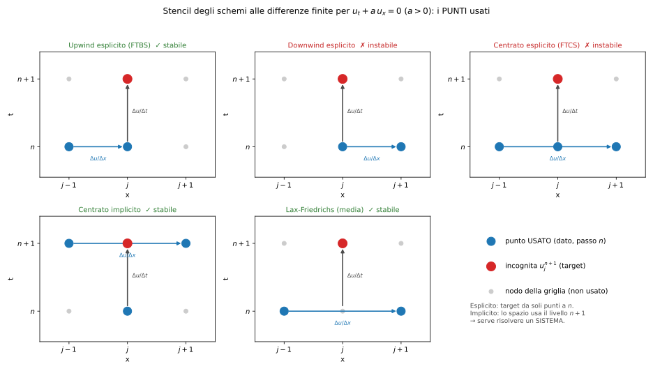

Tutti partono da $\dfrac{u_j^{n+1}-u_j^{n}}{\Delta t}$ per il tempo (avanti); cambia **come** si discretizza
$a\,\partial_x u$ (quali punti, quale lato).

**1) Upwind esplicito (FTBS)** — spazio *all'indietro* (da monte, per $a>0$):
$$\frac{u_j^{n+1}-u_j^{n}}{\Delta t}+a\,\frac{u_j^{n}-u_{j-1}^{n}}{\Delta x}=0.$$

**2) Downwind esplicito** — spazio *in avanti* (lato sbagliato, per $a>0$):
$$\frac{u_j^{n+1}-u_j^{n}}{\Delta t}+a\,\frac{u_{j+1}^{n}-u_j^{n}}{\Delta x}=0.$$

**3) Centrato esplicito (FTCS)** — differenza centrata nello spazio:
$$\frac{u_j^{n+1}-u_j^{n}}{\Delta t}+a\,\frac{u_{j+1}^{n}-u_{j-1}^{n}}{2\,\Delta x}=0
\;\Rightarrow\; u_j^{n+1}=u_j^{n}-\frac{a\,\Delta t}{2\,\Delta x}\big(u_{j+1}^{n}-u_{j-1}^{n}\big)
\;\Rightarrow\; u^{n+1}=f(u^{n}).$$

**4) Centrato implicito** — la derivata spaziale è valutata al livello **nuovo** $n+1$:
$$\frac{u_j^{n+1}-u_j^{n}}{\Delta t}+a\,\frac{u_{j+1}^{n+1}-u_{j-1}^{n+1}}{2\,\Delta x}=0
\;\Rightarrow\; u^{n+1}=f(u^{n+1})\;\Rightarrow\;\text{si risolve un SISTEMA.}$$

**5) Lax–Friedrichs (media)** — sostituisce $u_j^{n}$ con la **media** $\tfrac12(u_{j+1}^{n}+u_{j-1}^{n})$:
$$\frac{u_j^{n+1}-\tfrac12\big(u_{j+1}^{n}+u_{j-1}^{n}\big)}{\Delta t}
+a\,\frac{u_{j+1}^{n}-u_{j-1}^{n}}{2\,\Delta x}=0.$$
La media **aggiunge dissipazione numerica** → stabilizza il centrato (idea di base).

**Come si contestualizzano** (rispetto alla *tabella di classificazione* dell'introduzione):

| Schema | Ordine spazio | Ordine tempo | Espl./Impl. | Stencil (punti) | Stabilità |
|---|---|---|---|---|---|
| **Upwind (FTBS)** | 1° | 1° | esplicito | 2: $\{j-1,j\}$ a $n$ | **stabile** se CFL $\le 1$ |
| **Downwind** | 1° | 1° | esplicito | 2: $\{j,j+1\}$ a $n$ | **instabile** (sempre) |
| **Centrato espl. (FTCS)** | 2° | 1° | esplicito | 3: $\{j-1,j,j+1\}$ a $n$ | **instabile** (incondizionatamente) |
| **Centrato impl.** | 2° | 1° | **implicito** | 3 a $n{+}1$ + 1 a $n$ | **stabile** (incond.) ma serve risolvere un sistema |
| **Lax–Friedrichs** | 1° | 1° | esplicito | 3: $\{j-1,j+1\}$ a $n$ | **stabile** se CFL $\le 1$ (diffusivo) |

> 📌 **Commento importante sull'upwind (perché funziona, e il confronto col downwind).**
> Per un flusso **supersonico** il problema è **iperbolico** (per Eulero 1D non stazionario lo è
> **sempre**, anche in subsonico — *vedi `caratteristiche.md`*; quindi qui "ellittico" sarebbe un lapsus:
> è **iperbolico**). In un problema iperbolico l'informazione viaggia **lungo le caratteristiche**, a
> velocità finita e in una **direzione precisa**: il **dominio di dipendenza** del punto $u_j^{n+1}$ sta
> **solo dal lato di monte**.
> - L'**upwind** prende l'informazione **solo dal lato da cui arriva la caratteristica** (monte): usa
>   esattamente i punti che possono **fisicamente influenzare** $u_j^{n+1}$, e **scarta** l'altro lato → è
>   **coerente con la fisica** ed è **stabile** (sotto CFL $\le 1$).
> - Il **downwind** prende l'informazione dal lato di **valle**, cioè da punti che (nel tempo $\Delta t$)
>   **non possono ancora aver raggiunto** $u_j^{n+1}$: usa dati **fuori dal dominio di dipendenza** → è
>   **non fisico** → l'analisi di von Neumann dà fattore di amplificazione $|G|>1$ → **instabile**.
> - Il **centrato esplicito** usa **entrambi** i lati simmetricamente: per la pura advezione è
>   **incondizionatamente instabile** ($|G|^2=1+(a\Delta t/\Delta x)^2\sin^2\theta>1$). Si stabilizza o
>   passando all'**implicito** (centrato implicito) o **aggiungendo dissipazione** (Lax–Friedrichs).
>
> Morale: in iperbolico **prendere informazione solo dal lato "giusto" (le caratteristiche) non è solo più
> fisico: è ciò che rende il metodo stabile**. Ignorare la direzionalità (downwind/centrato esplicito) la
> distrugge.

</details>


### Simulazione domande d'esame

<details>
<summary><strong>Domanda 7 — Il blocco "metodi impliciti ed espliciti, WENO, Discontinuous Galerkin, ecc.": dove andrebbe inserito a livello logico nella suddivisione del Notion?</strong></summary>

Il blocco **non è omogeneo**: contiene cose che discretizzano il **tempo** e cose che
discretizzano lo **spazio**. Vanno quindi separate.

- **Metodi espliciti / impliciti** → pagina **Numerical Methods (ODE)**, nella sezione già
  esistente *"Passi, espliciti-impliciti, stadi e stencil"*. La dicotomia esplicito/implicito è
  infatti una proprietà dell'**integrazione temporale** (la $\mathbf{u}^{n+1}$ dipende solo dal
  passato → esplicito; dipende anche da sé stessa → implicito, richiede un sistema). È lo stesso
  asse concettuale di Eulero in avanti vs all'indietro e di Runge–Kutta.
  - *Collegamento:* la **regione di assoluta stabilità** (già presente nel Notion) è proprio ciò
    che distingue espliciti (stabilità condizionata, vincolo CFL) e impliciti (spesso A-stabili).

- **WENO** (*Weighted Essentially Non-Oscillatory*) → pagina **Finite Volumes Schemes**. È una
  tecnica di **ricostruzione spaziale ad alto ordine** dei valori all'interfaccia: appartiene alla
  famiglia che nasce per **aggirare il teorema barriera di Godunov** (vedi Domanda 8). Logicamente
  va come sottosezione *"Schemi ad alta risoluzione / ricostruzione"*, vicino a limitatori e MUSCL.

- **Discontinuous Galerkin (DG)** → anch'esso **discretizzazione spaziale**, ma di natura
  ibrida (elementi finiti + volumi finiti) con rappresentazione **polinomiale a tratti
  discontinua** dentro ogni cella. Logicamente va in **Finite Volumes Schemes** come metodo
  ad alto ordine "parente" dei FV (condivide i **flussi numerici** di Riemann all'interfaccia),
  oppure in una pagina dedicata *"Metodi ad alto ordine"* se l'argomento cresce.

**In sintesi:** esplicito/implicito → *Numerical Methods (ODE)*; WENO e DG → *Finite Volumes
Schemes* (sezione ricostruzione/alto ordine). La regola: **tempo → ODE, spazio → Finite Volumes**.

</details>

<details>
<summary><strong>Domanda 8 — Il teorema barriera di Godunov, i limitatori di pendenza e il calcolo del gradiente all'interfaccia/al centro cella: dove vanno inseriti logicamente?</strong></summary>

Tutti e tre appartengono alla pagina **Finite Volumes Schemes**, perché riguardano la
**ricostruzione spaziale** e l'**accuratezza** dello schema ai volumi finiti. Idealmente in una
sottosezione *"Schemi ad alta risoluzione"* posta **dopo** Godunov e Roe.

- **Teorema barriera di Godunov** (*order barrier theorem*): afferma che uno schema **lineare**
  e **monotono** (che non crea nuove oscillazioni) può essere **al massimo del primo ordine**. È la
  motivazione teorica di tutto ciò che viene dopo: per avere **alto ordine senza oscillazioni**
  bisogna usare schemi **non lineari** (limitatori, WENO). Logicamente è il "ponte" tra lo schema
  di Godunov del primo ordine e i metodi ad alta risoluzione → va subito dopo *"Godunov & Problema
  di Riemann"*.

- **Limitatori di pendenza** (*slope limiters*, es. minmod, van Leer, superbee): sono il modo
  **pratico** di aggirare il teorema. Ricostruiscono una **pendenza lineare** dentro la cella
  (schema MUSCL, secondo ordine) ma la **limitano** vicino a discontinuità/estremi per non creare
  overshoot (proprietà **TVD**). Vanno nella stessa sottosezione *"Alta risoluzione"*, come
  applicazione diretta del teorema barriera.

- **Gradiente all'interfaccia e al centro cella**: è il calcolo del **gradiente** necessario sia
  per la ricostruzione (passare dal valore medio di cella al valore all'**interfaccia**, dove si
  valuta il flusso) sia per i termini diffusivi/viscosi. Logicamente va vicino alla **ricostruzione
  spaziale** e alla distinzione **cella-centrata vs nodo-centrata** (già presente nel Notion, sez.
  *"Celle Centrate vs Nodi Centrati"*), perché il *come* si calcola il gradiente dipende da dove
  sono collocate le incognite.

**Filo logico suggerito nella pagina Finite Volumes:**
Godunov (1° ordine) → **Teorema barriera** → necessità di non-linearità → **ricostruzione +
gradienti** → **limitatori di pendenza** (TVD) → WENO (Domanda 7).

</details>

<details>
<summary><strong>Domanda 9 — Perché i metodi upwind sono "iperbolici" e quelli centrati "ellittici"?</strong></summary>

La risposta sta nel **rispetto del dominio di dipendenza fisico**: uno schema numerico è "adatto"
a un'equazione quando il suo **stencil** (le celle che usa) ricalca il modo in cui
l'informazione si propaga in quell'equazione.

**Equazioni iperboliche** (es. advezione, Eulero supersonico): l'informazione viaggia lungo le
**linee caratteristiche** con **velocità finita** e **direzione ben precisa** (a valle, dentro il
cono di Mach). Il **dominio di dipendenza** di un punto è solo ciò che sta **a monte** lungo le
caratteristiche. Lo schema **upwind** usa i valori provenienti dalla **direzione da cui arriva il
segnale**:

$$
u_i^{n+1} = u_i^n - \frac{a\Delta t}{\Delta x}\left(u_i^n - u_{i-1}^n\right) \quad (a>0)
$$

cioè guarda **all'indietro**, verso $i-1$. Questo **rispetta la causalità fisica** e introduce
una **dissipazione numerica** che stabilizza lo schema. Un centrato puro, su un'iperbolica
del primo ordine, è invece **instabile** (porta informazione anche da valle, dove non dovrebbe).
Per questo gli schemi **upwind** (Godunov, Roe) sono la scelta naturale per problemi **iperbolici**.

**Equazioni ellittiche** (es. Laplace/Poisson, pressione nel flusso incomprimibile, regime
subsonico): **non esistono direzioni privilegiate** di propagazione. Una perturbazione in un punto
si fa sentire **istantaneamente e in tutte le direzioni**: il **dominio di dipendenza è l'intero
dominio**. Lo schema appropriato è quindi **centrato e simmetrico**, perché tratta allo stesso
modo i vicini da ogni lato:

$$
\frac{u_{i-1} - 2u_i + u_{i+1}}{\Delta x^2} = f_i
$$

Uno schema upwind (asimmetrico) su un'ellittica introdurrebbe una **direzionalità artificiale**
che non ha senso fisico.

**Collegamento con il report (doppia rampa):** è esattamente per questo che, se nel dominio
comparisse una **tasca subsonica**, le equazioni di Eulero stazionarie cambierebbero natura da
**iperbolica** (supersonico) a **ellittica** (subsonico), richiedendo un trattamento diverso delle
condizioni al contorno all'outlet. Ed è anche il motivo per cui il **metodo di proiezione di
Chorin** (trattato nella teoria del report, sezione *Solutori Density-Based e Pressure-Based*)
deve risolvere un'**equazione di Poisson ellittica** per la pressione: l'incomprimibilità ha
natura ellittica.

**In una frase:** *upwind = direzionale = rispetta le caratteristiche delle iperboliche;
centrato = simmetrico = rispetta l'isotropia di propagazione delle ellittiche.*

</details>

---


---

## Volumi finiti e schemi per i flussi

### Tassonomia, Godunov, Roe (domande)

<details>
<summary><strong>Tassonomia dei metodi ai volumi finiti + tabella comparativa (idea, pro, contro)</strong></summary>

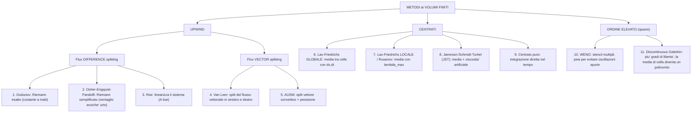

| # | Metodo | Categoria | Idea di base | Pro | Contro |
|---|---|---|---|---|---|
| 1 | **Godunov** | FDS | risolve il **Riemann esatto** all'interfaccia (dato costante a tratti) | esatto, robusto, fisicamente fondato | costoso (Riemann esatto a ogni faccia) |
| 2 | **Osher–Engquist–Pandolfi** | FDS | **Riemann semplificato**: ventaglio di compressione **anziché** urto | liscio, differenziabile, niente entropy fix | integrali complessi |
| 3 | **Roe** | FDS | **linearizza** il sistema con $\bar A$ costante | accurato, economico, nitido sugli urti | **espansioni non fisiche** → serve **entropy fix** |
| 4 | **Van Leer** | FVS | **split** del flusso **vettoriale** in parte sinistra/destra ($F^+\!,F^-$) | semplice, robusto, differenziabile | **diffusivo** sui contatti |
| 5 | **AUSM** | FVS | **split** del vettore **convettivo** + **pressione** | nitido sui contatti, robusto | varianti/taratura |
| 6 | **Lax–Friedrichs globale** | centrato | media tra celle con $\Delta x,\Delta t$ globali | semplice | **molto diffusivo** |
| 7 | **Lax–Friedrichs locale / Rusanov** | centrato | media con $\lambda_{\max}$ **locale** | robusto, economico | diffusivo |
| 8 | **Jameson–Schmidt–Turkel (JST)** | centrato | media + **viscosità artificiale** (2°/4° ordine) | efficiente, molto usato in industria | taratura dei coefficienti |
| 9 | **Centrato puro** | centrato | integrazione **diretta** nel tempo (no dissipazione) | semplicissimo | **instabile** per i convettivi |
| 10 | **WENO** | alto ordine | più sotto-stencil + **pesi** per evitare oscillazioni | alto ordine **e** cattura urti | costoso |
| 11 | **Discontinuous Galerkin** | alto ordine | più **gradi di libertà**: la media di cella diventa un **polinomio** | alto ordine + conservazione + upwind | costoso, complesso |

</details>

<details>
<summary><strong>Concetto [27][28] — Godunov: perché è interessante fisicamente, e il Mach unitario nella rarefazione</strong></summary>

- **[27] Perché fisicamente interessante.** Il flusso all'interfaccia non è una media arbitraria: viene
  dalla **soluzione (esatta) del problema di Riemann locale**, cioè dalla **vera struttura d'onda** delle
  equazioni (urto / contatto / rarefazione). Lo schema è quindi costruito sulla **fisica reale** di come
  evolve una discontinuità, non su un'interpolazione.
- **[28] Perché $M=1$ quando l'espansione è a cavallo dell'asse $t$.** Il flusso si legge in $x/t=0$ (asse
  verticale del tempo). Se un **ventaglio di rarefazione** della famiglia $u\mp a$ **attraversa** $x/t=0$
  (rarefazione **transonica**: un'estremità con velocità d'onda $<0$, l'altra $>0$), allora in $x/t=0$ la
  velocità d'onda è **nulla**: $u\mp a=0\Rightarrow u=\pm a\Rightarrow M=u/a=1$. È il **punto sonico**
  interno al ventaglio: lì la caratteristica è **stazionaria**, da cui $M=1$ (caso delicato, richiede cura).

</details>

<details>
<summary><strong>Metodo di Roe — procedura, variabili, e domande [29][30][31][32][33]</strong></summary>

**Idea di base:** **linearizzare** le equazioni di conservazione (iperboliche). Da $\partial_t U+\partial_x F=0$,
con $A=\partial F/\partial U$ (Jacobiana), si passa a $\partial_t U+\bar A\,\partial_x U=0$ con $\bar A$
**costante** all'interfaccia.

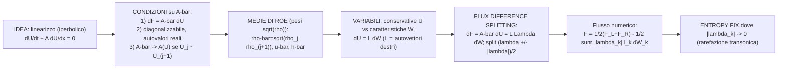

- **[31] Perché $\bar A\to A(U_j)$ se $U_j\sim U_{j+1}$?** È la **condizione di consistenza** della matrice di
  Roe. Quando i due stati **coincidono** (regione liscia), la linearizzazione deve **ridursi** alla Jacobiana
  **esatta** $A(U)$, altrimenti lo schema risolverebbe un'equazione **diversa** nel liscio (non consistente).
  Attenzione al tuo dubbio: a coincidere è il **salto** $\Delta F\to0$ (e $\Delta U\to0$), **non** il flusso
  $F$; la Jacobiana $A=\partial F/\partial U$ (le **velocità d'onda**) **non** è nulla → $\bar A\to A(U)$
  garantisce le **velocità d'onda corrette** nel liscio = consistenza.
- **[29] Perché la matrice degli autovettori moltiplica le variabili *caratteristiche* e non le conservative?**
  Perché $U=L\,W$ ($dU=L\,dW$): gli **autovettori (destri)** di $\bar A$ formano una **base**, e le $W$ sono le
  **coordinate** (le "**intensità d'onda**") dello stato conservativo in quella base. È un **cambio di base**
  (matematica) con significato **fisico**: ogni colonna di $L$ è **un'onda**, ogni $W_k$ la sua **ampiezza**.
  Si opera su $W$ (onde disaccoppiate) e si torna a $U$ con $L$.
- **[30] Dove serve l'entropy fix?** Nello **split per segno** $\dfrac{\lambda_k\pm|\lambda_k|}{2}$: quando un
  autovalore **cambia segno** attraverso l'interfaccia ($|\lambda_k|\to0$, caso **transonico**), Roe — che
  tratta la rarefazione come un **singolo salto** — produce un'**onda d'espansione non fisica** (expansion
  shock, viola l'entropia). Si "ripara" addolcendo $|\lambda_k|$ vicino a zero (**entropy fix** di Harten).
- **[32] I due set di variabili (espliciti):**
  - **Conservative:** $U=(\rho,\ \rho u,\ \rho E)^{T}$.
  - **Caratteristiche:** $W=L^{-1}U$, con autovalori $\lambda=\{u-a,\ u,\ u+a\}$; gli incrementi $\Delta W_k$
    sono le **intensità delle onde**.
- **[33]** La **simulazione d'esame sul flusso di Roe** è nel file esami (sez. 3, "Schemi per i flussi"); qui
  sopra c'è la **procedura esatta** (mermaid) e i concetti teorici.

</details>

<details>
<summary><strong>Concetto [25][26] — generazione mesh: metodo iperbolico vs advancing front</strong></summary>

- **[25] Perché i metodi "iperbolici" si ispirano alla propagazione ondosa.** Generano la griglia
  **strutturata** **risolvendo un sistema di PDE iperboliche** marciate **verso l'esterno** dalla superficie
  del corpo: le linee di griglia avanzano come un **fronte d'onda** che si propaga lungo le **caratteristiche**.
  L'ispirazione è sia nell'**equazione** (iperbolica, marciata come un'evoluzione) sia nella **logica**
  (marciare un fronte strato dopo strato) → ottima **ortogonalità** vicino alla parete.
- **[26] Differenza concreta con l'advancing front.** Non solo strutturata vs non strutturata:
  - **Advancing front** (non strutturata): "inietta" elementi (triangoli/tetraedri) **uno alla volta**,
    avanzando un **fronte** locale finché si chiude → costruzione **elemento per elemento**, segue bene la
    geometria ma può "incartarsi" dove i fronti si scontrano;
  - **Iperbolico** (strutturata): marcia un **intero strato** (una linea coordinata) alla volta **risolvendo
    le PDE** → griglia **strutturata** $(i,j)$.
  In breve: **elemento-per-elemento locale** (advancing front) vs **strato-per-strato marciato via PDE**
  (iperbolico).

</details>


### 1. Metodo dei Volumi Finiti in 1D

<details>
<summary><strong>Equazione conservativa</strong></summary>

Si parte dalla forma differenziale conservativa:

$$\frac{\partial u}{\partial t} + \frac{\partial f}{\partial x} = 0, \qquad f = f(u)$$

> **Perché considerare solo il flusso convettivo equivale alle equazioni di Eulero.** Le Navier–Stokes
> hanno flusso **convettivo + diffusivo**; il flusso diffusivo è proporzionale a $\mu$ (viscosità) e
> $k$ (conducibilità termica). **Eulero = Navier–Stokes con $\mu=k=0$** → resta il solo flusso
> convettivo $\mathbf F^c$, cioè $\partial_t\mathbf U + \nabla\cdot\mathbf F^c = 0$. È per questo che
> qui si lavora con il flusso $f=f(u)$ convettivo.

Si integra su ogni cella $[x_{j-\frac{1}{2}}, x_{j+\frac{1}{2}}]$, ottenendo la forma integrale:

$$\frac{\partial}{\partial t}\int_{x_{j-\frac12}}^{x_{j+\frac12}} u,dx = -\left(f_{j+\frac12} - f_{j-\frac12}\right)$$

</details>

<details>
<summary><strong>Variabile conservata media di cella</strong></summary>

$$\boxed{U_j = \frac{1}{\Delta x}\int_{x_{j-\frac12}}^{x_{j+\frac12}} u,dx}$$

> **Definizione:** $U_j$ è il valore *medio* di $u$ sull’intera cella $j$, non il valore puntuale al centro. Il FVM lavora con medie, le differenze finite con valori puntuali.
> 

</details>

<details>
<summary><strong>Schema centrato esplicito</strong></summary>

Con flussi alle facce come medie aritmetiche:

$$f_{j+\frac12} = \frac{1}{2}(f_j + f_{j+1}), \qquad f_{j-\frac12} = \frac{1}{2}(f_{j-1}+f_j)$$

$$\frac{U_j^{n+1}-U_j^n}{\Delta t} + \frac{f_{j+\frac12}^n - f_{j-\frac12}^n}{\Delta x} = 0$$

**Risultato chiave — Equivalenza FD ↔ FVM in 1D:** In 1D con schema centrato le equazioni sono identiche. La differenza è nell’*interpretazione*: FD assume $U_j \approx u(x_j,t)$ (valore puntuale), FVM assume $U_j$ = media di cella. La distinzione diventa rilevante in 2D/3D su mesh non strutturate.

</details>

---


### 2. Mesh Strutturate: Generazione

In una mesh strutturata ogni cella è identificata da indici $(i,j)$. I vicini fisici sono vicini in memoria — grande vantaggio computazionale (~20 contatori per cella, vs ~100 per non strutturata).

| Metodo | Equazioni usate | Vantaggi | Svantaggi |
| --- | --- | --- | --- |
| **Algebrico** | Nessuna PDE — mapping esplicito: $x = x_1 + \xi(x_2-x_1)$ | Velocissimo, banale | No controllo ortogonalità; rischio distorsione; errori di discretizzazione occulti |
| **Ellittico** | Laplace/Poisson: $\nabla^2\xi = 0$ | Griglia liscia, ortogonale con BC Neumann | Costoso (sistema globale iterativo) |
| **Iperbolico** | PDE iperboliche, marcia dalla parete | $\perp$ alla parete automaticamente, ottimo per BL | Problemi su geometrie concave (sovrapposizione) |

> **Note:** Il tipo di PDE usata per generare la griglia riflette come l’informazione si propaga nel dominio di calcolo. Ellittico = si sente tutto il dominio. Iperbolico = marcia in un’unica direzione.
> 

⚠ **Rischio metodo algebrico:** Non si controlla la direzione delle pareti → le linee di griglia non sono perpendicolari alla superficie → errori di discretizzazione nascosti legati allo skewness.

---


### 3. Mesh Non Strutturate

La connettività deve essere memorizzata esplicitamente (maggiore memoria, massima flessibilità geometrica).

<details>
<summary><strong>Triangolazione di Delaunay</strong></summary>

> **Criterio:** La circonferenza circoscritta a ogni triangolo non deve contenere altri punti della discretizzazione.
> 
- In 2D → triangoli; in 3D → tetraedri
- Duale del diagramma di Voronoi
- Algoritmo globale — buona robustezza, ma difficoltà su geometrie concave

</details>

<details>
<summary><strong>Metodo Frontale (Advancing Front)</strong></summary>

- Si parte dal contorno (il “fronte”) e si aggiungono celle avanzando verso l’interno
- Costruzione locale → maggiore flessibilità su geometrie cave/concave
- Possibile conflitto quando due fronti si incontrano da direzioni “sbagliate”

</details>

| Caratteristica | Delaunay | Frontale |
| --- | --- | --- |
| Principio | Criterio globale sulla circonscritta | Crescita locale dal contorno |
| Gestione concavità | Delicata | Buona |
| Qualità vicino parete | Media | Buona |
| Robustezza | Alta | Media |

---


### 4. Celle Centrate vs Nodi Centrati

|  | Celle Centrate (Fluent) | Nodi Centrati (CFX) |
| --- | --- | --- |
| Volume di controllo | La cella direttamente | Griglia duale costruita attorno al nodo |
| BC | Più semplici | Più articolate (il volume di controllo taglia il bordo) |
| Griglia duale | Non serve | Costruita una volta in preprocessing — costo trascurabile |
| Gradi di libertà | Pari al numero di celle | Pari al numero di nodi (più numerosi) |

> La griglia duale ha un overhead trascurabile: si costruisce una volta sola. I nodi centrati offrono più gdl per la stessa mesh, spesso maggiore accuratezza, ma BC più complesse.
> 

> **Quale griglia si usa a livello commerciale.** Mesh **ibride non strutturate** (ICEM, Pointwise,
> ANSA, Gmsh): **strati prismatici strutturati** vicino alla parete (per il boundary layer) +
> **tetraedri** non strutturati nel campo lontano. Per le turbomacchine si usano mesh **strutturate
> multi-blocco** (TurboGrid). I codici a **nodi centrati** (CFX) sono spesso preferiti su geometrie
> complesse, quelli a **celle centrate** (Fluent) sui casi più semplici.

---


### 5. Metodo di Godunov & Problema di Riemann

<details>
<summary><strong>Idea centrale</strong></summary>

Godunov assume soluzione **costante a tratti** (primo ordine). Ogni interfaccia $j+\frac12$ separa due stati costanti → problema di Riemann locale.

> **Problema di Riemann:** PDE iperbolica con dato iniziale a gradino $u(x,0) = u_L$ se $x<0$, $u_R$ se $x>0$. La soluzione consiste di onde (rarefazione, contatto, urto). Esempio classico: **tubo di Sod**.
> 

</details>

<details>
<summary><strong>Schema di Godunov</strong></summary>

Si risolve il Riemann per ogni interfaccia, si ottiene $F_{j+\frac12}$, poi si avanza:

$$U_j^{n+1} = U_j^n - \frac{\Delta t}{\Delta x}\left[F_{j+\frac12} - F_{j-\frac12}\right]$$

</details>

<details>
<summary><strong>CFL nel metodo di Godunov</strong></summary>

La CFL ha interpretazione fisica diretta: $\Delta t$ deve essere abbastanza piccolo da garantire che le onde di due Riemann adiacenti **non si sovrappongano** durante il time step. Se si sovrappongono, il problema locale non è più valido.

$$\text{CFL} = \frac{\lambda_{max},\Delta t}{\Delta x} \leq 1$$

⚠ Risolvere il Riemann esatto per le equazioni di Eulero è iterativo e costoso → nella pratica si usano **solutori approssimati**: Lax-Friedrichs, Rusanov, Roe, HLLC.

</details>

---


### 6. Flussi Numerici e Flux Splitting

<details>
<summary><strong>Tassonomia</strong></summary>

| Categoria | Metodi | Cosa si spezza |
| --- | --- | --- |
| **Flux Difference Splitting (FDS)** | Godunov, Roe, HLLC | La *differenza* $\Delta F = F_R - F_L$ tramite Jacobiana |
| **Flux Vector Splitting (FVS)** | Steger-Warming, van Leer, AUSM+ | Il *vettore flusso* $F = F^+ + F^-$ |
| **Centrati** | Lax-Friedrichs, Rusanov, Jameson | Media + dissipazione artificiale scalare |

</details>

<details>
<summary><strong>Lax-Friedrichs / Rusanov</strong></summary>

$$F_{j+\frac12}^{LF} = \frac{1}{2}(F_j + F_{j+1}) - \frac{\lambda_{max}}{2}(U_{j+1} - U_j)$$

Il termine $-\frac{\lambda_{max}}{2}\Delta U$ è dissipazione numerica scalare. Rusanov usa $\lambda_{max} = \max(|\lambda_j|,|\lambda_{j+1}|)$ — robusto ma molto diffusivo.

</details>

<details>
<summary><strong>Jameson</strong></summary>

Dissipazione adattiva: 2° ordine vicino a discontinuità (cattura urti), 4° ordine altrove (meno diffusivo). Metodo centrato con dissipazione adattata localmente.

</details>

---


### 7. Schema di Roe

Solutore di Riemann approssimato. Linearizza il problema all’interfaccia usando la **media di Roe** $\bar{U}$.

<details>
<summary><strong>Proprietà richieste</strong></summary>

1. **Consistenza:** $\bar{A}(U_R - U_L) = F(U_R) - F(U_L)$
2. **Diagonalizzabilità con autovalori reali** (sistema iperbolico)
3. **Conservatività**

</details>

<details>
<summary><strong>Media di Roe per le equazioni di Eulero</strong></summary>

$$\bar{u} = \frac{\sqrt{\rho_L},u_L + \sqrt{\rho_R},u_R}{\sqrt{\rho_L}+\sqrt{\rho_R}}, \qquad \bar{H} = \frac{\sqrt{\rho_L},H_L + \sqrt{\rho_R},H_R}{\sqrt{\rho_L}+\sqrt{\rho_R}}$$

</details>

<details>
<summary><strong>Flusso di Roe</strong></summary>

$$\overrightarrow{\delta F}_j = \frac{\bar{\lambda}_1 - |\bar{\lambda}_1|}{2},e^1,\delta w_j^1 + \frac{\bar{\lambda}_2 - |\bar{\lambda}_2|}{2},e^2,\delta w_j^2 + \frac{\bar{\lambda}_3 - |\bar{\lambda}_3|}{2},e^3,\delta w_j^3$$

con autovalori $\lambda(\bar{A}) = {\bar{u}-\bar{a},; \bar{u},; \bar{u}+\bar{a}} \in \mathbb{R}$.

⚠ **Entropy Fix:** Roe può produrre violazioni del 2° principio su urti sonici → si corregge con $|\lambda| \to \max(|\lambda|, \epsilon)$.

</details>

---


---

## Approfondimenti (esercizi, HPC, WENO, FE/DG, stiffness, key takeaways)

<details>
<summary><strong>Apri — materiale di approfondimento (non essenziale per il primo studio)</strong></summary>


<details>
<summary><strong>Sostituzione standard</strong></summary>

*Sostituzione Standard ODE (PDF allegato Notion, non incluso nell'export)*

</details>

<details>
<summary><strong>Regione di assoluta stabilità</strong></summary>

*Regione di Assoluta Stabilit Calcoli_compressed 2 (PDF allegato Notion, non incluso nell'export)*

</details>

<details>
<summary><strong>Tableau di Butcher</strong></summary>

*Tableau di Butcher (PDF allegato Notion, non incluso nell'export)*

</details>

<details>
<summary><strong>Passi di Eulero Esplicito (equazione)</strong></summary>

*Eulero Esplicito (PDF allegato Notion, non incluso nell'export)*

</details>

<details>
<summary><strong>Passi di Eulero Implicito (equazione)</strong></summary>

</details>

<details>
<summary><strong>Sistema di equazioni differenziali</strong></summary>

*Sistema di Equazioni differenziali  (PDF allegato Notion, non incluso nell'export)*

</details>

<details>
<summary><strong>Problemi Stiff</strong></summary>

*Problemi Stiff (PDF allegato Notion, non incluso nell'export)*

</details>


#### HPC & Parallelismo

<details>
<summary><strong>InfiniBand nei nodi di un cluster di calcolo HPC</strong></summary>

#### Analogia Livello 1

🟪 Intuizione

Immagina un ufficio open-space dove 100 ingegneri lavorano su parti diverse dello stesso progetto. Se comunicano solo via email aziendale (Ethernet standard), ogni messaggio impiega secondi. Con InfiniBand è come avere un tubo pneumatico diretto tra ogni scrivania: i messaggi arrivano in microsecondi. Quando il collo di bottiglia non è il calcolo ma la comunicazione, questo cambia tutto.

#### Tecnico Livello 2 — Definizione formale

**InfiniBand (IB)** è una tecnologia di interconnessione di rete ad altissima velocità sviluppata specificamente per ambienti HPC (High Performance Computing). Il nome deriva dall'ambizione originale di offrire una larghezza di banda virtualmente illimitata e scalabile.

🟦 Caratteristiche tecniche (HDR InfiniBand, 2020)

- Bandwidth: fino a **200 Gb/s** per porta (bidirezionale)

• Latency: **~600 ns** MPI latency tip-to-tip (vs ~5–50 µs di Ethernet standard)

• Protocollo: RDMA (Remote Direct Memory Access) — la CPU non è coinvolta nel trasferimento

• Topologia tipica: fat-tree, dragonfly

#### Profondo Livello 3 — Perché è rilevante per CFD

In un solver CFD parallelo (es. con decomposizione di dominio), ogni iterazione richiede lo scambio di celle fantasma (*halo exchange*) tra processi MPI. Con \(N_p\) processi, il tempo di comunicazione per passo temporale è:

dove \(N_{halo}\) è il numero di celle di bordo, \(s_{dato}\) la dimensione dei dati, \(BW\) la banda disponibile e \(t_{lat}\) la latenza per messaggio. Con Ethernet (latenza ~10 µs) su mesh grandi, \(T_{comm}\) diventa dominante rispetto a \(T_{calc}\). InfiniBand riduce \(t_{lat}\) di 10–100×, rendendo l'efficienza di parallelizzazione accettabile anche su migliaia di core.

🟥 Nota critica

RDMA bypassa il kernel del sistema operativo: il trasferimento avviene direttamente tra le memorie RAM dei due nodi, senza coinvolgere le CPU. Questo riduce il *software overhead* e libera cicli CPU per il calcolo.

</details>

<details>
<summary><strong>Tempo di calcolo e parallelizzazione al variare della dimensione del problema</strong></summary>

🟪 Intuizione

Supponi di dover tinteggiare una parete. Con 10 persone, se la parete è piccola passate più tempo a coordinarvi che a dipingere. Se la parete è enorme, la coordinazione è una frazione del lavoro totale. Stesso principio: la parallelizzazione è tanto più efficiente quanto più grande è il problema.

#### Formale Amdahl vs. Gustafson

Per un problema CFD di dimensione \(N\) celle su \(P\) processori, il costo computazionale per passo temporale scala come \(T_{calc} \sim N/P\). Il costo di comunicazione (scambio halo) scala con la *superficie* del sottodominio:

| Dimensione prob. | \(T_{calc}\) | \(T_{comm}\) | Rapporto \(T_{calc}/T_{comm}\) |
| --- | --- | --- | --- |
| 1D, \(N\) celle | \(\sim N/P\) | \(\sim\text{const}\) | Peggiora con \(P\) |
| 2D, \(N^2\) celle | \(\sim N^2/P\) | \(\sim N/\sqrt{P}\) | \(\sim N/\sqrt{P}\) — migliora con \(N\) |
| 3D, \(N^3\) celle | \(\sim N^3/P\) | \(\sim N^2/P^{2/3}\) | \(\sim N/P^{1/3}\) — ottimo |

🟩 Conclusione chiave

In 3D, il volume cresce come \(N^3\) mentre la superficie (comunicazione) cresce come \(N^2\). Quindi per problemi sufficientemente grandi, il calcolo domina sempre sulla comunicazione. Questo è il motivo per cui il calcolo parallelo è particolarmente vantaggioso per problemi 3D di grandi dimensioni, e molto meno per problemi 1D o 2D piccoli.

L'efficienza parallela è definita come \(\eta = T_{seq} / (P \cdot T_{par})\). Nelle note viene indicato che in 2D si risolve "ancora a parte, occupa un botto di memoria", mentre in 3D il costo computazionale diventa "troppa memoria" se si usano metodi impliciti, rendendo la parallelizzazione ancora più necessaria.

</details>

#### Runge-Kutta: varianti e struttura

<details>
<summary><strong>Metodi RK-TVD e SSP (Strong Stability Preserving)</strong></summary>

#### Risposta rapida

🟩 Risposta diretta

**Sono essenzialmente la stessa classe di metodi**, con SSP che è la formulazione moderna e matematicamente più rigorosa di ciò che originalmente veniva chiamato RK-TVD. L'evoluzione terminologica riflette una comprensione più profonda della proprietà di stabilità.

#### Storico Evoluzione del concetto

**TVD (Total Variation Diminishing)** — Shu & Osher (1988) introdussero i metodi RK-TVD per garantire che la variazione totale della soluzione non crescesse nel tempo:

**SSP (Strong Stability Preserving)** — Gottlieb, Shu & Tadmor (2001) generalizzarono il concetto: un metodo è SSP se preserva qualunque proprietà di stabilità convessa che sia verificata dal metodo di Eulero esplicito, con un passo temporale ridotto di un fattore \(c\) (il *SSP coefficient*).

🟦 Formulazione RK-TVD (dalle note)

Le note mostrano la definizione ricorsiva. Per un metodo SSP/TVD a \(s\) stadi, ogni stadio \(K_{ns}\) è definito come:

con \(K_n = 0\) come condizione iniziale (definizione ricorsiva). La proprietà SSP garantisce che *un singolo passo con l'implicito è più vincolante rispetto a uno esplicito* (come annotato nelle note).

#### Esempio canonico

RK3-SSP (terzo ordine, il più usato in CFD) ha coefficienti:

Questo è esattamente un RK-TVD a 3 stadi ed è SSP con coefficiente \(c=1\).

</details>

<details>
<summary><strong>Metodi Runge-Kutta impliciti (IRK e DIRK)</strong></summary>

#### Risposta Sì, esistono

I metodi RK impliciti (IRK) esistono e sono teoricamente superiori per una classe di problemi. Il motivo della loro scarsa adozione pratica in CFD è puramente computazionale.

#### Differenza strutturale

In un RK **esplicito**, il Tableau di Butcher ha la matrice \(A\) *strettamente triangolare inferiore*: ogni stadio \(K_i\) dipende solo dai precedenti, calcolabili in sequenza. In un RK **implicito**, la matrice \(A\) è piena (o triangolare inferiore con diagonale non nulla — caso DIRK). Quindi:

🟥 Costo computazionale

Risolvere questo sistema richiede di **linearizzare** (Jacobiano \(\mathbf{J} = \partial f/\partial u\)) e risolvere un sistema lineare di dimensione \(s \cdot N_{dof}\) ad ogni passo. Per un problema 3D con \(10^6\) celle e 3 stadi, il sistema lineare ha \(3 \times 10^6\) incognite. Questo è il motivo del commento nelle note: *"riduce molte memoria RAM, costo computazionale per passo è elevato"*.

#### Vantaggio Quando convengono

I metodi IRK sono A-stabili o L-stabili: possono usare passi temporali molto grandi senza instabilità numerica. Per problemi **stiff** (vedere Q8), questo vantaggio compensa ampiamente il costo per passo. Un caso d'uso: chimicadella combustione con reazioni veloci accoppiata a fluidodinamica lenta.

Una variante popolare è il metodo **DIRK (Diagonally Implicit RK)**: \(A\) è triangolare inferiore con diagonale non nulla. Ogni stadio richiede un solo solve lineare indipendente — costo intermedio tra esplicito e IRK completo.

</details>

<details>
<summary><strong>Generalità del Tableau di Butcher</strong></summary>

🟪 Intuizione

Il Tableau di Butcher è come una "ricetta standardizzata" per descrivere metodi a un passo. È specifico per RK nel senso che ne cattura esattamente la struttura — ma tutti i metodi RK, espliciti e impliciti, vi rientrano.

#### Struttura

Come mostrato nelle note, il Tableau è una matrice triangolare (esplicito) o piena (implicito):

🟦 Tableau di Butcher generale

dove: \(c_i = \sum_j a_{ij}\) (nodi temporali), \(b_i\) = pesi di quadratura, \(a_{ij}\) = coefficienti di stadio.

#### Generalità

Il Tableau è **esclusivo dei metodi Runge-Kutta**. Non si usa per metodi multi-passo (Adams-Bashforth, BDF) che hanno una struttura diversa. Tuttavia, rappresenta in modo compatto *tutti* i metodi RK:

| Tipo RK | Struttura di \(A\) | Esempio |
| --- | --- | --- |
| Esplicito (ERK) | Strettamente triangolare inf. | RK4 classico, RK3-SSP |
| DIRK | Triangolare inf. con diagonale | SDIRK2, Crank-Nicolson |
| Implicito (IRK) | Matrice piena | Gauss-Legendre, Radau |

🟨 Curiosità: Eulero esplicito come caso degenere

\(s=1\), \(A=[0]\), \(b=[1]\), \(c=[0]\). Il Tableau più semplice possibile.

</details>

#### Espliciti vs Impliciti — Motivazioni pratiche

<details>
<summary><strong>Memoria (RAM) dei metodi espliciti e impatto sulle scelte industriali</strong></summary>

🟪 Intuizione

Con un metodo esplicito, per aggiornare la cella \(i\) serve solo il valore dei suoi vicini al passo corrente. È come risolvere un puzzle dove ogni pezzo dipende solo dai pezzi già posizionati attorno a sé. Con un metodo implicito, tutti i pezzi dipendono da tutti gli altri simultaneamente — devi tenere in memoria l'intero "sistema di dipendenze".

#### Analisi della memoria

Per un metodo **esplicito**, ad ogni passo \(n\) devo solo memorizzare:

- Il vettore soluzione corrente \(u^n\): \(N_{dof}\) valori
- I valori di stadio \(K_1, \ldots, K_s\): \(s \cdot N_{dof}\) valori

Totale: \(\mathcal{O}(N_{dof})\). **Lineare nelle celle.**

Per un metodo **implicito** devo anche memorizzare e risolvere il sistema lineare \(\mathbf{A}\,\delta u = \mathbf{b}\), dove \(\mathbf{A} \approx \mathbf{I}/\Delta t - \mathbf{J}\) (linearizzazione, Jacobiano). Anche se \(\mathbf{A}\) è *sparsa* (banda stretta per griglie strutturate), in 3D ha pattern di sparsità complessi:

🟨 Stima tipica (CFD 3D)

Con \(N = 10^7\) celle, 5 variabili conservative, e connettività a 6 vicini:

• Vettore soluzione: \(5 \times 10^7 \times 8\) byte \(\approx\) **400 MB**

• Matrice Jacobiana sparsa: \(\sim 7 \times 5N \times 5 \times 8\) byte \(\approx\) **14 GB**

Solo il Jacobiano richiede 35× più memoria della soluzione stessa.

#### Impatto industriale

Nei calcolatori industriali, il budget RAM per nodo è tipicamente 4–16 GB. Per grandi simulazioni 3D con metodi impliciti, si è rapidamente limitati dalla memoria, non dalla potenza di calcolo. I metodi espliciti permettono di scalare a mesh molto più fini con lo stesso hardware. Questo è il motivo per cui i codici industriali di aerodinamica (es. SU2, TAU, STAR-CCM+) offrono spesso entrambe le opzioni: esplicito per mesh grandi, implicito per convergenza rapida allo stato stazionario su mesh medie.

</details>

<details>
<summary><strong>Parallelizzabilità dei metodi espliciti</strong></summary>

🟪 Intuizione

Un metodo esplicito è come aggiornare ogni pixel di un'immagine usando solo i pixel vicini del frame precedente. Ogni pixel può essere calcolato indipendentemente dagli altri — perfetto per la GPU o per migliaia di CPU parallele. Un metodo implicito è come risolvere un sudoku dove ogni cella dipende da tutte le altre simultaneamente: non puoi parallelizzare senza coordinazione globale.

#### Struttura della dipendenza

L'aggiornamento esplicito di una cella \(i\):

dipende solo dai valori \(u_j^n\) dei vicini diretti, tutti disponibili prima dell'aggiornamento. Il grafo delle dipendenze è *locale* e *noto a priori*.

#### Implementazione parallela

🟦 Schema di decomposizione di dominio (esplicito)

1. Ogni processo MPI gestisce un sottodominio di \(N/P\) celle

2. Prima del calcolo, scambio delle *celle fantasma* (halo exchange) con i vicini

3. Calcolo completamente locale: nessun'altra comunicazione richiesta nel passo

4. Ripetizione al passo successivo

Il costo di comunicazione per passo è \(\mathcal{O}(N_{halo})\) — proporzionale alla superficie del sottodominio, non al suo volume.

Per i metodi impliciti, invece, il sistema lineare globale \(Ax = b\) non può essere decomposto localmente: i solver iterativi (GMRES, AMG) richiedono prodotti matrice-vettore globali, che implicano comunicazione all-to-all ad ogni iterazione. La scalabilità degradava con \(P\) molto più rapidamente.

</details>

<details>
<summary><strong>Problemi stiff e ottimalità dei metodi impliciti</strong></summary>

🟪 Intuizione

Immagina di dover guardare un film di 2 ore in cui l'azione principale si svolge lentamente, ma ogni tanto c'è un flash velocissimo di un frame. Un metodo esplicito ti obbliga a rallentare il film a causa di quel singolo frame veloce, anche se l'azione interessante è lenta. Un metodo implicito riesce a "saltare" i dettagli veloci irrilevanti e seguire l'azione principale a passo normale.

#### Definizione di Stiffness

Un problema è **stiff** se il rapporto tra il valore assoluto massimo e minimo degli autovalori del sistema \(\lambda_i = \partial f / \partial u\) è molto grande:

#### Limite dei metodi espliciti

La condizione di stabilità di un metodo esplicito (es. Eulero esplicito) richiede:

Se \(\lambda_{max}\) corrisponde a un fenomeno fisicamente irrilevante (es. onde acustiche veloci in un flusso quasi incomprimibile, reazioni chimiche veloci), si è *costretti* a usare un passo temporale piccolo per ragioni numeriche, non fisiche. Questo è inefficiente.

🟩 Vantaggio implicito

I metodi impliciti A-stabili (es. Eulero implicito, Crank-Nicolson, RK impliciti di Gauss) non hanno restrizione di passo temporale legata a \(\lambda_{max}\): si può scegliere \(\Delta t\) in base alla scala temporale del fenomeno di interesse, non di quello più veloce. Il costo per passo è maggiore, ma il numero di passi totali può essere ordini di grandezza inferiore.

🟨 Esempio pratico CFD: aerodinamica a basso Mach

In un flusso a \(M=0.01\), le onde acustiche viaggiano a \(c \approx 340\) m/s mentre il flusso a \(U \approx 3.4\) m/s. Il CFL acustico imporrebbe \(\Delta t \propto h/c\), 100× più piccolo di quello convettivo. Un metodo implicito (o preconditizionato) può usare \(\Delta t \propto h/U\), riducendo il numero di passi di 100×.

</details>

#### Sistemi lineari: metodi iterativi

<details>
<summary><strong>Metodi a sottospazio di Krylov e GMRES</strong></summary>

🟪 Intuizione

Hai un sistema lineare \(Ax = b\) enorme (milioni di equazioni). I metodi diretti (fattorizzazione LU) lo risolvono esattamente ma richiedono memoria e tempo proibitivi. I metodi di Krylov cercano la "migliore soluzione approssimata" in un sottospazio di dimensione crescente, senza mai formare \(A^{-1}\). È come risolvere un labirinto senza mapparlo tutto: esplori le direzioni più promettenti finché sei abbastanza vicino all'uscita.

#### Il sottospazio di Krylov

Dato il residuo iniziale \(r_0 = b - Ax_0\), il sottospazio di Krylov di dimensione \(m\) è:

La sequenza \(\{r_0, Ar_0, A^2r_0, \ldots\}\) esplora progressivamente lo spazio delle soluzioni nelle direzioni "naturali" del sistema. Ogni applicazione di \(A\) costa solo un prodotto matrice-vettore — operazione locale, parallela, e che non richiede mai di memorizzare \(A^{-1}\).

#### GMRES

🟦 GMRES — Generalized Minimal RESidual

GMRES (Saad & Schultz, 1986) cerca la soluzione \(x_m \in x_0 + \mathcal{K}_m\) che **minimizza la norma del residuo**:

Usa il processo di Arnoldi per costruire una base ortonormale di \(\mathcal{K}_m\), riducendo il problema a un sistema di Hessenberg di dimensione \(m \ll N\). Converge (teoricamente) in al massimo \(N\) passi, ma con buon precondizionamento molto prima.

#### Uso con precondizionatori

Come annotato nelle note, si usano **precondizionatori** per accelerare la convergenza. Il sistema precondizionato \(M^{-1}Ax = M^{-1}b\) ha autovalori più raggruppati, riducendo il numero di iterazioni. In CFD si usano tipicamente ILU (Incomplete LU factorization) o Additive Schwarz come precondizionatori.

| Metodo | Tipo | Pro | Contro |
| --- | --- | --- | --- |
| LU diretto | Diretto | Soluzione esatta | Memoria \(\mathcal{O}(N^{3/2})\) in 2D, fill-in |
| GMRES | Krylov | Solo mat-vec, parallelo | Convergenza dipende da condizionamento |
| BiCGSTAB | Krylov | Memoria costante | Convergenza non monotona |

</details>

<details>
<summary><strong>Suddivisione dei residui in calcolo parallelo e impatto sul numero di iterazioni</strong></summary>

#### Suddivisione del residuo

In un solver parallelo con decomposizione di dominio, il residuo globale \(R = \sum_e R_e\) è decomposto per sottodominio. Ogni processo calcola il residuo locale \(R_{local}\) sulle proprie celle. Per le celle di bordo tra sottodomini, i flussi richiedono lo scambio di valori con i processi vicini (halo exchange) — questa è l'unica comunicazione necessaria per il calcolo del residuo.

🟥 Problema: il precondizionatore perde efficacia

Se si usa un precondizionatore globale (es. ILU completo), questo non può essere calcolato esattamente in parallelo perché richiede informazioni globali. Si ricorre quindi a **precondizionatori locali per blocchi** (ILU locale su ogni sottodominio + Additive Schwarz). L'efficacia di questi precondizionatori degrada con il numero di sottodomini \(P\), perché ignorano la connettività tra sottodomini. Risultato: il numero di iterazioni GMRES necessarie cresce tipicamente come \(\mathcal{O}(\sqrt{P})\) o \(\mathcal{O}(P^{1/3})\) in 3D, anche se il costo per iterazione scala linearmente con \(N/P\).

Strategie per mitigare: **coarse-grid correction** (risolve un problema grossolano globale per ripristinare la comunicazione a lungo raggio), metodi **multilevel/multigrid** con scalabilità ottimale \(\mathcal{O}(\log P)\).

</details>

#### Metodi ad alta risoluzione: WENO

<details>
<summary><strong>Uso dei metodi WENO nella grafica</strong></summary>

🟪 Intuizione

Un simulatore di fumo in un videogioco deve trasportare campi scalari (densità, calore) senza che si formino "anelli" o "onde" artificiali attorno al pennacchio di fumo. Questi artefatti numerici — gli stessi oscillazioni di Gibbs che WENO risolve in CFD — rovinerebbero l'aspetto visivo. WENO è la soluzione naturale: mantiene i bordi nitidi del fumo senza oscillazioni spurie.

#### Applicazioni

🟩 Usi in computer graphics e simulazione visiva

**1. Level-Set Methods** — Usati per tracciare superfici (acqua, fuoco). La funzione level-set \(\phi(x,t)\) evolve con un'equazione di trasporto. WENO garantisce che l'interfaccia resti nitida senza smussarsi (diffusione numerica) né oscillare.

**2. Simulazione fluidi per VFX** — Fumo, vapore, esplosioni: WENO conserva i dettagli turbolenti piccoli (vortici) senza generare artefatti. Il film "Frozen" (Disney) usa solver con schemi di tipo WENO per la neve.

**3. Image processing** — WENO è usato per inpainting e ricostruzione di immagini: l'assenza di oscillazioni vicino ai bordi è analoga all'assenza di oscillazioni vicino a una discontinuità.

**4. Simulazioni elastoplastiche** — Material Point Method (MPM, usato in "Frozen") usa trasporto WENO per le deformazioni.

Il collegamento matematico è diretto: un bordo affilato in un'immagine o una superficie di acqua è una *discontinuità* nello spazio delle funzioni — esattamente il tipo di feature per cui WENO è stato progettato.

</details>

<details>
<summary><strong>Undershoot e overshoot, e come WENO5 (3 sottostencil) li elimina</strong></summary>

#### Definizione

🟦 Overshoot e undershoot

**Overshoot**: la soluzione numerica supera il valore massimo fisicamente ammissibile (es. la densità ricostruita supera il valore reale al picco di una discontinuità).

**Undershoot**: la soluzione scende sotto il minimo fisico (es. densità o pressione *negativa* — catastrofico per un solutore CFD).

Sono il **fenomeno di Gibbs** discreto: qualsiasi interpolazione polinomiale di alto grado vicino a una discontinuità oscilla. Un polinomio di grado 4 su 5 punti attorno a uno shock genera oscillazioni spurie che crescono con la discontinuità.

#### Meccanismo WENO5

WENO5 usa 3 sottostencil parabolici (grado 2) sovrapposti di 3 punti ciascuno, su una finestra totale di 5 punti \(\{j-2, j-1, j, j+1, j+2\}\):

Per ogni sottostencil \(k\) si calcola un **indicatore di smoothness** \(\beta_k\):

Se il sottostencil attraversa una discontinuità, \(\beta_k\) è grande. Il peso finale è:

🟩 Effetto chiave

Vicino a una discontinuità: il sottostencil che la attraversa ha \(\beta_k \gg 1\), quindi \(\omega_k \approx 0\). Solo i sottostencil *dal lato regolare* contribuiscono — impedendo le oscillazioni. In regione regolare: tutti i \(\beta_k \approx 0\), i pesi \(\omega_k \to d_k\) (pesi ottimali), e la ricostruzione raggiunge l'ordine 5.

Come annotato nelle note: *"i pesi sono una misura della regolarità della singola ricostruzione ovvero W è più grande se la soluzione è regolare mentre è piccolo se è oscillante"*.

</details>

<details>
<summary><strong>Come WENO5 raggiunge l'ordine 5 con sottostencil parabolici a 3 punti</strong></summary>

🟪 Intuizione

Tre parabole sovrapposte, pesate nel modo giusto, "si annullano" nei termini di errore di ordine 3 e 4 reciprocamente, dando una ricostruzione equivalente a un polinomio di grado 4 — cioè ordine 5. È come combinare tre misurazioni imprecise in modo statisticamente ottimale per ottenere una stima molto più precisa della singola.

#### Argomento matematico

Ogni sottostencil \(S_k\) fornisce una ricostruzione \(q_k(x_{j+1/2})\) di ordine 3 (errore \(\mathcal{O}(\Delta x^3)\)). Esistono pesi ottimali \(d_0, d_1, d_2\) tali che la combinazione convessa:

coincide con la ricostruzione sull'intero stencil a 5 punti, che ha ordine 5. Per WENO5 standard:

🟦 Perché funziona: cancellazione degli errori

Espandendo in serie di Taylor, i termini di errore di ordine 3 e 4 delle tre ricostruzioni si cancellano nella combinazione con i pesi ottimali \(d_k\). Il termine di errore risultante è \(\mathcal{O}(\Delta x^5)\). Questo è il risultato delle note: *"agli estremi alcuni termini si elidono e alla fine ottengo un ordine 5"*.

#### Dove si raggiunge l'ordine 5

L'ordine 5 si raggiunge solo in regioni **smooth** della soluzione, dove \(\omega_k \to d_k\). Vicino a discontinuità, l'ordine locale degrada (tipicamente a ordine 1 direttamente sulla discontinuità, ma la ricostruzione non oscilla — il trade-off fondamentale tra accuratezza e non-oscillatorietà).

🟥 Ordine effettivo in presenza di punti critici

Ai punti dove \(u'=0\) (estremi locali), il classico WENO5 degrada a ordine 3. Varianti come WENO-Z e WENO-M correggono questo problema con modifiche ai pesi.

</details>

#### Metodi ad alta risoluzione nello spazio: FV, FE, DG

<details>
<summary><strong>Gradi di libertà in FV, relazione con FE e ruolo del Discontinuous Galerkin</strong></summary>

🟪 Gerarchia concettuale

Pensa ai Volumi Finiti come alla versione "economica": un solo numero rappresenta ogni cella (la media). Gli Elementi Finiti sono la versione "premium": un polinomio completo per cella, molti più numeri ma molto più accurato. Il Discontinuous Galerkin è l'ibrido ingegnoso: usa i polinomii degli FE all'interno di ogni elemento, ma permette discontinuità alle interfacce come negli schemi FV — il meglio di entrambi.

#### Gradi di libertà

| Metodo | DOF per cella | DOF totali (2D, \(N_e\) elem.) |
| --- | --- | --- |
| FV (ordine 1) | 1 (media) | \(N_e\) |
| FV (MUSCL, ordine 2) | 1 + gradienti ricostruiti | \(N_e\) (implicitamente) |
| FE / DG, \(p=1\) | 3 (triangolo) o 4 (quad) | \(\sim 3N_e\) |
| FE / DG, \(p=2\) | 6 (triangolo) o 9 (quad) | \(\sim 6N_e\) |
| DG, grado \(p\) | \((p+1)(p+2)/2\) (triangolo 2D) | \(\sim N_e(p+1)^2/2\) |

#### FE come generalizzazione di FV

Nella formulazione DG (dalle note), la soluzione è rappresentata localmente su ogni elemento \(\Omega_e\) come:

dove \(\phi_i\) sono funzioni di base polinomiali e \(\hat{a}_i\) i gradi di libertà. Con \(p=0\) (\(\phi_i = 1\) costante sull'elemento), la formula si riduce alla media di cella — esattamente il FV classico. Quindi FV = DG di grado 0, o equivalentemente, i FV sono un caso limite dei FE/DG.

🟩 Ruolo del Discontinuous Galerkin

DG risolve il problema fondamentale degli FE classici per le equazioni iperboliche: il FE continuo richiede che la soluzione sia continua attraverso gli elementi, ma le equazioni di Eulero ammettono shock (discontinuità). DG permette le discontinuità alle interfacce e usa solutori di Riemann (come in FV) per i flussi numerici all'interfaccia. Questo lo rende naturalmente adatto a problemi con shock, garantendo conservatività locale ed alta accuratezza nelle regioni smooth.

🟨 Esempio pratico

Su una mesh 2D con 10.000 triangoli, un solver DG di grado \(p=3\) ha \(10 \times 10^4 = 10^5\) DOF per variabile (10 funzioni di base per triangolo). Un FV sulla stessa mesh ha 10.000 DOF. DG richiede 10× più memoria ma raggiunge la stessa accuratezza con una mesh 5–10× più grossolana.

</details>

<details>
<summary><strong>Matrice di massa e legame con le funzioni di forma</strong></summary>

🟪 Intuizione

Quando discretizzi l'equazione di trasporto e devi rappresentare la derivata temporale in termini di DOF polionmiali, le funzioni di base si "sovrappongono" tra loro. La matrice di massa misura quanto ogni coppia di funzioni di base si sovrappone. In FV (funzioni costanti per cella), non c'è sovrapposizione — la massa è diagonale con le aree delle celle. In DG, le funzioni si sovrappongono localmente, e la matrice di massa è densa ma a blocchi.

#### Derivazione dalla formulazione debole

Dalla formulazione debole dell'equazione di Eulero 2D (come nelle note), moltiplicando per la funzione test \(\phi_s\) e integrando sull'elemento \(\Omega_e\):

🟦 Matrice di massa

Il sistema semi-discreto diventa: \([M]\,\{\dot{\hat{a}}\} = \{R\}\) dove \(R\) raccoglie i termini di flusso. Per avanzare nel tempo, occorre invertire \(M\): \(\{\dot{\hat{a}}\} = M^{-1}\{R\}\).

#### Significato fisico

\(M_{is}\) misura la "sovrapposizione" o correlazione tra la funzione di base \(\phi_i\) e la funzione test \(\phi_s\) sull'elemento. Fisicamente rappresenta la *proiezione* della derivata temporale sul sottospazio delle soluzioni discrete: invece di aggiornare i valori puntali, aggiorniamo i coefficienti \(\hat{a}_i\) che meglio approssimano la soluzione nell'elemento.

🟩 Proprietà chiave per implementazione

**FV (p=0):** \(M = \text{diag}(|\Omega_e|)\) — trivialmente invertibile, il "volume" della cella.

**DG con base L²-ortogonale** (es. base di Legendre su rettangoli): \(M\) è **diagonale** per elemento → inversione \(\mathcal{O}(N_{dof})\) senza sistema lineare. Questo è uno dei grandi vantaggi computazionali di DG rispetto a FE continuo.

**FE continuo:** \(M\) è globalmente sparsa ma non a blocchi → richiede la soluzione di un sistema lineare globale ad ogni passo temporale (o mass lumping approssimato).

🟨 Esempio: elemento triangolare DG con p=1

Funzioni di base: \(\phi_1=1\), \(\phi_2=\xi\), \(\phi_3=\eta\) (coordinate baricentriche). La matrice di massa per un triangolo di area \(A\) è:
$$M = A \begin{pmatrix} 1 & 1/2 & 1/2 \\ 1/2 & 1/3 & 1/6 \\ 1/2 & 1/6 & 1/3 \end{pmatrix}^{-1}$$
Con base di Legendre ortogonalizzata, \(M\) diventa diagonale.

</details>

#### ⭐ 5 Key Takeaways — Tutto il materiale

- **Stabilità vs. costo:** metodi espliciti sono economici per passo ma limitati da CFL; impliciti superano questa limitazione al costo di un sistema lineare per passo — la scelta dipende sempre dallo stiffness del problema.
- **La struttura di Butcher unifica tutto:** tutti i metodi Runge-Kutta (espliciti, impliciti, DIRK, SSP) sono istanze dello stesso framework — la struttura della matrice \(A\) determina il tipo.
- **WENO risolve l'antitesi accuratezza-oscillazioni:** il peso adattivo basato sugli indicatori di smoothness \(\beta_k\) raggiunge ordine 5 nelle regioni smooth e si riduce automaticamente ad uno schema non oscillatorio vicino ai shock.
- **DG è la generalizzazione unificante:** FV (p=0) e FE (p≥1) sono casi particolari del DG — la scelta del grado \(p\) è il parametro di controllo del trade-off accuratezza/costo.
- **La parallelizzazione scala con la dimensione del problema:** per problemi 3D grandi, il rapporto calcolo/comunicazione cresce favorevolmente; è qui che HPC (InfiniBand, decomposizione di dominio) esprime tutto il suo valore.


- $U_j$ nel FVM è una **media di cella**, non un valore puntuale — in 1D centrato coincide con le differenze finite, ma l’interpretazione è diversa.
- Le mesh strutturate si generano con PDE il cui tipo (ellittico/iperbolico) riflette la propagazione dell’informazione geometrica nel dominio.
- Godunov è il FVM upwind per eccellenza: ogni interfaccia è un **problema di Riemann locale**, la CFL garantisce che le onde non si sovrappongano.
- FDS spezza la differenza di flusso (Roe); FVS spezza il vettore flusso stesso (AUSM+).
- Lo schema di Roe richiede che $\bar{A}\Delta U = \Delta F$ — questa condizione di consistenza garantisce la cattura esatta degli urti.

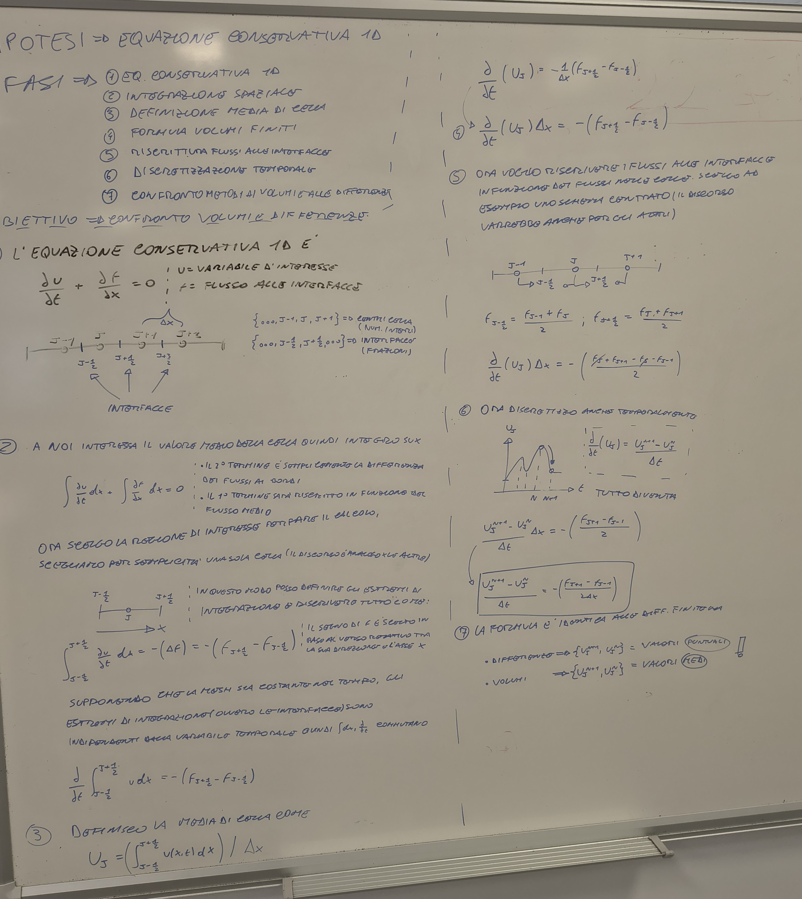

- Metodi di ordine elevati nello spazio
    1. Weighted Essentially Non Oscillatory 5
        
        <aside>
        💡
        
        Un metodo che ha come obiettivo di ridurre oscillazioni spurie della soluzione e conservarne la fedeltà. 
        Per farlo si calcolano diverse soluzioni e tramite una matrice di pesi si ponderano maggiormente le più regolari, ignorando le oscillazioni.
        Nella versione con stencil pari a 5 anziché creare direttamente un polinomio di grado 4 (che produrrebbe overshoot e undershoot) si decide di creare tre gruppi di 3 punti (tre parabole) e di sommarle. 
        
        </aside>
        
        
        
    2. Discontinuous Galerkin 
- Time integration
    1. 
- Delaunay
    
    Questo metodo trasforma un insieme sparso di punti in una rete di triangoli connessi. La sua caratteristica principale è che massimizza gli angoli minimi dei triangoli, evitando triangoli troppo "sottili" o deformati, (evitando i problemi di skewness della mesh) il che è ideale per molte simulazioni e rappresentazioni grafiche.
    
    
    
    ## 1. Nube di Punti (Point Cloud)
    
    - **Che cos'è:** È il punto di partenza. Un insieme di punti discreti (spesso chiamati nodi) distribuiti in uno spazio bidimensionale (o tridimensionale). Questi punti non hanno una connessione predefinita. Nelle nostre applicazioni tali nodi potrebbero essere i nodi della mesh (se ragioniamo a facce centrate altrimenti sarebbero i centri a nodi centrati)
    - **Ruolo:** Rappresenta la discretizzazione del dominio che si vuole studiare o modellare. È l'equivalente di avere una serie di "misurazioni" o "campioni" in posizioni casuali.
    
    ## 2. Diagramma di Voronoi
    
    - **Che cos'è:** È una tassellatura dello spazio basata sulla nube di punti. Per ogni punto (chiamato "sito" o "generatore"), viene creata una cella poligonale.
    - **Proprietà:** Tutti i punti all'interno di una specifica cella di Voronoi sono più vicini al punto generatore di quella cella rispetto a qualsiasi altro punto della nube. I confini della cella sono le bisettrici perpendicolari tra i punti vicini.
    - **Significato:** Definisce l'"area di influenza" di ogni singolo punto. È un modo per dividere il dominio in regioni di prossimità. Anche nella raffinazione della mesh molti software offrono la possibilità di definire e modificare delle aree di influenza.
    
    ## 3. Triangolazione di Delaunay (il "Duale")
    
    - **Che cos'è:** È la rete di triangoli costruita collegando i punti i cui diagrammi di Voronoi condividono un bordo.
    - **La Dualità:** È definita come il *duale* del diagramma di Voronoi. Questo significa che ogni bordo della triangolazione di Delaunay corrisponde a un bordo nel diagramma di Voronoi che separa le celle dei due punti connessi.
    - **La Proprietà Chiave è che non deve contenere altri punti della discretizzazione.**
        
        Più formalmente, si dice che il **cerchio circoscritto (circumcircle)** di ogni triangolo Delaunay non contiene altri punti della nube al suo interno (la cosiddetta "condizione di non-conterere altri punti"). È proprio questa proprietà a garantire triangoli "ben formati". Se un cerchio circoscritto contenesse un altro punto, la triangolazione verrebbe "aggiustata" per soddisfare la condizione.
        
- FVS e FDS
    
    <aside>
    💡
    
    **Flux Vector Splitting (FVS):** Il nome viene dal fatto che si spezza il *vettore flusso* $\mathbf{F}(U)$ in due parti: 
    
    </aside>
    
    $$
    \mathbf{F} = \mathbf{F}^+(U) + \mathbf{F}^-(U)
    $$
    
    dove $\mathbf{F}^+$ trasporta informazione verso destra (autovalori $\lambda \geq 0$) e $\mathbf{F}^-$ verso sinistra (autovalori $\lambda \leq 0$).
    
     Esempio: Steger-Warming, van Leer, AUSM+.
    
    <aside>
    💡
    
    **Flux Difference Splitting (FDS):** Il nome viene dallo splitting della *differenza di flusso* 
    
    </aside>
    
    $$
    \Delta F = F(U_R) - F(U_L)
    $$
    
    usando la diagonalizzazione della Jacobiana $A = \partial F/\partial U$. Si smonta $\Delta F$ nelle sue componenti caratteristiche: 
    
    $$
    \Delta F = A^+ \Delta U + A^- \Delta U.
    $$
    
    Esempio: Roe, Godunov esatto, HLLC.
    
    In breve: FVS spezza il flusso stesso; FDS spezza la differenza tra flussi.
    
- Tipologie di schemi
    
    Once the control volume is identified, the next task is to compute the fluxes across each face, which can be composed by a convective term (Euler equations) or by the sum of convective and diffusive terms (compressible Navier-Stokes equations). In any case, a **convective flux term** is present and different methods to evaluate it will be discussed in this section.
    
    Convective flux evaluation methods fall into two principal families: **upwind schemes** and **central schemes**.
    
    ```mermaid
    graph TD
        %% Metodi Principali
        Root(Convective Flux Evaluation Methods)
        
        Root --> Upwind[Upwind Schemes]
        Root --> Central[Central Schemes]
        
        %% Sotto-categorie Upwind
        Upwind --> FDS[Flux Difference Splitting]
        Upwind --> FVS[Flux Vector Splitting]
        
        %% Metodi FDS
        FDS --> Godunov[Godunov]
        FDS --> Osher[Osher-Pandolfi]
        FDS --> Roe[Roe]
        
        %% Metodi FVS
        FVS --> SW[Steger and Warming]
        FVS --> VL[van Leer]
        FVS --> AUSM[AUSM+]
        
        %% Metodi Central
        Central --> LFR[Lax-Friedrichs or Rusanov]
        Central --> JST[Jameson-Schmidt-Turkel]
    
        %% Styling per chiarezza
        style Root fill:#f9f,stroke:#333,stroke-width:2px
        style Upwind fill:#bbf,stroke:#333,stroke-width:2px
        style Central fill:#bbf,stroke:#333,stroke-width:2px
    
    ```
    
    | Famiglia | Metodo Specifico | Logica Principale | Pro | Contro | Casi d'Uso Ideali |
    | --- | --- | --- | --- | --- | --- |
    | **Upwind (FDS)** | **Roe / Osher** | Risolvono (esattamente o approssimativamente) il problema di Riemann all'interfaccia. | Altissima precisione nelle zone di contatto e strati limite. | Molto costosi computazionalmente; algoritmi complessi. | Aerodinamica esterna, flussi viscosi, analisi di precisione. |
    | **Upwind (FVS)** | **van Leer / Steger-Warming** | Scompongono il vettore flusso in componenti positive e negative basate sugli autovalori. | Molto robusti; eccellenti per catturare urti forti senza "esplodere". | Eccessivamente diffusivi negli strati limite (perdono precisione vicino alle pareti). | Flussi ipersonici, flussi con urti molto violenti. |
    | **Upwind (Ibrido)** | **AUSM+** | Separa la velocità (convezione) dalla pressione (onde sonore). | Unisce la precisione di Roe alla robustezza di van Leer. | Implementazione non banale. | Motori a combustione, flussi chimicamente reagenti, alte velocità. |
    | **Central** | **JST (Jameson-Schmidt-Turkel)** | Media matematica tra le celle con aggiunta di "dissipazione artificiale" controllata (operatori di 2° e 4° ordine). | Estremamente veloci; facili da programmare; ottimi per griglie strutturate. | Richiedono un "tuning" manuale dei coefficienti di dissipazione. | Design di velivoli commerciali, simulazioni industriali standard. |
    | **Central** | **Lax-Friedrichs / Rusanov** | Media semplice con un termine di diffusione molto forte per mantenere la stabilità. | Impossibile da far divergere (estremamente stabile). | Troppo impreciso (spalma eccessivamente i gradienti e gli urti). | Test iniziali di codici, casi dove la stabilità conta più della precisione. |
- Evoluzione storica
    
    **Perché non esiste "lo schema perfetto"?**
    
    La scelta di uno schema piuttosto che un altro è figlia di un'evoluzione storica e tecnologica guidata da un compromesso tra **accuratezza** e **costo computazionale**.
    
    1.	**L'epoca dei Central:** All'inizio della CFD, la potenza di calcolo era minima. Gli schemi centrati erano i preferiti perché richiedevano poche operazioni matematiche. Tuttavia, avevano un difetto fatale: in presenza di urti (shocks), generavano oscillazioni numeriche (instabilità) che distruggevano la soluzione. Per "curarli", gli scienziati dovettero inventare la **dissipazione artificiale** (come nel metodo JST), ovvero aggiungere volutamente un po' di "errore controllato" per stabilizzare il calcolo.
    
    2.	**La rivoluzione di Godunov (Upwind):** Godunov capì che per risolvere correttamente i flussi supersonici bisognava rispettare la fisica: l'informazione viaggia in una direzione specifica (da monte a valle). Questo portò agli schemi **Upwind**. Sono matematicamente "più intelligenti" perché sanno da dove viene il fluido, ma questa intelligenza costa cara in termini di tempo di calcolo.
    
    3.	**Il dilemma moderno:** * Se stai progettando un jet supersonico dove l'onda d'urto è fondamentale, userai un **Roe** o un **AUSM+** perché non puoi permetterti errori sulla posizione dell'urto.
    
    - Se stai facendo un'analisi preliminare di un'ala di un aereo di linea a velocità moderata, un metodo **Central (JST)** è ancora oggi una scelta imbattibile per velocità e affidabilità.
    
    In breve: si è passati dal "far girare il codice senza farlo crashare" (Central + Dissipazione) al "catturare la fisica esatta" (Upwind/FDS), cercando oggi di trovare il punto di equilibrio con metodi ibridi.
    
- Logica e causalità upwind e centrati
    
    **Perché l'Upwind è "più fisico"?**
    
    Il concetto è molto intuitivo se pensi al **principio di causalità**. In fisica, l'informazione non appare dal nulla: si muove a una certa velocità in una certa direzione.
    
    **1. L'analogia del fiume**
    
    Immagina di essere seduto su una barca in un fiume che scorre velocissimo (flusso supersonico). Se vuoi sapere se tra un minuto andrai a sbattere contro un masso, devi guardare **davanti a te** (a monte, ovvero upwind). Guardare dietro di te (downwind) non ti serve a nulla: quello che è già passato non può più influenzare la tua posizione attuale.
    
    - **Metodo Upwind:** Guarda solo nella direzione da cui proviene l'informazione. Se il vento soffia da destra, "ascolta" solo quello che succede a destra.
    - **Metodo Central:** Fa una media tra destra e sinistra. In un flusso supersonico, questo è un errore fisico: stai dicendo che quello che succede a valle può influenzare quello che succede a monte, il che viola la realtà dei fatti.
    
    **2. Le "Caratteristiche" e gli Autovalori**
    
    Tecnicamente, nelle equazioni di Eulero o Navier-Stokes, l'informazione viaggia lungo delle linee chiamate **caratteristiche**. La velocità di queste informazioni è legata agli autovalori della matrice Jacobiana del flusso:
    
    - u: la velocità del fluido (trasporto di massa).
    - u + c: un'onda sonora che viaggia nel verso del fluido.
    - u - c: un'onda sonora che viaggia controcorrente.
    
    In un flusso **supersonico** (u > c), tutti questi valori sono positivi. Significa che tutta l'informazione viaggia in una sola direzione. Lo schema Upwind lo sa e usa solo i dati che provengono da quella direzione. Lo schema Central, invece, cerca di usare dati da entrambe le parti, creando "confusione" numerica che si traduce in oscillazioni assurde o instabilità vicino agli urti.
    
    **In sintesi:**
    
    Gli schemi Upwind rispettano la **direzionalità della propagazione dei segnali**. È come se il software dicesse: "Ehi, so che il fluido si muove verso destra a Mach 2, quindi ignoro completamente quello che succede a sinistra perché non può influenzare questo punto". I metodi Central sono più "democratici" (ascoltano tutti), ma in fluidodinamica la democrazia spesso porta al caos numerico!
    
- Godunov
    
    1 — L’immagine del ventaglio: caso fortunato o generico?
    È il caso generico, non sfortunato. Ogni interfaccia  nel metodo di Godunov è per definizione un problema di Riemann locale — indipendentemente da cosa ci sia nel flusso fisico. La struttura delle caratteristiche che si vedono nel diagramma - non è “a cavallo di un urto reale”: è la struttura della soluzione matematica del problema di Riemann che il metodo costruisce artificialmente a ogni interfaccia a ogni passo temporale.
    La soluzione del problema di Riemann per le equazioni di Eulero 1D produce sempre 3 onde (perché ci sono 3 autovalori , , ):
    
    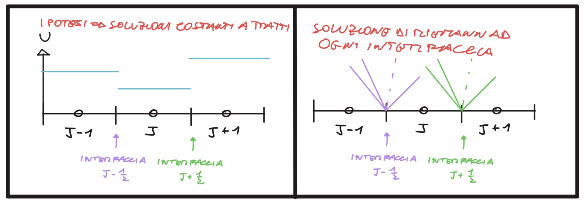
    
    Se i due stati sono quasi uguali (interfaccia “normale” lontana da fenomeni forti), le 3 onde sono debolissime (onde acustiche quasi nulle) — ma esistono. Se l’interfaccia è in corrispondenza di un urto fisico, una delle onde diventa forte. Le caratteristiche si propagano da ogni interfaccia, sempre, con questa struttura a ventaglio. L’onda sinistra può essere un’onda di rarefazione (ventaglio di caratteristiche) oppure un urto (singola linea), e lo stesso per l’onda destra — il solver di Riemann determina quale caso si applica in base ai due stati  e .
    
    ## 1 — Cosa sono i $\sigma_k$?
    
    $\sigma_k = \text{sign}(\lambda_k)$ è il **segno dell'autovalore** $k$-esimo. Per le equazioni di Eulero 1D i tre autovalori sono:
    
    $$
    \lambda_1 = u - a, \quad \lambda_2 = u, \quad \lambda_3 = u + a \\
    \sigma_k = \text{sign}(\lambda_k)
    $$
    
    Quindi $\sigma_k \in \{-1, +1\}$ e descrive la **direzione di propagazione** dell'onda $k$:
    
    | Regime | Condizione | Segni $(\sigma_1, \sigma_2, \sigma_3)$ |
    | --- | --- | --- |
    | **Subsonico** | $u< a$ | $(-1,+1,+1)$ |
    | **Supersonico (destra)** | $u > a$ | $(+1, +1, +1)$ |
    | **Supersonico (sinistra)** | $u < -a$ | $(-1, -1, -1)$ |
    
    I $\sigma_k$ entrano nelle formule dello splitting tramite i proiettori:
    
    $$
    \frac{1 + \sigma_k}{2} = \begin{cases} 1 & \text{se } \sigma_k = +1 \\ 0 & \text{se } \sigma_k = -1 \end{cases}
    $$
    
    $$
    \frac{1 - \sigma_k}{2} = \begin{cases} 0 & \text{se } \sigma_k = +1 \\ 1 & \text{se } \sigma_k = -1 \end{cases}
    $$
    
    ---
    
    ## 2 — Interpretazione CFL nel metodo di Godunov
    
    In un diagramma $x-t$, si consideri una cella centrata in $j$ $[x_{j-1/2}, x_{j+1/2}]$. L'interpretazione fisica della **CFL** è: **le caratteristiche generate dall'interfaccia $j+1/2$ e quelle generate dall'interfaccia $j-1/2$ non devono sovrapporsi all'interno della cella durante il time step $\Delta t$.**
    
    La condizione quantitativa è:
    
    $$
    
    \text{CFL} = \frac{\lambda_{max} \Delta t}{\Delta x} \leq 1, \quad \lambda_{max} = \max_j \max_k |\lambda_k^j|
    $$
    
    $\Delta t$ deve essere tale da tenere tutte le caratteristiche dentro la cella di partenza per garantire che la soluzione locale del problema di Riemann rimanga valida.
    
    ---
    
    ## 3 — Lo splitting dei flussi: segni e contributi
    
    ### Notazione all'interfaccia $j+1/2$
    
    - **Stato A** $= U_j$ (sinistra) prima di tutto
    - **Stato B** $= U_{j+1}$ (destra) dopo anche l’urto
    - **Stato C** $=$ stato intermedio dopo l'onda 1 (ventaglio di espansione)
    - **Stato D** $=$ stato intermedio dopo il contatto (onda 2) ovvero slip Line
    
    Il **salto totale dei flussi** $F_B - F_A$ si scompone in tre contributi:
    
    
    
    $$
    
    F_B - F_A = \underbrace{(F_C - F_A)}_{\text{onda 1}} + \underbrace{(F_D - F_C)}_{\text{onda 2}} + \underbrace{(F_B - F_D)}_{\text{onda 3}}
    $$
    
    > Questa operazione è matematicamente corretta poiché si aggiunge e toglie $F_C$ ed $F_D$.
    > 
    
    Dal punto di vista logico l’idea è esprimere la variazione del flusso totale tra la l’interfaccia tra le celle A=j e B=j+1 con le singole variazioni dei flussi a cavallo delle onde tipiche del problema di Riemann (espansione, slip line e urto).
    
    Dal punto di vista fisico il flusso è diverso poiché il campo di moto è stato modificato
    
    ### Definizione di $\overrightarrow{DF}$ e $\overleftarrow{DF}$
    
    Separiamo i contributi che vanno a destra ($\rightarrow$) da quelli che vanno a sinistra ($\leftarrow$):
    
    $$
    
    \overrightarrow{DF}_j = \frac{1 + \sigma_1}{2}(F_C - F_A) + \frac{1 + \sigma_2}{2}(F_D - F_C) + \frac{1 + \sigma_3}{2}(F_B - F_D)\\
    \overleftarrow{DF}_j = \frac{1 - \sigma_1}{2}(F_C - F_A) + \frac{1 - \sigma_2}{2}(F_D - F_C) + \frac{1 - \sigma_3}{2}(F_B - F_D)
    $$
    
    ### Aggiornamento della cella $j$
    
    Il flusso numerico di Godunov è 
    Sostituendo nell'equazione di bilancio, otteniamo il risultato centrale (natura **upwind**):
    
    $$
    F_{j+1/2} = F_j + \overleftarrow{DF}j = F{j+1} - \overrightarrow{DF}_j
    $$
    
    $$
    U_j^{n+1} = U_j^n - \frac{\Delta t}{\Delta x} \left[ \overleftarrow{DF}j + \overrightarrow{DF}{j-1} \right]
    $$
    
    La cella $j$ riceve solo informazioni fisicamente entranti: onde destre dall'interfaccia sinistra e onde sinistre dall'interfaccia destra.
    
    ---
    
    ## 4 — Approssimazione dell'onda di espansione e Schema di Roe
    
    Lo schema di **Roe** linearizza il problema di Riemann usando una matrice Jacobiana media $\bar{A}$.
    
    - **Perché si fa?** Risolvere il problema non lineare esatto richiederebbe un loop iterativo (Newton) a ogni interfaccia, con costi computazionali enormi. Roe è estremamente economico.
    - **Il problema (Expansion Shocks):** Essendo basato su un sistema linearizzato, Roe non distingue tra urti compressivi e urti espansivi. Può produrre soluzioni che violano il secondo principio della termodinamica (urti espansivi non fisici), specialmente in regime transonico ($u \approx a$).
    
    ### Correzioni (Entropy Fix)
    
    Per ovviare a questo problema senza tornare al costo di Godunov esatto, si usano:
    
    - **Entropy fix di Harten-Hyman:** aggiunge viscosità numerica artificiale solo dove $|\lambda_k| < \epsilon$ (punti sonici).
    - **Solver HLLC:** un approccio approssimato alternativo che soddisfa nativamente la condizione di entropia.
- Roe

---


</details>

## Formule da ricordare

<details>
<summary><strong>🧠 Tutte le formule del capitolo (differenze finite + volumi finiti + proprietà)</strong></summary>

#### Errori (locale e globale)

| Formula | Hint / collegamento |
|---|---|
| $\tilde y_{k+1} = y(t_k) + h\,f(t_k, y(t_k))$ | un passo di Eulero **partendo dal dato esatto** $y(t_k)$ (non da $y_k$) |
| $\tau(h) = y(t_{k+1}) - \tilde y_{k+1} = y(t_{k+1}) - y(t_k) - h\,f(t_k,y(t_k))$ | **troncamento locale**: errore di un solo passo; nasce dal troncamento dei termini di grado alto |
| $d(h) = \dfrac{\tau(h)}{h}$ | **discretizzazione locale**: dipende da come discretizzi l'intervallo; è $\tau$ "per unità di $h$" |
| $e_{k+1} = y(t_{k+1}) - y_{k+1} = \underbrace{\big(y(t_{k+1})-\tilde y_{k+1}\big)}_{\text{troncamento}} + \underbrace{\big(\tilde y_{k+1}-y_{k+1}\big)}_{\text{propagazione}}$ | **globale** = troncamento (ultimo passo) + propagazione (passi precedenti) |

#### Consistenza, ordine, 0-stabilità, assoluta stabilità

| Formula | Hint / collegamento |
|---|---|
| $\lim_{h\to0} d(h) = 0$ | **consistenza**: l'errore di discretizzazione svanisce a passo nullo |
| $d(h) = \mathcal O(h^p)$ | **ordine** $p$ (Eulero: $p=1$); $p$ = pendenza nel grafico log–log |
| $\lvert y_k-\hat y_k\rvert \le K\,\lvert y_0-\hat y_0\rvert,\ \forall k\le\frac{b-a}{h}$ | **0-stabilità**: $K$ come numero di condizionamento, non amplifica l'errore |
| $\displaystyle\lim_{k\to\infty} y_k = 0$ | **assoluta stabilità**: ha senso solo se la soluzione esatta tende a 0 (asint. stabile) |
| Lax: consistenza + 0-stabilità $\Rightarrow$ convergenza, $\lim_{N\to\infty} y_N = y(t)$ | **Lax–Richtmyer**: one-step (stabili) + consistenti $\Rightarrow$ convergenti |

#### Regione di assoluta stabilità

| Formula | Hint / collegamento |
|---|---|
| $y_{k+1} = \mathcal F(h\lambda)\,y_k \Rightarrow y_{k+1} = \mathcal F(h\lambda)^{k+1} y_0$ | qualsiasi metodo si riscrive con il **fattore di amplificazione** $\mathcal F$ |
| $R_a = \{\, h\lambda\in\mathbb C : \lvert\mathcal F(h\lambda)\rvert < 1 \,\}$ | **regione** nel piano complesso $h\lambda$; impliciti $\to$ regione ampia |
| $y'(t)=\lambda y(t) \to \mathrm{Re}(\lambda)<0$;  $\;y'(t)=Ay(t) \to \mathrm{Re}(\lambda_i)<0\ \forall i$ | **sistemi**: la condizione vale per **tutti** gli autovalori di $A$ |
| $y(t)=c_1 e^{\lambda_1(t-t_0)}v_1+\dots+c_m e^{\lambda_m(t-t_0)}v_m$ | $A$ diagonalizzabile; asint. stabile se $\mathrm{Re}\,\lambda_i<0\ \forall i$ |

#### Runge-Kutta

| Formula | Hint / collegamento |
|---|---|
| $y_{k+1}=y_k+h\sum_{i=1}^{s} a_i\,f\!\big(t_k+b_i h,\ y_k+h\sum_{j=1}^{i-1} c_{ij}k_j\big)$ | forma generica a $s$ stadi; la somma fino a $i-1$ lo rende **esplicito** (fino a $i$ $\to$ implicito) |
| $\sum_{i=1}^{s} a_i = 1,\qquad b_i=\sum_{j=1}^{s} c_{ij}\ \ \forall i$ | **condizioni di consistenza** sul tableau di Butcher |
| Eulero esplicito: $y_{k+1}=y_k+h f(t_k,y_k)$, $\ \mathcal F=1+h\lambda$ | $p=1$, 1 stadio |
| Eulero implicito: $y_{k+1}=y_k+h f(t_{k+1},y_{k+1})$, $\ \mathcal F=\dfrac{1}{1-h\lambda}$ | $p=1$, A-stabile (regione ampia) |
| Heun: $y_{k+1}=y_k+\frac h2\big[f(t_k,y_k)+f(t_{k+1},y_k+h f(t_k,y_k))\big]$, $\ \mathcal F=1+h\lambda+\frac{(h\lambda)^2}{2}$ | $p=2$, esplicito, 2 stadi |
| Trapezi: $y_{k+1}=y_k+\frac h2\big[f(t_k,y_k)+f(t_{k+1},y_{k+1})\big]$ | $p=2$, implicito, 2 stadi |
| Eulero modificato: $y_{k+1}=y_k+h f\!\big(t_k+\frac h2,\ y_k+\frac h2 f(t_k,y_k)\big)$ | esplicito, 2 stadi (punto medio) |

#### Stiffness e CFL

| Formula | Hint / collegamento |
|---|---|
| $\max_i \lvert\mathrm{Re}(\lambda_i)\rvert\,L \ll -1$ | **grado di stiffness**: autovalore molto negativo $\to$ passo piccolo forzato su intervallo $L$ grande |
| $y(t)=c_1 e^{\lambda_1(t-t_0)}v_1+\dots+c_m e^{\lambda_m(t-t_0)}v_m$ | il termine con $\lambda$ molto negativo decade subito ma vincola il passo (usa impliciti / ode15s) |

> Specchietto di sintesi: gli schemi discreti che vale la pena tenere a memoria, con un **gancio** mnemonico e i **collegamenti** con la natura (iperbolica/ellittica) dell'equazione. Sono **discretizzazioni**, non identità: vanno ricordate per la loro *forma dello stencil*.

#### Discretizzazione spaziale per natura dell'equazione

| Formula | Hint / collegamento |
| --- | --- |
| $u_i^{n+1}=u_i^n-\dfrac{a\Delta t}{\Delta x}\big(u_i^n-u_{i-1}^n\big)$ ($a>0$) | schema **upwind** (avvezione): guarda **all'indietro** verso $i-1$, da dove arriva il segnale → rispetta il dominio di dipendenza delle **iperboliche** (Godunov, Roe). Memo: differenza *a monte* + dissipazione numerica stabilizzante. |
| $\dfrac{u_{i-1}-2u_i+u_{i+1}}{\Delta x^2}=f_i$ | Laplaciano **centrato** (Poisson/diffusione): stencil **simmetrico** a 3 punti → rispetta l'isotropia delle **ellittiche** (nessuna direzione privilegiata). Memo: pattern $1,-2,1$. |


---

> Specchietto di sintesi: le formule che vale la pena tenere a memoria, con un **gancio** mnemonico e i **collegamenti** tra loro. Schemi chiave: **Godunov** (Riemann), **Roe** (upwind linearizzato), **Lax–Friedrichs** (centrato), **flux vector/difference splitting**.

#### Bilancio FVM e variabile di cella

| Formula | Hint / collegamento |
| --- | --- |
| $\partial_t u+\partial_x f=0$, $f=f(u)$ | forma conservativa: solo flusso **convettivo** → **Eulero** = NS con $\mu=k=0$. |
| $U_j=\dfrac{1}{\Delta x}\int_{x_{j-1/2}}^{x_{j+1/2}}u\,dx$ | $U_j$ è la **media di cella**, non il valore puntuale (FD usa il puntuale). |
| $\dfrac{\partial}{\partial t}\int_{x_{j-1/2}}^{x_{j+1/2}}u\,dx=-(f_{j+1/2}-f_{j-1/2})$ | forma integrale: la cella cambia per **flussi netti alle interfacce** $j\pm1/2$. |
| $U_j^{n+1}=U_j^n-\dfrac{\Delta t}{\Delta x}\big[F_{j+1/2}-F_{j-1/2}\big]$ | aggiornamento esplicito: tutto sta nel **come scegli $F_{j\pm1/2}$**. |

#### Flusso numerico (centrato) e CFL

| Formula | Hint / collegamento |
| --- | --- |
| $f_{j+1/2}=\tfrac12(f_j+f_{j+1})$ | schema **centrato**: media aritmetica → in 1D coincide con FD, ma instabile sugli urti. |
| $F_{j+1/2}^{LF}=\tfrac12(F_j+F_{j+1})-\dfrac{\lambda_{max}}{2}(U_{j+1}-U_j)$ | **Lax–Friedrichs/Rusanov** = centrato + **dissipazione scalare** $\propto\lambda_{max}\Delta U$. Rusanov: $\lambda_{max}=\max(|\lambda_j|,|\lambda_{j+1}|)$. |
| $\text{CFL}=\dfrac{\lambda_{max}\,\Delta t}{\Delta x}\le1$, $\lambda_{max}=\max_j\max_k|\lambda_k^j|$ | $\Delta t$ piccolo abbastanza che le onde di due Riemann adiacenti **non si sovrappongano**. |

#### Godunov / problema di Riemann

| Formula | Hint / collegamento |
| --- | --- |
| $u(x,0)=u_L$ se $x<0$, $u_R$ se $x>0$ | dato a **gradino**: ogni interfaccia è un Riemann locale (tubo di Sod). |
| $\lambda_1=u-a,\ \lambda_2=u,\ \lambda_3=u+a$ | **3 autovalori** Eulero 1D → 3 onde (rarefazione, contatto, urto). |
| $\sigma_k=\text{sign}(\lambda_k)\in\{-1,+1\}$ | segno = **direzione di propagazione** dell'onda $k$ (upwind). |
| $\dfrac{1\pm\sigma_k}{2}$ | **proiettori** upwind: $\tfrac{1+\sigma}{2}$ tiene le onde destre, $\tfrac{1-\sigma}{2}$ le sinistre. |

#### Flux splitting (FVS / FDS)

| Formula | Hint / collegamento |
| --- | --- |
| $\mathbf F=\mathbf F^+(U)+\mathbf F^-(U)$ | **FVS**: si spezza il **vettore flusso** ($\lambda\ge0$ a destra, $\lambda\le0$ a sinistra). Steger-Warming, van Leer, AUSM+. |
| $\Delta F=F(U_R)-F(U_L)=A^+\Delta U+A^-\Delta U$ | **FDS**: si spezza la **differenza di flusso** via Jacobiana $A=\partial F/\partial U$. Roe, Godunov, HLLC. |
| $F_B-F_A=(F_C-F_A)+(F_D-F_C)+(F_B-F_D)$ | salto totale = somma sulle 3 onde (stati A→C→D→B), aggiungendo/togliendo $F_C,F_D$. |
| $\overrightarrow{DF}_j=\sum_k\tfrac{1+\sigma_k}{2}\Delta F_k$, $\ \overleftarrow{DF}_j=\sum_k\tfrac{1-\sigma_k}{2}\Delta F_k$ | contributi che vanno a **destra / sinistra** dell'interfaccia. |
| $F_{j+1/2}=F_j+\overleftarrow{DF}_j=F_{j+1}-\overrightarrow{DF}_j$ | flusso di Godunov: la cella riceve solo le onde **fisicamente entranti** (upwind). |
| $U_j^{n+1}=U_j^n-\dfrac{\Delta t}{\Delta x}\big[\overleftarrow{DF}_j+\overrightarrow{DF}_{j-1}\big]$ | onde sinistre dall'interfaccia destra + onde destre dall'interfaccia sinistra. |

#### Schema di Roe

| Formula | Hint / collegamento |
| --- | --- |
| $\bar A(U_R-U_L)=F(U_R)-F(U_L)$ | **consistenza** di Roe: la Jacobiana media cattura **esattamente** gli urti. |
| $\bar u=\dfrac{\sqrt{\rho_L}\,u_L+\sqrt{\rho_R}\,u_R}{\sqrt{\rho_L}+\sqrt{\rho_R}}$, $\ \bar H$ analoga | **media di Roe** = media pesata su $\sqrt\rho$ (vale anche per $H$). |
| $\overrightarrow{\delta F}_j=\sum_k\dfrac{\bar\lambda_k-|\bar\lambda_k|}{2}\,e^k\,\delta w_j^k$ | flusso di Roe: $\tfrac{\lambda-|\lambda|}{2}$ tiene solo i contributi **upwind** (autovettori $e^k$). |
| $|\lambda|\to\max(|\lambda|,\epsilon)$ | **entropy fix** (Harten-Hyman): viscosità artificiale solo sui **punti sonici** $|\lambda_k|<\epsilon$ → no urti espansivi non fisici. |


---

</details>

## Dimostrazioni

<details>
<summary><strong>📐 Tutte le dimostrazioni da saper fare</strong></summary>

| Dimostrazione | Punto di partenza → arrivo |
|---|---|
| Ordine di Eulero esplicito | Sviluppo di Taylor di $y(t_{k+1})$ → $\tau(h)=\tfrac{h^2}{2}y''(\xi)=\mathcal O(h^2)$, quindi $d(h)=\mathcal O(h)\Rightarrow p=1$ |
| Regione di assoluta stabilità di Eulero esplicito | Eq. test $y'=\lambda y$ → $y_k=(1+h\lambda)^k y_0$, $\mathcal F=1+h\lambda$, $\lvert 1+h\lambda\rvert<1$ (cerchio centro $-1$, raggio $1$) |
| Regione di assoluta stabilità di Eulero implicito | Eq. test $y'=\lambda y$ → $\mathcal F=\tfrac{1}{1-h\lambda}$, $\lvert 1-h\lambda\rvert>1$ (esterno cerchio centro $+1$; A-stabile) |
| Teorema di Lax | Decomposizione $e_{k+1}=$ troncamento $+$ propagazione → consistenza ($\tau\to0$) + 0-stabilità ($K$ limitato) $\Rightarrow$ $e_N=\mathcal O(h^p)\to0$ (convergenza) |
| Condizione CFL | Dominio di dipendenza fisico $c\,\Delta t$ vs numerico $\Delta x$ → $c\,\Delta t\le\Delta x\Rightarrow \tfrac{c\,\Delta t}{\Delta x}\le1$ |
| Ordine di Heun | Taylor dell'incremento $\tfrac h2[f_k+f(t_k+h,y_k+hf_k)]$ vs $y(t_{k+1})$ → match fino a $h^2$, $\tau=\mathcal O(h^3)\Rightarrow p=2$ |
| Ordine di un metodo Runge-Kutta | Matching dei Taylor di $y(t_{k+1})$ e incremento RK → condizioni d'ordine sul tableau ($\sum a_i=1$, $\sum a_i b_i=\tfrac12$, …) $\Rightarrow$ $d=\mathcal O(h^p)$ |

| Dimostrazione | Punto di partenza → arrivo |
|---|---|
| Perché l'upwind è stabile e il centrato no (advezione) | PDE $u_t+au_x=0$ + analisi di von Neumann → upwind $\lvert G\rvert\le1$ per $0\le\nu\le1$; centrato puro $\lvert G\rvert>1$ sempre (instabile incondizionatamente) |
| Equazione modificata e diffusione numerica dell'upwind (Taylor) | Schema upwind + sviluppo di Taylor + $u_{tt}=a^2u_{xx}$ → $u_t+au_x=\tfrac{a\Delta x}{2}(1-\nu)u_{xx}$, con $D_{num}\ge0$ |
| Anti-diffusione del centrato (equazione modificata) | Schema centrato + Taylor + $u_{tt}=a^2u_{xx}$ → $u_t+au_x=-\tfrac{a^2\Delta t}{2}u_{xx}$, con $D_{num}<0$ |
| Condizione CFL dal dominio di dipendenza | Soluzione esatta $u_0(x-at)$ + stencil a 3 punti → dominio fisico $\subseteq$ numerico, $\tfrac{\lvert a\rvert\Delta t}{\Delta x}\le1$ |
| Perché upwind=iperbolico e centrato=ellittico | Dominio di dipendenza (caratteristiche vs isotropia) → stencil asimmetrico a monte (iperbolica) vs simmetrico $1,-2,1$ (ellittica) |

| Dimostrazione | Punto di partenza → arrivo |
| --- | --- |
| Derivazione dello schema a volumi finiti | forma differenziale $\partial_t u+\partial_x f=0$ → integrazione sulla cella → $U_j^{n+1}=U_j^n-\frac{\Delta t}{\Delta x}(F_{j+1/2}-F_{j-1/2})$ |
| Condizione di Rankine-Hugoniot | forma integrale attorno alla discontinuità → $s(u_R-u_L)=f(u_R)-f(u_L)$ |
| Costruzione della media di Roe | consistenza $\bar A\,\Delta U=\Delta F$ + parametro $z=\sqrt\rho(1,u,H)^T$ → medie pesate su $\sqrt\rho$ |
| Flusso di Godunov dal problema di Riemann | Riemann locale a ogni interfaccia → scomposizione del salto sulle 3 onde → $F_{j+1/2}=F_j+\overleftarrow{DF}_j=F_{j+1}-\overrightarrow{DF}_j$ |
| Lax-Friedrichs = centrato + dissipazione | schema centrato instabile → aggiunta di $-\frac{\lambda_{max}}{2}\Delta U$ → flusso stabile |
| Interpretazione fisica della CFL (Godunov) | onde da $j\pm1/2$ nel piano $x$-$t$ → non sovrapposizione in $\Delta t$ → $\frac{\lambda_{max}\Delta t}{\Delta x}\le1$ |
| Necessità dell'entropy fix in Roe | linearizzazione $\bar A$ → urto espansivo non fisico su punto sonico → $|\lambda|\to\max(|\lambda|,\epsilon)$ |

</details>
