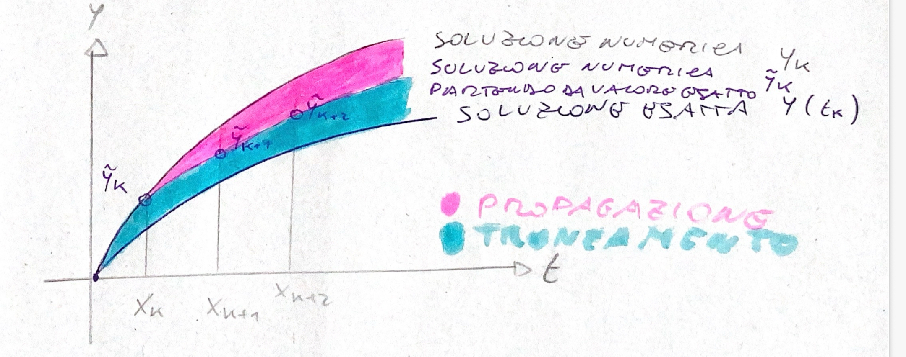
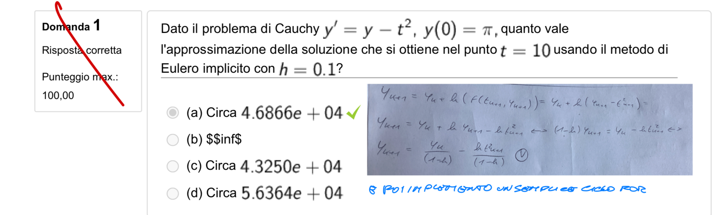
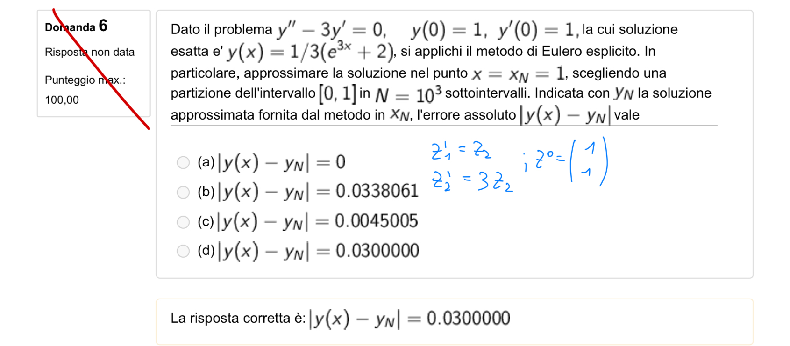
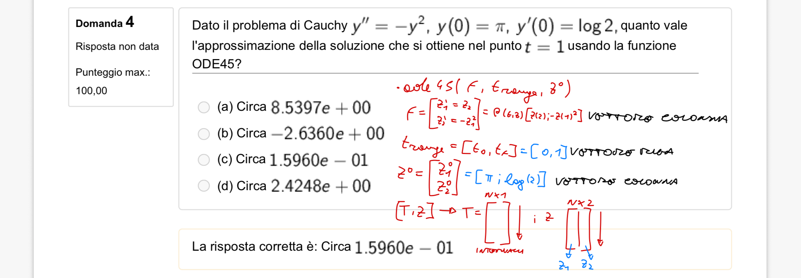

# Numerical Methods (ODE)

- **Tipologie di errore**
    1. Nomenclatura 
        
        - $y_k$ — soluzione **numerica** nel nodo $t_k$, $\forall k$;
        - $y(t_k)$ — soluzione **esatta** nel nodo $t_k$, $\forall k$;
        - $\tilde y_{k+1}$ — soluzione numerica in $t_{k+1}$ **partendo dal dato esatto** $y(t_k)$:
        
        $$\tilde y_{k+1} = y(t_k) + h\,f(t_k, y(t_k))$$
        
    2. Errore di troncamento 
        
        <aside>
        💡
        
        Si tratta della distanza tra la soluzione numerica e la soluzione esatta in un certo nodo
        
        </aside>
        
        **Errore locale di troncamento** $\tau(h)$ — l'errore commesso in **un passo**, partendo dalla soluzione esatta:
        
        $$\tau(h) = y(t_{k+1}) - \tilde y_{k+1} = y(t_{k+1}) - y(t_k) - h\,f(t_k, y(t_k))$$
        
        > Credo si chiami così perché alcuni metodi sono ottenuti dalle differenze finite con il troncamento di termini di grado più alto (che sono poi quelli che producono questo tipo di errore)
        > 
    3. Errore di discretizzazione 
        
        **Errore locale di discretizzazione** $d(h)$ — l'errore introdotto in un passo nella discretizzazione della derivata:
        
        $$d(h) = \frac{\tau(h)}{h}$$
        
        > Credo lo chiamino di discretizzazione poiché dipende da come ho discretizzazione l’intervallo
        > 
    4. Errore globale 
        
        **Errore globale** $e_{k+1}$ — l'errore complessivo commesso in $k$ passi di integrazione, scomponibile in troncamento (ultimo passo) + propagazione (passi precedenti):
        
        $$e_{k+1} = y(t_{k+1}) - y_{k+1} = \underbrace{\big(y(t_{k+1}) - \tilde y_{k+1}\big)}_{\text{err. troncamento}} + \underbrace{\big(\tilde y_{k+1} - y_{k+1}\big)}_{\text{propagazione}}$$
        
    5. Interpretazione grafica degli errori
        
        
        
- **Consistenza, 0-stabilitá, assoluta stabilità e convergenza**
    1. Consistenza e ordine di consistenza
        
        <aside>
        💡
        
        Se sul singolo nodo l’errore di discretizzazione, cioè la distanza tra risultato del metodo numerico e valore esatto, è molto piccolo si dice che il metodo è consistente
        
        </aside>
        
        **Consistenza:** un metodo è consistente se $\lim_{h\to 0} d(h) = 0$.
        
        **Ordine (di consistenza):** un metodo è di ordine $p$ se $d(h) = \mathcal{O}(h^p)$ (es. Eulero $= \mathcal O(h)\Rightarrow p=1$).
        
        > La sola consistenza non `e sufficiente per la convergenza, a causa del termine di propagazione degli errori. Affinch`e un metodo numerico sia convergente occorre che sia consistente e che garantisca la non propagazione degli errori.
        > 
    2. 0-stabilità 
        
        <aside>
        💡
        
        Il metodo si dice zero stabile se il termine di propagazione dell’errore è piccolo, cioè se le operazioni non amplificano l’errore di discretizzazione
        
        </aside>
        
        **0-stabilità:** un metodo è 0-stabile se $\exists\,K>0,\ \bar h$ tali che, dati due valori iniziali $y_0,\hat y_0$, le soluzioni soddisfano (per $h\le\bar h$):
        
        $$|y_k - \hat y_k| \le K\,|y_0 - \hat y_0| \qquad \forall k \le \frac{b-a}{h}$$
        
        > Descritto in maniera differente K è molto simile all’essere un numero di condizionamento ed infatti il significato è sempre quello di verificare che il metodo sia stabile e non propaghi l’errore
        > 
    3. Assoluta stabilità 
        
        <aside>
        💡
        
        Un metodo numerico si definisce assolutamente stabile se la successione dei valori della soluzione numerica tende a zero (e chiaramente anche la soluzione esatta tende a zero altrimenti non avrebbe alcun senso)
        
        </aside>
        
        $$
        \lim \limits _{k\to \infin } y_k=0
        $$
        
        > Si noti che ha senso valutare l’assoluta stabilità soltanto se la funzione analitica è asintoticamente stabile, cioè se tenderebbe comunque a zero (ad esempio un esponenziale decrescente). Ma se la funzione analitica non tende a zero allora non ha proprio senso porsi il problema
        > 
    4. Regione di assoluta stabilità 
        
        $$
        y_{k+1} = \mathcal{F}(h\lambda) y_k \to y_{k+1}\mathcal{F}(h\lambda) ^{k+1}y_0
        $$
        
        <aside>
        💡
        
        In generale, è possibile riscrivere qualsiasi metodo numerico in una forma del tipo $y_{k+1} = \mathcal{F}(h\lambda) y_k$ dove $\mathcal{F}(h\lambda)$ dipende da metodo a metodo. A questo punto, imporre la condizione di assoluta stabilità, significa sostanzialmente assicurarsi che il modulo di  $\mathcal{F}(h\lambda) <1$. La porzione di piano complesso, dove questo accade si definisce regioni di assoluta stabilità. Questo spiega anche perché vengono utilizzati i metodi numerici impliciti che pur essendo con computazionalmente più esosi, presentano una regione di assoluta stabilità molto ampia.
        
        </aside>
        
        
        
        *Regione di Assoluta Stabilità  (PDF allegato Notion, non incluso nell'export)*
        
        $$
        R_a = {hλ ∈ ℂ : |\mathcal{F}(h\lambda) | < 1}
        $$
        
        > La presenza di eventuali termini sorgente che non rendono l’equazione omogenea non hanno alcun effetto sulla stabilità quindi si possono tranquillamente ignorare
        > 
    5. Assoluta stabilità per i sistemi 
        
        <aside>
        💡
        
        Se ho un sistema di equazioni differenziali posso riscrivere il problema in modo compatto e fare dei ragionamenti del tutto analoghi . Qui non occorre garantire la condizione $\lambda<0$ non solo per l’unico coefficiente della singola equazione ma per tutti gli autovalori della matrice 
        
        </aside>
        
        $$
        [equazione] \to y'(t) = \lambda y(t)\to  Re(\lambda) <0 \\ [sistema] \to  y'(t) = Ay(t)\to Re(\lambda_i)<0
        \\ 
        $$
        
        Se $A$ è diagonalizzabile, con autovalori $\lambda_i$ e autovettori $v_i$ ($i=1,\dots,m$):
        
        $$y(t) = c_1 e^{\lambda_1 (t-t_0)} v_1 + \dots + c_m e^{\lambda_m (t-t_0)} v_m$$
        
        Se $\mathrm{Re}\,\lambda_i < 0\ \forall i$ il problema è **asintoticamente stabile**.
        
    6. Convergenza (Lax-Richtmeyer)
        
        <aside>
        💡
        
        Se un metodo numerico è consistente e 0-stabile allora sarà convergente.
        
        </aside>
        
        **Convergenza:** dato $t\in[a,b]$ e una suddivisione di $[a,t]$ in $N$ intervalli di ampiezza $h=\frac{t-a}{N}$, il metodo è convergente se
        
        $$\lim_{N\to\infty} y_N = y(t)$$
        
        ovvero se l'errore globale $e_N\to 0$. Il metodo è convergente in $[a,b]$ se lo è $\forall t\in[a,b]$.
        
- **Passi, espliciti-impliciti, stadi e stencil**
    1. Metodi one-step e multi-step
        
        <aside>
        💡
        
        I metodi ad un passo sono quelli in cui l’iterata dipende soltanto dal valore dell’iterata precedente. I metodi multistep invece presentano un iterata che può dipendere anche da numerosi passi precedenti.
        
        </aside>
        
        <aside>
        
        Tutti i metodi one-step sono stabili 
        
        </aside>
        
        > Quelli che studiamo noi sono tutti metodi one-step (quindi stabili) e anche consistenti (quindi per Lax-Rictmer) anche convergenti
        > 
    2. Metodi espliciti e impliciti 
        
        <aside>
        💡
        
        Nei metodi espliciti, il calcolo dell’ iterata è fatto tramite un’espressione scritta in forma esplicita che è più facile da risolvere, ma che potenzialmente può portare a errori di propagazione più alta che anche il motivo per cui poi esistono metodi impliciti
        
        </aside>
        
        |  | Espliciti | Impliciti |
        | --- | --- | --- |
        | Pro | 1)Richiedono meno memoria RAM (devono memorizzare solo la soluzione corrente)
        2)Facili da scalare sul calcolo parallelo poiché le regioni del dominio sono indipendenti e le operazioni dipendono solo dalle soluzioni agli istanti temporali precedenti
        3)Facili da implementare poiché richiedono espressioni esplicite più intuitive | Posso scegliere il passo temporale in modo arbitrario senza preoccuparmi della stabilità (poiché lo sono intrinseamente) |
        | Contro |  | 1)Dovendo risolvere un sistema lineare (anche molto grande) ad ogni passo richiedono maggiore potenza di calcolo rispetto agli espliciti a parità di numero di iterazioni.
        2)Dovendo memorizzare oltre alla soluzione precedente anche le matrici dei coefficienti e il vettore delle soluzioni del sistema lineare si occupa molta più memoria (in alcuni casi anche x35) 
        3)La scalabilità sul calcolo parallelo è complessa e bisogna tenere in conto la banda passante a disposizione |
        | Casi d’uso | 1)Analisi al variare del tempo di problemi **instazionari**. Se comunque devo scegliere un passo temporale piccolo per studiare fenomeni ad alta frequenza allora la limitazione sul passo degli espliciti non mi preoccupa e il vantaggio degli impliciti si perde. Questo è tipico delle DNS sulla turbolenza | 1)Analisi **stazionarie**. Se ciò che succede nel singolo istante di tempo non mi interessa ma voglio solo valutare la soluzione asintotica allora conviene prendere un passo temporale molto grande e “saltare direttamente alla soluzione”. Questo però si può fare solo nei metodi impliciti dove il passo è arbitrario mentre in quelli espliciti è limitato dalla stabilità.
        2)Se il problema è **stiff** con un metodo implicito posso evitare passi temporali molto piccoli limitati dall’autovalore più piccolo legato al fenomeno di bassa scala che avrei in uno schema esplicito e avere una soluzione più facilmente. |
        
        > Durante la risoluzione delle equazioni implicite necessarie alla valutazione dell’interata successiva può accadere che le soluzioni siano multiple (e in tal caso bisogna sceglierne una, ad esempio la più vicina all’interata precedente) o che non esistano (e in tal caso il metodo di blocca)
        > 
        
        > Si noti inoltre che la presenza di $t_{k+1}$ non rende il metodo implicito poiché i punti della griglia sono tutti noti e sin dal primo istante. Gli unici termini che possono rendere il metodo implicito sono $y_{k+1}$ cioè la funzione stessa
        > 
    3. Stadi di un metodo
        
        <aside>
        💡
        
        Il numero di stadi di metodo è il numero di valutazione univoche di funzione necessaria al calcolo operata. È chiaro che un numero di stadi maggiore implica un maggior costo computazionale per singola iterazione, ma solitamente garantiscono anche una migliore precisione e una maggiore velocità di convergenza.
        
        </aside>
        
    4. Stencil
        
        <aside>
        💡
        
        Lo **stencil** è l'insieme di punti (nodi o celle) vicini che entrano nel calcolo per determinare il valore in un punto specifico. Ad esempio, in una derivata centrale al secondo ordine, lo stencil è $\{i-1, i, i+1\}\to 3$. Più è largo lo stencil, più il metodo è (potenzialmente) **accurato**, ma più è **costoso** e **difficile** da gestire ai **bordi**.
        
        </aside>
        
        
        
- Soluzione dei metodi impliciti
    
    Per applicare un metodo implicito serve risolvere un sistema lineare. Lo si può fare con un metodo diretto o iterativo.
    
    |  | Diretto | Iterativo |
    | --- | --- | --- |
    | Pro | 1)minore costo computazionale | 1)non aumenta la memoria ram occupata poiché conserva lo sparsity pattern
    2)con l’uso di precondizionatori diventa anche più efficienti |
    | Contro | 1)non conserva lo sparsity pattern e ratio.  | 1)maggiore costo computazionale  |
    | Caso d’uso | Analisi **2D**. Il numero di celle non è così elevato quindi anche se la matrice perde la sua sparsità si riesce a memorizzarla in RAM e ci si guadagna in costo computazionale. | Analisi **3D**. Anche se più lento non c’è altra soluzione dato che non si disporrebbe della memoria per memorizzare la matrice dei coefficienti del sistema lineare. |
- Modelli
    
    ---
    
    I metodi utilizzati per trasformare le equazioni differenziali in sistemi algebrici risolvibili dal calcolatore.
    
    | Metodo | Descrizione | Pro | Contro |
    | --- | --- | --- | --- |
    | **Differenze Finite (FDM)** | Approssima le derivate usando i valori della funzione su nodi di una griglia. | Semplice da implementare; facile ottenere ordini di accuratezza elevati. | Limitato a griglie strutturate e geometrie semplici. |
    | **Volumi Finiti (FVM)** | Integra le equazioni su volumi di controllo; calcola i flussi alle facce. | **Conservativo**; flessibile per geometrie complesse; standard industriale. | Difficile andare oltre il 2° ordine di accuratezza. |
    | **Elementi Finiti (FEM)** | Usa funzioni di forma su elementi (triangoli/tetraedri) per approssimare la soluzione. | Massima flessibilità geometrica; solida base matematica. | Più costoso in termini di memoria e tempo per problemi fluidodinamici. |
    | **Lattice Boltzmann (LBM)** | Approccio statistico basato sulla funzione di distribuzione di particelle su un reticolo. | Parallelizzazione nativa (GPU); ottimo per flussi in mezzi porosi. | Difficile da applicare a flussi ad alto numero di Mach (comprimibili). |
    | **Smoothed Particles (SPH)** | Metodo "meshless" basato su particelle interagenti che rappresentano il fluido. | Ideale per superfici libere, onde e grandi deformazioni (no mesh). | Computazionalmente oneroso e meno accurato vicino alle pareti. |
    
    ---
    
- Metodi di Runge-Kutta
    1. Descrizione 
        
        <aside>
        💡
        
        I metodi di Runge-Kutta sono una famiglia molto ampia di metodi numerici utilizzati per la risoluzione di equazioni differenziali. In base al valore dei coefficienti si sceglie il metodo nello specifico. Possono avere un numero di stadi arbitrario.
        
        </aside>
        
        $$
        s=1 \to y_{k+1} = y_k + h a_1 f(t_k + b_1 h, y_k)\\s=2 \to y_{k+1} = y_k + h(a_1 f(t_k + b_1 h, y_k) + a_2 f(t_k + b_2 h, y_k + h c_{21} k_1))\\s=generico \to y_{k+1} = y_k + h \sum_{i=1}^{s} a_i f(t_k + b_i h, y_k + h \sum_{j=1}^{i-1} c_{ij} k_j)
        $$
        
        > Si noti che è proprio il fatto che la sommatoria si fermi a i-1 a rendere il metodo esplicito. Se si fosse fermata a i sarebbe diventato un metodo implicito
        > 
        
        | Metodo | Formula | Step | Ordine di Convergenza | Exp-Imp | Stadi | Coefficienti  | $F(h\lambda)$ |
        | --- | --- | --- | --- | --- | --- | --- | --- |
        | Eulero esplicito | $y_{k+1} = y_k + h f(t_k, y_k)$  | 1 | 1 | Esplicito | 1 | a1=1,b1=0 | 1 + hλ |
        | Eulero implicito | $y_{k+1} = y_k + h f(t_{k+1}, y_{k+1})$  | 1 | 1 | Implicito | 1 |  | 1/(1-hλ) |
        | Trapezi | $y_{k+1} = y_k + \frac{h}{2} \left[ f(t_k, y_k) + f(t_{k+1}, y_{k+1}) \right]$  | 1 | 2 | Implicito | 2 |  |  |
        | Heun |  $y_{k+1} = y_k + \frac{h}{2} \left[ f(t_k, y_k) + f(t_{k+1}, y_k + h f(t_k, y_k)) \right]$  | 1 | 2 | Esplicito | 2 |  | 1 + hλ + (hλ)^2/2 |
        | Eulero modificato |  $y_{k+1} = y_k + h f\left( t_k + \frac{h}{2}, y_k + \frac{h}{2} f(t_k, y_k) \right)$  | 1 |  | Esplicito | 2 |  |  |
        
        > Specifica numero di valutazioni univoche, perché è chiaro che se mi compare due volte la stessa funzione da valutare non è che la ricalcolo e spreco potenza computazionale, ma utilizzo il valore precedente che ho memorizzato
        > 
    2. Tableau di Butcher
        
        
        
        <aside>
        💡
        
        Il tableau di Butcher è un metodo grafico e ordinato per rappresentare tutti i coefficienti necessari a determinare in maniera univoca il metodo appartenente alla famiglia di Runge-Kutta.
        
        </aside>
        
        Condizioni di consistenza sui coefficienti del tableau:
        
        $$\sum_{i=1}^{s} a_i = 1, \qquad b_i = \sum_{j=1}^{s} c_{ij}\quad \forall\, i=1,\dots,s$$
        
    3. Ordine 
- Tipologie
    
    
    
- Problemi
    1. Stiffness
        
        <aside>
        💡
        
        I problemi stiff sono dei casi particolari di equazioni differenziali che sono difficili da integrare e richiedono dei metodi appositi (tipo ode15s anziché la classica ode45). La difficoltà nasce dalla presenza di autovalori con la parte reale molto negativa che induce la necessità di avere un passo di integrazione molto piccolo (sebbene poi il termine della soluzione con l’autovalore molto negativo abbia un contributo estremamente piccolo dopo pochi passi) che unito ad un intervallo grande significa fare un’enormità di iterazioni . Si può definire il grado di stiffness
        
        </aside>
        
        $$
        condizione \space 1 \to Re(\lambda_i) L \space piccolo\\condizione \space 2 \to Re(\lambda_i) L << -1 \\ stiffness \space grade \to max_i |Re(\lambda_i)|L << -1\\soluzione \to y(t) = c_1 e^{\lambda_1 (t-t_0)} v_1 + ... + c_m e^{\lambda_m (t-t_0)} v_m
        $$
        
        
        
    2. Diffusione numerica 
    3. Dispersione numerica
        
        Prendiamo l'equazione del trasporto u_t + c u_x = 0. Se usiamo uno schema numerico, la "vera" equazione che il computer risolve (Equazione Modificata) è:
        
        $$
        
        $$
        
        - **Punto di vista Fisico:** La derivata terza causa **dispersione**. Significa che onde di frequenza diversa viaggiano a velocità diverse. Vicino a un gradiente forte (urto), le frequenze "si separano" creando le oscillazioni (wiggles).
        - **Punto di vista Matematico:** Le derivate pari (2ª, 4ª) agiscono come filtri passa-basso (smussano), mentre le derivate dispari (3ª, 5ª) introducono errori di fase. Immagina di voler rappresentare un gradino: se le onde che lo compongono non viaggiano insieme, il gradino "si rompe" in una serie di onde.
    4. Urti di espansione e entropia
    5. Carbuncolo
    
- **Quiz**
    1. Implementazione Eulero Esplicito (equazione)
        
        ```matlab
        f = @(t,y) -y^2 + 3*t ; h = 0.1; 
        t = 0:h:9 ; N = length(t); y = zeros(1,N) ; y(1)= 2*pi; 
        for i = 1:N-1
          y(i+1) = y(i) + h * f(t(i),y(i)); 
        end 
        disp(y(end))
        ```
        
    2. Implementazione Eulero Implicito (equazione) 
        
        
        
        ```matlab
        t0 = 0 ; y0 = pi; tf = 10; h = 0.1 ; N = (tf -t0)/h ;
        for i = 1:N
          y0 = y0/(1-h) - (h*(t0+h).^2)/(1-h);
          t0 = t0 +h ; % aggiorno la variabile indipendente
        end
        % qui conveniva fare i calcoli a mano e poi implementare il risultato
        ```
        
    3. Implementazione Eulero Esplicito (sistema)
        
        
        
        ```matlab
        %% Quiz 2.6 (Eulero Esplicito ed Errore)
        clc; clear; close all
        t0 = 0; tf = 1;  N = 10^3; h = (tf-t0)/N; z = zeros(2,N) ; z(:,1) = [1,1]; t = linspace(t0,tf,N+1);
        y = @(x) 1/3*(exp(3*x)+2); y_true = y(tf); f = @(t,z) [z(2); 3* z(2)]; 
        for i = 1:N
          z(:,i+1) = z(:,i) + h * f(t(i), z(:,i)); 
        end 
        err = abs(y_true-z(1,end)); 
        % fai attenzione agli indici, qui senza un'iterazione in più il risultato cambiava del 40% 
        % conviene costruire la griglia e salvarla in caso di errori
        ```
        
    4. Implementazione Eulero Implicito (sistema)
    5. Implementazione Heun (equazione)
        
        ```matlab
        %% OPZIONE 1 (VERSIONE INLINE CORTA POCO LEGGIBILE)
        h = 0.01; t = 0:h:8; N = length(t); y = zeros(1,N); y(1) = 0;
        f = @(t,y) y^2 -5*t -2 ;
        for i = 1:N-1
          y(i+1) = y(i) + h/2 *(f(t(i),y(i))+f(t(i+1),y(i)+h*f(t(i),y(i))));
        end
        disp(y(end))
        
        %% OPZIONE 2 (VERSIONE ESTESA CON RANGE KUTTA LEGGIBILE)
        f = @(t,y) -y + 5*t +2 ;  h = 0.15; 
        t = 0:h:6*h ; N = length(t); y = zeros(1,N) ; y(1)= 3; 
        for i = 1:N-1
          k1 = f(t(i),y(i)); k2 = f(t(i)+h, y(i) +h*k1);  
          y(i+1) = y(i) + (h/2)*(k1+k2)    ; 
        end 
        disp(y(end))Ode45
        ```
        
    
    
    
    ```matlab
    z0 = [pi; log(2)];
    f = @(t,z) [z(2); -z(1)^2]; 
    % ode è adattiva quindi non specifico il passo (ne il numero di intervalli)
    [T,Z] = ode45(f,t_range,z0); 
    soluzione = Z(end,1)
    ```
    
     
    
- **Esercizi**
    1. Sostituzione standard 
        
        *Sostituzione Standard ODE (PDF allegato Notion, non incluso nell'export)*
        
    2. Regione di assoluta stabilità
        
        *Regione di Assoluta Stabilit Calcoli_compressed 2 (PDF allegato Notion, non incluso nell'export)*
        
    3. Tableau di Butcher 
        
        *Tableau di Butcher (PDF allegato Notion, non incluso nell'export)*
        
    4. Passi di Eulero Esplicito (equazione) 
        
        *Eulero Esplicito (PDF allegato Notion, non incluso nell'export)*
        
    5. Passi di Eulero Implicito (equazione)
    6. Sistema di equazioni differenziali
        
        *Sistema di Equazioni differenziali  (PDF allegato Notion, non incluso nell'export)*
        
    7. Problemi Stiff 
        
        *Problemi Stiff (PDF allegato Notion, non incluso nell'export)*
        
- **Approfondimenti teorici** (HPC e parallelismo, varianti Runge-Kutta, WENO, FV/FE/DG)
    
    HPC & Parallelismo
    
    - InfiniBand nei nodi di un cluster di calcolo HPC
        
        ### Analogia Livello 1
        
        🟪 Intuizione
        
        Immagina un ufficio open-space dove 100 ingegneri lavorano su parti diverse dello stesso progetto. Se comunicano solo via email aziendale (Ethernet standard), ogni messaggio impiega secondi. Con InfiniBand è come avere un tubo pneumatico diretto tra ogni scrivania: i messaggi arrivano in microsecondi. Quando il collo di bottiglia non è il calcolo ma la comunicazione, questo cambia tutto.
        
        ### Tecnico Livello 2 — Definizione formale
        
        **InfiniBand (IB)** è una tecnologia di interconnessione di rete ad altissima velocità sviluppata specificamente per ambienti HPC (High Performance Computing). Il nome deriva dall'ambizione originale di offrire una larghezza di banda virtualmente illimitata e scalabile.
        
        🟦 Caratteristiche tecniche (HDR InfiniBand, 2020)
        
        - Bandwidth: fino a **200 Gb/s** per porta (bidirezionale)
        
        • Latency: **~600 ns** MPI latency tip-to-tip (vs ~5–50 µs di Ethernet standard)
        
        • Protocollo: RDMA (Remote Direct Memory Access) — la CPU non è coinvolta nel trasferimento
        
        • Topologia tipica: fat-tree, dragonfly
        
        ### Profondo Livello 3 — Perché è rilevante per CFD
        
        In un solver CFD parallelo (es. con decomposizione di dominio), ogni iterazione richiede lo scambio di celle fantasma (*halo exchange*) tra processi MPI. Con \(N_p\) processi, il tempo di comunicazione per passo temporale è:
        
        dove \(N_{halo}\) è il numero di celle di bordo, \(s_{dato}\) la dimensione dei dati, \(BW\) la banda disponibile e \(t_{lat}\) la latenza per messaggio. Con Ethernet (latenza ~10 µs) su mesh grandi, \(T_{comm}\) diventa dominante rispetto a \(T_{calc}\). InfiniBand riduce \(t_{lat}\) di 10–100×, rendendo l'efficienza di parallelizzazione accettabile anche su migliaia di core.
        
        🟥 Nota critica
        
        RDMA bypassa il kernel del sistema operativo: il trasferimento avviene direttamente tra le memorie RAM dei due nodi, senza coinvolgere le CPU. Questo riduce il *software overhead* e libera cicli CPU per il calcolo.
        
    - Tempo di calcolo e parallelizzazione al variare della dimensione del problema
        
        🟪 Intuizione
        
        Supponi di dover tinteggiare una parete. Con 10 persone, se la parete è piccola passate più tempo a coordinarvi che a dipingere. Se la parete è enorme, la coordinazione è una frazione del lavoro totale. Stesso principio: la parallelizzazione è tanto più efficiente quanto più grande è il problema.
        
        ### Formale Amdahl vs. Gustafson
        
        Per un problema CFD di dimensione \(N\) celle su \(P\) processori, il costo computazionale per passo temporale scala come \(T_{calc} \sim N/P\). Il costo di comunicazione (scambio halo) scala con la *superficie* del sottodominio:
        
        | Dimensione prob. | \(T_{calc}\) | \(T_{comm}\) | Rapporto \(T_{calc}/T_{comm}\) |
        | --- | --- | --- | --- |
        | 1D, \(N\) celle | \(\sim N/P\) | \(\sim\text{const}\) | Peggiora con \(P\) |
        | 2D, \(N^2\) celle | \(\sim N^2/P\) | \(\sim N/\sqrt{P}\) | \(\sim N/\sqrt{P}\) — migliora con \(N\) |
        | 3D, \(N^3\) celle | \(\sim N^3/P\) | \(\sim N^2/P^{2/3}\) | \(\sim N/P^{1/3}\) — ottimo |
        
        🟩 Conclusione chiave
        
        In 3D, il volume cresce come \(N^3\) mentre la superficie (comunicazione) cresce come \(N^2\). Quindi per problemi sufficientemente grandi, il calcolo domina sempre sulla comunicazione. Questo è il motivo per cui il calcolo parallelo è particolarmente vantaggioso per problemi 3D di grandi dimensioni, e molto meno per problemi 1D o 2D piccoli.
        
        L'efficienza parallela è definita come \(\eta = T_{seq} / (P \cdot T_{par})\). Nelle note viene indicato che in 2D si risolve "ancora a parte, occupa un botto di memoria", mentre in 3D il costo computazionale diventa "troppa memoria" se si usano metodi impliciti, rendendo la parallelizzazione ancora più necessaria.
        
    
    Runge-Kutta: varianti e struttura
    
    - Metodi RK-TVD e SSP (Strong Stability Preserving)
        
        ### Risposta rapida
        
        🟩 Risposta diretta
        
        **Sono essenzialmente la stessa classe di metodi**, con SSP che è la formulazione moderna e matematicamente più rigorosa di ciò che originalmente veniva chiamato RK-TVD. L'evoluzione terminologica riflette una comprensione più profonda della proprietà di stabilità.
        
        ### Storico Evoluzione del concetto
        
        **TVD (Total Variation Diminishing)** — Shu & Osher (1988) introdussero i metodi RK-TVD per garantire che la variazione totale della soluzione non crescesse nel tempo:
        
        **SSP (Strong Stability Preserving)** — Gottlieb, Shu & Tadmor (2001) generalizzarono il concetto: un metodo è SSP se preserva qualunque proprietà di stabilità convessa che sia verificata dal metodo di Eulero esplicito, con un passo temporale ridotto di un fattore \(c\) (il *SSP coefficient*).
        
        🟦 Formulazione RK-TVD (dalle note)
        
        Le note mostrano la definizione ricorsiva. Per un metodo SSP/TVD a \(s\) stadi, ogni stadio \(K_{ns}\) è definito come:
        
        con \(K_n = 0\) come condizione iniziale (definizione ricorsiva). La proprietà SSP garantisce che *un singolo passo con l'implicito è più vincolante rispetto a uno esplicito* (come annotato nelle note).
        
        ### Esempio canonico
        
        RK3-SSP (terzo ordine, il più usato in CFD) ha coefficienti:
        
        Questo è esattamente un RK-TVD a 3 stadi ed è SSP con coefficiente \(c=1\).
        
    - Metodi Runge-Kutta impliciti (IRK e DIRK)
        
        ### Risposta Sì, esistono
        
        I metodi RK impliciti (IRK) esistono e sono teoricamente superiori per una classe di problemi. Il motivo della loro scarsa adozione pratica in CFD è puramente computazionale.
        
        ### Differenza strutturale
        
        In un RK **esplicito**, il Tableau di Butcher ha la matrice \(A\) *strettamente triangolare inferiore*: ogni stadio \(K_i\) dipende solo dai precedenti, calcolabili in sequenza. In un RK **implicito**, la matrice \(A\) è piena (o triangolare inferiore con diagonale non nulla — caso DIRK). Quindi:
        
        🟥 Costo computazionale
        
        Risolvere questo sistema richiede di **linearizzare** (Jacobiano \(\mathbf{J} = \partial f/\partial u\)) e risolvere un sistema lineare di dimensione \(s \cdot N_{dof}\) ad ogni passo. Per un problema 3D con \(10^6\) celle e 3 stadi, il sistema lineare ha \(3 \times 10^6\) incognite. Questo è il motivo del commento nelle note: *"riduce molte memoria RAM, costo computazionale per passo è elevato"*.
        
        ### Vantaggio Quando convengono
        
        I metodi IRK sono A-stabili o L-stabili: possono usare passi temporali molto grandi senza instabilità numerica. Per problemi **stiff** (vedere Q8), questo vantaggio compensa ampiamente il costo per passo. Un caso d'uso: chimicadella combustione con reazioni veloci accoppiata a fluidodinamica lenta.
        
        Una variante popolare è il metodo **DIRK (Diagonally Implicit RK)**: \(A\) è triangolare inferiore con diagonale non nulla. Ogni stadio richiede un solo solve lineare indipendente — costo intermedio tra esplicito e IRK completo.
        
    - Generalità del Tableau di Butcher
        
        🟪 Intuizione
        
        Il Tableau di Butcher è come una "ricetta standardizzata" per descrivere metodi a un passo. È specifico per RK nel senso che ne cattura esattamente la struttura — ma tutti i metodi RK, espliciti e impliciti, vi rientrano.
        
        ### Struttura
        
        Come mostrato nelle note, il Tableau è una matrice triangolare (esplicito) o piena (implicito):
        
        🟦 Tableau di Butcher generale
        
        dove: \(c_i = \sum_j a_{ij}\) (nodi temporali), \(b_i\) = pesi di quadratura, \(a_{ij}\) = coefficienti di stadio.
        
        ### Generalità
        
        Il Tableau è **esclusivo dei metodi Runge-Kutta**. Non si usa per metodi multi-passo (Adams-Bashforth, BDF) che hanno una struttura diversa. Tuttavia, rappresenta in modo compatto *tutti* i metodi RK:
        
        | Tipo RK | Struttura di \(A\) | Esempio |
        | --- | --- | --- |
        | Esplicito (ERK) | Strettamente triangolare inf. | RK4 classico, RK3-SSP |
        | DIRK | Triangolare inf. con diagonale | SDIRK2, Crank-Nicolson |
        | Implicito (IRK) | Matrice piena | Gauss-Legendre, Radau |
        
        🟨 Curiosità: Eulero esplicito come caso degenere
        
        \(s=1\), \(A=[0]\), \(b=[1]\), \(c=[0]\). Il Tableau più semplice possibile.
        
    
    Espliciti vs Impliciti — Motivazioni pratiche
    
    - Memoria (RAM) dei metodi espliciti e impatto sulle scelte industriali
        
        🟪 Intuizione
        
        Con un metodo esplicito, per aggiornare la cella \(i\) serve solo il valore dei suoi vicini al passo corrente. È come risolvere un puzzle dove ogni pezzo dipende solo dai pezzi già posizionati attorno a sé. Con un metodo implicito, tutti i pezzi dipendono da tutti gli altri simultaneamente — devi tenere in memoria l'intero "sistema di dipendenze".
        
        ### Analisi della memoria
        
        Per un metodo **esplicito**, ad ogni passo \(n\) devo solo memorizzare:
        
        - Il vettore soluzione corrente \(u^n\): \(N_{dof}\) valori
        - I valori di stadio \(K_1, \ldots, K_s\): \(s \cdot N_{dof}\) valori
        
        Totale: \(\mathcal{O}(N_{dof})\). **Lineare nelle celle.**
        
        Per un metodo **implicito** devo anche memorizzare e risolvere il sistema lineare \(\mathbf{A}\,\delta u = \mathbf{b}\), dove \(\mathbf{A} \approx \mathbf{I}/\Delta t - \mathbf{J}\) (linearizzazione, Jacobiano). Anche se \(\mathbf{A}\) è *sparsa* (banda stretta per griglie strutturate), in 3D ha pattern di sparsità complessi:
        
        🟨 Stima tipica (CFD 3D)
        
        Con \(N = 10^7\) celle, 5 variabili conservative, e connettività a 6 vicini:
        
        • Vettore soluzione: \(5 \times 10^7 \times 8\) byte \(\approx\) **400 MB**
        
        • Matrice Jacobiana sparsa: \(\sim 7 \times 5N \times 5 \times 8\) byte \(\approx\) **14 GB**
        
        Solo il Jacobiano richiede 35× più memoria della soluzione stessa.
        
        ### Impatto industriale
        
        Nei calcolatori industriali, il budget RAM per nodo è tipicamente 4–16 GB. Per grandi simulazioni 3D con metodi impliciti, si è rapidamente limitati dalla memoria, non dalla potenza di calcolo. I metodi espliciti permettono di scalare a mesh molto più fini con lo stesso hardware. Questo è il motivo per cui i codici industriali di aerodinamica (es. SU2, TAU, STAR-CCM+) offrono spesso entrambe le opzioni: esplicito per mesh grandi, implicito per convergenza rapida allo stato stazionario su mesh medie.
        
    - Parallelizzabilità dei metodi espliciti
        
        🟪 Intuizione
        
        Un metodo esplicito è come aggiornare ogni pixel di un'immagine usando solo i pixel vicini del frame precedente. Ogni pixel può essere calcolato indipendentemente dagli altri — perfetto per la GPU o per migliaia di CPU parallele. Un metodo implicito è come risolvere un sudoku dove ogni cella dipende da tutte le altre simultaneamente: non puoi parallelizzare senza coordinazione globale.
        
        ### Struttura della dipendenza
        
        L'aggiornamento esplicito di una cella \(i\):
        
        dipende solo dai valori \(u_j^n\) dei vicini diretti, tutti disponibili prima dell'aggiornamento. Il grafo delle dipendenze è *locale* e *noto a priori*.
        
        ### Implementazione parallela
        
        🟦 Schema di decomposizione di dominio (esplicito)
        
        1. Ogni processo MPI gestisce un sottodominio di \(N/P\) celle
        
        2. Prima del calcolo, scambio delle *celle fantasma* (halo exchange) con i vicini
        
        3. Calcolo completamente locale: nessun'altra comunicazione richiesta nel passo
        
        4. Ripetizione al passo successivo
        
        Il costo di comunicazione per passo è \(\mathcal{O}(N_{halo})\) — proporzionale alla superficie del sottodominio, non al suo volume.
        
        Per i metodi impliciti, invece, il sistema lineare globale \(Ax = b\) non può essere decomposto localmente: i solver iterativi (GMRES, AMG) richiedono prodotti matrice-vettore globali, che implicano comunicazione all-to-all ad ogni iterazione. La scalabilità degradava con \(P\) molto più rapidamente.
        
    - Problemi stiff e ottimalità dei metodi impliciti
        
        🟪 Intuizione
        
        Immagina di dover guardare un film di 2 ore in cui l'azione principale si svolge lentamente, ma ogni tanto c'è un flash velocissimo di un frame. Un metodo esplicito ti obbliga a rallentare il film a causa di quel singolo frame veloce, anche se l'azione interessante è lenta. Un metodo implicito riesce a "saltare" i dettagli veloci irrilevanti e seguire l'azione principale a passo normale.
        
        ### Definizione di Stiffness
        
        Un problema è **stiff** se il rapporto tra il valore assoluto massimo e minimo degli autovalori del sistema \(\lambda_i = \partial f / \partial u\) è molto grande:
        
        ### Limite dei metodi espliciti
        
        La condizione di stabilità di un metodo esplicito (es. Eulero esplicito) richiede:
        
        Se \(\lambda_{max}\) corrisponde a un fenomeno fisicamente irrilevante (es. onde acustiche veloci in un flusso quasi incomprimibile, reazioni chimiche veloci), si è *costretti* a usare un passo temporale piccolo per ragioni numeriche, non fisiche. Questo è inefficiente.
        
        🟩 Vantaggio implicito
        
        I metodi impliciti A-stabili (es. Eulero implicito, Crank-Nicolson, RK impliciti di Gauss) non hanno restrizione di passo temporale legata a \(\lambda_{max}\): si può scegliere \(\Delta t\) in base alla scala temporale del fenomeno di interesse, non di quello più veloce. Il costo per passo è maggiore, ma il numero di passi totali può essere ordini di grandezza inferiore.
        
        🟨 Esempio pratico CFD: aerodinamica a basso Mach
        
        In un flusso a \(M=0.01\), le onde acustiche viaggiano a \(c \approx 340\) m/s mentre il flusso a \(U \approx 3.4\) m/s. Il CFL acustico imporrebbe \(\Delta t \propto h/c\), 100× più piccolo di quello convettivo. Un metodo implicito (o preconditizionato) può usare \(\Delta t \propto h/U\), riducendo il numero di passi di 100×.
        
    
    Sistemi lineari: metodi iterativi
    
    - Metodi a sottospazio di Krylov e GMRES
        
        🟪 Intuizione
        
        Hai un sistema lineare \(Ax = b\) enorme (milioni di equazioni). I metodi diretti (fattorizzazione LU) lo risolvono esattamente ma richiedono memoria e tempo proibitivi. I metodi di Krylov cercano la "migliore soluzione approssimata" in un sottospazio di dimensione crescente, senza mai formare \(A^{-1}\). È come risolvere un labirinto senza mapparlo tutto: esplori le direzioni più promettenti finché sei abbastanza vicino all'uscita.
        
        ### Il sottospazio di Krylov
        
        Dato il residuo iniziale \(r_0 = b - Ax_0\), il sottospazio di Krylov di dimensione \(m\) è:
        
        La sequenza \(\{r_0, Ar_0, A^2r_0, \ldots\}\) esplora progressivamente lo spazio delle soluzioni nelle direzioni "naturali" del sistema. Ogni applicazione di \(A\) costa solo un prodotto matrice-vettore — operazione locale, parallela, e che non richiede mai di memorizzare \(A^{-1}\).
        
        ### GMRES
        
        🟦 GMRES — Generalized Minimal RESidual
        
        GMRES (Saad & Schultz, 1986) cerca la soluzione \(x_m \in x_0 + \mathcal{K}_m\) che **minimizza la norma del residuo**:
        
        Usa il processo di Arnoldi per costruire una base ortonormale di \(\mathcal{K}_m\), riducendo il problema a un sistema di Hessenberg di dimensione \(m \ll N\). Converge (teoricamente) in al massimo \(N\) passi, ma con buon precondizionamento molto prima.
        
        ### Uso con precondizionatori
        
        Come annotato nelle note, si usano **precondizionatori** per accelerare la convergenza. Il sistema precondizionato \(M^{-1}Ax = M^{-1}b\) ha autovalori più raggruppati, riducendo il numero di iterazioni. In CFD si usano tipicamente ILU (Incomplete LU factorization) o Additive Schwarz come precondizionatori.
        
        | Metodo | Tipo | Pro | Contro |
        | --- | --- | --- | --- |
        | LU diretto | Diretto | Soluzione esatta | Memoria \(\mathcal{O}(N^{3/2})\) in 2D, fill-in |
        | GMRES | Krylov | Solo mat-vec, parallelo | Convergenza dipende da condizionamento |
        | BiCGSTAB | Krylov | Memoria costante | Convergenza non monotona |
    - Suddivisione dei residui in calcolo parallelo e impatto sul numero di iterazioni
        
        ### Suddivisione del residuo
        
        In un solver parallelo con decomposizione di dominio, il residuo globale \(R = \sum_e R_e\) è decomposto per sottodominio. Ogni processo calcola il residuo locale \(R_{local}\) sulle proprie celle. Per le celle di bordo tra sottodomini, i flussi richiedono lo scambio di valori con i processi vicini (halo exchange) — questa è l'unica comunicazione necessaria per il calcolo del residuo.
        
        🟥 Problema: il precondizionatore perde efficacia
        
        Se si usa un precondizionatore globale (es. ILU completo), questo non può essere calcolato esattamente in parallelo perché richiede informazioni globali. Si ricorre quindi a **precondizionatori locali per blocchi** (ILU locale su ogni sottodominio + Additive Schwarz). L'efficacia di questi precondizionatori degrada con il numero di sottodomini \(P\), perché ignorano la connettività tra sottodomini. Risultato: il numero di iterazioni GMRES necessarie cresce tipicamente come \(\mathcal{O}(\sqrt{P})\) o \(\mathcal{O}(P^{1/3})\) in 3D, anche se il costo per iterazione scala linearmente con \(N/P\).
        
        Strategie per mitigare: **coarse-grid correction** (risolve un problema grossolano globale per ripristinare la comunicazione a lungo raggio), metodi **multilevel/multigrid** con scalabilità ottimale \(\mathcal{O}(\log P)\).
        
    
    Metodi ad alta risoluzione: WENO
    
    - Uso dei metodi WENO nella grafica
        
        🟪 Intuizione
        
        Un simulatore di fumo in un videogioco deve trasportare campi scalari (densità, calore) senza che si formino "anelli" o "onde" artificiali attorno al pennacchio di fumo. Questi artefatti numerici — gli stessi oscillazioni di Gibbs che WENO risolve in CFD — rovinerebbero l'aspetto visivo. WENO è la soluzione naturale: mantiene i bordi nitidi del fumo senza oscillazioni spurie.
        
        ### Applicazioni
        
        🟩 Usi in computer graphics e simulazione visiva
        
        **1. Level-Set Methods** — Usati per tracciare superfici (acqua, fuoco). La funzione level-set \(\phi(x,t)\) evolve con un'equazione di trasporto. WENO garantisce che l'interfaccia resti nitida senza smussarsi (diffusione numerica) né oscillare.
        
        **2. Simulazione fluidi per VFX** — Fumo, vapore, esplosioni: WENO conserva i dettagli turbolenti piccoli (vortici) senza generare artefatti. Il film "Frozen" (Disney) usa solver con schemi di tipo WENO per la neve.
        
        **3. Image processing** — WENO è usato per inpainting e ricostruzione di immagini: l'assenza di oscillazioni vicino ai bordi è analoga all'assenza di oscillazioni vicino a una discontinuità.
        
        **4. Simulazioni elastoplastiche** — Material Point Method (MPM, usato in "Frozen") usa trasporto WENO per le deformazioni.
        
        Il collegamento matematico è diretto: un bordo affilato in un'immagine o una superficie di acqua è una *discontinuità* nello spazio delle funzioni — esattamente il tipo di feature per cui WENO è stato progettato.
        
    - Undershoot e overshoot, e come WENO5 (3 sottostencil) li elimina
        
        ### Definizione
        
        🟦 Overshoot e undershoot
        
        **Overshoot**: la soluzione numerica supera il valore massimo fisicamente ammissibile (es. la densità ricostruita supera il valore reale al picco di una discontinuità).
        
        **Undershoot**: la soluzione scende sotto il minimo fisico (es. densità o pressione *negativa* — catastrofico per un solutore CFD).
        
        Sono il **fenomeno di Gibbs** discreto: qualsiasi interpolazione polinomiale di alto grado vicino a una discontinuità oscilla. Un polinomio di grado 4 su 5 punti attorno a uno shock genera oscillazioni spurie che crescono con la discontinuità.
        
        ### Meccanismo WENO5
        
        WENO5 usa 3 sottostencil parabolici (grado 2) sovrapposti di 3 punti ciascuno, su una finestra totale di 5 punti \(\{j-2, j-1, j, j+1, j+2\}\):
        
        Per ogni sottostencil \(k\) si calcola un **indicatore di smoothness** \(\beta_k\):
        
        Se il sottostencil attraversa una discontinuità, \(\beta_k\) è grande. Il peso finale è:
        
        🟩 Effetto chiave
        
        Vicino a una discontinuità: il sottostencil che la attraversa ha \(\beta_k \gg 1\), quindi \(\omega_k \approx 0\). Solo i sottostencil *dal lato regolare* contribuiscono — impedendo le oscillazioni. In regione regolare: tutti i \(\beta_k \approx 0\), i pesi \(\omega_k \to d_k\) (pesi ottimali), e la ricostruzione raggiunge l'ordine 5.
        
        Come annotato nelle note: *"i pesi sono una misura della regolarità della singola ricostruzione ovvero W è più grande se la soluzione è regolare mentre è piccolo se è oscillante"*.
        
    - Come WENO5 raggiunge l'ordine 5 con sottostencil parabolici a 3 punti
        
        🟪 Intuizione
        
        Tre parabole sovrapposte, pesate nel modo giusto, "si annullano" nei termini di errore di ordine 3 e 4 reciprocamente, dando una ricostruzione equivalente a un polinomio di grado 4 — cioè ordine 5. È come combinare tre misurazioni imprecise in modo statisticamente ottimale per ottenere una stima molto più precisa della singola.
        
        ### Argomento matematico
        
        Ogni sottostencil \(S_k\) fornisce una ricostruzione \(q_k(x_{j+1/2})\) di ordine 3 (errore \(\mathcal{O}(\Delta x^3)\)). Esistono pesi ottimali \(d_0, d_1, d_2\) tali che la combinazione convessa:
        
        coincide con la ricostruzione sull'intero stencil a 5 punti, che ha ordine 5. Per WENO5 standard:
        
        🟦 Perché funziona: cancellazione degli errori
        
        Espandendo in serie di Taylor, i termini di errore di ordine 3 e 4 delle tre ricostruzioni si cancellano nella combinazione con i pesi ottimali \(d_k\). Il termine di errore risultante è \(\mathcal{O}(\Delta x^5)\). Questo è il risultato delle note: *"agli estremi alcuni termini si elidono e alla fine ottengo un ordine 5"*.
        
        ### Dove si raggiunge l'ordine 5
        
        L'ordine 5 si raggiunge solo in regioni **smooth** della soluzione, dove \(\omega_k \to d_k\). Vicino a discontinuità, l'ordine locale degrada (tipicamente a ordine 1 direttamente sulla discontinuità, ma la ricostruzione non oscilla — il trade-off fondamentale tra accuratezza e non-oscillatorietà).
        
        🟥 Ordine effettivo in presenza di punti critici
        
        Ai punti dove \(u'=0\) (estremi locali), il classico WENO5 degrada a ordine 3. Varianti come WENO-Z e WENO-M correggono questo problema con modifiche ai pesi.
        
    
    Metodi ad alta risoluzione nello spazio: FV, FE, DG
    
    - Gradi di libertà in FV, relazione con FE e ruolo del Discontinuous Galerkin
        
        🟪 Gerarchia concettuale
        
        Pensa ai Volumi Finiti come alla versione "economica": un solo numero rappresenta ogni cella (la media). Gli Elementi Finiti sono la versione "premium": un polinomio completo per cella, molti più numeri ma molto più accurato. Il Discontinuous Galerkin è l'ibrido ingegnoso: usa i polinomii degli FE all'interno di ogni elemento, ma permette discontinuità alle interfacce come negli schemi FV — il meglio di entrambi.
        
        ### Gradi di libertà
        
        | Metodo | DOF per cella | DOF totali (2D, \(N_e\) elem.) |
        | --- | --- | --- |
        | FV (ordine 1) | 1 (media) | \(N_e\) |
        | FV (MUSCL, ordine 2) | 1 + gradienti ricostruiti | \(N_e\) (implicitamente) |
        | FE / DG, \(p=1\) | 3 (triangolo) o 4 (quad) | \(\sim 3N_e\) |
        | FE / DG, \(p=2\) | 6 (triangolo) o 9 (quad) | \(\sim 6N_e\) |
        | DG, grado \(p\) | \((p+1)(p+2)/2\) (triangolo 2D) | \(\sim N_e(p+1)^2/2\) |
        
        ### FE come generalizzazione di FV
        
        Nella formulazione DG (dalle note), la soluzione è rappresentata localmente su ogni elemento \(\Omega_e\) come:
        
        dove \(\phi_i\) sono funzioni di base polinomiali e \(\hat{a}_i\) i gradi di libertà. Con \(p=0\) (\(\phi_i = 1\) costante sull'elemento), la formula si riduce alla media di cella — esattamente il FV classico. Quindi FV = DG di grado 0, o equivalentemente, i FV sono un caso limite dei FE/DG.
        
        🟩 Ruolo del Discontinuous Galerkin
        
        DG risolve il problema fondamentale degli FE classici per le equazioni iperboliche: il FE continuo richiede che la soluzione sia continua attraverso gli elementi, ma le equazioni di Eulero ammettono shock (discontinuità). DG permette le discontinuità alle interfacce e usa solutori di Riemann (come in FV) per i flussi numerici all'interfaccia. Questo lo rende naturalmente adatto a problemi con shock, garantendo conservatività locale ed alta accuratezza nelle regioni smooth.
        
        🟨 Esempio pratico
        
        Su una mesh 2D con 10.000 triangoli, un solver DG di grado \(p=3\) ha \(10 \times 10^4 = 10^5\) DOF per variabile (10 funzioni di base per triangolo). Un FV sulla stessa mesh ha 10.000 DOF. DG richiede 10× più memoria ma raggiunge la stessa accuratezza con una mesh 5–10× più grossolana.
        
    - Matrice di massa e legame con le funzioni di forma
        
        🟪 Intuizione
        
        Quando discretizzi l'equazione di trasporto e devi rappresentare la derivata temporale in termini di DOF polionmiali, le funzioni di base si "sovrappongono" tra loro. La matrice di massa misura quanto ogni coppia di funzioni di base si sovrappone. In FV (funzioni costanti per cella), non c'è sovrapposizione — la massa è diagonale con le aree delle celle. In DG, le funzioni si sovrappongono localmente, e la matrice di massa è densa ma a blocchi.
        
        ### Derivazione dalla formulazione debole
        
        Dalla formulazione debole dell'equazione di Eulero 2D (come nelle note), moltiplicando per la funzione test \(\phi_s\) e integrando sull'elemento \(\Omega_e\):
        
        🟦 Matrice di massa
        
        Il sistema semi-discreto diventa: \([M]\,\{\dot{\hat{a}}\} = \{R\}\) dove \(R\) raccoglie i termini di flusso. Per avanzare nel tempo, occorre invertire \(M\): \(\{\dot{\hat{a}}\} = M^{-1}\{R\}\).
        
        ### Significato fisico
        
        \(M_{is}\) misura la "sovrapposizione" o correlazione tra la funzione di base \(\phi_i\) e la funzione test \(\phi_s\) sull'elemento. Fisicamente rappresenta la *proiezione* della derivata temporale sul sottospazio delle soluzioni discrete: invece di aggiornare i valori puntali, aggiorniamo i coefficienti \(\hat{a}_i\) che meglio approssimano la soluzione nell'elemento.
        
        🟩 Proprietà chiave per implementazione
        
        **FV (p=0):** \(M = \text{diag}(|\Omega_e|)\) — trivialmente invertibile, il "volume" della cella.
        
        **DG con base L²-ortogonale** (es. base di Legendre su rettangoli): \(M\) è **diagonale** per elemento → inversione \(\mathcal{O}(N_{dof})\) senza sistema lineare. Questo è uno dei grandi vantaggi computazionali di DG rispetto a FE continuo.
        
        **FE continuo:** \(M\) è globalmente sparsa ma non a blocchi → richiede la soluzione di un sistema lineare globale ad ogni passo temporale (o mass lumping approssimato).
        
        🟨 Esempio: elemento triangolare DG con p=1
        
        Funzioni di base: \(\phi_1=1\), \(\phi_2=\xi\), \(\phi_3=\eta\) (coordinate baricentriche). La matrice di massa per un triangolo di area \(A\) è:
        $$M = A \begin{pmatrix} 1 & 1/2 & 1/2 \\ 1/2 & 1/3 & 1/6 \\ 1/2 & 1/6 & 1/3 \end{pmatrix}^{-1}$$
        Con base di Legendre ortogonalizzata, \(M\) diventa diagonale.
        
    
    ### ⭐ 5 Key Takeaways — Tutto il materiale
    
    - **Stabilità vs. costo:** metodi espliciti sono economici per passo ma limitati da CFL; impliciti superano questa limitazione al costo di un sistema lineare per passo — la scelta dipende sempre dallo stiffness del problema.
    - **La struttura di Butcher unifica tutto:** tutti i metodi Runge-Kutta (espliciti, impliciti, DIRK, SSP) sono istanze dello stesso framework — la struttura della matrice \(A\) determina il tipo.
    - **WENO risolve l'antitesi accuratezza-oscillazioni:** il peso adattivo basato sugli indicatori di smoothness \(\beta_k\) raggiunge ordine 5 nelle regioni smooth e si riduce automaticamente ad uno schema non oscillatorio vicino ai shock.
    - **DG è la generalizzazione unificante:** FV (p=0) e FE (p≥1) sono casi particolari del DG — la scelta del grado \(p\) è il parametro di controllo del trade-off accuratezza/costo.
    - **La parallelizzazione scala con la dimensione del problema:** per problemi 3D grandi, il rapporto calcolo/comunicazione cresce favorevolmente; è qui che HPC (InfiniBand, decomposizione di dominio) esprime tutto il suo valore.