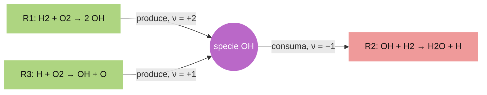
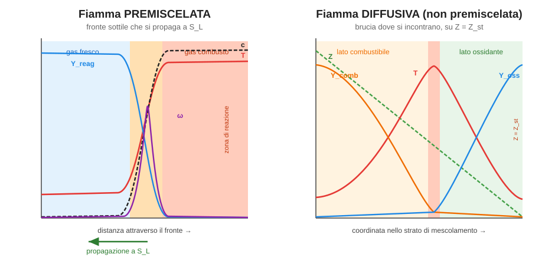
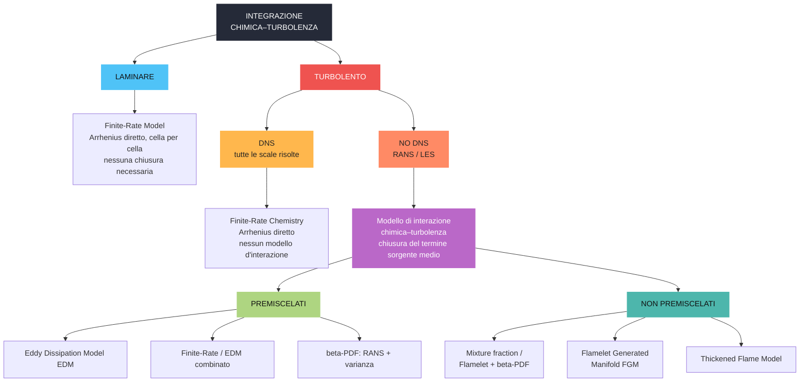

# Flussi Reagenti — Trattazione teorica

> Trattazione esaustiva dei **flussi reagenti** (combustione e dissociazione). Le domande
> del capitolo e i commenti d'esame degli appunti sono integrati nel testo; le caselle
> **📝 Nota d'esame** riportano le osservazioni utili discusse a lezione, le caselle
> **🔎 Domanda** rispondono a chiarimenti puntuali. Il **metodo di Chorin**, presente per
> refuso negli appunti di questo capitolo, è stato spostato nella teoria del report (sezione
> *Solutori Density-Based e Pressure-Based*), cui appartiene logicamente.

---

## 0. Nomenclatura essenziale

Tabella di riferimento dei simboli usati nel capitolo. Il punto delicato da fissare subito è
la differenza tra **velocità di reazione** ($q_j$, proprietà di una reazione), **tasso di
specie** ($\dot\omega_i$, proprietà di una specie) e **costanti cinetiche** ($K_f,K_b$, che
**non** sono velocità ma coefficienti): vedi §3.1.

<strong>📖 Simboli e nomenclatura usati nel capitolo</strong>

| Simbolo | Nome | Note / unità |
|---|---|---|
| $\rho$ | densità della miscela | kg·m⁻³; varia molto (gas combusto leggero) |
| $\mathbf{u}$ | velocità (media di massa) | m·s⁻¹ |
| $p,\ T$ | pressione, temperatura | Pa, K |
| $Y_i$ | frazione di massa della specie $i$ | **adimensionale**, $\sum_i Y_i=1$ |
| $M_i$ | massa molare della specie $i$ | kg·mol⁻¹ |
| $[X_s]=\rho_s/M_s$ | concentrazione molare della specie $s$ | mol·m⁻³ |
| $\mathbf{J}_i$ | flusso diffusivo di massa della specie $i$ | kg·m⁻²·s⁻¹ (vettore), Fick: $\mathbf J_i=-\rho D_i\nabla Y_i$ |
| $D_i$ | coefficiente di diffusione della specie $i$ | m²·s⁻¹ |
| $\boldsymbol{\sigma}$ | tensore degli sforzi totale | $\boldsymbol\sigma=\boldsymbol\tau-p\mathbf I$ |
| $\boldsymbol{\tau}$ | tensore degli sforzi **viscosi** | Pa |
| $E,\ e_i$ | energia totale / interna specifica | J·kg⁻¹ |
| $h_i$ | entalpia specifica della specie $i$ | $h_i=e_i+p/\rho$ |
| $h^\circ_{f,i}$ | entalpia di **formazione** standard | J·kg⁻¹ |
| $H$ | entalpia totale specifica | $H=E+p/\rho$ |
| $\mathbf{q}_c$ | flusso di calore **conduttivo** (Fourier) | $\mathbf q_c=-\lambda\nabla T$ |
| $\mathbf{q}_m$ | flusso di energia per **diffusione** di specie | $\mathbf q_m=\sum_i h_i\mathbf J_i$ |
| $\lambda$ | conducibilità termica | W·m⁻¹·K⁻¹ |
| $\dot{\omega}_i$ | **tasso di produzione/consumo** della specie $i$ | kg·m⁻³·s⁻¹ (termine sorgente) |
| $q_j$ | **velocità (rateo) di reazione** della reazione $j$ | mol·m⁻³·s⁻¹ |
| $\nu^R_{ij},\ \nu^P_{ij}$ | coefficienti stechiometrici (reagente / prodotto) | adimensionali |
| $K_{f,j},\ K_{b,j}$ | **costanti cinetiche** diretta / inversa | **non** sono velocità |
| $K_{eq,j}$ | costante di **equilibrio** della reazione $j$ | da termodinamica |
| $A_j,\ \beta_j,\ E_{a,j}$ | fattore pre-esp., esponente di $T$, energia di attivazione | Arrhenius |
| $R$ | costante universale dei gas | 8.314 J·mol⁻¹·K⁻¹ |
| $N_S,\ N_r$ | numero di specie / di reazioni | — |
| $\mathrm{Da}$ | numero di Damköhler | $\mathrm{Da}=\tau_t/\tau_c$ |
| $\tau_c,\ \tau_t$ | tempo chimico / di mixing turbolento | s |
| $k,\ \varepsilon$ | energia cinetica turbolenta / dissipazione | $\tau_t=k/\varepsilon$ |
| $Z,\ Z_{st}$ | mixture fraction / suo valore stechiometrico | adimensionale |
| $c$ | progress variable | $0$ fresco, $1$ combusto |
| $\phi$ | rapporto di equivalenza | $1$ stech., $<1$ magro, $>1$ ricco |
| $S_L,\ \delta_L$ | velocità / spessore di fiamma laminare | m·s⁻¹, m |
| $\chi$ | scalar dissipation rate | s⁻¹ (stiramento/estinzione) |
| $Le=\alpha/D_i$ | numero di Lewis | diff. termica / di massa |

---

## 1. Inquadramento: cosa sono e dove compaiono

I **flussi reagenti** descrivono fluidi in cui avvengono **reazioni chimiche** che
rilasciano (o assorbono) calore e **modificano la composizione** della miscela. Il caso
tipico è la **combustione** in un combustore, ma non l'unico.

> 📝 **Nota d'esame.** I flussi reagenti **non servono solo nel combustore**: compaiono
> anche nel **supersonico/ipersonico**, dove gli **urti** fanno salire fortemente la
> temperatura e possono innescare la **dissociazione** delle molecole (es. $O_2$, $N_2$ che
> si dissociano dietro un urto forte). Anche questa è chimica accoppiata al campo di moto.

Un flusso reagente generale ha **tre caratteristiche** che lo complicano rispetto a un
flusso ideale:

| Caratteristica | Conseguenza |
|---|---|
| **Comprimibile** | densità variabile (il gas combusto è caldo e leggero, $\rho$ cala anche di 5–7×) |
| **Viscoso** | servono i termini diffusivi (sforzi, conduzione, diffusione di specie) |
| **Reagente** | compaiono il **trasporto delle specie** e un **termine sorgente chimico** |

Rispetto a un flusso **inerte** si aggiungono quindi: (i) le **equazioni di trasporto delle
specie**, (ii) un **termine sorgente chimico** fortemente non lineare, (iii) l'accoppiamento
con l'**energia** tramite il calore di reazione. La difficoltà centrale è l'**enorme
separazione di scale temporali** tra la chimica (velocissima) e il trasporto/mescolamento
(lento), che rende il problema **stiff** e introduce il concetto di **collo di bottiglia**
(tempo limitante, §4).

---

## 2. Equazioni di governo

Si descrive la miscela con **$N_S$ specie chimiche**, ciascuna caratterizzata dalla sua
**frazione di massa**

$$
Y_i = \frac{m_i}{m}, \qquad \sum_{i=1}^{N_S} Y_i = 1 .
$$

Le $Y_i$ sono le variabili che descrivono la **composizione locale**. Le equazioni di
governo sono le **Navier–Stokes** estese con il **trasporto delle specie** e i relativi
termini sorgente.

<strong>2.1 Continuità globale (massa)</strong>

$$
\frac{\partial \rho}{\partial t} + \nabla\cdot(\rho \mathbf{u}) = 0
$$

La massa **totale** si conserva: le reazioni chimiche trasformano specie in altre specie ma
non creano né distruggono massa.

<strong>2.2 Trasporto delle specie chimiche</strong>

Per ogni specie $i$ vale un'equazione di bilancio che, a differenza della massa globale,
ha **un termine diffusivo e un termine sorgente** (la specie viene prodotta/consumata e si
diffonde):

$$
\frac{\partial (\rho Y_i)}{\partial t} + \nabla\cdot(\rho \mathbf{u}\, Y_i)
= -\,\nabla\cdot \mathbf{J}_i + \dot{\omega}_i
\qquad i = 1,\dots,N_S
$$

I quattro termini sono: accumulo locale, **convezione** (trasporto col flusso), **diffusione
molecolare** $-\nabla\cdot\mathbf{J}_i$ e **sorgente chimico** $\dot\omega_i$ (§3).

> 🔎 **Domanda — Le unità di misura: vale ancora il discorso fatto per la massa?**
> Sì, **integralmente**. La frazione di massa $Y_i$ è **adimensionale**, quindi il prodotto
> $\rho Y_i$ ha le stesse unità di $\rho$ (kg·m⁻³) e l'intera equazione ha **la stessa
> struttura e le stesse unità dimensionali della continuità globale** (ogni termine è una
> densità di massa al secondo, kg·m⁻³·s⁻¹). In pratica la conservazione delle specie **è** la
> conservazione della massa "etichettata" per specie: moltiplicare per lo scalare puro $Y_i$
> non altera le dimensioni. Le due aggiunte rispetto alla massa globale sono il flusso
> diffusivo $\mathbf J_i$ (kg·m⁻²·s⁻¹, che diventa kg·m⁻³·s⁻¹ dopo la divergenza) e la
> sorgente $\dot\omega_i$ (kg·m⁻³·s⁻¹): entrambi **dimensionalmente coerenti** con i termini
> di trasporto. Sommando le $N_S$ equazioni si riottiene esattamente la continuità globale
> (perché $\sum_i Y_i=1$, $\sum_i\mathbf J_i=0$, $\sum_i\dot\omega_i=0$).

> 📝 **Nota d'esame — chiusura del sistema delle specie.** Di solito **non** si risolvono
> tutte le $N_S$ equazioni: se ne risolvono **$N_S-1$** e l'ultima specie si ricava dal
> vincolo $\sum_i Y_i = 1$, sostituendola di fatto con la **conservazione della massa
> globale** (che è automaticamente soddisfatta). In pratica si **elide l'equazione della
> specie in concentrazione maggiore** (tipicamente $N_2$ nell'aria): la specie *dominante*
> assorbe l'errore di chiusura senza problemi. **Non** si elide una specie minore, perché
> ricavarla per differenza la espone a **valori negativi** non fisici (errori numerici che,
> sottratti da $1$, possono far diventare negativa una piccola $Y_i$).

<strong>🔎 Domanda — Il termine diffusivo è il gradiente di $\mathbf{J}$? Come è definito $\mathbf{J}$?</strong>

Una precisazione preliminare: il termine $-\nabla\cdot\mathbf{J}_i$ compare nell'**equazione
di trasporto delle specie**, *non* in quella della quantità di moto (lì il termine diffusivo
è $\nabla\cdot\boldsymbol{\tau}$, la divergenza del tensore degli sforzi viscosi). È un
punto facile da confondere perché entrambe sono equazioni di trasporto con struttura
analoga.

Detto questo: il termine diffusivo è la **divergenza** (non il gradiente) di $\mathbf{J}_i$,
cioè $-\nabla\cdot\mathbf{J}_i$, dove $\mathbf{J}_i$ è il **flusso diffusivo di massa della
specie $i$** — un **vettore** con unità di kg·m⁻²·s⁻¹. Fisicamente $\mathbf{J}_i$ è la
quantità di specie $i$ che attraversa l'unità di area nell'unità di tempo **per pura
diffusione molecolare**, cioè rispetto alla velocità media di massa $\mathbf{u}$ (al netto
del trasporto convettivo, già contenuto nel termine $\nabla\cdot(\rho\mathbf{u}Y_i)$).

La sua definizione di base è la **legge di Fick** (diffusione per gradiente di
concentrazione):

$$
\mathbf{J}_i = -\,\rho D_i\,\nabla Y_i
\qquad\Longrightarrow\qquad
-\nabla\cdot\mathbf{J}_i = \nabla\cdot(\rho D_i \nabla Y_i),
$$

con $D_i$ **coefficiente di diffusione** della specie $i$. Il segno meno dice che la specie
si muove **da dove è concentrata verso dove è rarefatta** (gradiente discendente). Tre
proprietà importanti:

- **Somma nulla:** $\sum_i \mathbf{J}_i = 0$. I flussi diffusivi sono definiti *rispetto alla
  velocità di massa*, quindi globalmente non trasportano massa netta (coerente col fatto che
  la diffusione non viola la continuità globale).
- **Forma completa:** la legge di Fick è l'approssimazione più semplice. In generale
  $\mathbf{J}_i$ include la **diffusione multicomponente** (equazioni di Stefan–Maxwell), la
  **termodiffusione** (effetto Soret, diffusione per gradiente di temperatura) e la
  diffusione per gradiente di pressione.
- **Numero di Lewis:** il rapporto tra diffusione termica e diffusione di massa,
  $Le = \alpha/D_i$, è un parametro chiave; molti modelli assumono $Le=1$ (diffusività
  uguali) per semplificare la chiusura.

<strong>2.3 Quantità di moto</strong>

$$
\frac{\partial (\rho \mathbf{u})}{\partial t} + \nabla\cdot(\rho \mathbf{u}\otimes\mathbf{u})
= \nabla\cdot\boldsymbol{\sigma},
\qquad \boldsymbol{\sigma} = \boldsymbol{\tau} - p\,\mathbf{I}
$$

dove $\boldsymbol{\sigma}$ è il **tensore degli sforzi totale**, somma del tensore degli
sforzi **viscosi** $\boldsymbol{\tau}$ e del contributo di **pressione** $-p\,\mathbf{I}$.
La struttura è identica a quella di un flusso inerte: la chimica entra nella quantità di moto
solo **indirettamente**, cambiando $\rho$ e le proprietà di trasporto attraverso la
temperatura.

> 🔎 **Domanda — Perché si introduce il tensore $\boldsymbol\sigma$? Non bastavano due
> termini separati come nelle altre equazioni?**
> È **solo una scelta di notazione compatta**, non una fisica diversa. L'equazione è del
> tutto equivalente a scriverla con i **due termini separati**:
> $$
> \nabla\cdot\boldsymbol\sigma = \nabla\cdot\boldsymbol\tau - \nabla p ,
> $$
> cioè forza viscosa $+$ gradiente di pressione, esattamente come nelle Navier–Stokes
> "classiche". Si raccolgono in un unico tensore $\boldsymbol\sigma$ per **tre motivi**:
> 1. **Unità concettuale:** sia la pressione sia gli sforzi viscosi sono **forze di
>    superficie** (sforzi che agiscono sulle facce del volume di controllo). $\boldsymbol\sigma$
>    le tratta come ciò che sono: un unico **stato di sforzo** del fluido, di cui la pressione
>    è la parte **isotropa** ($-p\mathbf I$) e $\boldsymbol\tau$ la parte **deviatorica**.
> 2. **Forma conservativa "pulita":** il flusso di quantità di moto è naturalmente un
>    **tensore di rango 2** (la quantità di moto è un vettore, il suo flusso ha una direzione
>    in più). Scrivere $\nabla\cdot\boldsymbol\sigma$ rende la quantità di moto formalmente
>    identica alle altre leggi di conservazione ($\partial_t(\ldots)+\nabla\cdot(\text{flusso})$),
>    utile per i volumi finiti.
> 3. **Generalità:** in un mezzo qualsiasi (anche non newtoniano) lo stato di sforzo è
>    comunque $\boldsymbol\sigma$; separare pressione e viscosità è un caso particolare.
>
> Quindi: nessun "qualcosa di nascosto", è la stessa equazione scritta in modo più elegante e
> coerente con la struttura conservativa.

<strong>2.4 Energia ed entalpia</strong>

In forma di **energia totale** $E$ (energia interna + cinetica per unità di massa):

$$
\frac{\partial (\rho E)}{\partial t} + \nabla\cdot(\rho \mathbf{u} E)
= \nabla\cdot(\boldsymbol{\sigma}\cdot\mathbf{u}) - \nabla\cdot\mathbf{q}_c - \nabla\cdot\mathbf{q}_m
$$

con i tre termini a secondo membro:

- **lavoro degli sforzi** $\nabla\cdot(\boldsymbol\sigma\cdot\mathbf u)$;
- **flusso di calore conduttivo** $\mathbf{q}_c = -\lambda\nabla T$ (legge di Fourier);
- **flusso di energia per diffusione di specie** $\mathbf{q}_m = \sum_i h_i \mathbf{J}_i$
  (ogni specie che diffonde trasporta la propria entalpia).

> 📝 **Nota di notazione.** Il flusso conduttivo è indicato $\mathbf{q}_c$ (**c** =
> *conduttivo*); negli appunti compariva come $\mathbf q_T$ (**T** = *termico*). È la stessa
> grandezza, qui rinominata in $\mathbf q_c$ per chiarezza e per non confonderla con la
> temperatura $T$.

L'energia totale specifica è la somma pesata delle energie interne di specie più l'energia
cinetica:

$$
E = \sum_{i=1}^{N_S} Y_i\, e_i + \tfrac{1}{2}\,\mathbf{u}^2 .
$$

> 🔎 **Domanda — Perché l'entalpia $h_i$ trasportata da $\mathbf J_i$ compare qui e non
> nella quantità di moto? E quale entalpia è?**
> Attenzione al posizionamento: il termine $\sum_i h_i\mathbf J_i$ è un **flusso di energia**
> e compare nell'**equazione dell'energia** (non in quella della quantità di moto). La
> ragione fisica è semplice: quando una specie **diffonde** (flusso $\mathbf J_i$), si porta
> dietro la propria **entalpia** → c'è un trasporto netto di **energia** anche senza moto
> macroscopico del fluido. Questo è un trasporto di *energia*, quindi va nel bilancio
> energetico.
>
> Perché **non** c'è un termine analogo nella quantità di moto? Perché la diffusione delle
> specie **non trasporta quantità di moto netta**: i flussi diffusivi soddisfano
> $\sum_i\mathbf J_i=0$ (sono definiti rispetto alla velocità di massa), quindi il loro
> contributo alla quantità di moto si cancella ed è trascurabile (secondo ordine). L'energia,
> invece, è pesata da $h_i$ che è **diversa per ogni specie**, e quindi $\sum_i h_i\mathbf
> J_i\neq0$: resta un flusso energetico reale.
>
> Quale entalpia? È l'**entalpia specifica** (per unità di massa) **assoluta** della specie
> $i$, $h_i = h^\circ_{f,i} + \int_{T_0}^T c_{p,i}\,dT'$ (formazione $+$ sensibile) — *non*
> l'entalpia totale $H$ né quella della miscela: è quella della singola specie che diffonde.

<strong>🔎 Domanda — Perché si passa da trattazioni basate sull'energia a quelle basate sull'entalpia? Qual è il vantaggio?</strong>

Nella combustione si preferisce riscrivere il bilancio energetico in termini di **entalpia**
anziché di energia interna. La relazione tra le due è

$$
h_i = e_i + \frac{p}{\rho},
$$

e l'entalpia di **una specie** si scompone in due contributi:

$$
h_i = \underbrace{h^\circ_{f,i}}_{\text{entalpia di formazione}}
   + \underbrace{\int_{T_0}^{T} c_{p,i}(T')\,dT'}_{\text{entalpia sensibile}} .
$$

Cioè: **entalpia = entalpia di formazione in uno stato standard (a $T_0$) + variazione di
entalpia "sensibile"** dovuta al riscaldamento. (L'energia interna ha una struttura analoga,
$e_i = h^\circ_{f,i} + \int c_{v,i}\,dT - p/(\rho R)\cdot\ldots$, ma è meno comoda.)

I **vantaggi** dell'entalpia in questo contesto sono:

1. **La combustione avviene quasi sempre a pressione (quasi) costante.** Nei combustori a
   basso Mach la pressione varia poco; a $p$ costante il calore scambiato è esattamente la
   variazione di entalpia ($\delta q = dh$). L'entalpia è quindi la **variabile naturale** del
   problema, mentre l'energia interna sarebbe naturale a volume costante (caso raro).

2. **Sparisce il termine sorgente chimico esplicito nell'equazione dell'energia.** È il
   vantaggio decisivo. Se si usa l'entalpia **assoluta** (formazione + sensibile), il calore
   di reazione è **già contabilizzato** dentro le $h^\circ_{f,i}$ delle specie trasportate:
   una reazione esotermica si limita a **convertire entalpia di formazione in entalpia
   sensibile** (le specie cambiano, ma l'entalpia totale della miscela si conserva). Di
   conseguenza l'equazione dell'**entalpia totale è priva del termine sorgente** $\dot Q$ —
   non bisogna calcolare esplicitamente il rilascio di calore, che emerge automaticamente dal
   cambio di composizione. Lavorando invece con energia *sensibile* si dovrebbe aggiungere a
   mano una sorgente

   $$
   \dot Q = -\sum_i h^\circ_{f,i}\,\dot\omega_i,
   $$

   fonte di errori e di accoppiamento aggiuntivo.

3. **Comodità nel trasporto e nella convezione.** Il flusso di energia convettivo nelle
   equazioni comprimibili coinvolge naturalmente l'**entalpia totale** $H = E + p/\rho$ (il
   termine $\nabla\cdot(\rho\mathbf u H)$): usare $H$ evita di portarsi dietro separatamente
   il lavoro di pressione $\nabla\cdot(p\mathbf u)$.

4. **Dati termodinamici tabulati in forma entalpica.** I polinomi NASA forniscono
   direttamente $c_p(T)$, $h(T)$ ed $s(T)$ per ogni specie: la formulazione entalpica si
   innesta senza conversioni.

> In sintesi: **passare all'entalpia (assoluta) rende l'equazione dell'energia "source-free"
> rispetto alla chimica** e allinea la trattazione al fatto che la combustione è un processo
> a pressione costante. Il calore di reazione non scompare: è "nascosto" nelle entalpie di
> formazione delle specie che si trasportano.

<strong>2.5 Bilancio vs conservazione: perché cambia (quasi) solo l'equazione di massa?</strong>

<strong>🔎 Domanda — Quindi quantità di moto ed energia non cambiano in modo significativo, ma solo la massa? Perché, a livello fisico?</strong>

Esatto, ed è un punto concettuale importante. Una **reazione chimica** è un
**riarrangiamento di atomi**: rompe e riforma legami, ma **conserva le grandezze fisiche
fondamentali** — massa totale, quantità di moto totale, energia totale. L'unica cosa che
**non** conserva è l'**identità delle specie** (una molecola di combustibile sparisce, ne
compaiono di prodotto). Di conseguenza:

| Equazione | La chimica aggiunge un termine sorgente? | Perché |
|---|---|---|
| **Massa globale** | No | gli atomi non si creano né distruggono |
| **Specie $i$** | **Sì** ($\dot\omega_i$) | l'identità chimica **cambia**: è qui che entra la reazione |
| **Quantità di moto** | No (solo indiretto via $\rho$, proprietà) | una reazione non genera forze nette |
| **Energia totale** | No (con entalpia assoluta, §2.4) | l'energia chimica è già nelle $h^\circ_{f,i}$ |

Quindi l'unico posto in cui la chimica compare come **nuovo termine sorgente esplicito** sono
le **equazioni delle specie** (tramite $\dot\omega_i$). Quantità di moto ed energia mantengono
la **stessa forma** del flusso inerte: cambiano solo perché $\rho$, $\lambda$, $\mu$, $c_p$
diventano **funzioni della composizione e della temperatura** (accoppiamento *indiretto*).

<strong>🔎 Domanda — È corretto dire che la massa è "un'equazione di bilancio ma non una legge di conservazione"? E per quantità di moto ed energia?</strong>

Bisogna distinguere bene i due termini, perché la risposta dipende da **quale** equazione di
massa:

- **Legge di conservazione** = equazione di trasporto **senza termine sorgente**: la grandezza
  è un **invariante globale** (può solo essere trasportata, non creata/distrutta).
- **Equazione di bilancio** = forma più generale, che **può** avere un termine sorgente.

Applicando la distinzione:

| Grandezza | Tipo | Motivo |
|---|---|---|
| **Massa globale** ($\rho$) | **legge di conservazione** | nessuna sorgente: $\partial_t\rho+\nabla\cdot(\rho\mathbf u)=0$ |
| **Massa di specie** ($\rho Y_i$) | **equazione di bilancio** (non conservazione) | ha la sorgente $\dot\omega_i\neq0$: la singola specie **non** si conserva |
| **Quantità di moto** | conservazione* | nessuna sorgente *chimica*; gli sforzi al bordo sono flussi, non sorgenti di volume |
| **Energia totale** | conservazione* | idem: con entalpia assoluta nessuna sorgente chimica |

(\*) Rigorosamente, quantità di moto ed energia sono **leggi di conservazione** nel senso che
non hanno sorgenti di volume di origine chimica; i termini a secondo membro
($\nabla\cdot\boldsymbol\sigma$, $\nabla\cdot\mathbf q$) sono **divergenze di flusso** (scambi
attraverso la frontiera), non vere sorgenti. In presenza di forze di volume esterne (gravità)
o irraggiamento comparirebbero sorgenti genuine, ma non è il caso della sola chimica.

In sintesi, la frase corretta è: la **massa globale è una legge di conservazione**; la
**massa di ogni singola specie è un'equazione di bilancio con sorgente** (non si conserva
individualmente); **quantità di moto ed energia restano leggi di conservazione** (la chimica
non vi introduce sorgenti, solo accoppiamento indiretto via proprietà).

---

## 3. Cinetica chimica e termine sorgente

Il termine sorgente $\dot\omega_i$ è il cuore — e la difficoltà — dei flussi reagenti: è il
termine **più non lineare** e quello che introduce la **stiffness**.

<strong>3.1 $\dot\omega_i$, $q_j$, $K_f$, $K_b$: chi è chi?</strong>

<strong>🔎 Domanda — $\dot\omega_i$ è la velocità di reazione o il tasso di produzione/consumo? E allora $K_f,K_b$ cosa sono?</strong>

Sono **concetti correlati ma, a rigore, distinti**; vengono spesso confusi (e negli appunti
del corso la formula di $\dot\omega_i$ è etichettata "velocità di reazione"). Fissiamo la
gerarchia, dal più "locale alla reazione" al più "aggregato sulla specie":

- **Costanti cinetiche $K_{f,j},\ K_{b,j}$** — sono **coefficienti** (non velocità!) che
  moltiplicano i prodotti di concentrazione. Da sole **non** sono un rateo: hanno unità che
  dipendono dall'ordine di reazione. Hai ragione: chiamarle "velocità di reazione" è
  **scorretto**, sono le **costanti di velocità** (o *rate constants*). Vengono da Arrhenius
  (§3.3).
- **Velocità (o rateo) di reazione $q_j$** — è una proprietà **della singola reazione** $j$.
  Misura *quanto velocemente avanza quella reazione* (rate of progress), in mol·m⁻³·s⁻¹. È la
  quantità $[\,K_f\prod[X]^{\nu^R} - K_b\prod[X]^{\nu^P}\,]$ tra parentesi nella formula del
  §3.2: una sola reazione, un solo numero.
- **Tasso di produzione/consumo della specie $\dot\omega_i$** — è una proprietà **della
  specie** $i$. Misura *quanta massa (o moli) di $i$ vengono nette prodotte o consumate per
  unità di volume e tempo*, kg·m⁻³·s⁻¹ (positivo per i prodotti, negativo per i reagenti).

Il legame tra i due ratei è che $\dot\omega_i$ è la **somma, su tutte le reazioni**, del rateo
di ciascuna reazione pesato sul **coefficiente stechiometrico netto** della specie:

$$
\dot\omega_i = M_i \sum_{j=1}^{N_r} (\nu^P_{ij} - \nu^R_{ij})\, q_j .
$$

Quindi:

| | Costante $K_{f/b,j}$ | Velocità di reazione $q_j$ | Tasso di specie $\dot\omega_i$ |
|---|---|---|---|
| Riferita a | una reazione | una **reazione** | una **specie** |
| Cos'è | coefficiente cinetico | rateo netto della reazione | sorgente netta della specie |
| Quante | $2N_r$ | $N_r$ | $N_S$ |
| Unità | dipende dall'ordine | mol·m⁻³·s⁻¹ | kg·m⁻³·s⁻¹ |
| Relazione | entra in $q_j$ | $q_j=$ funzione di $K,[X]$ | $\sum_j(\nu^P-\nu^R)q_j$ |

<strong>🔎 Domanda — Come si "distribuiscono" reazioni e specie? (più reazioni concorrono a una specie)</strong>

In un meccanismo reale ci sono **molte reazioni** e **molte specie**, e una stessa specie è
in genere **prodotta da alcune reazioni e consumata da altre**. Il tasso netto $\dot\omega_i$
"raccoglie" tutti questi contributi. Esempio concreto su un frammento di cinetica
$\text{H}_2$–$\text{O}_2$, concentrandosi sul radicale **OH**:

Le reazioni **R1** ed **R3** *producono* OH (coeff. netto $+2$ e $+1$), mentre **R2** lo
*consuma* (coeff. netto $-1$). Il tasso netto della specie OH è la **somma algebrica** dei
ratei pesati:

$$
\dot\omega_{\text{OH}} = M_{\text{OH}}\,\big(\,+2\,q_1 \;-\; 1\,q_2 \;+\; 1\,q_3\,\big).
$$

Si vede così la "distribuzione": l'indice $j$ corre sulle **reazioni** (colonne di una
matrice stechiometrica $\nu^P-\nu^R$), l'indice $i$ sulle **specie** (righe). Ogni specie
"legge" la propria riga e somma i contributi di tutte le reazioni che la toccano. Sono uguali
($q_j\equiv\dot\omega_i/M_i$) solo nel caso banale di **una sola reazione con coefficiente
unitario** per quella specie.

<strong>3.2 La formula del rateo di reazione spiegata termine per termine</strong>

<strong>🔎 Domanda — Puoi spiegare bene la formula del rateo di reazione?</strong>

Per un meccanismo di $N_r$ reazioni tra $N_S$ specie, il tasso di produzione/consumo della
specie $i$ è:

$$
\dot\omega_i = \sum_{j=1}^{N_r} \big(\nu^P_{ij} - \nu^R_{ij}\big)
\left[\;
\underbrace{K_{f,j} \prod_{s=1}^{N_S}\Big(\frac{\rho_s}{M_s}\Big)^{\nu^R_{sj}}}_{\text{reazione diretta}}
\;-\;
\underbrace{K_{b,j} \prod_{s=1}^{N_S}\Big(\frac{\rho_s}{M_s}\Big)^{\nu^P_{sj}}}_{\text{reazione inversa}}
\;\right]
$$

Analizziamo **ogni pezzo** (cos'è, da dove viene, come agisce):

- **$\displaystyle\sum_{j=1}^{N_r}$ — somma sulle reazioni.** Una specie partecipa in
  genere a **più reazioni** del meccanismo; il suo tasso netto è la **somma** dei contributi
  di tutte (vedi schema §3.1). *Effetto:* accoppia tutte le reazioni che toccano la specie $i$.

- **$(\nu^P_{ij} - \nu^R_{ij})$ — coefficiente stechiometrico netto** della specie $i$ nella
  reazione $j$ ($\nu^P$ = coefficiente come **prodotto**, $\nu^R$ = come **reagente**).
  *Da dove viene:* dal **bilanciamento stechiometrico** della reazione. *Effetto:* converte
  "quanto avanza la reazione" in "quante moli di $i$ compaiono/spariscono"; è **positivo** se
  $i$ è netto prodotto, **negativo** se netto reagente, **zero** se $i$ è spettatore.

- **$K_{f,j}$ e $K_{b,j}$ — costanti cinetiche** diretta (*forward*) e inversa (*backward*).
  *Da dove vengono:* dalla legge di **Arrhenius** (§3.3); dipendono **fortemente dalla
  temperatura**. *Effetto:* fissano la *scala di velocità* della reazione.

- **$\displaystyle\prod_{s=1}^{N_S}\big(\rho_s/M_s\big)^{\nu^R_{sj}}$ — legge di azione di
  massa per la reazione diretta.** $\rho_s/M_s = [X_s]$ è la **concentrazione molare**
  (mol/m³) della specie $s$ (densità parziale diviso massa molare). Il prodotto è esteso a
  tutte le specie, ma poiché $\nu^R_{sj}=0$ per chi non è reagente, contano **solo i
  reagenti**, ciascuno elevato al proprio coefficiente (ordine di reazione).
  *Da dove viene:* dalla **legge di azione di massa** — la velocità di reazione è
  proporzionale alla **frequenza degli urti** tra le molecole reagenti, che a sua volta è
  proporzionale al **prodotto delle loro concentrazioni**. *Effetto:* più reagenti ci sono,
  più la reazione corre; se un reagente si esaurisce ($[X_s]\to0$), il termine si annulla.

- **$K_{b,j}\prod(\rho_s/M_s)^{\nu^P_{sj}}$ — reazione inversa**, analoga ma sui **prodotti**.
  *Effetto:* tiene conto della **reversibilità**: i prodotti possono ricombinarsi nei
  reagenti.

- **La parentesi $[\,\text{diretta} - \text{inversa}\,] = q_j$** è il **rateo netto** della
  reazione $j$: differenza tra "avanti" e "indietro". *Effetto:* all'**equilibrio chimico**
  le due velocità si pareggiano, $q_j=0$ e la specie non cambia più; fuori equilibrio il
  segno dice in che verso procede la reazione.

In sintesi la formula nasce dalla composizione di **tre ingredienti fisici**: la
**stechiometria** (coefficienti $\nu$), la **cinetica** (costanti $K_f,K_b$ alla Arrhenius)
e la **legge di azione di massa** (prodotti di concentrazioni). La sua forte **non
linearità** (prodotti di potenze delle concentrazioni × esponenziale della temperatura) è
ciò che rende il termine sorgente così difficile da trattare in un flusso turbolento (§6).

<strong>3.3 La legge di Arrhenius</strong>

Le costanti cinetiche seguono l'**approccio di Arrhenius**:

$$
K_{f,j} = A_j\, T^{\beta_j}\, \exp\!\left(-\frac{E_{a,j}}{R\,T}\right),
\qquad
K_{b,j} = \frac{K_{f,j}}{K_{eq,j}(T)} .
$$

- **$A_j$ — fattore pre-esponenziale** (o di frequenza): rappresenta la **frequenza degli
  urti** e il fattore sterico (orientamento favorevole all'urto).
- **$T^{\beta_j}$ — correzione di temperatura** (debole, legge di potenza) della frequenza
  d'urto.
- **$\exp(-E_{a,j}/RT)$ — fattore di Boltzmann**: è la **frazione di urti con energia
  superiore all'energia di attivazione** $E_{a,j}$. È il termine **dominante** ed è
  responsabile della **sensibilità esponenziale alla temperatura**: piccole variazioni di
  $T$ cambiano $K_f$ (e quindi $\dot\omega$) di **ordini di grandezza**. È la radice della
  stiffness e del fatto che la fiamma sia un fronte sottilissimo e ipersensibile.

> 🔎 **Domanda — Quando si dice che $\beta_j$ è "piccolo", si intende vicino a 0 o vicino a 1?**
> Vicino a **0** (piccolo *in valore assoluto*). È fondamentale, perché la dipendenza
> funzionale cambia radicalmente:
> - se $\beta_j \approx 0$ → $T^{\beta_j}\approx T^0 = 1$: il fattore di potenza è quasi
>   **ininfluente**, e la dipendenza da $T$ è governata **tutta** dall'esponenziale di
>   Boltzmann. È il caso tipico.
> - se $\beta_j \approx 1$ → $T^{\beta_j}\approx T$: ci sarebbe una dipendenza **lineare**
>   aggiuntiva, non trascurabile.
>
> In pratica $\beta_j$ è un piccolo esponente (tipicamente $-1 \lesssim \beta_j \lesssim 2$,
> spesso $|\beta_j|<1$) che dà solo una **correzione debole**; il "motore" della dipendenza
> da $T$ resta sempre il termine $\exp(-E_a/RT)$.

<strong>🔎 Domanda — La costante inversa: formula "alla Arrhenius" oppure via $K_{eq}$? Cos'è $K_{eq}$ e come si passa da un approccio all'altro?</strong>

I due approcci sono **equivalenti** se i parametri sono **termodinamicamente consistenti**, ma
hanno una logica diversa.

**Approccio 1 — $K_b$ indipendente (alla Arrhenius).** Si potrebbe fittare anche $K_{b,j}$
con una propria espressione di Arrhenius $K_{b,j}=A'_j T^{\beta'_j}\exp(-E'_{a,j}/RT)$,
misurando/regolando $A',\beta',E'_a$ dai dati della reazione inversa. Rischio: se i parametri
diretti e inversi sono fittati **separatamente**, all'equilibrio possono **non** dare il
rapporto corretto → si viola la termodinamica.

**Approccio 2 — $K_b$ dalla costante di equilibrio (quello degli appunti).** Si calcola
$K_{b,j}$ imponendo la **consistenza con l'equilibrio termodinamico**. La **costante di
equilibrio** $K_{eq,j}(T)$ è una grandezza **puramente termodinamica** (non cinetica): dice
qual è il rapporto tra prodotti e reagenti **all'equilibrio**, e si ricava dall'energia libera
di Gibbs di reazione:

$$
K_{eq,j}(T) = \exp\!\left(-\frac{\Delta G^\circ_j}{R T}\right),
\qquad \Delta G^\circ_j = \Delta H^\circ_j - T\,\Delta S^\circ_j ,
$$

con $\Delta H^\circ_j,\ \Delta S^\circ_j$ entalpia ed entropia standard di reazione (dai dati
NASA delle specie). Da dove esce il legame con $K_f,K_b$? Dal **principio dell'equilibrio
dettagliato** (microscopic reversibility): **all'equilibrio** il rateo netto è nullo,
$q_j=0$, cioè diretta = inversa:

$$
K_{f,j}\prod_s[X_s]^{\nu^R_{sj}} = K_{b,j}\prod_s[X_s]^{\nu^P_{sj}}
\;\Longrightarrow\;
\frac{K_{f,j}}{K_{b,j}} = \prod_s [X_s]^{\nu^P_{sj}-\nu^R_{sj}} \equiv K_{c,j}(T),
$$

dove $K_{c,j}$ è la costante di equilibrio **in concentrazioni**. Quindi:

$$
\boxed{\;K_{b,j} = \frac{K_{f,j}}{K_{c,j}(T)}\;}
$$

**Come si riconducono i due approcci.** $K_{c}$ (concentrazioni) e $K_{eq}$ (o $K_p$,
pressioni parziali) differiscono solo per un fattore $(RT)$ elevato alla variazione netta di
moli $\Delta n_j=\sum_s(\nu^P_{sj}-\nu^R_{sj})$:

$$
K_{c,j} = K_{eq,j}\,(R T)^{-\Delta n_j}\quad(\text{a meno della pressione di riferimento}).
$$

Sostituendo si ottiene $K_{b,j}=K_{f,j}/K_{c,j}$, che è esattamente la formula del §3.3. Il
**vantaggio** dell'approccio 2 è che **garantisce automaticamente l'equilibrio corretto**
(coerenza termodinamica) calcolando una sola coppia di parametri ($K_f$ alla Arrhenius +
dati termodinamici per $K_{eq}$), senza fittare separatamente l'inversa.

<strong>3.4 Tempi caratteristici, tabella e stiffness</strong>

Il **tempo caratteristico delle reazioni chimiche** $\tau_c$ misura quanto impiega la
reazione a completarsi. **Può essere estremamente piccolo**: per la combustione
$\text{H}_2$–$\text{O}_2$ si ha $\tau_c \approx 10^{-6}\,$s.

<strong>🔎 Domanda — Una tabella con i tempi di reazione tipici di sostanze comuni</strong>

Valori **indicativi** (ordini di grandezza) del tempo chimico $\tau_c$, utili per avere
"contezza numerica" del fenomeno. Per confronto, il tempo di **mixing turbolento** tipico è
$\tau_t \sim 10^{-3}$–$10^{-2}\,$s (§4):

| Sistema / reazione | $\tau_c$ tipico | Commento |
|---|---|---|
| **Idrogeno–ossigeno** ($\text{H}_2$–$\text{O}_2$) | $\sim 10^{-6}\,$s | combustione **velocissima**, chimica quasi istantanea |
| **Idrocarburi leggeri** ($\text{CH}_4$–aria, metano) | $\sim 10^{-3}\,$s | più lenta dell'idrogeno (catena di reazioni più lunga) |
| **Ossidazione del CO** ($\text{CO}\to\text{CO}_2$) | $\sim 10^{-3}$–$10^{-2}\,$s | **step lento** dell'ossidazione degli idrocarburi |
| **Idrocarburi pesanti** (cherosene, ottano, diesel) | $\sim 10^{-4}$–$10^{-3}\,$s | rilevante per ritardo d'accensione *(ignition delay)* |
| **Formazione NOₓ termici** (meccanismo di Zeldovich) | $\sim 10^{-1}$–$1\,$s | **molto lenta** → chimica limitante, chiave per gli inquinanti |
| **Formazione soot** (particolato) | $\sim 10^{-3}$–$10^{-2}\,$s | cinetica lenta e complessa |
| *(confronto)* **mixing turbolento** $\tau_t = k/\varepsilon$ | $\sim 10^{-3}$–$10^{-2}\,$s | scala dei grandi vortici |

La tabella rende evidente il punto del §4: per l'$\text{H}_2$ la chimica è $\sim10^3$–$10^4$
volte più veloce del mixing ($\mathrm{Da}\gg1$, fiamma **limitata dalla miscelazione**),
mentre per gli **NOₓ** la chimica è **più lenta** del mixing ($\mathrm{Da}\ll1$, formazione
**limitata dalla chimica**): ecco perché gli inquinanti si modellano con cinetica dettagliata
e non con i modelli "mixed-is-burnt".

> 📝 **Nota d'esame — stiffness e scelta dell'integratore.** Quando $\tau_c$ è piccolissimo,
> il sistema di ODE chimiche ha **scale temporali enormemente diverse** ed è **stiff**:
> - uno schema **esplicito** sarebbe vincolato a un passo $\sim\tau_c$ piccolissimo →
>   **numericamente impraticabile** (instabile o lentissimo);
> - lo schema **implicito è di fatto l'unica soluzione** per l'integrazione temporale della
>   chimica; il maggior costo per passo è accettabile, anche perché spesso i **termini
>   chimici** vengono **disaccoppiati** (operator splitting) e integrati a parte.
>
> Inoltre: anche se il **CFL fluidodinamico** permettesse un passo temporale ampio, la
> **chimica veloce impone un passo molto minore**, rendendo stiff l'intero problema
> accoppiato. Conseguenza pratica: se si forza un passo grande, la **diffusione numerica**
> dello schema fluidodinamico **cresce enormemente**, degradando la soluzione.

<strong>🔎 Domanda — Cosa significa che "i termini chimici vengono disaccoppiati (operator splitting) e integrati a parte"? Perché si fa?</strong>

L'**operator splitting** (splitting degli operatori) è una strategia per **separare** in un
passo temporale i due "mondi" del problema, che hanno nature numeriche opposte:

- il **trasporto** (convezione + diffusione) è un operatore **spaziale**, **non stiff**, che
  accoppia celle vicine ed è ben gestito da uno schema **esplicito** col vincolo CFL
  fluidodinamico;
- la **chimica** ($\dot\omega_i$) è un operatore **puntuale** (locale alla cella, nessun
  accoppiamento spaziale), ma **fortemente stiff**, che richiede un integratore **implicito**.

Invece di risolvere tutto insieme con un unico (costosissimo) solutore implicito globale,
nello splitting si **avanza l'equazione in due sotto-passi** sullo stesso $\Delta t$:

1. **Sotto-passo di trasporto:** si avanza il campo considerando **solo** convezione e
   diffusione (chimica "congelata"), con lo schema esplicito.
2. **Sotto-passo di chimica:** in **ciascuna cella separatamente** si risolve il sistema di
   ODE $\dfrac{dY_i}{dt}=\dot\omega_i/\rho$ come un **reattore a volume isolato**, con un
   integratore implicito stiff (es. backward Euler, BDF/CVODE).

(La variante **Strang** alterna mezzo passo di trasporto – passo intero di chimica – mezzo
passo di trasporto per avere accuratezza del **secondo ordine**.)

**Perché si fa / perché "risolve" il problema:** ogni operatore viene trattato col metodo
**più adatto alla sua natura** — esplicito ed economico per il trasporto, implicito ma
**locale** (quindi un piccolo sistema cella per cella, parallelizzabile e molto più
leggero di un sistema globale) per la chimica. Si **isola la stiffness** dentro il
sotto-passo chimico, evitando che imponga il passo all'intera simulazione. Il prezzo è un
**errore di splitting** ($O(\Delta t)$ per lo splitting semplice, $O(\Delta t^2)$ per Strang),
generalmente accettabile e controllabile riducendo $\Delta t$. È quindi una soluzione
**parziale ma efficiente**: non risolve il sistema *esattamente accoppiato*, ma lo
**approssima** in modo numericamente robusto e molto più economico.

---

## 4. Il collo di bottiglia: il numero di Damköhler

In un flusso reagente turbolento la combustione richiede **due passaggi in serie**: prima i
reagenti devono **mescolarsi** a livello molecolare (governato da turbolenza e diffusione),
poi devono **reagire** (governato dalla cinetica). Essendo processi **in serie**, la velocità
complessiva è dettata dal **più lento dei due**: è il **collo di bottiglia**
(*rate-limiting step*).

Si definiscono due **scale temporali**:
- **tempo chimico** $\tau_c$ — tempo di completamento delle reazioni ($\approx \delta_L/S_L$,
  rapporto tra spessore e velocità di fiamma laminare);
- **tempo di mixing turbolento** $\tau_t$ — tempo con cui i vortici portano i reagenti a
  contatto, $\tau_t = k/\varepsilon$ (tempo di rotazione dei grandi vortici; $k$ energia
  cinetica turbolenta, $\varepsilon$ sua dissipazione).

Il loro rapporto è il **numero di Damköhler**:

$$
\mathrm{Da} = \frac{\tau_t}{\tau_c} = \frac{\text{tempo di mescolamento}}{\text{tempo chimico}} .
$$

| Regime | Condizione | Chi limita | Comportamento |
|---|---|---|---|
| **Chimica veloce** | $\mathrm{Da}\gg1$ ($\tau_c\ll\tau_t$) | il **mixing** turbolento | Reazione quasi istantanea appena i reagenti si toccano: combustione **controllata dalla miscelazione** (*mixed-is-burnt*). Regime dei modelli **Eddy Break-Up / Eddy Dissipation**. Fronte sottile (**flamelet**). |
| **Chimica lenta** | $\mathrm{Da}\ll1$ ($\tau_c\gg\tau_t$) | la **chimica** | I reagenti si mescolano molto prima di reagire: tende a un **reattore perfettamente miscelato** (*well-stirred reactor*). Rilevante per spegnimento, **inquinanti (NOₓ)**, accensione. |
| **Da intermedio** | $\mathrm{Da}\sim1$ | **entrambi** | La turbolenza può **ispessire o estinguere** localmente la fiamma (*thickened/quenched flame*). Servono modelli che tengano conto di entrambe le scale. |

Conoscere **quale dei due tempi domina** dice quale fisica modellare con cura e quale si può
semplificare. È anche la radice della **stiffness** (§3.4): quando $\tau_c\ll\tau_t$ le scale
temporali del sistema sono estremamente separate.

---

## 5. Fiamme premiscelate e non premiscelate

La distinzione riguarda **dove e quando** combustibile e ossidante vengono messi a contatto.

**Fiamme premiscelate** (*premixed*): combustibile e ossidante sono **già miscelati** a
livello molecolare **prima** di entrare nella zona di reazione (fornello con aria primaria,
motori a benzina SI). La combustione avviene attraverso un **fronte di fiamma sottile** che
si propaga nella miscela fresca a velocità $S_L$. Variabile naturale: la **variabile di
avanzamento** (*progress variable*) $c$, da $0$ (gas fresco) a $1$ (gas combusto).

**Fiamme non premiscelate / diffusive** (*non-premixed*): combustibile e ossidante arrivano
**separati** e bruciano **dove si incontrano per diffusione** (candela, fiamma diesel,
razzo). La reazione è confinata sulla **superficie stechiometrica** dove $\phi=1$. Variabile
naturale: la **frazione di miscela** (*mixture fraction*) $Z$, che vale $1$ nel getto di
combustibile e $0$ nell'ossidante; la fiamma sta dove $Z = Z_{st}$.

Lo schema seguente contestualizza la struttura spaziale delle due fiamme e l'andamento delle
grandezze principali (temperatura, specie, variabile di stato):

- Nella **premiscelata** (sinistra) il fronte è **sottile** e separa gas fresco ($c=0$) da gas
  combusto ($c=1$); $T$ sale, i reagenti $Y_{\text{reag}}$ calano, e il **tasso di reazione**
  $\omega$ è concentrato in una zona strettissima. Il fronte **si propaga** verso i gas freschi
  a velocità $S_L$.
- Nella **diffusiva** (destra) la $Z$ varia **monotonicamente** da $1$ (lato combustibile) a
  $0$ (lato ossidante); combustibile e ossidante **si consumano dove si incontrano**, la $T$
  ha un **picco sulla superficie stechiometrica** $Z=Z_{st}$, dove è confinata la reazione.

| Aspetto | Premiscelata | Non premiscelata |
|---|---|---|
| Miscelazione | a monte, prima della reazione | sul posto, per diffusione |
| Variabile chiave | progress variable $c$ | mixture fraction $Z$ |
| Posizione fiamma | si propaga ($S_L$) | ancorata su $Z=Z_{st}$ |
| Controllo | cinetica + propagazione | mixing/diffusione |
| Sicurezza | rischio **flashback/detonazione** | intrinsecamente più sicura |
| Esempi | motore SI, Bunsen | diesel, candela, razzo |

Esiste anche il caso **parzialmente premiscelato**, in cui coesistono entrambi i meccanismi
(liftoff di getti, stratificazione di carica).

Grandezze ricorrenti: il **rapporto di equivalenza** $\phi$ (combustibile/ossidante
normalizzato allo stechiometrico: $\phi=1$ stechiometrico, $\phi<1$ magro, $\phi>1$ ricco);
la **velocità di fiamma laminare** $S_L$ e lo **spessore di fiamma** $\delta_L$.

---

## 6. Interazione chimica–turbolenza: i modelli

> **Obiettivo di tutta questa sezione:** in turbolenza non sappiamo calcolare direttamente il
> **termine sorgente medio** $\overline{\dot\omega}_i$, perché per la non linearità di
> Arrhenius $\overline{\dot\omega}(\bar T)\neq\overline{\dot\omega(T)}$. Ogni modello qui
> sotto è, in fondo, **un modo diverso di stimare $\overline{\dot\omega}_i$** (e quindi il
> calore rilasciato e la composizione) chiudendo le equazioni RANS/LES.

<strong>6.1 Lo schema generale dei modelli</strong>

<strong>🔎 Domanda — Rifai lo schema che spiega i vari modelli di interazione chimica–turbolenza</strong>

**Logica dello schema (dall'alto in basso):**

<strong>🔎 Domanda — Caso laminare: perché basta "Arrhenius diretto cella per cella"? Da dove esce $\dot\omega_i$ ? Perché è stiff ma comunque calcolabile? Che ruolo ha la turbolenza?</strong>

Nel caso **laminare** non esiste il problema di chiusura: il campo è **deterministico** e
**risolto a tutte le scale**, quindi in ogni cella si conoscono i valori **istantanei e
locali** di temperatura e composizione. Si valuta perciò $\dot\omega_i$ **direttamente con la
formula del §3.2** (Arrhenius + azione di massa), inserendo $T$ e $[X_s]$ della cella. Non
serve nessun modello statistico.

- *Da dove esce $\dot\omega_i$:* esattamente dall'equazione del §3.2 — è quella la
  definizione operativa del termine sorgente.
- *Perché è stiff ma calcolabile:* la stiffness ($\tau_c\ll\tau_t$, §3.4) rende **inutilizzabile
  un integratore esplicito**, ma **non** rende il problema irrisolvibile: lo si integra con un
  metodo **implicito** (tipicamente in **operator splitting**, §3.4), risolvendo la chimica
  come un sistema di ODE locale alla cella. È **costoso** (molte valutazioni, sistemi
  impliciti) ma deterministico e ben posto.
- *Ruolo della turbolenza:* la turbolenza introduce **fluttuazioni** di $T$ e composizione a
  scale che, in RANS/LES, **non si risolvono**. Siccome $\dot\omega$ è **fortemente non
  lineare**, la sua **media** non si ottiene inserendo i valori **medi**
  ($\overline{\dot\omega(T)}\neq\dot\omega(\bar T)$). È **solo** la turbolenza non risolta a
  creare il problema di chiusura: in suo assenza (laminare) o se la si risolve interamente
  (DNS), la valutazione diretta è esatta.

<strong>🔎 Domanda — Come si imposterebbe la risoluzione con DNS in caso di turbolenza? Quali equazioni e in che ordine?</strong>

In **DNS** (*Direct Numerical Simulation*) si risolve l'**intero set di equazioni di governo
senza alcun modello** (né di turbolenza, né di combustione), risolvendo **tutte** le scale:
spaziali fino a **Kolmogorov** $\eta$ per la turbolenza e fino allo **spessore di fiamma**
$\delta_L$ per la chimica; temporali fino al **tempo chimico** $\tau_c$ più piccolo. Il set è:

1. **Continuità** (massa globale, §2.1);
2. **Quantità di moto** (Navier–Stokes complete, §2.3);
3. **$N_S-1$ equazioni delle specie** (§2.2) con il sorgente $\dot\omega_i$ **valutato
   direttamente** (Arrhenius, §3.2) — l'ultima specie da $\sum Y_i=1$;
4. **Energia/entalpia** (§2.4);
5. **Equazione di stato** + aggiornamento delle **proprietà di trasporto** ($\rho$, $\mu$,
   $\lambda$, $D_i$, $c_p$) in funzione di $T$ e composizione.

*In che ordine (avanzamento di un passo temporale):* si calcolano i **flussi di trasporto**
(convettivi + diffusivi) sulle facce; si valuta il **sorgente chimico** $\dot\omega_i$ (spesso
in **operator splitting**: prima il sotto-passo di trasporto, poi il sotto-passo di chimica
implicito cella per cella, §3.4); si **aggiornano le variabili conservative**; si **ricavano
le primitive** e la **temperatura** dall'energia (inversione dell'equazione di stato,
eventualmente iterata); si **aggiornano le proprietà**; si passa al passo successivo. La
differenza rispetto al laminare è **solo** la necessità di una **mesh e un passo
abbastanza fini** da risolvere $\eta$, $\delta_L$ e $\tau_c$: è questo a rendere la DNS
**proibitiva** per applicazioni reali, ma è il riferimento "esatto".

<strong>🔎 Domanda — Caso turbolento senza DNS (RANS/LES)</strong>

Qui le scale turbolente sono **mediate/filtrate**: il termine sorgente medio è **non chiuso**
e serve un **modello**, diverso a seconda che la fiamma sia **premiscelata** o **non
premiscelata** (§6.2 e §6.3).

<strong>6.2 Modelli per fiamme premiscelate</strong>

**Eddy Dissipation Model (EDM).** Combustione **limitata dal mixing turbolento**: si **assume
che la cinetica chimica sia molto più veloce** del mescolamento ($\mathrm{Da}\gg1$), quindi
il **collo di bottiglia è il mixing**. Il rate è controllato dal tempo dei vortici:

$$
\overline{\dot\omega}_c \approx C\,\frac{\bar\rho}{\tau_t}\,\tilde c\,(1-\tilde c),
\qquad \tau_t = \frac{k}{\varepsilon},
$$

dove $\tau_t = k/\varepsilon$ è il **tempo caratteristico della turbolenza** (il collo di
bottiglia), $k$ l'energia cinetica turbolenta, $\varepsilon$ la sua dissipazione. La reazione
procede alla velocità con cui i vortici mescolano fresco e combusto, **indipendentemente dai
dettagli cinetici** (*mixed-is-burnt*). → *Così si ottiene $\overline{\dot\omega}$ senza
toccare Arrhenius.*

> 🔎 **Domanda — Quando posso usare l'EDM e quando devo invece valutare quale sia il più
> lento? Perché il secondo si chiama "Finite-Rate / Eddy-Dissipation"?**
>
> - **Uso l'EDM "puro"** quando è **già evidente a priori** che il **mixing è il collo di
>   bottiglia**, cioè $\mathrm{Da}\gg1$: chimica veloce, fiamma ben avviata, alte temperature,
>   combustibili "facili". In questo regime i dettagli cinetici non contano e assumere
>   "mixed-is-burnt" è corretto.
> - **Devo valutare quale sia il più lento** quando **non** è ovvio: $\mathrm{Da}\sim1$ o
>   chimica lenta (accensione, **spegnimento**/blow-off, near-extinction, formazione di CO/NOₓ,
>   zone fredde). Lì la chimica può tornare limitante e assumere mixing-limited darebbe errori.
> - **Perché "Finite-Rate / Eddy-Dissipation":** sì, l'intuizione è giusta. Il modello calcola
>   **due** ratei e prende il **più lento** (limitante):
>   - il rateo **"finite-rate"** = la **velocità chimica finita** (Arrhenius, §3.2): rappresenta
>     la chimica;
>   - il rateo **"eddy-dissipation"** = la **velocità di mixing turbolento** (EDM): rappresenta
>     la turbolenza.
>
>   $$
>   \overline{\dot\omega} = \min\big(\,\dot\omega_{\text{finite-rate}},\ \dot\omega_{\text{EDM}}\,\big).
>   $$
>
>   Prendendo il minimo non si fa **alcuna ipotesi a priori** sul collo di bottiglia: il
>   modello "sceglie" automaticamente il regime corretto cella per cella.

**β-PDF.** Si usa la **RANS** per calcolare i **valori medi** dei campi (concentrazione,
temperatura, mixture fraction…), e si **aggiunge un modello** (un'equazione di trasporto
extra) per stimarne la **varianza**. Con media e varianza si costruisce una **PDF** assunta
(tipicamente una **funzione β**) della variabile reattiva, e si **media** il rateo (o le
grandezze) su di essa.

> 🔎 **Domanda — Qual è il vantaggio della β-PDF? Come si modella la varianza? Come si torna a
> $\overline{\dot\omega}_i$?**
>
> **Obiettivo (ricordiamolo):** stimare $\overline{\dot\omega}_i$ tenendo conto delle
> **fluttuazioni turbolente** che la RANS media via.
>
> **Vantaggio.** Recupera l'effetto della non linearità **senza risolvere** le fluttuazioni:
> basta conoscere **media + varianza** di una variabile (es. la mixture fraction $Z$) e
> **assumere la forma** della sua distribuzione statistica (la funzione β, che con due soli
> parametri – media e varianza – riproduce bene PDF a campana, bimodali o piccate). È
> economico (una sola PDF parametrica) e cattura l'intermittenza fresco/combusto.
>
> **Come si modella la varianza.** Si **trasporta un'equazione aggiuntiva** per la varianza
> $\widetilde{Z''^2}$ (con un termine di **produzione** dai gradienti del campo medio e uno di
> **dissipazione** legato allo *scalar dissipation rate* $\chi$), oppure la si stima con un
> modello **algebrico** ($\widetilde{Z''^2}\propto$ scala di lunghezza turbolenta × gradiente
> di $\tilde Z$).
>
> **Come si torna a $\overline{\dot\omega}_i$.** Si **pre-tabella** la chimica come funzione
> della variabile di stato (es. $Y_i(Z)$, $\dot\omega_i(Z)$ da una soluzione flamelet) e si
> **convolve** con la β-PDF parametrizzata dai valori locali di media e varianza:
> $$
> \widetilde{\dot\omega}_i = \int_0^1 \dot\omega_i(Z)\;\tilde P\big(Z;\,\tilde Z,\,\widetilde{Z''^2}\big)\,dZ ,
> \qquad
> \tilde Y_i = \int_0^1 Y_i(Z)\,\tilde P(Z)\,dZ .
> $$
> In sintesi: **valori medi + varianza dei campi → (convoluzione con β-PDF) → tasso di
> reazione medio**. È esattamente il modo di chiudere $\overline{\dot\omega}_i$.

<strong>6.3 Modelli per fiamme non premiscelate</strong>

**Mixture fraction / Flamelet + β-PDF.** Se la chimica è veloce ($\mathrm{Da}\gg1$), lo stato
locale dipende solo da **quanto** combustibile e ossidante si sono mescolati, cioè da $Z$:
tutte le grandezze diventano $Y_k=Y_k(Z)$, $T=T(Z)$. Si **trasporta una sola equazione** per
$Z$ (scalare **conservato**, senza sorgente):

$$
\frac{\partial(\rho Z)}{\partial t} + \nabla\cdot(\rho\mathbf u Z) = \nabla\cdot(\rho D\nabla Z),
$$

e si media con una **β-PDF** di $Z$ (media $\tilde Z$, varianza $\widetilde{Z''^2}$). I modelli
**flamelet** (SLFM) tabulano $Y_k(Z,\chi)$ anche in funzione dello *scalar dissipation rate*
$\chi$ (stiramento/estinzione). → *Obiettivo raggiunto: $\overline{\dot\omega}$ dalla tabella
+ PDF, senza cinetica diretta.*

**Flamelet Generated Manifold (FGM).** Si **genera un database di fiamme laminari 1D**
(*flamelet*) e si usa una **tabella di look-up** per **interpolare** velocità di reazione e
composizione in funzione di **poche variabili di controllo locali** (mixture fraction $Z$,
progress variable $c$, eventualmente la varianza). Durante il calcolo CFD si trasportano solo
quelle poche variabili e si **legge la tabella**: la chimica stiff diventa una semplice
**interrogazione di tabella**. → *Obiettivo: $\overline{\dot\omega}$ e $Y_i$ pre-tabulati.*

> 🔎 **Domanda — Pro e contro dell'FGM** (la tabella riassuntiva di tutti i metodi è in §6.5).
> **Pro:** (i) **costo bassissimo** a runtime (look-up + interpolazione, niente ODE stiff);
> (ii) include **chimica dettagliata** perché le flamelet 1D sono calcolate con meccanismi
> completi; (iii) versatile (premiscelato e non, scegliendo le variabili di controllo del
> *manifold*). **Contro:** (i) assume che la fiamma turbolenta sia localmente **una collezione
> di flamelet laminari 1D** (ipotesi di *manifold*): perde validità lontano da tale regime
> (forte unsteadiness, **estinzione/riaccensione**, $\mathrm{Da}$ basso); (ii) la dimensione
> della tabella **cresce esponenzialmente** col numero di variabili di controllo (*curse of
> dimensionality*); (iii) richiede di **scegliere a priori** le variabili che parametrizzano
> il manifold.

**Thickened Flame Model.** Il fronte di fiamma reale (spessore $\delta_L\sim0.1$–$1$ mm) è
spesso **più sottile della cella di griglia** e non sarebbe risolto. Allora si **ingrossa
artificialmente la fiamma** di un fattore $F$:

$$
D \;\longrightarrow\; F\,D, \qquad
\dot\omega \;\longrightarrow\; \dot\omega/F ,
$$

scelte in modo da **mantenere invariata la velocità di propagazione laminare** $S_L\propto
\sqrt{D\,\dot\omega}$ mentre lo **spessore cresce** $\delta_L\propto\sqrt{D/\dot\omega}\to
F\,\delta_L$. Così il fronte si "spalma" su più celle.

> 🔎 **Domanda — Quali effetti numerici indesiderati ha l'allargamento del fronte? Perché non
> si infittisce semplicemente la mesh? Cosa si mantiene invariato?**
>
> **Effetti indesiderati.** Aumentare artificialmente la diffusione ($D\to FD$) **sovra-diffonde**
> tutto: smussa i gradienti, **altera il mescolamento** locale e la **predizione delle specie
> minori/inquinanti**, e soprattutto **modifica l'interazione fiamma–turbolenza** (una fiamma
> più spessa "sente" diversamente i vortici piccoli, che ora la corrugano meno). Per
> compensare si introduce una **funzione di efficienza** $E$ che corregge il rateo e ripristina
> l'effetto della turbolenza non risolta. Quindi sì: il rischio principale è proprio un
> **eccesso di diffusione** e una dinamica turbolenta falsata se non corretta.
>
> **Perché non infittire la mesh?** Perché risolvere un fronte di $\sim0.1$ mm **ovunque** la
> fiamma possa trovarsi richiederebbe una mesh **enormemente fitta** (e la fiamma **si
> sposta**, quindi servirebbe ovunque o con adattività continua): **costo proibitivo**. Il
> thickening permette di usare una **mesh grossolana e affidabile** ingrossando solo la fiamma
> quanto basta a coprirla con qualche cella.
>
> **Cosa si mantiene invariato.** La **velocità di propagazione laminare** $S_L$ (e quindi la
> dinamica macroscopica del fronte): aumentando $D$ di $F$ e riducendo $\dot\omega$ di $F$, il
> prodotto $D\,\dot\omega$ — da cui dipende $S_L$ — **non cambia**, mentre cambia solo lo
> spessore. È esattamente ciò che evita di alterare la fisica della propagazione.

<strong>6.4 Filo conduttore comune</strong>

In tutti i modelli (RANS/LES) l'idea è **disaccoppiare** la chimica dal trasporto turbolento:
invece di trasportare tutte le specie con la cinetica completa (costosissimo e stiff), si
**riduce lo stato della combustione a poche variabili scalari** ($Z$, $c$, varianze) e si
**pre-tabella** la chimica (look-up table). Si trasforma così un problema **stiff e non
chiuso** in **poche equazioni di trasporto di scalari + una tabella**, abbattendo
drasticamente il costo. L'output di interesse è sempre lo stesso: il **tasso di reazione medio**
$\overline{\dot\omega}_i$.

<strong>6.5 Tabella riassuntiva dei modelli</strong>

| Modello | Tipo di fiamma | Regime ($\tau_c$ vs $\tau_t$, $\mathrm{Da}$) | Idea / come si ottiene $\overline{\dot\omega}$ | Pro | Contro |
|---|---|---|---|---|---|
| **Finite-Rate** (laminare/DNS) | entrambe | qualsiasi (no chiusura) | Arrhenius diretto cella per cella (§3.2) | esatto, nessun modello | costosissimo, stiff; serve risolvere tutte le scale |
| **Eddy Dissipation (EDM)** | premiscelata (e non) | $\mathrm{Da}\gg1$ (chimica veloce) | rate $= C\bar\rho\,\tilde c(1-\tilde c)/\tau_t$: limitato dal mixing | semplice, robusto, economico | sbaglia se la chimica conta (accensione/estinzione, NOₓ) |
| **Finite-Rate / EDM** | premiscelata | $\mathrm{Da}\sim1$ o incerto | $\min(\dot\omega_{\text{Arrhenius}},\dot\omega_{\text{EDM}})$: prende il più lento | nessuna ipotesi a priori sul collo di bottiglia | due ratei da calcolare; cinetica spesso ridotta |
| **β-PDF** | entrambe | $\mathrm{Da}\gg1$ (tipico) | media/varianza + PDF assunta → convoluzione $\int\dot\omega(Z)\tilde P\,dZ$ | recupera la non linearità a basso costo | forma PDF assunta; serve eq. di varianza |
| **Mixture fraction / Flamelet** | non premiscelata | $\mathrm{Da}\gg1$ | $Z$ conservato + tabella $Y_k(Z,\chi)$ + β-PDF | 1 sola eq. di trasporto, chimica dettagliata | valido se chimica veloce; estinzione difficile |
| **FGM** | entrambe | $\mathrm{Da}$ medio-alto | database flamelet 1D + look-up su $Z$, $c$ | costo minimo a runtime, chimica dettagliata | ipotesi di manifold; tabella esplode con le variabili |
| **Thickened Flame** | premiscelata | $\mathrm{Da}\gg1$ | ingrossa il fronte ($D{\to}FD$, $\dot\omega{\to}\dot\omega/F$) mantenendo $S_L$ | risolve la fiamma su mesh grossolana | sovra-diffusione; serve funzione di efficienza |

---

## Simulazione domande d'esame

> Recap a domande aperte (autovalutazione). Le risposte estese sono nelle sezioni sopra.

<strong>D1 — Quali sono i termini e le variabili delle equazioni dei flussi reagenti? Significato fisico di ciascuna.</strong>

Vedi **§2** (e nomenclatura §0). Navier–Stokes estese: continuità (§2.1), **trasporto specie**
con flusso diffusivo $\mathbf J_i$ e sorgente $\dot\omega_i$ (§2.2), quantità di moto con
$\boldsymbol\sigma=\boldsymbol\tau-p\mathbf I$ (§2.3), energia/entalpia (§2.4). Variabili
chiave: $\rho$, $\mathbf u$, $p$, $Y_i$ ($\sum Y_i=1$), $\dot\omega_i$ (sorgente, il più
critico e non lineare), $D_i$, $E$/$H$, $\lambda$, $T$. Sorgente alla **Arrhenius** (§3.3).

<strong>D2 — Il "collo di bottiglia": chi limita tra tempo chimico e mixing turbolento? Casistiche.</strong>

Vedi **§4**. Processi in **serie** → limita il più lento. **Damköhler** $\mathrm{Da}=\tau_t/\tau_c$:
$\mathrm{Da}\gg1$ → limita il **mixing** (mixed-is-burnt, EDM/flamelet); $\mathrm{Da}\ll1$ →
limita la **chimica** (well-stirred, NOₓ); $\mathrm{Da}\sim1$ → entrambi. Radice della **stiffness**.

<strong>D3 — Differenza tra flussi premiscelati e non premiscelati.</strong>

Vedi **§5**. Premiscelati: miscelati a monte, fronte che si propaga a $S_L$, **progress
variable** $c$. Non premiscelati: separati, bruciano per **diffusione** su $Z=Z_{st}$,
**mixture fraction** $Z$. Esiste il parzialmente premiscelato.

<strong>D4 — Qual è il problema alla base? Cosa si vuole calcolare e perché?</strong>

Si vuole il **campo accoppiato moto–chimica**: velocità, pressione, temperatura, composizione
$Y_k$ in un fluido in cui le reazioni **rilasciano calore** e **cambiano la densità**. Output:
**temperatura/calore**, **posizione e stabilità della fiamma**, **inquinanti** (NOₓ, CO, soot),
**efficienza/spinta**. Difficile per: (1) sorgente $\dot\omega$ **non lineare** e **stiff** (§3);
(2) **accoppiamento bidirezionale** chimica↔moto via densità; (3) **chiusura** del termine di
reazione in turbolenza, $\overline{\dot\omega(T)}\neq\dot\omega(\bar T)$ (§6).

<strong>D5 — Metodi per fiamme premiscelate e non: cosa si calcola, idea, implementazione, formule.</strong>

Vedi **§6** (tabella riassuntiva §6.5). Si vuole il **termine sorgente medio**
$\overline{\dot\omega}$. **Non premiscelate**: **mixture fraction** $Z$ (conservato) +
**β-PDF** + **flamelet/FGM**. **Premiscelate**: **progress variable** $c$ + **EDM**
($\overline{\dot\omega}_c\approx C\bar\rho\,\tilde c(1-\tilde c)/\tau_t$), **Finite-Rate/EDM**
(min dei due), **Thickened Flame**. Filo conduttore: **disaccoppiare** e **pre-tabulare** la chimica.

> ℹ️ **Nota.** La domanda sul **metodo di proiezione di Chorin** che compariva qui negli
> appunti è stata **spostata nel report** (`Latex/teoria.tex`, sezione *Solutori
> Density-Based e Pressure-Based → Il metodo di proiezione di Chorin*): appartiene infatti
> alla teoria dei **solutori pressure/density-based** e non ai flussi reagenti.

---

## Formule da ricordare (memo)

<strong>🧠 Tutte le formule chiave del capitolo, con hint per ricordarle</strong>

### Variabili e frazioni

| Formula | Hint / collegamento |
|---|---|
| $Y_i=\dfrac{m_i}{m},\quad \sum_{i=1}^{N_S}Y_i=1$ | **frazione di massa** = massa della specie / massa totale; le frazioni **sommano a 1** (variabili della composizione, §2). |
| $[X_s]=\dfrac{\rho_s}{M_s}$ | **concentrazione molare** = densità parziale / massa molare (mol·m⁻³); è il "mattone" della legge di azione di massa (§3.2). |
| $E=\sum_{i=1}^{N_S}Y_i\,e_i+\tfrac12\mathbf u^2$ | **energia totale** = somma pesata delle energie interne di specie **+ cinetica** (§2.4). |
| $h_i=e_i+\dfrac{p}{\rho}$ | **entalpia** = energia interna + lavoro di pressione; passaggio energia→entalpia (§2.4). |
| $h_i=h^\circ_{f,i}+\displaystyle\int_{T_0}^{T}c_{p,i}\,dT'$ | entalpia assoluta = **formazione + sensibile**; è ciò che rende l'energia "source-free" (il calore di reazione è già nelle $h^\circ_f$, §2.4). |
| $H=E+\dfrac{p}{\rho}$ | **entalpia totale** = energia totale + lavoro di pressione (variabile naturale della convezione comprimibile, §2.4). |
| $Le=\dfrac{\alpha}{D_i}$ | **Lewis** = diffusione termica / di massa; spesso $Le=1$ per chiudere (§2.2). |

### Equazioni di trasporto

| Formula | Hint / collegamento |
|---|---|
| $\dfrac{\partial\rho}{\partial t}+\nabla\cdot(\rho\mathbf u)=0$ | **continuità globale**: nessuna sorgente, la massa totale **si conserva** (§2.1). |
| $\dfrac{\partial(\rho Y_i)}{\partial t}+\nabla\cdot(\rho\mathbf u Y_i)=-\nabla\cdot\mathbf J_i+\dot\omega_i$ | **trasporto specie**: accumulo + convezione = $-$diffusione $+$ **sorgente chimico**; l'unica equazione con sorgente chimica (§2.2). |
| $\mathbf J_i=-\rho D_i\nabla Y_i,\quad \sum_i\mathbf J_i=0$ | **legge di Fick**: flusso da concentrato a rarefatto (segno meno); i flussi diffusivi **sommano a zero** (§2.2). |
| $\dfrac{\partial(\rho\mathbf u)}{\partial t}+\nabla\cdot(\rho\mathbf u\otimes\mathbf u)=\nabla\cdot\boldsymbol\sigma,\ \ \boldsymbol\sigma=\boldsymbol\tau-p\mathbf I$ | **quantità di moto**: $\boldsymbol\sigma$ = sforzi viscosi $\boldsymbol\tau$ (deviatorico) + pressione $-p\mathbf I$ (isotropo); chimica solo indiretta via $\rho$ (§2.3). |
| $\dfrac{\partial(\rho E)}{\partial t}+\nabla\cdot(\rho\mathbf u E)=\nabla\cdot(\boldsymbol\sigma\cdot\mathbf u)-\nabla\cdot\mathbf q_c-\nabla\cdot\mathbf q_m$ | **energia**: lavoro degli sforzi $-$ calore conduttivo $-$ calore diffusivo (§2.4). |
| $\mathbf q_c=-\lambda\nabla T,\qquad \mathbf q_m=\sum_i h_i\mathbf J_i$ | **Fourier** (conduzione) e **flusso entalpico diffusivo** (ogni specie che diffonde porta la sua $h_i$, §2.4). |
| $\dot Q=-\sum_i h^\circ_{f,i}\,\dot\omega_i$ | sorgente di calore da aggiungere **solo** se si usa l'entalpia *sensibile*; con entalpia assoluta sparisce (§2.4). |

### Cinetica e termine sorgente

| Formula | Hint / collegamento |
|---|---|
| $\dot\omega_i=M_i\displaystyle\sum_{j=1}^{N_r}(\nu^P_{ij}-\nu^R_{ij})\,q_j$ | **tasso di specie** = somma sulle reazioni del rateo $q_j$ pesato sul **coeff. stechiometrico netto**; lega $q_j$ (reazione) a $\dot\omega_i$ (specie) via $M_i$ (§3.1). |
| $\dot\omega_i=\displaystyle\sum_{j}(\nu^P_{ij}-\nu^R_{ij})\Big[K_{f,j}\prod_s\!\big(\tfrac{\rho_s}{M_s}\big)^{\nu^R_{sj}}-K_{b,j}\prod_s\!\big(\tfrac{\rho_s}{M_s}\big)^{\nu^P_{sj}}\Big]$ | formula completa: **stechiometria × (azione di massa diretta − inversa)**; la parentesi $=q_j$, rateo netto; non linearità = stiffness (§3.2). |
| $q_j=K_{f,j}\prod_s[X_s]^{\nu^R_{sj}}-K_{b,j}\prod_s[X_s]^{\nu^P_{sj}}$ | **rate of progress**: "avanti − indietro"; all'equilibrio $q_j=0$ (diretta = inversa, §3.2). |
| $\dot\omega_{\text{OH}}=M_{\text{OH}}(+2\,q_1-1\,q_2+1\,q_3)$ | esempio di "distribuzione": una specie **somma** i contributi di tutte le reazioni che la toccano (R1,R3 producono, R2 consuma, §3.1). |

### Arrhenius ed equilibrio

| Formula | Hint / collegamento |
|---|---|
| $K_{f,j}=A_j\,T^{\beta_j}\exp\!\big(-\tfrac{E_{a,j}}{RT}\big)$ | **Arrhenius**: pre-esp. $A$ × correzione debole $T^\beta$ × **fattore di Boltzmann** (motore della dipendenza esponenziale da $T$, §3.3). |
| $K_{b,j}=\dfrac{K_{f,j}}{K_{eq,j}(T)}$ | costante **inversa** dalla diretta / costante di **equilibrio** → garantisce coerenza termodinamica (§3.3). |
| $K_{eq,j}(T)=\exp\!\big(-\tfrac{\Delta G^\circ_j}{RT}\big),\ \ \Delta G^\circ_j=\Delta H^\circ_j-T\Delta S^\circ_j$ | **equilibrio** = puramente termodinamico (Gibbs di reazione, dati NASA), non cinetico (§3.3). |
| $\dfrac{K_{f,j}}{K_{b,j}}=\prod_s[X_s]^{\nu^P_{sj}-\nu^R_{sj}}\equiv K_{c,j}(T)$ | **equilibrio dettagliato**: a $q_j=0$ il rapporto diretta/inversa è la $K_c$ in concentrazioni (§3.3). |
| $K_{c,j}=K_{eq,j}(RT)^{-\Delta n_j},\quad \Delta n_j=\sum_s(\nu^P_{sj}-\nu^R_{sj})$ | passaggio $K_{eq}\leftrightarrow K_c$: fattore $(RT)$ alla **variazione netta di moli** (§3.3). |

### Numero di Damköhler e scale temporali

| Formula | Hint / collegamento |
|---|---|
| $\mathrm{Da}=\dfrac{\tau_t}{\tau_c}=\dfrac{\text{mescolamento}}{\text{chimico}}$ | **Damköhler** = mixing / chimica; $\gg1$ limita il mixing (mixed-is-burnt), $\ll1$ limita la chimica (NOₓ), §4. |
| $\tau_t=\dfrac{k}{\varepsilon}$ | **tempo di mixing turbolento** = rotazione dei grandi vortici ($k$ energia cinetica turb., $\varepsilon$ dissipazione, §4). |
| $\tau_c\approx\dfrac{\delta_L}{S_L}$ | **tempo chimico** ≈ spessore / velocità di fiamma laminare (§4); per H₂–O₂ $\tau_c\sim10^{-6}$ s (§3.4). |

### Fiamme premiscelate e diffusive

| Formula | Hint / collegamento |
|---|---|
| $\overline{\dot\omega}_c\approx C\,\dfrac{\bar\rho}{\tau_t}\,\tilde c(1-\tilde c)$ | **EDM** (premiscelata): rate controllato dal tempo dei vortici $\tau_t=k/\varepsilon$, massimo a $\tilde c=0.5$; mixed-is-burnt (§6.2). |
| $\overline{\dot\omega}=\min(\dot\omega_{\text{finite-rate}},\ \dot\omega_{\text{EDM}})$ | **Finite-Rate / EDM**: prende il **più lento** (chimica vs mixing), nessuna ipotesi a priori sul collo di bottiglia (§6.2). |
| $\widetilde{\dot\omega}_i=\displaystyle\int_0^1\dot\omega_i(Z)\,\tilde P\big(Z;\tilde Z,\widetilde{Z''^2}\big)\,dZ$ | **β-PDF**: chimica pre-tabulata **convoluta** con PDF assunta (media + varianza) → recupera la non linearità (§6.2). |
| $\tilde Y_i=\displaystyle\int_0^1 Y_i(Z)\,\tilde P(Z)\,dZ$ | stesse PDF per mediare le composizioni $Y_i(Z)$ tabulate (§6.2). |
| $\dfrac{\partial(\rho Z)}{\partial t}+\nabla\cdot(\rho\mathbf u Z)=\nabla\cdot(\rho D\nabla Z)$ | **mixture fraction** $Z$: scalare **conservato** (senza sorgente!) → una sola eq. di trasporto per le diffusive (§6.3). |
| $D\to F\,D,\quad \dot\omega\to\dot\omega/F$ | **Thickened Flame**: ingrossa il fronte di un fattore $F$; lo "spalma" su più celle (§6.3). |
| $S_L\propto\sqrt{D\,\dot\omega},\qquad \delta_L\propto\sqrt{D/\dot\omega}$ | thickening: $D\,\dot\omega$ invariato ⇒ **$S_L$ non cambia**, ma $\delta_L\to F\,\delta_L$ (spessore cresce, §6.3). |

