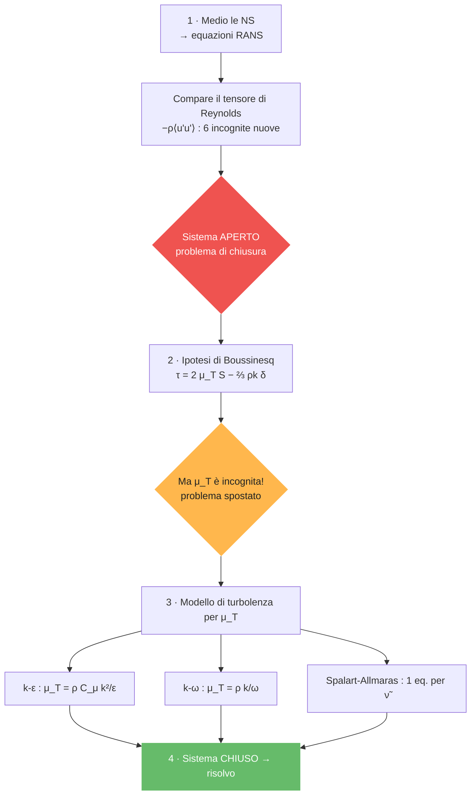
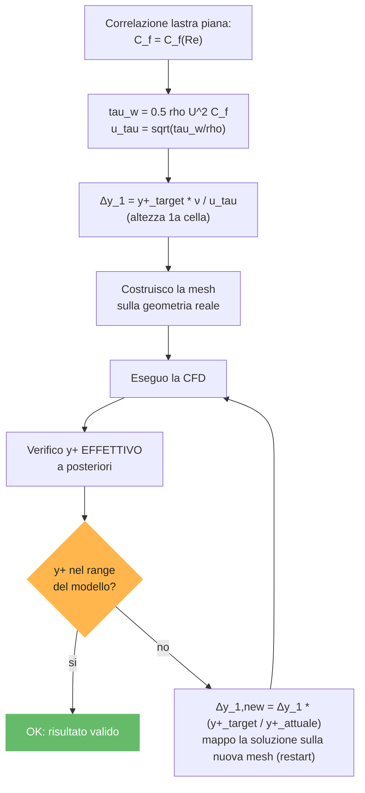
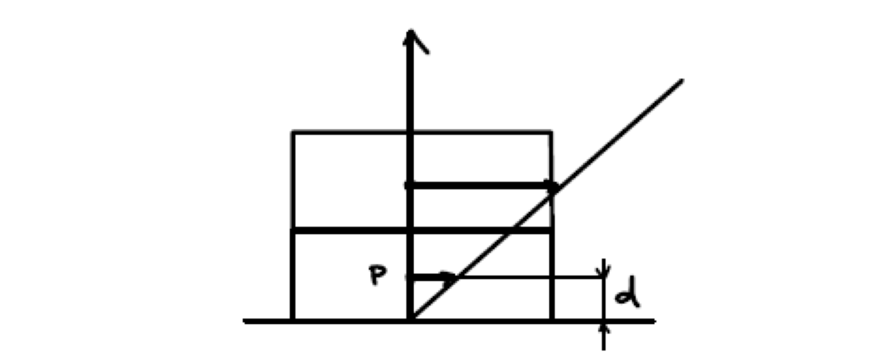
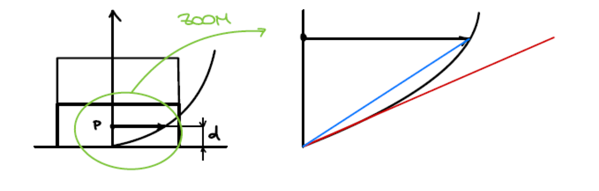
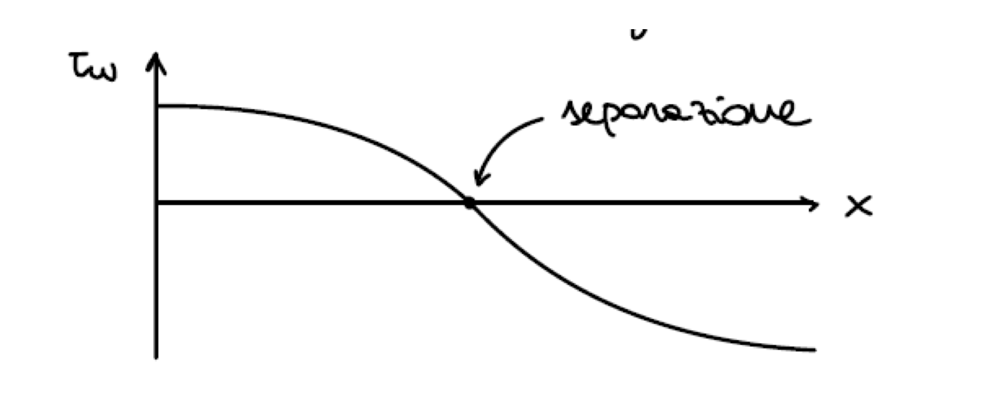
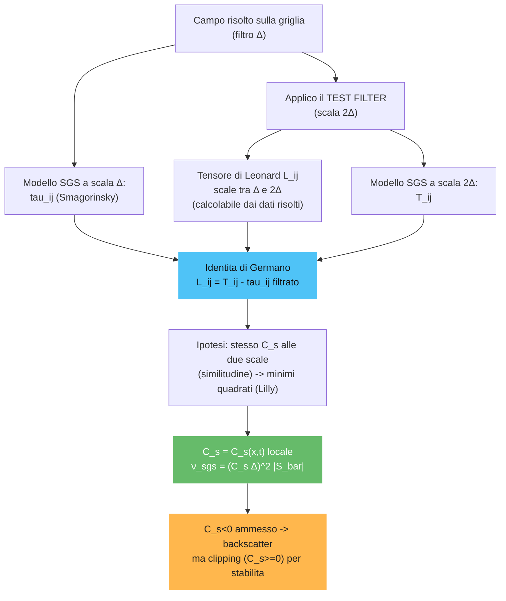
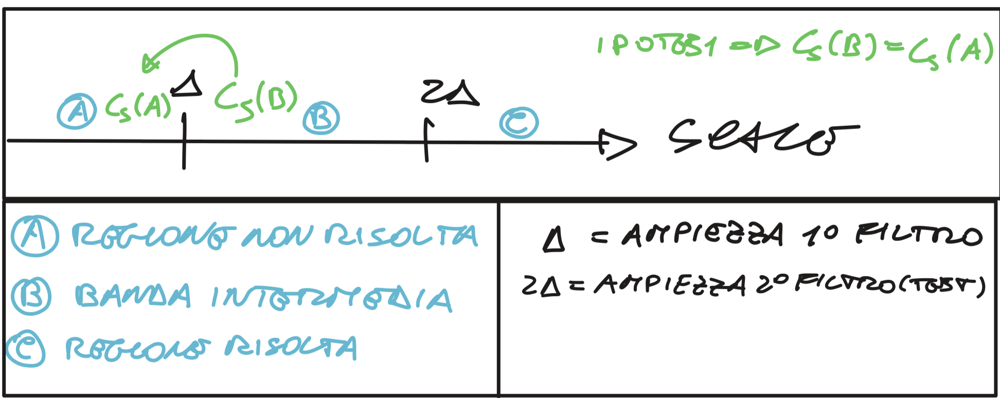

# Turbolenza

## Nomenclatura essenziale

<strong>📖 Simboli e notazione usati in tutto il capitolo</strong>

| Simbolo | Nome | Note |
|---|---|---|
| $\overline{(\cdot)},\ \bar f$ | **media** (di Reynolds) / filtraggio (LES) | RANS media, LES filtra |
| $(\cdot)'$ | **fluttuazione** turbolenta | $u=\bar u+u'$, $\overline{u'}=0$ |
| $\overline{u_i'u_j'}$ | **sforzi di Reynolds** | $\neq0$: chiusura RANS |
| $k$ | energia cinetica turbolenta | $k=\tfrac12\overline{u_i'u_i'}$ |
| $\epsilon$ | dissipazione di $k$ | modello $k$–$\epsilon$ |
| $\omega$ | dissipazione specifica | modello $k$–$\omega$ (SST) |
| $\mu_T,\ \nu_{sgs}$ | viscosità **turbolenta** / di sotto-griglia | Boussinesq; LES (SGS) |
| $\bar S_{ij},\ \lvert\bar S\rvert$ | tensore velocità di deformazione filtrato | $\nu_{sgs}=(C_s\Delta)^2\lvert\bar S\rvert$ |
| $C_s$ | costante di **Smagorinsky** | modello SGS |
| $\Delta,\ \widehat{\Delta}$ | larghezza del **filtro** / *test filter* | LES; $\widehat{(\cdot)}$ = test filter |
| $L_{ij},\ T_{ij}$ | tensori di Leonard / Germano | modello **dinamico** |
| $\tau_{ij},\ \tau_{ij}^s$ | sforzi (Reynolds / SGS) | — |
| $d,\ C_{DES}\Delta$ | distanza da parete / scala DES | switch RANS↔LES (DES), $f_d$ shielding |
| $\gamma\text{–}Re_\theta$ | modello di **transizione** | intermittenza |

---

---

## Teoria di base e derivazione RANS

<strong>Covarianza tra le fluttuazioni e interpretazione fisica</strong>

**1. Media delle fluttuazioni ($\overline{u'}$)**

- **Matematicamente:** è sempre **zero** per costruzione ($\overline{u'} = 0$). Se prendi tutti gli scarti rispetto alla media e li sommi, i "più" e i "meno" si cancellano esattamente.
- **Fisicamente:** rappresenta il "rumore" puramente casuale che non sposta il valore medio nel lungo periodo. È come oscillare avanti e indietro sulla stessa sedia: ti muovi, ma la tua posizione media non cambia.

**2. Prodotto delle medie ($\bar{u}_i \bar{u}_j$)**

- **Matematicamente:** è il prodotto dei valori costanti (o mediati nel tempo).
- **Fisicamente:** rappresenta il **trasporto di quantità di moto del campo medio**. È il movimento "organizzato" del fluido, quello che vedresti in un flusso perfettamente laminare e liscio.

**3. Media del prodotto ($\overline{u_i u_j}$)**

- **Matematicamente:** è la media del segnale totale "sporco".
- **Fisicamente:** è il **trasporto totale effettivo** di quantità di moto. Include sia il movimento ordinato che quello caotico dovuto ai vortici.

**4. La covarianza ($\overline{u_i' u_j'}$)**

Matematicamente definita come $\overline{u_i u_j} - \bar{u}_i \bar{u}_j$, in fisica della turbolenza è il cuore del **tensore di Reynolds**.

| Scenario | Significato matematico | Significato fisico |
| --- | --- | --- |
| **Variabili scorrelate** | La covarianza è **zero**. La media del prodotto è uguale al prodotto delle medie ($\overline{u_i u_j} = \bar{u}_i \bar{u}_j$). | Le fluttuazioni in una direzione non influenzano l'altra. Il fluido è caotico ma "disorganizzato", non c'è un trasporto netto di quantità di moto extra dovuto ai vortici. |
| **Variabili correlate** | La covarianza è **diversa da zero**. Il prodotto delle fluttuazioni "sopravvive" alla media ($\overline{u_i' u_j'} \neq 0$). | **C'è turbolenza attiva.** I vortici spostano masse di fluido in modo coerente. Ad esempio, un guizzo verso l'alto ($v' > 0$) trasporta con sé fluido più lento ($u' < 0$). Questo crea uno "sforzo" che frena il campo medio. |

**Cos'è la covarianza (in generale)**

In statistica, la **covarianza** è una misura di quanto due variabili casuali varino insieme. Se hai due variabili $X$ e $Y$, la covarianza indica se al crescere di una l'altra tende a crescere (covarianza positiva), a decrescere (covarianza negativa) o se non c'è alcuna relazione lineare (covarianza zero).

Matematicamente è definita come il valore atteso (o media) del prodotto degli scarti:

$$Cov(X,Y) = E\big[(X-\bar X)(Y-\bar Y)\big] = E[XY] - E[X]\,E[Y]$$

(In fluidodinamica, l'operatore media $\overline{(\cdot)}$ sostituisce il valore atteso $E[\cdot]$.)

**Perché nella turbolenza non è nulla e i termini non coincidono?**

Dire che la covarianza non è nulla significa dire che i due termini $\overline{u_i u_j}$ e $\bar{u}_i \bar{u}_j$ **non coincidono**. Ecco il motivo fisico e matematico:

- **Il motivo matematico — le fluttuazioni non sono indipendenti.** Se le fluttuazioni $u_i'$ e $u_j'$ fossero indipendenti (come il risultato del lancio di due dadi diversi), la loro media del prodotto sarebbe zero. Ma nella turbolenza le fluttuazioni sono **correlate**. Immagina un fluido che scorre vicino a una parete: se una particella riceve una spinta verso l'alto ($v' > 0$), essa proviene da una zona vicina al muro dove il fluido è più lento. Di conseguenza, quella particella avrà probabilmente una velocità orizzontale inferiore alla media della zona in cui arriva ($u' < 0$). Poiché $u'$ e $v'$ tendono a presentarsi "a coppie" con segni legati, il loro prodotto $u' \cdot v'$ non sarà mediamente zero.
- **Il motivo fisico — il trasporto turbolento.** Se $\overline{u_i u_j}$ e $\bar{u}_i \bar{u}_j$ coincidessero, vorrebbe dire che la turbolenza non ha alcun effetto sul movimento globale del fluido. Invece, la differenza tra i due termini è proprio il **tensore degli sforzi di Reynolds**.

**In sintesi:** non coincidono perché la turbolenza è un fenomeno "organizzato" in vortici; i vortici creano una struttura nelle fluttuazioni tale per cui queste non si annullano a vicenda quando vengono moltiplicate tra loro.

<strong>Calcolo viscosità turbolenta</strong>

| Modello | Descrizione | Pro | Contro | Casi applicativi |
| --- | --- | --- | --- | --- |
| **Algebrici** (es. Baldwin-Lomax) | Modelli a "zero equazioni". Calcolano $\mu_T$ basandosi su profili di velocità e lunghezze di rimescolamento locali senza equazioni differenziali aggiuntive. | Estremamente veloci, robusti e con costo computazionale quasi nullo. | Non tengono conto del trasporto della turbolenza (storia del flusso); falliscono in presenza di separazione. | Flussi semplici, strati limite attaccati, profili alari in condizioni di crociera lineare. |
| **1 eq. trasporto** (es. Spalart-Allmaras) | Risolve una singola equazione differenziale di trasporto per una variabile direttamente legata alla viscosità turbolenta. | Ottimo compromesso tra velocità e precisione; molto più accurato degli algebrici per l'aerodinamica. | Non è un modello universale; limitato in flussi con geometrie interne molto complesse. | Standard nel settore aerospaziale per lo studio di ali ad alto numero di Reynolds. |
| **2 eq. ($k$-$\epsilon$)** | Risolve due equazioni: una per l'energia cinetica turbolenta ($k$) e una per il tasso di dissipazione ($\epsilon$). | Molto robusto e affidabile per simulazioni in zone di fluido indisturbato (free-stream). | Poco accurato vicino alle pareti e in presenza di forti gradienti di pressione negativi. | Flussi industriali generici, scambiatori di calore, flussi in condotti lontani dalle pareti. |
| **2 eq. ($k$-$\omega$)** | Risolve due equazioni per $k$ e la frequenza specifica di dissipazione ($\omega$). | Eccellente accuratezza nella regione del sotto-strato viscoso vicino alle pareti. | Estremamente sensibile ai valori impostati per il fluido esterno (condizioni al contorno). | Flussi interni, strati limite dove la fisica a parete è l'aspetto critico del calcolo. |
| **2 eq. (SST Menter)** | Modello "Shear Stress Transport". Usa funzioni di *blending* per usare $k$-$\omega$ a parete e $k$-$\epsilon$ lontano da essa. | Combina i punti di forza di entrambi i modelli, eliminando le rispettive debolezze. | Leggermente più oneroso e complesso da calibrare rispetto ai modelli standard a 2 eq. | Attuale standard industriale per flussi con separazione, stalli e gradienti di pressione avversi. |
| **RSM** (Reynolds Stress Models) | Abbandona l'ipotesi di Boussinesq e risolve 7 equazioni differenziali (una per ogni componente del tensore di Reynolds). | Gestisce l'anisotropia della turbolenza; ottimo per flussi con forti curvature o rotazioni. | Molto costoso computazionalmente; difficile da far convergere numericamente. | Cicloni, flussi rotanti, curve strette in condotti, motori a combustione interna. |

<strong>Confronto DNS / LES / RANS</strong>

Le tre famiglie di approcci alla simulazione CFD di flussi turbolenti differiscono per il trattamento delle scale di turbolenza: quale parte dello spettro viene risolta direttamente e quale viene modellata.

### DNS — Direct Numerical Simulation

- Risolve *tutte* le scale
- Griglia: $N \propto Re^{3/4}$ per dimensione
- Costo: $\propto Re^3$
- Nessuna modellazione
- Solo ricerca / $Re$ bassi

### LES — Large Eddy Simulation

- Risolve scale grandi
- Modella scale piccole (SGS)
- Costo intermedio
- Filtraggio spaziale
- Buon compromesso

### RANS — Reynolds-Averaged NS

- Risolve solo il campo medio
- Modella *tutta* la turbolenza
- Costo minimo
- Chiusura necessaria
- Uso industriale

> ⚠️ **Costo computazionale DNS.** Il numero di punti griglia per dimensione scala come $N \propto Re^{3/4}$, quindi in 3D il numero totale di celle è $N_{tot} \propto Re^{9/4}$. Tenendo conto del passo temporale (anch'esso proporzionale alla scala di Kolmogorov), il costo complessivo scala come $\text{Costo} \propto Re^3$. Per $Re = 10^6$ (flusso esterno aeronautico tipico), il costo è proibitivo.

> 💡 **Universalità delle piccole scale.** Kolmogorov (1941) ipotizzò che le piccole scale di turbolenza — dette scale di Kolmogorov $\eta, \tau_\eta, u_\eta$ — siano **universali**: dipendono solo dalla viscosità cinematica $\nu$ e dalla dissipazione $\varepsilon$, indipendentemente dalla geometria e dalle condizioni al contorno. È la risposta alla domanda 1 del professore.

<strong>Tipi di media e operatore di media</strong>

### Media temporale

Usata per flussi statisticamente stazionari. Si calcola come limite dell'integrale temporale su un intervallo $T \to \infty$:

$$\bar{u}_i(\mathbf{x}) = \lim_{T \to \infty} \frac{1}{T} \int_t^{t+T} u_i(\mathbf{x}, t')\, dt'$$

> 📌 **Si usa $T$ grande perché si individua un periodo?** No: la turbolenza **non è periodica**. "Statisticamente stazionario" non significa che il segnale si ripeta, ma che le sue **proprietà statistiche** (media, varianza...) non cambiano nel tempo. Non si individua quindi alcun periodo: si media su un intervallo **lungo** affinché le fluttuazioni caotiche — che hanno media nulla — si compensino e l'integrale converga al vero valore medio.

> 📌 **Perché far tendere $T\to\infty$ se il flusso "si ripete"?** Proprio perché **non si ripete**. Per un segnale davvero **periodico** (es. vortex shedding laminare) basterebbe mediare su **un solo periodo** per avere la media esatta — aggiungere altri periodi sarebbe inutile, come osservi tu. Ma nella turbolenza ogni "ciclo" è **diverso** (processo aleatorio): per far convergere la media occorre mediare su **molti tempi caratteristici integrali** $\tau_{int}$. Il limite $T\to\infty$ è l'idealizzazione matematica che garantisce la convergenza e che il risultato **non dipenda più da $T$**; in pratica basta $T\gg\tau_{int}$.

### Media spaziale (d'insieme)

Usata per flussi con turbolenza omogenea (invariante per traslazione spaziale):

$$\bar{u}(t) = \lim_{\Omega \to \infty} \frac{1}{\Omega} \int_\Omega u(\mathbf{x}, t)\, d\Omega$$

### Media di Favre (compressibile)

Per flussi compressibili, la media standard di Reynolds crea accoppiamenti tra l'equazione di continuità e quella di quantità di moto. La **media di Favre** è una media pesata sulla densità:

$$\tilde{u}_i(\mathbf{x}) = \frac{\overline{\rho\, u_i}}{\bar{\rho}} = \frac{1}{\bar{\rho}} \lim_{T\to\infty} \frac{1}{T}\int_t^{t+T} \rho(\mathbf{x},t')\, u_i(\mathbf{x},t')\, dt'$$

> ⚠️ **Risposta alla domanda 6 — Perché la pressione non è mediata con Favre?** Nella media di Favre si usa la ponderazione per densità per *semplificare* l'equazione di continuità e di quantità di moto compressibile. La pressione **non** viene mediata con Favre ma con la media di Reynolds ordinaria ($\bar{p}$), perché la pressione è già un termine scalare che compare linearmente: ponderarla per $\rho$ introdurrebbe correlazioni aggiuntive senza vantaggio. In pratica, si sceglie quale variabile mediare con Favre in base a dove la semplificazione algebrica è massima.

<strong>$\bar u(\mathbf x)$ è 1D o 3D? E fin dove valgono le RANS (incompr. vs compr.)?</strong>

**$\mathbf x$ è un vettore posizione, in generale 3D.** In $\bar u_i(\mathbf x)$, $\mathbf x=(x_1,x_2,x_3)$ è il **punto dello spazio** in cui valuti la media, mentre l'indice $i$ indica la **componente** di velocità ($u_1,u_2,u_3$). Non stai quindi affatto considerando un caso unidimensionale: la media si fa **punto per punto in tutto il dominio 3D** e, per ogni punto, restituisce un campo medio $\bar u_i(\mathbf x)$ che (per flusso statisticamente stazionario) **non dipende più dal tempo**. La media temporale "consuma" la variabile $t$ ma lascia intatta la dipendenza spaziale $\mathbf x$.

**Fin dove valgono le RANS?** Bisogna distinguere due cose:

- La **decomposizione di Reynolds + l'operazione di media** sono **esatte e generali**: valgono per qualunque $Re$ e qualunque geometria, e da sole non introducono approssimazioni (vedi la *dimostrazione passo-passo*).
- Ad avere **validità limitata** è il **modello di chiusura** (Boussinesq, $k$-$\varepsilon$...): è lì che si concentra l'errore, ed è il motivo dei limiti discussi nel capitolo *Benchmark / limiti delle RANS* (separazione, transizione, forti curvature, basso $Re$...).

**Incompressibili — fin dove?** L'ipotesi di incomprimibilità ($\rho\approx$ cost) regge tipicamente per **basso numero di Mach** ($M\lesssim0.3$), dove le variazioni di densità sono trascurabili. Il numero di Reynolds invece può essere qualsiasi — anzi le RANS si usano proprio ad **alti $Re$**, dove DNS/LES sarebbero troppo costose.

**Compressibili — cosa cambia?** Per $M\gtrsim0.3$ (o flussi con forti gradienti di temperatura/densità) la densità fluttua e si passa alle **RANS compressibili** con la **media di Favre**: $\mathbf x$ resta un punto 3D e la struttura delle equazioni è quasi identica, ma compaiono i termini aggiuntivi (sforzi di Reynolds di Favre, flussi turbolenti di calore, $Y_M$) descritti nel toggle *RANS compressibili*.

<strong>Decomposizione di Reynolds</strong>

Qualunque variabile $q$ si decompone in media + fluttuazione:

$$u_i(\mathbf{x},t) = \bar{u}_i(\mathbf{x}) + u_i'(\mathbf{x},t)$$

Per definizione: $\overline{u_i'} = 0$ (la media della fluttuazione è nulla).

> ⚠️ **Risposta alla domanda 3 — La media delle fluttuazioni è sempre nulla?** La proprietà $\overline{u'} = 0$ vale **per costruzione**, indipendentemente dalla stazionarietà statistica, purché la media sia definita coerentemente. Tuttavia, per la media temporale, il limite $T\to\infty$ deve essere ben definito, e ciò richiede che il processo sia *ergodico* (la media temporale su un singolo campione = media d'insieme). Questo è garantito dalla stazionarietà statistica, ma non è strettamente necessario se si usa la media d'insieme.

Decomposizione di Reynolds: il segnale totale $u(t)$ (viola) = media temporale costante $\bar u(x)$ (azzurro) + fluttuazione $u'$ (verde).

<strong>Proprietà dell'operatore di media</strong>

📘 **Proprietà fondamentali (media di Reynolds)**

| Proprietà | Espressione | Nota |
| --- | --- | --- |
| Idempotenza | $\bar{\bar{u}} = \bar{u}$ | La media di una media è la media |
| Media della fluttuazione | $\overline{u'} = 0$ | Per costruzione |
| Linearità | $\overline{au+bv} = a\bar{u}+b\bar{v}$ | Sempre valida |
| Commutazione con $\partial$ | $\overline{\partial u/\partial x_i} = \partial\bar{u}/\partial x_i$ | Condizione da verificare |
| Media del prodotto | $\overline{uv} = \bar{u}\bar{v} + \overline{u'v'}$ | Non lineare! |

> ⚠️ **Risposta alla domanda 5 — Quando commutano media e derivate?** Matematicamente, la commutazione $\overline{\partial u/\partial x_i} = \partial\bar{u}/\partial x_i$ è valida se:
> - la media è un'operazione lineare con limiti di integrazione *costanti* (non dipendenti dalla variabile di derivazione);
> - per la media temporale: i limiti di integrazione $[t, t+T]$ non dipendono da $\mathbf{x}$ → commuta con $\partial/\partial x_i$;
> - per la media spaziale su dominio fisso: commuta con $\partial/\partial t$;
> - **non commuta** con $\partial/\partial t$ se si usa la media temporale e il campo è non stazionario (caso URANS).
>
> Fisicamente: la commutazione è valida quando l'operazione di media non "vede" variazioni nella direzione di derivazione — cioè quando la separazione di scale tra le fluttuazioni e il campo medio è netta.

### Dimostrazione: linearità e idempotenza

**Linearità (la media di una somma è la somma delle medie).** Discende direttamente dalla **linearità dell'integrale** che definisce la media. Con la media temporale:

$$\overline{a\,u+b\,v}=\lim_{T\to\infty}\frac1T\int_t^{t+T}\!\big(a\,u+b\,v\big)\,dt'=a\lim_{T\to\infty}\frac1T\int_t^{t+T}\!u\,dt'+b\lim_{T\to\infty}\frac1T\int_t^{t+T}\!v\,dt'=a\,\bar u+b\,\bar v$$

Le costanti $a,b$ escono dall'integrale e l'integrale di una somma è la somma degli integrali: ecco perché $\overline{au+bv}=a\bar u+b\bar v$ (proprietà usata di continuo nella derivazione delle RANS).

**Idempotenza ($\bar{\bar u}=\bar u$), dalla definizione di media.** Il primo passaggio di media dà

$$\bar u(\mathbf x)=\lim_{T\to\infty}\frac1T\int_t^{t+T}u(\mathbf x,t')\,dt'$$

Il risultato dipende solo da $\mathbf x$: **rispetto al tempo è una costante**. Applicando la media una seconda volta, e notando che $\bar u(\mathbf x)$ **non dipende dalla variabile di integrazione $t'$**, esso **filtra fuori** dall'integrale:

$$\bar{\bar u}(\mathbf x)=\lim_{T\to\infty}\frac1T\int_t^{t+T}\bar u(\mathbf x)\,dt'=\bar u(\mathbf x)\,\lim_{T\to\infty}\frac1T\int_t^{t+T}dt'=\bar u(\mathbf x)\,\lim_{T\to\infty}\frac1T\,T=\bar u(\mathbf x)$$

L'integrale di una costante vale (costante) $\times$ (ampiezza dell'intervallo) $=\bar u\cdot T$; diviso per $T$ e al limite restituisce esattamente $\bar u$. Quindi $\bar{\bar u}=\bar u$.

> ✅ **Conseguenza immediata.** Da idempotenza e linearità segue subito $\overline{u'}=0$: infatti $\overline{u'}=\overline{u-\bar u}=\bar u-\bar{\bar u}=\bar u-\bar u=0$.

### Prodotto di due fluttuazioni sinusoidali

Il professore ha enfatizzato questo punto cruciale: il prodotto di due fluttuazioni **non ha media nulla**.

$$u' = A\sin(\omega t) \quad \Rightarrow \quad \overline{(u')^2} = \overline{A^2\sin^2(\omega t)} = \frac{A^2}{2} \neq 0$$

> ✅ **Teorema chiave.** $\overline{u'} = 0$ ma $\overline{u'^2} \neq 0$ in generale. È proprio questo termine che genera il tensore di Reynolds nelle equazioni mediate.

<strong>Derivazione RANS incompressibili</strong>

### Punto di partenza: equazioni NS incompressibili

$$\frac{\partial u_i}{\partial x_i} = 0 \qquad (\text{continuità})$$

$$\rho\frac{\partial u_i}{\partial t} + \rho u_j \frac{\partial u_i}{\partial x_j} = -\frac{\partial p}{\partial x_i} + \frac{\partial \tau_{ij}}{\partial x_j}$$

### Applicazione della decomposizione di Reynolds

Si sostituisce $u_i = \bar{u}_i + u_i'$ e $p = \bar{p} + p'$ e si applica l'operatore di media. La derivazione completa, passo per passo, è nell'approfondimento *⭐ Dimostrazione completa* qui sotto.

**✅ Equazione RANS — forma finale**

$$\rho\frac{\partial\bar{u}_i}{\partial t} + \rho\bar{u}_j\frac{\partial\bar{u}_i}{\partial x_j} = -\frac{\partial\bar{p}}{\partial x_i} + \frac{\partial}{\partial x_j}\underbrace{\left(\bar{\tau}_{ij} - \rho\overline{u_i'u_j'}\right)}_{\text{sforzo viscoso + sforzo di Reynolds}}$$

Il termine $-\rho\overline{u_i'u_j'}$ è il tensore di Reynolds: le fluttuazioni si comportano come uno sforzo aggiuntivo.

### RANS vs URANS

📘 **Risposta alla domanda 4 — URANS**

| Metodo | Media usata | Informazione temporale | Uso tipico |
| --- | --- | --- | --- |
| **RANS** | Temporale $T\to\infty$ | Persa completamente | Flussi stazionari in media |
| **URANS** | Media su $T_{avg}$ piccolo rispetto alla fluttuazione lenta ma grande rispetto alla turbolenza | Conservata per le variazioni lente | Flussi con instazionarietà coerente (es. vortex shedding) |

Le URANS usano una media su un intervallo $T_{avg}$ tale che $\tau_{turb} \ll T_{avg} \ll \tau_{slow}$. In questo modo si filtrano le fluttuazioni turbolente ma si mantiene la variazione lenta del campo medio nel tempo.

<strong>⭐ Approfondimento — Dimostrazione completa delle RANS incompressibili (passo per passo, da esame)</strong>

Dimostrazione completa con la discussione di **ogni** passaggio — in particolare perché il termine "fluttuazione × derivata di un valore medio" si annulla. (Nota: qui la velocità è $u_i$; gli appunti del corso usano $q_i$, intercambiabile.)

### Passo 0 — Equazioni di partenza (Navier-Stokes incompressibili)

$$\underbrace{\frac{\partial u_i}{\partial x_i}=0}_{\text{continuità}}\qquad\qquad \rho\frac{\partial u_i}{\partial t}+\rho\,u_j\frac{\partial u_i}{\partial x_j}=-\frac{\partial p}{\partial x_i}+\frac{\partial \tau_{ij}}{\partial x_j}$$

con $\tau_{ij}=\mu\big(\partial_j u_i+\partial_i u_j\big)$ sforzo viscoso (lineare in $u$). L'unico termine **non lineare** è il convettivo $u_j\,\partial_j u_i$.

### Passo 1 — Decomposizione di Reynolds

Si scrive ogni incognita come media + fluttuazione:

$$u_i=\bar u_i+u_i',\qquad p=\bar p+p',\qquad \overline{u_i'}=0,\ \ \overline{p'}=0$$

### Passo 2 — Continuità mediata

Sostituendo e mediando (la media è lineare e commuta con $\partial/\partial x_i$):

$$\overline{\frac{\partial(\bar u_i+u_i')}{\partial x_i}}=\frac{\partial\bar u_i}{\partial x_i}+\frac{\partial\overline{u_i'}}{\partial x_i}=\frac{\partial\bar u_i}{\partial x_i}=0$$

Quindi $\partial_i\bar u_i=0$ (continuità del campo medio) e, sottraendola dalla continuità totale, anche $\partial_i u_i'=0$ (**la fluttuazione è a divergenza nulla**). Servirà al Passo 6.

### Passo 3 — Sostituzione nel momento ed espansione del termine convettivo

Sostituendo $u_i=\bar u_i+u_i'$ nel termine non lineare e sviluppando il prodotto si ottengono **quattro** contributi:

$$u_j\frac{\partial u_i}{\partial x_j}=(\bar u_j+u_j')\frac{\partial(\bar u_i+u_i')}{\partial x_j}=\underbrace{\bar u_j\frac{\partial\bar u_i}{\partial x_j}}_{(1)}+\underbrace{\bar u_j\frac{\partial u_i'}{\partial x_j}}_{(2)}+\underbrace{u_j'\frac{\partial\bar u_i}{\partial x_j}}_{(3)}+\underbrace{u_j'\frac{\partial u_i'}{\partial x_j}}_{(4)}$$

### Passo 4 — Media termine per termine

Si applica l'operatore di media a tutta l'equazione. I termini **lineari** sono immediati:

- **Derivata temporale:** $\overline{\rho\,\partial_t u_i}=\rho\,\partial_t\bar u_i$ (la media commuta con $\partial/\partial t$, campo stazionario in media).
- **Pressione:** $\overline{-\partial_i p}=-\partial_i\bar p$ (perché $\overline{p'}=0$).
- **Viscoso:** $\overline{\partial_j\tau_{ij}}=\partial_j\bar\tau_{ij}$ con $\bar\tau_{ij}=\mu(\partial_j\bar u_i+\partial_i\bar u_j)$ — lineare in $u$, quindi nessuna incognita nuova.

Per i quattro pezzi convettivi:

| Termine | Media | Esito |
| --- | --- | --- |
| (1) $\bar u_j\,\partial_j\bar u_i$ | $\bar u_j\,\partial_j\bar u_i$ | resta (tutto medio) |
| (2) $\bar u_j\,\partial_j u_i'$ | $\bar u_j\,\partial_j\overline{u_i'}=0$ | **si annulla** |
| (3) $u_j'\,\partial_j\bar u_i$ | $(\partial_j\bar u_i)\,\overline{u_j'}=0$ | **si annulla** |
| (4) $u_j'\,\partial_j u_i'$ | $\overline{u_j'\,\partial_j u_i'}\neq0$ | **sopravvive** |

### Passo 5 — Perché il termine (3) si annulla (il punto delicato)

Il termine è $\overline{u_j'\,\dfrac{\partial\bar u_i}{\partial x_j}}$, cioè la **media del prodotto di una fluttuazione per la derivata di un valore medio**. La chiave logica è: **$\dfrac{\partial\bar u_i}{\partial x_j}$ è una grandezza già mediata**, quindi **deterministica e costante rispetto all'operatore di media**. Per la regola "media di (costante × fluttuazione) = costante × media della fluttuazione" (linearità + la grandezza media filtra fuori), esso esce dalla media:

$$\overline{u_j'\,\frac{\partial\bar u_i}{\partial x_j}}=\frac{\partial\bar u_i}{\partial x_j}\;\overline{u_j'}=\frac{\partial\bar u_i}{\partial x_j}\cdot 0=0$$

perché $\overline{u_j'}=0$ per costruzione. **A livello logico:** stai mediando il prodotto di qualcosa di *fisso* (il campo medio, e quindi anche la sua derivata) per qualcosa che *oscilla a media nulla* (la fluttuazione); il fattore fisso lo puoi portare fuori dalla media come una costante, e ciò che resta dentro — la media della sola fluttuazione — è zero. (Stessa logica per il termine (2), dove a uscire è $\bar u_j$.)

> ⚠️ **Attenzione a non confonderlo con il termine (4).** Lì il prodotto è tra **due fluttuazioni** ($u_j'$ e $\partial_j u_i'$): nessuna delle due è "fissa", quindi **niente** può uscire dalla media, e $\overline{u_j'\,\partial_j u_i'}\neq0$ in generale. È esattamente la differenza tra "media di costante × fluttuazione" (= 0) e "media di fluttuazione × fluttuazione" ($\neq$ 0).

### Passo 6 — Il termine (4) in forma conservativa (uso della continuità)

Per la regola del prodotto e usando $\partial_j u_j'=0$ (Passo 2):

$$\frac{\partial(u_i'u_j')}{\partial x_j}=u_j'\frac{\partial u_i'}{\partial x_j}+\underbrace{u_i'\frac{\partial u_j'}{\partial x_j}}_{=\,0}\quad\Longrightarrow\quad \overline{u_j'\frac{\partial u_i'}{\partial x_j}}=\frac{\partial\,\overline{u_i'u_j'}}{\partial x_j}$$

Così le due fluttuazioni finiscono **dentro un unico prodotto sotto la derivata**: è il **tensore di Reynolds**. (Senza questo passaggio avremmo un pezzo dentro e uno fuori dalla derivata, impossibili da raccogliere in un tensore.)

### Passo 7 — Equazione RANS finale

$$\boxed{\ \rho\frac{\partial\bar u_i}{\partial t}+\rho\,\bar u_j\frac{\partial\bar u_i}{\partial x_j}=-\frac{\partial\bar p}{\partial x_i}+\frac{\partial}{\partial x_j}\Big(\underbrace{\bar\tau_{ij}-\rho\,\overline{u_i'u_j'}}_{\text{sforzo viscoso + sforzo di Reynolds}}\Big)\ }$$

> ✅ **Riepilogo dei "perché".** Fino a qui **non si è fatta alcuna approssimazione**: solo decomposizione, linearità della media, $\overline{u'}=0$ e incomprimibilità. Il termine $(1)$ ricostruisce la convezione del campo medio; $(2)$ e $(3)$ spariscono perché contengono **una** fluttuazione a media nulla moltiplicata per una grandezza media (che filtra fuori); $(4)$ sopravvive perché è il prodotto di **due** fluttuazioni correlate e genera il tensore di Reynolds, l'unica vera incognita nuova (problema di chiusura).

<strong>Approfondimento — Notazione indiciale: $\partial/\partial x_i$, $\partial\tau_{ij}/\partial x_j$ e perché non $\nabla$</strong>

### La regola degli indici (convenzione di Einstein)

La notazione indiciale (o di Einstein) si basa su due tipi di indice:

- **Indice libero** — compare **una sola volta** in ogni termine. Identifica una componente e, poiché vale per ogni suo valore $i = 1,2,3$, indica che stiamo scrivendo **un'equazione vettoriale/tensoriale** (cioè 3 equazioni scalari in 3D). Esempio: la $i$ in $\partial p/\partial x_i$.
- **Indice ripetuto (muto)** — compare **due volte** nello stesso termine. Per convenzione implica una **sommatoria** su $1,2,3$ (non serve scrivere $\sum$). Rappresenta quindi una **contrazione** (prodotto scalare, traccia, divergenza).

### Caso 1 — $\dfrac{\partial u_i}{\partial x_i}$ (indice ripetuto → divergenza)

L'indice $i$ è ripetuto, quindi è sommato:

$$\frac{\partial u_i}{\partial x_i} = \frac{\partial u_1}{\partial x_1} + \frac{\partial u_2}{\partial x_2} + \frac{\partial u_3}{\partial x_3} = \nabla\cdot\mathbf{u}$$

È esattamente la **divergenza** del campo vettoriale: un singolo numero (scalare).

### Caso 2 — $\dfrac{\partial \tau_{ij}}{\partial x_j}$ (un indice libero, uno ripetuto → divergenza di un tensore)

Qui $j$ è ripetuto (**sommato**) mentre $i$ è **libero**. Il risultato è un **vettore**: per ogni $i$ fissato si somma sulla seconda colonna del tensore.

$$\frac{\partial \tau_{ij}}{\partial x_j} = \sum_{j=1}^{3}\frac{\partial \tau_{ij}}{\partial x_j} = \frac{\partial \tau_{i1}}{\partial x_1} + \frac{\partial \tau_{i2}}{\partial x_2} + \frac{\partial \tau_{i3}}{\partial x_3} = (\nabla\cdot\boldsymbol{\tau})_i$$

> ❓ **Cosa indicano $i$ e $j$, e cos'è $x_j$ rispetto a $x_i$?** Entrambi gli indici sono **direzioni spaziali** ($\{1,2,3\}\leftrightarrow\{x,y,z\}$): $x_i$ e $x_j$ sono **le stesse coordinate spaziali**, con etichetta diversa. La differenza è di **ruolo**: **$i$ (libero)** = direzione della **componente fisica** (per la pressione, la componente del gradiente / quale equazione di QdM; per lo sforzo, la direzione della forza); **$j$ (ripetuto/sommato)** = la coordinata **lungo cui derivo** e, per lo sforzo, l'**orientazione della faccia** del cubetto. La pressione (scalare) ha un solo indice; lo sforzo (tensore) ne ha due — forza ($i$) e faccia ($j$, sommata nella divergenza).

> ❓ **Nel termine convettivo $u_j\,\partial u_i/\partial x_j$, perché la velocità "esterna" ha pedice $j$ e quella derivata $i$?** Perché è un **prodotto scalare** tra velocità e gradiente: $u_j\,\partial_j(\cdot)=(\mathbf u\cdot\nabla)(\cdot)$. L'indice $j$ è **sommato** e appare in $u_j$ (velocità che trasporta) e in $\partial/\partial x_j$ (direzione di derivazione), perché insieme formano l'operatore di advezione $\mathbf u\cdot\nabla$. L'indice $i$ è **libero** e dice **quale componente** $u_i$ viene trasportata.

### Perché la notazione indiciale e non $\nabla$, grad, div, rot?

| Motivo | Spiegazione |
| --- | --- |
| **Tensori di ordine ≥ 2** | Per un tensore $\nabla\cdot\boldsymbol{\tau}$ è **ambiguo** (quale indice si contrae?); $\partial\tau_{ij}/\partial x_j$ lo dice esplicitamente. |
| **Termine non lineare** | $u_j\,\partial u_i/\partial x_j$ e la correlazione $\overline{u_i'u_j'}$ sono naturali per componenti. |
| **Contrazioni compatte** | Tracce, energia $k=\tfrac12\overline{u_i'u_i'}$, produzione $\tau_{ij}\,\partial\bar u_j/\partial x_i$: tutte con un indice ripetuto. |
| **CFD** | I solutori lavorano componente per componente: mappatura **1-a-1** sul codice. |

<strong>Approfondimento — Perché solo la pressione si decompone e il tensore viscoso no (lineare vs non lineare)</strong>

Il punto chiave è **quali termini sono lineari** nelle incognite e quali no.

- **Pressione $p$** — incognita **primitiva**, compare solo tramite il gradiente $\partial p/\partial x_i$, cioè **linearmente**. Si decompone $p=\bar p+p'$, ma essendo lineare la media è banale: $\overline{\partial_i p}=\partial_i\bar p$ e $p'$ sparisce ($\overline{p'}=0$).
- **Tensore viscoso $\tau_{ij}=\mu(\partial_j u_i+\partial_i u_j)$** — **non è incognita indipendente**: è **funzione lineare della velocità**. Si decompone anch'esso, ma in modo automatico: $\overline{\tau_{ij}}=\mu(\partial_j\bar u_i+\partial_i\bar u_j)=\tau_{ij}(\bar u)$ e $\overline{\tau_{ij}'}=0$. **Lo sforzo viscoso medio è lo sforzo viscoso del campo medio** — nessuna incognita nuova.

**Da dove nasce allora la chiusura?** Solo dal termine convettivo, **quadratico**: $\overline{u_i u_j}=\bar u_i\bar u_j+\overline{u_i'u_j'}$. Il termine $\overline{u_i'u_j'}$ è l'**unica** vera nuova incognita.

**"Il tensore di Reynolds non varia nel tempo?"** È solo **idempotenza**: è una grandezza già mediata, quindi per flusso statisticamente stazionario è indipendente dal tempo (in URANS varia lentamente). Non è un'ipotesi calata dall'alto. La **densità** costante, invece, deriva dall'**incomprimibilità** (giustificazione fisica), mentre la "scomparsa" dello sforzo viscoso come incognita extra è puramente matematica (linearità).

<strong>Approfondimento — Media di (costante × fluttuazione): la costante filtra fuori</strong>

Bisogna distinguere due situazioni:

- **Prodotto di due fluttuazioni** (es. $u'$ e $v'$): $\overline{u'v'}\neq\overline{u'}\,\overline{v'}=0$. Da qui nasce il tensore di Reynolds.
- **Media per fluttuante**: la grandezza media è una **costante** rispetto all'operatore di media e **esce** (linearità): $\overline{\bar u\,v}=\bar u\,\bar v$, $\overline{\bar u\,u'}=\bar u\,\overline{u'}=0$.

**Perché $\bar u$ è "costante" rispetto alla media?** Per la media temporale non dipende più da $t$ (è il risultato dell'integrazione su $t$), quindi si porta fuori dall'integrale; per la media d'insieme è deterministica. Formalmente: **linearità + idempotenza** ($\overline{\bar u}=\bar u$). È questo che fa sopravvivere solo il termine quadratico:

$$\overline{uv}=\overline{(\bar u+u')(\bar v+v')}=\bar u\bar v+\underbrace{\bar u\,\overline{v'}}_{0}+\underbrace{\overline{u'}\,\bar v}_{0}+\overline{u'v'}=\bar u\bar v+\overline{u'v'}$$

<strong>RANS compressibili: quali sono i termini aggiuntivi (e dove)</strong>

Della derivazione compressibile **non serve ricordare tutti i passaggi**: la relazione finale è quasi identica alle RANS incompressibili, basta sostituire la media di Reynolds con la **media di Favre** $\tilde{(\cdot)}=\overline{\rho(\cdot)}/\bar\rho$ e far comparire la densità media $\bar\rho$. Le equazioni mediate alla Favre sono:

$$\frac{\partial\bar\rho}{\partial t}+\frac{\partial(\bar\rho\tilde u_i)}{\partial x_i}=0$$

$$\frac{\partial(\bar\rho\tilde u_i)}{\partial t}+\frac{\partial(\bar\rho\tilde u_i\tilde u_j)}{\partial x_j}=-\frac{\partial\bar p}{\partial x_i}+\frac{\partial\bar\tau_{ij}}{\partial x_j}\underbrace{-\frac{\partial}{\partial x_j}\big(\bar\rho\,\widetilde{u_i''u_j''}\big)}_{\text{sforzi di Reynolds (Favre)}}$$

La struttura è la stessa dell'incompressibile; gli unici termini realmente "nuovi" sono le correlazioni di Favre. La tabella riassume **dove** vengono aggiunti e **cosa** rappresentano:

| Termine aggiuntivo | In quale bilancio | Espressione | Contributo fisico |
| --- | --- | --- | --- |
| **(nessuno!)** | **Massa / continuità** | $\partial_t\bar\rho+\partial_i(\bar\rho\tilde u_i)=0$ | È proprio il **motivo per cui si usa Favre**: la continuità mediata resta **formalmente identica** a quella istantanea, senza correlazioni. Con la media di Reynolds ordinaria comparirebbe invece il termine $\partial_i\overline{\rho'u_i'}$. |
| **Sforzi di Reynolds (Favre)** | **Quantità di moto** | $-\partial_j\big(\bar\rho\,\widetilde{u_i''u_j''}\big)$ | Trasporto di quantità di moto dovuto alle fluttuazioni turbolente (analogo all'incompressibile, ma pesato sulla densità). È il termine da chiudere con un modello. |
| **Flusso di calore turbolento** | **Energia** | $-\partial_j\big(\bar\rho\,\widetilde{u_j''h''}\big)$ | Trasporto turbolento di entalpia/energia: i vortici trasportano calore in aggiunta alla conduzione molecolare. |
| **Diffusione / lavoro turbolento** | **Energia** | termini tipo $\overline{u_i''\tau_{ij}}$, $\overline{u_j''p'}$ | Lavoro e diffusione delle fluttuazioni (scambio tra energia media e turbolenta); spesso raccolti nel trasporto di $\bar\rho k$. |
| **Dissipazione di dilatazione $Y_M$** | **Energia / eq. di $k$** | $Y_M=2\bar\rho\varepsilon M_t^2,\ \ M_t=\sqrt{2k}/a$ | Dissipazione aggiuntiva dovuta alla **comprimibilità** (Mach turbolento): conta solo in flussi molto comprimibili (getti supersonici, urti). |

> 💡 In sintesi: **massa → nessun termine extra** (è il vantaggio di Favre), **quantità di moto → sforzi di Reynolds di Favre**, **energia → flussi turbolenti di calore + termini di lavoro/diffusione + correzioni di comprimibilità**.

<strong>Tensore di Reynolds e energia cinetica turbolenta</strong>

### Tensore di Reynolds

$$\mathbf{R} = -\rho\overline{u_i'u_j'} = -\rho\begin{pmatrix} \overline{u_1'^2} & \overline{u_1'u_2'} & \overline{u_1'u_3'} \\ \overline{u_2'u_1'} & \overline{u_2'^2} & \overline{u_2'u_3'} \\ \overline{u_3'u_1'} & \overline{u_3'u_2'} & \overline{u_3'^2} \end{pmatrix}$$

> 💡 **Struttura del tensore e bilancio incognite/equazioni.** Il tensore è simmetrico ($\overline{u_i'u_j'} = \overline{u_j'u_i'}$), quindi ha solo **6 componenti indipendenti**. Facciamo il conto su un flusso incompressibile:
> - **Incognite:** 3 velocità medie $\bar u_i$ + 1 pressione $\bar p$ + **6 sforzi di Reynolds** $\overline{u_i'u_j'}$ = **10**.
> - **Equazioni disponibili:** 1 continuità + 3 quantità di moto = **4**.
>
> Mancano quindi **6 equazioni** (tante quante le componenti indipendenti del tensore): è il **problema di chiusura**. Le 6 relazioni mancanti si possono fornire in due modi: o **direttamente**, con un'equazione di trasporto per ciascuna delle 6 componenti (→ modelli **RSM**, vedi sotto), oppure **indirettamente**, riducendo le 6 incognite a una sola grandezza ($\mu_T$) con l'ipotesi di Boussinesq e determinando quella con **poche** equazioni ausiliarie (0, 1 o 2). Perché al massimo 2 — e mai 3 — è spiegato nel toggle *"Quante equazioni servono per chiudere?"*.

### Dal tensore di Reynolds all'energia cinetica turbolenta (colmare il "gap")

Nelle RANS il tensore di Reynolds è l'incognita da chiudere, ma è comodo riassumere l'**intensità globale** della turbolenza con un **singolo scalare**: l'energia cinetica turbolenta $k$. Non c'è un vero salto concettuale — $k$ è semplicemente l'**energia cinetica (per unità di massa) del campo di fluttuazione**, mediata:

$$k = \frac{1}{2}\overline{u_i'u_i'} = \frac{1}{2}\left(\overline{u_1'^2} + \overline{u_2'^2} + \overline{u_3'^2}\right)$$

Cioè $k$ è **metà della somma dei termini diagonali** della matrice $\overline{u_i'u_j'}$:

$$\overline{u_i'u_j'}=\begin{pmatrix}\overline{u_1'^2}&\overline{u_1'u_2'}&\overline{u_1'u_3'}\\ \overline{u_2'u_1'}&\overline{u_2'^2}&\overline{u_2'u_3'}\\ \overline{u_3'u_1'}&\overline{u_3'u_2'}&\overline{u_3'^2}\end{pmatrix}\ \Rightarrow\ \text{tr}=\overline{u_1'^2}+\overline{u_2'^2}+\overline{u_3'^2}=2k$$

Poiché il tensore di Reynolds è $\mathbf{R}=-\rho\overline{u_i'u_j'}$, la sua traccia vale $\text{tr}(\mathbf{R})=-\rho\,\overline{u_i'u_i'}=-2\rho k$, da cui la riscrittura di $k$ **in funzione del tensore di Reynolds**:

$$\boxed{\,k = -\frac{1}{2\rho}\,\text{tr}(\mathbf{R})\,}$$

È (a meno del fattore $-1/2\rho$) la traccia del tensore di Reynolds.

### Scale di Kolmogorov

$$\eta = \left(\frac{\nu^3}{\varepsilon}\right)^{1/4} \qquad \tau_\eta = \left(\frac{\nu}{\varepsilon}\right)^{1/2} \qquad u_\eta = (\nu\varepsilon)^{1/4}$$

> 💡 **Risposta alla domanda 1 — Universalità delle piccole scale.** Le scale di Kolmogorov $\eta, \tau_\eta, u_\eta$ dipendono solo da $\nu$ (proprietà del fluido) e $\varepsilon$ (tasso di dissipazione). La *dissipazione* è determinata dalle grandi scale (che impongono la quantità di energia da smaltire), ma le *piccole scale* si adattano per dissipare quella energia. Per questo la loro struttura è **universale**: non dipende dalla geometria, dalle condizioni al contorno o dal numero di Reynolds. Dipendono solo dall'ambiente (il fluido, $\nu$) e dalla domanda di energia (la cascata, $\varepsilon$).

<strong>Parte isotropa e anisotropa del tensore di Reynolds: come si riconoscono</strong>

Qualunque tensore simmetrico del secondo ordine $T_{ij}$ si decompone in modo **unico** in:

$$T_{ij} = \underbrace{\frac{1}{3}T_{kk}\,\delta_{ij}}_{\text{isotropo}} + \underbrace{\Big(T_{ij}-\frac{1}{3}T_{kk}\,\delta_{ij}\Big)}_{\text{anisotropo (deviatorico)}}$$

dove $T_{kk}=T_{11}+T_{22}+T_{33}$ è la **traccia**.

**Come si riconoscono in pratica:**

1. **Calcola la traccia** $T_{kk}$ (somma della diagonale).
2. **Parte isotropa** $=\frac13 T_{kk}\,\delta_{ij}$: è il tensore proporzionale all'identità → **stesso valore su tutta la diagonale, zero fuori diagonale**. Agisce ugualmente in tutte le direzioni (come una pressione).
3. **Parte anisotropa** $=$ ciò che resta: ha **traccia nulla** per costruzione e contiene gli sforzi di taglio (fuori diagonale) e gli squilibri tra le componenti normali.

**Criterio rapido:** un tensore è *puramente isotropo* se e solo se ha la forma $c\,\delta_{ij}$ (diagonale uguale, fuori diagonale nulla). Ogni deviazione (diagonale non uniforme oppure termini fuori diagonale) è *anisotropa*.

**Applicato al tensore di Reynolds** $-\rho\overline{u_i'u_j'}$: la traccia vale $-\rho\,\overline{u_i'u_i'}=-2\rho k$, quindi

$$-\rho\overline{u_i'u_j'} = \underbrace{-\frac{2}{3}\rho k\,\delta_{ij}}_{\text{isotropa}\ \to\ \text{pressione}} + \underbrace{\Big(-\rho\overline{u_i'u_j'}+\frac{2}{3}\rho k\,\delta_{ij}\Big)}_{\text{anisotropa}\ \to\ \text{da modellare}}$$

- La **parte isotropa** $-\tfrac23\rho k\,\delta_{ij}$ porta **tutta la traccia** (cioè tutta l'energia $k$) ed è una pressione turbolenta: viene **assorbita nella pressione modificata** $\bar p^*=\bar p+\tfrac23\rho k$ e non si modella esplicitamente.
- La **parte anisotropa** (deviatorica, traccia nulla) è l'unica responsabile del **trasporto netto di quantità di moto**: è quella che l'ipotesi di Boussinesq lega a $\bar S_{ij}$ tramite $2\mu_T\bar S_{ij}$. Ecco perché nell'ipotesi di Boussinesq compaiono proprio i due pezzi: $\tau^R_{ij}=2\mu_T S_{ij}-\tfrac23\rho k\,\delta_{ij}$.

<strong>Modelli di chiusura e ipotesi di Boussinesq</strong>

### Ipotesi di Boussinesq (viscosità turbolenta)

📘 **Definizione.** Il tensore di Reynolds viene modellato analogamente allo sforzo viscoso laminare:

$$\tau_{ij}^R = -\rho\overline{u_i'u_j'} = 2\mu_T S_{ij} - \frac{2}{3}\rho k\,\delta_{ij}$$

dove $S_{ij} = \frac{1}{2}\left(\frac{\partial\bar{u}_i}{\partial x_j} + \frac{\partial\bar{u}_j}{\partial x_i}\right)$ è il tensore della velocità di deformazione del campo medio e $\mu_T$ è la viscosità turbolenta (o eddy viscosity).

> ❓ **Che informazione dà il tensore $S_{ij}$ e perché compare in Boussinesq?** $S_{ij}$ è la **parte simmetrica** del gradiente di velocità medio e misura la **velocità con cui gli elementi di fluido vengono deformati** (stirati e tagliati) dal campo medio: dice *quanto* e *in quali direzioni* il fluido si sta deformando. La parte **antisimmetrica** del gradiente è invece la **rotazione rigida** (vorticità $\Omega_{ij}$), che ruota l'elemento **senza deformarlo**. Boussinesq usa $S_{ij}$ (e non l'intero gradiente) per due motivi: (i) lo sforzo deve dipendere dalla **deformazione**, non dalla rotazione rigida — un fluido in rotazione di corpo rigido non genera sforzi viscosi; (ii) il tensore di Reynolds è **simmetrico**, quindi va legato a un tensore simmetrico ($S_{ij}$), in perfetta analogia con la legge di Newton dello sforzo viscoso laminare $\tau=2\mu S$. In sintesi: $S_{ij}$ porta l'informazione su **tasso e orientazione dello stiramento del campo medio**, che è ciò che l'eddy viscosity converte in sforzo turbolento.

> ❓ **L'unica incognita è $\mu_T$, o anche $k$?** Hai ragione: nella formula compaiono **due** incognite, $\mu_T$ **e** $k$ (quest'ultima nel termine isotropo $-\tfrac23\rho k\,\delta_{ij}$). Il punto è che in flusso **incompressibile** la parte isotropa viene **assorbita nella pressione modificata** $\bar p^*=\bar p+\tfrac23\rho k$: nell'equazione di quantità di moto si risolve direttamente $\bar p^*$, quindi per il bilancio della QdM **basta conoscere $\mu_T$** (la $k$ "si nasconde" nella pressione). Tuttavia $k$ resta un'incognita a tutti gli effetti: serve (a) per ricostruire la pressione vera, (b) nei flussi compressibili, e soprattutto (c) per **calcolare $\mu_T$ stessa**, dato che nei modelli a 2 equazioni $\mu_T=C_\mu\rho k^2/\varepsilon$. Ecco perché il $k$-$\varepsilon$ risolve un'equazione di trasporto **per $k$**: non è affatto nota a priori. Nei modelli algebrici o a 1 equazione (mixing length, Spalart-Allmaras), che **non** calcolano $k$, il termine $-\tfrac23\rho k\,\delta_{ij}$ viene semplicemente omesso/assorbito e si modella solo $\mu_T$.

> ⚠️ **Limite dell'ipotesi di Boussinesq.** Boussinesq assume che il tensore di Reynolds sia *allineato* con il tensore di deformazione del campo medio (come in un fluido Newtoniano). Questo è un'approssimazione: in realtà il tensore di Reynolds ha la propria dinamica (equazioni di trasporto). Il modello fallisce in flussi con forti curvature delle linee di flusso, separazione e rotazione.

### Tabella dei modelli di chiusura

| Modello | Tipo | Equazioni aggiuntive | Pro | Contro |
| --- | --- | --- | --- | --- |
| **Mixing Length** (Prandtl) | Algebrico | 0 (Baldwin-Lomax) | Semplice, robusto | Non trasportabile, fallisce con separazione |
| **$k$-$\varepsilon$** | 2 equazioni diff. | Trasporto $k$ e $\varepsilon$ | Buono nel free-stream | Fallisce con gradienti di pressione avversi |
| **$k$-$\omega$** | 2 equazioni diff. | Trasporto $k$ e $\omega$ | Ottimo vicino a parete | Sensibile alle condizioni al contorno esterne |
| **$k$-$\omega$ SST** (Menter) | 2 equazioni diff. | Blending $k$-$\varepsilon$ e $k$-$\omega$ | Unisce i vantaggi di entrambi | Più complesso da calibrare |
| **RSM** | 7 equazioni diff. | Trasporto per ogni $\overline{u_i'u_j'}$ | Nessuna ipotesi di isotropia | Costoso, difficile convergenza |

<strong>📐 Approfondimento — Perché il costo della DNS scala come Re³?</strong>

**Separazione di scale.** La scala più grande è $L$ (scala integrale), quella più piccola è $\eta$ (scala di Kolmogorov). Il rapporto tra le due scala come:

$$\frac{L}{\eta} \propto Re_L^{3/4}$$

Per risolvere entrambe in 3D, il numero totale di celle è:

$$N_{celle} \propto \left(\frac{L}{\eta}\right)^3 \propto Re_L^{9/4}$$

Il passo temporale deve risolvere il tempo di vita dei vortici di Kolmogorov $\tau_\eta \propto Re^{-1/2}$ rispetto al tempo convettivo $T_{conv}$:

$$N_{timestep} \propto \frac{T_{conv}}{\tau_\eta} \propto Re_L^{1/2}$$

Il costo totale quindi scala come:

$$\text{Costo} \propto N_{celle} \times N_{timestep} \propto Re^{9/4} \cdot Re^{3/4} = Re^3$$

Nota: in letteratura si trovano esponenti leggermente diversi (es. $Re^{11/4}$) a seconda delle assunzioni, ma la stima $Re^3$ è quella comunemente usata a lezione.

## Modelli di turbolenza RANS

<strong>Schema della procedura generale di chiusura RANS</strong>

L'intera logica dei modelli RANS è una **catena**: ogni passo risolve un problema ma ne introduce uno nuovo, finché un modello ausiliario lo chiude.

**In parole:**

1. **Scrivo le RANS** mediando Navier-Stokes → spunta il tensore di Reynolds (6 incognite in più delle equazioni disponibili → sistema aperto).
2. **Modello il tensore di Reynolds** con l'**ipotesi di Boussinesq**, che lo lega al gradiente del campo medio tramite una **viscosità turbolenta** $\mu_T$.
3. **Ma $\mu_T$ non la conosco:** il problema non è risolto, è solo *spostato*. La calcolo con un **modello di turbolenza** ($k$-$\varepsilon$, $k$-$\omega$, SST, Spalart-Allmaras...), che aggiunge una o due equazioni di trasporto.
4. **Sistema chiuso** → risolvo numericamente.

> ⚠️ Ogni livello introduce nuove costanti empiriche e nuove ipotesi: la "chiusura" non è mai esatta, è un compromesso calibrato.

<strong>Quante equazioni servono per chiudere? Perché modelli a 0, 1, 2 equazioni — e mai 3</strong>

La domanda "quante equazioni mancano" ha **due risposte diverse** a seconda del quadro:

> ⚠️ **Punto chiave: i modelli a 2 equazioni sono applicabili *solo dopo* aver fatto l'ipotesi di Boussinesq.** Senza Boussinesq il tensore di Reynolds ha **6 incognite indipendenti**: due equazioni di trasporto **non basterebbero**, ne servirebbero 6 (→ RSM). È proprio l'ipotesi di Boussinesq a **ridurre le 6 incognite** del tensore di Reynolds a poche grandezze — in pratica $k$ e $\mu_T$ (con $\mu_T=C_\mu\rho k^2/\varepsilon$) — rendendo **sufficienti** due equazioni di trasporto (es. $k$ ed $\varepsilon$). In altre parole: prima *modello* il tensore (Boussinesq → poche incognite), **poi** posso permettermi 2 equazioni. **Lo stesso schema vale in LES:** anche lì bisogna introdurre una **nuova ipotesi** (eddy viscosity di sotto-griglia, $\nu_{sgs}=(C_s\Delta)^2|\bar S|$) per **ridurre il numero di incognite** del tensore SGS e poterlo chiudere.

**Quadro 1 — trasporto diretto degli sforzi (RSM).** Le componenti indipendenti del tensore sono **6**, quindi mancano **6** relazioni. Se le si fornisce con un'equazione di trasporto ciascuna si ottengono i modelli **RSM** (6 equazioni per gli sforzi + 1 per $\varepsilon$ = **7**). Qui sì che ci sono "più di due" equazioni — ma è una **famiglia diversa**, che *non* usa Boussinesq.

**Quadro 2 — eddy viscosity (Boussinesq).** L'ipotesi di Boussinesq **collassa le 6 incognite in una sola**, la viscosità turbolenta $\mu_T$. A questo punto non servono più 6 equazioni: ne basta abbastanza per stimare $\mu_T$. E per dimensione $\mu_T$ richiede **due scale** della turbolenza — una di **velocità** e una di **lunghezza** (o, equivalentemente, due tra $k$, $\varepsilon$, $\omega$, $l_t$):

$$\mu_T \sim \rho\,\underbrace{u_t}_{\text{vel.}}\,\underbrace{l_t}_{\text{lungh.}}\quad\Longleftrightarrow\quad \mu_T=\rho\frac{k}{\omega}=C_\mu\rho\frac{k^2}{\varepsilon}$$

Il **numero di equazioni di trasporto = numero di scale che decido di trasportare** invece di prescrivere algebricamente:

| Modello | Equazioni di trasporto | Come ottiene le due scale |
| --- | --- | --- |
| **Algebrico (0 eq.)** | 0 | entrambe le scale da relazioni locali (lunghezza di mixing dalla distanza di parete, velocità da $|\partial\bar u/\partial y|\cdot l$) |
| **1 equazione** | 1 (es. $k$ o $\tilde\nu$) | una scala trasportata, l'altra **algebrica** (es. lunghezza dalla distanza di parete) |
| **2 equazioni** | 2 ($k$+$\varepsilon$ o $k$+$\omega$) | **entrambe** le scale trasportate → chiusura eddy-viscosity più generale |

**Perché mai 3 (in ambito eddy-viscosity)?** Perché $\mu_T$ è determinata da **due** scale soltanto: due equazioni di trasporto le forniscono entrambe in modo completo, e una terza sarebbe **ridondante** — non aggiungerebbe alcuna informazione indipendente alla stima di $\mu_T$. Non è "sovradeterminazione" in senso matematico stretto, ma **sovra-modellazione** inutile entro l'ipotesi di Boussinesq. Se vuoi più fisica devi **abbandonare** Boussinesq e passare agli RSM (7 equazioni), che però trasportano direttamente gli sforzi.

> 💡 **"Se mancassero due equazioni, come imporne una sola?"** È esattamente ciò che fa un modello a 1 equazione: trasporta **una** scala (es. $k$) e chiude l'**altra** con una relazione **algebrica** (es. la scala di lunghezza dalla geometria/distanza di parete). Non lasci nulla "in sospeso": la seconda scala la prescrivi invece di trasportarla. Costo minore e più robustezza, al prezzo di minore generalità.

<strong>Come funzionano i modelli a trasporto degli sforzi di Reynolds (RSM)?</strong>

Sì: i **Reynolds Stress Models** abbandonano l'ipotesi di Boussinesq e scrivono **un'equazione di trasporto per ciascuna componente indipendente** di $\overline{u_i'u_j'}$. Essendo il tensore simmetrico, le componenti indipendenti sono **6** ($\overline{u_1'^2},\overline{u_2'^2},\overline{u_3'^2},\overline{u_1'u_2'},\overline{u_1'u_3'},\overline{u_2'u_3'}$), più **1** equazione per $\varepsilon$ (o $\omega$) che fornisce la scala di lunghezza/tempo → **7 equazioni** in totale.

**Che tipo di equazioni sono?** Si **ricavano esattamente dalle Navier-Stokes** prendendo i *momenti del secondo ordine*: si moltiplica l'equazione della QdM per $u_j'$, si somma la versione con gli indici scambiati ($i\leftrightarrow j$) e si media. Si ottiene, per ogni coppia $(i,j)$, un'equazione di trasporto della forma:

$$\underbrace{\frac{\partial \overline{u_i'u_j'}}{\partial t}}_{\text{non staz.}}+\underbrace{\bar u_k\frac{\partial \overline{u_i'u_j'}}{\partial x_k}}_{\text{convezione}}=\underbrace{P_{ij}}_{\text{produzione}}+\underbrace{\Pi_{ij}}_{\substack{\text{redistribuzione}\\\text{(pressure-strain)}}}-\underbrace{\varepsilon_{ij}}_{\text{dissipazione}}+\underbrace{D_{ij}}_{\text{diffusione}}$$

- Il termine di **produzione** $P_{ij}=-\big(\overline{u_i'u_k'}\,\partial_k\bar u_j+\overline{u_j'u_k'}\,\partial_k\bar u_i\big)$ è **esatto (chiuso)**: dipende solo dagli stessi sforzi e dai gradienti medi. È il **grande vantaggio** dell'RSM — la produzione di anisotropia (per shear, rotazione, curvatura) è catturata **senza approssimazioni**.
- I termini di **pressure-strain $\Pi_{ij}$** (ridistribuisce energia tra le componenti, tende a re-isotropizzare), **dissipazione $\varepsilon_{ij}$** e **diffusione turbolenta $D_{ij}$** sono invece **non chiusi** e vanno modellati: è qui che le varianti RSM differiscono.

**In pratica** risolvi davvero una PDE per $\overline{u_1'^2}$, una per $\overline{u_2'^2}$, ecc.: stessa struttura, cambiano solo gli indici. **Pro:** nessuna ipotesi di eddy-viscosity isotropa → cattura anisotropia, flussi secondari, swirl, forti curvature. **Contro:** 7 equazioni accoppiate, costoso e con convergenza numerica difficile.

<strong>Modello k-ε: le due equazioni di trasporto e il significato di ogni termine</strong>

Il modello $k$-$\varepsilon$ (famiglia di modelli a **2 equazioni**) risolve due equazioni di trasporto **strutturalmente identiche**: cambia solo la variabile trasportata ($k$ oppure $\varepsilon$). La forma è quella tipica delle **leggi di conservazione**.

**Equazione per $k$** (energia cinetica turbolenta):

$$\frac{\partial(\bar\rho k)}{\partial t}+\frac{\partial(\bar\rho\tilde u_i k)}{\partial x_i}=\frac{\partial}{\partial x_j}\!\left[\left(\mu+\frac{\mu_T}{\sigma_k}\right)\frac{\partial k}{\partial x_j}\right]+G_k-\bar\rho\varepsilon+Y_M$$

**Equazione per $\varepsilon$** (tasso di dissipazione):

$$\frac{\partial(\bar\rho\varepsilon)}{\partial t}+\frac{\partial(\bar\rho\tilde u_i\varepsilon)}{\partial x_i}=\frac{\partial}{\partial x_j}\!\left[\left(\mu+\frac{\mu_T}{\sigma_\varepsilon}\right)\frac{\partial\varepsilon}{\partial x_j}\right]+C_{1\varepsilon}\frac{\varepsilon}{k}G_k-C_{2\varepsilon}\bar\rho\frac{\varepsilon^2}{k}$$

Hai ragione: il **lato sinistro** è analogo alle leggi di conservazione (derivata temporale + convezione), e i due trasporti differiscono solo per la variabile e i termini sorgente.

| Termine | Formula (eq. di $k$) | Nome / tipo | Significato fisico ed effetto |
| --- | --- | --- | --- |
| **Variazione temporale** | $\partial(\bar\rho k)/\partial t$ | non stazionario | Accumulo/decadimento locale di $k$ nel tempo. Nullo a regime stazionario. |
| **Convettivo** | $\partial(\bar\rho\tilde u_i k)/\partial x_i$ | trasporto convettivo (**flusso**) | **Sì, è corretto parlare di flusso:** in forma conservativa è la divergenza del flusso convettivo $\bar\rho\tilde u_i k$, cioè $k$ trasportata dal campo medio attraverso le facce della cella. |
| **Diffusivo** | $\partial_j[(\mu+\mu_T/\sigma_k)\,\partial_j k]$ | diffusione (divergenza di un gradiente) | **Stessa struttura** del termine viscoso/diffusivo nelle leggi di bilancio classiche (Fourier per il calore, Fick per le specie, Newton per la QdM): "divergenza di un gradiente", che a coefficiente costante è un **laplaciano**. Qui la diffusività è $\mu$ (molecolare) $+\,\mu_T/\sigma_k$ (turbolenta): la turbolenza **diffonde** $k$ verso le zone a minor $k$. |
| **Produzione** $G_k$ | $G_k=\tau^F_{ij}\,\partial\tilde u_j/\partial x_i$ | sorgente (produzione) | Energia **estratta dal moto medio** e convertita in turbolenza. Grande dove i gradienti di velocità media (shear) sono intensi (strati limite, scie). Alimenta $k$. |
| **Distruzione / dissipazione** | $-\bar\rho\varepsilon$ | pozzo (distruzione) | Tasso con cui $k$ viene trasferita alle piccole scale e infine **dissipata in calore** alla scala di Kolmogorov. Sottrae $k$. |
| **Comprimibilità** $Y_M$ | $Y_M=2\bar\rho\varepsilon M_t^2$ | correzione comprimibile | Dissipazione di **dilatazione**, attiva solo in flussi molto comprimibili (Mach turbolento $M_t$ non trascurabile). |

> ⚠️ **Perché compare $Y_M$ se stiamo trattando l'incompressibile?** Perché l'equazione è scritta nella sua forma **generale (comprimibile)**, così com'è implementata nei codici CFD. Nel **caso incompressibile $Y_M=0$** (si ha $M_t\to0$): semplicemente lo si trascura. È presente per generalità, non perché serva all'incompressibile.

> 📌 **Cosa sono $\sigma_k$ e $\sigma_\varepsilon$ al denominatore del termine diffusivo?** Sono i **numeri di Prandtl turbolenti** di $k$ e $\varepsilon$: costanti empiriche adimensionali (tipicamente $\sigma_k\approx1.0$, $\sigma_\varepsilon\approx1.3$) che fissano **quanto la turbolenza diffonde $k$ (o $\varepsilon$) rispetto a quanto diffonde la quantità di moto**. La diffusività turbolenta di $k$ è infatti $\mu_T/\sigma_k$: è la stessa $\mu_T$ che agisce sulla QdM, "riscalata" da $\sigma_k$. Esattamente come il numero di Prandtl lega diffusività di quantità di moto e termica, $\sigma$ lega la diffusione turbolenta (eddy) della QdM a quella di $k$/$\varepsilon$. Un $\sigma$ più grande → quella grandezza diffonde di meno.

**Il termine di $\varepsilon$ in parallelo:** stessi termini (non stazionario, convettivo, diffusivo con $\sigma_\varepsilon$), più produzione $C_{1\varepsilon}(\varepsilon/k)G_k$ (proporzionale alla produzione di $k$) e distruzione $C_{2\varepsilon}\bar\rho\varepsilon^2/k$; $C_{1\varepsilon},C_{2\varepsilon}$ sono costanti empiriche.

> ⚠️ **Perché nel trasporto di $\varepsilon$ non c'è il termine di comprimibilità $Y_M$ (presente invece in quello di $k$)?** Perché $Y_M$ modella la **dissipazione di dilatazione**, un meccanismo che sottrae energia **direttamente a $k$** per effetto della comprimibilità: è fisicamente un **pozzo del bilancio di $k$**. La variabile $\varepsilon$ **è già** il tasso di dissipazione, e le correzioni standard di comprimibilità (Sarkar, Zeman) sono formulate come contributo al bilancio di $k$, **non** come sorgente separata nell'equazione di $\varepsilon$. L'effetto della comprimibilità arriva a $\varepsilon$ **indirettamente**, tramite l'accoppiamento con il campo di $k$ modificato (i termini $\propto\varepsilon/k\,G_k$ e $\varepsilon^2/k$), senza bisogno di un termine esplicito dedicato.

**Chiusura finale** — da $k$ ed $\varepsilon$ si costruisce per analisi dimensionale la viscosità turbolenta:

$$\mu_T=C_\mu\,\bar\rho\,\frac{k^2}{\varepsilon}\qquad\left([k]=\tfrac{m^2}{s^2},\ [\varepsilon]=\tfrac{m^2}{s^3}\right)$$

<strong>Modello k-ω: equazioni di trasporto, relazione con ε e cross-diffusion</strong>

Concettualmente analogo al $k$-$\varepsilon$: due equazioni di trasporto, una per $k$ e una per $\omega$ (frequenza di dissipazione, o **dissipazione specifica**). La relazione tra le variabili è:

$$\omega=\frac{\varepsilon}{k}$$

**Dimensionalmente:** $\varepsilon$ è una potenza per unità di massa $[m^2/s^3]$, $k$ un'energia per unità di massa $[m^2/s^2]$, quindi $\omega\sim[1/s]$ è l'**inverso di un tempo caratteristico** del decadimento dei vortici. La viscosità turbolenta è:

$$\mu_T=\frac{\bar\rho k}{\omega}$$

**Equazione per $k$:**

$$\frac{\partial(\bar\rho k)}{\partial t}+\frac{\partial(\bar\rho\tilde u_i k)}{\partial x_i}=\frac{\partial}{\partial x_j}\!\left[\left(\mu+\frac{\mu_T}{\sigma_k}\right)\frac{\partial k}{\partial x_j}\right]+G_k-\beta^*\bar\rho\,\omega k$$

**Equazione per $\omega$:**

$$\frac{\partial(\bar\rho\omega)}{\partial t}+\frac{\partial(\bar\rho\tilde u_i\omega)}{\partial x_i}=\frac{\partial}{\partial x_j}\!\left[\left(\mu+\frac{\mu_T}{\sigma_\omega}\right)\frac{\partial\omega}{\partial x_j}\right]+\frac{\alpha\,\omega}{k}G_k-\beta\bar\rho\,\omega^2+\underbrace{\bar\rho\frac{\sigma_d}{\omega}\frac{\partial k}{\partial x_j}\frac{\partial\omega}{\partial x_j}}_{\text{cross-diffusion}}$$

La struttura è identica al $k$-$\varepsilon$, con due differenze: (i) la **distruzione di $k$** è $\beta^*\bar\rho\omega k$ invece di $\bar\rho\varepsilon$ (coerente con $\varepsilon=\beta^*\omega k$); (ii) compare il **termine di cross-diffusion** nell'equazione di $\omega$.

| Termine | Formula (eq. di $k$) | Nome / tipo | Significato fisico ed effetto |
| --- | --- | --- | --- |
| **Variazione temporale** | $\partial(\bar\rho k)/\partial t$ | non stazionario | Accumulo/decadimento locale di $k$. Nullo a regime. |
| **Convettivo** | $\partial(\bar\rho\tilde u_i k)/\partial x_i$ | trasporto convettivo (flusso) | $k$ trasportata dal campo medio attraverso le facce della cella. |
| **Diffusivo** | $\partial_j[(\mu+\mu_T/\sigma_k)\,\partial_j k]$ | diffusione (divergenza di un gradiente) | Diffusione molecolare $+$ turbolenta di $k$; $\sigma_k$ è il numero di Prandtl turbolento di $k$. |
| **Produzione** $G_k$ | $G_k=\tau^F_{ij}\,\partial\tilde u_j/\partial x_i$ | sorgente | Energia estratta dal moto medio (shear) e versata nella turbolenza. |
| **Distruzione** | $-\beta^*\bar\rho\,\omega k$ | pozzo | Dissipazione di $k$; equivale a $-\bar\rho\varepsilon$ scritto con $\omega$. |

| Termine (eq. di $\omega$) | Formula | Nome / tipo | Significato |
| --- | --- | --- | --- |
| **Variazione temporale** | $\partial(\bar\rho\omega)/\partial t$ | non stazionario | Evoluzione locale di $\omega$. |
| **Convettivo** | $\partial(\bar\rho\tilde u_i\omega)/\partial x_i$ | trasporto (flusso) | $\omega$ trasportata dal campo medio. |
| **Diffusivo** | $\partial_j[(\mu+\mu_T/\sigma_\omega)\,\partial_j\omega]$ | diffusione | Diffusione di $\omega$; $\sigma_\omega$ è il Prandtl turbolento di $\omega$. |
| **Produzione** | $(\alpha\omega/k)\,G_k$ | sorgente | Produzione di $\omega$ proporzionale a quella di $k$. |
| **Distruzione** | $-\beta\bar\rho\,\omega^2$ | pozzo | Decadimento di $\omega$ (analogo a $-C_{2\varepsilon}\bar\rho\varepsilon^2/k$). |
| **Cross-diffusion** | $\bar\rho(\sigma_d/\omega)\,\partial_j k\,\partial_j\omega$ | accoppiamento $k$–$\omega$ | Vedi sotto. |

> 💡 **Significato del termine di cross-diffusion.** È un termine **proporzionale al prodotto scalare dei gradienti** $\nabla k\cdot\nabla\omega$, che accoppia i due campi. Matematicamente nasce **quando si trasforma l'equazione di $\varepsilon$ in quella di $\omega$** ponendo $\omega=\varepsilon/k$: la regola della catena fa comparire un termine $\propto\nabla k\cdot\nabla\omega$. Fisicamente, dove $k$ e $\omega$ crescono nella stessa direzione (gradienti concordi) aggiunge produzione di $\omega$. È **il termine chiave del SST**: attivandolo solo lontano dalla parete (tramite $1-F_1$) si fa comportare il $k$-$\omega$ come un $k$-$\varepsilon$ nel free-stream, **riducendone la sensibilità** al valore di $\omega$ imposto in ingresso. Nel $k$-$\omega$ standard originale era assente, ed è una delle cause della sua freestream-sensitivity.

<strong>k-ε vs k-ω: perché funzionano meglio in regioni diverse se ω = ε/k?</strong>

L'osservazione è corretta: **puntualmente** $\omega=\varepsilon/k$, quindi le due variabili sono algebricamente legate. La differenza **non sta nella definizione** delle grandezze, ma nelle **equazioni di trasporto** che esse soddisfano e nel loro **comportamento asintotico a parete**.

- **Equazioni diverse:** $\varepsilon$ e $\omega$ obbediscono a PDE con **termini sorgente, di distruzione e di diffusione diversi**; l'equazione di $\omega$ ha in più il **termine di cross-diffusion** $\propto\partial_jk\,\partial_j\omega$. Anche se $\omega=\varepsilon/k$ in un punto, il *bilancio modellato* (come $\varepsilon$ o $\omega$ vengono prodotte/distrutte/trasportate) è diverso → i campi predetti differiscono.
- **A parete:** l'equazione di $\omega$ ha un comportamento analitico pulito ($\omega\sim1/y^2$ per $y\to0$) che si **integra fino alla parete senza funzioni di smorzamento** → $k$-$\omega$ è accurato nel sottostrato viscoso e con gradienti avversi/separazione. L'equazione di $\varepsilon$ si comporta male vicino a parete (richiede *damping functions* empiriche) → $k$-$\varepsilon$ è impreciso lì.
- **Nel free-stream:** $\omega$ è **difficile da stimare in ingresso** e il $k$-$\omega$ ne è molto sensibile; $k$-$\varepsilon$ è più robusto lontano dalle pareti.

> 💡 È quindi una questione di **equazioni di trasporto e condizioni al contorno/asintotiche**, non di definizioni. Proprio per questo il modello **SST** (qui sotto) usa $k$-$\omega$ vicino a parete e $k$-$\varepsilon$ lontano, fondendoli con la funzione $F_1$.

<strong>SST (Shear Stress Transport, Menter)</strong>

Idea: il $k$-$\omega$ è migliore **vicino a parete** e in presenza di separazione, ma molto **sensibile al valore di $\omega$ imposto in ingresso** (difficile da stimare); il $k$-$\varepsilon$ è più robusto **lontano dalle pareti**. Menter ha riscritto l'equazione di $\varepsilon$ in funzione di $\omega$ (usando $\varepsilon=\omega k$) e ha introdotto una **funzione di blending $F_1$** che vale 1 a parete (→ $k$-$\omega$) e 0 lontano (→ $k$-$\varepsilon$). Tutte le costanti diventano combinazioni pesate delle due formulazioni. È oggi lo **standard industriale** per flussi con separazione e gradienti di pressione avversi.

<strong>Modello di Spalart-Allmaras (1 equazione)</strong>

Modello a **una sola equazione** di trasporto per una variabile ausiliaria $\tilde\nu$ legata (ma non coincidente) alla viscosità turbolenta. Sviluppato alla NASA per **flussi esterni aerodinamici ad alto Reynolds** (profili alari, transonico/supersonico); non pensato per basso $Re$ o transizione.

$$\frac{\partial\tilde\nu}{\partial t}+\bar u_j\frac{\partial\tilde\nu}{\partial x_j}=\underbrace{C_{b1}\tilde S\tilde\nu}_{\text{produzione }P}-\underbrace{C_{w1}f_w\Big(\frac{\tilde\nu}{d}\Big)^2}_{\text{distruzione }D}+\underbrace{\frac{1}{\sigma_v}\Big[\frac{\partial}{\partial x_j}\big((\nu+\tilde\nu)\frac{\partial\tilde\nu}{\partial x_j}\big)+C_{b2}\Big|\frac{\partial\tilde\nu}{\partial x_j}\Big|^2\Big]}_{\text{diffusione}}$$

**Significato di ogni termine** (oltre a produzione e diffusione):

- **Produzione** $P=C_{b1}\tilde S\tilde\nu$: *genera* $\tilde\nu$ dove c'è deformazione media (shear), proporzionale allo strain rate modificato $\tilde S$.
- **Distruzione** $D=C_{w1}f_w(\tilde\nu/d)^2$: *distrugge* $\tilde\nu$ **vicino alla parete** ($\propto1/d^2$, $d$ = distanza dal muro): rappresenta lo **smorzamento della turbolenza operato dalla parete** e forza $\tilde\nu\to0$ a $d\to0$.
- **Diffusione** $\frac1{\sigma_v}[\partial_j((\nu+\tilde\nu)\partial_j\tilde\nu)+C_{b2}|\partial_j\tilde\nu|^2]$: *spande* $\tilde\nu$ nello spazio. La prima parte è una **diffusione conservativa** con coefficiente $(\nu+\tilde\nu)/\sigma_v$; la seconda, $C_{b2}|\partial_j\tilde\nu|^2$, è un termine **non conservativo** legato al gradiente di $\tilde\nu$ che migliora il comportamento al **bordo** dello strato limite ($\sigma_v$ è un numero di Prandtl turbolento del modello).

> ❓ **Qual è il termine che dà la grande stabilità numerica, e una diffusione così grande non è un problema?** È proprio il termine **diffusivo**: il suo coefficiente è $(\nu+\tilde\nu)/\sigma_v$, e in uno strato limite turbolento $\tilde\nu\gg\nu$ → la **diffusività effettiva è enorme** → forte smussamento → **robustezza numerica**. Non è un problema **se il flusso è realmente turbolento**: lì la diffusione turbolenta **è** fisicamente enorme (la turbolenza aumenta il mescolamento di ordini di grandezza), quindi la grande diffusione **rispecchia la fisica**. Diventa un problema **solo dove il flusso non è turbolento** (transizione, regioni laminari): lì quella diffusione è artificiale e "spalma" ciò che dovrebbe restare netto — ed è una delle ragioni per cui S-A sbaglia in transizione/basso $Re$.

> ❓ **S-A non funziona in transizione laminare-turbolenta: colpa del fenomeno, del modello, o altro?** Soprattutto **del modello (per come è progettato)**, unito al fatto che la transizione è intrinsecamente delicata. S-A è costruito per flussi **completamente turbolenti**: non ha alcun meccanismo (intermittenza, posizione di transizione) per rappresentare il passaggio laminare→turbolento. Assume che la turbolenza ci sia già (si impone $\tilde\nu/\nu\approx3$ all'ingresso) e tende a rendere **tutto** il BL turbolento fin da subito. Senza un **modello di transizione** accoppiato (es. $\gamma$-$Re_\theta$) non può prevedere *dove* avviene la transizione. Quindi: il modello **non è equipaggiato** per la transizione (per scelta), e la transizione è di per sé difficile.

> ❓ **Che problemi/errori a basso $Re$?** A basso $Re$ il BL è in parte **laminare** e la transizione conta. S-A (turbolento ovunque) **sovrastima la turbolenza** → sovrastima **attrito a parete e resistenza**, sbaglia il **punto di separazione**, sovrastima lo **scambio termico**. In casi con bolla di separazione laminare / profili a basso $Re$ gli errori su **drag/$C_f$ possono arrivare al 50–100%**, con lift errato vicino allo stallo e Nusselt sovrastimato. È il motivo per cui in questi regimi si preferiscono modelli di transizione o LES/DNS.

**Cosa rappresenta $\tilde\nu$ e cos'è $f_{v1}$?** $\tilde\nu$ è una **variabile di lavoro** legata, ma **non identica**, alla viscosità turbolenta cinematica $\nu_t$. Il legame è $\nu_t=\tilde\nu\,f_{v1}$ (in dinamica $\mu_t=\bar\rho\,\tilde\nu\,f_{v1}$), con la **funzione di smorzamento**

$$f_{v1}=\frac{\chi^3}{\chi^3+c_{v1}^3},\qquad \chi=\frac{\tilde\nu}{\nu}$$

$f_{v1}$ è il **ponte** tra la variabile trasportata $\tilde\nu$ e l'eddy viscosity vera $\nu_t$: vicino a parete $\chi$ è piccolo → $f_{v1}\to0$ → $\nu_t\to0$ (anche se $\tilde\nu$ non è ancora nullo); lontano $\chi$ grande → $f_{v1}\to1$ → $\nu_t\approx\tilde\nu$. Lega quindi $\mu_t$ (dinamica) a $\bar\rho$, a $\tilde\nu$ e — tramite $\chi=\tilde\nu/\nu$ — alla viscosità molecolare $\nu$. Si trasporta $\tilde\nu$ (e non $\nu_t$) perché la sua equazione è più **quasi-lineare/comoda** a parete; $\nu_t$ si recupera poi algebricamente.

**Perché $\tilde\nu=0$ a parete?** Per il no-slip la velocità è nulla e le fluttuazioni sono **smorzate dalla viscosità molecolare** → niente turbolenza → $\nu_t\to0$. Il termine di distruzione $D\propto(\tilde\nu/d)^2$ è costruito per dominare a $d\to0$ e forzare questo annullamento.

**Sensibilità in ingresso?** Molto **meno** del $k$-$\omega$: $\tilde\nu/\nu\approx3$ conta soprattutto se si assume il BL completamente turbolento (aerodinamica esterna); se il BL è in parte laminare non è critica. S-A è apprezzato per la **robustezza** e non soffre della freestream-sensitivity di $\omega$.

> ❓ **Manca $k$: avere solo la parte anisotropa del tensore crea scompensi?** Senza equazione per $k$, il termine isotropo $-\tfrac23\bar\rho k\,\delta_{ij}$ **manca**: si modella solo la parte **anisotropa** $2\mu_t S_{ij}$. Conseguenze:
> - **Per l'equazione di quantità di moto incompressibile: nessun problema**, perché la parte isotropa sarebbe comunque assorbita nella pressione modificata. Dinamicamente non perdi nulla.
> - **Problemi reali:** (i) **non puoi garantire la realizzabilità** (senza $k$ a "frenarli", gli sforzi normali $2\mu_t S_{ii}$ possono diventare positivi → non fisici); (ii) **$k$ non è disponibile** quando serve altrove — flussi **compressibili** (dove la pressione turbolenta conta), **wall function / variabili star** che usano $k^{1/2}$, modelli di **combustione**, post-processing; (iii) gli sforzi normali risultano puramente deviatorici (traccia nulla), che è di per sé un'approssimazione. In sintesi: per BL **attaccati incompressibili** va benissimo; è un limite dove servirebbe $k$.

**Pro:** molto **robusto numericamente** dei modelli a 2 equazioni → larga diffusione in aerospazio. **Contro:** niente $k$ → niente realizzabilità garantita, niente transizione, problemi a basso $Re$.

<strong>Condizioni di realizzabilità dei modelli di viscosità turbolenta</strong>

### Idea di base

Un modello di turbolenza dovrebbe produrre un tensore di Reynolds **fisicamente realizzabile**, cioè che possa effettivamente provenire da un campo di velocità fluttuante reale. Matematicamente, $\overline{u_i'u_j'}$ deve essere una **matrice di covarianza valida** (semidefinita positiva). Da qui due condizioni.

### Condizione 1 — componenti diagonali

Le componenti normali (diagonale) sono **medie di un quadrato**:

$$\tau^R_{ii}=-\rho\,\overline{(u_i')^2}\le 0\qquad(\text{nessuna somma su }i)$$

Poiché $\overline{(u_i')^2}\ge0$ sempre, **ogni sforzo normale di Reynolds deve essere $\le0$** (tutti concordi, negativi o nulli).

> 🔬 **È solo una questione matematica o ha anche senso fisico?** Entrambe, ma soprattutto **fisica**. I termini diagonali $\overline{(u_i')^2}$ non sono numeri astratti: sono le **varianze** delle fluttuazioni, cioè (a meno di $\tfrac12$) l'**energia cinetica turbolenta contenuta in ciascuna componente** di velocità. $\overline{(u_1')^2}$ misura "quanto vibra" $u'$ lungo $x$. Un'energia (la media di un quadrato) **non può essere negativa**: lo sarebbe solo se ci fosse energia cinetica negativa lungo quella direzione, cosa priva di senso. Quindi $\overline{(u_i')^2}\ge0$ non è una convenzione matematica, ma il fatto fisico che ogni componente porta un'energia non negativa.

**Perché solo la diagonale?** Perché la diagonale contiene le **varianze** $\overline{(u_i')^2}$, intrinsecamente $\ge0$. I termini **fuori diagonale** sono **covarianze** $\overline{u_i'u_j'}$ ($i\ne j$): possono legittimamente essere **positive o negative** (due componenti possono correlarsi in un verso o nell'altro). Quindi il vincolo di segno ha senso solo per la diagonale; per i termini incrociati vale invece la disuguaglianza di Schwarz.

**Come si può ottenere numericamente un valore positivo (sbagliato)?** Applicando Boussinesq alla componente $\tau^F_{11}$:

$$\tau^F_{11}=2\mu_T\frac{\partial\tilde u_1}{\partial x_1}-\frac{2}{3}\mu_T\frac{\partial\tilde u_k}{\partial x_k}-\frac{2}{3}\bar\rho k$$

- il primo termine $2\mu_T\,\partial\tilde u_1/\partial x_1$ può essere **grande e positivo** in un flusso fortemente accelerato/stirato;
- il secondo cambia segno (negativo in compressione, positivo in espansione);
- il terzo $-\tfrac23\bar\rho k$ è **sempre negativo** ma può non bastare a compensare gli altri.

Se il gradiente di deformazione è abbastanza intenso, $\tau^F_{11}$ può diventare **positivo**, violando la realizzabilità (implicherebbe una varianza negativa, impossibile). Il problema è acuto nei modelli **senza $k$** (Spalart-Allmaras): manca del tutto il termine $-\tfrac23\bar\rho k$ che faceva da freno.

### Condizione 2 — disuguaglianza di Schwarz (fuori diagonale)

$$\big(\overline{u_i'u_j'}\big)^2\le\overline{(u_i')^2}\;\overline{(u_j')^2}$$

Il quadrato dello sforzo fuori diagonale deve essere $\le$ del prodotto delle due componenti diagonali corrispondenti. **Idea:** è la disuguaglianza di Cauchy-Schwarz per le covarianze, $|\mathrm{Cov}(X,Y)|\le\sigma_X\sigma_Y$, cioè il coefficiente di correlazione $|\rho_{xy}|\le1$. Anche questa va imposta esplicitamente, altrimenti alcuni modelli la violano.

**Cosa significa "non più che perfettamente correlate"?** Si definisce il **coefficiente di correlazione** tra due componenti:

$$\rho_{uv}=\frac{\overline{u'v'}}{\sqrt{\overline{u'^2}}\,\sqrt{\overline{v'^2}}}\in[-1,+1]$$

Pensando a $u'$ e $v'$ come "vettori" nello spazio delle variabili casuali, $\rho_{uv}$ è il **coseno dell'angolo** tra loro: per questo $|\rho_{uv}|\le1$ (un coseno non supera 1). I casi limite:

- $\rho=+1$: correlazione **perfetta** → $u'$ e $v'$ sono **esattamente proporzionali** ($u'=c\,v'$, stesso verso): sapere uno significa sapere l'altro;
- $\rho=-1$: anticorrelazione perfetta → $u'=-c\,v'$ (versi opposti);
- $|\rho|>1$: "**più che perfettamente correlate**", cioè "più legate che identiche" → **non ha senso**, è impossibile come un coseno $>1$.

La disuguaglianza di Schwarz $\big(\overline{u'v'}\big)^2\le\overline{u'^2}\,\overline{v'^2}$ è **esattamente** la condizione $\rho_{uv}^2\le1$. Un modello che la viola pretende $|\rho|>1$, cioè una matrice di covarianza impossibile.

**Perché una varianza negativa "lungo una direzione" è non fisica — e cosa c'entra con le velocità.**

- *Matematicamente:* la matrice $R_{ij}=\overline{u_i'u_j'}$ deve essere **semidefinita positiva**, cioè per **ogni** direzione (versore $\mathbf n$):
$$n_i\,R_{ij}\,n_j=\overline{(u_i'n_i)^2}=\overline{(\mathbf u'\!\cdot\mathbf n)^2}\ge0$$
Questo è semplicemente la **varianza della fluttuazione di velocità proiettata** lungo $\mathbf n$: è la media di un quadrato, quindi $\ge0$. Se $R$ avesse un autovalore negativo, esisterebbe una direzione $\mathbf n$ con varianza proiettata negativa → impossibile.
- *Fisicamente:* $\overline{(\mathbf u'\!\cdot\mathbf n)^2}$ è l'energia cinetica delle fluttuazioni **lungo $\mathbf n$**; negativa significherebbe energia negativa.

> 💡 **Allora l'aumento di una velocità non può implicare la diminuzione di un'altra?** Sì che può! È proprio il significato di una **covarianza negativa** $\overline{u'v'}<0$ (quando $u'$ sale, $v'$ tende a scendere): è del tutto **fisica e ammessa**. La realizzabilità **non** impone il segno dei termini fuori diagonale (le covarianze possono essere $+$ o $-$): ne limita solo l'**intensità** ($|\rho|\le1$). Ciò che è vietato non è l'anticorrelazione, ma una correlazione **così forte** da rendere negativa la varianza in qualche direzione combinata.

### Quanto contano davvero? (big picture)

- **Molti modelli, anche industriali, le violano** localmente e vengono usati lo stesso. Perché? Le violazioni si concentrano in **regioni localizzate** (punti di ristagno, forte stiramento, accelerazioni intense), spesso non rovinano la soluzione globale, e i modelli restano **robusti, economici e ben calibrati** altrove.
- Le **varianti realizzabili** (es. $k$-$\varepsilon$ *realizable*) rendono $C_\mu$ una **funzione del campo di moto** invece che una costante, così da soddisfare le condizioni dove servono.
- **Si impongono selettivamente solo nelle zone critiche (es. stagnation point) o ovunque?** Concettualmente la realizzabilità deve valere **in ogni punto** (il tensore dev'essere valido sempre). In pratica però **non si etichettano a mano le regioni**: le varianti *realizable* applicano la correzione **ovunque**, ma in forma **auto-adattiva** (la $C_\mu$ locale dipende da strain e rotazione). Così nelle zone "tranquille" il modello si riduce a quello standard, e la correzione "morde" solo dove servirebbe (alto strain, ristagno). Questo è più pulito ed economico del taggare manualmente le singole regioni.
- **Dove contano di più:** punti di ristagno (la famosa *stagnation point anomaly*, con sovrapproduzione di $k$), forte strain, separazione, scambio termico.
- **Ruolo nella big picture:** sono una **garanzia di coerenza fisica e di robustezza numerica**, non un requisito assoluto per ottenere risultati utili. Imporle migliora accuratezza e stabilità nelle regioni critiche; non imporle è accettabile in molte applicazioni dove gli errori restano localizzati.

## Condizioni al contorno

<strong>Condizioni al contorno per i modelli di turbolenza</strong>

### A parete

La velocità totale (media + fluttuazione) si annulla a parete (no-slip), quindi le fluttuazioni si spengono e $k=0$. Per la seconda variabile dipende dal modello:

| Modello | Variabile a parete | Condizione | Criticità |
| --- | --- | --- | --- |
| $k$-$\varepsilon$ | $\varepsilon$ | spesso via wall functions o forme asintotiche | impreciso a parete senza damping |
| $k$-$\omega$ | $\omega$ | $\omega=\dfrac{60\nu}{\beta_1(\Delta y_1)^2}$ | **molto sensibile alla mesh**: se $\Delta y_1\to0$ allora $\omega\to\infty$ |
| Spalart-Allmaras | $\tilde\nu$ | $\tilde\nu=0$ | robusto, semplice |

### In ingresso (inlet)

Si parte dall'**intensità turbolenta** $Tu=u'/|\bar{\mathbf q}|$, da cui:

$$k=\frac{3}{2}\big(Tu\,|\bar{\mathbf q}|\big)^2$$

(es. $Tu=1\%$ flussi esterni/quiete, $5\%$ condotti a bassa pressione, $\ge10\%$ compressori). Poi, tramite la **scala integrale** $l_t$ (stimata dalla geometria, es. $l_t=0.1D$):

$$\varepsilon=C\frac{k^{3/2}}{l_t},\qquad \omega=\frac{\varepsilon}{k}=C\frac{\sqrt{k}}{l_t}$$

Per Spalart-Allmaras: $\tilde\nu/\nu\approx3$ (flusso già turbolento all'ingresso).

### Differenze di approccio e impatto sui risultati

- **$k$-$\omega$**: ottimo a parete ma **sensibile al valore di $\omega$ in ingresso** (freestream sensitivity) → un valore sbagliato corrompe la soluzione.
- **$k$-$\varepsilon$**: più **robusto** rispetto alle condizioni esterne, ma poco accurato a parete (di solito con wall functions).
- **Spalart-Allmaras**: la più semplice (una sola variabile), molto stabile.
- **SST**: combina robustezza in ingresso ($k$-$\varepsilon$) e accuratezza a parete ($k$-$\omega$).

> ⚠️ Attenzione al **sistema di riferimento**: $Tu$ dipende da $|\bar{\mathbf q}|$, che cambia passando da un riferimento solidale al rotore a uno allo statore → cambia $k$. L'intensità turbolenta va trattata come **guida ingegneristica** in un contesto ben definito. È buona pratica fare sempre una **analisi di sensitività** alle condizioni al contorno.

## Trattamento a parete

> 📌 **Perché il trattamento a parete merita un capitolo a parte? È solo comodità o serve davvero un approccio diverso?** Entrambe le cose, ma soprattutto **serve davvero**. Vicino alla parete la **fisica della turbolenza cambia** radicalmente: le fluttuazioni sono smorzate a zero dalla viscosità (no-slip), i gradienti sono enormi in uno strato **sottilissimo**, e i modelli a viscosità turbolenta — calibrati per turbolenza piena — **non valgono lì** senza accorgimenti ($k$-$\varepsilon$ richiede funzioni di smorzamento, $\varepsilon$ non ha un limite a parete pulito, ecc.). C'è poi un fortissimo driver di **costo**: risolvere lo strato limite richiede celle minuscole. Per questo si sceglie tra **risolvere** il sottostrato (mesh fine) o **bypassarlo** con le wall functions.
>
> **Come si lega tutto questo alla turbolenza?** Profondamente: il "linguaggio" di parete ($y^+$, $u^+$, legge logaritmica) **è** teoria della turbolenza — nasce dalla lunghezza di mixing di Prandtl (→ legge log, costante di von Kármán $\kappa$) e la legge log si ricava imponendo che lo **sforzo di Reynolds turbolento** bilanci lo sforzo a parete nella regione logaritmica. La velocità d'attrito $u_\tau$ è una **scala di velocità turbolenta**. Quindi le considerazioni a parete **sono parte integrante** della chiusura del modello di turbolenza nella regione più critica del dominio.

<strong>Risoluzione a parete: variabili di parete y⁺, u⁺ e le tre regioni</strong>

Lo strato limite è **sottilissimo** rispetto al corpo: per una lastra piana $\delta/L\sim1/\sqrt{Re}$, quindi a $Re\sim10^6$ si ha $\delta/L\sim10^{-3}$. Risolverlo richiede una griglia **molto fine in direzione normale** alla parete: è il punto più costoso anche in RANS (che pure dà solo il campo medio).

Si normalizza con le **scale viscose di parete**:

$$u^+=\frac{u}{u_\tau},\qquad y^+=\frac{y}{\ell_\tau},\qquad u_\tau=\sqrt{\frac{\tau_w}{\rho}},\quad \ell_\tau=\frac{\nu}{u_\tau},\quad \tau_w=\mu\frac{\partial u}{\partial y}\Big|_{w}$$

> ❓ **Perché $u_\tau$ dipende da $\tau_w$ e $\rho$, e qual è il nesso causa-effetto?** Per **ragioni dimensionali**: per ricavare una *velocità* da uno *sforzo* $\tau_w$ (unità Pa $=$ kg/(m·s²)) bisogna dividere per una densità (kg/m³) e fare la radice → $\sqrt{\tau_w/\rho}$ ha le dimensioni di m/s. La $\rho$ entra perché **quantità di moto $=\rho\times$velocità**: convertire un flusso di quantità di moto (lo sforzo) in una velocità richiede la densità. **Fisicamente** $u_\tau$ è la scala di velocità dei vortici di parete che trasportano la quantità di moto verso il muro. **Causa-effetto:** è un legame **mutuo/definitorio**, non a senso unico — una turbolenza di parete più intensa porta più quantità di moto al muro → $\tau_w$ più alto, e $u_\tau$ è *definita* da $\tau_w$. **"Ma $\tau_w$ è uno sforzo viscoso, non turbolento":** esatto, **proprio in $y=0$** $\tau_w=\mu\,\partial u/\partial y|_w$ è viscoso (la turbolenza si annulla per no-slip); ma quel gradiente è reso **ripido proprio dalla turbolenza** dello strato sovrastante. Quindi $\tau_w$, pur viscoso a parete, è l'**impronta** della turbolenza di tutto il BL e $u_\tau$ è a tutti gli effetti una **scala turbolenta** — proprio quella che rende **universale** il profilo $u^+(y^+)$. Non sono variabili scelte a caso.

Il profilo $u^+(y^+)$ è **universale** e mostra **tre regioni**:

| Regione | Intervallo | Legge |
| --- | --- | --- |
| **Sottostrato viscoso** | $y^+\lesssim5$ | $u^+=y^+$ (lineare) |
| **Buffer layer** | $5\lesssim y^+\lesssim30$ | transizione, legge non univoca (blending) |
| **Regione logaritmica** | $y^+\gtrsim30$ | $u^+=\dfrac{1}{\kappa}\ln y^+ + B$, con $\kappa\approx0.41$, $B\approx5.2$ |

**Requisiti di prima cella** secondo il modello:

- $k$-$\omega$, LES: $y^+\lesssim1$ (risolvere il sottostrato viscoso);
- Spalart-Allmaras: primo nodo con $y^+<5$;
- modelli ad alto $Re$ con wall functions: prima cella nella regione logaritmica ($y^+\approx30\text{-}100$).

> ❓ **Il profilo universale $u^+(y^+)$ vale anche in laminare? E cosa sono le "scale viscose corrette"?** Vale per quasi **tutti i flussi turbolenti** di parete (è una conseguenza della legge logaritmica, fatto **turbolento**), ma **non in laminare**: lì non esiste la regione logaritmica (manca la turbolenza che la genera), c'è solo il profilo viscoso e il collasso universale non si applica. Le "**scale viscose corrette**" sono proprio $u_\tau$ (scala di velocità) e $\ell_\tau=\nu/u_\tau$ (scala di lunghezza): la legge di parete è universale **solo** se si adimensionalizza con *queste* — sono le scale "naturali" della regione di parete. Con scale diverse il collasso sparisce.

> ❓ **Perché solo il *primo* punto a $y^+<5$? Gli altri dove vanno?** È un requisito **minimo** sul nodo più vicino, ma **non basta da solo**: per *risolvere* davvero lo strato limite servono **molti** punti in tutto il BL (tipicamente $\gtrsim10$–$30$ celle in normale) con crescita graduale (basso *expansion ratio*). Il vincolo sul primo punto serve solo a far cadere la **prima cella nel sottostrato** (così $\tau_w$ è colto bene); gli altri **non** vanno "dove capita", devono infittire abbastanza da catturare la curvatura del profilo (sottostrato + buffer + log). Se metti il primo a $y^+<1$ ma poi sgrossi subito, ottieni comunque un BL **sotto-risolto**.
>
> **Come si correlano le grandezze di parete con quelle reali?** Per definizione $u=u^+\,u_\tau$ e $y=y^+\,\ell_\tau=y^+\,\nu/u_\tau$: le variabili "plus" sono le reali **riscalate** con $u_\tau$ e $\ell_\tau$. Quindi $u(y)$ e $u^+(y^+)$ sono **la stessa curva** a meno del cambio di scala: dove $u^+(y^+)$ è lineare ($y^+<5$) lo è anche $u(y)$, dove è logaritmica ($y^+>30$) lo è anche $u(y)$. Per "vedere un bel profilo" servono punti distribuiti su **tutte e tre** le regioni in $y^+$ (dal sottostrato $y^+\sim1$ fino a $y^+\sim$ qualche centinaio).

**Procedura pratica:** si stima la dimensione della prima cella da correlazioni note (lastra piana) per ottenere il $y^+$ voluto, si applica al problema reale e si **verifica a posteriori** il $y^+$ effettivo, raffinando localmente se serve.

<strong>Wall functions per RANS: a cosa servono e come funzionano</strong>

Quando la mesh **non** risolve il sottostrato viscoso, calcolare lo sforzo a parete con il rapporto incrementale $\tau_w\approx\mu\,u_p/\Delta y$ assume un profilo **lineare**, mentre nella prima cella il profilo è già **logaritmico** → la stima del flusso viscoso è sbagliata. Le **wall functions** correggono usando la legge di parete come "ponte".

> ❓ **Se il BL è sotto-risolto a che servono le wall function? E se non so dove inizia il sottostrato, a che mi serve il suo andamento?** Servono **proprio perché** il BL è sotto-risolto: non risolvi il sottostrato con la griglia, ma lo **sostituisci** con la **legge di parete universale** per ricavare comunque $\tau_w$ dalla velocità della prima cella. Non devi "sapere dove inizia il sottostrato": l'andamento $u^+(y^+)$ è **universale in variabili di parete**, quindi basta calcolare il $y^+$ della prima cella e leggere quale relazione $u^+$–$y^+$ vale lì. In pratica: invece di mettere tante celle per *vedere* il profilo, ne metti **una sola** (lontana, in zona log) e usi la legge per ricostruire ciò che la griglia non risolve.

### Caso risolto vs sottorisolto

- **Strato limite risolto** (prima cella nel sottostrato, $y^+\lesssim1$): profilo lineare $u(y)\approx(\partial u/\partial y)\,y$; lo sforzo $\tau_w\approx\mu(u_p-u_w)/\Delta y$ è **accurato**.
- **Strato limite sottorisolto** (prima cella in zona log): si usa $u^+=\tfrac1\kappa\ln y^+ + B$ per legare $u_p$ a $\tau_w$.

### Procedura iterativa (wall function)

1. stima iniziale $\tau_w^{(0)}=\mu\,u_p/\Delta y$;
2. velocità d'attrito $u_\tau=\sqrt{\tau_w/\rho}$;
3. lunghezza di parete $\ell_\tau=\nu/u_\tau$;
4. distanza adimensionale $y^+=y/\ell_\tau$;
5. $u^+$ dalla wall function ($u^+=y^+$ se $y^+<5$; $u^+=\tfrac1\kappa\ln y^+ +B$ se $y^+>30$);
6. aggiorna $u_\tau=u_p/u^+$ e quindi $\tau_w=\rho u_\tau^2$;
7. itera fino a convergenza (o usa $\tau_w$ del passo precedente in stazionario).

### Problemi e varianti

- **Separazione:** dove $\tau_w=0$ si ha $u_\tau=0$ → $u^+,y^+$ **singolari**. Si usano variabili alternative basate su $k^{1/2}$ invece di $u_\tau$ (Patankar-Spalding / Papailiou): $u^*=u\,C_\mu^{1/4}k^{1/2}/(\tau_w/\rho)$, $y^*=\rho C_\mu^{1/4}k^{1/2}y/\mu$.
- **Wall function unica** (es. Kader): copre con continuità sottostrato, buffer e zona log con una formula di blending. Implementata nei codici commerciali (ANSYS Fluent).

### Validità (attenzione!)

Le wall functions **non risolvono** lo strato limite: danno una chiusura empirica valida **solo se la prima cella cade nella regione logaritmica**:

- $y^+<11$ → sottostrato/buffer: wall function **non affidabile**;
- $y^+\approx30\text{-}100$ → zona log: **valida**;
- $y^+>150$ → possibilmente fuori dallo strato limite: legge logaritmica **non applicabile**.

> ❓ **Perché solo la regione logaritmica è "universale", e non sottostrato/buffer?** In realtà anche il **sottostrato** ha una legge universale ($u^+=y^+$). Il punto è che la **wall function** *è* la **legge logaritmica**, e quella vale **solo nel log**. Il sottostrato si descrive con un'altra legge ($u^+=y^+$), il **buffer non ha** una legge semplice/univoca (è una transizione). Quindi la frase significa: *la wall function (legge log) è applicabile universalmente solo se la 1ª cella cade nel log*. Una wall function **generica** (Kader) aggira il problema fondendo tutte le regioni in un'unica formula.

> ❓ **Non c'è contraddizione? Volevamo la 1ª cella *nel sottostrato*, e ora diciamo che se $y^+<11$ la wall function non è affidabile. E non dovrebbero essere $y^\star$?** Due punti distinti.
>
> **1) Non è una contraddizione: sono due strategie *opposte*.**
> - **Wall-resolved (low-Re):** metti **molte** celle nel BL, la 1ª a $y^+\lesssim1$ (sottostrato), e **non** usi wall function — **risolvi** il profilo. Qui "vicino a parete = bene".
> - **Wall-modeled (wall function):** usi una mesh **grossolana** e metti **apposta** la 1ª cella nel **log** ($y^+\sim30\text{-}100$); la legge log fa da ponte sul sottostrato non risolto. Qui, se la 1ª cella cade nel sottostrato/buffer ($y^+<11$), la **legge log non vale lì** → non affidabile.
>
> Quindi la wall function (= legge log) è affidabile **nel log**, non nel sottostrato: l'intuizione "più vicino = meglio" vale per il caso *risolto*, non per le wall function. **Nessun refuso, due filosofie opposte.** Il valore $\approx11$ ($11.2$) è il $y^+$ dove la legge **lineare** e la **logaritmica** si **intersecano**: sotto, non si è ancora nel log (per questo non serve distinguere sottostrato da buffer — conta solo "sotto o sopra il log").
>
> **2) $y^+$ o $y^\star$?** Hai ragione che le wall function robuste (Launder-Spalding) usano $y^\star$ (con $k^{1/2}$). Ma **in equilibrio** a parete $C_\mu^{1/4}k^{1/2}\approx u_\tau$, quindi $y^\star\approx y^+$: per questo le soglie ($\sim11$, $30$–$100$, $>150$) si citano **indifferentemente** in $y^+$ o $y^\star$ — **non è un errore**. La distinzione conta dove l'equilibrio salta, cioè in **separazione** ($u_\tau\to0$ ma $k\neq0$): lì $y^+$ esplode e si **deve** usare $y^\star$. I valori "piccoli" ($y^+<1,5$) di prima e questi "grandi" ($30$–$100$) **non sono in conflitto**: sono regimi diversi (risolvere vs modellare).

<strong>Procedura operativa: dimensionare la mesh per un $y^+$ target ($u_\tau$, flowchart)</strong>

**Cos'è $u_\tau$ (velocità d'attrito) e la catena di dipendenze.** $u_\tau=\sqrt{\tau_w/\rho}$ è una **scala di velocità** costruita dallo sforzo a parete $\tau_w$ e dalla densità: rappresenta la "velocità" associata al flusso di quantità di moto verso la parete (è la scala di velocità della turbolenza di parete). Da essa discendono la lunghezza viscosa $\ell_\tau=\nu/u_\tau$ e quindi:

$$y^+=\frac{y}{\ell_\tau}=\frac{y\,u_\tau}{\nu}$$

dove $y$ è la distanza del **centro della prima cella** dalla parete.

**Come la mesh influisce sul $y^+$.** Direttamente: $y^+\propto y$, cioè $y^+$ è proporzionale all'**altezza della prima cella** $\Delta y_1$. Mesh più fine in normale → $y^+$ più piccolo. Ma attenzione: $y^+$ dipende **anche** da $u_\tau$, che a sua volta dipende da $\tau_w$ — e $\tau_w$ è un **risultato** della simulazione, **non noto a priori**. Ecco la catena: $y^+ \leftarrow \ell_\tau \leftarrow u_\tau \leftarrow \tau_w$ (incognito) → il problema è intrinsecamente **iterativo**.

**Perché non si calcola direttamente sulla geometria in esame?** Perché sarebbe un cane che si morde la coda: per conoscere $y^+$ serve $\tau_w$, che serve la soluzione, che serve la mesh, che serve un $y^+$. Si rompe il ciclo **stimando** $\tau_w$ da una **soluzione approssimata nota** (la lastra piana, con le sue correlazioni $C_f(Re)$), si costruisce una mesh ragionevole e si **verifica a posteriori** il $y^+$ effettivo sulla geometria reale. Si potrebbe iterare direttamente sulla geometria vera, ma è **più costoso** e di solito **non serve** conoscere $y^+$ con precisione: basta che cada nel range giusto del modello.

**Se a posteriori la mesh risulta troppo grossolana** (quale valore guardare? proprio il **$y^+$ della prima cella**: se volevi risolvere il sottostrato e trovi $y^+\gg1$, sei in zona buffer/log): **non si butta tutto**. La soluzione già ottenuta si **mappa/interpola** sulla mesh raffinata come **condizione iniziale (restart)**, così la convergenza è molto più rapida — non si riparte da zero.

**Di quanto raffinare?** C'è un'indicazione **quantitativa**, non "a sentimento": poiché $y^+\propto\Delta y_1$ (a $u_\tau$ dato), per passare dal $y^+$ attuale al target basta scalare la prima cella del fattore

$$\Delta y_{1,\text{new}}\approx\Delta y_{1,\text{old}}\cdot\frac{y^+_{\text{target}}}{y^+_{\text{attuale}}}$$

(poiché $u_\tau$ cambia un po' con la nuova soluzione, possono servire 1–2 iterazioni di assestamento).

<strong>Perché ogni modello vuole un $y^+$ diverso (S-A $y^+<5$, $k$-$\omega$ $y^+<1$, $k$-$\varepsilon$ nessuna)</strong>

- **$k$-$\omega$ (e LES): $y^+\lesssim1$ — il più stringente.** Perché il $k$-$\omega$ ha un comportamento analitico pulito a parete ($\omega\sim1/y^2$) e si **integra fino alla parete**: lo si usa proprio per la sua **accuratezza nello strato limite e nella separazione**, e per sfruttarla bisogna **risolvere il sottostrato viscoso** con celle finissime ($y^+\sim1$). È il prezzo della sua fedeltà a parete (superiore anche al $k$-$\varepsilon$).
- **Spalart-Allmaras: $y^+<5$ — meno stringente.** Il modello è più diffusivo/robusto e il suo comportamento a parete è catturato adeguatamente già con la prima cella nel sottostrato ma non necessariamente a $y^+\sim1$. **È un vantaggio pratico?** Sì: una mesh normale leggermente più grossolana → **meno celle, meno costo**. Ma riflette anche che S-A è **meno dettagliato** a parete: ottieni robustezza/economicità al prezzo di minore fedeltà fine. Quindi sì, puoi fare una mesh "più raffazzonata" in normale e ottenere comunque il risultato che quel modello sa dare.
- **$k$-$\varepsilon$: il prof non cita una condizione perché ne ha una *opposta*, non perché manchi.** Il $k$-$\varepsilon$ **standard** è un modello ad **alto Reynolds** che **non** risolve il sottostrato: lavora **con le wall functions**, quindi la prima cella deve stare nella **regione logaritmica** ($y^+\approx30\text{-}100$), **non** a $y^+\sim1$. Non è una condizione "dimenticata" né "troppo blanda": è semplicemente una **strategia diversa** (bypassare il sottostrato invece di risolverlo). Esistono varianti *low-Re* del $k$-$\varepsilon$ che integrano a parete con funzioni di smorzamento e che allora richiedono $y^+\sim1$.

<strong>Strato limite risolto vs sotto-risolto — e perché non esiste il "sovra-risolto"</strong>

| Caso | Posizione 1ª cella | Profilo assunto | Conseguenza |
| --- | --- | --- | --- |
| **Risolto** | sottostrato viscoso ($y^+\lesssim1$) | **lineare** ($u^+=y^+$) | $\tau_w=\mu(u_p-u_w)/\Delta y$ **accurato** |
| **Sotto-risolto** | zona logaritmica ($y^+\sim30\text{-}100$) | il codice assume lineare, ma è **logaritmico** | gradiente **sbagliato** → serve **wall function** per correggere |

> 🔎 **Dove sono presi i punti e perché escono quelle curve (immagini sopra).** Il punto **P** è il **centro della prima cella** (il nodo più vicino alla parete: lì "vive" la velocità discreta $u_P$), a distanza **$d$** dal muro. Per ricavare $\tau_w$ il codice ha bisogno del **gradiente di velocità a parete** $\partial u/\partial y|_w$, e lo approssima con il **rapporto incrementale** $(u_P-0)/d$, cioè la **pendenza della corda** che va dalla parete a P. La "curva" è semplicemente il **profilo di velocità** $u(y)$:
> - **Caso risolto** (1ª immagine): P sta nel **sottostrato**, dove $u(y)$ è davvero **lineare** → la corda parete→P **coincide** con la vera tangente a parete → $\tau_w$ corretto.
> - **Caso sotto-risolto** (2ª immagine, lo zoom): P sta nella zona **logaritmica**, dove $u(y)$ è **curvo**; la **corda** parete→P (retta) ha una pendenza **diversa** dalla **tangente** vera a parete → il rapporto incrementale dà un $\tau_w$ **sbagliato**. È esattamente la discrepanza che la **wall function** corregge, sostituendo l'assunzione lineare con la legge logaritmica.

**Commento.** Nel caso **risolto** il centro della prima cella cade dove il profilo è davvero lineare, quindi il rapporto incrementale stima bene lo sforzo a parete. Nel caso **sotto-risolto** la prima cella è già nella zona log: usare il rapporto incrementale (che presuppone linearità) sottostima/sovrastima il gradiente vero → la wall function rimette le cose a posto usando la legge logaritmica come ponte.

**Perché non esiste un caso "sovra-risolto" che vada *male*?** Perché raffinare **oltre** il necessario (es. $y^+=0.1$) significa solo mettere **più celle del dovuto** nel sottostrato: la fisica resta catturata **correttamente** (anzi meglio), il profilo lineare è comunque ben descritto e il modello si comporta bene. L'unico "danno" è lo **spreco di risorse computazionali** (più celle, più costo): non c'è alcuna penalità di accuratezza, quindi un BL sovra-risolto è **inutile ma non sbagliato**. (È l'analogo del raffinare una LES fino alla DNS: corretto, solo costoso.)

<strong>Il problema della separazione e le variabili "star" ($\star$)</strong>

**Perché la separazione è problematica?** Nel **punto di separazione** lo sforzo a parete si annulla, $\tau_w=0$. Questo deriva dal fatto che lì il **gradiente di velocità a parete è nullo**, $\partial u/\partial y|_w=0$: è il punto dove il flusso vicino a parete si **stacca** e inverte (a valle c'è ricircolo), e tra flusso diretto e inverso il gradiente a parete passa per zero.

> Il grafico mostra perché $\tau_w=0$ è un **attraversamento di zero** (non un minimo): a monte $\tau_w>0$ (flusso attaccato), nel punto di separazione $\tau_w=0$, a valle $\tau_w<0$ (flusso invertito). È proprio quel passaggio per zero a far esplodere $u_\tau$, $y^+$, $u^+$.

**Effetto numerico e analitico.** Tutte le variabili di parete usano $u_\tau=\sqrt{\tau_w/\rho}$. Se $\tau_w=0$ allora $u_\tau=0$, quindi:

$$\ell_\tau=\frac{\nu}{u_\tau}\to\infty,\qquad y^+=\frac{y}{\ell_\tau}\to0,\qquad u^+=\frac{u}{u_\tau}\to\infty$$

cioè le variabili "plus" diventano **singolari** (divisione per zero). La procedura delle wall functions, che divide per $u_\tau$, **si rompe proprio dove serve di più** (la separazione è spesso la regione di interesse).

**Come si risolve — le variabili star.** Si usano variabili normalizzate che **non dipendono da $u_\tau$**, ma da una scala di velocità basata sull'energia cinetica turbolenta $k^{1/2}$ (che a parete **non** è nulla nemmeno in separazione). Nella formulazione di Launder-Spalding / Patankar-Spalding:

$$u^\star=\frac{u\,C_\mu^{1/4}k^{1/2}}{\tau_w/\rho},\qquad y^\star=\frac{\rho\,C_\mu^{1/4}k^{1/2}\,y}{\mu}$$

La scala di velocità è $u_k=C_\mu^{1/4}k^{1/2}$ al posto di $u_\tau$: poiché $k>0$ anche in separazione, $u^\star,y^\star$ **restano finiti**.

**Vantaggi/svantaggi (e perché non di default).** *Vantaggi:* ben definite anche dove $\tau_w=0$ (separazione/riattacco), più **robuste**. *Svantaggi:* **dipendono da $k$**, quindi (i) richiedono un modello che fornisca $k$ — non si applicano a Spalart-Allmaras; (ii) ereditano l'**incertezza** del modello su $k$ vicino a parete; (iii) la calibrazione "universale" è meno pulita. **Perché non usarle sempre?** Perché dove il flusso è "normale" (attaccato, $\tau_w\neq0$) le variabili "plus" classiche sono **più semplici, più universali** (indipendenti dal modello di $k$) e meglio validate. Le star **barattano universalità per robustezza**: si usano dove servono (separazione), non ovunque.

<strong>Cos'è una wall function: generica vs specifica, e la formula di Kader</strong>

**Cos'è una wall function (introduzione).** È una **relazione empirico-analitica** (la legge di parete $u^+(y^+)$) usata come **chiusura/condizione al contorno** per **scavalcare** la regione di parete non risolta: dalla velocità $u_p$ della prima cella ricava lo **sforzo a parete** $\tau_w$ senza dover risolvere il sottostrato. In pratica "sostituisce" la fisica della parete con una legge nota.

**Perché una wall function *generica*?** Perché la legge di parete è **a tratti** (sottostrato lineare, buffer, log): se la prima cella cade nel buffer, nessuna delle due leggi semplici vale, e lungo una parete reale il $y^+$ **varia**. Una wall function *generica* fornisce **un'unica formula continua** valida su **tutte** le regioni (sottostrato + buffer + log), così funziona **ovunque cada** la prima cella, senza il salto/ambiguità dello switch tra legge lineare e logaritmica.

**Esistono wall function *specifiche*?** Sì: le *standard wall functions* (legge lineare + log separate, valide solo $y^+\sim30\text{-}100$), le *scalable*, le *non-equilibrium* (tengono conto del gradiente di pressione), e trattamenti per **scambio termico** o **rugosità**. "Specifica" = tarata per condizioni particolari.

**La formula di Kader (forma esponenziale).** Una wall function generica classica:

$$u^+=e^{\Gamma}\,u^+_{\text{lam}}+e^{1/\Gamma}\,u^+_{\text{turb}},\qquad \Gamma(y^+)=-\frac{a\,(y^+)^4}{1+b\,y^+}$$

con $u^+_{\text{lam}}=y^+$ (legge lineare), $u^+_{\text{turb}}=\tfrac1\kappa\ln y^+ + B$ (legge log), e $a,b$ costanti empiriche.

- **Perché la forma esponenziale?** Gli esponenziali agiscono come **interruttori morbidi (blending)**: per $y^+$ piccolo $\Gamma\to0$, quindi $e^{\Gamma}\to1$ (domina la legge **lineare**) e $e^{1/\Gamma}\to e^{-\infty}\to0$ (legge log spenta); per $y^+$ grande $\Gamma\to-\infty$, quindi $e^{\Gamma}\to0$ (lineare spenta) e $e^{1/\Gamma}\to1$ (domina la **log**). Si ottiene così una transizione **continua e monotòna** tra sottostrato e zona log attraverso il buffer, **senza switch netto**.
- **Cos'è $\Gamma$?** È la **funzione di blending** $\Gamma(y^+)=-a(y^+)^4/(1+b\,y^+)$: decide quale legge "pesa" in funzione di $y^+$ (a parete $\Gamma\approx0$ → laminare; lontano $\Gamma\to-\infty$ → turbolento). Il termine $(y^+)^4$ rende la transizione **netta nel punto giusto** (il buffer layer), mentre il denominatore $1+b\,y^+$ la **tempera** evitando che diventi troppo brusca.

## Benchmark, LES e modelli ibridi

<strong>Benchmark / limiti delle RANS</strong>

> 💡 **Motivazioni.** Se i modelli RANS funzionassero bene ovunque non sarebbero stati inventati altri modelli. Ora riportiamo una lista di casistiche non esaustive dove le RANS non funzionano, così da dare un'idea concreta all'ingegnere di quando conviene optare per qualcosa di più sofisticato (LES, DNS). Di solito in casi di **separazione, basso Reynolds, heat transfer e transizione** non funzionano.

**1. Separazione in ugelli razzo (Stark & Hagemann)**

> 💡 Nei flussi sovraespansi, le RANS faticano a prevedere il **punto** esatto di **distacco** dello **strato limite**. L'interazione urto-strato limite (SWBLI) viene spesso sovrastimata o sottostimata dai modelli classici di turbolenza, portando a **errori** nel calcolo dei **carichi laterali** (side loads) e della **pressione a parete**.

**2. Flusso a basso $Re$ su profilo: laminar separation bubble**

> 💡 A bassi numeri di Reynolds, il flusso laminare prima si separa, poi transisce a turbolento e si riattacca (formando la bolla). Le RANS standard non riescono a prevedere accuratamente questo meccanismo di transizione e riattacco senza modelli specifici calibrati ad hoc (come i modelli di transizione $\gamma - Re_\theta$), portando a stime errate di drag e lift.

**3. Heat transfer turbina HP — vane LS89 (Cação Ferreira et al.)**

> 💡 Sulle pale di alta pressione, la stima del flusso termico (Nusselt) è critica. Le RANS falliscono spesso vicino al punto di ristagno (anomalia della produzione di energia cinetica turbolenta) e sul lato in aspirazione (suction side) dove avviene la transizione, sovrastimando lo scambio termico.

> Sovrastimare lo scambio termico non è detto sia conservativo: se è il flusso caldo che va dissipato e lo sovrastimo, nel peggiore dei casi ho sovradimensionato la struttura; ma se sovrastimo le capacità di un flusso refrigerante va a finire che mi si squaglia il componente.

**4. Turbina LP T106C: transizione separation-induced, LES/DNS**

> 💡 Nelle turbine di bassa pressione, i gradienti di pressione avversi causano separazione che induce la transizione. Le RANS non catturano lo shedding instazionario e il breakdown dei vortici in turbolenza. Solo la risoluzione delle scale (LES o DNS) permette di catturare l'effettiva dinamica della scia e le perdite di profilo.

<strong>Fondamenti della LES</strong>

### 1. Idea di base

> 💡 La turbolenza è composta da vortici di diverse dimensioni. I grandi vortici (large eddies) contengono la maggior parte dell'energia e dipendono fortemente dalla geometria del problema; i piccoli vortici tendono ad essere isotropi e universali. La LES risolve direttamente i grandi e modella solo i piccoli.

> Parlare di piccolo e grande è una descrizione qualitativa; con le definizioni successive introdurremo la parte quantitativa.

> ✅ **Conferma sulle "diverse scale" (con precisazione).** L'affermazione è corretta e va letta su **due piani**: (1) *spaziale/istantaneo* — in un dato istante il campo contiene **contemporaneamente** vortici grandi e piccoli (uno spettro di dimensioni, per come è costruito il moto); (2) *temporale/dinamico* — nel tempo i vortici grandi si **frammentano** progressivamente in vortici via via più piccoli, fino a essere **dissipati in calore** alla scala di Kolmogorov. Questo secondo processo è proprio la **cascata di energia** di Kolmogorov. I due piani coesistono: lo spettro istantaneo è la "fotografia", la cascata è il "film".

> ✅ **Perché definire una scala sotto cui modellare (due ragioni, corrette).** (1) **Energetica:** la **maggior parte dell'energia** sta nei vortici **grandi** (l'ordine ~80% è indicativo, non un numero da memorizzare), che quindi dominano la soluzione → modellando le piccole scale si perde poco a livello fenomenologico (assumendo che energia ≈ rappresentatività, con le dovute cautele). (2) **Universalità:** scendendo di scala i vortici diventano sempre **meno legati alla casistica/geometria** e più **universali** — corpo tozzo e lastra piana hanno *grandi* vortici diversissimi ma *piccoli* vortici molto simili, fino alla scala di Kolmogorov, sotto la quale c'è solo **dissipazione termica** e l'origine dell'informazione è di fatto **indistinguibile** (una fluttuazione "termica" generica). Modellare ciò che è universale è molto più facile e robusto che modellare ciò che dipende dal caso specifico — e un ragionamento analogo, in forma più debole, vale anche a scale un po' più grandi.

### 2. Filtraggio spaziale vs. media temporale (RANS)

- **RANS:** applica un operatore di media temporale (o di ensemble), eliminando tutte le fluttuazioni transitorie.
- **LES:** applica un filtro spaziale (passa-basso). Le scale più grandi della dimensione del filtro vengono risolte nello spazio e nel tempo, mentre quelle inferiori (sottogriglia) vengono modellate.

> ❓ **Perché nella LES il campo filtrato $\bar u(\mathbf x,t)$ dipende ancora dal tempo, mentre nella media di Reynolds $\bar u(\mathbf x)$ no?** Perché i due operatori sono **diversi**. La media di Reynolds **integra nel tempo** ($\frac1T\int_t^{t+T}\!\dots\,dt'$): "consuma" la variabile $t$ e per flusso stazionario restituisce un campo che dipende **solo da $\mathbf x$**. Il filtro LES è invece **puramente spaziale**: a **ogni istante** liscia il campo *nello spazio* (convoluzione in $r$), senza toccare il tempo. Quindi $\bar u(\mathbf x,t)$ resta un campo **istantaneo** (semplicemente "sfocato" sulle piccole scale) e **conserva la dipendenza temporale** → la LES risolve l'evoluzione nel tempo dei grandi vortici, la RANS no. È esattamente la stessa differenza tra RANS e URANS, ma portata all'estremo opposto: la LES è intrinsecamente **instazionaria**.

> ❓ **E perché dipende ancora dallo *spazio* (correzione)?** La tua intuizione sul tempo è giusta; sullo spazio, però, la ragione **non** è che "ci sono regioni dove il filtro non è applicato" — il filtro si applica **ovunque**. La dipendenza spaziale resta perché il filtro è un'operazione **locale**: liscia il campo su un **piccolo intorno** di raggio $\Delta$ attorno a ciascun punto, **senza** integrare su tutto il dominio. Quindi punti $\mathbf x$ diversi ricevono valori filtrati diversi (media *locale*, non *globale*). È il contrario della **media spaziale d'insieme**, che integra su **tutto** $\Omega$ e per questo **perde** la dipendenza da $\mathbf x$. In sintesi: media temporale → perde $t$; media spaziale globale → perde $\mathbf x$; **filtro LES** (locale in spazio, a ogni istante) → **conserva sia $\mathbf x$ che $t$**.

> ❓ **Cos'è fisicamente la "velocità filtrata"?** È la velocità **istantanea** del fluido a cui sono state **lisciate via** le piccole scale sotto $\Delta$: è ciò che "vedresti" osservando il flusso con risoluzione spaziale limitata a $\Delta$ — i grandi vortici ci sono tutti e si muovono nel tempo, i piccoli sono sfumati. Mentre la velocità **mediata** (RANS) è un campo *medio* nel tempo, la velocità **filtrata** (LES) è ancora *viva e instazionaria*, solo a risoluzione ridotta. Per questo, nel **bilancio di massa**, in RANS si può dire "$\bar u$ non dipende da $t$", in LES **no**: $\bar u_i(\mathbf x,t)$ dipende dal tempo eccome. L'equazione $\partial_i\bar u_i=0$ resta valida **a ogni istante** (il filtro commuta con la divergenza), ma su un campo **istantaneo**, non medio.

### 3. Operatore filtro $G(x, r, \Delta)$ — ampiezza e forma

Una variabile filtrata $\bar{f}(x)$ è ottenuta per convoluzione con la funzione filtro $G$.

$$\bar u (x,t) = \int_{\Omega} u (x,t) \ G(x,r,\Delta)\,dr$$

> $x$ è il punto dove si vuole la soluzione filtrata — è la variabile di output, il punto del dominio dove stai calcolando. $r$ è la variabile di integrazione — scorre su tutto il dominio e raccoglie il contributo di tutti i punti vicini. $\Delta$ è l'ampiezza del filtro — determina quanto grande è il "vicinato" che influenza il punto. In pratica: il filtro dice "la velocità filtrata nel punto $x$ è una media pesata dei valori di $u$ in un intorno di $x$ di raggio $\Delta$". $x$ non è un parametro del filtro, è semplicemente la coordinata spaziale della variabile filtrata. Nelle simulazioni reali spesso $\Delta$ coincide con la dimensione della cella della mesh: $\Delta = (\Delta x\, \Delta y\, \Delta z)^{1/3}$.

> 💡 Se il filtro $G$ è un Box Filter (una finestra quadrata di altezza $1/\Delta$ e larghezza $\Delta$), la convoluzione non fa altro che calcolare la media aritmetica dei valori di $\phi$ all'interno di quella finestra. L'effetto finale della convoluzione è quello di un **filtro passa-basso**: elimina (smussa) le variazioni repentine e le fluttuazioni ad alta frequenza spaziale (i piccoli vortici), lasciando intatta solo la macro-struttura del segnale (i grandi vortici risolti).

> ❓ **Perché qui non c'è il denominatore (misura dell'insieme) come nella media temporale ($1/T$) o spaziale ($1/\Omega$)?** Perché la **normalizzazione è già dentro il nucleo $G$**: il filtro è costruito in modo che $\int_\Omega G\,dr=1$ (i pesi sommano a 1). La media temporale $\frac1T\int\!dt'$ ha il peso uniforme $1/T$ **esplicito**; nel filtro quel peso (uniforme per il top-hat di altezza $1/\Delta$, a campana per il gaussiano) è **incorporato in $G$**. Quindi non serve dividere per $\Delta$ o per il volume: ci pensa $G$.

> 📋 **I tre "argomenti" di $G(x,r,\Delta)$ — tabella riassuntiva.**
>
> | Argomento | Cos'è | Ruolo |
> | --- | --- | --- |
> | $x$ | **coordinata di output**: il punto in cui voglio la grandezza filtrata | non è un vero "parametro" del filtro, è *dove* calcolo $\bar u(x)$; in punti diversi il valore filtrato è diverso |
> | $r$ | **variabile di integrazione** (punto sorgente che scorre il dominio) | $G$ pesa il contributo del punto $r$; nei filtri **omogenei** $G$ dipende solo dalla **separazione** $x-r$ |
> | $\Delta$ | **ampiezza del filtro** | dimensione del "vicinato" che influenza $x$; separa scale risolte ($>\Delta$) da modellate ($<\Delta$); in pratica $\Delta=(\Delta x\,\Delta y\,\Delta z)^{1/3}$ |
>
> Quindi $r$ è "la distanza tra cosa e cosa"? È la **posizione sorgente**; ciò che conta è la **separazione $x-r$** tra il punto dove calcoli ($x$) e il punto che contribuisce ($r$). $G$ dà peso **massimo** a $r\approx x$ e decrescente man mano che $r$ si allontana (entro $\sim\Delta$): l'integrale $\int u(r)\,G(x-r,\Delta)\,dr$ è una **media pesata** dei valori vicini.

### 4. Forme tipiche

> 💡 Box filter (Top-hat, volume finito), Gaussian, Sharp spectral cut-off.

> Nel caso di filtri non sharp (tipo quello Gaussiano) apparentemente non è chiaro come scegliere l'ampiezza $\Delta$.

> ❓ **Top-hat, gaussiano, spettrale: questi esempi a cosa servono, e quale usiamo davvero?** Sono **esempi didattici** per capire *cos'è* un filtro (una media pesata) e che forme può avere: top-hat (media uniforme su un volume cubico), gaussiano (pesatura a campana), spettrale (taglio netto in Fourier). In pratica, però, nelle LES **non si applica un filtro esplicito**: si usa il **filtro implicito**, cioè è la **discretizzazione numerica stessa** a fare da filtro, con ampiezza $\Delta$ pari alla dimensione della cella. Hai ragione tu: nei codici a **volumi finiti** la media di cella equivale proprio a un **filtro box / top-hat** (media uniforme sul volume della cella). Quindi "il filtro che usiamo" è di fatto il top-hat implicito della mesh — gaussiano e spettrale restano strumenti concettuali/di analisi.

### 5. Richiami sulla convoluzione

> 💡 La **convoluzione** è un'operazione matematica tra due funzioni, $f$ e $g$, che genera una terza funzione. Questa terza funzione descrive come la forma di una viene modificata (o "sfocata") dall'altra. In termini pratici, può essere vista come una **media mobile pesata continuamente**.

$$(f * g)(x) = \int_{-\infty}^{+\infty} f(\xi)\,g(x-\xi)\,d\xi$$

### 6. Equazioni NS filtrate e tensore sottogriglia $\tau_{ij}^s$

Filtrando le equazioni di Navier-Stokes emerge un termine non chiuso derivante dal termine convettivo non lineare: il **tensore degli sforzi di sottogriglia** (SGS stress tensor). Insieme al momento, vale anche la **continuità filtrata**:

$$\frac{\partial \bar u_i}{\partial x_i}=0$$

> 📌 **La divergenza nulla del campo filtrato è una continuità, analoga a quella reale e RANS.** Per un flusso **incomprimibile** l'equazione di continuità $\partial_i u_i=0$ vale **sempre**; ciò che cambia è solo **a quale velocità** la si applica: al campo **reale** $u_i$ (NS originali), al campo **mediato** $\bar u_i$ (RANS) o al campo **filtrato** $\bar u_i$ (LES). Poiché il filtro (come la media) è lineare e commuta con la divergenza, da $\partial_i u_i=0$ segue subito $\partial_i\bar u_i=0$ — è la **stessa** equazione di continuità, scritta per la velocità filtrata. (È inoltre il motivo per cui, anche in LES, la parte di dilatazione $\partial_k\bar u_k$ è nulla.)

$$\frac{\partial \bar{u}_i}{\partial t} + \frac{\partial (\bar{u}_i \bar{u}_j)}{\partial x_j} = -\frac{1}{\rho}\frac{\partial \bar{p}}{\partial x_i} + \nu\frac{\partial^2 \bar{u}_i}{\partial x_j \partial x_j} - \frac{\partial \tau_{ij}^{sgs}}{\partial x_j}$$

> L'equazione LES è formalmente identica alle RANS; cambia solo il significato del termine aggiuntivo.

$$\tau_{ij}^{sgs} = \rho(\overline{u_i u_j} - \bar{u}_i \bar{u}_j)= \underbrace{\frac{1}{3} \delta_{ij} \tau_{kk}^s}_{\text{Parte isotropa}} + \underbrace{\left( \tau_{ij}^s - \frac{1}{3} \delta_{ij} \tau_{kk}^s \right)}_{\text{Parte anisotropa}}$$

> Questo termine rappresenta l'effetto delle scale non risolte su quelle risolte e deve essere modellato. Viene definito tensore di sottogriglia ma di fatto è un tensore degli sforzi che dipende dalla scelta della griglia.

> ❓ **Perché qui si scrive $\tau_{kk}^s$ (e non $\tau_{ii}$ come nelle RANS)?** È **solo notazione**: $k$ e $i$ sono entrambi **indici muti** (ripetuti → sommati su $1,2,3$), quindi $\tau_{kk}=\tau_{ii}=$ **traccia** del tensore. Si cambia lettera per **igiene di indici**: nella formula $\tau_{ij}^s$ gli indici $i,j$ sono già **liberi**, quindi scrivere $\tau_{ii}$ riuserebbe $i$ creando ambiguità → si usa una lettera fresca ($k$). Nessuna differenza fisica.

> ❓ **Perché le equazioni si scrivono in funzione dei valori medi/filtrati (barrati), e perché il termine SGS è scritto $\overline{u_iu_j}-\bar u_i\bar u_j$ e non come prodotto di fluttuazioni come in RANS?** La **logica comune** a RANS e LES: si scrivono le equazioni per il campo che effettivamente si calcola (il **medio** in RANS, il **filtrato** in LES), quindi si esprime tutto il possibile in funzione di esso; ciò che resta — la correlazione non lineare del convettivo $\overline{u_iu_j}-\bar u_i\bar u_j$ — è il termine da **modellare**. Questa forma "(filtro del prodotto) $-$ (prodotto dei filtri)" è la forma **generale**, valida per **entrambi**.
>
> La differenza nasce dall'**idempotenza**:
> - In **RANS** l'operatore è idempotente ($\bar{\bar u}=\bar u$, $\overline{u'}=0$): allora $\overline{u_iu_j}-\bar u_i\bar u_j$ si **semplifica esattamente** in $\overline{u_i'u_j'}$ (prodotto di fluttuazioni). Per questo in RANS si scrive con le fluttuazioni — è una semplificazione *lecita lì*.
> - In **LES** il filtro **non** è idempotente ($\bar{\bar u}\neq\bar u$, $\overline{u'}\neq0$): quindi $\overline{u_iu_j}-\bar u_i\bar u_j\neq\overline{u_i'u_j'}$. Decomponendo $u=\bar u+u'$ compaiono **tre** gruppi: **Leonard** $L_{ij}=\overline{\bar u_i\bar u_j}-\bar u_i\bar u_j$ (risolto-risolto), **cross** $C_{ij}=\overline{\bar u_i u_j'}+\overline{u_i'\bar u_j}$ (risolto-non risolto) e **Reynolds SGS** $R_{ij}=\overline{u_i'u_j'}$ (non risolto-non risolto). Non si può collassare al solo prodotto di fluttuazioni → si tiene la forma generale $\overline{u_iu_j}-\bar u_i\bar u_j$. **Questa è una differenza sostanziale** tra LES e RANS, oltre al diverso significato dell'operatore.

<strong>Approfondimento (non richiesto) — Derivazione delle equazioni LES e confronto LES vs RANS</strong>

**Perché non abbiamo "ricavato" le equazioni LES?** Non perché siano più complesse: la procedura è **formalmente identica** a quella delle RANS. Si applica un **operatore di filtro spaziale** alle Navier-Stokes invece dell'operatore di media temporale; il filtro è lineare e (sotto le ipotesi usuali) commuta con le derivate, quindi i passaggi si ripetono uguali. L'unico termine nuovo è la correlazione non lineare del convettivo, il **tensore SGS** $\tau^s_{ij}=\overline{u_iu_j}-\bar u_i\bar u_j$, analogo esatto del tensore di Reynolds. Le equazioni filtrate incompressibili sono:

$$\frac{\partial \bar u_i}{\partial x_i}=0,\qquad \frac{\partial \bar u_i}{\partial t}+\frac{\partial(\bar u_i\bar u_j)}{\partial x_j}=-\frac1\rho\frac{\partial\bar p}{\partial x_i}+\nu\nabla^2\bar u_i-\frac{\partial\tau^s_{ij}}{\partial x_j}$$

Avendo già **ricavato le RANS in dettaglio**, le LES si ottengono "per analogia" e non si rifà la derivazione (di qui il tag *approfondimento non richiesto*). Due sottigliezze tecniche che le distinguono: il filtro **non è idempotente** in generale ($\bar{\bar u}\neq\bar u$, a differenza della media di Reynolds) e **non commuta perfettamente** con le derivate su griglie non uniformi — ma la struttura resta la stessa.

**Confronto LES vs RANS** (come abbiamo fatto RANS vs URANS, usando le RANS come riferimento):

| Aspetto | RANS | LES |
| --- | --- | --- |
| **Operatore** | media temporale / d'insieme | **filtro spaziale** (convoluzione) |
| **Cosa risolve** | campo **medio** (stazionario) | campo **filtrato istantaneo** (instazionario) |
| **Cosa modella** | **tutta** la turbolenza | **solo** le scale sotto-griglia (SGS) |
| **Termine di chiusura** | sforzi di Reynolds $-\rho\overline{u_i'u_j'}$ | sforzi SGS $\tau^s_{ij}$ |
| **Idempotenza dell'operatore** | sì ($\bar{\bar u}=\bar u$) | no, in generale |
| **Dipendenza dalla griglia** | nessuna (il modello fissa tutto) | **esplicita**: $\Delta$ è il filtro |
| **Errore di modello al raffinamento** | **strutturale**: non si annulla, converge alla soluzione RANS ($\neq$ NS) | **controllabile**: $\nu_t\to0$, converge alla **DNS** |
| **Costo** | minimo | intermedio (molto alto a parete) |
| **Instazionarietà** | persa (URANS la recupera in parte) | **intrinseca** |

> 💡 Il punto chiave del confronto è l'ultima-ma-una riga: nelle **RANS** l'errore di modello è *strutturale* (raffinando la mesh convergi alla soluzione esatta delle *equazioni RANS*, non delle NS → modelli diversi danno risultati diversi anche con griglia finissima); nelle **LES** l'errore è *controllabile* (raffinando, il contributo SGS svanisce e tutti i modelli convergono alla stessa DNS).

<strong>Modello eddy viscosity</strong>

Sfrutta l'ipotesi di Boussinesq: l'effetto dei piccoli vortici è puramente dissipativo.

Il tensore SGS viene modellato usando una viscosità turbolenta di sottogriglia $\nu_{sgs}$. La parte isotropa viene solitamente inglobata nella pressione filtrata modificata, mentre la parte anisotropa è proporzionale al tensore degli sforzi risolto $\bar{S}_{ij}$.

> ❓ **Perché in LES si usa $\nu_{sgs}$ (cinematica) mentre nelle RANS Boussinesq si usa $\mu_T$ (dinamica)?** In parte **dimensionale**, in parte **convenzione**. *Dimensionale:* la formula di Smagorinsky $\nu_{sgs}=(C_s\Delta)^2|\bar S|$ ha **di per sé** le dimensioni di una viscosità **cinematica** ($[\text{m}^2/\text{s}]$ = lunghezza² × frequenza), quindi è naturale chiamarla $\nu$. *Convenzione:* la LES si scrive tipicamente per flusso **incompressibile** ($\rho=$ cost), dove si lavora comodamente con grandezze **cinematiche**; le RANS, spesso in forma **conservativa/compressibile** (pesata su $\rho$), usano la **dinamica** $\mu_T$. Non è una differenza concettuale: $\mu=\rho\nu$, e a $\rho$ costante le due si convertono subito. È quindi soprattutto la **forma delle equazioni** (incompressibile-cinematico vs compressibile-conservativo) a dettare il simbolo.

L'ipotesi di Boussinesq modella il tensore di sottogriglia assumendo che si comporti esattamente come gli sforzi viscosi molecolari: si allinea ai gradienti di velocità e ha l'unico scopo di "succhiare" energia cinetica dalle scale grandi (risolte) e dissiparla verso le scale piccole (non risolte). Questo processo si chiama **forward scatter** (cascata di energia in avanti).

**L'alternativa (la realtà fisica):** nella turbolenza reale, specialmente vicino ai muri o in flussi molto complessi, il processo non è a senso unico. Esiste il fenomeno del **backscatter** (ritorno di energia): piccoli vortici possono unirsi o cedere energia per alimentare vortici più grandi. L'ipotesi di Boussinesq, basandosi su una "viscosità" ($\nu_{sgs}$) che per definizione è sempre positiva, non può matematicamente restituire energia (non può avere dissipazione negativa).

**Quali sono i modelli alternativi a Boussinesq in ambito LES?** Se si vuole abbandonare l'ipotesi di Boussinesq, si usano:

1. **Modelli di similitudine di scala (es. modello di Bardina):** non calcolano una viscosità turbolenta ($\nu_{sgs}$). Invece, applicano un secondo filtro ai campi risolti per estrapolare direttamente l'intero tensore degli sforzi di sottogriglia $\tau_{ij}^{sgs}$. Questo permette al tensore di non essere allineato con la deformazione e autorizza esplicitamente il backscatter.
2. **Modelli ibridi/misti:** sommano una parte dissipativa di Smagorinsky (per garantire stabilità numerica) a una parte di similitudine di scala (per catturare l'anisotropia e il backscatter).

<strong>Boussinesq (RANS) vs eddy-viscosity SGS / Smagorinsky (LES): confronto</strong>

**A livello teorico** i due modelli condividono la **stessa identica idea** — l'**ipotesi di eddy viscosity**: modellare lo sforzo non risolto come (viscosità turbolenta) × (tensore di deformazione). Cambia **a cosa** la si applica:

- **RANS / Boussinesq:** modella lo sforzo di Reynolds, cioè l'effetto di **tutta** la turbolenza, usando la $\mu_T$ e il tensore di deformazione del campo **medio** $S_{ij}$. La $\mu_T$ è una proprietà del **flusso** (intensità di turbolenza) e si ottiene da un **modello di trasporto** ($k$-$\varepsilon$...).
- **LES / Smagorinsky:** modella solo lo sforzo di **sotto-griglia**, cioè l'effetto delle **piccole scale non risolte**, usando la $\nu_{sgs}$ e il tensore di deformazione del campo **filtrato** $\bar S_{ij}$. La $\nu_{sgs}$ dipende dalla **scala di griglia** $\Delta$ ed è **algebrica e locale** (nessuna equazione di trasporto).

**A livello pratico (formule), termine per termine:**

| Termine | RANS — Boussinesq | LES — Smagorinsky (SGS) | Status |
| --- | --- | --- | --- |
| Sforzo modellato | $\tau^R_{ij}=-\rho\overline{u_i'u_j'}$ (tutta la turbolenza) | $\tau^s_{ij}=\rho(\overline{u_iu_j}-\bar u_i\bar u_j)$ (solo SGS) | **analogo**, oggetto diverso |
| Forma | $2\mu_T S_{ij}-\tfrac23\rho k\,\delta_{ij}$ | $-2\rho\nu_{sgs}\bar S_{ij}+\tfrac13\delta_{ij}\tau^s_{kk}$ | **stessa struttura** |
| Tensore di deformazione | $S_{ij}=\tfrac12(\partial_j\bar u_i+\partial_i\bar u_j)$ sul campo **medio** | $\bar S_{ij}=\tfrac12(\partial_j\bar u_i+\partial_i\bar u_j)$ sul campo **filtrato** | **stessa forma, grandezza diversa** (vedi sotto) |
| Viscosità turbolenta | $\mu_T=C_\mu\rho\,k^2/\varepsilon$ (da **trasporto**) | $\nu_{sgs}=(C_S\Delta)^2|\bar S|$ (**algebrica**, dalla griglia) | **diverso** |
| Scala di lunghezza | scala integrale (dal flusso) | $\Delta$ (dimensione cella) | **diverso** |
| Parte isotropa | $-\tfrac23\rho k\,\delta_{ij}$ → pressione modificata | $\tfrac13\delta_{ij}\tau^s_{kk}$ → pressione filtrata modificata | **analogo** |
| Backscatter | impossibile ($\mu_T>0$) | impossibile in Smagorinsky **statico**; possibile nel **dinamico** | quasi uguale |
| Al raffinamento mesh | $\mu_T$ resta **finito** | $\nu_{sgs}\to0$ (→ DNS) | **diverso** |

> ❓ **Perché in LES il tensore di deformazione è *filtrato* mentre in RANS è *medio*?** Perché l'incognita dei due metodi è diversa. In RANS l'incognita è il campo **medio**, quindi $S_{ij}$ si costruisce con la velocità **mediata** $\bar u$ (stazionaria). In LES l'incognita è il campo **filtrato** (istantaneo, liscio nello spazio), quindi $\bar S_{ij}$ si costruisce con la velocità **filtrata**: la definizione algebrica $\tfrac12(\partial_j u_i+\partial_i u_j)$ è **identica**, ma è applicata a una grandezza che **varia nel tempo** e contiene la deformazione istantanea dei grandi vortici risolti. È proprio questa deformazione filtrata, locale e istantanea, che pilota la dissipazione SGS punto per punto e istante per istante.

### La questione dei segni del termine isotropo (e i due/tre termini di Boussinesq)

> ❓ **Perché il termine isotropo sembra *negativo* in Boussinesq e *positivo* in Smagorinsky? È una differenza concettuale o un problema di segni?** È **solo una diversa convenzione di segno nella *definizione* del tensore**, non una contraddizione fisica. Il termine isotropo è $\frac13\delta_{ij}\tau_{kk}$ in **entrambi** i casi; cambia il segno della **traccia** perché i due tensori sono definiti in modo opposto:
>
> | | RANS (Boussinesq) | LES (Smagorinsky) |
> | --- | --- | --- |
> | Definizione | $\tau^R_{ij}=\mathbf{-}\rho\overline{u_i'u_j'}$ (**con** il meno) | $\tau^s_{ij}=\mathbf{+}\rho(\overline{u_iu_j}-\bar u_i\bar u_j)$ (**senza** meno) |
> | Traccia | $\tau^R_{kk}=-\rho\overline{u_k'u_k'}=-2\rho k\ (<0)$ | $\tau^s_{kk}=2\rho k_{sgs}\ (>0)$ |
> | Parte isotropa $\frac13\delta_{ij}\tau_{kk}$ | $-\tfrac23\rho k\,\delta_{ij}$ | $+\tfrac23\rho k_{sgs}\,\delta_{ij}$ |
> | Come compare nel momento | $+\,\partial_j\tau^R_{ij}$ | $-\,\partial_j\tau^s_{ij}$ |
>
> I due segni opposti **si compensano** col segno opposto con cui $\tau$ entra nell'equazione di quantità di moto: il risultato fisico è **identico**. E in ogni caso la parte isotropa viene **assorbita nella pressione modificata** ($\bar p^*=\bar p\pm\tfrac23\rho k$), quindi il suo segno è **irrilevante** per il moto (sposta solo la pressione). La parte **anisotropa** (eddy viscosity) è **dissipativa in entrambi**. Quindi: nessuna differenza concettuale, è bookkeeping.

**Boussinesq ha due (o tre) termini: uno simile a Smagorinsky, l'altro diverso. Quel termine "diverso" è solo del compressibile/Favre o c'è già nell'incompressibile?** La forma **generale (compressibile)** di Boussinesq ha **tre** pezzi:

$$\tau^R_{ij}=\underbrace{2\mu_T\bar S_{ij}}_{\text{(a) deviatorico}}\underbrace{-\,\tfrac23\mu_T\frac{\partial\bar u_k}{\partial x_k}\delta_{ij}}_{\text{(b) dilatazione}}\underbrace{-\,\tfrac23\rho k\,\delta_{ij}}_{\text{(c) energia turbolenta}}$$

- **(a)** $2\mu_T\bar S_{ij}$: il termine **anisotropo/deviatorico**, presente **sempre** → è l'analogo di Smagorinsky $-2\rho\nu_{sgs}\bar S_{ij}$.
- **(c)** $-\tfrac23\rho k\,\delta_{ij}$: la **pressione turbolenta** (isotropa), presente **sia in incompressibile sia in compressibile** → analoga alla parte isotropa SGS $\tfrac13\delta_{ij}\tau^s_{kk}$.
- **(b)** $-\tfrac23\mu_T(\partial_k\bar u_k)\delta_{ij}$: il termine di **dilatazione**, **nullo in incompressibile** ($\partial_k\bar u_k=0$) → compare **solo nel compressibile/Favre**. È questo il termine "diverso" che non trovi nell'incompressibile né nel confronto base con Smagorinsky.

<strong>Modello di Smagorinsky statico</strong>

È il modello base (uno dei più semplici e anche dei più usati). Modella la parte **anisotropa** del tensore di sottogriglia con un'eddy viscosity, e in forma **esplicita** completa si scrive:

$$\boxed{\ \tau^s_{ij}-\tfrac13\delta_{ij}\tau^s_{kk}=-2\,\nu_{sgs}\,\bar S_{ij}=-2\,(C_s\Delta)^2\,|\bar S|\,\bar S_{ij}\ }$$

$$\nu_{sgs} = (C_s \Delta)^2\, |\bar{S}|,\qquad \bar S_{ij}=\tfrac12\Big(\frac{\partial\bar u_i}{\partial x_j}+\frac{\partial\bar u_j}{\partial x_i}\Big),\qquad |\bar S|=\sqrt{2\,\bar S_{ij}\bar S_{ij}}$$

> $\Delta$ è l'ampiezza del filtro (dipende dalla mesh), $\bar S_{ij}$ è il tensore della velocità di deformazione **filtrato**, $|\bar S|$ il suo **modulo**, e $C_s$ la costante di Smagorinsky ($\approx0.1$–$0.2$; $0.18$ per turbolenza omogenea isotropa).

> ❓ **Cos'è il "modulo" $|\bar S|$? Non è una norma? Dimensionalmente cos'è, e perché definito così?** **Sì, è una norma** (di Frobenius) del tensore $\bar S_{ij}$, contratta su tutti gli indici: $|\bar S|=\sqrt{2\,\bar S_{ij}\bar S_{ij}}$. Serve perché $\nu_{sgs}$ è uno **scalare** ma $\bar S_{ij}$ è un **tensore**: per costruire una viscosità (scalare) dal tensore di deformazione occorre una **misura scalare** della sua intensità, indipendente dalla direzione → la norma. **Dimensionalmente** $\bar S_{ij}\sim[\text{velocità}/\text{lunghezza}]=[1/\text{s}]$, quindi $|\bar S|$ è una **frequenza / rateo di deformazione** $[\text{s}^{-1}]$ (così $\nu_{sgs}=(C_s\Delta)^2|\bar S|$ ha le dimensioni $[\text{m}^2/\text{s}]$ di una viscosità cinematica — torna). **Perché il fattore 2** sotto radice? È una **convenzione** scelta affinché, per un **taglio semplice** ($\partial u/\partial y=\dot\gamma$, con $\bar S_{12}=\bar S_{21}=\tfrac12\dot\gamma$), risulti esattamente $|\bar S|=\dot\gamma$: il modulo coincide così con il **rateo di taglio** fisico.

> ❓ **A livello fisico, come fa $\bar S_{ij}$ a influenzare $\nu_{sgs}$? Cosa succede nel campo di moto?** $\nu_{sgs}\propto|\bar S|$: la viscosità di sottogriglia è grande **dove i grandi vortici risolti stanno deformando intensamente il fluido** (alto rateo di deformazione = forte stiramento/taglio degli elementi fluidi). Fisicamente, è proprio lo **stiramento da deformazione (vortex stretching)** il meccanismo che **trasferisce energia dalle scale grandi a quelle piccole** (alimenta la cascata): dove il campo risolto si deforma molto, sta versando molta energia verso le scale **non risolte**, quindi il modello SGS deve **dissiparne di più** → $\nu_{sgs}$ grande. Dove invece il campo risolto è "liscio" (basso $|\bar S|$), poca energia scende verso il sotto-griglia → $\nu_{sgs}$ piccola. In sintesi $|\bar S|$ è un **proxy locale e istantaneo dell'intensità della cascata**: lega quanto il campo risolto sta deformando il fluido a quanta dissipazione il modello deve fornire.

Il coefficiente $C_s$ è **costante**. Questo non permette di tenere in considerazione il fatto che la turbolenza vari nello spazio (non è detto ad esempio che tutto lo strato limite sia turbolento, ma magari c'è una regione laminare che poi transisce al turbolento) e nel tempo (se il flusso è instazionario la velocità varia e quindi varia anche il Reynolds, ovvero lo stato di turbolenza).

È **troppo dissipativo vicino ai muri.** Vicino a una parete solida, a causa della condizione di aderenza (no-slip condition), il gradiente della velocità media lungo la normale $(\partial \bar{u} / \partial y)$ è elevatissimo. Poiché il termine $|\bar{S}|$ è calcolato a partire dai gradienti di velocità, vicino al muro il suo valore "esplode", assumendo numeri enormi. Di conseguenza, la formula di Smagorinsky restituisce un valore di $\nu_{sgs}$ molto alto. Tuttavia la realtà fisica è ben diversa: a parete le fluttuazioni turbolente ($u', v', w'$) sono schiacciate e smorzate dalla viscosità cinematica molecolare $\nu$, quindi la turbolenza di sottogriglia dovrebbe tendere a zero ($\nu_{sgs} \rightarrow 0$). Il modello immette una viscosità artificiale enorme dove invece non dovrebbe esserci. Questo "soffoca" le reali strutture vorticose vicine alla parete (come gli streaks), portando a stime errate dell'attrito (skin friction). Per correggere questo difetto nel modello statico si usano funzioni di smorzamento empiriche, come la funzione di Van Driest, che forzano $\nu_{sgs}$ a zero man mano che ci si avvicina al muro.

In un flusso **puramente laminare** all'interno di uno strato limite non c'è turbolenza, ma c'è comunque un **profilo di velocità** (l'aria è ferma al muro e accelera salendo). Se c'è un profilo di velocità, c'è un gradiente $(\partial \bar{u} / \partial y \neq 0)$. Se c'è un gradiente, $|\bar{S}|$ è maggiore di zero. Se $|\bar{S}| > 0$, il modello di Smagorinsky statico calcola immediatamente una viscosità turbolenta $\nu_{sgs} > 0$. Quindi il modello introduce una viscosità turbolenta in un flusso che nella realtà non è ancora turbolento. Questa viscosità extra "gela" il flusso, smorzando e uccidendo sul nascere quelle piccole instabilità naturali necessarie per far avvenire la transizione. Il flusso o rimane laminare per sempre in modo artificiale, o viene forzato ad essere "turbolento" fin dall'inizio, bypassando la transizione reale.

**Non permette** il **backscatter** (flusso di energia dalle scale piccole alle grandi) che richiederebbe un valore di eddy viscosity negativa, impossibile essendo tutti i termini positivi (uno è il quadrato di un numero reale e l'altro è un modulo).

<strong>Modello dinamico (identità di Germano, doppio filtraggio)</strong>

**Procedura.** Risolve i problemi di Smagorinsky calcolando $C_s$ dinamicamente nello spazio e nel tempo. Si applica un **test filter** (di dimensione tipicamente $\widehat{\Delta} = 2\Delta$). Utilizzando l'identità di Germano, si sfrutta la banda di turbolenza risolta compresa tra i due filtri per calcolare il coefficiente corretto locale. Consente a $C_s$ di azzerarsi vicino ai muri e nei flussi laminari, permettendo anche il backscatter (se il modello non è limitato artificialmente).

**L'identità di Germano** è la base del modello dinamico e mette in relazione gli sforzi di sottogriglia a due diversi livelli di filtraggio spaziale: il filtro della griglia ($\Delta$, indicato con la barra orizzontale $\bar{\cdot}$) e il filtro di test ($\widehat{\Delta}$, indicato con il cappelletto $\widehat{\cdot}$). L'identità principale si esprime come:

$$L_{ij} = T_{ij} - \widehat{\tau}_{ij}$$

Espandendo i singoli termini:

- **Tensore di Leonard ($L_{ij}$):** rappresenta la turbolenza contenuta nella banda compresa tra i due filtri. Può essere calcolato esplicitamente perché dipende solo dalle grandezze già risolte dalla griglia:

$$L_{ij} = \widehat{\bar{u}_i \bar{u}_j} - \widehat{\bar{u}}_i \widehat{\bar{u}}_j$$

- **Tensore degli sforzi di sottogriglia al livello della mesh ($\tau_{ij}$ filtrato):** è il tensore originale (modellato) che viene filtrato al livello del test filter:

$$\tau_{ij} = \overline{u_i u_j} - \bar{u}_i \bar{u}_j \implies \widehat{\tau}_{ij} = \widehat{\overline{u_i u_j}} - \widehat{\bar{u}_i \bar{u}_j}$$

- **Tensore degli sforzi di sottogriglia al livello del filtro di test ($T_{ij}$):** rappresenta lo stress di sottogriglia modellato direttamente alla scala più grande $\widehat{\Delta}$:

$$T_{ij} = \widehat{\overline{u_i u_j}} - \widehat{\bar{u}}_i \widehat{\bar{u}}_j$$

**❓ A che serve l'identità scritta così? Sembrano esserci *due* incognite ($T_{ij}$ e $\tau_{ij}$): come la risolvo?** Il punto chiave: **$L_{ij}$ è l'unica cosa che posso calcolare *esattamente*** dai campi già risolti (vive nella banda **nota** tra $\Delta$ e $2\Delta$), mentre $T_{ij}$ e $\tau_{ij}$ **non sono due incognite indipendenti**: li **modello entrambi** con la stessa forma di Smagorinsky e la **stessa** $C_s$ (è l'ipotesi di similitudine di scala). Sostituendo i due modelli

$$\tau_{ij}^{aniso}=-2C_s^2\,\Delta^2\,|\bar S|\,\bar S_{ij},\qquad T_{ij}^{aniso}=-2C_s^2\,\widehat{\Delta}^2\,|\widehat{\bar S}|\,\widehat{\bar S}_{ij}$$

nell'identità $L_{ij}=T_{ij}-\widehat{\tau}_{ij}$ resta **una sola incognita**, $C_s^2$:

$$L_{ij}^{aniso}=-2C_s^2\,M_{ij},\qquad M_{ij}=\widehat{\Delta}^2\,|\widehat{\bar S}|\,\widehat{\bar S}_{ij}-\Delta^2\,\widehat{|\bar S|\,\bar S_{ij}}$$

dove anche **$M_{ij}$ è calcolabile** dai campi risolti. Ora $L_{ij}=-2C_s^2 M_{ij}$ è un sistema **sovradeterminato** (6 equazioni, 1 incognita): lo si chiude ai **minimi quadrati** (Lilly), ottenendo il valore locale

$$C_s^2=-\frac{1}{2}\,\frac{\langle L_{ij}M_{ij}\rangle}{\langle M_{kl}M_{kl}\rangle}$$

**Perché scriverlo così, e non il tensore SGS in funzione d'altro?** Perché il tensore SGS "vero" vive **sotto** la griglia e **non è misurabile**; invece $L_{ij}$ (la turbolenza nella banda risolta $\Delta$–$2\Delta$) **è misurabile**. Assumendo che il modello si comporti uguale **appena sopra** e **appena sotto** la griglia (stessa $C_s$), $L_{ij}$ diventa il "campione noto" che **calibra** $C_s$ da usare sotto griglia. È una scelta **obbligata**: è l'unica informazione disponibile.

**Perché due filtri e non uno solo?** Nel modello di Smagorinsky statico la costante $C_s$ è fissa per tutto il dominio. Ma la fisica della turbolenza cambia: vicino a una parete o in un flusso laminare la turbolenza scompare e $C_s$ dovrebbe idealmente annullarsi. Non potendo calcolare cosa succede sotto la griglia (perché non abbiamo informazioni fisiche sotto la dimensione $\Delta$), l'unica soluzione è **guardare cosa succede subito sopra la griglia**. Introducendo un secondo filtro più grande, chiamato **test filter** ($\widehat{\Delta}$), isoliamo una "banda" di vortici che sono **sia risolti dalla griglia, sia più piccoli del test filter**. Analizzando come l'energia fluisce in questa banda nota, possiamo estrapolare matematicamente il comportamento di $C_s$.

**Il problema della griglia diversa: a cosa serve e come ci ricolleghiamo?** L'identità di Germano calcola un tensore (il tensore di Leonard, $L_{ij}$) che rappresenta lo stress turbolento dovuto esclusivamente ai vortici compresi tra la griglia $\Delta$ e il test filter $\widehat{\Delta}$.

Qui entra in gioco l'**ipotesi di similitudine di scala (scale-similarity)** di Germano: si assume che i vortici appena sopra la griglia (tra $\Delta$ e $\widehat{\Delta}$) si comportino esattamente come i vortici appena sotto la griglia (più piccoli di $\Delta$). Pertanto, assumiamo che la costante $C_s$ sia **la stessa** per entrambi i livelli di filtraggio. Attraverso un approccio matematico (di solito l'approssimazione dei minimi quadrati di Lilly), usiamo l'informazione estratta dalla dimensione $\widehat{\Delta}$ per ricavare la $C_s$ da applicare alla nostra griglia reale $\Delta$.

**Come ci si ricollega alla eddy viscosity ($\nu_{sgs}$)?** Una volta che l'identità di Germano ha prodotto il valore locale di $C_s^2$, questo viene inserito direttamente nella formula classica di Smagorinsky per la viscosità di sottogriglia della griglia di calcolo:

$$\nu_{sgs} = (C_s\,\Delta)^2\,|\bar{S}|$$

L'obiettivo finale è chiuso: abbiamo trovato una $\nu_{sgs}$ che ora dipende da un coefficiente non più fisso, ma calcolato punto per punto.

**Perché si dice che $C_s$ è variabile nello spazio e nel tempo?** Perché il flusso turbolento è intrinsecamente instazionario e disomogeneo. Poiché i tensori usati per calcolare $C_s$ si basano sulle velocità risolte istantanee del fluido ($\bar{u}_i$), se in un determinato punto del dominio e in un determinato millisecondo il flusso si stabilizza (diventa laminare) o incontra una parete, le fluttuazioni si azzerano. Di conseguenza, la matematica del modello dinamico impone automaticamente $C_s \rightarrow 0$ in quel punto e in quell'istante.

**Come si legano i due filtri? Perché il secondo è doppio ($2\Delta$) e non più piccolo?**

1. *Perché non più piccolo?* Il secondo filtro non può essere più piccolo di $\Delta$. La griglia $\Delta$ rappresenta il limite fisico del nostro potere risolutivo. Sotto $\Delta$ non abbiamo dati numerici. Il test filter deve operare su frequenze che la mesh è in grado di descrivere, quindi deve essere per forza più grande ($\widehat{\Delta} > \Delta$).
2. *Perché proprio il doppio ($2\Delta$)?* È una scelta convenzionale ma ottimale. Se fosse troppo vicino a $\Delta$ (es. $1.1\Delta$), la banda di energia intercettata sarebbe troppo stretta e i calcoli numerici sarebbero dominati dall'errore di troncamento della mesh. Se fosse troppo grande (es. $5\Delta$), perderemmo l'ipotesi di similitudine: i vortici a scala $5\Delta$ seguono una fisica macroscopica troppo diversa da quelli a scala sottogriglia. Il valore $\widehat{\Delta}/\Delta = 2$ è il perfetto compromesso.

**Cos'è $|\bar S|$.** Prima di tutto si definisce il **tensore della velocità di deformazione risolto** $(\bar{S}_{ij})$, che misura come la velocità del fluido varia nello spazio (gradienti):

$$\bar{S}_{ij} = \frac{1}{2}\left(\frac{\partial \bar{u}_i}{\partial x_j} + \frac{\partial \bar{u}_j}{\partial x_i}\right)$$

Il termine $|\bar{S}|$ (notazione contratta) rappresenta la **norma (o modulo)** di questo tensore, definita come:

$$|\bar{S}| = \sqrt{2\,\bar{S}_{ij}\bar{S}_{ij}}$$

<strong>Raffinamento mesh: RANS, LES → DNS</strong>

La differenza fondamentale tra RANS e LES sta nel fatto che **nella RANS la griglia è solo uno strumento numerico, mentre nella LES la griglia fa parte della fisica del modello**.

**Nei modelli RANS:**

- *Indipendenza dalla griglia (Grid Independence):* nelle RANS, il modello di turbolenza (es. $k$-$\omega$ o $k$-$\epsilon$) decide a priori come modellare tutta la turbolenza, indipendentemente dalla mesh.
- *Ruolo della mesh:* infittire la griglia serve esclusivamente a **ridurre l'errore numerico di discretizzazione**. Una volta che la mesh è sufficientemente fine, i risultati smettono di cambiare (si raggiunge l'indipendenza dalla griglia). Raffinare ulteriormente non aggiunge nuova fisica, fa solo convergere la soluzione verso l'esatta soluzione matematica delle equazioni RANS.
- *Eccezione a parete:* l'unico caso in cui la griglia cambia il comportamento RANS è vicino al muro (valore di $y^+$): se la mesh è grossolana si usano le funzioni di parete (wall functions), se è finissima il modello risolve lo strato limite fino al sottostrato viscoso.

**Nei modelli LES:**

- *La griglia è il filtro:* nella LES standard (Implicit LES), la dimensione della cella $\Delta$ è letteralmente la larghezza del filtro spaziale.
- *Più affini, più fisica risolvi:* se infittisci la griglia, riduci $\Delta$. Questo significa che il "taglio" tra i vortici risolti e quelli modellati si sposta verso scale più piccole. Fisicamente, **stai dicendo al software di modellare meno turbolenza e calcolarne di più in modo diretto**.
- *Mancanza di una vera indipendenza dalla griglia:* a differenza delle RANS, se continui a raffinare la mesh in una LES la soluzione continua a cambiare, perché stai aggiungendo sempre più dettagli fisici transitori. La "convergenza" nella LES si ha solo quando la griglia diventa così fine da eguagliare la scala di Kolmogorov ($\eta$); a quel punto la viscosità di sottogriglia si azzera ($\nu_{sgs} \to 0$) e la simulazione **diventa spontaneamente una DNS** (Direct Numerical Simulation).

Se la tua griglia ha una dimensione $\Delta > \eta$, significa che ci sono ancora vortici reali (più piccoli della cella ma più grandi di $\eta$) che trasportano e dissipano energia e che la mesh non può vedere. Di conseguenza, hai bisogno di un modello matematico artificiale ($\nu_{sgs}$) per simulare quella dissipazione mancante.

Se invece raffini la mesh fino a quando $\Delta \approx \eta$, stai risolvendo numericamente la cella alla stessa dimensione in cui interviene la fisica molecolare a dissipare il flusso. Non esiste più alcuna "turbolenza nascosta" sotto la griglia. La viscosità molecolare reale del fluido $\nu$ è ora perfettamente in grado di dissipare l'energia in modo autonomo. Di conseguenza, il modello di sottogriglia si spegne ($\nu_{sgs} \to 0$) e la simulazione diventa intrinsecamente una DNS.

<strong>Classificazione modelli ibridi RANS-LES</strong>

### Modelli zonali e bridging

I modelli ibridi nascono per superare il costo computazionale proibitivo della LES a parete ad alti numeri di Reynolds (dove i vortici sono piccolissimi e richiedono celle minuscole).

- **Bridging (Seamless):** la transizione tra RANS (usata a parete) e LES (usata lontano dalla parete o nelle zone di scia) avviene in modo continuo all'interno delle stesse equazioni, comandata da una scala di lunghezza che dipende dalla mesh e dalla distanza dalla parete. Esempio: DES (Detached Eddy Simulation).
- **Zonali:** il dominio è diviso esplicitamente a priori in zone governate dalle equazioni RANS e zone governate dalla LES. Richiede un'interfaccia ben definita. Passando da RANS a LES bisogna fornire condizioni al contorno instazionarie (spesso tramite Synthetic Turbulence Generators) per convertire il campo medio della RANS in un campo fluttuante risolto necessario alla LES (es. Embedded LES).

### Overview modelli

| Categoria | Approccio | Logica di funzionamento | Vantaggi | Svantaggi / Sfide | Esempi tipici |
| --- | --- | --- | --- | --- | --- |
| **Seamless (Non-Zonali)** | **DES** *(Detached Eddy Simulation)* | Usa RANS vicino a parete e commuta in LES nelle zone di distacco della scia basandosi sulla cella massima della mesh. | Semplice da implementare; non richiede interfacce geometriche rigide definite dall'utente. | Soffre di *Grid-Induced Separation* (GIS): se la mesh è densa vicino al muro, passa a LES troppo presto senza avere la risoluzione adatta. | DES classica (Spalart-Allmaras) |
| **Seamless (Non-Zonali)** | **DDES / IDDES** *(Delayed / Improved DES)* | Evoluzione della DES. Introduce funzioni di shielding che forzano la RANS dentro tutto lo strato limite, a prescindere dalla mesh. | Risolve il problema del GIS; l'IDDES permette anche il wall-modeled LES (WMLES) se la mesh è finissima. | Taratura empirica delle funzioni di shielding complessa. | DDES, IDDES |
| **Zonali** | **Embedded LES (ELES)** | Il dominio è diviso geometricamente a priori dall'utente in zone puramente RANS e zone puramente LES. | Massimo controllo fisico; si spende computazionalmente solo dove serve davvero. | Richiede la generazione di turbolenza sintetica fluttuante all'interfaccia RANS $\rightarrow$ LES. | ELES (in Fluent), HTLES |

### Zonale vs non-zonale: quale conviene?

> ❓ **Che vantaggio dà un modello *zonale*? Chi me lo fa fare a studiare quali zone vanno in LES/RANS?** Il vantaggio è il **controllo esplicito**: decidi tu **esattamente** dove mettere la LES (costosa) e dove la RANS (economica), spendendo risorse **solo** dove la LES serve davvero ed evitando le **zone grigie** e le attivazioni premature dei modelli seamless (GIS/MSD). I **non-zonali** (DES) commutano **automaticamente** (mesh + distanza da parete): comodi, ma **senza** controllo fine sull'interfaccia e fragili su griglie ambigue.
>
> **I non-zonali mettono RANS solo sullo strato limite?** Sì, è l'uso tipico (RANS nel BL attaccato, LES nelle scie/distacchi). Ma la RANS conviene **ovunque il flusso sia "facile"**: BL attaccati, regioni **stazionarie**, **far field**, condotti di adduzione — dove non servono vortici risolti. La LES si riserva alle regioni **critiche** (scie separate, getti, miscelamento, fiamma).
>
> **Esempio pratico:** flusso attorno a un'**auto** → RANS sul muso e sui BL attaccati, **LES embedded solo nella scia** dietro; oppure un **combustore** → RANS nei condotti di adduzione, LES **solo nella zona di fiamma**. Così paghi la LES su una frazione piccola del dominio.

### DDES vs IDDES e shielding function

**Che differenza c'è tra DDES e IDDES?**

- **DES (originale, 1997):** $\tilde d=\min(d,\,C_{DES}\Delta)$. Vicino a parete $\tilde d=d$ → RANS; lontano $\tilde d=C_{DES}\Delta$ → LES. **Problema:** con griglie fini/anisotrope a parete lo switch a LES scatta **dentro** il BL senza turbolenza risolta → **Modelled Stress Depletion (MSD)** e separazione indotta dalla griglia (**GIS**).
- **DDES (Delayed DES):** introduce la **shielding function** $f_d$ che "protegge" il BL forzando la **RANS in tutto lo strato limite a prescindere dalla mesh**. Risolve MSD/GIS. La distanza modificata diventa $\tilde d=d-f_d\max(0,\,d-C_{DES}\Delta)$.
- **IDDES (Improved DDES):** unisce il DDES con la **Wall-Modeled LES (WMLES)**. Quando la mesh è fine **e** c'è contenuto turbolento risolto vicino a parete, può funzionare come WMLES (RANS solo nel sottostrato, LES sopra); inoltre **corregge il *log-layer mismatch*** (LLM), cioè il salto del profilo logaritmico tra la zona interna RANS e quella esterna LES che affligge il DDES-WMLES (e che falsa l'attrito a parete). In pratica: **DDES** = scudo per il BL; **IDDES** = DDES **+** ramo WMLES **+** raccordo del log-layer.

**Cosa sono le funzioni di shielding?** Sono **sensori di strato limite**: "schermano" (proteggono) il BL dall'essere erroneamente trattato in modalità LES. La funzione $f_d$ riconosce se ci si trova **dentro** il boundary layer e in tal caso forza la **RANS**, indipendentemente da quanto è fine la griglia:

$$f_d=1-\tanh\big[(8\,r_d)^3\big],\qquad r_d=\frac{\nu+\nu_t}{\kappa^2 d^2\sqrt{\partial_j u_i\,\partial_j u_i}},\qquad \kappa=0.41$$

$r_d$ è grande dentro il BL (flusso fortemente shear-driven, dominato dalla viscosità a piccola distanza $d$) e piccolo lontano. Di conseguenza: **dentro il BL** $r_d$ grande → $f_d\to0$ → $\tilde d=d$ → **RANS** (BL schermato); **nella regione separata** $r_d$ piccolo → $f_d\to1$ → $\tilde d=\min(d,C_{DES}\Delta)$ → **LES**. La mappa di $f_d$ ($0$ a parete, $1$ fuori) è anche un comodo strumento diagnostico per *vedere* dove il modello opera in RANS e dove in LES.

### Altri modelli (mappa rapida)

**Zonali:** DES (Spalart 1997, switching su lunghezza scala) · problema **MSD** in BL spessi · **DDES** (shielding) · **IDDES** (log-layer mismatch + WMLES).
**Non-zonali (bridging continui):** **VLES** (funzione $F_R$, rapporto $\Delta/\eta_K$) · **PANS** (parametri $f_k$, $f_\varepsilon$) · **PITM** (parametro $\eta_c$).

---

## Formule da ricordare (memo)

<strong>🧠 Tutte le formule chiave della turbolenza, con hint per ricordarle</strong>

> Specchietto di sintesi: le formule che vale la pena tenere a memoria, con un **gancio** mnemonico e i **collegamenti** tra loro. Non tutte sono dimostrabili — alcune (Boussinesq, Smagorinsky, costanti) sono **ipotesi/modelli** da ricordare così come sono.

### Medie e decomposizione

| Formula | Hint / collegamento |
| --- | --- |
| $u_i=\bar u_i+u_i'$, $\overline{u_i'}=0$ | decomposizione di Reynolds: "segnale = media + rumore a media nulla". |
| $\bar u_i(\mathbf x)=\lim_{T\to\infty}\tfrac1T\int_t^{t+T}u_i\,dt'$ | media temporale: integrale lungo, normalizzato. |
| $\tilde u_i=\overline{\rho u_i}/\bar\rho$ | media di **Favre** = media pesata sulla densità (compressibile). |
| $\overline{uv}=\bar u\bar v+\overline{u'v'}$ | **regola d'oro**: media del prodotto ≠ prodotto delle medie; l'extra $\overline{u'v'}$ è la covarianza che genera il tensore di Reynolds. |

### RANS e tensore di Reynolds

| Formula | Hint / collegamento |
| --- | --- |
| $\rho\big(\partial_t\bar u_i+\bar u_j\partial_j\bar u_i\big)=-\partial_i\bar p+\partial_j(\bar\tau_{ij}-\rho\overline{u_i'u_j'})$ | RANS = NS mediata + un solo termine nuovo, il tensore di Reynolds, **dentro la divergenza** (come uno sforzo). |
| $\tau^R_{ij}=-\rho\overline{u_i'u_j'}$ | simmetrico → **6** incognite indipendenti. |
| $k=\tfrac12\overline{u_i'u_i'}=-\tfrac1{2\rho}\mathrm{tr}(\mathbf R)$ | $k$ = metà della **traccia** (somma diagonale) del tensore di Reynolds. |

### Chiusura: Boussinesq e scale

| Formula | Hint / collegamento |
| --- | --- |
| $\tau^R_{ij}=2\mu_T S_{ij}-\tfrac23\rho k\,\delta_{ij}$ | **ipotesi** (da ricordare): analogia col viscoso newtoniano $\tau=2\mu S$ + termine isotropo $\to$ pressione. $S_{ij}=\tfrac12(\partial_j\bar u_i+\partial_i\bar u_j)$. |
| $\mu_T=C_\mu\rho\dfrac{k^2}{\varepsilon}$ (k-ε) | dimensionale: $[k^2/\varepsilon]=$ viscosità cinematica. $C_\mu\approx0.09$. |
| $\mu_T=\rho\dfrac{k}{\omega}$ (k-ω) | usa $\omega=\varepsilon/k$ → stessa cosa di k-ε. |
| $\mu_T=\bar\rho\,\tilde\nu\,f_{v1}$ (Spalart-Allmaras) | $\tilde\nu\neq\nu_t$: $f_{v1}$ smorza a parete. |

### Scale di Kolmogorov e costi

| Formula | Hint / collegamento |
| --- | --- |
| $\eta=(\nu^3/\varepsilon)^{1/4}$, $\tau_\eta=(\nu/\varepsilon)^{1/2}$, $u_\eta=(\nu\varepsilon)^{1/4}$ | piccole scale **universali**: solo $\nu$ e $\varepsilon$. Memo: esponenti $3,1,1$ su $\nu$ con $\varepsilon$ a denominatore (tranne $u_\eta$). |
| $L/\eta\propto Re^{3/4}$ → $N_{celle}\propto Re^{9/4}$, costo DNS $\propto Re^3$ | cubo in 3D ($9/4$) × passi temporali ($3/4$) = $Re^3$. |
| $E(k)\propto\varepsilon^{2/3}k^{-5/3}$ | spettro inerziale: pendenza **−5/3** in log-log. |

### LES (filtri e SGS)

| Formula | Hint / collegamento |
| --- | --- |
| $\bar u(\mathbf x)=\int_\Omega u\,G(\mathbf x,r,\Delta)\,dr$ | filtraggio = convoluzione col filtro $G$; $\Delta=(\Delta x\Delta y\Delta z)^{1/3}$. |
| $\tau_{ij}^{sgs}=\rho(\overline{u_iu_j}-\bar u_i\bar u_j)$ | stessa struttura del tensore di Reynolds, ma **dipende dalla griglia**. |
| $\nu_{sgs}=(C_s\Delta)^2\,|\bar S|$, $|\bar S|=\sqrt{2\bar S_{ij}\bar S_{ij}}$ | **Smagorinsky** (modello, da ricordare). $C_s\approx0.1$–$0.2$. Dinamico: $C_s$ da identità di Germano $L_{ij}=T_{ij}-\widehat\tau_{ij}$. |

### Parete

| Formula | Hint / collegamento |
| --- | --- |
| $u^+=u/u_\tau$, $y^+=y/\ell_\tau$, $u_\tau=\sqrt{\tau_w/\rho}$, $\ell_\tau=\nu/u_\tau$ | scale viscose di parete. |
| $u^+=y^+$ (sottostrato $y^+\lesssim5$); $u^+=\tfrac1\kappa\ln y^+ +B$ (log, $y^+\gtrsim30$) | $\kappa\approx0.41$, $B\approx5.2$. Memo: **lineare** vicino, **log** lontano. |

---

## Dimostrazioni (lista)

<strong>📐 Dimostrazioni da saper fare</strong>

| Dimostrazione | Punto di partenza → arrivo |
| --- | --- |
| Derivazione RANS incompressibili | NS incompressibili + decomposizione di Reynolds → $\rho\partial_t\bar u_i+\rho\bar u_j\partial_j\bar u_i=-\partial_i\bar p+\partial_j(\bar\tau_{ij}-\rho\overline{u_i'u_j'})$ |
| Media della fluttuazione nulla | idempotenza + linearità → $\overline{u'}=\bar u-\bar{\bar u}=0$ |
| Idempotenza dell'operatore di media | definizione di media temporale ($\bar u$ costante in $t'$) → $\bar{\bar u}=\bar u$ |
| Linearità dell'operatore di media | linearità dell'integrale → $\overline{au+bv}=a\bar u+b\bar v$ |
| Regola della media del prodotto | $\overline{(\bar u+u')(\bar v+v')}$ → $\overline{uv}=\bar u\bar v+\overline{u'v'}$ |
| Annullamento di "fluttuazione × derivata di un medio" | $\partial_j\bar u_i$ esce dalla media (è già mediato) → $\overline{u_j'\partial_j\bar u_i}=0$ |
| $k=-\mathrm{tr}(\mathbf R)/(2\rho)$ | $k=\tfrac12\overline{u_i'u_i'}$ e $\mathrm{tr}(\mathbf R)=-2\rho k$ → $k=-\tfrac{1}{2\rho}\mathrm{tr}(\mathbf R)$ |
| Forma conservativa del termine turbolento (via continuità) | regola del prodotto + $\partial_j u_j'=0$ → $\overline{u_j'\partial_j u_i'}=\partial_j\overline{u_i'u_j'}$ |
| Decomposizione isotropa/anisotropa del tensore di Reynolds | tensore simmetrico + traccia $-2\rho k$ → $-\tfrac23\rho k\,\delta_{ij}$ + parte deviatorica |
| Viscosità $\mu_T$ del $k$-$\varepsilon$ (analisi dimensionale) | $\mu_T\sim\rho u_t l_t$ con $u_t\sim k^{1/2}$, $l_t\sim k^{3/2}/\varepsilon$ → $\mu_T=C_\mu\rho k^2/\varepsilon$ |
| Equivalenza $\mu_T$ tra $k$-$\omega$ e $k$-$\varepsilon$ | $\omega=\varepsilon/k$ → $\mu_T=C_\mu\rho k^2/\varepsilon=\bar\rho k/\omega$ |
| Identità di Germano → $C_s$ ai minimi quadrati | $L_{ij}=T_{ij}-\widehat\tau_{ij}$ + stesso $C_s$ → $C_s^2=-\tfrac12\langle L_{ij}M_{ij}\rangle/\langle M_{kl}M_{kl}\rangle$ |
| Legge logaritmica di parete | $du/dy=u_\tau/(\kappa y)$ (sola scala $y$) → $u^+=\tfrac1\kappa\ln y^++B$ |
| Sottostrato viscoso lineare | $\mu\,du/dy\approx\tau_w$ costante → $u^+=y^+$ |
| Costo DNS $\propto Re^3$ | $L/\eta\propto Re^{3/4}$, $\tau_\eta\propto Re^{-1/2}$ → $N_{celle}Re^{9/4}\cdot N_t Re^{3/4}=Re^3$ |
| Media di Favre → continuità senza correlazioni | $\tilde u_i=\overline{\rho u_i}/\bar\rho$ → $\partial_t\bar\rho+\partial_i(\bar\rho\tilde u_i)=0$ |
| Realizzabilità (semidefinita positiva) | $R_{ij}$ matrice di covarianza → $\overline{(u_i')^2}\ge0$ e Cauchy-Schwarz $|\rho_{ij}|\le1$ |
| Cross-diffusion del $k$-$\omega$ | eq. di $\varepsilon$ + $\omega=\varepsilon/k$ (regola della catena) → termine $\propto\nabla k\cdot\nabla\omega$ |
| $|\bar S|=\dot\gamma$ (giustificazione del fattore 2) | taglio semplice $\bar S_{12}=\tfrac12\dot\gamma$ → $\sqrt{2\bar S_{ij}\bar S_{ij}}=\dot\gamma$ |

