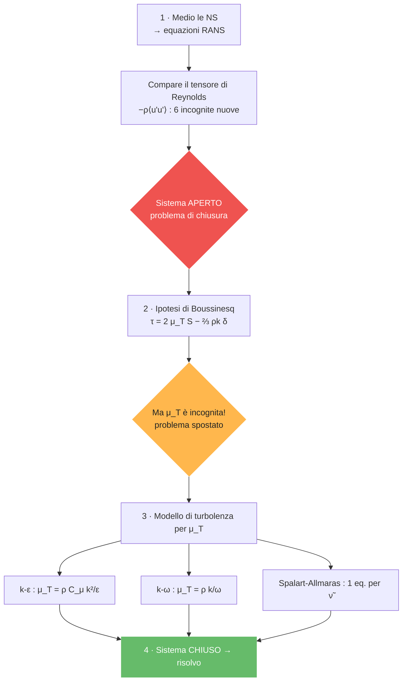
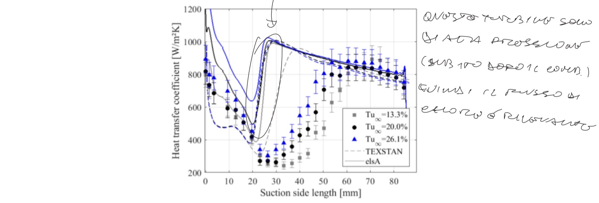
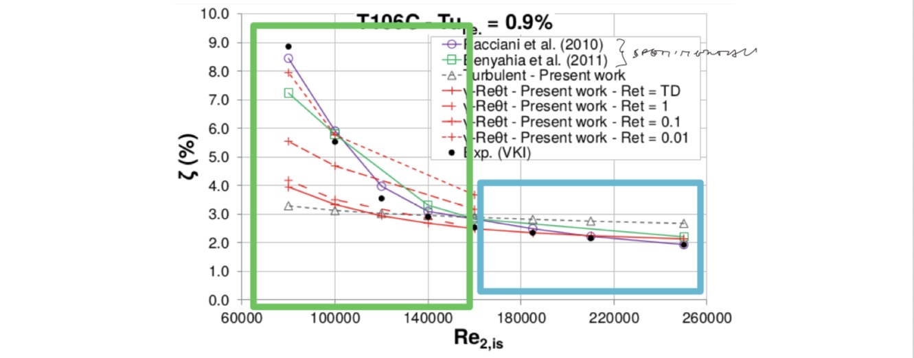
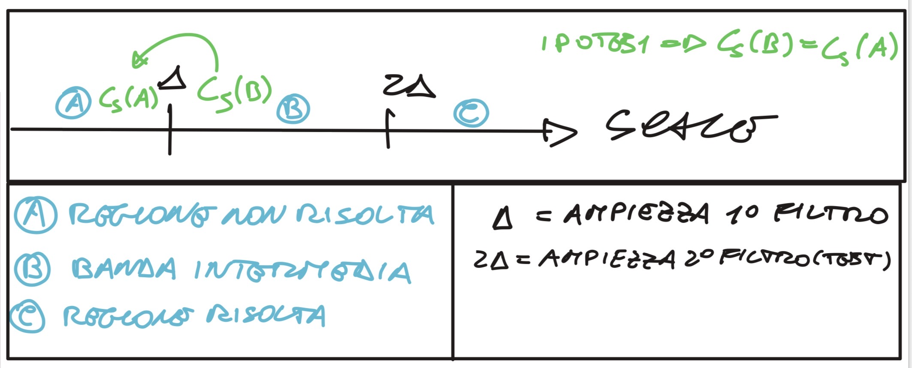

# Turbolenza

## Nomenclatura essenziale

| Simbolo | Nome | Note |
|---|---|---|
| $\overline{(\cdot)},\ \bar f$ | **media** (di Reynolds) / filtraggio (LES) | RANS media, LES filtra |
| $(\cdot)'$ | **fluttuazione** turbolenta | $u=\bar u+u'$, $\overline{u'}=0$ |
| $\overline{u_i'u_j'}$ | **sforzi di Reynolds** | $\neq0$: chiusura RANS |
| $k$ | energia cinetica turbolenta | $k=\tfrac12\overline{u_i'u_i'}$ |
| $\epsilon$ | dissipazione di $k$ | modello $k$–$\epsilon$ |
| $\omega$ | dissipazione specifica | modello $k$–$\omega$ (SST) |
| $\mu_T,\ \nu_{sgs}$ | viscosità **turbolenta** / di sotto-griglia | Boussinesq; LES (SGS) |
| $\bar S_{ij},\ \lvert\bar S\rvert$ | tensore velocità di deformazione filtrato | $\nu_{sgs}=(C_s\Delta)^2\lvert\bar S\rvert$ |
| $C_s$ | costante di **Smagorinsky** | modello SGS |
| $\Delta,\ \widehat{\Delta}$ | larghezza del **filtro** / *test filter* | LES; $\widehat{(\cdot)}$ = test filter |
| $L_{ij},\ T_{ij}$ | tensori di Leonard / Germano | modello **dinamico** |
| $\tau_{ij},\ \tau_{ij}^s$ | sforzi (Reynolds / SGS) | — |
| $d,\ C_{DES}\Delta$ | distanza da parete / scala DES | switch RANS↔LES (DES), $f_d$ shielding |
| $\gamma\text{–}Re_\theta$ | modello di **transizione** | intermittenza |

---

---

## Teoria di base e derivazione RANS

<strong>Covarianza tra le fluttuazioni e interpretazione fisica</strong>

**1. Media delle fluttuazioni ($\overline{u'}$)**

- **Matematicamente:** è sempre **zero** per costruzione ($\overline{u'} = 0$). Se prendi tutti gli scarti rispetto alla media e li sommi, i "più" e i "meno" si cancellano esattamente.
- **Fisicamente:** rappresenta il "rumore" puramente casuale che non sposta il valore medio nel lungo periodo. È come oscillare avanti e indietro sulla stessa sedia: ti muovi, ma la tua posizione media non cambia.

**2. Prodotto delle medie ($\bar{u}_i \bar{u}_j$)**

- **Matematicamente:** è il prodotto dei valori costanti (o mediati nel tempo).
- **Fisicamente:** rappresenta il **trasporto di quantità di moto del campo medio**. È il movimento "organizzato" del fluido, quello che vedresti in un flusso perfettamente laminare e liscio.

**3. Media del prodotto ($\overline{u_i u_j}$)**

- **Matematicamente:** è la media del segnale totale "sporco".
- **Fisicamente:** è il **trasporto totale effettivo** di quantità di moto. Include sia il movimento ordinato che quello caotico dovuto ai vortici.

**4. La covarianza ($\overline{u_i' u_j'}$)**

Matematicamente definita come $\overline{u_i u_j} - \bar{u}_i \bar{u}_j$, in fisica della turbolenza è il cuore del **tensore di Reynolds**.

| Scenario | Significato matematico | Significato fisico |
| --- | --- | --- |
| **Variabili scorrelate** | La covarianza è **zero**. La media del prodotto è uguale al prodotto delle medie ($\overline{u_i u_j} = \bar{u}_i \bar{u}_j$). | Le fluttuazioni in una direzione non influenzano l'altra. Il fluido è caotico ma "disorganizzato", non c'è un trasporto netto di quantità di moto extra dovuto ai vortici. |
| **Variabili correlate** | La covarianza è **diversa da zero**. Il prodotto delle fluttuazioni "sopravvive" alla media ($\overline{u_i' u_j'} \neq 0$). | **C'è turbolenza attiva.** I vortici spostano masse di fluido in modo coerente. Ad esempio, un guizzo verso l'alto ($v' > 0$) trasporta con sé fluido più lento ($u' < 0$). Questo crea uno "sforzo" che frena il campo medio. |

**Cos'è la covarianza (in generale)**

In statistica, la **covarianza** è una misura di quanto due variabili casuali varino insieme. Se hai due variabili $X$ e $Y$, la covarianza indica se al crescere di una l'altra tende a crescere (covarianza positiva), a decrescere (covarianza negativa) o se non c'è alcuna relazione lineare (covarianza zero).

Matematicamente è definita come il valore atteso (o media) del prodotto degli scarti:

$$Cov(X,Y) = E\big[(X-\bar X)(Y-\bar Y)\big] = E[XY] - E[X]\,E[Y]$$

(In fluidodinamica, l'operatore media $\overline{(\cdot)}$ sostituisce il valore atteso $E[\cdot]$.)

**Perché nella turbolenza non è nulla e i termini non coincidono?**

Dire che la covarianza non è nulla significa dire che i due termini $\overline{u_i u_j}$ e $\bar{u}_i \bar{u}_j$ **non coincidono**. Ecco il motivo fisico e matematico:

- **Il motivo matematico — le fluttuazioni non sono indipendenti.** Se le fluttuazioni $u_i'$ e $u_j'$ fossero indipendenti (come il risultato del lancio di due dadi diversi), la loro media del prodotto sarebbe zero. Ma nella turbolenza le fluttuazioni sono **correlate**. Immagina un fluido che scorre vicino a una parete: se una particella riceve una spinta verso l'alto ($v' > 0$), essa proviene da una zona vicina al muro dove il fluido è più lento. Di conseguenza, quella particella avrà probabilmente una velocità orizzontale inferiore alla media della zona in cui arriva ($u' < 0$). Poiché $u'$ e $v'$ tendono a presentarsi "a coppie" con segni legati, il loro prodotto $u' \cdot v'$ non sarà mediamente zero.
- **Il motivo fisico — il trasporto turbolento.** Se $\overline{u_i u_j}$ e $\bar{u}_i \bar{u}_j$ coincidessero, vorrebbe dire che la turbolenza non ha alcun effetto sul movimento globale del fluido. Invece, la differenza tra i due termini è proprio il **tensore degli sforzi di Reynolds**.

**In sintesi:** non coincidono perché la turbolenza è un fenomeno "organizzato" in vortici; i vortici creano una struttura nelle fluttuazioni tale per cui queste non si annullano a vicenda quando vengono moltiplicate tra loro.

<strong>Calcolo viscosità turbolenta</strong>

| Modello | Descrizione | Pro | Contro | Casi applicativi |
| --- | --- | --- | --- | --- |
| **Algebrici** (es. Baldwin-Lomax) | Modelli a "zero equazioni". Calcolano $\mu_T$ basandosi su profili di velocità e lunghezze di rimescolamento locali senza equazioni differenziali aggiuntive. | Estremamente veloci, robusti e con costo computazionale quasi nullo. | Non tengono conto del trasporto della turbolenza (storia del flusso); falliscono in presenza di separazione. | Flussi semplici, strati limite attaccati, profili alari in condizioni di crociera lineare. |
| **1 eq. trasporto** (es. Spalart-Allmaras) | Risolve una singola equazione differenziale di trasporto per una variabile direttamente legata alla viscosità turbolenta. | Ottimo compromesso tra velocità e precisione; molto più accurato degli algebrici per l'aerodinamica. | Non è un modello universale; limitato in flussi con geometrie interne molto complesse. | Standard nel settore aerospaziale per lo studio di ali ad alto numero di Reynolds. |
| **2 eq. ($k$-$\epsilon$)** | Risolve due equazioni: una per l'energia cinetica turbolenta ($k$) e una per il tasso di dissipazione ($\epsilon$). | Molto robusto e affidabile per simulazioni in zone di fluido indisturbato (free-stream). | Poco accurato vicino alle pareti e in presenza di forti gradienti di pressione negativi. | Flussi industriali generici, scambiatori di calore, flussi in condotti lontani dalle pareti. |
| **2 eq. ($k$-$\omega$)** | Risolve due equazioni per $k$ e la frequenza specifica di dissipazione ($\omega$). | Eccellente accuratezza nella regione del sotto-strato viscoso vicino alle pareti. | Estremamente sensibile ai valori impostati per il fluido esterno (condizioni al contorno). | Flussi interni, strati limite dove la fisica a parete è l'aspetto critico del calcolo. |
| **2 eq. (SST Menter)** | Modello "Shear Stress Transport". Usa funzioni di *blending* per usare $k$-$\omega$ a parete e $k$-$\epsilon$ lontano da essa. | Combina i punti di forza di entrambi i modelli, eliminando le rispettive debolezze. | Leggermente più oneroso e complesso da calibrare rispetto ai modelli standard a 2 eq. | Attuale standard industriale per flussi con separazione, stalli e gradienti di pressione avversi. |
| **RSM** (Reynolds Stress Models) | Abbandona l'ipotesi di Boussinesq e risolve 7 equazioni differenziali (una per ogni componente del tensore di Reynolds). | Gestisce l'anisotropia della turbolenza; ottimo per flussi con forti curvature o rotazioni. | Molto costoso computazionalmente; difficile da far convergere numericamente. | Cicloni, flussi rotanti, curve strette in condotti, motori a combustione interna. |

<strong>Confronto DNS / LES / RANS</strong>

Le tre famiglie di approcci alla simulazione CFD di flussi turbolenti differiscono per il trattamento delle scale di turbolenza: quale parte dello spettro viene risolta direttamente e quale viene modellata.

### DNS — Direct Numerical Simulation

- Risolve *tutte* le scale
- Griglia: $N \propto Re^{3/4}$ per dimensione
- Costo: $\propto Re^3$
- Nessuna modellazione
- Solo ricerca / $Re$ bassi

### LES — Large Eddy Simulation

- Risolve scale grandi
- Modella scale piccole (SGS)
- Costo intermedio
- Filtraggio spaziale
- Buon compromesso

### RANS — Reynolds-Averaged NS

- Risolve solo il campo medio
- Modella *tutta* la turbolenza
- Costo minimo
- Chiusura necessaria
- Uso industriale

> ⚠️ **Costo computazionale DNS.** Il numero di punti griglia per dimensione scala come $N \propto Re^{3/4}$, quindi in 3D il numero totale di celle è $N_{tot} \propto Re^{9/4}$. Tenendo conto del passo temporale (anch'esso proporzionale alla scala di Kolmogorov), il costo complessivo scala come $\text{Costo} \propto Re^3$. Per $Re = 10^6$ (flusso esterno aeronautico tipico), il costo è proibitivo.

> 💡 **Universalità delle piccole scale.** Kolmogorov (1941) ipotizzò che le piccole scale di turbolenza — dette scale di Kolmogorov $\eta, \tau_\eta, u_\eta$ — siano **universali**: dipendono solo dalla viscosità cinematica $\nu$ e dalla dissipazione $\varepsilon$, indipendentemente dalla geometria e dalle condizioni al contorno. È la risposta alla domanda 1 del professore.

<strong>Tipi di media e operatore di media</strong>

### Media temporale

Usata per flussi statisticamente stazionari. Si calcola come limite dell'integrale temporale su un intervallo $T \to \infty$:

$$\bar{u}_i(\mathbf{x}) = \lim_{T \to \infty} \frac{1}{T} \int_t^{t+T} u_i(\mathbf{x}, t')\, dt'$$

### Media spaziale (d'insieme)

Usata per flussi con turbolenza omogenea (invariante per traslazione spaziale):

$$\bar{u}(t) = \lim_{\Omega \to \infty} \frac{1}{\Omega} \int_\Omega u(\mathbf{x}, t)\, d\Omega$$

### Media di Favre (compressibile)

Per flussi compressibili, la media standard di Reynolds crea accoppiamenti tra l'equazione di continuità e quella di quantità di moto. La **media di Favre** è una media pesata sulla densità:

$$\tilde{u}_i(\mathbf{x}) = \frac{\overline{\rho\, u_i}}{\bar{\rho}} = \frac{1}{\bar{\rho}} \lim_{T\to\infty} \frac{1}{T}\int_t^{t+T} \rho(\mathbf{x},t')\, u_i(\mathbf{x},t')\, dt'$$

> ⚠️ **Risposta alla domanda 6 — Perché la pressione non è mediata con Favre?** Nella media di Favre si usa la ponderazione per densità per *semplificare* l'equazione di continuità e di quantità di moto compressibile. La pressione **non** viene mediata con Favre ma con la media di Reynolds ordinaria ($\bar{p}$), perché la pressione è già un termine scalare che compare linearmente: ponderarla per $\rho$ introdurrebbe correlazioni aggiuntive senza vantaggio. In pratica, si sceglie quale variabile mediare con Favre in base a dove la semplificazione algebrica è massima.

<strong>Decomposizione di Reynolds</strong>

Qualunque variabile $q$ si decompone in media + fluttuazione:

$$u_i(\mathbf{x},t) = \bar{u}_i(\mathbf{x}) + u_i'(\mathbf{x},t)$$

Per definizione: $\overline{u_i'} = 0$ (la media della fluttuazione è nulla).

> ⚠️ **Risposta alla domanda 3 — La media delle fluttuazioni è sempre nulla?** La proprietà $\overline{u'} = 0$ vale **per costruzione**, indipendentemente dalla stazionarietà statistica, purché la media sia definita coerentemente. Tuttavia, per la media temporale, il limite $T\to\infty$ deve essere ben definito, e ciò richiede che il processo sia *ergodico* (la media temporale su un singolo campione = media d'insieme). Questo è garantito dalla stazionarietà statistica, ma non è strettamente necessario se si usa la media d'insieme.

Decomposizione di Reynolds: il segnale totale $u(t)$ (viola) = media temporale costante $\bar u(x)$ (azzurro) + fluttuazione $u'$ (verde).

<strong>Proprietà dell'operatore di media</strong>

📘 **Proprietà fondamentali (media di Reynolds)**

| Proprietà | Espressione | Nota |
| --- | --- | --- |
| Idempotenza | $\bar{\bar{u}} = \bar{u}$ | La media di una media è la media |
| Media della fluttuazione | $\overline{u'} = 0$ | Per costruzione |
| Linearità | $\overline{au+bv} = a\bar{u}+b\bar{v}$ | Sempre valida |
| Commutazione con $\partial$ | $\overline{\partial u/\partial x_i} = \partial\bar{u}/\partial x_i$ | Condizione da verificare |
| Media del prodotto | $\overline{uv} = \bar{u}\bar{v} + \overline{u'v'}$ | Non lineare! |

> ⚠️ **Risposta alla domanda 5 — Quando commutano media e derivate?** Matematicamente, la commutazione $\overline{\partial u/\partial x_i} = \partial\bar{u}/\partial x_i$ è valida se:
> - la media è un'operazione lineare con limiti di integrazione *costanti* (non dipendenti dalla variabile di derivazione);
> - per la media temporale: i limiti di integrazione $[t, t+T]$ non dipendono da $\mathbf{x}$ → commuta con $\partial/\partial x_i$;
> - per la media spaziale su dominio fisso: commuta con $\partial/\partial t$;
> - **non commuta** con $\partial/\partial t$ se si usa la media temporale e il campo è non stazionario (caso URANS).
>
> Fisicamente: la commutazione è valida quando l'operazione di media non "vede" variazioni nella direzione di derivazione — cioè quando la separazione di scale tra le fluttuazioni e il campo medio è netta.

### Prodotto di due fluttuazioni sinusoidali

Il professore ha enfatizzato questo punto cruciale: il prodotto di due fluttuazioni **non ha media nulla**.

$$u' = A\sin(\omega t) \quad \Rightarrow \quad \overline{(u')^2} = \overline{A^2\sin^2(\omega t)} = \frac{A^2}{2} \neq 0$$

> ✅ **Teorema chiave.** $\overline{u'} = 0$ ma $\overline{u'^2} \neq 0$ in generale. È proprio questo termine che genera il tensore di Reynolds nelle equazioni mediate.

<strong>Derivazione RANS incompressibili</strong>

### Punto di partenza: equazioni NS incompressibili

$$\frac{\partial u_i}{\partial x_i} = 0 \qquad (\text{continuità})$$

$$\rho\frac{\partial u_i}{\partial t} + \rho u_j \frac{\partial u_i}{\partial x_j} = -\frac{\partial p}{\partial x_i} + \frac{\partial \tau_{ij}}{\partial x_j}$$

### Applicazione della decomposizione di Reynolds

Si sostituisce $u_i = \bar{u}_i + u_i'$ e $p = \bar{p} + p'$ e si applica l'operatore di media.

<strong>Passaggi dettagliati della derivazione</strong>

**Step 1 — Continuità:**

$$\frac{\partial(\bar{u}_i + u_i')}{\partial x_i} = 0 \quad\Rightarrow\quad \frac{\partial\bar{u}_i}{\partial x_i} + \underbrace{\frac{\partial u_i'}{\partial x_i}}_{=\,0} = 0$$

**Step 2 — Termine non lineare $\rho u_j \partial u_i/\partial x_j$:**

Il termine convettivo si espande e si media. Usando la linearità e le proprietà $A, B, C, D$ del professore:

$$\overline{u_j \frac{\partial u_i}{\partial x_j}} = \underbrace{\bar{u}_j \frac{\partial\bar{u}_i}{\partial x_j}}_{A} + \underbrace{\overline{u_j'\frac{\partial u_i'}{\partial x_j}}}_{B\neq 0}$$

Il termine $B$ si riscrive usando la divergenza di fluttuazione nulla:

$$\overline{u_j'\frac{\partial u_i'}{\partial x_j}} = \frac{\partial}{\partial x_j}\overline{u_i' u_j'}$$

**Step 3 — Equazione RANS risultante:**

$$\rho\frac{\partial\bar{u}_i}{\partial t} + \rho\bar{u}_j\frac{\partial\bar{u}_i}{\partial x_j} = -\frac{\partial\bar{p}}{\partial x_i} + \frac{\partial}{\partial x_j}\left(\bar{\tau}_{ij} - \rho\overline{u_i'u_j'}\right)$$

> ✅ **Equazione RANS — forma finale**
>
> $$\rho\frac{\partial\bar{u}_i}{\partial t} + \rho\bar{u}_j\frac{\partial\bar{u}_i}{\partial x_j} = -\frac{\partial\bar{p}}{\partial x_i} + \frac{\partial}{\partial x_j}\underbrace{\left(\bar{\tau}_{ij} - \rho\overline{u_i'u_j'}\right)}_{\text{sforzo viscoso + sforzo di Reynolds}}$$
>
> Il termine $-\rho\overline{u_i'u_j'}$ è il tensore di Reynolds: le fluttuazioni si comportano come uno sforzo aggiuntivo.

### RANS vs URANS

📘 **Risposta alla domanda 4 — URANS**

| Metodo | Media usata | Informazione temporale | Uso tipico |
| --- | --- | --- | --- |
| **RANS** | Temporale $T\to\infty$ | Persa completamente | Flussi stazionari in media |
| **URANS** | Media su $T_{avg}$ piccolo rispetto alla fluttuazione lenta ma grande rispetto alla turbolenza | Conservata per le variazioni lente | Flussi con instazionarietà coerente (es. vortex shedding) |

Le URANS usano una media su un intervallo $T_{avg}$ tale che $\tau_{turb} \ll T_{avg} \ll \tau_{slow}$. In questo modo si filtrano le fluttuazioni turbolente ma si mantiene la variazione lenta del campo medio nel tempo.

<strong>RANS compressibili: quali sono i termini aggiuntivi (e dove)</strong>

Della derivazione compressibile **non serve ricordare tutti i passaggi**: la relazione finale è quasi identica alle RANS incompressibili, basta sostituire la media di Reynolds con la **media di Favre** $\tilde{(\cdot)}=\overline{\rho(\cdot)}/\bar\rho$ e far comparire la densità media $\bar\rho$. Le equazioni mediate alla Favre sono:

$$\frac{\partial\bar\rho}{\partial t}+\frac{\partial(\bar\rho\tilde u_i)}{\partial x_i}=0$$

$$\frac{\partial(\bar\rho\tilde u_i)}{\partial t}+\frac{\partial(\bar\rho\tilde u_i\tilde u_j)}{\partial x_j}=-\frac{\partial\bar p}{\partial x_i}+\frac{\partial\bar\tau_{ij}}{\partial x_j}\underbrace{-\frac{\partial}{\partial x_j}\big(\bar\rho\,\widetilde{u_i''u_j''}\big)}_{\text{sforzi di Reynolds (Favre)}}$$

La struttura è la stessa dell'incompressibile; gli unici termini realmente "nuovi" sono le correlazioni di Favre. La tabella riassume **dove** vengono aggiunti e **cosa** rappresentano:

| Termine aggiuntivo | In quale bilancio | Espressione | Contributo fisico |
| --- | --- | --- | --- |
| **(nessuno!)** | **Massa / continuità** | $\partial_t\bar\rho+\partial_i(\bar\rho\tilde u_i)=0$ | È proprio il **motivo per cui si usa Favre**: la continuità mediata resta **formalmente identica** a quella istantanea, senza correlazioni. Con la media di Reynolds ordinaria comparirebbe invece il termine $\partial_i\overline{\rho'u_i'}$. |
| **Sforzi di Reynolds (Favre)** | **Quantità di moto** | $-\partial_j\big(\bar\rho\,\widetilde{u_i''u_j''}\big)$ | Trasporto di quantità di moto dovuto alle fluttuazioni turbolente (analogo all'incompressibile, ma pesato sulla densità). È il termine da chiudere con un modello. |
| **Flusso di calore turbolento** | **Energia** | $-\partial_j\big(\bar\rho\,\widetilde{u_j''h''}\big)$ | Trasporto turbolento di entalpia/energia: i vortici trasportano calore in aggiunta alla conduzione molecolare. |
| **Diffusione / lavoro turbolento** | **Energia** | termini tipo $\overline{u_i''\tau_{ij}}$, $\overline{u_j''p'}$ | Lavoro e diffusione delle fluttuazioni (scambio tra energia media e turbolenta); spesso raccolti nel trasporto di $\bar\rho k$. |
| **Dissipazione di dilatazione $Y_M$** | **Energia / eq. di $k$** | $Y_M=2\bar\rho\varepsilon M_t^2,\ \ M_t=\sqrt{2k}/a$ | Dissipazione aggiuntiva dovuta alla **comprimibilità** (Mach turbolento): conta solo in flussi molto comprimibili (getti supersonici, urti). |

> 💡 In sintesi: **massa → nessun termine extra** (è il vantaggio di Favre), **quantità di moto → sforzi di Reynolds di Favre**, **energia → flussi turbolenti di calore + termini di lavoro/diffusione + correzioni di comprimibilità**.

<strong>Tensore di Reynolds e energia cinetica turbolenta</strong>

### Tensore di Reynolds

$$\mathbf{R} = -\rho\overline{u_i'u_j'} = -\rho\begin{pmatrix} \overline{u_1'^2} & \overline{u_1'u_2'} & \overline{u_1'u_3'} \\ \overline{u_2'u_1'} & \overline{u_2'^2} & \overline{u_2'u_3'} \\ \overline{u_3'u_1'} & \overline{u_3'u_2'} & \overline{u_3'^2} \end{pmatrix}$$

> 💡 **Struttura del tensore.** Il tensore è simmetrico ($\overline{u_i'u_j'} = \overline{u_j'u_i'}$), quindi ha solo **6 componenti indipendenti**. Queste 6 incognite non possono essere ricavate dalle sole equazioni RANS (il sistema è aperto): servono modelli di chiusura.

### Dal tensore di Reynolds all'energia cinetica turbolenta (colmare il "gap")

Nelle RANS il tensore di Reynolds è l'incognita da chiudere, ma è comodo riassumere l'**intensità globale** della turbolenza con un **singolo scalare**: l'energia cinetica turbolenta $k$. Non c'è un vero salto concettuale — $k$ è semplicemente l'**energia cinetica (per unità di massa) del campo di fluttuazione**, mediata:

$$k = \frac{1}{2}\overline{u_i'u_i'} = \frac{1}{2}\left(\overline{u_1'^2} + \overline{u_2'^2} + \overline{u_3'^2}\right)$$

Cioè $k$ è **metà della somma dei termini diagonali** della matrice $\overline{u_i'u_j'}$:

$$\overline{u_i'u_j'}=\begin{pmatrix}\overline{u_1'^2}&\overline{u_1'u_2'}&\overline{u_1'u_3'}\\ \overline{u_2'u_1'}&\overline{u_2'^2}&\overline{u_2'u_3'}\\ \overline{u_3'u_1'}&\overline{u_3'u_2'}&\overline{u_3'^2}\end{pmatrix}\ \Rightarrow\ \text{tr}=\overline{u_1'^2}+\overline{u_2'^2}+\overline{u_3'^2}=2k$$

Poiché il tensore di Reynolds è $\mathbf{R}=-\rho\overline{u_i'u_j'}$, la sua traccia vale $\text{tr}(\mathbf{R})=-\rho\,\overline{u_i'u_i'}=-2\rho k$, da cui la riscrittura di $k$ **in funzione del tensore di Reynolds**:

$$\boxed{\,k = -\frac{1}{2\rho}\,\text{tr}(\mathbf{R})\,}$$

È (a meno del fattore $-1/2\rho$) la traccia del tensore di Reynolds.

### Scale di Kolmogorov

$$\eta = \left(\frac{\nu^3}{\varepsilon}\right)^{1/4} \qquad \tau_\eta = \left(\frac{\nu}{\varepsilon}\right)^{1/2} \qquad u_\eta = (\nu\varepsilon)^{1/4}$$

> 💡 **Risposta alla domanda 1 — Universalità delle piccole scale.** Le scale di Kolmogorov $\eta, \tau_\eta, u_\eta$ dipendono solo da $\nu$ (proprietà del fluido) e $\varepsilon$ (tasso di dissipazione). La *dissipazione* è determinata dalle grandi scale (che impongono la quantità di energia da smaltire), ma le *piccole scale* si adattano per dissipare quella energia. Per questo la loro struttura è **universale**: non dipende dalla geometria, dalle condizioni al contorno o dal numero di Reynolds. Dipendono solo dall'ambiente (il fluido, $\nu$) e dalla domanda di energia (la cascata, $\varepsilon$).

<strong>Parte isotropa e anisotropa del tensore di Reynolds: come si riconoscono</strong>

Qualunque tensore simmetrico del secondo ordine $T_{ij}$ si decompone in modo **unico** in:

$$T_{ij} = \underbrace{\frac{1}{3}T_{kk}\,\delta_{ij}}_{\text{isotropo}} + \underbrace{\Big(T_{ij}-\frac{1}{3}T_{kk}\,\delta_{ij}\Big)}_{\text{anisotropo (deviatorico)}}$$

dove $T_{kk}=T_{11}+T_{22}+T_{33}$ è la **traccia**.

**Come si riconoscono in pratica:**

1. **Calcola la traccia** $T_{kk}$ (somma della diagonale).
2. **Parte isotropa** $=\frac13 T_{kk}\,\delta_{ij}$: è il tensore proporzionale all'identità → **stesso valore su tutta la diagonale, zero fuori diagonale**. Agisce ugualmente in tutte le direzioni (come una pressione).
3. **Parte anisotropa** $=$ ciò che resta: ha **traccia nulla** per costruzione e contiene gli sforzi di taglio (fuori diagonale) e gli squilibri tra le componenti normali.

**Criterio rapido:** un tensore è *puramente isotropo* se e solo se ha la forma $c\,\delta_{ij}$ (diagonale uguale, fuori diagonale nulla). Ogni deviazione (diagonale non uniforme oppure termini fuori diagonale) è *anisotropa*.

**Applicato al tensore di Reynolds** $-\rho\overline{u_i'u_j'}$: la traccia vale $-\rho\,\overline{u_i'u_i'}=-2\rho k$, quindi

$$-\rho\overline{u_i'u_j'} = \underbrace{-\frac{2}{3}\rho k\,\delta_{ij}}_{\text{isotropa}\ \to\ \text{pressione}} + \underbrace{\Big(-\rho\overline{u_i'u_j'}+\frac{2}{3}\rho k\,\delta_{ij}\Big)}_{\text{anisotropa}\ \to\ \text{da modellare}}$$

- La **parte isotropa** $-\tfrac23\rho k\,\delta_{ij}$ porta **tutta la traccia** (cioè tutta l'energia $k$) ed è una pressione turbolenta: viene **assorbita nella pressione modificata** $\bar p^*=\bar p+\tfrac23\rho k$ e non si modella esplicitamente.
- La **parte anisotropa** (deviatorica, traccia nulla) è l'unica responsabile del **trasporto netto di quantità di moto**: è quella che l'ipotesi di Boussinesq lega a $\bar S_{ij}$ tramite $2\mu_T\bar S_{ij}$. Ecco perché nell'ipotesi di Boussinesq compaiono proprio i due pezzi: $\tau^R_{ij}=2\mu_T S_{ij}-\tfrac23\rho k\,\delta_{ij}$.

<strong>Modelli di chiusura e ipotesi di Boussinesq</strong>

### Ipotesi di Boussinesq (viscosità turbolenta)

📘 **Definizione.** Il tensore di Reynolds viene modellato analogamente allo sforzo viscoso laminare:

$$\tau_{ij}^R = -\rho\overline{u_i'u_j'} = 2\mu_T S_{ij} - \frac{2}{3}\rho k\,\delta_{ij}$$

dove $S_{ij} = \frac{1}{2}\left(\frac{\partial\bar{u}_i}{\partial x_j} + \frac{\partial\bar{u}_j}{\partial x_i}\right)$ è il tensore della velocità di deformazione del campo medio e $\mu_T$ è la viscosità turbolenta (o eddy viscosity).

> ⚠️ **Limite dell'ipotesi di Boussinesq.** Boussinesq assume che il tensore di Reynolds sia *allineato* con il tensore di deformazione del campo medio (come in un fluido Newtoniano). Questo è un'approssimazione: in realtà il tensore di Reynolds ha la propria dinamica (equazioni di trasporto). Il modello fallisce in flussi con forti curvature delle linee di flusso, separazione e rotazione.

### Tabella dei modelli di chiusura

| Modello | Tipo | Equazioni aggiuntive | Pro | Contro |
| --- | --- | --- | --- | --- |
| **Mixing Length** (Prandtl) | Algebrico | 0 (Baldwin-Lomax) | Semplice, robusto | Non trasportabile, fallisce con separazione |
| **$k$-$\varepsilon$** | 2 equazioni diff. | Trasporto $k$ e $\varepsilon$ | Buono nel free-stream | Fallisce con gradienti di pressione avversi |
| **$k$-$\omega$** | 2 equazioni diff. | Trasporto $k$ e $\omega$ | Ottimo vicino a parete | Sensibile alle condizioni al contorno esterne |
| **$k$-$\omega$ SST** (Menter) | 2 equazioni diff. | Blending $k$-$\varepsilon$ e $k$-$\omega$ | Unisce i vantaggi di entrambi | Più complesso da calibrare |
| **RSM** | 7 equazioni diff. | Trasporto per ogni $\overline{u_i'u_j'}$ | Nessuna ipotesi di isotropia | Costoso, difficile convergenza |

<strong>📐 Risposta alla domanda 2 — Perché costo DNS ∝ Re³?</strong>

**Separazione di scale.** La scala più grande è $L$ (scala integrale), quella più piccola è $\eta$ (scala di Kolmogorov). Il rapporto tra le due scala come:

$$\frac{L}{\eta} \propto Re_L^{3/4}$$

Per risolvere entrambe in 3D, il numero totale di celle è:

$$N_{celle} \propto \left(\frac{L}{\eta}\right)^3 \propto Re_L^{9/4}$$

Il passo temporale deve risolvere il tempo di vita dei vortici di Kolmogorov $\tau_\eta \propto Re^{-1/2}$ rispetto al tempo convettivo $T_{conv}$:

$$N_{timestep} \propto \frac{T_{conv}}{\tau_\eta} \propto Re_L^{1/2}$$

Il costo totale quindi scala come:

$$\text{Costo} \propto N_{celle} \times N_{timestep} \propto Re^{9/4} \cdot Re^{3/4} = Re^3$$

Nota: in letteratura si trovano esponenti leggermente diversi (es. $Re^{11/4}$) a seconda delle assunzioni, ma la stima $Re^3$ è quella comunemente usata a lezione.

## Modelli di turbolenza RANS

<strong>Schema della procedura generale di chiusura RANS</strong>

L'intera logica dei modelli RANS è una **catena**: ogni passo risolve un problema ma ne introduce uno nuovo, finché un modello ausiliario lo chiude.

**In parole:**

1. **Scrivo le RANS** mediando Navier-Stokes → spunta il tensore di Reynolds (6 incognite in più delle equazioni disponibili → sistema aperto).
2. **Modello il tensore di Reynolds** con l'**ipotesi di Boussinesq**, che lo lega al gradiente del campo medio tramite una **viscosità turbolenta** $\mu_T$.
3. **Ma $\mu_T$ non la conosco:** il problema non è risolto, è solo *spostato*. La calcolo con un **modello di turbolenza** ($k$-$\varepsilon$, $k$-$\omega$, SST, Spalart-Allmaras...), che aggiunge una o due equazioni di trasporto.
4. **Sistema chiuso** → risolvo numericamente.

> ⚠️ Ogni livello introduce nuove costanti empiriche e nuove ipotesi: la "chiusura" non è mai esatta, è un compromesso calibrato.

<strong>Modello k-ε: le due equazioni di trasporto e il significato di ogni termine</strong>

Il modello $k$-$\varepsilon$ (famiglia di modelli a **2 equazioni**) risolve due equazioni di trasporto **strutturalmente identiche**: cambia solo la variabile trasportata ($k$ oppure $\varepsilon$). La forma è quella tipica delle **leggi di conservazione**.

**Equazione per $k$** (energia cinetica turbolenta):

$$\frac{\partial(\bar\rho k)}{\partial t}+\frac{\partial(\bar\rho\tilde u_i k)}{\partial x_i}=\frac{\partial}{\partial x_j}\!\left[\left(\mu+\frac{\mu_T}{\sigma_k}\right)\frac{\partial k}{\partial x_j}\right]+G_k-\bar\rho\varepsilon+Y_M$$

**Equazione per $\varepsilon$** (tasso di dissipazione):

$$\frac{\partial(\bar\rho\varepsilon)}{\partial t}+\frac{\partial(\bar\rho\tilde u_i\varepsilon)}{\partial x_i}=\frac{\partial}{\partial x_j}\!\left[\left(\mu+\frac{\mu_T}{\sigma_\varepsilon}\right)\frac{\partial\varepsilon}{\partial x_j}\right]+C_{1\varepsilon}\frac{\varepsilon}{k}G_k-C_{2\varepsilon}\bar\rho\frac{\varepsilon^2}{k}$$

Hai ragione: il **lato sinistro** è analogo alle leggi di conservazione (derivata temporale + convezione), e i due trasporti differiscono solo per la variabile e i termini sorgente.

| Termine | Formula (eq. di $k$) | Nome / tipo | Significato fisico ed effetto |
| --- | --- | --- | --- |
| **Variazione temporale** | $\partial(\bar\rho k)/\partial t$ | non stazionario | Accumulo/decadimento locale di $k$ nel tempo. Nullo a regime stazionario. |
| **Convettivo** | $\partial(\bar\rho\tilde u_i k)/\partial x_i$ | trasporto convettivo (**flusso**) | **Sì, è corretto parlare di flusso:** in forma conservativa è la divergenza del flusso convettivo $\bar\rho\tilde u_i k$, cioè $k$ trasportata dal campo medio attraverso le facce della cella. |
| **Diffusivo** | $\partial_j[(\mu+\mu_T/\sigma_k)\,\partial_j k]$ | diffusione (divergenza di un gradiente) | **Stessa struttura** del termine viscoso/diffusivo nelle leggi di bilancio classiche (Fourier per il calore, Fick per le specie, Newton per la QdM): "divergenza di un gradiente", che a coefficiente costante è un **laplaciano**. Qui la diffusività è $\mu$ (molecolare) $+\,\mu_T/\sigma_k$ (turbolenta): la turbolenza **diffonde** $k$ verso le zone a minor $k$. |
| **Produzione** $G_k$ | $G_k=\tau^F_{ij}\,\partial\tilde u_j/\partial x_i$ | sorgente (produzione) | Energia **estratta dal moto medio** e convertita in turbolenza. Grande dove i gradienti di velocità media (shear) sono intensi (strati limite, scie). Alimenta $k$. |
| **Distruzione / dissipazione** | $-\bar\rho\varepsilon$ | pozzo (distruzione) | Tasso con cui $k$ viene trasferita alle piccole scale e infine **dissipata in calore** alla scala di Kolmogorov. Sottrae $k$. |
| **Comprimibilità** $Y_M$ | $Y_M=2\bar\rho\varepsilon M_t^2$ | correzione comprimibile | Dissipazione di **dilatazione**, attiva solo in flussi molto comprimibili (Mach turbolento $M_t$ non trascurabile). |

> ⚠️ **Perché compare $Y_M$ se stiamo trattando l'incompressibile?** Perché l'equazione è scritta nella sua forma **generale (comprimibile)**, così com'è implementata nei codici CFD. Nel **caso incompressibile $Y_M=0$** (si ha $M_t\to0$): semplicemente lo si trascura. È presente per generalità, non perché serva all'incompressibile.

> 📌 **Cosa sono $\sigma_k$ e $\sigma_\varepsilon$ al denominatore del termine diffusivo?** Sono i **numeri di Prandtl turbolenti** di $k$ e $\varepsilon$: costanti empiriche adimensionali (tipicamente $\sigma_k\approx1.0$, $\sigma_\varepsilon\approx1.3$) che fissano **quanto la turbolenza diffonde $k$ (o $\varepsilon$) rispetto a quanto diffonde la quantità di moto**. La diffusività turbolenta di $k$ è infatti $\mu_T/\sigma_k$: è la stessa $\mu_T$ che agisce sulla QdM, "riscalata" da $\sigma_k$. Esattamente come il numero di Prandtl lega diffusività di quantità di moto e termica, $\sigma$ lega la diffusione turbolenta (eddy) della QdM a quella di $k$/$\varepsilon$. Un $\sigma$ più grande → quella grandezza diffonde di meno.

**Il termine di $\varepsilon$ in parallelo:** stessi termini (non stazionario, convettivo, diffusivo con $\sigma_\varepsilon$), più produzione $C_{1\varepsilon}(\varepsilon/k)G_k$ (proporzionale alla produzione di $k$) e distruzione $C_{2\varepsilon}\bar\rho\varepsilon^2/k$; $C_{1\varepsilon},C_{2\varepsilon}$ sono costanti empiriche.

> ⚠️ **Perché nel trasporto di $\varepsilon$ non c'è il termine di comprimibilità $Y_M$ (presente invece in quello di $k$)?** Perché $Y_M$ modella la **dissipazione di dilatazione**, un meccanismo che sottrae energia **direttamente a $k$** per effetto della comprimibilità: è fisicamente un **pozzo del bilancio di $k$**. La variabile $\varepsilon$ **è già** il tasso di dissipazione, e le correzioni standard di comprimibilità (Sarkar, Zeman) sono formulate come contributo al bilancio di $k$, **non** come sorgente separata nell'equazione di $\varepsilon$. L'effetto della comprimibilità arriva a $\varepsilon$ **indirettamente**, tramite l'accoppiamento con il campo di $k$ modificato (i termini $\propto\varepsilon/k\,G_k$ e $\varepsilon^2/k$), senza bisogno di un termine esplicito dedicato.

**Chiusura finale** — da $k$ ed $\varepsilon$ si costruisce per analisi dimensionale la viscosità turbolenta:

$$\mu_T=C_\mu\,\bar\rho\,\frac{k^2}{\varepsilon}\qquad\left([k]=\tfrac{m^2}{s^2},\ [\varepsilon]=\tfrac{m^2}{s^3}\right)$$

<strong>Modello k-ω: equazioni di trasporto, relazione con ε e cross-diffusion</strong>

Concettualmente analogo al $k$-$\varepsilon$: due equazioni di trasporto, una per $k$ e una per $\omega$ (frequenza di dissipazione, o **dissipazione specifica**). La relazione tra le variabili è:

$$\omega=\frac{\varepsilon}{k}$$

**Dimensionalmente:** $\varepsilon$ è una potenza per unità di massa $[m^2/s^3]$, $k$ un'energia per unità di massa $[m^2/s^2]$, quindi $\omega\sim[1/s]$ è l'**inverso di un tempo caratteristico** del decadimento dei vortici. La viscosità turbolenta è:

$$\mu_T=\frac{\bar\rho k}{\omega}$$

**Equazione per $k$:**

$$\frac{\partial(\bar\rho k)}{\partial t}+\frac{\partial(\bar\rho\tilde u_i k)}{\partial x_i}=\frac{\partial}{\partial x_j}\!\left[\left(\mu+\frac{\mu_T}{\sigma_k}\right)\frac{\partial k}{\partial x_j}\right]+G_k-\beta^*\bar\rho\,\omega k$$

**Equazione per $\omega$:**

$$\frac{\partial(\bar\rho\omega)}{\partial t}+\frac{\partial(\bar\rho\tilde u_i\omega)}{\partial x_i}=\frac{\partial}{\partial x_j}\!\left[\left(\mu+\frac{\mu_T}{\sigma_\omega}\right)\frac{\partial\omega}{\partial x_j}\right]+\frac{\alpha\,\omega}{k}G_k-\beta\bar\rho\,\omega^2+\underbrace{\bar\rho\frac{\sigma_d}{\omega}\frac{\partial k}{\partial x_j}\frac{\partial\omega}{\partial x_j}}_{\text{cross-diffusion}}$$

La struttura è identica al $k$-$\varepsilon$, con due differenze: (i) la **distruzione di $k$** è $\beta^*\bar\rho\omega k$ invece di $\bar\rho\varepsilon$ (coerente con $\varepsilon=\beta^*\omega k$); (ii) compare il **termine di cross-diffusion** nell'equazione di $\omega$.

| Termine | Formula (eq. di $k$) | Nome / tipo | Significato fisico ed effetto |
| --- | --- | --- | --- |
| **Variazione temporale** | $\partial(\bar\rho k)/\partial t$ | non stazionario | Accumulo/decadimento locale di $k$. Nullo a regime. |
| **Convettivo** | $\partial(\bar\rho\tilde u_i k)/\partial x_i$ | trasporto convettivo (flusso) | $k$ trasportata dal campo medio attraverso le facce della cella. |
| **Diffusivo** | $\partial_j[(\mu+\mu_T/\sigma_k)\,\partial_j k]$ | diffusione (divergenza di un gradiente) | Diffusione molecolare $+$ turbolenta di $k$; $\sigma_k$ è il numero di Prandtl turbolento di $k$. |
| **Produzione** $G_k$ | $G_k=\tau^F_{ij}\,\partial\tilde u_j/\partial x_i$ | sorgente | Energia estratta dal moto medio (shear) e versata nella turbolenza. |
| **Distruzione** | $-\beta^*\bar\rho\,\omega k$ | pozzo | Dissipazione di $k$; equivale a $-\bar\rho\varepsilon$ scritto con $\omega$. |

| Termine (eq. di $\omega$) | Formula | Nome / tipo | Significato |
| --- | --- | --- | --- |
| **Variazione temporale** | $\partial(\bar\rho\omega)/\partial t$ | non stazionario | Evoluzione locale di $\omega$. |
| **Convettivo** | $\partial(\bar\rho\tilde u_i\omega)/\partial x_i$ | trasporto (flusso) | $\omega$ trasportata dal campo medio. |
| **Diffusivo** | $\partial_j[(\mu+\mu_T/\sigma_\omega)\,\partial_j\omega]$ | diffusione | Diffusione di $\omega$; $\sigma_\omega$ è il Prandtl turbolento di $\omega$. |
| **Produzione** | $(\alpha\omega/k)\,G_k$ | sorgente | Produzione di $\omega$ proporzionale a quella di $k$. |
| **Distruzione** | $-\beta\bar\rho\,\omega^2$ | pozzo | Decadimento di $\omega$ (analogo a $-C_{2\varepsilon}\bar\rho\varepsilon^2/k$). |
| **Cross-diffusion** | $\bar\rho(\sigma_d/\omega)\,\partial_j k\,\partial_j\omega$ | accoppiamento $k$–$\omega$ | Vedi sotto. |

> 💡 **Significato del termine di cross-diffusion.** È un termine **proporzionale al prodotto scalare dei gradienti** $\nabla k\cdot\nabla\omega$, che accoppia i due campi. Matematicamente nasce **quando si trasforma l'equazione di $\varepsilon$ in quella di $\omega$** ponendo $\omega=\varepsilon/k$: la regola della catena fa comparire un termine $\propto\nabla k\cdot\nabla\omega$. Fisicamente, dove $k$ e $\omega$ crescono nella stessa direzione (gradienti concordi) aggiunge produzione di $\omega$. È **il termine chiave del SST**: attivandolo solo lontano dalla parete (tramite $1-F_1$) si fa comportare il $k$-$\omega$ come un $k$-$\varepsilon$ nel free-stream, **riducendone la sensibilità** al valore di $\omega$ imposto in ingresso. Nel $k$-$\omega$ standard originale era assente, ed è una delle cause della sua freestream-sensitivity.

<strong>k-ε vs k-ω: perché funzionano meglio in regioni diverse se ω = ε/k?</strong>

L'osservazione è corretta: **puntualmente** $\omega=\varepsilon/k$, quindi le due variabili sono algebricamente legate. La differenza **non sta nella definizione** delle grandezze, ma nelle **equazioni di trasporto** che esse soddisfano e nel loro **comportamento asintotico a parete**.

- **Equazioni diverse:** $\varepsilon$ e $\omega$ obbediscono a PDE con **termini sorgente, di distruzione e di diffusione diversi**; l'equazione di $\omega$ ha in più il **termine di cross-diffusion** $\propto\partial_jk\,\partial_j\omega$. Anche se $\omega=\varepsilon/k$ in un punto, il *bilancio modellato* (come $\varepsilon$ o $\omega$ vengono prodotte/distrutte/trasportate) è diverso → i campi predetti differiscono.
- **A parete:** l'equazione di $\omega$ ha un comportamento analitico pulito ($\omega\sim1/y^2$ per $y\to0$) che si **integra fino alla parete senza funzioni di smorzamento** → $k$-$\omega$ è accurato nel sottostrato viscoso e con gradienti avversi/separazione. L'equazione di $\varepsilon$ si comporta male vicino a parete (richiede *damping functions* empiriche) → $k$-$\varepsilon$ è impreciso lì.
- **Nel free-stream:** $\omega$ è **difficile da stimare in ingresso** e il $k$-$\omega$ ne è molto sensibile; $k$-$\varepsilon$ è più robusto lontano dalle pareti.

> 💡 È quindi una questione di **equazioni di trasporto e condizioni al contorno/asintotiche**, non di definizioni. Proprio per questo il modello **SST** (qui sotto) usa $k$-$\omega$ vicino a parete e $k$-$\varepsilon$ lontano, fondendoli con la funzione $F_1$.

<strong>SST (Shear Stress Transport, Menter)</strong>

Idea: il $k$-$\omega$ è migliore **vicino a parete** e in presenza di separazione, ma molto **sensibile al valore di $\omega$ imposto in ingresso** (difficile da stimare); il $k$-$\varepsilon$ è più robusto **lontano dalle pareti**. Menter ha riscritto l'equazione di $\varepsilon$ in funzione di $\omega$ (usando $\varepsilon=\omega k$) e ha introdotto una **funzione di blending $F_1$** che vale 1 a parete (→ $k$-$\omega$) e 0 lontano (→ $k$-$\varepsilon$). Tutte le costanti diventano combinazioni pesate delle due formulazioni. È oggi lo **standard industriale** per flussi con separazione e gradienti di pressione avversi.

<strong>Modello di Spalart-Allmaras (1 equazione)</strong>

Modello a **una sola equazione** di trasporto per una variabile ausiliaria $\tilde\nu$ legata (ma non coincidente) alla viscosità turbolenta. Sviluppato alla NASA per **flussi esterni aerodinamici ad alto Reynolds** (profili alari, transonico/supersonico); non pensato per basso $Re$ o transizione.

$$\frac{\partial(\bar\rho\tilde\nu)}{\partial t}+\frac{\partial(\bar\rho\tilde u_i\tilde\nu)}{\partial x_i}=\bar\rho(P-D)+\text{(diffusione)}$$

- **Produzione** $P=c_{b1}\tilde S\tilde\nu$ ($\tilde S$ = strain rate modificato).
- **Distruzione** $D=c_{w1}f_w(\tilde\nu/d)^2$ con $d$ = distanza dalla parete: progettata per **dominare a parete** ($d\to0$).

**Cosa rappresenta $\tilde\nu$?** È una **variabile di lavoro** legata, ma **non identica**, alla viscosità turbolenta cinematica $\nu_t$. Lontano dalle pareti $\tilde\nu\approx\nu_t$; vicino a parete invece differiscono, e il legame è $\nu_t=\tilde\nu\,f_{v1}$, dove $f_{v1}=\chi^3/(\chi^3+c_{v1}^3)$ con $\chi=\tilde\nu/\nu$ è una **funzione di smorzamento** che fa tendere $\nu_t$ a zero più rapidamente di $\tilde\nu$ vicino al muro. Si trasporta $\tilde\nu$ (e non direttamente $\nu_t$) perché la sua equazione ha un comportamento più semplice/quasi-lineare a parete ed è quindi numericamente più comoda; la $\nu_t$ "vera" si recupera poi algebricamente.

**Perché si impone $\tilde\nu=0$ a parete?** Sì, è legato al fatto che a parete la velocità è nulla (no-slip): di conseguenza le fluttuazioni turbolente ($u',v',w'$) sono **schiacciate e smorzate dalla viscosità molecolare**, quindi non c'è turbolenza e $\nu_t\to0$. La condizione $\tilde\nu=0$ esprime proprio "niente turbolenza al muro"; il termine di distruzione $D\propto(\tilde\nu/d)^2$ è costruito apposta per dominare quando $d\to0$ e forzare questo annullamento.

**Quanto influisce la condizione in ingresso? È sensibile come il $k$-$\omega$?** **No, molto meno.** La raccomandazione $\tilde\nu/\nu\approx3$ conta soprattutto quando si **assume lo strato limite completamente turbolento** (aerodinamica esterna): in tal caso garantisce che il flusso entri già turbolento e che il BL si sviluppi correttamente. Se invece il BL è in parte laminare, la condizione **non è critica**. La Spalart-Allmaras è anzi apprezzata proprio per la sua **robustezza** e non soffre della patologica freestream-sensitivity di $\omega$.

**Formula della viscosità turbolenta:**

$$\mu_t=\bar\rho\,\tilde\nu\,f_{v1},\qquad f_{v1}=\frac{\chi^3}{\chi^3+c_{v1}^3},\qquad \chi=\frac{\tilde\nu}{\nu}$$

**Pro:** molto più **robusto numericamente** dei modelli a 2 equazioni → larga diffusione in aerospazio. **Contro:** niente equazione per $k$, quindi nell'ipotesi di Boussinesq il termine $-\tfrac23\bar\rho k\,\delta_{ij}$ **manca** → non può garantire la realizzabilità.

<strong>Condizioni di realizzabilità dei modelli di viscosità turbolenta</strong>

### Idea di base

Un modello di turbolenza dovrebbe produrre un tensore di Reynolds **fisicamente realizzabile**, cioè che possa effettivamente provenire da un campo di velocità fluttuante reale. Matematicamente, $\overline{u_i'u_j'}$ deve essere una **matrice di covarianza valida** (semidefinita positiva). Da qui due condizioni.

### Condizione 1 — componenti diagonali

Le componenti normali (diagonale) sono **medie di un quadrato**:

$$\tau^R_{ii}=-\rho\,\overline{(u_i')^2}\le 0\qquad(\text{nessuna somma su }i)$$

Poiché $\overline{(u_i')^2}\ge0$ sempre, **ogni sforzo normale di Reynolds deve essere $\le0$** (tutti concordi, negativi o nulli).

> 🔬 **È solo una questione matematica o ha anche senso fisico?** Entrambe, ma soprattutto **fisica**. I termini diagonali $\overline{(u_i')^2}$ non sono numeri astratti: sono le **varianze** delle fluttuazioni, cioè (a meno di $\tfrac12$) l'**energia cinetica turbolenta contenuta in ciascuna componente** di velocità. $\overline{(u_1')^2}$ misura "quanto vibra" $u'$ lungo $x$. Un'energia (la media di un quadrato) **non può essere negativa**: lo sarebbe solo se ci fosse energia cinetica negativa lungo quella direzione, cosa priva di senso. Quindi $\overline{(u_i')^2}\ge0$ non è una convenzione matematica, ma il fatto fisico che ogni componente porta un'energia non negativa.

**Perché solo la diagonale?** Perché la diagonale contiene le **varianze** $\overline{(u_i')^2}$, intrinsecamente $\ge0$. I termini **fuori diagonale** sono **covarianze** $\overline{u_i'u_j'}$ ($i\ne j$): possono legittimamente essere **positive o negative** (due componenti possono correlarsi in un verso o nell'altro). Quindi il vincolo di segno ha senso solo per la diagonale; per i termini incrociati vale invece la disuguaglianza di Schwarz.

**Come si può ottenere numericamente un valore positivo (sbagliato)?** Applicando Boussinesq alla componente $\tau^F_{11}$:

$$\tau^F_{11}=2\mu_T\frac{\partial\tilde u_1}{\partial x_1}-\frac{2}{3}\mu_T\frac{\partial\tilde u_k}{\partial x_k}-\frac{2}{3}\bar\rho k$$

- il primo termine $2\mu_T\,\partial\tilde u_1/\partial x_1$ può essere **grande e positivo** in un flusso fortemente accelerato/stirato;
- il secondo cambia segno (negativo in compressione, positivo in espansione);
- il terzo $-\tfrac23\bar\rho k$ è **sempre negativo** ma può non bastare a compensare gli altri.

Se il gradiente di deformazione è abbastanza intenso, $\tau^F_{11}$ può diventare **positivo**, violando la realizzabilità (implicherebbe una varianza negativa, impossibile). Il problema è acuto nei modelli **senza $k$** (Spalart-Allmaras): manca del tutto il termine $-\tfrac23\bar\rho k$ che faceva da freno.

### Condizione 2 — disuguaglianza di Schwarz (fuori diagonale)

$$\big(\overline{u_i'u_j'}\big)^2\le\overline{(u_i')^2}\;\overline{(u_j')^2}$$

Il quadrato dello sforzo fuori diagonale deve essere $\le$ del prodotto delle due componenti diagonali corrispondenti. **Idea:** è la disuguaglianza di Cauchy-Schwarz per le covarianze, $|\mathrm{Cov}(X,Y)|\le\sigma_X\sigma_Y$, cioè il coefficiente di correlazione $|\rho_{xy}|\le1$. Anche questa va imposta esplicitamente, altrimenti alcuni modelli la violano.

**Cosa significa "non più che perfettamente correlate"?** Si definisce il **coefficiente di correlazione** tra due componenti:

$$\rho_{uv}=\frac{\overline{u'v'}}{\sqrt{\overline{u'^2}}\,\sqrt{\overline{v'^2}}}\in[-1,+1]$$

Pensando a $u'$ e $v'$ come "vettori" nello spazio delle variabili casuali, $\rho_{uv}$ è il **coseno dell'angolo** tra loro: per questo $|\rho_{uv}|\le1$ (un coseno non supera 1). I casi limite:

- $\rho=+1$: correlazione **perfetta** → $u'$ e $v'$ sono **esattamente proporzionali** ($u'=c\,v'$, stesso verso): sapere uno significa sapere l'altro;
- $\rho=-1$: anticorrelazione perfetta → $u'=-c\,v'$ (versi opposti);
- $|\rho|>1$: "**più che perfettamente correlate**", cioè "più legate che identiche" → **non ha senso**, è impossibile come un coseno $>1$.

La disuguaglianza di Schwarz $\big(\overline{u'v'}\big)^2\le\overline{u'^2}\,\overline{v'^2}$ è **esattamente** la condizione $\rho_{uv}^2\le1$. Un modello che la viola pretende $|\rho|>1$, cioè una matrice di covarianza impossibile.

**Perché una varianza negativa "lungo una direzione" è non fisica — e cosa c'entra con le velocità.**

- *Matematicamente:* la matrice $R_{ij}=\overline{u_i'u_j'}$ deve essere **semidefinita positiva**, cioè per **ogni** direzione (versore $\mathbf n$):
$$n_i\,R_{ij}\,n_j=\overline{(u_i'n_i)^2}=\overline{(\mathbf u'\!\cdot\mathbf n)^2}\ge0$$
Questo è semplicemente la **varianza della fluttuazione di velocità proiettata** lungo $\mathbf n$: è la media di un quadrato, quindi $\ge0$. Se $R$ avesse un autovalore negativo, esisterebbe una direzione $\mathbf n$ con varianza proiettata negativa → impossibile.
- *Fisicamente:* $\overline{(\mathbf u'\!\cdot\mathbf n)^2}$ è l'energia cinetica delle fluttuazioni **lungo $\mathbf n$**; negativa significherebbe energia negativa.

> 💡 **Allora l'aumento di una velocità non può implicare la diminuzione di un'altra?** Sì che può! È proprio il significato di una **covarianza negativa** $\overline{u'v'}<0$ (quando $u'$ sale, $v'$ tende a scendere): è del tutto **fisica e ammessa**. La realizzabilità **non** impone il segno dei termini fuori diagonale (le covarianze possono essere $+$ o $-$): ne limita solo l'**intensità** ($|\rho|\le1$). Ciò che è vietato non è l'anticorrelazione, ma una correlazione **così forte** da rendere negativa la varianza in qualche direzione combinata.

### Quanto contano davvero? (big picture)

- **Molti modelli, anche industriali, le violano** localmente e vengono usati lo stesso. Perché? Le violazioni si concentrano in **regioni localizzate** (punti di ristagno, forte stiramento, accelerazioni intense), spesso non rovinano la soluzione globale, e i modelli restano **robusti, economici e ben calibrati** altrove.
- Le **varianti realizzabili** (es. $k$-$\varepsilon$ *realizable*) rendono $C_\mu$ una **funzione del campo di moto** invece che una costante, così da soddisfare le condizioni dove servono.
- **Si impongono selettivamente solo nelle zone critiche (es. stagnation point) o ovunque?** Concettualmente la realizzabilità deve valere **in ogni punto** (il tensore dev'essere valido sempre). In pratica però **non si etichettano a mano le regioni**: le varianti *realizable* applicano la correzione **ovunque**, ma in forma **auto-adattiva** (la $C_\mu$ locale dipende da strain e rotazione). Così nelle zone "tranquille" il modello si riduce a quello standard, e la correzione "morde" solo dove servirebbe (alto strain, ristagno). Questo è più pulito ed economico del taggare manualmente le singole regioni.
- **Dove contano di più:** punti di ristagno (la famosa *stagnation point anomaly*, con sovrapproduzione di $k$), forte strain, separazione, scambio termico.
- **Ruolo nella big picture:** sono una **garanzia di coerenza fisica e di robustezza numerica**, non un requisito assoluto per ottenere risultati utili. Imporle migliora accuratezza e stabilità nelle regioni critiche; non imporle è accettabile in molte applicazioni dove gli errori restano localizzati.

## Condizioni al contorno

<strong>Condizioni al contorno per i modelli di turbolenza</strong>

### A parete

La velocità totale (media + fluttuazione) si annulla a parete (no-slip), quindi le fluttuazioni si spengono e $k=0$. Per la seconda variabile dipende dal modello:

| Modello | Variabile a parete | Condizione | Criticità |
| --- | --- | --- | --- |
| $k$-$\varepsilon$ | $\varepsilon$ | spesso via wall functions o forme asintotiche | impreciso a parete senza damping |
| $k$-$\omega$ | $\omega$ | $\omega=\dfrac{60\nu}{\beta_1(\Delta y_1)^2}$ | **molto sensibile alla mesh**: se $\Delta y_1\to0$ allora $\omega\to\infty$ |
| Spalart-Allmaras | $\tilde\nu$ | $\tilde\nu=0$ | robusto, semplice |

### In ingresso (inlet)

Si parte dall'**intensità turbolenta** $Tu=u'/|\bar{\mathbf q}|$, da cui:

$$k=\frac{3}{2}\big(Tu\,|\bar{\mathbf q}|\big)^2$$

(es. $Tu=1\%$ flussi esterni/quiete, $5\%$ condotti a bassa pressione, $\ge10\%$ compressori). Poi, tramite la **scala integrale** $l_t$ (stimata dalla geometria, es. $l_t=0.1D$):

$$\varepsilon=C\frac{k^{3/2}}{l_t},\qquad \omega=\frac{\varepsilon}{k}=C\frac{\sqrt{k}}{l_t}$$

Per Spalart-Allmaras: $\tilde\nu/\nu\approx3$ (flusso già turbolento all'ingresso).

### Differenze di approccio e impatto sui risultati

- **$k$-$\omega$**: ottimo a parete ma **sensibile al valore di $\omega$ in ingresso** (freestream sensitivity) → un valore sbagliato corrompe la soluzione.
- **$k$-$\varepsilon$**: più **robusto** rispetto alle condizioni esterne, ma poco accurato a parete (di solito con wall functions).
- **Spalart-Allmaras**: la più semplice (una sola variabile), molto stabile.
- **SST**: combina robustezza in ingresso ($k$-$\varepsilon$) e accuratezza a parete ($k$-$\omega$).

> ⚠️ Attenzione al **sistema di riferimento**: $Tu$ dipende da $|\bar{\mathbf q}|$, che cambia passando da un riferimento solidale al rotore a uno allo statore → cambia $k$. L'intensità turbolenta va trattata come **guida ingegneristica** in un contesto ben definito. È buona pratica fare sempre una **analisi di sensitività** alle condizioni al contorno.

## Trattamento a parete

<strong>Risoluzione a parete: variabili di parete y⁺, u⁺ e le tre regioni</strong>

Lo strato limite è **sottilissimo** rispetto al corpo: per una lastra piana $\delta/L\sim1/\sqrt{Re}$, quindi a $Re\sim10^6$ si ha $\delta/L\sim10^{-3}$. Risolverlo richiede una griglia **molto fine in direzione normale** alla parete: è il punto più costoso anche in RANS (che pure dà solo il campo medio).

Si normalizza con le **scale viscose di parete**:

$$u^+=\frac{u}{u_\tau},\qquad y^+=\frac{y}{\ell_\tau},\qquad u_\tau=\sqrt{\frac{\tau_w}{\rho}},\quad \ell_\tau=\frac{\nu}{u_\tau},\quad \tau_w=\mu\frac{\partial u}{\partial y}\Big|_{w}$$

Il profilo $u^+(y^+)$ è **universale** e mostra **tre regioni**:

| Regione | Intervallo | Legge |
| --- | --- | --- |
| **Sottostrato viscoso** | $y^+\lesssim5$ | $u^+=y^+$ (lineare) |
| **Buffer layer** | $5\lesssim y^+\lesssim30$ | transizione, legge non univoca (blending) |
| **Regione logaritmica** | $y^+\gtrsim30$ | $u^+=\dfrac{1}{\kappa}\ln y^+ + B$, con $\kappa\approx0.41$, $B\approx5.2$ |

**Requisiti di prima cella** secondo il modello:

- $k$-$\omega$, LES: $y^+\lesssim1$ (risolvere il sottostrato viscoso);
- Spalart-Allmaras: primo nodo con $y^+<5$;
- modelli ad alto $Re$ con wall functions: prima cella nella regione logaritmica ($y^+\approx30\text{-}100$).

**Procedura pratica:** si stima la dimensione della prima cella da correlazioni note (lastra piana) per ottenere il $y^+$ voluto, si applica al problema reale e si **verifica a posteriori** il $y^+$ effettivo, raffinando localmente se serve.

<strong>Wall functions per RANS: a cosa servono e come funzionano</strong>

Quando la mesh **non** risolve il sottostrato viscoso, calcolare lo sforzo a parete con il rapporto incrementale $\tau_w\approx\mu\,u_p/\Delta y$ assume un profilo **lineare**, mentre nella prima cella il profilo è già **logaritmico** → la stima del flusso viscoso è sbagliata. Le **wall functions** correggono usando la legge di parete come "ponte".

### Caso risolto vs sottorisolto

- **Strato limite risolto** (prima cella nel sottostrato, $y^+\lesssim1$): profilo lineare $u(y)\approx(\partial u/\partial y)\,y$; lo sforzo $\tau_w\approx\mu(u_p-u_w)/\Delta y$ è **accurato**.
- **Strato limite sottorisolto** (prima cella in zona log): si usa $u^+=\tfrac1\kappa\ln y^+ + B$ per legare $u_p$ a $\tau_w$.

### Procedura iterativa (wall function)

1. stima iniziale $\tau_w^{(0)}=\mu\,u_p/\Delta y$;
2. velocità d'attrito $u_\tau=\sqrt{\tau_w/\rho}$;
3. lunghezza di parete $\ell_\tau=\nu/u_\tau$;
4. distanza adimensionale $y^+=y/\ell_\tau$;
5. $u^+$ dalla wall function ($u^+=y^+$ se $y^+<5$; $u^+=\tfrac1\kappa\ln y^+ +B$ se $y^+>30$);
6. aggiorna $u_\tau=u_p/u^+$ e quindi $\tau_w=\rho u_\tau^2$;
7. itera fino a convergenza (o usa $\tau_w$ del passo precedente in stazionario).

### Problemi e varianti

- **Separazione:** dove $\tau_w=0$ si ha $u_\tau=0$ → $u^+,y^+$ **singolari**. Si usano variabili alternative basate su $k^{1/2}$ invece di $u_\tau$ (Patankar-Spalding / Papailiou): $u^*=u\,C_\mu^{1/4}k^{1/2}/(\tau_w/\rho)$, $y^*=\rho C_\mu^{1/4}k^{1/2}y/\mu$.
- **Wall function unica** (es. Kader): copre con continuità sottostrato, buffer e zona log con una formula di blending. Implementata nei codici commerciali (ANSYS Fluent).

### Validità (attenzione!)

Le wall functions **non risolvono** lo strato limite: danno una chiusura empirica valida **solo se la prima cella cade nella regione logaritmica**:

- $y^+<11$ → sottostrato/buffer: wall function **non affidabile**;
- $y^+\approx30\text{-}100$ → zona log: **valida**;
- $y^+>150$ → possibilmente fuori dallo strato limite: legge logaritmica **non applicabile**.

## Benchmark, LES e modelli ibridi

<strong>Benchmark / limiti delle RANS</strong>

> 💡 **Motivazioni.** Se i modelli RANS funzionassero bene ovunque non sarebbero stati inventati altri modelli. Ora riportiamo una lista di casistiche non esaustive dove le RANS non funzionano, così da dare un'idea concreta all'ingegnere di quando conviene optare per qualcosa di più sofisticato (LES, DNS). Di solito in casi di **separazione, basso Reynolds, heat transfer e transizione** non funzionano.

**1. Separazione in ugelli razzo (Stark & Hagemann)**

> 💡 Nei flussi sovraespansi, le RANS faticano a prevedere il **punto** esatto di **distacco** dello **strato limite**. L'interazione urto-strato limite (SWBLI) viene spesso sovrastimata o sottostimata dai modelli classici di turbolenza, portando a **errori** nel calcolo dei **carichi laterali** (side loads) e della **pressione a parete**.

**2. Flusso a basso $Re$ su profilo: laminar separation bubble**

> 💡 A bassi numeri di Reynolds, il flusso laminare prima si separa, poi transisce a turbolento e si riattacca (formando la bolla). Le RANS standard non riescono a prevedere accuratamente questo meccanismo di transizione e riattacco senza modelli specifici calibrati ad hoc (come i modelli di transizione $\gamma - Re_\theta$), portando a stime errate di drag e lift.

**3. Heat transfer turbina HP — vane LS89 (Cação Ferreira et al.)**

> 💡 Sulle pale di alta pressione, la stima del flusso termico (Nusselt) è critica. Le RANS falliscono spesso vicino al punto di ristagno (anomalia della produzione di energia cinetica turbolenta) e sul lato in aspirazione (suction side) dove avviene la transizione, sovrastimando lo scambio termico.

> Sovrastimare lo scambio termico non è detto sia conservativo: se è il flusso caldo che va dissipato e lo sovrastimo, nel peggiore dei casi ho sovradimensionato la struttura; ma se sovrastimo le capacità di un flusso refrigerante va a finire che mi si squaglia il componente.

**4. Turbina LP T106C: transizione separation-induced, LES/DNS**

> 💡 Nelle turbine di bassa pressione, i gradienti di pressione avversi causano separazione che induce la transizione. Le RANS non catturano lo shedding instazionario e il breakdown dei vortici in turbolenza. Solo la risoluzione delle scale (LES o DNS) permette di catturare l'effettiva dinamica della scia e le perdite di profilo.

<strong>Fondamenti della LES</strong>

### 1. Idea di base

> 💡 La turbolenza è composta da vortici di diverse dimensioni. I grandi vortici (large eddies) contengono la maggior parte dell'energia e dipendono fortemente dalla geometria del problema; i piccoli vortici tendono ad essere isotropi e universali. La LES risolve direttamente i grandi e modella solo i piccoli.

> Parlare di piccolo e grande è una descrizione qualitativa; con le definizioni successive introdurremo la parte quantitativa.

### 2. Filtraggio spaziale vs. media temporale (RANS)

- **RANS:** applica un operatore di media temporale (o di ensemble), eliminando tutte le fluttuazioni transitorie.
- **LES:** applica un filtro spaziale (passa-basso). Le scale più grandi della dimensione del filtro vengono risolte nello spazio e nel tempo, mentre quelle inferiori (sottogriglia) vengono modellate.

### 3. Operatore filtro $G(x, r, \Delta)$ — ampiezza e forma

Una variabile filtrata $\bar{f}(x)$ è ottenuta per convoluzione con la funzione filtro $G$.

$$\bar u (x,t) = \int_{\Omega} u (x,t) \ G(x,r,\Delta)\,dr$$

> $x$ è il punto dove si vuole la soluzione filtrata — è la variabile di output, il punto del dominio dove stai calcolando. $r$ è la variabile di integrazione — scorre su tutto il dominio e raccoglie il contributo di tutti i punti vicini. $\Delta$ è l'ampiezza del filtro — determina quanto grande è il "vicinato" che influenza il punto. In pratica: il filtro dice "la velocità filtrata nel punto $x$ è una media pesata dei valori di $u$ in un intorno di $x$ di raggio $\Delta$". $x$ non è un parametro del filtro, è semplicemente la coordinata spaziale della variabile filtrata. Nelle simulazioni reali spesso $\Delta$ coincide con la dimensione della cella della mesh: $\Delta = (\Delta x\, \Delta y\, \Delta z)^{1/3}$.

> 💡 Se il filtro $G$ è un Box Filter (una finestra quadrata di altezza $1/\Delta$ e larghezza $\Delta$), la convoluzione non fa altro che calcolare la media aritmetica dei valori di $\phi$ all'interno di quella finestra. L'effetto finale della convoluzione è quello di un **filtro passa-basso**: elimina (smussa) le variazioni repentine e le fluttuazioni ad alta frequenza spaziale (i piccoli vortici), lasciando intatta solo la macro-struttura del segnale (i grandi vortici risolti).

### 4. Forme tipiche

> 💡 Box filter (Top-hat, volume finito), Gaussian, Sharp spectral cut-off.

> Nel caso di filtri non sharp (tipo quello Gaussiano) apparentemente non è chiaro come scegliere l'ampiezza $\Delta$.

### 5. Richiami sulla convoluzione

> 💡 La **convoluzione** è un'operazione matematica tra due funzioni, $f$ e $g$, che genera una terza funzione. Questa terza funzione descrive come la forma di una viene modificata (o "sfocata") dall'altra. In termini pratici, può essere vista come una **media mobile pesata continuamente**.

$$(f * g)(x) = \int_{-\infty}^{+\infty} f(\xi)\,g(x-\xi)\,d\xi$$

### 6. Equazioni NS filtrate e tensore sottogriglia $\tau_{ij}^s$

Filtrando le equazioni di Navier-Stokes emerge un termine non chiuso derivante dal termine convettivo non lineare: il **tensore degli sforzi di sottogriglia** (SGS stress tensor).

$$\frac{\partial \bar{u}_i}{\partial t} + \frac{\partial (\bar{u}_i \bar{u}_j)}{\partial x_j} = -\frac{1}{\rho}\frac{\partial \bar{p}}{\partial x_i} + \nu\frac{\partial^2 \bar{u}_i}{\partial x_j \partial x_j} - \frac{\partial \tau_{ij}^{sgs}}{\partial x_j}$$

> L'equazione LES è formalmente identica alle RANS; cambia solo il significato del termine aggiuntivo.

$$\tau_{ij}^{sgs} = \rho(\overline{u_i u_j} - \bar{u}_i \bar{u}_j)= \underbrace{\frac{1}{3} \delta_{ij} \tau_{kk}^s}_{\text{Parte isotropa}} + \underbrace{\left( \tau_{ij}^s - \frac{1}{3} \delta_{ij} \tau_{kk}^s \right)}_{\text{Parte anisotropa}}$$

> Questo termine rappresenta l'effetto delle scale non risolte su quelle risolte e deve essere modellato. Viene definito tensore di sottogriglia ma di fatto è un tensore degli sforzi che dipende dalla scelta della griglia.

<strong>Modello eddy viscosity</strong>

Sfrutta l'ipotesi di Boussinesq: l'effetto dei piccoli vortici è puramente dissipativo.

Il tensore SGS viene modellato usando una viscosità turbolenta di sottogriglia $\nu_{sgs}$. La parte isotropa viene solitamente inglobata nella pressione filtrata modificata, mentre la parte anisotropa è proporzionale al tensore degli sforzi risolto $\bar{S}_{ij}$.

L'ipotesi di Boussinesq modella il tensore di sottogriglia assumendo che si comporti esattamente come gli sforzi viscosi molecolari: si allinea ai gradienti di velocità e ha l'unico scopo di "succhiare" energia cinetica dalle scale grandi (risolte) e dissiparla verso le scale piccole (non risolte). Questo processo si chiama **forward scatter** (cascata di energia in avanti).

**L'alternativa (la realtà fisica):** nella turbolenza reale, specialmente vicino ai muri o in flussi molto complessi, il processo non è a senso unico. Esiste il fenomeno del **backscatter** (ritorno di energia): piccoli vortici possono unirsi o cedere energia per alimentare vortici più grandi. L'ipotesi di Boussinesq, basandosi su una "viscosità" ($\nu_{sgs}$) che per definizione è sempre positiva, non può matematicamente restituire energia (non può avere dissipazione negativa).

**Quali sono i modelli alternativi a Boussinesq in ambito LES?** Se si vuole abbandonare l'ipotesi di Boussinesq, si usano:

1. **Modelli di similitudine di scala (es. modello di Bardina):** non calcolano una viscosità turbolenta ($\nu_{sgs}$). Invece, applicano un secondo filtro ai campi risolti per estrapolare direttamente l'intero tensore degli sforzi di sottogriglia $\tau_{ij}^{sgs}$. Questo permette al tensore di non essere allineato con la deformazione e autorizza esplicitamente il backscatter.
2. **Modelli ibridi/misti:** sommano una parte dissipativa di Smagorinsky (per garantire stabilità numerica) a una parte di similitudine di scala (per catturare l'anisotropia e il backscatter).

<strong>Modello di Smagorinsky statico</strong>

È il modello base (uno dei più semplici e anche dei più usati). Calcola la viscosità di sottogriglia come

$$\nu_{sgs} = (C_s \Delta)^2 |\bar{S}|$$

> $\Delta$ è l'ampiezza del filtro che dipende dalla mesh scelta, $|\bar S|$ è il modulo del tensore delle velocità di deformazione e $C_s$ è la costante di Smagorinsky.

Il coefficiente $C_s$ è **costante**. Questo non permette di tenere in considerazione il fatto che la turbolenza vari nello spazio (non è detto ad esempio che tutto lo strato limite sia turbolento, ma magari c'è una regione laminare che poi transisce al turbolento) e nel tempo (se il flusso è instazionario la velocità varia e quindi varia anche il Reynolds, ovvero lo stato di turbolenza).

È **troppo dissipativo vicino ai muri.** Vicino a una parete solida, a causa della condizione di aderenza (no-slip condition), il gradiente della velocità media lungo la normale $(\partial \bar{u} / \partial y)$ è elevatissimo. Poiché il termine $|\bar{S}|$ è calcolato a partire dai gradienti di velocità, vicino al muro il suo valore "esplode", assumendo numeri enormi. Di conseguenza, la formula di Smagorinsky restituisce un valore di $\nu_{sgs}$ molto alto. Tuttavia la realtà fisica è ben diversa: a parete le fluttuazioni turbolente ($u', v', w'$) sono schiacciate e smorzate dalla viscosità cinematica molecolare $\nu$, quindi la turbolenza di sottogriglia dovrebbe tendere a zero ($\nu_{sgs} \rightarrow 0$). Il modello immette una viscosità artificiale enorme dove invece non dovrebbe esserci. Questo "soffoca" le reali strutture vorticose vicine alla parete (come gli streaks), portando a stime errate dell'attrito (skin friction). Per correggere questo difetto nel modello statico si usano funzioni di smorzamento empiriche, come la funzione di Van Driest, che forzano $\nu_{sgs}$ a zero man mano che ci si avvicina al muro.

In un flusso **puramente laminare** all'interno di uno strato limite non c'è turbolenza, ma c'è comunque un **profilo di velocità** (l'aria è ferma al muro e accelera salendo). Se c'è un profilo di velocità, c'è un gradiente $(\partial \bar{u} / \partial y \neq 0)$. Se c'è un gradiente, $|\bar{S}|$ è maggiore di zero. Se $|\bar{S}| > 0$, il modello di Smagorinsky statico calcola immediatamente una viscosità turbolenta $\nu_{sgs} > 0$. Quindi il modello introduce una viscosità turbolenta in un flusso che nella realtà non è ancora turbolento. Questa viscosità extra "gela" il flusso, smorzando e uccidendo sul nascere quelle piccole instabilità naturali necessarie per far avvenire la transizione. Il flusso o rimane laminare per sempre in modo artificiale, o viene forzato ad essere "turbolento" fin dall'inizio, bypassando la transizione reale.

**Non permette** il **backscatter** (flusso di energia dalle scale piccole alle grandi) che richiederebbe un valore di eddy viscosity negativa, impossibile essendo tutti i termini positivi (uno è il quadrato di un numero reale e l'altro è un modulo).

<strong>Modello dinamico (identità di Germano, doppio filtraggio)</strong>

**Procedura.** Risolve i problemi di Smagorinsky calcolando $C_s$ dinamicamente nello spazio e nel tempo. Si applica un **test filter** (di dimensione tipicamente $\widehat{\Delta} = 2\Delta$). Utilizzando l'identità di Germano, si sfrutta la banda di turbolenza risolta compresa tra i due filtri per calcolare il coefficiente corretto locale. Consente a $C_s$ di azzerarsi vicino ai muri e nei flussi laminari, permettendo anche il backscatter (se il modello non è limitato artificialmente).

**L'identità di Germano** è la base del modello dinamico e mette in relazione gli sforzi di sottogriglia a due diversi livelli di filtraggio spaziale: il filtro della griglia ($\Delta$, indicato con la barra orizzontale $\bar{\cdot}$) e il filtro di test ($\widehat{\Delta}$, indicato con il cappelletto $\widehat{\cdot}$). L'identità principale si esprime come:

$$L_{ij} = T_{ij} - \widehat{\tau}_{ij}$$

Espandendo i singoli termini:

- **Tensore di Leonard ($L_{ij}$):** rappresenta la turbolenza contenuta nella banda compresa tra i due filtri. Può essere calcolato esplicitamente perché dipende solo dalle grandezze già risolte dalla griglia:

$$L_{ij} = \widehat{\bar{u}_i \bar{u}_j} - \widehat{\bar{u}}_i \widehat{\bar{u}}_j$$

- **Tensore degli sforzi di sottogriglia al livello della mesh ($\tau_{ij}$ filtrato):** è il tensore originale (modellato) che viene filtrato al livello del test filter:

$$\tau_{ij} = \overline{u_i u_j} - \bar{u}_i \bar{u}_j \implies \widehat{\tau}_{ij} = \widehat{\overline{u_i u_j}} - \widehat{\bar{u}_i \bar{u}_j}$$

- **Tensore degli sforzi di sottogriglia al livello del filtro di test ($T_{ij}$):** rappresenta lo stress di sottogriglia modellato direttamente alla scala più grande $\widehat{\Delta}$:

$$T_{ij} = \widehat{\overline{u_i u_j}} - \widehat{\bar{u}}_i \widehat{\bar{u}}_j$$

**Perché due filtri e non uno solo?** Nel modello di Smagorinsky statico la costante $C_s$ è fissa per tutto il dominio. Ma la fisica della turbolenza cambia: vicino a una parete o in un flusso laminare la turbolenza scompare e $C_s$ dovrebbe idealmente annullarsi. Non potendo calcolare cosa succede sotto la griglia (perché non abbiamo informazioni fisiche sotto la dimensione $\Delta$), l'unica soluzione è **guardare cosa succede subito sopra la griglia**. Introducendo un secondo filtro più grande, chiamato **test filter** ($\widehat{\Delta}$), isoliamo una "banda" di vortici che sono **sia risolti dalla griglia, sia più piccoli del test filter**. Analizzando come l'energia fluisce in questa banda nota, possiamo estrapolare matematicamente il comportamento di $C_s$.

**Il problema della griglia diversa: a cosa serve e come ci ricolleghiamo?** L'identità di Germano calcola un tensore (il tensore di Leonard, $L_{ij}$) che rappresenta lo stress turbolento dovuto esclusivamente ai vortici compresi tra la griglia $\Delta$ e il test filter $\widehat{\Delta}$.

Qui entra in gioco l'**ipotesi di similitudine di scala (scale-similarity)** di Germano: si assume che i vortici appena sopra la griglia (tra $\Delta$ e $\widehat{\Delta}$) si comportino esattamente come i vortici appena sotto la griglia (più piccoli di $\Delta$). Pertanto, assumiamo che la costante $C_s$ sia **la stessa** per entrambi i livelli di filtraggio. Attraverso un approccio matematico (di solito l'approssimazione dei minimi quadrati di Lilly), usiamo l'informazione estratta dalla dimensione $\widehat{\Delta}$ per ricavare la $C_s$ da applicare alla nostra griglia reale $\Delta$.

**Come ci si ricollega alla eddy viscosity ($\nu_{sgs}$)?** Una volta che l'identità di Germano ha prodotto il valore locale di $C_s^2$, questo viene inserito direttamente nella formula classica di Smagorinsky per la viscosità di sottogriglia della griglia di calcolo:

$$\nu_{sgs} = (C_s\,\Delta)^2\,|\bar{S}|$$

L'obiettivo finale è chiuso: abbiamo trovato una $\nu_{sgs}$ che ora dipende da un coefficiente non più fisso, ma calcolato punto per punto.

**Perché si dice che $C_s$ è variabile nello spazio e nel tempo?** Perché il flusso turbolento è intrinsecamente instazionario e disomogeneo. Poiché i tensori usati per calcolare $C_s$ si basano sulle velocità risolte istantanee del fluido ($\bar{u}_i$), se in un determinato punto del dominio e in un determinato millisecondo il flusso si stabilizza (diventa laminare) o incontra una parete, le fluttuazioni si azzerano. Di conseguenza, la matematica del modello dinamico impone automaticamente $C_s \rightarrow 0$ in quel punto e in quell'istante.

**Come si legano i due filtri? Perché il secondo è doppio ($2\Delta$) e non più piccolo?**

1. *Perché non più piccolo?* Il secondo filtro non può essere più piccolo di $\Delta$. La griglia $\Delta$ rappresenta il limite fisico del nostro potere risolutivo. Sotto $\Delta$ non abbiamo dati numerici. Il test filter deve operare su frequenze che la mesh è in grado di descrivere, quindi deve essere per forza più grande ($\widehat{\Delta} > \Delta$).
2. *Perché proprio il doppio ($2\Delta$)?* È una scelta convenzionale ma ottimale. Se fosse troppo vicino a $\Delta$ (es. $1.1\Delta$), la banda di energia intercettata sarebbe troppo stretta e i calcoli numerici sarebbero dominati dall'errore di troncamento della mesh. Se fosse troppo grande (es. $5\Delta$), perderemmo l'ipotesi di similitudine: i vortici a scala $5\Delta$ seguono una fisica macroscopica troppo diversa da quelli a scala sottogriglia. Il valore $\widehat{\Delta}/\Delta = 2$ è il perfetto compromesso.

**Cos'è $|\bar S|$.** Prima di tutto si definisce il **tensore della velocità di deformazione risolto** $(\bar{S}_{ij})$, che misura come la velocità del fluido varia nello spazio (gradienti):

$$\bar{S}_{ij} = \frac{1}{2}\left(\frac{\partial \bar{u}_i}{\partial x_j} + \frac{\partial \bar{u}_j}{\partial x_i}\right)$$

Il termine $|\bar{S}|$ (notazione contratta) rappresenta la **norma (o modulo)** di questo tensore, definita come:

$$|\bar{S}| = \sqrt{2\,\bar{S}_{ij}\bar{S}_{ij}}$$

<strong>Raffinamento mesh: RANS, LES → DNS</strong>

La differenza fondamentale tra RANS e LES sta nel fatto che **nella RANS la griglia è solo uno strumento numerico, mentre nella LES la griglia fa parte della fisica del modello**.

**Nei modelli RANS:**

- *Indipendenza dalla griglia (Grid Independence):* nelle RANS, il modello di turbolenza (es. $k$-$\omega$ o $k$-$\epsilon$) decide a priori come modellare tutta la turbolenza, indipendentemente dalla mesh.
- *Ruolo della mesh:* infittire la griglia serve esclusivamente a **ridurre l'errore numerico di discretizzazione**. Una volta che la mesh è sufficientemente fine, i risultati smettono di cambiare (si raggiunge l'indipendenza dalla griglia). Raffinare ulteriormente non aggiunge nuova fisica, fa solo convergere la soluzione verso l'esatta soluzione matematica delle equazioni RANS.
- *Eccezione a parete:* l'unico caso in cui la griglia cambia il comportamento RANS è vicino al muro (valore di $y^+$): se la mesh è grossolana si usano le funzioni di parete (wall functions), se è finissima il modello risolve lo strato limite fino al sottostrato viscoso.

**Nei modelli LES:**

- *La griglia è il filtro:* nella LES standard (Implicit LES), la dimensione della cella $\Delta$ è letteralmente la larghezza del filtro spaziale.
- *Più affini, più fisica risolvi:* se infittisci la griglia, riduci $\Delta$. Questo significa che il "taglio" tra i vortici risolti e quelli modellati si sposta verso scale più piccole. Fisicamente, **stai dicendo al software di modellare meno turbolenza e calcolarne di più in modo diretto**.
- *Mancanza di una vera indipendenza dalla griglia:* a differenza delle RANS, se continui a raffinare la mesh in una LES la soluzione continua a cambiare, perché stai aggiungendo sempre più dettagli fisici transitori. La "convergenza" nella LES si ha solo quando la griglia diventa così fine da eguagliare la scala di Kolmogorov ($\eta$); a quel punto la viscosità di sottogriglia si azzera ($\nu_{sgs} \to 0$) e la simulazione **diventa spontaneamente una DNS** (Direct Numerical Simulation).

Se la tua griglia ha una dimensione $\Delta > \eta$, significa che ci sono ancora vortici reali (più piccoli della cella ma più grandi di $\eta$) che trasportano e dissipano energia e che la mesh non può vedere. Di conseguenza, hai bisogno di un modello matematico artificiale ($\nu_{sgs}$) per simulare quella dissipazione mancante.

Se invece raffini la mesh fino a quando $\Delta \approx \eta$, stai risolvendo numericamente la cella alla stessa dimensione in cui interviene la fisica molecolare a dissipare il flusso. Non esiste più alcuna "turbolenza nascosta" sotto la griglia. La viscosità molecolare reale del fluido $\nu$ è ora perfettamente in grado di dissipare l'energia in modo autonomo. Di conseguenza, il modello di sottogriglia si spegne ($\nu_{sgs} \to 0$) e la simulazione diventa intrinsecamente una DNS.

<strong>Classificazione modelli ibridi RANS-LES</strong>

### Modelli zonali e bridging

I modelli ibridi nascono per superare il costo computazionale proibitivo della LES a parete ad alti numeri di Reynolds (dove i vortici sono piccolissimi e richiedono celle minuscole).

- **Bridging (Seamless):** la transizione tra RANS (usata a parete) e LES (usata lontano dalla parete o nelle zone di scia) avviene in modo continuo all'interno delle stesse equazioni, comandata da una scala di lunghezza che dipende dalla mesh e dalla distanza dalla parete. Esempio: DES (Detached Eddy Simulation).
- **Zonali:** il dominio è diviso esplicitamente a priori in zone governate dalle equazioni RANS e zone governate dalla LES. Richiede un'interfaccia ben definita. Passando da RANS a LES bisogna fornire condizioni al contorno instazionarie (spesso tramite Synthetic Turbulence Generators) per convertire il campo medio della RANS in un campo fluttuante risolto necessario alla LES (es. Embedded LES).

### Overview modelli

| Categoria | Approccio | Logica di funzionamento | Vantaggi | Svantaggi / Sfide | Esempi tipici |
| --- | --- | --- | --- | --- | --- |
| **Seamless (Non-Zonali)** | **DES** *(Detached Eddy Simulation)* | Usa RANS vicino a parete e commuta in LES nelle zone di distacco della scia basandosi sulla cella massima della mesh. | Semplice da implementare; non richiede interfacce geometriche rigide definite dall'utente. | Soffre di *Grid-Induced Separation* (GIS): se la mesh è densa vicino al muro, passa a LES troppo presto senza avere la risoluzione adatta. | DES classica (Spalart-Allmaras) |
| **Seamless (Non-Zonali)** | **DDES / IDDES** *(Delayed / Improved DES)* | Evoluzione della DES. Introduce funzioni di shielding che forzano la RANS dentro tutto lo strato limite, a prescindere dalla mesh. | Risolve il problema del GIS; l'IDDES permette anche il wall-modeled LES (WMLES) se la mesh è finissima. | Taratura empirica delle funzioni di shielding complessa. | DDES, IDDES |
| **Zonali** | **Embedded LES (ELES)** | Il dominio è diviso geometricamente a priori dall'utente in zone puramente RANS e zone puramente LES. | Massimo controllo fisico; si spende computazionalmente solo dove serve davvero. | Richiede la generazione di turbolenza sintetica fluttuante all'interfaccia RANS $\rightarrow$ LES. | ELES (in Fluent), HTLES |

### Mappa dei modelli

**Modelli zonali**

- DES (Spalart 1997): criterio di switching su lunghezza scala
- Problema MSD (Modelled Stress Depletion) in BL spessi
- DDES: shielding function
- IDDES: mismatch log-layer interno/esterno

**Modelli non-zonali**

- VLES: funzione $F_R$ e rapporto $\Delta/\eta_K$
- PANS: parametri $f_k$, $f_\varepsilon$
- PITM: parametro $\eta_c$

---

## Approfondimenti sulla derivazione RANS

> Nota sulla notazione: in questo capitolo la velocità è indicata con $u_i$; gli appunti del corso usano $q_i$ per la stessa grandezza. Le due notazioni sono intercambiabili.

<strong>1. Notazione indiciale: cosa significano $\partial/\partial x_i$ e $\partial\tau_{ij}/\partial x_j$, e perché si usa al posto di $\nabla$</strong>

### La regola degli indici (convenzione di Einstein)

La notazione indiciale (o di Einstein) si basa su due tipi di indice:

- **Indice libero** — compare **una sola volta** in ogni termine. Identifica una componente e, poiché vale per ogni suo valore $i = 1,2,3$, indica che stiamo scrivendo **un'equazione vettoriale/tensoriale** (cioè 3 equazioni scalari in 3D). Esempio: la $i$ in $\partial p/\partial x_i$.
- **Indice ripetuto (muto)** — compare **due volte** nello stesso termine. Per convenzione implica una **sommatoria** su $1,2,3$ (non serve scrivere $\sum$). Rappresenta quindi una **contrazione** (prodotto scalare, traccia, divergenza).

### Caso 1 — $\dfrac{\partial u_i}{\partial x_i}$ (indice ripetuto → divergenza)

L'indice $i$ è ripetuto, quindi è sommato:

$$\frac{\partial u_i}{\partial x_i} = \frac{\partial u_1}{\partial x_1} + \frac{\partial u_2}{\partial x_2} + \frac{\partial u_3}{\partial x_3} = \nabla\cdot\mathbf{u}$$

È esattamente la **divergenza** del campo vettoriale: un singolo numero (scalare). Derivare "rispetto a ciascuna componente e sommare" è proprio l'operazione di divergenza.

### Caso 2 — $\dfrac{\partial \tau_{ij}}{\partial x_j}$ (un indice libero, uno ripetuto → divergenza di un tensore)

Qui $j$ è ripetuto (**sommato**) mentre $i$ è **libero**. Il risultato non è uno scalare ma un **vettore**: per ogni $i$ fissato si somma sulla seconda colonna del tensore.

$$\frac{\partial \tau_{ij}}{\partial x_j} = \sum_{j=1}^{3}\frac{\partial \tau_{ij}}{\partial x_j} = \frac{\partial \tau_{i1}}{\partial x_1} + \frac{\partial \tau_{i2}}{\partial x_2} + \frac{\partial \tau_{i3}}{\partial x_3} = (\nabla\cdot\boldsymbol{\tau})_i$$

**Significato fisico:** $\tau_{ij}$ è lo sforzo nella direzione $i$ che agisce sulla faccia del cubetto di fluido orientata secondo $j$. Sommare le derivate rispetto a $x_j$ significa fare il **bilancio netto** di tutti gli sforzi (sulle 3 coppie di facce) che danno una **forza risultante in direzione $i$**. È quindi la **divergenza del tensore degli sforzi**, ovvero la forza viscosa netta per unità di volume lungo $i$. Lo stesso vale per il tensore di Reynolds: $\partial_j(-\rho\overline{u_i'u_j'})$ è la forza apparente per unità di volume dovuta alle fluttuazioni.

### Perché la notazione indiciale e non $\nabla$, grad, div, rot?

| Motivo | Spiegazione |
| --- | --- |
| **Tensori di ordine ≥ 2** | Le incognite delle RANS includono tensori del secondo ordine ($\tau_{ij}$, $\overline{u_i'u_j'}$). Per un tensore, scrivere $\nabla\cdot\boldsymbol{\tau}$ è **ambiguo**: non si capisce *quale* indice viene contratto. $\partial\tau_{ij}/\partial x_j$ lo dice esplicitamente. |
| **Termine non lineare** | Il termine convettivo $u_j\,\partial u_i/\partial x_j$ e la correlazione $\overline{u_i'u_j'}$ che ne nasce sono naturali per componenti; con grad/div la struttura si nasconde. |
| **Contrazioni compatte** | Tracce, energia $k=\tfrac12\overline{u_i'u_i'}$, produzione $\tau_{ij}\,\partial\bar u_j/\partial x_i$: tutte si scrivono con un indice ripetuto, senza simboli speciali ($:$, $\otimes$, traccia). |
| **Discretizzazione/CFD** | I solutori lavorano componente per componente: la notazione indiciale si mappa **1-a-1** sul codice e sulle equazioni discretizzate (flussi attraverso le facce). |
| **Una sola regola** | "Indice ripetuto = sommatoria" copre divergenze, gradienti, prodotti scalari e contrazioni tensoriali, evitando la proliferazione di operatori distinti. |

### Tabella delle notazioni

| Notazione indiciale | Operatore classico | Tipo del risultato | Significato |
| --- | --- | --- | --- |
| $\dfrac{\partial \phi}{\partial x_i}$ | $\nabla\phi$ (componente $i$) | vettore | gradiente di uno scalare |
| $\dfrac{\partial u_i}{\partial x_i}$ | $\nabla\cdot\mathbf{u}$ | scalare | divergenza (indice ripetuto) |
| $u_j\dfrac{\partial u_i}{\partial x_j}$ | $(\mathbf{u}\cdot\nabla)\mathbf{u}$ (comp. $i$) | vettore | convezione (non lineare, $j$ sommato) |
| $\dfrac{\partial \tau_{ij}}{\partial x_j}$ | $(\nabla\cdot\boldsymbol{\tau})_i$ | vettore | divergenza di un tensore |
| $\dfrac{\partial^2 u_i}{\partial x_j\partial x_j}$ | $\nabla^2 u_i$ | vettore | laplaciano (diffusione, $j$ sommato) |
| $\overline{u_i'u_j'}$ | $\overline{\mathbf{u}'\otimes\mathbf{u}'}$ | tensore $2°$ ord. | correlazione / sforzi di Reynolds |
| $\overline{u_i'u_i'}$ | $\overline{\mathbf{u}'\cdot\mathbf{u}'}$ | scalare | $=2k$, traccia del tensore |
| $\delta_{ij}$ | $\mathbf{I}$ | tensore $2°$ ord. | delta di Kronecker (identità) |
| $S_{ij}=\tfrac12(\partial_j u_i+\partial_i u_j)$ | parte simm. di $\nabla\mathbf{u}$ | tensore $2°$ ord. | velocità di deformazione |
| $\tau_{ij}\,\dfrac{\partial \bar u_j}{\partial x_i}$ | $\boldsymbol{\tau}:\nabla\bar{\mathbf{u}}$ | scalare | produzione (doppia contrazione) |

<strong>2. Perché la pressione segue la decomposizione di Reynolds ma il tensore degli sforzi viscosi no? Il tensore di Reynolds "non varia nel tempo"?</strong>

### Non è una scelta arbitraria: è lineare vs non lineare

Il punto chiave è **quali termini sono lineari** nelle incognite e quali no.

- **Pressione $p$** — è un'**incognita primitiva** del problema (come la velocità). Compare nelle equazioni solo tramite il suo **gradiente** $\partial p/\partial x_i$, cioè **linearmente**. La si decompone $p = \bar p + p'$ proprio perché va mediata insieme a tutto il resto; ma essendo lineare, la media è banale: $\overline{\partial_i p} = \partial_i\bar p$ e il contributo di $p'$ sparisce ($\overline{p'}=0$).
- **Tensore degli sforzi viscosi $\tau_{ij}$** — **non è un'incognita indipendente**: per fluido newtoniano incomprimibile è una **funzione lineare della velocità**,
  $$\tau_{ij} = \mu\left(\frac{\partial u_i}{\partial x_j} + \frac{\partial u_j}{\partial x_i}\right).$$
  Anch'esso *si decompone*, ma la decomposizione è **automatica** e ridondante: $\tau_{ij} = \bar\tau_{ij} + \tau_{ij}'$ con $\bar\tau_{ij}=\mu(\partial_j\bar u_i+\partial_i\bar u_j)$. Poiché la media è lineare e commuta con le derivate,
  $$\overline{\tau_{ij}} = \mu\left(\frac{\partial \bar u_i}{\partial x_j}+\frac{\partial \bar u_j}{\partial x_i}\right) = \tau_{ij}(\bar u), \qquad \overline{\tau_{ij}'}=0.$$
  In parole: **lo sforzo viscoso medio è semplicemente lo sforzo viscoso calcolato sul campo medio.** Non compare nessuna incognita nuova, quindi non c'è motivo di scrivere esplicitamente $\tau_{ij}'$: si annulla mediando e non aggiunge nulla.

### Da dove nasce allora il problema di chiusura?

**Solo dal termine convettivo**, che è **quadratico** in $u$. Per un prodotto, la media non è il prodotto delle medie:

$$\overline{u_i u_j} = \bar u_i\bar u_j + \overline{u_i'u_j'}$$

Il termine $\overline{u_i'u_j'}$ è l'**unica** vera nuova incognita (lo sforzo di Reynolds). Pressione e sforzo viscoso, essendo lineari, non generano correlazioni: la chiusura nasce esclusivamente dalla non linearità della convezione.

### "Il tensore di Reynolds non varia nel tempo?" — è solo idempotenza

Il tensore di Reynolds $-\rho\overline{u_i'u_j'}$ è, **per costruzione, una grandezza già mediata**. Applicando l'operatore di media si ottengono **campi medi**, e per un flusso **statisticamente stazionario** (RANS classiche) tutte le grandezze medie sono **indipendenti dal tempo**. Questo non è un'ipotesi calata dall'alto: è la proprietà di **idempotenza** dell'operatore ($\overline{\overline{(\cdot)}}=\overline{(\cdot)}$) applicata a un processo stazionario. Le equazioni mediate sono equazioni **per i campi medi**, quindi ogni termine in esse è una grandezza media — incluso $\bar\tau_{ij}$, che dipende dal tempo solo attraverso $\bar u(t)$.

- **RANS stazionarie:** $\bar u$, $\bar p$, $\overline{u_i'u_j'}$ non dipendono da $t$.
- **URANS:** la media è presa su una finestra intermedia $T_{avg}$, quindi sopravvive una **dipendenza lenta** dal tempo; il tensore di Reynolds può variare lentamente.

### E la densità?

Esatto come dici tu: $\rho = \text{cost}$ deriva dall'**incomprimibilità** ed ha quindi una giustificazione **fisica** diretta. Per lo sforzo viscoso, invece, non serve alcuna ipotesi fisica analoga: la sua "scomparsa" come incognita extra è una conseguenza **puramente matematica** della sua linearità nella velocità.

<strong>3. Media del prodotto costante × variabile: la costante "filtra" fuori dalla media</strong>

Sì, la tua intuizione è corretta. Bisogna distinguere due situazioni:

- **Prodotto di due grandezze fluttuanti** (es. $u'$ e $v'$): la media del prodotto **non** è il prodotto delle medie ($\overline{u'v'}\neq\overline{u'}\,\overline{v'}=0$). È da qui che nasce il tensore di Reynolds.
- **Prodotto di una grandezza media per una fluttuante**: la grandezza media si comporta come una **costante** rispetto all'operatore di media e **esce dalla media** (per linearità):
  $$\overline{\bar u\,v} = \bar u\,\bar v, \qquad \overline{\bar u\,u'} = \bar u\,\overline{u'} = 0.$$

**Perché $\bar u$ è "costante" rispetto alla media?** Per la media temporale, $\bar u(\mathbf{x})$ è il risultato dell'integrazione su $t$: **non dipende più dal tempo**, quindi rispetto a una media nel tempo è letteralmente una costante e si porta fuori dall'integrale. Per la media d'insieme, $\bar u$ è una grandezza **deterministica** (non aleatoria) e quindi è invariante sotto la media. Formalmente è la combinazione di **linearità** + **idempotenza** ($\overline{\bar u}=\bar u$).

È esattamente questo il meccanismo che fa sopravvivere solo il termine quadratico nello sviluppo

$$\overline{uv} = \overline{(\bar u+u')(\bar v+v')} = \bar u\bar v + \underbrace{\bar u\,\overline{v'}}_{0} + \underbrace{\overline{u'}\,\bar v}_{0} + \overline{u'v'} = \bar u\bar v + \overline{u'v'}.$$

I due termini misti si annullano proprio perché la parte media filtra fuori e resta $\overline{u'}=0$ o $\overline{v'}=0$.

<strong>4. Perché alcuni termini si annullano (e per ragioni diverse)</strong>

Mediando il termine convettivo $\overline{u_j\,\partial u_i/\partial x_j}$ e sostituendo $u=\bar u+u'$ si ottengono **quattro** contributi:

$$\overline{(\bar u_j+u_j')\frac{\partial(\bar u_i+u_i')}{\partial x_j}} = \underbrace{\bar u_j\frac{\partial\bar u_i}{\partial x_j}}_{(1)} + \underbrace{\overline{\bar u_j\frac{\partial u_i'}{\partial x_j}}}_{(2)} + \underbrace{\overline{u_j'\frac{\partial\bar u_i}{\partial x_j}}}_{(3)} + \underbrace{\overline{u_j'\frac{\partial u_i'}{\partial x_j}}}_{(4)}$$

Analizziamoli uno per uno — i meccanismi di annullamento **non sono tutti uguali**:

| Termine | Si annulla? | Perché |
| --- | --- | --- |
| **(1)** $\bar u_j\,\partial_j\bar u_i$ | No | È tutto medio: resta invariato (media di una media = media). È il trasporto convettivo del campo medio. |
| **(2)** $\overline{\bar u_j\,\partial_j u_i'}$ | **Sì** | $\bar u_j$ è una grandezza media → **esce dalla media** (punto 3); commutando media e derivata resta $\bar u_j\,\partial_j\overline{u_i'} = \bar u_j\,\partial_j(0)=0$. |
| **(3)** $\overline{u_j'\,\partial_j\bar u_i}$ | **Sì** | $\partial_j\bar u_i$ è una grandezza **già mediata** (deterministica) → **esce dalla media** come una costante, lasciando $(\partial_j\bar u_i)\,\overline{u_j'}=0$. |
| **(4)** $\overline{u_j'\,\partial_j u_i'}$ | **No** | Prodotto di **due fluttuazioni** → sopravvive → diventa il tensore di Reynolds (vedi punto 5). |

### La tua domanda specifica — il termine (3)

"Perché $\overline{u_j'\,\partial_j\bar u_i}$ è nullo?" **Non** per la stazionarietà statistica, ma perché $\partial\bar u_i/\partial x_j$ è una grandezza **media** (deterministica): si porta fuori dall'operatore di media come una costante (è il meccanismo del punto 3), e ciò che resta è $\overline{u_j'}=0$. Quindi:

$$\overline{u_j'\frac{\partial\bar u_i}{\partial x_j}} = \frac{\partial\bar u_i}{\partial x_j}\,\overline{u_j'} = 0.$$

Sono due fatti **distinti** da non confondere:

1. **$\overline{u'}=0$** è una proprietà **definitoria** (idempotenza): la fluttuazione è lo scarto dalla *propria* media, quindi la sua media è nulla per costruzione. Vale per qualsiasi media ben definita (la stazionarietà serve solo a garantire che la media temporale *esista*, non a rendere nullo $\overline{u'}$).
2. **L'annullamento del termine (3)** sfrutta in più la **linearità**: la derivata media filtra fuori e riconduce tutto a $\overline{u_j'}=0$.

### La fluttuazione di pressione $\overline{p'}=0$

Per la **stessa, identica** ragione di $\overline{u'}=0$: è una conseguenza definitoria della decomposizione $p=\bar p+p'$. Infatti

$$\overline{p'} = \overline{p-\bar p} = \bar p - \overline{\bar p} = \bar p - \bar p = 0$$

(usando l'idempotenza $\overline{\bar p}=\bar p$). Non c'è nessuna ragione aggiuntiva o diversa rispetto alla velocità: il fatto che $p$ sia uno scalare e $u$ un vettore è irrilevante. Nell'equazione mediata il termine di pressione resta $-\partial_i\bar p$ perché $\overline{\partial_i p}=\partial_i\bar p$ e $\overline{\partial_i p'}=\partial_i\overline{p'}=0$.

<strong>5. L'ultimo passaggio: l'equazione di continuità per scrivere il termine in forma conservativa</strong>

Dopo gli annullamenti, l'unico termine turbolento sopravvissuto è $\overline{u_j'\,\partial_j u_i'}$ (il termine (4)). L'obiettivo dell'ultimo passaggio è **riscriverlo come la divergenza di un tensore**, cioè nella forma $\partial_j\overline{u_i'u_j'}$, così da poterlo accorpare allo sforzo viscoso.

### Passo 1 — regola del prodotto

$$\frac{\partial(u_i'u_j')}{\partial x_j} = u_j'\frac{\partial u_i'}{\partial x_j} + u_i'\frac{\partial u_j'}{\partial x_j}$$

Il primo addendo a destra è proprio il termine che vogliamo; basta dimostrare che il secondo è nullo.

### Passo 2 — incomprimibilità applicata alla fluttuazione

L'incomprimibilità vale per il **campo completo**: $\dfrac{\partial u_j}{\partial x_j}=0$. Decomponendo $u_j=\bar u_j+u_j'$:

$$\frac{\partial \bar u_j}{\partial x_j} + \frac{\partial u_j'}{\partial x_j} = 0$$

Mediando l'equazione di continuità si ottiene la **continuità del campo medio**, $\dfrac{\partial\bar u_j}{\partial x_j}=0$. Sottraendo, segue che **anche la fluttuazione è a divergenza nulla**:

$$\frac{\partial u_j'}{\partial x_j} = 0 \quad\Longrightarrow\quad u_i'\frac{\partial u_j'}{\partial x_j} = 0$$

### Passo 3 — forma conservativa

Il secondo addendo sparisce, quindi (mediando):

$$\overline{u_j'\frac{\partial u_i'}{\partial x_j}} = \frac{\partial \overline{u_i'u_j'}}{\partial x_j}$$

Sostituendo nell'equazione della quantità di moto mediata:

$$\rho\left(\frac{\partial\bar u_i}{\partial t} + \bar u_j\frac{\partial\bar u_i}{\partial x_j}\right) = -\frac{\partial\bar p}{\partial x_i} + \frac{\partial}{\partial x_j}\Big(\underbrace{\bar\tau_{ij} - \rho\,\overline{u_i'u_j'}}_{\text{sforzo totale}}\Big)$$

### Perché questo passaggio è importante

- **Forma di sforzo:** porta il termine turbolento dentro una divergenza, così $-\rho\overline{u_i'u_j'}$ appare **esattamente come uno sforzo aggiuntivo** (apparente) che si somma a quello viscoso $\bar\tau_{ij}$. Le fluttuazioni si comportano come uno stress sul campo medio — da cui il nome "sforzi di Reynolds".
- **Forma conservativa:** è la forma richiesta dai metodi a **volumi finiti** (flusso netto attraverso le facce della cella), quindi è la più comoda numericamente.
- **Validità:** tutto il passaggio si regge sul fatto che $\partial_j u_j'=0$, cioè sull'**incomprimibilità**. Nel caso comprimibile questo step pulito fallisce (le fluttuazioni di densità rompono l'argomento): è proprio questa la ragione per cui si introduce la **media di Favre**.

> 🎯 **In una frase:** tutto questo "giro" con l'equazione di continuità serve a portare le due fluttuazioni **dentro un unico prodotto $\overline{u_i'u_j'}$ sotto la derivata**, così da poterlo identificare con il **tensore di Reynolds** (che compare appunto dentro la divergenza). Senza questo passaggio avremmo un pezzo *dentro* e un pezzo *fuori* dalla derivata, e non potremmo raccoglierli in un unico tensore.

---

## Domande

<strong>Universalità delle piccole scale di turbolenza</strong>

Le piccole scale dipendono *solo* da $\nu$ (viscosità cinematica) e $\varepsilon$ (dissipazione). La geometria e le condizioni al contorno influenzano solo le grandi scale (scala integrale). Attraverso la cascata energetica, le grandi scale impongono il valore di $\varepsilon$ alle piccole scale, le quali si "auto-organizzano" in modo universale. Le scale di Kolmogorov $\eta = (\nu^3/\varepsilon)^{1/4}$ dipendono quindi solo da proprietà fluide e dalla potenza dissipata — non dalla forma del corpo.

<strong>Costo computazionale DNS ∝ Re³</strong>

Il rapporto tra scala integrale e scala di Kolmogorov è $L/\eta \propto Re^{3/4}$. In 3D, il numero di celle scala come $Re^{9/4}$ e il numero di passi temporali come $Re^{3/4}$. Il costo totale è quindi $\propto Re^3$.

<strong>Media delle fluttuazioni: vale solo per flussi stazionari?</strong>

No. $\overline{u'} = 0$ vale per *costruzione* della decomposizione. La stazionarietà statistica garantisce che la media temporale sia ben definita e coincida con la media d'insieme (ergodicità), ma la proprietà $\overline{u'} = 0$ è intrinseca alla definizione di fluttuazione rispetto alla propria media.

<strong>RANS vs URANS — le due definizioni</strong>

- **RANS:** media temporale con $T\to\infty$; tutta l'informazione temporale è persa; adatta a flussi stazionari in media.
- **URANS:** media su un intervallo $T_{avg}$ tale che $\tau_{turb} \ll T_{avg} \ll \tau_{slow}$. Si filtrano le fluttuazioni turbolente rapide ma si mantiene l'evoluzione temporale lenta (es. vortex shedding, cicli di separazione/riattacco). È un ottimo compromesso.

<strong>Commutazione media–derivate: quando è valida?</strong>

La commutazione $\overline{\partial u/\partial x_i} = \partial\bar{u}/\partial x_i$ è valida quando i limiti dell'integrale di media non dipendono dalla variabile di derivazione. Per la media temporale commuta con le derivate spaziali (limiti di integrazione $[t,t+T]$ non dipendono da $\mathbf{x}$). Per la media spaziale su dominio fisso commuta con $\partial/\partial t$. Fisicamente: è valida quando c'è una netta separazione di scale e la media "non vede" le variazioni nella direzione di derivazione.

<strong>Perché la pressione non è mediata con Favre?</strong>

La media di Favre $\tilde{q} = \overline{\rho q}/\bar{\rho}$ viene applicata alle variabili cinematiche ($u_i, h, T$) per eliminare le correlazioni $\overline{\rho u_i'}$ dall'equazione di continuità compressibile. La pressione appare linearmente nelle equazioni di moto e il suo trattamento con Favre non semplifica le equazioni — al contrario, introdurrebbe correlazioni aggiuntive $\overline{\rho' p'}$ difficili da modellare. Si usa quindi la media di Reynolds ordinaria per $p$.

<strong>La long bubble è per flusso laminare o turbolento?</strong>

La long bubble è laminare. Nelle slide e negli appunti è scritto esplicitamente — short bubble (turbolento), long bubble (laminare). La distinzione fisica è questa: il flusso laminare separa sulla superficie del profilo; se riesce a riattaccarsi rapidamente dopo la transizione il bubble rimane corto (turbolento post-riattacco); se la transizione avviene lontana o non avviene affatto il bubble si allunga e rimane in regime prevalentemente laminare. È il caso rilevante per droni e turbine LP a basso Reynolds.

<strong>Come distinguo le parti isotrope e anisotrope del tensore di griglia</strong>

$$\tau_{ij}^{s} = \frac{1}{3}\,\delta_{ij}\,\tau_{kk}^{s} - 2\,\nu_T\,\bar{S}_{ij}$$

- **Parte isotropa** ($\tfrac{1}{3}\,\delta_{ij}\,\tau_{kk}^{s}$): è proporzionale al delta di Kronecker, agisce ugualmente in tutte le direzioni. Viene assorbita nel termine di pressione modificata e quindi non compare esplicitamente nelle equazioni del momento.
- **Parte anisotropa (deviatorica)** ($-2\,\nu_T\,\bar{S}_{ij}$): dipende dal tensore del tasso di deformazione filtrato $\bar{S}_{ij}$, che non è isotropo perché dipende dal flusso locale. È questa la parte che devi modellare.

Regola pratica: se un tensore ha la forma $c\,\delta_{ij}$ è isotropo; tutto il resto è anisotropo.

<strong>La versione dinamica dell'eddy viscosity si può fare per ogni metodo LES?</strong>

In linea di principio sì: l'identità di Germano è un meccanismo generale. Si applica a qualsiasi modello di eddy viscosity della forma $\nu_{sgs} = (C\,\Delta)^2|\bar S|$. Si eseguono due filtrature — con $\Delta$ (griglia) e con $\widehat{\Delta}$ (test) — e si ricava $C$ variabile nello spazio e nel tempo invece di usare una costante globale.

In pratica la procedura dinamica è usata principalmente con Smagorinsky, ma esiste anche per il modello WALE, il modello $\sigma$ e altri. Il vantaggio è che $C \to 0$ automaticamente in regioni laminari e vicino alla parete, cosa che il Smagorinsky statico non fa.

<strong>Perché abbiamo considerato le turbine di bassa pressione?</strong>

Le turbine LP operano a Reynolds più bassi rispetto alle HP. A questi regimi il numero di Reynolds è abbastanza basso da rendere lo strato limite laminare per gran parte della pala — il flusso esterno è turbolento ma non abbastanza da forzare subito la transizione (come evidenziato nelle slide sulla turbina LS89: "uno strato limite può essere laminare anche se il flusso esterno è turbolento").

Le conseguenze pratiche sono:

- la separation-induced transition (bolla di separazione laminare) governa le perdite;
- i modelli RANS a turbolenza piena sbagliano di molto, perché assumono lo strato limite già turbolento;
- i modelli di transizione ($\gamma$-$Re_\theta$) migliorano, ma faticano nella predizione della posizione di riattacco e nelle perdite post-bolla.

Le turbine LP sono quindi un banco di prova critico per capire quando RANS non basta e LES/DNS è necessario.

<strong>Come si definisce Δ se il filtro non è on-off?</strong>

Il filtro LES in spazio fisico non è mai veramente sharp — anche il filtro "a gradino" (top-hat) ha un'ampiezza finita. La convenzione standard è di legare $\Delta$ alla dimensione della cella della mesh:

$$\Delta = \max(\Delta x,\,\Delta y,\,\Delta z) \qquad \text{oppure} \qquad \Delta = (\Delta x\cdot\Delta y\cdot\Delta z)^{1/3}$$

Il significato fisico è: tutto ciò che ha scale spaziali $< \Delta$ non è risolto dalla mesh e viene modellato. Non c'è una soglia di intensità convenzionale come per i filtri elettronici — la mesh stessa è il filtro. In spettrale, $\Delta$ corrisponde a un numero d'onda di cutoff $k_c \approx \pi/\Delta$: le scale con $k > k_c$ vengono modellate.

<strong>Altri modelli di eddy viscosity per LES — differenze con RANS</strong>

Modelli alternativi a Smagorinsky:

- **WALE** (Wall-Adapting Local Eddy-viscosity) — si annulla naturalmente in regioni di puro taglio e a parete;
- **Modello $\sigma$** — basato sui valori singolari del gradiente di velocità filtrato, proprietà di annullamento migliori;
- **Modello dinamico di Germano** — applicabile a qualsiasi base;
- **Vreman** — efficiente computazionalmente, buone proprietà a parete.

**Perché non usare direttamente i modelli RANS?** La differenza non è solo formale ma concettuale:

| Aspetto | RANS | LES SGS |
| --- | --- | --- |
| **Cosa modella** | **Tutto** lo stress di Reynolds | Solo le scale **sotto** il filtro |
| **Dipendenza da $\Delta$** | Nessuna | Esplicita — via $\Delta$ |
| **Comportamento al raffinamento** | $\to$ costante finita | $\nu_{sgs}\to 0$, LES $\to$ DNS |
| **Backscatter** | Non previsto | Possibile (con modelli dinamici) |

Anche usando un'espressione identica (es. Smagorinsky $\equiv$ mixing length), il significato è diverso: in RANS si modella tutto il trasporto turbolento; in LES si modella solo l'effetto delle scale non risolte. Concettualmente le due famiglie rimangono distinte anche a parità di forma matematica.

<strong>Cos'è la shielding function?</strong>

La shielding function è introdotta nel DDES per proteggere il boundary layer dall'essere erroneamente trattato in modalità LES. Nel DES originale la lunghezza di scala modificata è:

$$\tilde{d} = \min(d,\; C_{DES}\,\Delta)$$

dove $d$ è la distanza dalla parete. Il problema è che se la mesh è raffinata parallelamente alla parete ($\Delta$ piccolo), $C_{DES}\Delta < d$ anche dentro il boundary layer, e il modello passa a LES — ma **non c'è contenuto turbolento risolto** per sostenere quella modalità. Il **DDES** introduce allora la *shielding function* $f_d$:

$$\tilde{d} = d - f_d\,\max(0,\; d - C_{DES}\,\Delta), \qquad
f_d = 1 - \tanh\!\big([8\,r_d]^3\big), \qquad
r_d = \frac{\nu + \nu_t}{\kappa^2 d^2 \sqrt{U_{i,j}U_{i,j}}}$$

Come funziona:

- dentro il BL, $r_d$ è grande: $f_d \to 0$, quindi $\tilde d \to d$ → rimane in RANS;
- nella regione separata lontana dalla parete, $r_d$ è piccolo: $f_d \to 1$ → $\tilde d$ ridotto → si attiva LES.

La shielding function è quindi un sensore di boundary layer: riconosce automaticamente se ci si trova dentro il BL (alto $r_d$, flusso fortemente shear-driven) e blocca l'attivazione prematura del ramo LES.

<strong>Perché il DES originale ha problemi nei BL spessi — collegamento con DDES</strong>

**Il problema:** nel DES originale lo switch RANS→LES avviene quando $C_{DES}\Delta < d$. Se raffini la mesh parallelamente alla parete (riduci $\Delta$ mantenendo $d$ piccolo), $C_{DES}\Delta$ si riduce e il criterio si attiva dentro il boundary layer, dove però non esiste contenuto turbolento risolto.

Il risultato è il **Modelled Stress Depletion (MSD):**

1. il modello passa a LES → $\nu_t$ cala bruscamente;
2. gli sforzi di Reynolds modellati calano;
3. ma le strutture turbolente risolte non si sono ancora sviluppate (il campo iniziale era RANS, liscio);
4. il momentum nel BL non è sostenuto → separazione artificiale e precoce.

Nelle slide si vede chiaramente: con mesh più fini (33k, 45k, 56k celle) il vortice intrappolato cambia topologia — non è convergenza fisica, è MSD.

**Come lo risolve il DDES:** la shielding function $f_d$, basata su $r_d$ (che è alto dentro il BL per via di $\nu_t$ elevato), forza la RANS in tutto il BL indipendentemente dalla finezza della mesh parallela. Solo nella regione separata, dove $r_d$ è basso e il flusso è governato da strutture coerenti, $f_d \to 1$ e si attiva correttamente la modalità LES.

<strong>L'ampiezza del filtro (Δ) è scelta dall'ingegnere? E in base a cosa?</strong>

Sì e no, dipende dall'approccio, ma **nella quasi totalità delle applicazioni ingegneristiche (es. su software commerciali come Ansys Fluent) la scelta è implicita e dettata dalla mesh**.

- **Approccio esplicito (raro nell'industria):** l'ingegnere applica matematicamente un filtro alle equazioni di ampiezza $\Delta$ definita a priori, indipendente dalla griglia, a patto che $\Delta > \Delta x_{mesh}$.
- **Approccio implicito (Implicit LES / ILES — lo standard):** il filtro spaziale non è un'equazione separata, ma è **la dimensione della cella della mesh stessa** a fungere da filtro passa-basso. La formula standard è $\Delta = (\Delta x\, \Delta y\, \Delta z)^{1/3}$ (il volume della cella).

**In base a cosa la sceglie l'ingegnere?** L'ingegnere sceglie $\Delta$ costruendo la mesh. Per essere una "vera" LES, la mesh (e quindi $\Delta$) deve essere sufficientemente fine da catturare almeno l'**80% dell'energia cinetica turbolenta** (criterio di Pope). Se la cella è troppo grande, la maggior parte dell'energia cade nella zona di sottogriglia, il modello SGS fa tutto il lavoro e la simulazione degrada a una pessima RANS.

<strong>Parte isotropa e anisotropa del tensore di griglia (approfondimento)</strong>

**Parte isotropa:** $\delta_{ij}$ è la delta di Kronecker (vale 1 se $i=j$, vale 0 se $i \neq j$). Il termine $\tau_{kk}^s$ è la **traccia** del tensore (la somma dei tre elementi sulla diagonale principale: $\tau_{11}^s + \tau_{22}^s + \tau_{33}^s$). Moltiplicare la traccia per $\delta_{ij}$ significa creare un tensore che ha valori identici sulla diagonale e zero ovunque altrove.

**Parte anisotropa:** se prendi il tensore di partenza e gli sottrai questa parte isotropa, ottieni un nuovo tensore (il deviatorico, che nel modello equivale a $-2\,\nu_T\,\bar{S}_{ij}$) la cui traccia è rigorosamente **nulla** (assumendo fluido incomprimibile, dove $\bar{S}_{ii} = 0$). Contiene solo gli sforzi di taglio tangenziali e gli squilibri netti di quelli normali.

**A livello concettuale.** *Isotropo* significa "uguale in tutte le direzioni": questa componente rappresenta una pressione uniforme esercitata dai piccoli vortici non risolti. Comprime o dilata il cubetto di fluido nello stesso modo lungo $x$, $y$ e $z$. *Anisotropo* significa "che cambia a seconda della direzione": questa componente descrive la vera natura distorsiva della turbolenza. Rappresenta come i piccoli vortici stirano, strappano e creano scorrimento asimmetrico tra i filetti fluidi.

**A livello intuitivo (perché lo facciamo nel CFD?).** Immagina un cubetto di fluido immerso nella turbolenza di sottogriglia. I piccoli vortici generano due tipi di azioni su di esso:

1. lo **schiacciano** da tutti i lati con la stessa intensità (effetto analogo alla pressione idrostatica). Questa è la **parte isotropa**. Poiché agisce esattamente come una pressione, dal punto di vista del moto non genera deformazioni angolari o scorrimenti. Nei codici CFD non si perde tempo a modellarla con la viscosità; semplicemente la si "prende" e la si scarica all'interno del termine di pressione delle equazioni di Navier-Stokes, definendo una pressione modificata $\bar{p}_{mod} = \bar{p} + \frac{1}{3}\rho\tau_{kk}^s$;
2. lo **distorcono**, facendolo scivolare e rompendone la simmetria. Questa è la **parte anisotropa**. Questa componente è l'unica responsabile del trasporto netto di quantità di moto e della dissipazione della turbolenza. È questa la componente "cattiva" che l'ipotesi di Boussinesq deve modellare forzatamente, legandola ai gradienti di deformazione macroscopici $\bar{S}_{ij}$ attraverso la viscosità turbolenta $\nu_T$.

---

## Quiz

<strong>Vero / Falso</strong>

**V/F** — Le piccole scale di turbolenza dipendono dalla geometria del corpo attorno al quale scorre il fluido. → **Falso.** Le piccole scale di Kolmogorov dipendono solo da $\nu$ e $\varepsilon$ — sono universali indipendentemente dalla geometria.

**V/F** — Il costo computazionale della DNS scala come $Re^2$. → **Falso.** Il costo scala come $Re^3$: $Re^{9/4}$ per le celle in 3D $\times\ Re^{3/4}$ per i passi temporali.

**V/F** — Nella decomposizione di Reynolds si ha sempre $\overline{u'} = 0$, anche per flussi non stazionari in media. → **Vero.** $\overline{u'} = 0$ è vero per costruzione: la fluttuazione è definita come la differenza tra il segnale e la sua media, quindi la media della fluttuazione è zero per definizione.

**V/F** — Il tensore di Reynolds ha 9 componenti indipendenti. → **Falso.** Il tensore di Reynolds è simmetrico ($\overline{u_i'u_j'} = \overline{u_j'u_i'}$), quindi ha solo 6 componenti indipendenti.

**V/F** — La LES risolve solo le scale piccole e modella le scale grandi. → **Falso.** È il contrario: la LES risolve *direttamente* le scale grandi (quelle sopra il filtro) e usa modelli SGS (Sub-Grid Scale) per le scale piccole.

<strong>Scelta multipla</strong>

**MC** — In un flusso turbolento incompressibile, il termine aggiuntivo che compare nelle equazioni RANS rispetto alle NS ordinarie è:

- La viscosità dinamica aumentata
- ✅ Il divergente del tensore di Reynolds $\partial_j(-\rho\overline{u_i'u_j'})$
- Un termine sorgente proporzionale al gradiente di temperatura
- Il gradiente della pressione fluttuante $\nabla p'$

> Le RANS aggiungono il termine $\partial/\partial x_j(-\rho\overline{u_i'u_j'})$ = divergente del tensore di Reynolds, che quantifica il trasporto di quantità di moto dovuto alle fluttuazioni turbolente.

**MC** — L'energia cinetica turbolenta $k$ è legata al tensore di Reynolds come:

- $k = \overline{u_1'u_2'}$
- ✅ $k = \tfrac{1}{2}\,\overline{u_i'u_i'}$ (metà traccia del tensore)
- $k = \overline{u'^2}$ (solo componente assiale)
- $k = \overline{p'u_i'}/\rho$

> $k = \tfrac{1}{2}(\overline{u'^2}+\overline{v'^2}+\overline{w'^2}) = \tfrac{1}{2}\overline{u_i'u_i'}$. È metà della traccia del tensore di Reynolds diviso $\rho$.

**MC** — Il modello $k$-$\omega$ SST (Menter) è particolarmente vantaggioso perché:

- Risolve tutte le scale di turbolenza senza modellazione
- Richiede una sola equazione di trasporto aggiuntiva
- ✅ Combina i vantaggi di $k$-$\varepsilon$ (free-stream) e $k$-$\omega$ (regione di parete)
- Non fa uso dell'ipotesi di Boussinesq

> SST usa una funzione di blending per passare dal $k$-$\omega$ vicino a parete (dove è preciso) al $k$-$\varepsilon$ nel free-stream (dove $k$-$\omega$ è sensibile alle condizioni esterne).

**MC** — Nelle URANS, l'intervallo di media $T_{avg}$ deve essere scelto tale che:

- $T_{avg} \gg \tau_{slow}$
- ✅ $\tau_{turb} \ll T_{avg} \ll \tau_{slow}$
- $T_{avg} = \tau_{turb}$
- $T_{avg}$ uguale al periodo di vortex shedding

> L'intervallo $T_{avg}$ deve essere abbastanza grande da mediare le fluttuazioni turbolente rapide ma abbastanza piccolo da non cancellare le variazioni lente del campo medio (es. oscillazioni coerenti).

**MC** — La media di Favre $\tilde{u} = \overline{\rho u}/\bar{\rho}$ viene usata nei flussi compressibili principalmente per:

- Aumentare la precisione del calcolo di $\bar{p}$
- ✅ Eliminare le correlazioni densità-velocità dall'equazione di continuità mediata
- Ridurre il costo computazionale delle equazioni RANS
- Mediare anche la pressione in modo coerente

> La media di Favre elimina i termini $\overline{\rho' u_i'}$ dall'equazione di continuità compressibile, semplificando notevolmente la forma delle equazioni RANS compressibili.

---

## Domande aperte

<strong>Spiega intuitivamente perché il prodotto $\overline{u'v'}$ non è in generale nullo, anche se $\overline{u'} = 0$ e $\overline{v'} = 0$.</strong>

Le fluttuazioni $u'$ e $v'$ possono essere *correlate statisticamente*: i vortici turbolenti trasportano contemporaneamente fluido veloce (alto $u'$) verso zone a bassa velocità (alto $v'$ verso il basso). Anche se ciascuna fluttuazione ha media nulla, la loro covarianza $\overline{u'v'}$ è non nulla e misura l'intensità del trasporto di quantità di moto turbolento. È come dire che due variabili casuali possono essere correlate pur avendo entrambe media zero.

<strong>Descrivi la cascata energetica di Kolmogorov e spiega perché le scale inerziali mostrano una legge di potenza $E(k) \propto k^{-5/3}$.</strong>

Energia viene iniettata alle grandi scale (produzione), trasferita attraverso la cascata inerziale verso scale sempre più piccole, e infine dissipata a scala di Kolmogorov. Nella regione inerziale non c'è né produzione né dissipazione: l'energia transita a tasso costante $\varepsilon$. Per argomenti dimensionali (Kolmogorov 1941): $E(k) \propto \varepsilon^{2/3} k^{-5/3}$. La pendenza $-5/3$ in scala log-log è la firma universale della cascata inerziale.

<strong>Qual è il problema di chiusura delle RANS e quali strategie esistono per risolverlo?</strong>

Mediando le equazioni di Navier-Stokes compare il tensore di Reynolds $-\rho\overline{u_i'u_j'}$ (6 incognite indipendenti) che non è esprimibile in funzione delle sole grandezze medie: il sistema ha più incognite che equazioni ed è quindi **aperto**. Serve un modello di chiusura.

Le strategie principali:

- **Modelli a viscosità turbolenta (ipotesi di Boussinesq):** legano il tensore di Reynolds al tensore di deformazione medio tramite $\mu_T$. Comprendono modelli algebrici (mixing length), a 1 equazione (Spalart-Allmaras) e a 2 equazioni ($k$-$\varepsilon$, $k$-$\omega$, SST).
- **Reynolds Stress Models (RSM):** abbandonano Boussinesq e risolvono un'equazione di trasporto per ciascuna delle 6 componenti del tensore, catturando l'anisotropia ma a costo elevato e con convergenza difficile.

